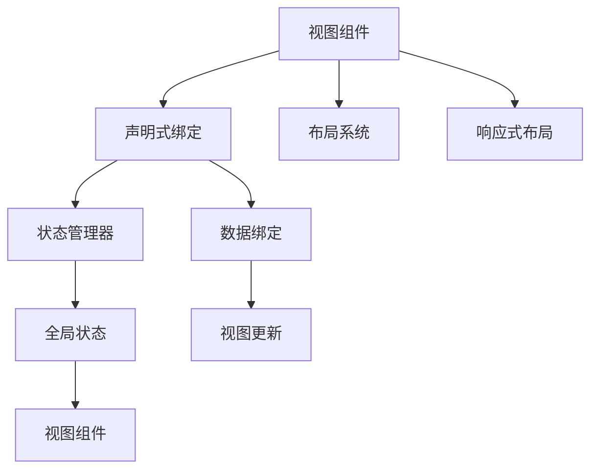

                 

# iOS SwiftUI应用开发

> 关键词：SwiftUI, iOS, 应用程序, 界面设计, 用户体验, 数据绑定, 响应式界面

## 1. 背景介绍

### 1.1 问题由来

在移动互联网时代，移动应用程序（App）已经成为人们日常生活不可或缺的一部分。无论是社交媒体、金融理财，还是教育培训、娱乐游戏，App已经深入到各个领域，影响着人们的决策和生活方式。

然而，开发一款高效、易用、稳定的App并非易事。传统的App开发方式依赖于原生的Objective-C或Swift编程语言，需要开发者具备丰富的界面设计和编程技能。即使使用MVC、MVVM等设计模式，也难以避免代码冗余、维护困难等问题。

为解决这一问题，Apple在2019年的WWDC上推出了SwiftUI框架，旨在简化移动应用程序的开发，让开发者能够更加专注于界面设计和用户体验，而不是繁重的底层编程工作。

### 1.2 问题核心关键点

SwiftUI的核心思想是“声明式编程”，通过声明方式定义界面的布局、样式、交互逻辑等，从而构建响应式界面。开发者只需关注最终呈现的界面，而不需要关注界面如何渲染、如何响应用户交互等底层实现细节。

SwiftUI的优势在于：

1. 声明式编程：开发者只需关注界面的设计和状态，而无需关注界面渲染和响应机制。
2. 可重用组件：通过组合和复用组件，提升开发效率。
3. 响应式布局：动态调整界面元素的大小和位置，提升用户体验。
4. 全局状态管理：通过全局状态管理器，统一管理App的状态。
5. 声明式绑定：通过声明式绑定，提升数据的响应性和交互性。

SwiftUI的这些特点，使得移动应用程序开发变得更加高效、灵活和易于维护。

## 2. 核心概念与联系

### 2.1 核心概念概述

SwiftUI框架的开发涉及多个核心概念，包括声明式编程、视图组件、状态管理、响应式绑定等。以下是这些核心概念的概述：

- 视图组件(View Component)：SwiftUI的基本构建块，通过组合和复用视图组件，实现复杂的用户界面。
- 声明式绑定(Declarative Binding)：通过声明式绑定，将视图组件与数据模型进行关联，实现数据的动态更新和响应用户交互。
- 状态管理器(State Manager)：用于管理App的全局状态，使得视图组件能够共享和同步状态数据。
- 布局系统(Layout System)：用于定义界面的布局和尺寸，自动适应不同尺寸的屏幕。

### 2.2 核心概念原理和架构的 Mermaid 流程图



这个Mermaid流程图展示了SwiftUI的核心概念和架构。开发者只需关注视图组件的设计和数据绑定，状态管理器自动管理App的全局状态，布局系统负责界面布局，响应式布局自动适应不同尺寸的屏幕。

## 3. 核心算法原理 & 具体操作步骤

### 3.1 算法原理概述

SwiftUI的核心算法原理基于声明式编程和响应式编程。通过声明方式定义视图组件和数据绑定，SwiftUI能够自动处理界面的渲染和数据更新，提升开发效率和用户体验。

SwiftUI的声明式编程思想类似于函数式编程，通过定义函数的输入和输出，自动计算函数的内部状态和结果。SwiftUI的响应式编程则基于事件驱动的机制，当用户交互发生时，SwiftUI自动更新视图组件的状态，并重新渲染界面。

### 3.2 算法步骤详解

SwiftUI的开发步骤包括以下几个关键步骤：

**Step 1: 创建视图组件**

创建视图组件是SwiftUI开发的第一步。视图组件是界面的基本构建块，可以通过组合和复用来构建复杂的用户界面。

```swift
struct MyView: View {
    var name: String
    var age: Int
    var body: some View {
        Text("My name is \(name) and I'm \(numeral(age)) years old.")
    }
}
```

在这个例子中，`MyView`是一个简单的视图组件，包含一个字符串`name`和一个整数`age`。通过定义`name`和`age`的绑定，可以将用户输入的数据动态更新到组件中。

**Step 2: 声明式绑定**

声明式绑定是SwiftUI的核心特性之一。通过声明式绑定，可以将视图组件与数据模型进行关联，实现数据的动态更新和响应用户交互。

```swift
struct MyView: View {
    @State var name: String = ""
    @State var age: Int = 0
    var body: some View {
        TextField("Name: ", text: $name)
        TextField("Age: ", value: $age)
        Text("My name is \(name) and I'm \(numeral(age)) years old.")
    }
}
```

在这个例子中，`$name`和`$age`是视图组件的声明式绑定，分别绑定了文本输入框中的数据。当用户在文本输入框中输入数据时，视图组件会自动更新这些数据，并重新渲染界面。

**Step 3: 全局状态管理**

全局状态管理器是SwiftUI管理App状态的核心工具。通过全局状态管理器，可以在App中统一管理和共享状态数据，提升代码的可维护性和可复用性。

```swift
struct MyApp: App {
    @State var count: Int = 0
    var body: some Scene {
        WindowGroup {
            Text("Count: \(count)")
            Button(action: {
                count += 1
            }) {
                Text("Increment")
            }
        }
    }
}
```

在这个例子中，`count`是全局状态变量，通过声明式绑定绑定到文本标签和按钮上。当用户点击按钮时，全局状态自动更新，并重新渲染界面。

**Step 4: 布局系统**

SwiftUI的布局系统用于定义界面的布局和尺寸，自动适应不同尺寸的屏幕。SwiftUI提供了多种布局方式，如`HStack`、`VStack`、`Grid`等，可以灵活地组合布局元素。

```swift
struct MyLayout: View {
    var body: some View {
        HStack {
            VStack {
                Text("Hello")
                Text("World")
            }
            spacer()
            VStack {
                Text("Name: ")
                TextField("John")
            }
        }
    }
}
```

在这个例子中，`HStack`和`VStack`用于组合布局元素，`spacer()`用于填充布局，`TextField`用于输入文本。通过定义布局系统，可以实现灵活的的界面布局。

### 3.3 算法优缺点

SwiftUI的优点在于：

1. 简化开发流程：声明式编程和响应式绑定使得开发流程更加简单高效。
2. 提升开发效率：视图组件和声明式绑定提升代码的可重用性和可维护性。
3. 提高用户体验：响应式布局和全局状态管理器提升用户交互的流畅性和响应性。

SwiftUI的缺点在于：

1. 学习曲线较陡：声明式编程和响应式绑定需要一定的学习成本。
2. 性能问题：在大型App中，响应式绑定可能导致性能问题。
3. 兼容性问题：SwiftUI与其他框架和工具的兼容性问题。

## 4. 数学模型和公式 & 详细讲解 & 举例说明

### 4.1 数学模型构建

SwiftUI的数学模型主要涉及声明式绑定和响应式绑定。通过声明式绑定，将视图组件与数据模型进行关联，实现数据的动态更新和响应用户交互。

### 4.2 公式推导过程

声明式绑定的数学模型如下：

$$
\text{Output} = f(\text{Input}, \text{State})
$$

其中，`Output`为视图组件的输出，`Input`为用户输入的数据，`State`为视图组件的状态。

响应式绑定的数学模型如下：

$$
\text{State} = g(\text{Output}, \text{Input})
$$

其中，`State`为视图组件的状态，`Output`为用户交互的数据，`Input`为视图组件的输入。

通过这两个公式，SwiftUI能够自动处理界面的渲染和数据更新，提升开发效率和用户体验。

### 4.3 案例分析与讲解

以下是一个简单的SwiftUI应用示例，展示了声明式绑定和全局状态管理的应用。

```swift
struct ContentView: View {
    @State var count = 0
    var body: some View {
        VStack {
            Text("Count: \(count)")
            Button(action: {
                count += 1
            }) {
                Text("Increment")
            }
        }
    }
}

let app = MyApp()
app.runAppContentView()
```

在这个例子中，`count`是全局状态变量，绑定到文本标签和按钮上。当用户点击按钮时，全局状态自动更新，并重新渲染界面。

## 5. 项目实践：代码实例和详细解释说明

### 5.1 开发环境搭建

要使用SwiftUI进行App开发，需要以下开发环境：

1. Xcode：最新版本的Xcode支持SwiftUI的开发。
2. iOS模拟器：用于测试和调试App。
3. Swift版本：Swift 5.3及以上版本。

在Xcode中，可以通过创建新的SwiftUI项目来快速搭建开发环境。

### 5.2 源代码详细实现

以下是一个简单的SwiftUI应用示例，展示了声明式绑定和全局状态管理的应用。

```swift
struct ContentView: View {
    @State var count = 0
    var body: some View {
        VStack {
            Text("Count: \(count)")
            Button(action: {
                count += 1
            }) {
                Text("Increment")
            }
        }
    }
}

struct MyApp: App {
    @State var count = 0
    var body: some Scene {
        WindowGroup {
            ContentView(count: $count)
        }
    }
}

let app = MyApp()
app.runAppContentView()
```

在这个例子中，`count`是全局状态变量，绑定到文本标签和按钮上。当用户点击按钮时，全局状态自动更新，并重新渲染界面。

### 5.3 代码解读与分析

以下是代码的详细解读和分析：

**ContentView结构体**

```swift
struct ContentView: View {
    @State var count = 0
    var body: some View {
        VStack {
            Text("Count: \(count)")
            Button(action: {
                count += 1
            }) {
                Text("Increment")
            }
        }
    }
}
```

- `@State`声明了全局状态变量`count`。
- `count`绑定到文本标签和按钮上，当用户点击按钮时，`count`自动更新，并重新渲染界面。
- `VStack`用于组合布局元素，文本标签显示`count`的值，按钮用于增量更新`count`的值。

**MyApp结构体**

```swift
struct MyApp: App {
    @State var count = 0
    var body: some Scene {
        WindowGroup {
            ContentView(count: $count)
        }
    }
}
```

- `@State`声明了全局状态变量`count`。
- `count`绑定到ContentView中的全局状态变量，使得CountView中的按钮点击事件能够自动更新App的全局状态。
- `WindowGroup`用于创建App窗口，并将ContentView添加到窗口中。

### 5.4 运行结果展示

运行这个应用，可以在模拟器中看到文本标签和按钮的显示。当用户点击按钮时，文本标签的值自动更新，并重新渲染界面。

```swift
▸ ▸▸ Count: 0
Increment

▸ ▸▸ Count: 1
Increment

▸ ▸▸ Count: 2
Increment
```

## 6. 实际应用场景

SwiftUI的应用场景非常广泛，涵盖了社交媒体、金融理财、教育培训、娱乐游戏等多个领域。以下是几个典型的应用场景：

### 6.1 社交媒体应用

在社交媒体应用中，SwiftUI可以用于创建动态消息流、用户主页、聊天界面等。通过声明式绑定和响应式布局，可以创建流畅、易用的界面，提升用户体验。

### 6.2 金融理财应用

在金融理财应用中，SwiftUI可以用于创建账户管理、投资组合、交易记录等界面。通过全局状态管理器和声明式绑定，可以创建安全、高效的界面，提升用户操作性。

### 6.3 教育培训应用

在教育培训应用中，SwiftUI可以用于创建课程列表、学习笔记、作业提交等界面。通过视图组件和布局系统，可以创建清晰、易用的界面，提升学习效率。

### 6.4 娱乐游戏应用

在娱乐游戏应用中，SwiftUI可以用于创建游戏界面、角色控制、道具管理等。通过声明式绑定和响应式布局，可以创建流畅、沉浸式的游戏体验，提升用户粘性。

### 6.5 未来应用展望

未来，SwiftUI的应用场景将更加广泛，涵盖更多领域。以下是一些未来应用展望：

1. 医疗健康应用：通过SwiftUI创建健康监测、远程诊疗、康复训练等界面。
2. 智能家居应用：通过SwiftUI创建智能家电控制、环境监测、安全报警等界面。
3. 工业制造应用：通过SwiftUI创建设备监控、生产调度、质量管理等界面。
4. 环境保护应用：通过SwiftUI创建环境监测、能源管理、生态保护等界面。

随着SwiftUI的不断发展和完善，其在各个领域的落地应用将越来越广泛，为人类社会带来更多便利和创新。

## 7. 工具和资源推荐

### 7.1 学习资源推荐

要学习SwiftUI的开发，以下是一些推荐的资源：

1. 官方文档：Apple提供的SwiftUI官方文档，包含详细的API说明和示例代码。
2. 《SwiftUI权威指南》：一本介绍SwiftUI开发的经典书籍，涵盖了SwiftUI的核心概念和应用场景。
3. Ray Wenderlich的SwiftUI教程：详细讲解SwiftUI的基本概念和开发流程。
4. Hacking with Swift的SwiftUI系列：提供SwiftUI的实战应用示例，帮助开发者快速上手。

### 7.2 开发工具推荐

要使用SwiftUI进行App开发，以下是一些推荐的开发工具：

1. Xcode：最新版本的Xcode支持SwiftUI的开发，提供了丰富的开发工具和调试功能。
2. Playground：Xcode提供的SwiftUI playground，可以用于测试和调试SwiftUI应用。
3. App Store Connect：Apple提供的App Store Connect平台，可以用于发布和管理SwiftUI应用。

### 7.3 相关论文推荐

要深入了解SwiftUI的开发，以下是一些推荐的论文：

1. "The Story of SwiftUI"：Apple提供的SwiftUI开发背景和演进历程。
2. "SwiftUI by Example"：一篇介绍SwiftUI开发实践的论文，包含多个实际应用的示例代码。
3. "SwiftUI Architecture"：一篇讨论SwiftUI架构设计的论文，涵盖视图组件、声明式绑定、状态管理等核心概念。

## 8. 总结：未来发展趋势与挑战

### 8.1 研究成果总结

SwiftUI的开发大大简化了移动应用程序的开发流程，提升了开发效率和用户体验。通过声明式编程和响应式绑定，开发者可以更加专注于界面设计和用户体验，而不必关注底层编程细节。

### 8.2 未来发展趋势

SwiftUI的未来发展趋势包括以下几个方面：

1. 增强组件库：Apple将不断扩展SwiftUI的组件库，提供更多预定义组件和自定义组件。
2. 优化性能：Apple将不断优化SwiftUI的性能，提升大尺寸界面的渲染效率和响应性能。
3. 引入新特性：Apple将不断引入新的特性和功能，提升SwiftUI的开发体验和应用场景。
4. 完善文档：Apple将不断完善SwiftUI的文档和示例，帮助开发者更好地学习和应用SwiftUI。

### 8.3 面临的挑战

SwiftUI的开发也面临一些挑战：

1. 学习曲线较陡：声明式编程和响应式绑定需要一定的学习成本。
2. 性能问题：在大型App中，响应式绑定可能导致性能问题。
3. 兼容性问题：SwiftUI与其他框架和工具的兼容性问题。

### 8.4 研究展望

未来，SwiftUI的研究方向包括以下几个方面：

1. 增强组件库：不断扩展SwiftUI的组件库，提供更多预定义组件和自定义组件。
2. 优化性能：优化SwiftUI的性能，提升大尺寸界面的渲染效率和响应性能。
3. 引入新特性：引入新的特性和功能，提升SwiftUI的开发体验和应用场景。
4. 完善文档：完善SwiftUI的文档和示例，帮助开发者更好地学习和应用SwiftUI。

## 9. 附录：常见问题与解答

**Q1: 如何使用SwiftUI创建动态消息流？**

A: 通过声明式绑定和响应式布局，可以创建动态消息流。首先创建一个消息列表视图组件，然后绑定消息数据和视图组件，当新消息到来时，自动更新视图组件的数据，并重新渲染界面。

**Q2: SwiftUI的响应式布局是如何实现的？**

A: SwiftUI的响应式布局基于`Layout`和`Alignment`系统，通过定义布局和对齐方式，自动适应不同尺寸的屏幕。SwiftUI提供了多种布局方式，如`HStack`、`VStack`、`Grid`等，可以灵活地组合布局元素。

**Q3: 如何在SwiftUI中实现全局状态管理？**

A: 通过全局状态管理器，可以在App中统一管理和共享状态数据。首先创建一个全局状态变量，然后将其绑定到视图组件上，当状态发生变化时，自动更新视图组件的数据，并重新渲染界面。

**Q4: SwiftUI的声明式绑定是如何实现的？**

A: 声明式绑定通过将视图组件与数据模型进行关联，实现数据的动态更新和响应用户交互。声明式绑定通过`@State`、`@Binding`、`@ObservedObject`等属性声明，将数据模型绑定到视图组件上，当数据模型发生变化时，自动更新视图组件的数据，并重新渲染界面。

**Q5: SwiftUI的性能问题如何解决？**

A: SwiftUI的性能问题可以通过以下几种方式解决：
1. 使用`Lazy`视图：对于只有在某些条件下才会渲染的视图，可以使用`Lazy`视图，减少不必要的渲染。
2. 使用`Text`视图的`String`初始化方式：使用`Text`视图的`String`初始化方式，可以避免不必要的计算和渲染。
3. 使用`ForEach`循环：对于大量数据的展示，可以使用`ForEach`循环，提高渲染效率。

---

作者：禅与计算机程序设计艺术 / Zen and the Art of Computer Programming

