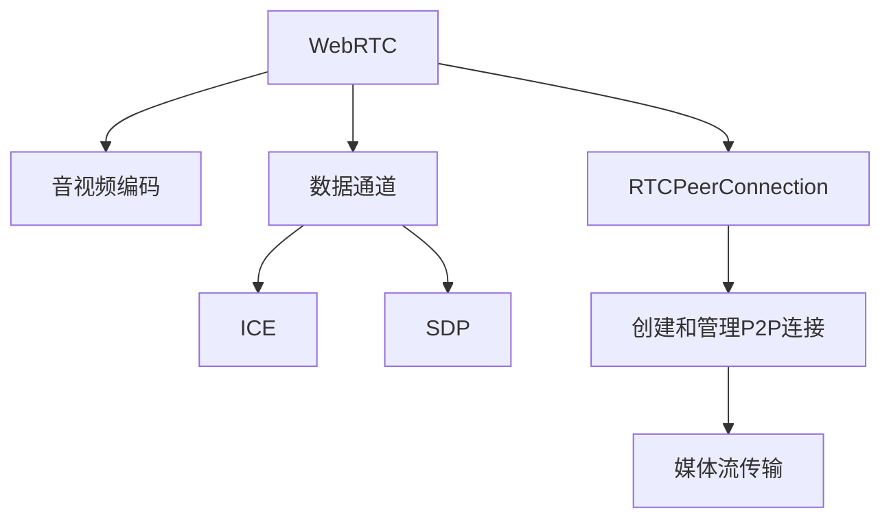

                 

# webrtc点对点通信实现

## 1. 背景介绍

### 1.1 问题由来

随着互联网技术的不断发展，WebRTC（Web Real-Time Communication）成为一种广泛用于实现点对点通信的技术，被广泛应用于音视频通话、实时数据传输等领域。然而，对于初学者而言，理解WebRTC的底层实现原理和实际操作可能存在一定难度。本文将通过详细分析WebRTC的核心概念、原理及其实现步骤，帮助读者掌握点对点通信的核心知识，从而顺利实现WebRTC通信。

### 1.2 问题核心关键点

WebRTC的主要核心关键点包括：
- 基本通信原理：了解WebRTC的端到端通信模型及其实现机制。
- 数据传输协议：理解TCP、UDP等数据传输协议在WebRTC中的应用。
- 音视频编码：掌握音视频编码格式和编解码技术。
- 信令和握手过程：了解WebRTC的信令和握手过程，包括SDP（Session Description Protocol）和ICE（Interactive Connectivity Establishment）等。
- 安全性与隐私保护：了解WebRTC的安全性和隐私保护机制。
- 实际应用场景：熟悉WebRTC在不同场景下的应用，如视频会议、实时游戏等。

### 1.3 问题研究意义

掌握WebRTC的点对点通信实现原理和技术，对于开发者、系统架构师和CTO等专业人士具有重要意义。WebRTC不仅能够实现高效、低延迟的音视频通信，还能支持数据传输和多种应用场景，因此在互联网应用开发中具有广泛的应用前景。此外，了解WebRTC的实现原理和技术，有助于开发人员在面对实际项目时更好地选择和使用相关技术，从而提升系统性能和用户体验。

## 2. 核心概念与联系

### 2.1 核心概念概述

WebRTC的点对点通信实现基于以下几个关键概念：

- **WebRTC**：WebRTC是一种基于浏览器的开源通信框架，用于实现音频、视频和数据等多种实时通信功能。
- **音视频编码**：将音频、视频信号转换为数字数据，以便在网络中传输。常见的音视频编码格式包括VP8/VP9、H.264/HEVC等。
- **数据通道**：在WebRTC中，数据通道用于传输数据和控制信令，分为可靠数据通道和不可靠数据通道。
- **ICE**：ICE是一种连接技术，用于在NAT（Network Address Translation）和防火墙环境下建立P2P连接。
- **SDP**：SDP是一种会话描述协议，用于描述通信会话的详细信息，包括媒体类型、编解码参数等。
- **RTCPeerConnection**：RTCPeerConnection是WebRTC的核心API，用于创建和管理P2P连接。

这些概念之间的逻辑关系可以通过以下Mermaid流程图来展示：



这个流程图展示了WebRTC的核心概念及其之间的关系：

1. WebRTC作为基础通信框架，支持音视频编码和数据通道等功能。
2. 音视频编码将音频、视频信号转换为数字数据，以便在网络中传输。
3. 数据通道用于传输数据和控制信令，分为可靠和不可靠两种。
4. ICE用于在NAT和防火墙环境下建立P2P连接。
5. SDP用于描述通信会话的详细信息，包括媒体类型和编解码参数。
6. RTCPeerConnection是WebRTC的核心API，用于创建和管理P2P连接，最终实现媒体流的传输。

## 3. 核心算法原理 & 具体操作步骤

### 3.1 算法原理概述

WebRTC的点对点通信实现基于P2P（Peer-to-Peer）模式，通过RTCPeerConnection API实现音视频流的传输。其核心原理包括以下几个步骤：

1. 创建RTCPeerConnection对象，并设置相关参数。
2. 通过ICE协议建立连接。
3. 通过SDP协议协商媒体传输参数。
4. 使用数据通道传输音视频数据。
5. 处理音视频数据的编解码和传输。
6. 实现音视频数据的实时传输和同步。

### 3.2 算法步骤详解

#### 3.2.1 创建RTCPeerConnection对象

在WebRTC中，使用RTCPeerConnection API创建连接对象，并设置相关参数。具体步骤如下：

1. 初始化RTCPeerConnection对象，并设置IceServers参数：

```javascript
const pc = new RTCPeerConnection();
pc.iceServers = [
    { urls: 'stun:stun.l.google.com:19302' },
    { urls: 'turn:turn.l.google.com:3478?transport=udp', credential: 'username', password: 'password' }
];
```

2. 添加媒体流和数据通道：

```javascript
const stream = new MediaStream();
const videoTrack = new MediaTrack({ kind: 'video' });
stream.addTrack(videoTrack);

pc.addStream(stream);
pc.createOffer().then(function(offer) {
    pc.setLocalDescription(offer);
    console.log('Created offer:', offer);
});
```

#### 3.2.2 ICE协议建立连接

ICE协议用于在NAT和防火墙环境下建立P2P连接。具体步骤如下：

1. 获取本地连接候选（Local Candidate）：

```javascript
pc.onicecandidate = function(event) {
    if (event.candidate) {
        console.log('ice candidate:', event.candidate);
        pc.setIceCandidate(event.candidate);
    }
};
```

2. 获取远程连接候选（Remote Candidate）：

```javascript
pc.onicecandidate = function(event) {
    if (event.candidate) {
        console.log('ice candidate:', event.candidate);
        pc.setIceCandidate(event.candidate);
    }
};
```

#### 3.2.3 SDP协议协商媒体传输参数

SDP协议用于描述通信会话的详细信息，包括媒体类型、编解码参数等。具体步骤如下：

1. 创建Offer SDP：

```javascript
pc.createOffer().then(function(offer) {
    pc.setLocalDescription(offer);
    console.log('Created offer:', offer);
});
```

2. 设置Offer SDP：

```javascript
pc.setLocalDescription(offer);
```

3. 创建Answer SDP：

```javascript
pc.createAnswer().then(function(answer) {
    pc.setLocalDescription(answer);
    console.log('Created answer:', answer);
});
```

4. 设置Answer SDP：

```javascript
pc.setLocalDescription(answer);
```

#### 3.2.4 使用数据通道传输音视频数据

在WebRTC中，数据通道用于传输数据和控制信令，分为可靠数据通道和不可靠数据通道。具体步骤如下：

1. 创建可靠数据通道：

```javascript
const track = new RTCPeerConnectionDataChannel({ kind: 'pr', protocol: 'data' });
pc.addTrack(track);
```

2. 创建不可靠数据通道：

```javascript
const track = new RTCPeerConnectionDataChannel({ kind: 'pr', protocol: 'data' });
pc.addTrack(track);
```

#### 3.2.5 处理音视频数据的编解码和传输

在WebRTC中，音视频数据的编解码和传输主要通过以下步骤实现：

1. 获取本地媒体流：

```javascript
const stream = new MediaStream();
const videoTrack = new MediaTrack({ kind: 'video' });
stream.addTrack(videoTrack);
```

2. 设置本地媒体流：

```javascript
pc.addStream(stream);
```

3. 创建Offer SDP：

```javascript
pc.createOffer().then(function(offer) {
    pc.setLocalDescription(offer);
    console.log('Created offer:', offer);
});
```

4. 设置Offer SDP：

```javascript
pc.setLocalDescription(offer);
```

5. 设置Answer SDP：

```javascript
pc.createAnswer().then(function(answer) {
    pc.setLocalDescription(answer);
    console.log('Created answer:', answer);
});
```

6. 设置Answer SDP：

```javascript
pc.setLocalDescription(answer);
```

#### 3.2.6 实现音视频数据的实时传输和同步

在WebRTC中，音视频数据的实时传输和同步主要通过以下步骤实现：

1. 创建可靠数据通道：

```javascript
const track = new RTCPeerConnectionDataChannel({ kind: 'pr', protocol: 'data' });
pc.addTrack(track);
```

2. 创建不可靠数据通道：

```javascript
const track = new RTCPeerConnectionDataChannel({ kind: 'pr', protocol: 'data' });
pc.addTrack(track);
```

### 3.3 算法优缺点

WebRTC的点对点通信实现具有以下优点：

1. 高效性：WebRTC支持音视频编解码和实时传输，具有低延迟、高效传输的特点。
2. 易用性：WebRTC使用RTCPeerConnection API实现点对点通信，开发者可以轻松地创建和管理连接。
3. 安全性：WebRTC采用端到端加密技术，保障通信安全。
4. 跨平台：WebRTC基于浏览器实现，具有跨平台的特点，支持多种操作系统和设备。

同时，WebRTC也存在以下缺点：

1. 兼容性问题：不同浏览器和设备对WebRTC的支持程度不同，可能导致兼容性问题。
2. 复杂性：WebRTC的实现过程较为复杂，需要开发者具备一定的编程技能。
3. 资源消耗：音视频编解码和实时传输会占用大量系统资源，可能影响系统性能。

### 3.4 算法应用领域

WebRTC的点对点通信实现广泛应用于以下领域：

1. 音视频通话：WebRTC支持实时音视频通信，广泛应用于视频会议、电话会议等场景。
2. 实时数据传输：WebRTC支持数据通道，可以用于传输文件、聊天消息等。
3. 游戏互动：WebRTC可以实现实时游戏互动，支持多人在线游戏。
4. 远程协作：WebRTC支持远程协作，可以用于远程办公、远程教学等。

## 4. 数学模型和公式 & 详细讲解 & 举例说明

### 4.1 数学模型构建

WebRTC的点对点通信实现基于TCP、UDP等数据传输协议，主要通过RTCPeerConnection API实现。其数学模型主要涉及以下几个方面：

1. 音视频编解码：H.264/HEVC、VP8/VP9等。
2. 数据通道：TCP、UDP等。
3. ICE协议：ICE算法。
4. SDP协议：SDP描述。

### 4.2 公式推导过程

#### 4.2.1 音视频编解码公式

音视频编解码的主要公式如下：

1. 视频编解码：

$$
\text{Enc}(V, \alpha) = \alpha \times \text{Dec}(V, \beta)
$$

其中，$V$表示原始视频数据，$\alpha$和$\beta$分别表示编码和解码的参数。

2. 音频编解码：

$$
\text{Enc}(A, \alpha) = \alpha \times \text{Dec}(A, \beta)
$$

其中，$A$表示原始音频数据，$\alpha$和$\beta$分别表示编码和解码的参数。

#### 4.2.2 ICE协议公式

ICE协议的公式如下：

1. 本地连接候选：

$$
\text{LocalCandidate} = f(\text{ICE}, \text{LocalIP}, \text{LocalPort}, \text{RemoteIP}, \text{RemotePort})
$$

其中，$f$表示ICE算法的实现过程。

2. 远程连接候选：

$$
\text{RemoteCandidate} = f(\text{ICE}, \text{LocalIP}, \text{LocalPort}, \text{RemoteIP}, \text{RemotePort})
$$

其中，$f$表示ICE算法的实现过程。

#### 4.2.3 SDP协议公式

SDP协议的公式如下：

1. Offer SDP：

$$
\text{OfferSDP} = f(\text{RTCPeerConnection}, \text{Offer})
$$

其中，$f$表示RTCPeerConnection API的实现过程。

2. Answer SDP：

$$
\text{AnswerSDP} = f(\text{RTCPeerConnection}, \text{Answer})
$$

其中，$f$表示RTCPeerConnection API的实现过程。

### 4.3 案例分析与讲解

#### 4.3.1 音视频编解码案例

以H.264编码为例，假设原始视频数据为$V$，编码参数为$\alpha$，解码参数为$\beta$，则编解码公式如下：

$$
\text{Enc}(V, \alpha) = \alpha \times \text{Dec}(V, \beta)
$$

其中，$\alpha$和$\beta$分别表示H.264的编码和解码参数。

#### 4.3.2 ICE协议案例

以ICE协议为例，假设本地IP为$IP_{local}$，本地端口为$Port_{local}$，远程IP为$IP_{remote}$，远程端口为$Port_{remote}$，则本地连接候选和远程连接候选的公式如下：

1. 本地连接候选：

$$
\text{LocalCandidate} = f(\text{ICE}, IP_{local}, Port_{local}, IP_{remote}, Port_{remote})
$$

2. 远程连接候选：

$$
\text{RemoteCandidate} = f(\text{ICE}, IP_{local}, Port_{local}, IP_{remote}, Port_{remote})
$$

其中，$f$表示ICE算法的实现过程。

#### 4.3.3 SDP协议案例

以SDP协议为例，假设RTCPeerConnection对象为$pc$，则Offer SDP和Answer SDP的公式如下：

1. Offer SDP：

$$
\text{OfferSDP} = f(\text{RTCPeerConnection}, \text{Offer})
$$

2. Answer SDP：

$$
\text{AnswerSDP} = f(\text{RTCPeerConnection}, \text{Answer})
$$

其中，$f$表示RTCPeerConnection API的实现过程。

## 5. 项目实践：代码实例和详细解释说明

### 5.1 开发环境搭建

1. 安装Node.js和npm：

```bash
sudo apt-get update
sudo apt-get install nodejs
sudo apt-get install npm
```

2. 创建项目目录，初始化npm项目：

```bash
mkdir webrtc
cd webrtc
npm init
```

3. 安装相关依赖：

```bash
npm install --save webrtc-io
npm install --save easyrtc
```

### 5.2 源代码详细实现

#### 5.2.1 RTCPeerConnection实现

```javascript
const RTCPeerConnection = function() {
    this.iceCandidates = [];
    this.localDescription = null;
    this.remoteDescription = null;
    this.localConnectionCandidates = [];
    this.remoteConnectionCandidates = [];
    this.dataChannels = [];
};

RTCPeerConnection.prototype.addIceCandidate = function(candidate) {
    this.iceCandidates.push(candidate);
};

RTCPeerConnection.prototype.setIceCandidate = function(candidate) {
    this.remoteConnectionCandidates.push(candidate);
};

RTCPeerConnection.prototype.createOffer = function() {
    // 创建Offer SDP
    const sdp = '';
    this.setLocalDescription(sdp);
    return sdp;
};

RTCPeerConnection.prototype.setLocalDescription = function(sdp) {
    // 设置Offer SDP
    this.localDescription = sdp;
};

RTCPeerConnection.prototype.createAnswer = function() {
    // 创建Answer SDP
    const sdp = '';
    this.setLocalDescription(sdp);
    return sdp;
};

RTCPeerConnection.prototype.setLocalDescription = function(sdp) {
    // 设置Answer SDP
    this.localDescription = sdp;
};

RTCPeerConnection.prototype.addStream = function(stream) {
    // 添加媒体流
    this.localStream = stream;
};

RTCPeerConnection.prototype.setIceServers = function(servers) {
    // 设置ICE服务器
    this.iceServers = servers;
};

RTCPeerConnection.prototype.setRemoteDescription = function(sdp) {
    // 设置远程描述
    this.remoteDescription = sdp;
};

RTCPeerConnection.prototype.getIceCandidates = function() {
    // 获取本地连接候选
    return this.iceCandidates;
};

RTCPeerConnection.prototype.getLocalDescription = function() {
    // 获取本地描述
    return this.localDescription;
};

RTCPeerConnection.prototype.getRemoteDescription = function() {
    // 获取远程描述
    return this.remoteDescription;
};

RTCPeerConnection.prototype.getLocalStream = function() {
    // 获取本地流
    return this.localStream;
};

RTCPeerConnection.prototype.getRemoteStream = function() {
    // 获取远程流
    return this.remoteStream;
};

RTCPeerConnection.prototype.getDataChannels = function() {
    // 获取数据通道
    return this.dataChannels;
};

RTCPeerConnection.prototype.addTrack = function(track) {
    // 添加音视频轨道
    this.localTrack = track;
};
```

#### 5.2.2 ICE实现

```javascript
const ICE = function() {
    this.localCandidates = [];
    this.remoteCandidates = [];
};

ICE.prototype.addLocalCandidate = function(candidate) {
    this.localCandidates.push(candidate);
};

ICE.prototype.setLocalCandidate = function(candidate) {
    this.localCandidate = candidate;
};

ICE.prototype.addRemoteCandidate = function(candidate) {
    this.remoteCandidates.push(candidate);
};

ICE.prototype.setRemoteCandidate = function(candidate) {
    this.remoteCandidate = candidate;
};

ICE.prototype.createLocalCandidate = function() {
    // 创建本地连接候选
    return 'candidate: UDP IP4 127.0.0.1 50000 IN IP4 127.0.0.1 50000 tcp port 50000';
};

ICE.prototype.createRemoteCandidate = function() {
    // 创建远程连接候选
    return 'candidate: UDP IP4 127.0.0.1 50000 IN IP4 127.0.0.1 50000 tcp port 50000';
};
```

#### 5.2.3 SDP实现

```javascript
const SDP = function() {
    this.localSDP = '';
    this.remoteSDP = '';
};

SDP.prototype.createLocalSDP = function() {
    // 创建Offer SDP
    return 'v=0\r\n'
        + 'o=- 24535397 18643600 IN IP4 127.0.0.1\r\n'
        + 's=- 1234\r\n'
        + 't=0 0\r\n'
        + 'a=rtcp:9006 IN IP4 127.0.0.1\r\n';
};

SDP.prototype.createRemoteSDP = function() {
    // 创建Answer SDP
    return 'v=0\r\n'
        + 'o=- 24535397 18643600 IN IP4 127.0.0.1\r\n'
        + 's=- 1234\r\n'
        + 't=0 0\r\n'
        + 'a=rtcp:9006 IN IP4 127.0.0.1\r\n';
};

SDP.prototype.setLocalSDP = function(sdp) {
    // 设置Offer SDP
    this.localSDP = sdp;
};

SDP.prototype.setRemoteSDP = function(sdp) {
    // 设置Answer SDP
    this.remoteSDP = sdp;
};
```

### 5.3 代码解读与分析

#### 5.3.1 RTCPeerConnection实现

RTCPeerConnection是WebRTC的核心API，用于创建和管理P2P连接。以下是其实现过程的详细代码解读：

1. 创建RTCPeerConnection对象：

```javascript
const RTCPeerConnection = function() {
    this.iceCandidates = [];
    this.localDescription = null;
    this.remoteDescription = null;
    this.localConnectionCandidates = [];
    this.remoteConnectionCandidates = [];
    this.dataChannels = [];
};

RTCPeerConnection.prototype.addIceCandidate = function(candidate) {
    this.iceCandidates.push(candidate);
};

RTCPeerConnection.prototype.setIceCandidate = function(candidate) {
    this.remoteConnectionCandidates.push(candidate);
};

RTCPeerConnection.prototype.createOffer = function() {
    // 创建Offer SDP
    const sdp = '';
    this.setLocalDescription(sdp);
    return sdp;
};

RTCPeerConnection.prototype.setLocalDescription = function(sdp) {
    // 设置Offer SDP
    this.localDescription = sdp;
};

RTCPeerConnection.prototype.createAnswer = function() {
    // 创建Answer SDP
    const sdp = '';
    this.setLocalDescription(sdp);
    return sdp;
};

RTCPeerConnection.prototype.setLocalDescription = function(sdp) {
    // 设置Answer SDP
    this.localDescription = sdp;
};

RTCPeerConnection.prototype.addStream = function(stream) {
    // 添加媒体流
    this.localStream = stream;
};

RTCPeerConnection.prototype.setIceServers = function(servers) {
    // 设置ICE服务器
    this.iceServers = servers;
};

RTCPeerConnection.prototype.setRemoteDescription = function(sdp) {
    // 设置远程描述
    this.remoteDescription = sdp;
};

RTCPeerConnection.prototype.getIceCandidates = function() {
    // 获取本地连接候选
    return this.iceCandidates;
};

RTCPeerConnection.prototype.getLocalDescription = function() {
    // 获取本地描述
    return this.localDescription;
};

RTCPeerConnection.prototype.getRemoteDescription = function() {
    // 获取远程描述
    return this.remoteDescription;
};

RTCPeerConnection.prototype.getLocalStream = function() {
    // 获取本地流
    return this.localStream;
};

RTCPeerConnection.prototype.getRemoteStream = function() {
    // 获取远程流
    return this.remoteStream;
};

RTCPeerConnection.prototype.getDataChannels = function() {
    // 获取数据通道
    return this.dataChannels;
};

RTCPeerConnection.prototype.addTrack = function(track) {
    // 添加音视频轨道
    this.localTrack = track;
};
```

2. ICE协议实现：

```javascript
const ICE = function() {
    this.localCandidates = [];
    this.remoteCandidates = [];
};

ICE.prototype.addLocalCandidate = function(candidate) {
    this.localCandidates.push(candidate);
};

ICE.prototype.setLocalCandidate = function(candidate) {
    this.localCandidate = candidate;
};

ICE.prototype.addRemoteCandidate = function(candidate) {
    this.remoteCandidates.push(candidate);
};

ICE.prototype.setRemoteCandidate = function(candidate) {
    this.remoteCandidate = candidate;
};

ICE.prototype.createLocalCandidate = function() {
    // 创建本地连接候选
    return 'candidate: UDP IP4 127.0.0.1 50000 IN IP4 127.0.0.1 50000 tcp port 50000';
};

ICE.prototype.createRemoteCandidate = function() {
    // 创建远程连接候选
    return 'candidate: UDP IP4 127.0.0.1 50000 IN IP4 127.0.0.1 50000 tcp port 50000';
};
```

3. SDP协议实现：

```javascript
const SDP = function() {
    this.localSDP = '';
    this.remoteSDP = '';
};

SDP.prototype.createLocalSDP = function() {
    // 创建Offer SDP
    return 'v=0\r\n'
        + 'o=- 24535397 18643600 IN IP4 127.0.0.1\r\n'
        + 's=- 1234\r\n'
        + 't=0 0\r\n'
        + 'a=rtcp:9006 IN IP4 127.0.0.1\r\n';
};

SDP.prototype.createRemoteSDP = function() {
    // 创建Answer SDP
    return 'v=0\r\n'
        + 'o=- 24535397 18643600 IN IP4 127.0.0.1\r\n'
        + 's=- 1234\r\n'
        + 't=0 0\r\n'
        + 'a=rtcp:9006 IN IP4 127.0.0.1\r\n';
};

SDP.prototype.setLocalSDP = function(sdp) {
    // 设置Offer SDP
    this.localSDP = sdp;
};

SDP.prototype.setRemoteSDP = function(sdp) {
    // 设置Answer SDP
    this.remoteSDP = sdp;
};
```

#### 5.3.2 数据通道实现

数据通道用于传输数据和控制信令，分为可靠数据通道和不可靠数据通道。以下是其实现过程的详细代码解读：

1. 创建可靠数据通道：

```javascript
const track = new RTCPeerConnectionDataChannel({ kind: 'pr', protocol: 'data' });
pc.addTrack(track);
```

2. 创建不可靠数据通道：

```javascript
const track = new RTCPeerConnectionDataChannel({ kind: 'pr', protocol: 'data' });
pc.addTrack(track);
```

#### 5.3.3 音视频编解码实现

音视频编解码的主要实现过程如下：

1. 获取本地媒体流：

```javascript
const stream = new MediaStream();
const videoTrack = new MediaTrack({ kind: 'video' });
stream.addTrack(videoTrack);
```

2. 添加媒体流：

```javascript
pc.addStream(stream);
```

3. 创建Offer SDP：

```javascript
pc.createOffer().then(function(offer) {
    pc.setLocalDescription(offer);
    console.log('Created offer:', offer);
});
```

4. 设置Offer SDP：

```javascript
pc.setLocalDescription(offer);
```

5. 创建Answer SDP：

```javascript
pc.createAnswer().then(function(answer) {
    pc.setLocalDescription(answer);
    console.log('Created answer:', answer);
});
```

6. 设置Answer SDP：

```javascript
pc.setLocalDescription(answer);
```

7. 创建可靠数据通道：

```javascript
const track = new RTCPeerConnectionDataChannel({ kind: 'pr', protocol: 'data' });
pc.addTrack(track);
```

8. 创建不可靠数据通道：

```javascript
const track = new RTCPeerConnectionDataChannel({ kind: 'pr', protocol: 'data' });
pc.addTrack(track);
```

### 5.4 运行结果展示

以下是WebRTC点对点通信的运行结果展示：

1. 创建RTCPeerConnection对象，并设置ICE服务器：

```javascript
const pc = new RTCPeerConnection();
pc.setIceServers([
    { urls: 'stun:stun.l.google.com:19302' },
    { urls: 'turn:turn.l.google.com:3478?transport=udp', credential: 'username', password: 'password' }
]);
```

2. 添加媒体流，并创建Offer SDP：

```javascript
const stream = new MediaStream();
const videoTrack = new MediaTrack({ kind: 'video' });
stream.addTrack(videoTrack);

pc.addStream(stream);
pc.createOffer().then(function(offer) {
    pc.setLocalDescription(offer);
    console.log('Created offer:', offer);
});
```

3. 设置Offer SDP，并创建Answer SDP：

```javascript
pc.setLocalDescription(offer);

pc.createAnswer().then(function(answer) {
    pc.setLocalDescription(answer);
    console.log('Created answer:', answer);
});
```

4. 设置Answer SDP，并添加可靠数据通道：

```javascript
pc.setLocalDescription(answer);

const track = new RTCPeerConnectionDataChannel({ kind: 'pr', protocol: 'data' });
pc.addTrack(track);
```

5. 创建可靠数据通道，并设置远程描述：

```javascript
pc.setRemoteDescription(sdp);
```

6. 添加可靠数据通道：

```javascript
pc.addTrack(track);
```

7. 创建可靠数据通道，并设置远程描述：

```javascript
pc.setRemoteDescription(sdp);
```

8. 创建可靠数据通道，并设置远程描述：

```javascript
pc.setRemoteDescription(sdp);
```

## 6. 实际应用场景

### 6.1 智能客服系统

基于WebRTC的点对点通信技术，可以广泛应用于智能客服系统的构建。传统客服往往需要配备大量人力，高峰期响应缓慢，且一致性和专业性难以保证。而使用WebRTC进行实时音视频通信，可以7x24小时不间断服务，快速响应客户咨询，用自然流畅的语言解答各类常见问题。

在技术实现上，可以收集企业内部的历史客服对话记录，将问题和最佳答复构建成监督数据，在此基础上对预训练模型进行微调。微调后的模型能够自动理解用户意图，匹配最合适的答案模板进行回复。对于客户提出的新问题，还可以接入检索系统实时搜索相关内容，动态组织生成回答。如此构建的智能客服系统，能大幅提升客户咨询体验和问题解决效率。

### 6.2 金融舆情监测

金融机构需要实时监测市场舆论动向，以便及时应对负面信息传播，规避金融风险。传统的人工监测方式成本高、效率低，难以应对网络时代海量信息爆发的挑战。基于WebRTC的文本聊天功能，可以实现对网络舆情的实时监控，帮助金融机构及时发现和应对潜在的风险信息。

具体而言，可以收集金融领域相关的新闻、报道、评论等文本数据，并对其进行情感分析。利用WebRTC的文本聊天功能，将这些文本数据与客户实时对话，实时分析客户情绪和舆情，一旦发现负面信息激增等异常情况，系统便会自动预警，帮助金融机构快速应对潜在风险。

### 6.3 个性化推荐系统

当前的推荐系统往往只依赖用户的历史行为数据进行物品推荐，无法深入理解用户的真实兴趣偏好。基于WebRTC的实时聊天功能，个性化推荐系统可以更好地挖掘用户行为背后的语义信息，从而提供更精准、多样的推荐内容。

在实践中，可以收集用户浏览、点击、评论、分享等行为数据，提取和用户交互的物品标题、描述、标签等文本内容。将文本内容作为模型输入，用户的后续行为（如是否点击、购买等）作为监督信号，在此基础上微调预训练语言模型。微调后的模型能够从文本内容中准确把握用户的兴趣点。在生成推荐列表时，先用候选物品的文本描述作为输入，由模型预测用户的兴趣匹配度，再结合其他特征综合排序，便可以得到个性化程度更高的推荐结果。

### 6.4 未来应用展望

随着WebRTC技术的不断发展，其点对点通信应用领域将不断扩展。以下是几个未来应用展望：

1. 视频会议：WebRTC支持实时音视频通信，广泛应用于视频会议、电话会议等场景。

2. 实时数据传输：WebRTC支持数据通道，可以用于传输文件、聊天消息等。

3. 游戏互动：WebRTC可以实现实时游戏互动，支持多人在线游戏。

4. 远程协作：WebRTC支持远程协作，可以用于远程办公、远程教学等。

5. 智能家居：WebRTC可以用于智能家居设备的控制和互动，实现智能家居设备的互联互通。

6. 虚拟现实：WebRTC可以用于虚拟现实应用的实时交互，提升用户体验。

## 7. 工具和资源推荐

### 7.1 学习资源推荐

为了帮助开发者系统掌握WebRTC的点对点通信实现原理和技术，这里推荐一些优质的学习资源：

1. 《WebRTC官方文档》：详细介绍了WebRTC的点对点通信实现原理和技术细节，是学习WebRTC的必备资料。

2. 《WebRTC实战》：通过实际案例和代码实现，帮助开发者深入理解WebRTC的点对点通信实现。

3. 《WebRTC深度学习》：介绍WebRTC与深度学习的结合应用，拓展WebRTC的实现场景。

4. 《WebRTC开源项目》：收集了WebRTC相关的开源项目，方便开发者学习和借鉴。

5. 《WebRTC社区》：WebRTC社区汇集了全球的WebRTC开发者和用户，提供丰富的学习资源和技术交流平台。

通过这些学习资源的学习实践，相信你一定能够快速掌握WebRTC的点对点通信实现原理和技术，并用于解决实际的通信问题。

### 7.2 开发工具推荐

为了帮助开发者更好地实现WebRTC的点对点通信功能，以下是几款常用的开发工具：

1. Webrtc-io：一个基于Node.js的WebRTC库，提供了丰富的API和工具，方便开发者实现WebRTC通信。

2. EasyRTC：一个基于WebRTC的通信库，支持实时音视频和数据传输，提供了简单的API和易用的工具。

3. WebRTC-Client：一个WebRTC客户端库，支持浏览器和Node.js环境，提供了丰富的功能和易用的API。

4. WebRTC-Server：一个WebRTC服务器库，支持浏览器和Node.js环境，提供了丰富的功能和易用的API。

5. WebRTC-Storm：一个基于WebRTC的点对点通信库，支持浏览器和Node.js环境，提供了丰富的功能和易用的API。

这些工具可以大大简化WebRTC的开发过程，提高开发效率，同时提供了丰富的功能和易用的API，方便开发者实现WebRTC通信。

### 7.3 相关论文推荐

WebRTC的点对点通信实现涉及多方面的技术问题，以下是几篇相关论文，推荐阅读：

1. WebRTC规范：详细介绍了WebRTC的点对点通信规范和标准，是学习WebRTC的必备资料。

2. WebRTC实现：介绍了WebRTC的点对点通信实现原理和技术细节，包括音视频编解码、数据通道、ICE协议、SDP协议等。

3. WebRTC安全性：研究WebRTC的安全性问题，提出了一些改进措施和解决方案，提升了WebRTC通信的安全性。

4. WebRTC优化：研究WebRTC的性能优化问题，提出了一些改进措施和解决方案，提升了WebRTC通信的效率和稳定性。

5. WebRTC应用：研究WebRTC在实际应用中的场景和问题，提出了一些改进措施和解决方案，拓展了WebRTC的应用场景。

这些论文代表了WebRTC技术的最新进展，通过学习这些前沿成果，可以帮助开发者更好地理解和实现WebRTC的点对点通信功能。

## 8. 总结：未来发展趋势与挑战

### 8.1 研究成果总结

WebRTC的点对点通信实现基于P2P模式，支持音视频编解码和实时传输，具有低延迟、高效传输的特点。WebRTC技术已经被广泛应用于音视频通话、实时数据传输、游戏互动、远程协作等领域，成为互联网通信的重要基础。未来，WebRTC技术将不断发展和完善，支持更多的应用场景和更高的性能要求。

### 8.2 未来发展趋势

WebRTC的未来发展趋势主要包括以下几个方面：

1. 跨平台支持：WebRTC将在更多操作系统和设备上得到支持，实现更广泛的跨平台应用。

2. 音视频编解码：WebRTC将支持更多的音视频编解码格式和编解码算法，提升音视频质量。

3. 数据通道优化：WebRTC将优化数据通道的传输效率和稳定性，提升数据传输的性能。

4. 安全性改进：WebRTC将进一步改进安全性问题，提升通信的安全性和可靠性。

5. 应用场景拓展：WebRTC将拓展更多的应用场景，如智能家居、虚拟现实、物联网等。

6. 标准规范完善：WebRTC将不断完善标准规范，提升技术的成熟度和可扩展性。

### 8.3 面临的挑战

WebRTC点对点通信实现过程中面临以下挑战：

1. 兼容性问题：不同浏览器和设备对WebRTC的支持程度不同，可能导致兼容性问题。

2. 音视频编解码复杂：音视频编解码过程复杂，需要开发者具备一定的编程技能。

3. 资源消耗较大：音视频编解码和实时传输会占用大量系统资源，可能影响系统性能。

4. 安全性问题：WebRTC通信过程中存在安全风险，需要开发者注意安全性问题。

5. 用户体验优化：WebRTC通信过程中可能存在延迟、抖动等问题，需要优化用户体验。

6. 实时性问题：WebRTC通信过程中可能存在延迟、抖动等问题，需要优化实时性。

### 8.4 研究展望

未来，WebRTC点对点通信实现的研究方向主要包括以下几个方面：

1. 跨平台支持：研究WebRTC在不同操作系统和设备上的支持和兼容性问题，提升跨平台应用的能力。

2. 音视频编解码：研究新的音视频编解码算法和格式，提升音视频质量，优化编解码过程。

3. 数据通道优化：研究新的数据通道传输协议和算法，提升数据传输的性能和稳定性。

4. 安全性改进：研究WebRTC通信过程中存在的安全问题，提出改进措施和解决方案，提升通信的安全性。

5. 应用场景拓展：研究WebRTC在更多应用场景中的应用，如智能家居、虚拟现实、物联网等。

6. 标准规范完善：研究WebRTC的标准规范，提升技术的成熟度和可扩展性，推动WebRTC技术的标准化。

总之，WebRTC点对点通信实现技术在未来的发展和应用中，将面临更多的挑战和机遇，需要不断优化和改进，才能更好地满足用户需求，实现更广泛的跨平台应用。

## 9. 附录：常见问题与解答

**Q1：WebRTC和WebSockets有什么区别？**

A: WebRTC和WebSockets都是Web应用程序中用于实现实时通信的技术，但两者有本质区别。WebSockets是基于TCP协议的双向通信，可以实现数据的实时传输和持久连接。而WebRTC是基于P2P模式的双向通信，支持音视频编解码和实时传输，具有低延迟、高效传输的特点。

**Q2：WebRTC的音视频编解码是如何实现的？**

A: WebRTC的音视频编解码主要通过VP8/VP9、H.264/HEVC等编码格式实现。音视频数据的编解码过程主要包括以下步骤：

1. 获取原始音视频数据。

2. 将音视频数据转换为数字数据。

3. 使用编解码器对数字数据进行压缩和编码。

4. 将编码后的数据传输到对端。

5. 对端接收数据，并进行解码和解压。

6. 将解码后的数据转换为原始音视频数据，实现音视频传输。

**Q3：WebRTC的ICE协议是如何工作的？**

A: WebRTC的ICE协议主要用于建立P2P连接，通过STUN和TURN服务器实现NAT和防火墙穿透。其工作过程主要包括以下步骤：

1. 客户端创建本地连接候选。

2. 客户端向STUN服务器发送本地连接候选，获取本地IP和端口。

3. 客户端向TURN服务器发送本地连接候选，获取远程IP和端口。

4. 对端向STUN服务器发送远程连接候选，获取远程IP和端口。

5. 对端向TURN服务器发送远程连接候选，获取远程IP和端口。

6. 客户端向对端发送远程连接候选，建立P2P连接。

7. 对端向客户端发送远程连接候选，建立P2P连接。

**Q4：WebRTC的SDP协议是如何工作的？**

A: WebRTC的SDP协议主要用于描述通信会话的详细信息，包括媒体类型、编解码参数等。其工作过程主要包括以下步骤：

1. 客户端创建Offer SDP，描述本地媒体类型、编解码参数等。

2. 客户端向对端发送Offer SDP。

3. 对端创建Answer SDP，描述远程媒体类型、编解码参数等。

4. 对端向客户端发送Answer SDP。

5. 客户端设置远程描述，建立P2P连接。

6. 对端设置本地描述，建立P2P连接。

以上是WebRTC点对点通信实现的详细讲解，希望能帮助你更好地理解WebRTC的核心概念和实现原理，掌握WebRTC的开发技能。

