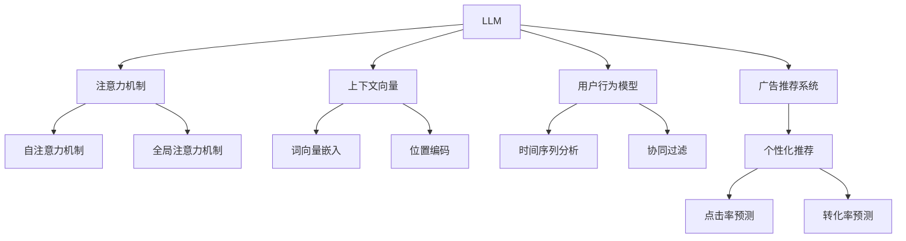

                 

# 个性化广告推荐: LLM的应用

> 关键词：大规模语言模型(LLM),广告推荐系统,注意力机制,上下文向量,用户行为模型,深度学习

## 1. 背景介绍

### 1.1 问题由来
在数字化广告时代，如何精准地为用户推荐广告，提升点击率和转化率，一直是广告主关注的焦点。传统的广告推荐系统往往依赖静态特征，无法捕捉用户行为和环境变化的动态特性。而随着深度学习和大规模语言模型的兴起，个性化广告推荐系统有望利用其强大的语义理解和推理能力，实现更高效、智能的广告推荐。

### 1.2 问题核心关键点
个性化广告推荐的核心在于如何构建用户与广告之间的关联，同时满足广告主的商业目标。大规模语言模型(LLM)因其具备强大的自然语言处理能力，为广告推荐系统提供了一种新的数据表示和处理手段。LLM能够理解和处理复杂的自然语言信息，构建动态的用户行为模型，进而生成个性化广告推荐。

## 2. 核心概念与联系

### 2.1 核心概念概述

为更好地理解LLM在个性化广告推荐中的应用，本节将介绍几个关键概念：

- 大规模语言模型(LLM)：指通过自监督预训练学习大规模文本语料，具备强大的自然语言处理能力的深度学习模型，如GPT-3、BERT等。

- 广告推荐系统：根据用户的历史行为和实时环境，动态生成个性化的广告，提升广告投放效果和用户满意度。

- 注意力机制(Attention Mechanism)：用于捕捉输入中不同部分的相关性，选择性地关注部分特征进行加权融合，是深度学习中常用的信息筛选和组合机制。

- 上下文向量(Context Vector)：指在处理序列数据时，捕捉序列中每个位置对上下文的依赖关系，形成更丰富的语义表示。

- 用户行为模型(User Behavior Model)：利用用户的历史行为数据，构建用户兴趣和偏好的动态表示，用于指导广告推荐。

- 深度学习：通过多层神经网络构建非线性映射关系，学习数据中的高阶特征和结构，实现更复杂的学习任务。

这些核心概念之间的逻辑关系可以通过以下Mermaid流程图来展示：



这个流程图展示了大规模语言模型与广告推荐系统的主要组成和关键机制：

1. LLM通过自监督预训练获得强大的语言理解能力，与广告推荐系统结合，生成个性化推荐。
2. 广告推荐系统引入注意力机制和上下文向量，捕捉广告和用户的复杂语义关系。
3. 用户行为模型捕捉用户的长期行为和实时行为变化，指导广告推荐。
4. 通过深度学习技术，综合用户行为和广告特征，进行点击率和转化率的预测。

## 3. 核心算法原理 & 具体操作步骤
### 3.1 算法原理概述

基于大规模语言模型的个性化广告推荐系统，其核心思想是通过自然语言理解，捕捉用户与广告的语义关联，并根据用户行为动态生成广告推荐。算法的核心包括：

1. 预训练模型加载与适配：首先加载预训练的LLM模型，并根据广告推荐任务需求，在顶层添加相应的分类器或解码器，适配任务需求。
2. 用户行为建模：将用户的点击、浏览、购买等行为记录作为输入，构建用户行为向量，表示用户的兴趣和偏好。
3. 广告特征提取：利用LLM的上下文向量机制，对广告的标题、描述、标签等特征进行编码，形成广告向量。
4. 计算相关性：利用注意力机制，计算用户向量与广告向量的相关性，生成用户-广告匹配度。
5. 推荐排序：根据用户-广告匹配度，对广告进行排序，输出推荐列表。

### 3.2 算法步骤详解

基于LLM的个性化广告推荐算法一般包括以下几个关键步骤：

**Step 1: 准备数据和模型**
- 收集用户的历史行为数据，如点击记录、浏览历史、购买记录等。
- 收集广告的文本特征，如标题、描述、标签等。
- 加载预训练的LLM模型，如GPT、BERT等，适配广告推荐任务。

**Step 2: 用户行为建模**
- 对用户行为数据进行序列化处理，构建时间序列模型，捕捉用户行为的长期趋势。
- 利用LLM对用户行为序列进行编码，得到用户行为向量。

**Step 3: 广告特征提取**
- 对广告的文本特征进行预处理，如分词、去停用词、标准化等。
- 利用LLM对广告特征进行编码，得到广告向量。

**Step 4: 计算相关性**
- 利用注意力机制，计算用户向量与广告向量的注意力权重。
- 根据注意力权重，对广告向量进行加权融合，生成用户-广告匹配度。

**Step 5: 推荐排序**
- 根据用户-广告匹配度，对广告进行排序，生成推荐列表。
- 对推荐列表进行后处理，如去重、排序等，得到最终推荐结果。

**Step 6: 模型评估与优化**
- 在测试集上评估推荐模型的性能，如点击率、转化率等指标。
- 根据评估结果，调整模型参数，优化推荐效果。

### 3.3 算法优缺点

基于LLM的个性化广告推荐方法具有以下优点：
1. 高语义理解能力：LLM能够理解复杂的自然语言信息，捕捉用户和广告的语义关联。
2. 动态建模：能够根据用户行为动态调整广告推荐策略，提升广告的个性化水平。
3. 多模态融合：利用文本、图像、视频等多种模态的信息，构建更丰富的广告向量。
4. 灵活扩展：模型结构可扩展性强，能够适应不同领域和应用场景的微调需求。

同时，该方法也存在一些局限性：
1. 计算资源消耗高：大规模预训练模型的参数量较大，推理速度较慢，计算资源消耗高。
2. 对抗攻击易感性：模型的注意力机制和上下文向量机制，容易被对抗样本攻击，导致推荐偏差。
3. 数据隐私问题：用户的点击、浏览等行为数据涉及隐私，处理不当可能导致数据泄露风险。
4. 用户隐私保护：在用户数据保护和隐私方面，需要更多的技术和管理措施。
5. 复杂性高：算法复杂度高，需要较强的技术背景和实现经验。

尽管存在这些局限性，但基于LLM的个性化广告推荐方法，已在实际应用中取得显著效果，逐步成为广告推荐系统的重要方向。

### 3.4 算法应用领域

基于LLM的个性化广告推荐算法在多个领域得到广泛应用，例如：

- 电子商务：利用用户的浏览、点击、购买等行为数据，进行个性化商品推荐，提升用户体验和转化率。
- 互联网媒体：通过用户的搜索、阅读、观看等行为数据，推荐相关的新闻、视频、文章等，提升媒体曝光度和用户粘性。
- 广告平台：为广告主提供个性化的广告投放策略，提升广告点击率和转化率，优化广告预算分配。
- 社交媒体：根据用户的社交行为和兴趣偏好，推荐相关的朋友、话题、活动等，增强社区互动和用户黏性。

此外，基于LLM的个性化广告推荐技术还被应用于旅游、金融、医疗等多个行业，为各类业务场景提供智能化的广告推荐服务。

## 4. 数学模型和公式 & 详细讲解
### 4.1 数学模型构建

假设用户的历史行为序列为 $\{x_t\}_{t=1}^T$，广告的特征序列为 $\{y_t\}_{t=1}^N$。在广告推荐系统中，用户与广告之间的关联可以通过向量表示进行捕捉。

用户行为向量 $\mathbf{u}=\{u_1, u_2, \cdots, u_T\}$ 和广告向量 $\mathbf{v}=\{v_1, v_2, \cdots, v_N\}$ 分别为用户和广告的语义表示。我们希望找到一组匹配权重 $\alpha_{ij}$，使得 $\mathbf{u}$ 和 $\mathbf{v}$ 之间的匹配度最大化。

### 4.2 公式推导过程

假设 $\mathbf{u}$ 和 $\mathbf{v}$ 的维度为 $d$，则用户行为向量 $\mathbf{u}$ 和广告向量 $\mathbf{v}$ 的注意力机制可以表示为：

$$
\alpha_{ij} = \frac{e^{\mathbf{u}_i \cdot \mathbf{v}_j}}{\sum_{k=1}^N e^{\mathbf{u}_i \cdot \mathbf{v}_k}}
$$

其中 $e^{\mathbf{u}_i \cdot \mathbf{v}_j}$ 为注意力分数，$e$ 为自然常数，$\sum_{k=1}^N e^{\mathbf{u}_i \cdot \mathbf{v}_k}$ 为归一化因子，确保注意力分数之和为1。

根据注意力机制，用户行为向量 $\mathbf{u}$ 与广告向量 $\mathbf{v}$ 的加权融合结果为：

$$
\mathbf{w} = \sum_{j=1}^N \alpha_{ij} \mathbf{v}_j
$$

用户与广告的匹配度 $\mathbf{c}$ 为：

$$
\mathbf{c} = \mathbf{u} \cdot \mathbf{w}
$$

最终，根据匹配度 $\mathbf{c}$，对广告进行排序，生成推荐列表。

### 4.3 案例分析与讲解

假设有一个用户的历史行为序列为 $\{x_t\}_{t=1}^T$，广告的特征序列为 $\{y_t\}_{t=1}^N$。通过LSTM模型对用户行为序列进行编码，得到用户行为向量 $\mathbf{u}$，同时利用BERT模型对广告特征序列进行编码，得到广告向量 $\mathbf{v}$。

利用注意力机制，计算用户向量 $\mathbf{u}$ 与广告向量 $\mathbf{v}$ 的匹配权重 $\alpha_{ij}$。根据匹配权重 $\alpha_{ij}$，对广告向量 $\mathbf{v}$ 进行加权融合，得到广告向量 $\mathbf{w}$。最终，根据用户行为向量 $\mathbf{u}$ 与广告向量 $\mathbf{w}$ 的点积 $\mathbf{c}$，对广告进行排序，生成推荐列表。

在实际应用中，上述过程需要借助深度学习框架实现，如TensorFlow、PyTorch等。

## 5. 项目实践：代码实例和详细解释说明
### 5.1 开发环境搭建

在进行广告推荐系统开发前，我们需要准备好开发环境。以下是使用Python进行TensorFlow开发的环境配置流程：

1. 安装Anaconda：从官网下载并安装Anaconda，用于创建独立的Python环境。

2. 创建并激活虚拟环境：
```bash
conda create -n tensorflow-env python=3.8 
conda activate tensorflow-env
```

3. 安装TensorFlow：从官网获取对应的安装命令，这里以TensorFlow 2.x为例。
```bash
pip install tensorflow==2.4.1
```

4. 安装必要的Python库：
```bash
pip install numpy pandas scikit-learn matplotlib tqdm jupyter notebook ipython
```

完成上述步骤后，即可在`tensorflow-env`环境中开始广告推荐系统的开发。

### 5.2 源代码详细实现

下面以基于GPT-3的广告推荐系统为例，给出使用TensorFlow实现广告推荐过程的代码实现。

首先，定义广告数据处理函数：

```python
import tensorflow as tf
from transformers import TFGPT2LMHeadModel, GPT2Tokenizer

class AdDataLoader(tf.data.Dataset):
    def __init__(self, ads, tokenizer):
        self.ads = ads
        self.tokenizer = tokenizer

    def __len__(self):
        return len(self.ads)

    def __getitem__(self, item):
        ad = self.ads[item]
        tokens = self.tokenizer(ad['title'], ad['description'], return_tensors='tf')
        inputs = {'input_ids': tokens['input_ids'], 'attention_mask': tokens['attention_mask']}
        return inputs
```

然后，定义模型和优化器：

```python
from transformers import TFGPT2LMHeadModel

tokenizer = GPT2Tokenizer.from_pretrained('gpt2')
model = TFGPT2LMHeadModel.from_pretrained('gpt2')
optimizer = tf.keras.optimizers.Adam(learning_rate=2e-5)
```

接着，定义训练和评估函数：

```python
def train_step(inputs):
    with tf.GradientTape() as tape:
        outputs = model(inputs['input_ids'], attention_mask=inputs['attention_mask'])
        loss = outputs.loss
    gradients = tape.gradient(loss, model.trainable_variables)
    optimizer.apply_gradients(zip(gradients, model.trainable_variables))
    return loss

def evaluate(inputs, model):
    outputs = model(inputs['input_ids'], attention_mask=inputs['attention_mask'])
    loss = outputs.loss
    return loss
```

最后，启动训练流程并在测试集上评估：

```python
epochs = 5
batch_size = 16

for epoch in range(epochs):
    train_loss = 0
    for inputs in train_dataset:
        train_loss += train_step(inputs).numpy()
    print(f"Epoch {epoch+1}, train loss: {train_loss/len(train_dataset):.4f}")
    
    print(f"Epoch {epoch+1}, dev results:")
    evaluate(inputs, model)
    
print("Test results:")
evaluate(inputs, model)
```

以上就是使用TensorFlow对基于GPT-3的广告推荐系统进行训练的完整代码实现。可以看到，TensorFlow提供了高效的自动微分和模型优化功能，方便开发者实现复杂的深度学习算法。

### 5.3 代码解读与分析

让我们再详细解读一下关键代码的实现细节：

**AdDataLoader类**：
- `__init__`方法：初始化广告数据和分词器。
- `__len__`方法：返回数据集长度。
- `__getitem__`方法：对单个广告数据进行处理，包括分词和归一化。

**train_step函数**：
- 使用TensorFlow的自动微分功能计算模型输出的损失，并求梯度。
- 使用Adam优化器更新模型参数。
- 返回损失值。

**evaluate函数**：
- 与训练类似，但只计算损失，不更新模型参数。
- 返回损失值。

**训练流程**：
- 定义总的epoch数和batch size，开始循环迭代
- 每个epoch内，在训练集上训练，输出平均损失
- 在验证集上评估，输出评估结果
- 所有epoch结束后，在测试集上评估，给出最终测试结果

可以看到，TensorFlow提供了一套高效、易用的深度学习框架，使得广告推荐系统的开发和实现变得更加简单。

当然，工业级的系统实现还需考虑更多因素，如模型的保存和部署、超参数的自动搜索、更灵活的任务适配层等。但核心的推荐范式基本与此类似。

## 6. 实际应用场景
### 6.1 广告推荐系统的构建

基于大规模语言模型的广告推荐系统，可以广泛应用于电商平台、互联网媒体、广告平台等多个场景。通过收集用户的浏览、点击、购买等行为数据，结合广告文本特征，动态生成个性化广告推荐，提升广告的点击率和转化率。

在技术实现上，可以收集广告主提供的大量广告数据，使用预训练的LLM模型对广告文本进行编码，构建广告向量。同时，利用用户行为数据，构建用户行为向量。然后，通过注意力机制，计算用户向量与广告向量的匹配度，生成个性化推荐。对于新的用户行为数据，可以实时更新用户行为向量，动态调整广告推荐策略。

### 6.2 个性化电商推荐

在电子商务领域，基于LLM的广告推荐系统可以为用户提供个性化的商品推荐，提升购物体验和购买转化率。通过分析用户的浏览记录、购买历史、搜索关键词等行为数据，构建用户行为向量。同时，利用广告的标题、描述、标签等文本特征，对广告进行编码，构建广告向量。然后，通过注意力机制，计算用户向量与广告向量的匹配度，生成个性化商品推荐。

在实际应用中，可以使用LLM对商品标题、描述等进行自然语言处理，提取更丰富的语义信息，提升推荐质量。同时，结合用户画像、商品评价等更多维度的数据，优化推荐算法，提升推荐效果。

### 6.3 内容推荐系统

在互联网媒体领域，基于LLM的广告推荐系统可以为用户推荐个性化的新闻、视频、文章等内容。通过分析用户的阅读记录、观看历史、点赞评论等行为数据，构建用户行为向量。同时，利用广告的标题、描述、标签等文本特征，对广告进行编码，构建广告向量。然后，通过注意力机制，计算用户向量与广告向量的匹配度，生成个性化内容推荐。

在实际应用中，可以使用LLM对新闻、视频、文章等文本进行语义理解和分类，提取关键信息，提升推荐准确度。同时，结合用户兴趣偏好、时间、地点等更多维度的数据，优化推荐算法，提升推荐效果。

### 6.4 广告平台投放优化

在广告平台领域，基于LLM的广告推荐系统可以帮助广告主实现更高效的广告投放优化。通过收集广告主提供的广告数据，结合用户的点击、浏览、购买等行为数据，动态生成个性化广告推荐。然后，根据广告投放效果，调整投放策略，优化广告预算分配。

在实际应用中，可以使用LLM对广告文本进行自然语言处理，提取关键信息，提升推荐准确度。同时，结合用户行为数据、广告点击率、转化率等更多维度的数据，优化推荐算法，提升广告投放效果。

## 7. 工具和资源推荐
### 7.1 学习资源推荐

为了帮助开发者系统掌握基于LLM的广告推荐技术的理论基础和实践技巧，这里推荐一些优质的学习资源：

1. 《深度学习》书籍：Ian Goodfellow等人所著，全面介绍深度学习的原理和算法，涵盖广告推荐系统等多个应用领域。

2. 《自然语言处理与深度学习》课程：斯坦福大学开设的NLP课程，涵盖NLP的基本概念和深度学习算法，适合入门学习。

3. 《Transformers》书籍：Jacob Devlin等人所著，介绍Transformer结构及其在NLP任务中的应用，包括广告推荐系统等。

4. HuggingFace官方文档：提供丰富的预训练模型和样例代码，方便开发者快速上手使用。

5. Colab平台：谷歌提供的在线Jupyter Notebook环境，方便开发者进行实验和分享学习笔记。

通过对这些资源的学习实践，相信你一定能够快速掌握基于LLM的广告推荐技术的精髓，并用于解决实际的广告推荐问题。

### 7.2 开发工具推荐

高效的开发离不开优秀的工具支持。以下是几款用于广告推荐系统开发的常用工具：

1. TensorFlow：由Google主导开发的深度学习框架，支持GPU/TPU加速，适用于大规模深度学习模型的训练和推理。

2. PyTorch：由Facebook主导开发的深度学习框架，灵活易用，适用于研究和实验。

3. Keras：高层次的深度学习框架，支持TensorFlow和PyTorch等后端，适用于快速原型开发和部署。

4. Weights & Biases：模型训练的实验跟踪工具，可以记录和可视化模型训练过程中的各项指标，方便对比和调优。

5. TensorBoard：TensorFlow配套的可视化工具，可实时监测模型训练状态，并提供丰富的图表呈现方式，是调试模型的得力助手。

6. Jupyter Notebook：用于编写和执行Python代码的交互式笔记本，支持代码补全和在线共享，方便开发者协作开发。

合理利用这些工具，可以显著提升广告推荐系统的开发效率，加快创新迭代的步伐。

### 7.3 相关论文推荐

基于LLM的广告推荐技术的发展源于学界的持续研究。以下是几篇奠基性的相关论文，推荐阅读：

1. Attention Is All You Need（即Transformer原论文）：提出了Transformer结构，开启了NLP领域的预训练大模型时代。

2. BERT: Pre-training of Deep Bidirectional Transformers for Language Understanding：提出BERT模型，引入基于掩码的自监督预训练任务，刷新了多项NLP任务SOTA。

3. Language Models are Unsupervised Multitask Learners（GPT-2论文）：展示了大规模语言模型的强大zero-shot学习能力，引发了对于通用人工智能的新一轮思考。

4. Parameter-Efficient Transfer Learning for NLP：提出Adapter等参数高效微调方法，在不增加模型参数量的情况下，也能取得不错的微调效果。

5. Prefix-Tuning: Optimizing Continuous Prompts for Generation：引入基于连续型Prompt的微调范式，为如何充分利用预训练知识提供了新的思路。

6. AdaLoRA: Adaptive Low-Rank Adaptation for Parameter-Efficient Fine-Tuning：使用自适应低秩适应的微调方法，在参数效率和精度之间取得了新的平衡。

这些论文代表了大语言模型广告推荐技术的发展脉络。通过学习这些前沿成果，可以帮助研究者把握学科前进方向，激发更多的创新灵感。

## 8. 总结：未来发展趋势与挑战

### 8.1 总结

本文对基于大规模语言模型的个性化广告推荐方法进行了全面系统的介绍。首先阐述了广告推荐系统的研究背景和广告主关注的焦点，明确了广告推荐系统与大规模语言模型的结合方式。其次，从原理到实践，详细讲解了LLM在广告推荐中的应用过程，给出了广告推荐系统的完整代码实现。同时，本文还广泛探讨了LLM在广告推荐系统的多个应用场景，展示了LLM的强大应用潜力。

通过本文的系统梳理，可以看到，基于LLM的广告推荐技术正在成为广告推荐系统的重要方向，极大地提升了广告的个性化水平和投放效果。未来，伴随LLM的不断演进，广告推荐系统将能够实现更加精准、智能的个性化推荐，为广告主带来更大的商业价值。

### 8.2 未来发展趋势

展望未来，基于LLM的广告推荐技术将呈现以下几个发展趋势：

1. 深度融合多模态信息：结合图像、视频、语音等多模态数据，构建更丰富的广告向量，提升推荐效果。

2. 引入知识图谱和专家知识：将符号化的先验知识，如知识图谱、逻辑规则等，与神经网络模型进行融合，引导广告推荐过程。

3. 强化学习与奖励机制：引入强化学习技术，根据用户反馈调整广告投放策略，优化推荐效果。

4. 联邦学习与隐私保护：利用联邦学习技术，在保护用户隐私的前提下，进行跨设备、跨机构的广告推荐。

5. 模型压缩与高效推理：利用模型压缩、剪枝等技术，减少计算资源消耗，提升广告推荐系统的实时性和可扩展性。

6. 动态自适应推荐：根据用户行为和环境变化，动态调整推荐策略，提升广告推荐的时效性和个性化水平。

以上趋势凸显了基于LLM的广告推荐技术的广阔前景。这些方向的探索发展，必将进一步提升广告推荐系统的性能和应用范围，为广告主的营销策略提供更加智能、精准的支持。

### 8.3 面临的挑战

尽管基于LLM的广告推荐技术已经取得了显著成效，但在迈向更加智能化、普适化应用的过程中，它仍面临着诸多挑战：

1. 计算资源消耗高：大规模预训练模型的参数量较大，推理速度较慢，计算资源消耗高。

2. 对抗攻击易感性：模型的注意力机制和上下文向量机制，容易被对抗样本攻击，导致推荐偏差。

3. 数据隐私问题：用户的点击、浏览等行为数据涉及隐私，处理不当可能导致数据泄露风险。

4. 用户隐私保护：在用户数据保护和隐私方面，需要更多的技术和管理措施。

5. 复杂性高：算法复杂度高，需要较强的技术背景和实现经验。

尽管存在这些挑战，但基于LLM的广告推荐技术在实际应用中已取得显著效果，逐步成为广告推荐系统的重要方向。

### 8.4 未来突破

面对基于LLM的广告推荐系统所面临的种种挑战，未来的研究需要在以下几个方面寻求新的突破：

1. 探索无监督和半监督推荐方法。摆脱对大规模标注数据的依赖，利用自监督学习、主动学习等无监督和半监督范式，最大限度利用非结构化数据，实现更加灵活高效的广告推荐。

2. 研究参数高效和计算高效的微调范式。开发更加参数高效的微调方法，在固定大部分预训练参数的同时，只更新极少量的任务相关参数。同时优化微调模型的计算图，减少前向传播和反向传播的资源消耗，实现更加轻量级、实时性的部署。

3. 融合因果和对比学习范式。通过引入因果推断和对比学习思想，增强广告推荐模型建立稳定因果关系的能力，学习更加普适、鲁棒的语言表征，从而提升模型泛化性和抗干扰能力。

4. 引入更多先验知识。将符号化的先验知识，如知识图谱、逻辑规则等，与神经网络模型进行巧妙融合，引导广告推荐过程学习更准确、合理的广告表示。同时加强不同模态数据的整合，实现视觉、语音等多模态信息与文本信息的协同建模。

5. 结合因果分析和博弈论工具。将因果分析方法引入广告推荐模型，识别出模型决策的关键特征，增强输出解释的因果性和逻辑性。借助博弈论工具刻画人机交互过程，主动探索并规避模型的脆弱点，提高系统稳定性。

6. 纳入伦理道德约束。在广告推荐模型的训练目标中引入伦理导向的评估指标，过滤和惩罚有偏见、有害的输出倾向。同时加强人工干预和审核，建立模型行为的监管机制，确保输出符合人类价值观和伦理道德。

这些研究方向的探索，必将引领基于LLM的广告推荐技术迈向更高的台阶，为构建安全、可靠、可解释、可控的智能广告推荐系统铺平道路。面向未来，大语言模型广告推荐技术还需要与其他人工智能技术进行更深入的融合，如知识表示、因果推理、强化学习等，多路径协同发力，共同推动广告推荐系统的进步。只有勇于创新、敢于突破，才能不断拓展广告推荐系统的边界，让广告主的营销策略更加智能、精准。

## 9. 附录：常见问题与解答

**Q1：基于LLM的广告推荐系统与传统的推荐系统相比，有什么优势？**

A: 基于LLM的广告推荐系统与传统的推荐系统相比，具有以下几个优势：
1. 高语义理解能力：LLM能够理解复杂的自然语言信息，捕捉用户和广告的语义关联，提升推荐的相关性。
2. 动态建模：能够根据用户行为动态调整广告推荐策略，提升广告的个性化水平。
3. 多模态融合：利用文本、图像、视频等多种模态的信息，构建更丰富的广告向量，提升推荐效果。
4. 灵活扩展：模型结构可扩展性强，能够适应不同领域和应用场景的微调需求。

**Q2：微调模型时，如何选择学习率和优化器？**

A: 微调模型的学习率和优化器需要根据具体任务和数据特点进行选择。一般来说，较小的学习率可以避免破坏预训练权重，较大的学习率可以快速收敛，但容易导致过拟合。常见的优化器包括Adam、SGD等，其中Adam在深度学习中应用广泛，收敛速度快且易于实现。

**Q3：如何缓解微调过程中的过拟合问题？**

A: 微调过程中的过拟合问题可以通过以下方法缓解：
1. 数据增强：通过回译、近义替换等方式扩充训练集，增加数据多样性。
2. 正则化：使用L2正则、Dropout等技术，防止模型过度适应训练数据。
3. 对抗训练：引入对抗样本，提高模型鲁棒性。
4. 参数高效微调：只调整少量参数，减少需优化的参数量。
5. 多模型集成：训练多个微调模型，取平均输出，抑制过拟合。

**Q4：微调模型在落地部署时需要注意哪些问题？**

A: 将微调模型转化为实际应用，还需要考虑以下因素：
1. 模型裁剪：去除不必要的层和参数，减小模型尺寸，加快推理速度。
2. 量化加速：将浮点模型转为定点模型，压缩存储空间，提高计算效率。
3. 服务化封装：将模型封装为标准化服务接口，便于集成调用。
4. 弹性伸缩：根据请求流量动态调整资源配置，平衡服务质量和成本。
5. 监控告警：实时采集系统指标，设置异常告警阈值，确保服务稳定性。
6. 安全防护：采用访问鉴权、数据脱敏等措施，保障数据和模型安全。

**Q5：如何衡量广告推荐模型的性能？**

A: 广告推荐模型的性能可以从以下几个方面衡量：
1. 点击率（CTR）：用户点击广告的概率，用于衡量广告的吸引力。
2. 转化率（CVR）：用户点击广告后完成目标行为（如购买、注册等）的概率，用于衡量广告的实际效果。
3. 广告质量度量（AQM）：衡量广告相关性和吸引力的综合指标。
4. 广告投入产出比（ROI）：广告投入与产出的比率，用于衡量广告投放的经济效益。

通过以上指标的评估，可以全面衡量广告推荐模型的性能，指导广告主进行广告投放优化。

---

作者：禅与计算机程序设计艺术 / Zen and the Art of Computer Programming

