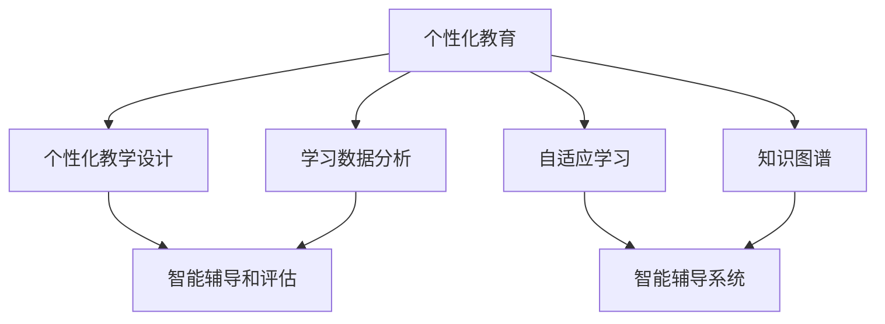

                 

# 个性化教育：利用人类计算打造定制化学习体验

> 关键词：个性化教育, 人类计算, 定制化学习, 学习分析, 智能辅导系统, 知识图谱, 自适应学习, 教育科技

## 1. 背景介绍

### 1.1 问题由来
教育作为人类文明发展的基石，一直以来都受到极高的重视。然而，传统的教育模式往往忽视了学生的个性化差异，导致了诸多问题。例如，课堂教学以老师讲授为主，难以照顾到每个学生的认知水平和学习节奏，导致部分学生跟不上进度，部分学生又觉得枯燥乏味，失去了学习动力。又例如，测评方式单一，往往只能通过考试成绩来评价学生的学习效果，难以全面反映其综合能力。

近年来，随着信息技术和大数据技术的兴起，个性化教育逐步成为教育领域的新方向。通过数据驱动的方法，教育系统能够更精准地了解学生的学习需求和表现，为其量身定制个性化的教学方案，显著提升教学效果。特别是随着人工智能技术的成熟，利用智能辅导系统和知识图谱等技术，可以为学生提供更加个性化、动态化的学习体验。

### 1.2 问题核心关键点
个性化教育的核心在于“个性”二字，即通过大数据和AI技术，深入分析每个学生的学习特点和需求，为其量身定制适应其个性特点的教学方案，实现真正的因材施教。其关键点在于：

1. 学习数据分析：通过学习行为数据和成绩数据，分析学生的知识掌握情况和认知水平，识别其学习瓶颈和优势。
2. 个性化教学设计：根据学生的个性特点和知识背景，动态调整教学内容和难度，使其学习路径符合个体需求。
3. 智能辅导和评估：利用AI技术实时监测学生学习状态，提供个性化的辅导和及时的反馈，及时调整教学策略。
4. 资源推荐：基于学生的学习历史和兴趣，为其推荐个性化的学习资源和活动，增强学习的互动性和趣味性。

## 2. 核心概念与联系

### 2.1 核心概念概述

为了更好地理解个性化教育，这里将介绍几个核心概念及其相互联系：

- **个性化教育**：根据每个学生的个性化需求，为其量身定制适应其特点的教学方案，实现真正的因材施教。
- **人类计算**：通过大数据和AI技术，深入分析学生的学习数据，辅助教师做出科学的教学决策，提升教学效果。
- **定制化学习**：根据学生的个性化需求，为其定制学习内容和路径，帮助其高效、自主地完成学习任务。
- **学习分析**：通过数据分析和AI技术，实时监测和评估学生的学习状态，为其提供个性化的辅导和反馈。
- **智能辅导系统**：利用AI技术自动进行教学辅助，包括答疑、评估、推荐等，为学生提供及时、个性化的辅导。
- **知识图谱**：以结构化的方式描述知识体系，帮助学生和教师理解知识的结构化和关联性，提高学习效率。
- **自适应学习**：根据学生的实时表现，动态调整学习内容和方法，适应其不断变化的学习需求。
- **教育科技**：利用信息技术和大数据技术，提升教育过程的智能化和互动化水平，推动教育信息化发展。

这些核心概念之间的逻辑关系可以通过以下Mermaid流程图来展示：



这个流程图展示了个性化教育的核心概念及其之间的关系：

1. 个性化教育通过学习数据分析、个性化教学设计、智能辅导和评估等手段，实现因材施教。
2. 知识图谱和自适应学习通过为学生提供个性化的知识结构和方法，进一步增强了个性化教学的效果。
3. 智能辅导系统利用知识图谱和自适应学习，为学生提供实时、个性化的辅导。

## 3. 核心算法原理 & 具体操作步骤
### 3.1 算法原理概述

个性化教育的算法原理，主要基于学生学习数据的深度分析和AI模型的智能决策。其核心思想是通过对学生学习数据（如学习行为数据、成绩数据、兴趣数据等）的深入分析，构建学生的学习模型，并基于此模型进行个性化教学设计、智能辅导和资源推荐等。

具体而言，算法流程如下：

1. **数据采集和预处理**：收集学生的学习行为数据（如学习时间、内容、工具使用等）和成绩数据，进行清洗和标准化处理。
2. **学生建模**：通过机器学习和深度学习技术，建立学生的学习模型，识别其知识掌握情况和认知水平。
3. **个性化教学设计**：根据学生的学习模型，动态调整教学内容和难度，设计个性化的学习路径。
4. **智能辅导和评估**：利用AI技术实时监测学生学习状态，提供个性化的辅导和及时的反馈，及时调整教学策略。
5. **资源推荐**：基于学生的学习历史和兴趣，为其推荐个性化的学习资源和活动，增强学习的互动性和趣味性。

### 3.2 算法步骤详解

下面详细讲解个性化教育的算法步骤：

#### 步骤1：数据采集和预处理
- **学习行为数据采集**：通过学习管理系统（LMS）、学习分析工具（Learning Analytics Tools）、在线学习平台（Online Learning Platforms）等，收集学生的学习行为数据，包括学习时间、学习内容、使用的工具等。
- **成绩数据采集**：收集学生的考试成绩和评价数据，包括作业、测验、考试等成绩，以及教师的评价和反馈。
- **兴趣数据采集**：通过问卷调查、兴趣测评等方式，了解学生的兴趣和爱好，收集其喜欢的学习内容和活动。
- **数据清洗和标准化**：对收集到的数据进行清洗，去除异常值和缺失值，并进行标准化处理，使其适合后续分析。

#### 步骤2：学生建模
- **特征工程**：从清洗后的数据中提取特征，包括学习时长、学习内容、学习难度、学习节奏、兴趣等，用于构建学生的学习模型。
- **学习模型构建**：利用机器学习和深度学习技术，如回归分析、分类算法、神经网络等，构建学生的学习模型。例如，可以使用决策树、随机森林、支持向量机等算法，或使用神经网络、深度学习框架（如TensorFlow、PyTorch等）进行建模。
- **模型评估和优化**：使用交叉验证等技术对学习模型进行评估，选择最优模型，并进行优化。

#### 步骤3：个性化教学设计
- **教学内容调整**：根据学生的学习模型，调整教学内容的深度和难度，选择适合学生的学习材料。例如，对于基础知识薄弱的学生，可以提供更多的基础练习和解释；对于掌握良好的学生，可以提供更具挑战性的材料。
- **学习路径设计**：根据学生的学习模型和兴趣，设计个性化的学习路径。例如，根据学生的知识掌握情况和学习进度，自动推荐下一阶段的学习任务，确保其学习目标的实现。

#### 步骤4：智能辅导和评估
- **实时监测**：利用AI技术实时监测学生的学习状态，包括学习时间、学习内容、学习进度、学习效果等。例如，可以使用传感器监测学生的学习行为，分析其注意力集中程度和学习效率。
- **智能辅导**：根据学生的实时学习状态，提供个性化的辅导。例如，当学生遇到难题时，智能辅导系统可以自动提供解题指导和相关资料，帮助其解决问题。
- **及时反馈**：根据学生的学习状态和效果，提供及时的反馈和建议。例如，当学生完成某个任务后，系统可以给出成绩和改进建议，帮助其不断进步。

#### 步骤5：资源推荐
- **个性化推荐**：基于学生的学习历史和兴趣，为其推荐个性化的学习资源和活动。例如，可以推荐适合其学习水平的学习视频、在线课程、习题等。
- **活动推荐**：根据学生的学习需求和兴趣，推荐适合其参与的学习活动。例如，可以推荐参加讨论小组、学习竞赛等，增强学习的互动性和趣味性。

### 3.3 算法优缺点
个性化教育算法具有以下优点：
- **因材施教**：通过深度数据分析和AI决策，为每个学生量身定制个性化的学习方案，真正实现因材施教。
- **高效学习**：通过自适应学习路径和实时辅导，帮助学生高效地掌握知识，提升学习效果。
- **多样化学习**：通过个性化资源推荐，提供多样化的学习材料和活动，增强学习的趣味性和互动性。
- **实时反馈**：通过实时监测和智能辅导，及时了解学生的学习状态，提供及时的反馈和建议，帮助其不断进步。

同时，该算法也存在以下局限性：
- **数据依赖**：个性化教育的效果很大程度上依赖于数据的质量和数量，收集高质量数据的成本较高。
- **模型复杂性**：构建学生学习模型需要复杂的特征工程和模型选择，模型的复杂性可能导致计算资源和时间成本较高。
- **隐私问题**：学生学习数据的隐私保护是一个重要问题，需要采取有效的数据保护措施。
- **普适性不足**：由于每个学生的情况不同，个性化教育方案可能难以推广到大规模学生群体。

## 4. 数学模型和公式 & 详细讲解  
### 4.1 数学模型构建

为了更准确地描述个性化教育算法，我们需要构建数学模型。假设我们有一个学生 $s_i$，其学习行为数据为 $D_i = \{t_{i1}, c_{i1}, d_{i1}, \ldots, t_{in}, c_{in}, d_{in}\}$，其中 $t_{ik}$ 表示学生 $s_i$ 在 $k$ 次学习行为数据中的学习时长，$c_{ik}$ 表示学习内容的难度，$d_{ik}$ 表示学习效果的评估分数。

### 4.2 公式推导过程

为了更好地理解个性化教育算法，我们以回归分析为例，推导学生学习模型的一般形式。

假设我们收集到 $m$ 个学生的学习行为数据，每个学生 $s_i$ 的 $n$ 次学习行为数据 $D_i = \{t_{i1}, c_{i1}, d_{i1}, \ldots, t_{in}, c_{in}, d_{in}\}$，其中 $t_{ik}$ 表示学生 $s_i$ 在 $k$ 次学习行为数据中的学习时长，$c_{ik}$ 表示学习内容的难度，$d_{ik}$ 表示学习效果的评估分数。

我们的目标是通过回归分析构建学生 $s_i$ 的学习模型，即找到一个函数 $f(x)$，使得其能够预测学生 $s_i$ 的学习效果 $y$。假设学习效果 $y$ 可以表示为学习时长、学习内容难度和学习效果评估分数的线性组合：

$$
y = \alpha_0 + \alpha_1 t_{ik} + \alpha_2 c_{ik} + \alpha_3 d_{ik} + \epsilon_i
$$

其中 $\alpha_0, \alpha_1, \alpha_2, \alpha_3$ 为回归系数，$\epsilon_i$ 为随机误差项。

我们可以使用最小二乘法来求解回归系数 $\alpha_0, \alpha_1, \alpha_2, \alpha_3$。最小二乘法的目标是最小化预测值与真实值之间的误差平方和，即：

$$
\min_{\alpha_0, \alpha_1, \alpha_2, \alpha_3} \sum_{i=1}^m \sum_{k=1}^n (y_{ik} - \alpha_0 - \alpha_1 t_{ik} - \alpha_2 c_{ik} - \alpha_3 d_{ik})^2
$$

求解上述优化问题，可以得到回归系数 $\alpha_0, \alpha_1, \alpha_2, \alpha_3$，进而构建学生学习模型：

$$
\hat{y} = \alpha_0 + \alpha_1 t_{ik} + \alpha_2 c_{ik} + \alpha_3 d_{ik}
$$

### 4.3 案例分析与讲解

我们可以以一个简单的案例来说明个性化教育算法的使用。假设我们有一个在线学习平台，收集到了多个学生在学习某门课程时的学习行为数据。我们希望根据这些数据，为每个学生提供个性化的学习路径和辅导。

我们首先采集学生的学习行为数据，包括学习时间、学习内容难度、学习效果评估分数等。然后，我们使用回归分析方法，构建学生 $s_i$ 的学习模型：

$$
\hat{y} = \alpha_0 + \alpha_1 t_{ik} + \alpha_2 c_{ik} + \alpha_3 d_{ik}
$$

其中 $\alpha_0, \alpha_1, \alpha_2, \alpha_3$ 为回归系数，可以通过最小二乘法求解。

得到学生学习模型后，我们可以根据模型的预测结果，为每个学生设计个性化的学习路径。例如，对于某个学生，其学习模型为：

$$
\hat{y} = 10 + 0.5 t_{ik} - 0.2 c_{ik} + 0.3 d_{ik}
$$

这表示，该学生的学习效果与其学习时间成正比，学习内容难度成反比，学习效果评估分数成正比。基于此模型，我们可以设计个性化的学习路径，例如：

- 对于学习时间较长的学生，可以适当增加学习内容的难度，帮助其掌握知识。
- 对于学习内容难度较大的学生，可以适当增加学习时间，帮助其克服难点。
- 对于学习效果评估分数较高的学生，可以适当增加学习效果的评估频率，帮助其巩固知识。

通过这种个性化的教学设计，学生能够更加高效、自主地完成学习任务，显著提升学习效果。

## 5. 项目实践：代码实例和详细解释说明
### 5.1 开发环境搭建

在进行个性化教育实践前，我们需要准备好开发环境。以下是使用Python进行项目开发的环境配置流程：

1. 安装Anaconda：从官网下载并安装Anaconda，用于创建独立的Python环境。

2. 创建并激活虚拟环境：
```bash
conda create -n myenv python=3.8 
conda activate myenv
```

3. 安装必要的Python库：
```bash
pip install pandas numpy sklearn scikit-learn seaborn matplotlib pyod scikit-learn
```

4. 安装在线学习平台的API接口：
```bash
pip install requests
```

5. 安装可视化工具：
```bash
pip install matplotlib seaborn jupyter notebook ipython
```

完成上述步骤后，即可在`myenv`环境中开始项目实践。

### 5.2 源代码详细实现

下面我们以一个简单的在线学习平台为例，展示如何使用Python和相关库进行个性化教育的开发。

首先，我们需要收集学生的学习行为数据。我们可以从在线学习平台获取学生的学习记录，并将其保存为CSV文件。例如，我们有一个名为`students.csv`的文件，其中包含学生的学习行为数据，格式如下：

```
id,study_time,content_difficulty,learning_outcome
1,120,5,90
2,90,4,85
3,100,4,80
4,60,3,70
```

接下来，我们使用Python和相关库进行数据处理和分析：

```python
import pandas as pd

# 读取学生学习行为数据
data = pd.read_csv('students.csv')

# 数据预处理
data['study_time'] = data['study_time'].astype(int)
data['content_difficulty'] = data['content_difficulty'].astype(int)
data['learning_outcome'] = data['learning_outcome'].astype(int)

# 构建学习模型
from sklearn.linear_model import LinearRegression

# 构建线性回归模型
model = LinearRegression()

# 将数据分为训练集和测试集
train_data = data.sample(frac=0.8, random_state=1)
test_data = data.drop(train_data.index)

# 训练模型
model.fit(train_data[['study_time', 'content_difficulty']], train_data['learning_outcome'])

# 预测测试集
predictions = model.predict(test_data[['study_time', 'content_difficulty']])

# 评估模型
from sklearn.metrics import mean_squared_error

# 计算均方误差
mse = mean_squared_error(test_data['learning_outcome'], predictions)
print('Mean Squared Error:', mse)
```

在上述代码中，我们使用`LinearRegression`模型进行回归分析，构建学生的学习模型。然后，我们使用`mean_squared_error`函数评估模型的性能。

### 5.3 代码解读与分析

让我们再详细解读一下关键代码的实现细节：

**数据预处理**：
- `data['study_time'] = data['study_time'].astype(int)`：将学习时间转换为整型。
- `data['content_difficulty'] = data['content_difficulty'].astype(int)`：将学习内容难度转换为整型。
- `data['learning_outcome'] = data['learning_outcome'].astype(int)`：将学习效果评估分数转换为整型。

**模型构建**：
- `model = LinearRegression()`：创建一个线性回归模型。
- `model.fit(train_data[['study_time', 'content_difficulty']], train_data['learning_outcome'])`：使用训练集数据进行模型训练。

**预测和评估**：
- `predictions = model.predict(test_data[['study_time', 'content_difficulty']])`：使用测试集数据进行模型预测。
- `mse = mean_squared_error(test_data['learning_outcome'], predictions)`：计算预测值和真实值之间的均方误差。

可以看到，通过简单的代码实现，我们已经构建了学生的学习模型，并对其进行了评估。

## 6. 实际应用场景
### 6.1 智能辅导系统

智能辅导系统是个性化教育的重要组成部分，通过AI技术为学生提供个性化的辅导和支持。其核心思想是根据学生的学习行为和效果，实时监测和评估学生的学习状态，并根据反馈动态调整教学策略。

例如，一个智能辅导系统可以实时监测学生的学习行为，如学习时间、学习内容、学习效果等。通过分析学生的学习数据，系统可以自动发现学习瓶颈和优势，提供个性化的辅导和建议。例如，当学生遇到难题时，系统可以自动提供解题指导和相关资料，帮助其解决问题。同时，系统可以实时评估学生的学习效果，根据评估结果提供改进建议，帮助其不断进步。

### 6.2 个性化学习路径

个性化学习路径是另一个重要的应用场景。通过深度数据分析和AI技术，可以为每个学生设计个性化的学习路径，帮助其高效地掌握知识。

例如，一个在线学习平台可以根据学生的学习行为数据，构建学生学习模型。基于此模型，平台可以设计个性化的学习路径，例如：

- 对于学习时间较长的学生，可以适当增加学习内容的难度，帮助其掌握知识。
- 对于学习内容难度较大的学生，可以适当增加学习时间，帮助其克服难点。
- 对于学习效果评估分数较高的学生，可以适当增加学习效果的评估频率，帮助其巩固知识。

通过这种个性化的教学设计，学生能够更加高效、自主地完成学习任务，显著提升学习效果。

### 6.3 学习资源推荐

学习资源推荐是个性化教育的另一个重要应用场景。通过数据分析和AI技术，可以为学生推荐个性化的学习资源和活动，增强学习的互动性和趣味性。

例如，一个在线学习平台可以根据学生的学习历史和兴趣，为其推荐个性化的学习资源和活动。例如，可以推荐适合其学习水平的学习视频、在线课程、习题等。同时，平台可以推荐适合其参与的学习活动，例如讨论小组、学习竞赛等，增强学习的互动性和趣味性。

### 6.4 未来应用展望

随着个性化教育技术的发展，其应用场景将越来越广泛，为教育领域带来更多的创新和变革。

在智慧教室中，利用AI技术实时监测和评估学生的学习状态，提供个性化的辅导和支持，提升教学效果。在虚拟现实环境中，利用虚拟现实技术为学生提供沉浸式的学习体验，增强学习的互动性和趣味性。在跨领域教育中，利用跨领域知识图谱和自适应学习技术，帮助学生跨越学科界限，提升综合素养。

## 7. 工具和资源推荐
### 7.1 学习资源推荐

为了帮助开发者系统掌握个性化教育理论基础和实践技巧，这里推荐一些优质的学习资源：

1. 《教育数据分析与学习分析》系列博文：由教育数据分析专家撰写，深入浅出地介绍了教育数据分析和学习分析的基本概念和方法。
2. 《个性化教育：理论与实践》课程：由教育技术专家开设的在线课程，涵盖个性化教育的理论基础和实践技巧，提供丰富的案例分析。
3. 《教育科技发展趋势》书籍：全面介绍了教育科技的发展历程和未来趋势，帮助开发者了解教育科技的前沿动态。
4. 《学习分析技术与应用》书籍：系统介绍了学习分析技术的基本概念和应用场景，帮助开发者掌握学习分析的基本方法。
5. 《自适应学习系统》书籍：介绍自适应学习系统的基本原理和设计方法，帮助开发者设计高效的自适应学习方案。

通过对这些资源的学习实践，相信你一定能够快速掌握个性化教育的精髓，并用于解决实际的个性化教育问题。

### 7.2 开发工具推荐

高效的开发离不开优秀的工具支持。以下是几款用于个性化教育开发的常用工具：

1. Python：基于Python的开源深度学习框架，灵活动态的计算图，适合快速迭代研究。
2. TensorFlow：由Google主导开发的开源深度学习框架，生产部署方便，适合大规模工程应用。
3. PyTorch：基于Python的深度学习框架，灵活方便，适合研究开发。
4. Scikit-learn：基于Python的机器学习库，提供了丰富的回归、分类、聚类等算法，适合数据预处理和模型构建。
5. Jupyter Notebook：一个交互式的数据分析和编程环境，适合快速原型开发和数据可视化。

合理利用这些工具，可以显著提升个性化教育项目的开发效率，加快创新迭代的步伐。

### 7.3 相关论文推荐

个性化教育技术的发展源于学界的持续研究。以下是几篇奠基性的相关论文，推荐阅读：

1. "Personalized Learning: A Survey"：介绍了个性化学习的定义、原理和应用场景，系统分析了现有研究成果。
2. "Data Mining and Statistical Learning for Adaptive Educational Systems"：介绍了数据挖掘和统计学习在自适应教育系统中的应用，提供了丰富的案例分析。
3. "An Overview of Personalized Learning Environments"：综述了个性化学习环境的研究现状和未来趋势，介绍了最新的研究成果。
4. "Machine Learning in Educational Data Mining: From Adaptive Learning to Educational Data Mining"：介绍了机器学习在教育数据挖掘中的应用，提供了丰富的应用案例。
5. "Learning Analytics in Higher Education: The Impact on Student Outcomes"：介绍了学习分析在高等教育中的应用，提供了丰富的评估指标和方法。

这些论文代表了个性化教育技术的发展脉络。通过学习这些前沿成果，可以帮助研究者把握学科前进方向，激发更多的创新灵感。

## 8. 总结：未来发展趋势与挑战
### 8.1 总结

本文对个性化教育进行了全面系统的介绍。首先阐述了个性化教育的研究背景和意义，明确了个性化教育的核心在于“个性”二字，即通过大数据和AI技术，深入分析学生的学习数据，辅助教师做出科学的教学决策，提升教学效果。其次，从算法原理到具体操作步骤，详细讲解了个性化教育的数学模型和实践步骤，给出了代码实例和详细解释说明。最后，探讨了个性化教育在智能辅导系统、个性化学习路径、学习资源推荐等多个应用场景中的实际应用，展示了个性化教育的广阔前景。

通过本文的系统梳理，可以看到，个性化教育技术正在成为教育领域的新方向，极大地拓展了传统教育的边界，带来了诸多创新和变革。未来，伴随个性化教育技术的不断发展，教育将变得更加智能化、个性化和高效化，为人类认知智能的进化带来深远影响。

### 8.2 未来发展趋势

展望未来，个性化教育技术将呈现以下几个发展趋势：

1. **数据驱动**：个性化教育技术将更加依赖于数据的深度分析和AI决策，通过深入挖掘学生的学习数据，提供更加个性化的教学方案。
2. **自适应学习**：利用AI技术实时监测学生的学习状态，动态调整学习内容和难度，实现自适应学习，提升学习效果。
3. **智能化辅导**：利用AI技术提供实时、个性化的辅导，帮助学生高效地掌握知识。
4. **多样化的学习资源**：根据学生的学习历史和兴趣，推荐个性化的学习资源和活动，增强学习的互动性和趣味性。
5. **跨领域学习**：利用跨领域知识图谱和自适应学习技术，帮助学生跨越学科界限，提升综合素养。
6. **智能化评估**：利用AI技术实时评估学生的学习效果，提供个性化的改进建议，帮助其不断进步。
7. **人工智能辅助教学**：利用人工智能技术辅助教师进行教学设计和管理，提升教学效率和效果。

以上趋势凸显了个性化教育技术的广阔前景。这些方向的探索发展，必将进一步提升个性化教育的智能化和互动化水平，为教育信息化发展带来新的推动力。

### 8.3 面临的挑战

尽管个性化教育技术已经取得了瞩目成就，但在迈向更加智能化、普适化应用的过程中，仍面临着诸多挑战：

1. **数据隐私问题**：学生学习数据的隐私保护是一个重要问题，需要采取有效的数据保护措施。
2. **数据质量问题**：学生学习数据的准确性和完整性直接影响个性化教育的精度和效果。
3. **计算资源问题**：个性化教育的实施需要大量的计算资源，如何优化计算效率，降低成本，是一个重要问题。
4. **算法复杂性问题**：个性化教育的算法实现需要复杂的特征工程和模型选择，算法复杂性可能导致计算资源和时间成本较高。
5. **普适性问题**：由于每个学生的情况不同，个性化教育方案可能难以推广到大规模学生群体。

正视个性化教育面临的这些挑战，积极应对并寻求突破，将是个性化教育技术走向成熟的关键。

### 8.4 研究展望

面对个性化教育面临的挑战，未来的研究需要在以下几个方面寻求新的突破：

1. **数据采集和预处理**：采用更加先进的数据采集和预处理技术，提升数据的准确性和完整性。
2. **算法优化**：开发更加高效的算法，优化计算资源和时间成本，降低个性化教育的实施难度。
3. **隐私保护**：采用先进的隐私保护技术，保障学生学习数据的隐私安全。
4. **普适性提升**：研究可扩展的个性化教育方案，使其能够推广到大规模学生群体。
5. **智能化评估**：研究更加智能化、自动化的评估方法，提升评估的准确性和效率。
6. **跨领域学习**：研究跨领域知识图谱和自适应学习技术，帮助学生跨越学科界限，提升综合素养。
7. **智能化辅导**：研究更加智能化、个性化的辅导方法，提升辅导的效果和覆盖面。

这些研究方向的探索，必将引领个性化教育技术迈向更高的台阶，为构建智能化的教育体系铺平道路。面向未来，个性化教育技术还需要与其他人工智能技术进行更深入的融合，如知识表示、因果推理、强化学习等，多路径协同发力，共同推动教育信息化和智能化的发展。

## 9. 附录：常见问题与解答

**Q1：个性化教育是否适用于所有教育场景？**

A: 个性化教育在大部分教育场景中都能取得不错的效果，特别是对于大规模、开放式的在线教育平台。但对于一些特定领域的教育，如艺术、体育等，个性化教育的效果可能有限。此外，对于一些需要实地互动的教学场景，个性化教育可能难以全面覆盖。

**Q2：个性化教育需要哪些技术支持？**

A: 个性化教育需要多种技术的支持，包括数据采集和预处理、机器学习、深度学习、数据可视化等。这些技术共同构成了个性化教育的核心基础设施。

**Q3：个性化教育的实施难度有多大？**

A: 个性化教育的实施难度较大，需要大量的数据采集和预处理工作，以及复杂的技术实现。特别是在数据隐私保护和算法优化方面，需要投入大量的研发资源和时间。

**Q4：个性化教育是否会影响传统教育模式？**

A: 个性化教育不会完全取代传统教育模式，但可以与传统教育模式进行有机融合，提供更高效、个性化的学习体验。个性化教育可以成为传统教育的补充，提升教育质量和效果。

**Q5：个性化教育是否会对教师造成负担？**

A: 个性化教育的实施需要教师具备一定的技术和数据素养，但通过培训和工具支持，教师可以逐步适应个性化教育的要求，提升教学效果。

通过本文的系统梳理，可以看到，个性化教育技术正在成为教育领域的新方向，极大地拓展了传统教育的边界，带来了诸多创新和变革。未来，伴随个性化教育技术的不断发展，教育将变得更加智能化、个性化和高效化，为人类认知智能的进化带来深远影响。

---

作者：禅与计算机程序设计艺术 / Zen and the Art of Computer Programming

