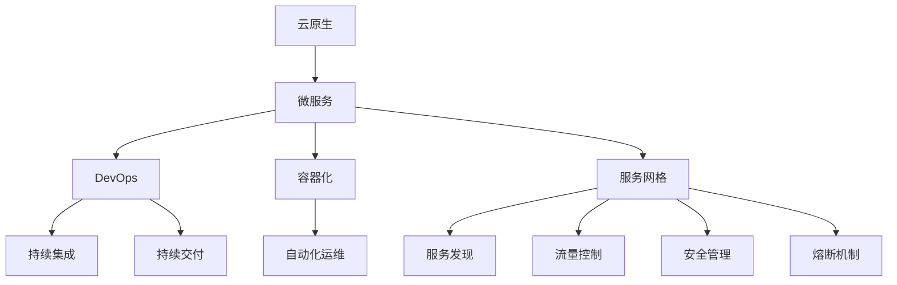
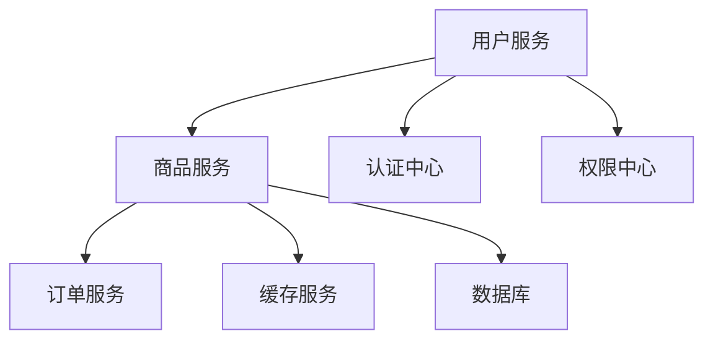

                 

# 云原生微服务架构：设计模式与最佳实践

> 关键词：云原生,微服务,DevOps,持续集成,容器化,微服务治理

## 1. 背景介绍

随着云计算和微服务架构的兴起，企业级应用系统日益复杂，开发与运维的挑战也随之增加。云原生微服务架构以其弹性、敏捷和可扩展的特性，为应对这些问题提供了有效的解决方案。本文将从背景、核心概念、算法原理、实践操作、应用场景和未来展望等方面，系统介绍云原生微服务架构的设计模式与最佳实践，以期为IT开发者和企业架构师提供参考。

## 2. 核心概念与联系

### 2.1 核心概念概述

为更好地理解云原生微服务架构，本节将介绍几个密切相关的核心概念：

- **云原生**：指在云计算环境中构建和运行应用程序的方法和实践，包括但不限于容器化、微服务、持续集成/持续交付(CI/CD)、自动化运维、服务网格等。

- **微服务**：指将应用拆分为一系列细粒度的服务单元，每个服务单元独立部署、运行和扩展，具备高内聚、低耦合的特点。微服务架构以服务为单位，打破了传统单体应用的边界，提高了系统的可扩展性和灵活性。

- **DevOps**：指将软件开发与运维紧密结合，强调自动化、持续集成和持续交付的实践，旨在提升软件交付效率和系统可靠性。

- **容器化**：指将应用和依赖打包进容器镜像中，并通过容器引擎（如Docker、Kubernetes）进行部署和管理。容器化提高了应用的部署灵活性和运行一致性，简化了跨环境的迁移和运维。

- **服务网格**：指在微服务架构中，通过服务网格（如Istio、Linkerd）实现服务间通信、流量控制、安全、发现和熔断等功能的工具和框架。

这些核心概念之间的逻辑关系可以通过以下Mermaid流程图来展示：



这个流程图展示了几大核心概念及其之间的关系：

1. 云原生是基于云计算构建应用的方法和实践，其中微服务是云原生架构的关键组成部分。
2. DevOps将开发与运维紧密结合，持续集成和持续交付是DevOps的核心实践。
3. 容器化是云原生微服务架构的部署手段，简化了应用的迁移和管理。
4. 服务网格是微服务间通信和管理的工具，提供服务发现、流量控制、安全等能力。

## 3. 核心算法原理 & 具体操作步骤

### 3.1 算法原理概述

云原生微服务架构的构建，通常遵循“设计-构建-部署-运维”的生命周期。设计阶段通过模块化和服务化的方式，将应用拆分为一系列微服务单元。构建阶段将每个微服务打包成容器镜像，并在容器引擎中自动化部署和扩展。部署阶段通过编排工具（如Kubernetes）实现服务的自动配置和扩展。运维阶段通过服务网格、监控和日志等工具进行自动化运维和问题排查。

### 3.2 算法步骤详解

云原生微服务架构的构建，通常包括以下几个关键步骤：

**Step 1: 需求分析和系统设计**
- 识别业务需求，确定系统功能模块。
- 设计微服务架构，确定服务边界和通信方式。
- 选择技术栈，确定开发语言、容器引擎和运维工具。

**Step 2: 服务拆分和容器化**
- 将应用拆分为独立的服务单元，每个服务负责特定功能。
- 编写容器镜像Dockerfile，将每个微服务打包成容器镜像。
- 通过容器引擎部署微服务，确保环境一致性。

**Step 3: 编排和部署**
- 使用编排工具（如Kubernetes）定义服务定义（Deployment）和配置（ConfigMap）。
- 实现自动化部署和扩展，确保服务可用性和负载均衡。
- 配置健康检查和自动恢复机制，提升系统可靠性。

**Step 4: 服务网格和网络管理**
- 引入服务网格（如Istio），实现服务发现、路由和负载均衡。
- 配置服务间通信，实现分布式服务调用。
- 实施服务熔断和限流策略，避免服务雪崩。

**Step 5: 持续集成和持续交付**
- 搭建CI/CD流水线，实现自动化测试和部署。
- 引入自动化测试框架和工具，确保代码质量。
- 实施持续交付，确保代码频繁更新和快速上线。

**Step 6: 监控和日志管理**
- 引入监控工具（如Prometheus），实时监控服务性能和系统状态。
- 配置日志收集和分析工具（如ELK Stack），记录和分析应用日志。
- 使用可视化工具（如Grafana），展示监控和日志数据。

**Step 7: 自动化运维和安全**
- 实施自动化运维，通过脚本和编排工具自动处理常见问题。
- 引入安全工具（如Splunk），监控和分析安全威胁。
- 定期更新和升级服务，保障系统安全性。

### 3.3 算法优缺点

云原生微服务架构具有以下优点：
1. 弹性扩展：每个微服务独立部署和扩展，支持水平扩展，提升系统吞吐量和可用性。
2. 高内聚低耦合：服务边界清晰，易于理解和维护，降低系统复杂度。
3. 快速迭代：微服务独立开发和部署，加速开发进程，提高系统灵活性。
4. 易于故障隔离：微服务故障不会影响整个系统，方便问题排查和修复。

但同时，该方法也存在一定的局限性：
1. 系统复杂度增加：微服务架构增加了系统复杂度，需要更高的设计和管理水平。
2. 网络通信开销：微服务间通信可能带来网络开销，影响系统性能。
3. 数据一致性问题：服务间通信可能影响数据一致性，需要特殊设计。
4. 学习曲线陡峭：微服务架构涉及多技术栈和复杂配置，初学者可能难以入门。

尽管存在这些局限性，但就目前而言，云原生微服务架构仍然是构建现代化应用系统的主流范式。未来相关研究的重点在于如何进一步优化服务间的通信、提升系统鲁棒性、降低运维成本等，以更好地适应实际应用需求。

### 3.4 算法应用领域

云原生微服务架构在多个领域中得到了广泛应用，例如：

- 电商系统：将电商应用拆分为交易服务、仓储服务、物流服务等微服务，提升系统性能和扩展性。
- 金融系统：将金融应用拆分为交易服务、风控服务、结算服务等微服务，确保系统稳定性和安全性。
- 社交网络：将社交应用拆分为用户服务、内容服务、关系服务等功能微服务，支持用户互动和内容分发。
- 游戏服务：将游戏应用拆分为服务器、客户端、数据库等服务，支持高并发和弹性扩展。
- IoT应用：将物联网应用拆分为设备服务、数据服务、应用服务等功能微服务，支持设备管理和数据处理。

除了上述这些经典应用外，云原生微服务架构也被创新性地应用到更多场景中，如智慧城市、智慧医疗、智能制造等，为各行各业带来数字化转型的新机遇。

## 4. 数学模型和公式 & 详细讲解 & 举例说明

### 4.1 数学模型构建

在云原生微服务架构中，服务间的通信通常通过网络协议实现，其中TCP/IP协议是主流的选择。因此，我们可以使用数学模型来描述服务间的通信和交互过程。

设系统中有 $n$ 个微服务，每个微服务通过IP地址和端口号 $(i, p_i)$ 标识。服务间的通信通过网络协议实现，使用TCP/IP连接，通信时序和数据交换可以建模为如下形式：

$$
S_i \rightarrow S_j \rightarrow S_k
$$

其中 $S_i$ 表示发送方，$S_j$ 表示中间路由器，$S_k$ 表示接收方。网络延迟、带宽等参数对通信性能有重要影响，可以通过数学模型进行量化和优化。

### 4.2 公式推导过程

在上述模型中，设通信延迟为 $d$，带宽为 $b$，数据量为 $c$。则单次通信的时延可以表示为：

$$
\delta = \frac{c}{b} + d
$$

其中 $\frac{c}{b}$ 为数据传输时延，$d$ 为网络延迟。

假设服务间通信频率为 $f$，则总时延可以表示为：

$$
\Delta = n \times f \times \delta
$$

通过优化通信协议、调整服务部署、使用负载均衡等手段，可以显著降低总时延，提升系统性能。

### 4.3 案例分析与讲解

以下以一个简单的电商系统为例，分析云原生微服务架构的设计和应用。

假设电商系统需要实现用户登录、商品展示、订单处理等功能，可以将这些功能拆分为多个微服务：

- 用户服务：负责用户登录、注册、信息管理等功能。
- 商品服务：负责商品展示、分类、搜索等功能。
- 订单服务：负责订单处理、支付、物流跟踪等功能。
- 缓存服务：提供分布式缓存，提升系统性能。

各个微服务通过服务网格（如Istio）实现服务发现和负载均衡，并使用Prometheus和Grafana进行监控和可视化。系统架构如图：



## 5. 项目实践：代码实例和详细解释说明

### 5.1 开发环境搭建

在进行微服务架构的开发和部署时，需要一个完整的开发和测试环境。以下是使用Kubernetes和Docker搭建微服务架构的步骤：

1. 安装Kubernetes集群：可以使用Minikube或公共云平台（如GKE、EKS）搭建集群。
2. 安装Docker和容器引擎：Docker用于构建和打包容器镜像，Kubernetes用于部署和管理容器。
3. 安装Docker Compose：Docker Compose用于管理和编排多个Docker容器。
4. 安装微服务框架：可以使用Spring Cloud、Dubbo等微服务框架进行开发。

### 5.2 源代码详细实现

以下是一个简单的电商系统微服务架构的实现示例，包括用户服务、商品服务和订单服务的代码：

**用户服务**

```java
@Service
public class UserService {
    @Autowired
    private UserRepository userRepository;
    
    @PostMapping("/login")
    public ResponseEntity<User> login(@RequestBody UserRequest request) {
        // 验证用户信息
        User user = userRepository.findByUsername(request.getUsername());
        if (user == null || !user.getPassword().equals(request.getPassword())) {
            return new ResponseEntity<>(HttpStatus.UNAUTHORIZED);
        }
        // 返回用户信息
        return new ResponseEntity<>(user, HttpStatus.OK);
    }
}
```

**商品服务**

```java
@Service
public class GoodsService {
    @Autowired
    private GoodsRepository goodsRepository;
    
    @GetMapping("/goods/{id}")
    public ResponseEntity<Goods> getGoods(@PathVariable Long id) {
        // 获取商品信息
        Goods goods = goodsRepository.findById(id);
        if (goods == null) {
            return new ResponseEntity<>(HttpStatus.NOT_FOUND);
        }
        // 返回商品信息
        return new ResponseEntity<>(goods, HttpStatus.OK);
    }
}
```

**订单服务**

```java
@Service
public class OrderService {
    @Autowired
    private OrderRepository orderRepository;
    
    @PostMapping("/orders")
    public ResponseEntity<Order> placeOrder(@RequestBody OrderRequest request) {
        // 创建订单
        Order order = new Order();
        order.setUserId(request.getUserId());
        order.setGoodsId(request.getGoodsId());
        order.setAmount(request.getAmount());
        orderRepository.save(order);
        // 返回订单信息
        return new ResponseEntity<>(order, HttpStatus.CREATED);
    }
}
```

**Dockerfile**

```Dockerfile
FROM openjdk:11
ADD target/.jar /app.jar
EXPOSE 8080
CMD ["java", "-jar", "/app.jar"]
```

### 5.3 代码解读与分析

在上述代码中，我们使用了Spring Cloud框架来实现微服务架构。Spring Cloud提供了一系列的组件和服务，如Eureka服务发现、Ribbon客户端负载均衡、Feign服务间通信等，方便开发者构建微服务系统。

## 6. 实际应用场景

### 6.1 电商系统

云原生微服务架构在电商系统中得到了广泛应用。电商系统通常具有高并发、高可用性、高扩展性的特点，云原生架构能够很好地应对这些需求。通过将电商应用拆分为用户服务、商品服务、订单服务等微服务，可以提升系统性能和扩展性。每个微服务独立部署和扩展，支持水平扩展，提升系统吞吐量和可用性。

### 6.2 金融系统

金融系统需要高可用性和高安全性的保障，云原生微服务架构能够很好地满足这些需求。通过将金融应用拆分为交易服务、风控服务、结算服务等微服务，可以确保系统稳定性和安全性。每个微服务独立部署和扩展，降低单点故障风险。

### 6.3 社交网络

社交网络应用具有高并发、高互动性的特点，云原生微服务架构能够很好地支持这些需求。通过将社交应用拆分为用户服务、内容服务、关系服务等功能微服务，可以支持用户互动和内容分发。每个微服务独立部署和扩展，支持弹性扩展和故障隔离。

### 6.4 未来应用展望

随着云原生微服务架构的不断演进，未来将面临更多的应用场景和技术挑战：

- 容器和编排工具的持续优化：容器化是云原生架构的基石，未来需要进一步优化容器引擎和编排工具，提升性能和稳定性。
- 服务网格的深度集成：服务网格是微服务架构的核心组件，未来需要深度集成到DevOps流程中，提升系统的运维效率和可靠性。
- 自动化运维和安全性的提升：自动化运维和安全是云原生架构的重要保障，未来需要提升运维工具的自动化水平，保障系统的安全性。
- 跨云平台的无缝集成：云原生架构需要跨云平台的无缝集成，未来需要进一步提升跨云平台的兼容性和互操作性。
- 人工智能和区块链的应用：云原生架构可以与人工智能和区块链等新技术结合，推动应用场景的拓展和创新。

## 7. 工具和资源推荐

### 7.1 学习资源推荐

为了帮助开发者系统掌握云原生微服务架构的理论基础和实践技巧，这里推荐一些优质的学习资源：

1. **《云原生之路》**：一本全面介绍云原生技术的书，涵盖Kubernetes、Docker、微服务等核心组件的深入讲解。
2. **Kubernetes官方文档**：Kubernetes的官方文档，提供详细的技术指南和实践案例，是学习Kubernetes的最佳资料。
3. **Spring Cloud官方文档**：Spring Cloud的官方文档，提供丰富的微服务开发和部署示例。
4. **Istio官方文档**：Istio的官方文档，提供服务网格的详细介绍和应用案例。
5. **Prometheus官方文档**：Prometheus的官方文档，提供监控和告警系统的详细使用指南。

通过对这些资源的学习实践，相信你一定能够快速掌握云原生微服务架构的精髓，并用于解决实际的IT问题。

### 7.2 开发工具推荐

高效的开发离不开优秀的工具支持。以下是几款用于云原生微服务架构开发的常用工具：

1. **Kubernetes**：用于编排和部署微服务的容器化应用，支持自动化扩展和运维。
2. **Docker**：用于构建和部署容器镜像，提高应用的迁移和运维效率。
3. **Docker Compose**：用于管理和编排多个Docker容器，简化微服务系统的部署和运维。
4. **Istio**：用于实现服务网格功能，提供服务发现、路由、负载均衡等服务。
5. **Prometheus**：用于监控和告警系统的构建和部署。
6. **ELK Stack**：用于日志收集和分析的解决方案，支持实时日志监控和可视化。

合理利用这些工具，可以显著提升云原生微服务架构的开发效率，加快创新迭代的步伐。

### 7.3 相关论文推荐

云原生微服务架构的发展源于学界的持续研究。以下是几篇奠基性的相关论文，推荐阅读：

1. **Kubernetes：容器编排系统**：介绍Kubernetes的架构和设计理念，是理解云原生架构的基础。
2. **Spring Cloud：构建微服务架构**：介绍Spring Cloud的核心组件和服务，提供微服务开发的实践指南。
3. **Istio：可观察和弹性服务网格**：介绍Istio的服务网格功能，提供服务间通信的解决方案。
4. **Prometheus：监控系统**：介绍Prometheus的架构和设计理念，提供监控和告警系统的详细使用指南。
5. **ELK Stack：日志管理**：介绍ELK Stack的架构和设计理念，提供日志收集和分析的解决方案。

这些论文代表了大规模微服务架构的研究进展，为云原生架构提供了理论支撑和实践指导。

## 8. 总结：未来发展趋势与挑战

### 8.1 总结

本文对云原生微服务架构进行了全面系统的介绍。首先阐述了云原生微服务架构的背景、核心概念和算法原理，明确了云原生架构在构建现代化应用系统中的重要性。其次，从实践操作到应用场景，详细讲解了云原生微服务架构的设计模式与最佳实践，提供了可行的开发和部署方案。

通过本文的系统梳理，可以看到，云原生微服务架构正成为构建现代化应用系统的主流范式，极大地提升了系统的可扩展性和灵活性。受益于容器化、微服务、服务网格等技术的成熟应用，微服务架构将进一步推动IT行业的发展。未来，伴随云原生技术的不断演进，微服务架构必将在更广阔的应用领域大放异彩。

### 8.2 未来发展趋势

展望未来，云原生微服务架构将呈现以下几个发展趋势：

1. 容器化和编排工具的进一步优化：容器化和编排工具是云原生架构的基础，未来需要进一步优化容器引擎和编排工具，提升性能和稳定性。
2. 服务网格的深度集成：服务网格是微服务架构的核心组件，未来需要深度集成到DevOps流程中，提升系统的运维效率和可靠性。
3. 自动化运维和安全性的提升：自动化运维和安全是云原生架构的重要保障，未来需要提升运维工具的自动化水平，保障系统的安全性。
4. 跨云平台的无缝集成：云原生架构需要跨云平台的无缝集成，未来需要进一步提升跨云平台的兼容性和互操作性。
5. 人工智能和区块链的应用：云原生架构可以与人工智能和区块链等新技术结合，推动应用场景的拓展和创新。

以上趋势凸显了云原生微服务架构的广阔前景。这些方向的探索发展，必将进一步提升IT系统的性能和灵活性，为各行各业带来数字化转型的新机遇。

### 8.3 面临的挑战

尽管云原生微服务架构已经取得了瞩目成就，但在迈向更加智能化、普适化应用的过程中，它仍面临着诸多挑战：

1. 系统复杂度增加：微服务架构增加了系统复杂度，需要更高的设计和管理水平。
2. 网络通信开销：微服务间通信可能带来网络开销，影响系统性能。
3. 数据一致性问题：服务间通信可能影响数据一致性，需要特殊设计。
4. 学习曲线陡峭：微服务架构涉及多技术栈和复杂配置，初学者可能难以入门。
5. 安全性和可靠性：微服务架构需要更高的安全性和可靠性保障，需要复杂的运维和监控。

尽管存在这些挑战，但云原生微服务架构的优越性使得其在构建现代化应用系统中的地位不可动摇。未来相关研究的重点在于如何进一步优化服务间的通信、提升系统鲁棒性、降低运维成本等，以更好地适应实际应用需求。

### 8.4 研究展望

面向未来，云原生微服务架构的研究需要在以下几个方面寻求新的突破：

1. 探索无监督和半监督微服务架构：摆脱对大规模标注数据的依赖，利用自监督学习、主动学习等无监督和半监督范式，最大限度利用非结构化数据，实现更加灵活高效的微服务架构。
2. 研究参数高效和计算高效的微服务架构：开发更加参数高效的微服务架构，在固定大部分微服务参数的情况下，只更新极少量的任务相关参数。同时优化微服务架构的计算图，减少前向传播和反向传播的资源消耗，实现更加轻量级、实时性的部署。
3. 融合因果和对比学习范式：通过引入因果推断和对比学习思想，增强微服务架构建立稳定因果关系的能力，学习更加普适、鲁棒的服务表示，从而提升服务架构泛化性和抗干扰能力。
4. 引入更多先验知识：将符号化的先验知识，如知识图谱、逻辑规则等，与微服务架构进行巧妙融合，引导微服务架构学习更准确、合理的语言模型。同时加强不同模态数据的整合，实现视觉、语音等多模态信息与文本信息的协同建模。
5. 结合因果分析和博弈论工具：将因果分析方法引入微服务架构，识别出架构决策的关键特征，增强输出解释的因果性和逻辑性。借助博弈论工具刻画人机交互过程，主动探索并规避架构的脆弱点，提高系统稳定性。
6. 纳入伦理道德约束：在微服务架构训练目标中引入伦理导向的评估指标，过滤和惩罚有害的输出倾向。同时加强人工干预和审核，建立架构行为的监管机制，确保输出符合人类价值观和伦理道德。

这些研究方向的探索，必将引领云原生微服务架构技术迈向更高的台阶，为构建安全、可靠、可解释、可控的智能系统铺平道路。面向未来，云原生微服务架构还需要与其他人工智能技术进行更深入的融合，如知识表示、因果推理、强化学习等，多路径协同发力，共同推动自然语言理解和智能交互系统的进步。只有勇于创新、敢于突破，才能不断拓展微服务架构的边界，让智能技术更好地造福人类社会。

## 9. 附录：常见问题与解答

**Q1: 云原生微服务架构是否适用于所有应用场景？**

A: 云原生微服务架构适用于高并发、高扩展、高可用性的应用场景，如电商、金融、社交网络等。但对于低延迟、低交互的应用场景，如实时通信、数据处理等，微服务架构可能不是最佳选择。

**Q2: 微服务架构如何避免单点故障？**

A: 微服务架构通过服务拆分和独立部署，避免单点故障。每个微服务独立扩展和扩展，支持水平扩展和负载均衡，提升系统可用性和可靠性。

**Q3: 微服务架构如何保证数据一致性？**

A: 微服务架构通过分布式事务和异步通信等方式，保证数据一致性。每个微服务独立存储和处理数据，并通过事务机制或消息队列实现数据同步。

**Q4: 微服务架构如何提升运维效率？**

A: 微服务架构通过自动化运维工具和监控系统，提升运维效率。服务网格、Prometheus、ELK Stack等工具，提供服务发现、路由、监控、日志分析等能力，支持微服务系统的自动化运维。

**Q5: 微服务架构如何提升系统性能？**

A: 微服务架构通过水平扩展和负载均衡，提升系统性能。每个微服务独立扩展和扩展，支持水平扩展，提升系统吞吐量和可用性。服务网格和负载均衡工具，优化服务间通信，降低网络延迟。

总之，云原生微服务架构以其弹性、敏捷和可扩展的特性，为构建现代化应用系统提供了强大的技术支撑。通过系统设计和实践操作，可以实现高效、可靠、灵活的微服务系统。未来，伴随技术的不断演进和应用场景的拓展，云原生微服务架构必将在各行各业大放异彩，推动数字化转型的进程。

