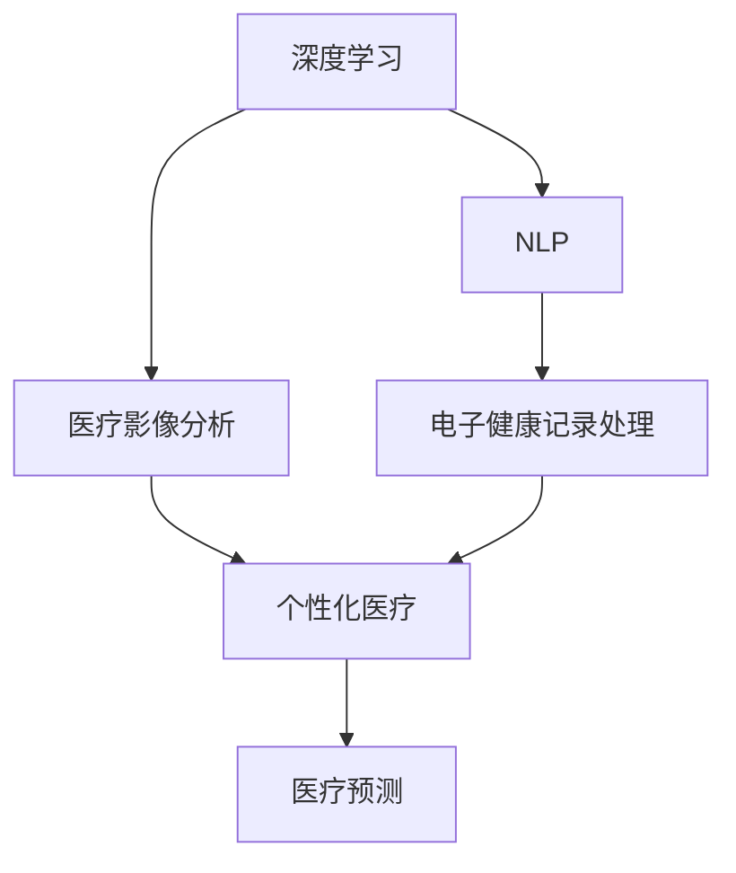

                 

# 人工智能在医疗保健中的应用

> 关键词：人工智能,医疗保健,机器学习,深度学习,医疗影像分析,电子健康记录,个性化医疗,医疗预测

## 1. 背景介绍

人工智能(AI)在医疗保健领域的应用，正在开启一场深刻的变革。从疾病诊断到个性化治疗，从药物研发到健康管理，AI正逐步渗透到医疗系统的各个环节，为患者和医护人员带来前所未有的价值。

人工智能技术的引入，不仅提高了医疗服务的效率和准确性，还推动了医学研究和医疗实践的创新发展。通过对海量的医疗数据进行分析和学习，AI模型能够发现数据中隐藏的规律和模式，帮助医生做出更加精准的诊断和治疗决策。

### 1.1 问题由来

尽管AI在医疗保健领域的应用潜力巨大，但其进展并非一帆风顺。一方面，医疗数据复杂、异构且隐私敏感，数据的获取和标注成本高昂；另一方面，医疗领域对AI模型的准确性和可解释性要求极高，模型的部署和应用环境也存在诸多挑战。

此外，AI在医疗应用中还面临着伦理和法律问题。如何在确保数据隐私和安全的前提下，合理使用AI技术，防止数据滥用和偏见，保障医疗公正和公平，也是亟需解决的重大课题。

### 1.2 问题核心关键点

当前，AI在医疗保健领域的应用主要集中在以下几个核心关键点：

1. **医疗影像分析**：利用深度学习技术，AI能够自动分析医学影像，辅助医生快速诊断各类疾病。
2. **电子健康记录(EMR)处理**：通过自然语言处理(NLP)技术，AI可以自动整理和分析电子病历，提高医疗数据管理效率。
3. **个性化医疗**：通过机器学习模型，AI可以根据患者的基因、病史和生活方式等个性化信息，提供定制化的治疗方案。
4. **药物研发**：AI在药物发现、分子模拟和临床试验设计等方面，展现出巨大的潜力和价值。
5. **医疗预测**：利用预测模型，AI可以对疾病发生、传播和流行趋势进行预测，辅助公共卫生决策。

这些关键点共同构成了AI在医疗保健领域的核心应用场景，展示了AI技术的强大力量和广泛前景。

## 2. 核心概念与联系

### 2.1 核心概念概述

为更好地理解AI在医疗保健领域的应用，本节将介绍几个密切相关的核心概念：

- **深度学习(Deep Learning)**：一种通过神经网络模型模拟人脑神经网络结构的学习方法，适用于处理复杂的数据模式。
- **医疗影像分析(Medical Imaging Analysis)**：利用深度学习技术，自动识别和分析医学影像，辅助医生进行诊断和治疗。
- **自然语言处理(Natural Language Processing, NLP)**：一种使计算机能够理解、解释和生成人类语言的技术，广泛应用于电子健康记录处理和病历分析。
- **电子健康记录(Electronic Health Records, EMR)**：医疗机构存储和管理的患者健康信息，包括病史、诊断和治疗记录等。
- **个性化医疗(Personalized Medicine)**：根据患者的基因、病史和生活方式等个性化信息，提供定制化的治疗方案，提高治疗效果。
- **医疗预测(Predictive Medicine)**：利用统计和机器学习模型，预测疾病的发展趋势和患者的健康状况，辅助公共卫生决策。

这些核心概念之间的逻辑关系可以通过以下Mermaid流程图来展示：



这个流程图展示了大语言模型的核心概念及其之间的关系：

1. 深度学习提供了强大的数据处理能力，可以用于医疗影像分析、NLP等任务。
2. 医疗影像分析利用深度学习模型自动识别和分析医学影像。
3. NLP技术可以自动整理和分析电子健康记录，辅助个性化医疗和医疗预测。
4. 电子健康记录处理将患者健康信息结构化，为个性化医疗和医疗预测提供数据基础。
5. 个性化医疗利用患者的个性化信息，提供定制化的治疗方案。
6. 医疗预测利用统计和机器学习模型，预测疾病发展趋势和患者健康状况。

这些概念共同构成了AI在医疗保健领域的核心应用框架，为其创新和实践提供了坚实的基础。

## 3. 核心算法原理 & 具体操作步骤
### 3.1 算法原理概述

AI在医疗保健领域的应用，本质上是一个数据驱动的决策支持过程。其核心思想是：利用机器学习和深度学习技术，从大量医疗数据中学习出模型，辅助医生进行更准确、高效的诊断和治疗。

形式化地，假设我们有训练集 $\mathcal{D}=\{(x_i,y_i)\}_{i=1}^N$，其中 $x_i$ 为医疗数据（如医学影像、电子健康记录等），$y_i$ 为对应的医疗标签（如疾病类型、治疗方案等）。我们的目标是找到一个模型 $f$，使其能够根据输入数据 $x$，预测输出标签 $y$。即：

$$
f: \mathcal{X} \rightarrow \mathcal{Y}
$$

其中 $\mathcal{X}$ 为输入空间，$\mathcal{Y}$ 为输出空间。

为了训练出这样的模型，我们需要使用监督学习的方法，即：

$$
\hat{f}=\mathop{\arg\min}_{f}\mathcal{L}(f,\mathcal{D})
$$

其中 $\mathcal{L}$ 为损失函数，用于衡量模型输出与真实标签之间的差异。常见的损失函数包括交叉熵损失、均方误差损失等。

### 3.2 算法步骤详解

AI在医疗保健领域的应用一般包括以下几个关键步骤：

**Step 1: 数据收集与预处理**
- 收集医疗数据，包括医学影像、电子健康记录、基因数据等。
- 对数据进行清洗、去重、标注等预处理步骤，确保数据的质量和一致性。
- 将数据分为训练集、验证集和测试集，以用于模型训练和评估。

**Step 2: 模型选择与训练**
- 选择合适的深度学习模型，如卷积神经网络(CNN)、循环神经网络(RNN)、 Transformer等。
- 在训练集上训练模型，最小化损失函数，得到最优模型参数。
- 在验证集上评估模型性能，调整模型超参数，避免过拟合。

**Step 3: 模型部署与应用**
- 将训练好的模型部署到医疗系统中，进行实时推理和预测。
- 结合医疗领域的具体需求，对模型进行必要的调整和优化。
- 持续收集反馈数据，定期更新模型，以适应医疗环境的变化。

### 3.3 算法优缺点

AI在医疗保健领域的应用具有以下优点：
1. 提高诊断和治疗的准确性。利用深度学习模型，AI能够自动识别复杂的医学影像，辅助医生进行精准诊断。
2. 提升医疗数据管理效率。通过NLP技术，AI可以快速整理和分析电子健康记录，提高医疗数据的管理效率。
3. 推动个性化医疗。机器学习模型可以根据患者的个性化信息，提供定制化的治疗方案，提高治疗效果。
4. 支持医疗预测。通过统计和机器学习模型，AI可以对疾病发展趋势和患者健康状况进行预测，辅助公共卫生决策。

同时，AI在医疗应用中还存在一些局限性：
1. 数据质量和标注成本高。医疗数据复杂且隐私敏感，获取和标注成本高昂。
2. 模型的可解释性和透明性不足。AI模型通常难以解释其内部的决策过程，影响医生对诊断和治疗的信任。
3. 伦理和法律问题。AI模型的使用涉及到数据隐私、偏见和歧视等伦理和法律问题，需要严格规范和监管。
4. 模型的泛化能力受限。在医疗数据分布不均的情况下，AI模型的泛化能力可能受到影响，导致误诊和误治。

尽管存在这些局限性，AI在医疗保健领域的应用仍然具有巨大的潜力和价值。未来，随着数据获取和标注技术的进步，模型可解释性和透明性的提升，以及伦理和法律规范的完善，AI将为医疗保健带来更多的创新和突破。

### 3.4 算法应用领域

AI在医疗保健领域的应用广泛，涵盖以下主要领域：

1. **医疗影像分析**：利用深度学习技术，AI可以自动分析医学影像，如X光片、CT、MRI等，辅助医生进行精准诊断。
2. **电子健康记录处理**：通过自然语言处理(NLP)技术，AI可以自动整理和分析电子病历，提高医疗数据的管理效率。
3. **个性化医疗**：通过机器学习模型，AI可以根据患者的基因、病史和生活方式等个性化信息，提供定制化的治疗方案。
4. **药物研发**：AI在药物发现、分子模拟和临床试验设计等方面，展现出巨大的潜力和价值。
5. **医疗预测**：利用统计和机器学习模型，AI可以对疾病发生、传播和流行趋势进行预测，辅助公共卫生决策。

## 4. 数学模型和公式 & 详细讲解 & 举例说明
### 4.1 数学模型构建

在本节中，我们将使用数学语言对AI在医疗保健领域的应用进行更加严格的刻画。

假设我们有医疗数据集 $\mathcal{D}=\{(x_i,y_i)\}_{i=1}^N$，其中 $x_i$ 为医疗数据（如医学影像、电子健康记录等），$y_i$ 为对应的医疗标签（如疾病类型、治疗方案等）。我们的目标是找到一个模型 $f$，使其能够根据输入数据 $x$，预测输出标签 $y$。

定义模型 $f$ 在输入数据 $x$ 上的预测为 $\hat{y}=f(x)$，模型在训练集 $\mathcal{D}$ 上的损失函数为 $\mathcal{L}(f,\mathcal{D})$。我们的目标是最小化损失函数，即：

$$
\hat{f}=\mathop{\arg\min}_{f}\mathcal{L}(f,\mathcal{D})
$$

在实践中，我们通常使用基于梯度的优化算法（如SGD、Adam等）来近似求解上述最优化问题。设 $\eta$ 为学习率，$\lambda$ 为正则化系数，则参数的更新公式为：

$$
\theta \leftarrow \theta - \eta \nabla_{\theta}\mathcal{L}(f(x),y)
$$

其中 $\theta$ 为模型参数，$\nabla_{\theta}\mathcal{L}(f(x),y)$ 为损失函数对模型参数的梯度，可通过反向传播算法高效计算。

### 4.2 公式推导过程

以医疗影像分析为例，我们推导CNN模型在医疗影像分类任务中的数学公式。

假设医疗影像为二维图像 $x \in \mathbb{R}^{H\times W \times C}$，其中 $H$ 和 $W$ 分别为图像高度和宽度，$C$ 为通道数。我们的目标是对图像进行分类，输出标签 $y \in \{1,2,\cdots,K\}$，其中 $K$ 为类别数。

我们定义CNN模型由若干卷积层、池化层和全连接层组成，其前向传播过程为：

$$
f(x)=\text{softmax}(\text{fc}(\text{pool}(\text{conv}(x))))
$$

其中 $\text{conv}(x)$ 表示卷积操作，$\text{pool}$ 表示池化操作，$\text{fc}$ 表示全连接操作，$\text{softmax}$ 表示归一化操作。

假设在卷积层中的参数矩阵为 $\theta^{conv}$，池化层中的参数矩阵为 $\theta^{pool}$，全连接层中的参数矩阵为 $\theta^{fc}$。则前向传播过程可以表示为：

$$
\begin{aligned}
\text{conv}(x) &= \sum_{c=1}^C \theta_{c}^{conv} * x_c \\
\text{pool}(\text{conv}(x)) &= \text{maxpool}(\text{conv}(x)) \\
\text{fc}(\text{pool}(\text{conv}(x))) &= \sum_{i=1}^D \theta_i^{fc} \cdot \text{pool}(\text{conv}(x))_i \\
f(x) &= \text{softmax}(\text{fc}(\text{pool}(\text{conv}(x))))
\end{aligned}
$$

其中 $*$ 表示卷积操作，$\cdot$ 表示点乘操作，$\text{maxpool}$ 表示最大池化操作。

模型的损失函数为交叉熵损失函数，可以表示为：

$$
\mathcal{L}(f(x),y)=-\frac{1}{N}\sum_{i=1}^N y_i \log f_i(x)
$$

其中 $y_i \in \{1,2,\cdots,K\}$，$f_i(x)$ 表示模型对输入 $x$ 在类别 $i$ 上的预测概率。

根据上述公式，我们可以使用梯度下降等优化算法，最小化损失函数 $\mathcal{L}(f(x),y)$，得到最优模型参数 $\theta^*$。

## 5. 项目实践：代码实例和详细解释说明
### 5.1 开发环境搭建

在进行医疗影像分类任务的应用开发前，我们需要准备好开发环境。以下是使用Python进行TensorFlow开发的环境配置流程：

1. 安装Anaconda：从官网下载并安装Anaconda，用于创建独立的Python环境。

2. 创建并激活虚拟环境：
```bash
conda create -n tensorflow-env python=3.8 
conda activate tensorflow-env
```

3. 安装TensorFlow：根据CUDA版本，从官网获取对应的安装命令。例如：
```bash
conda install tensorflow=2.4.1
```

4. 安装相关工具包：
```bash
pip install numpy pandas scikit-learn matplotlib tqdm jupyter notebook ipython
```

完成上述步骤后，即可在`tensorflow-env`环境中开始医疗影像分类任务的应用开发。

### 5.2 源代码详细实现

下面我们以医疗影像分类任务为例，给出使用TensorFlow实现CNN模型的PyTorch代码实现。

首先，定义医疗影像分类任务的数据处理函数：

```python
import tensorflow as tf
from tensorflow.keras.preprocessing.image import ImageDataGenerator
from tensorflow.keras.models import Sequential
from tensorflow.keras.layers import Conv2D, MaxPooling2D, Flatten, Dense, Dropout

class MedicalImagingClassifier:
    def __init__(self, num_classes):
        self.model = self.build_model(num_classes)
        self.compile_model()
        
    def build_model(self, num_classes):
        model = Sequential()
        model.add(Conv2D(32, (3,3), activation='relu', input_shape=(256,256,3)))
        model.add(MaxPooling2D((2,2)))
        model.add(Conv2D(64, (3,3), activation='relu'))
        model.add(MaxPooling2D((2,2)))
        model.add(Conv2D(128, (3,3), activation='relu'))
        model.add(MaxPooling2D((2,2)))
        model.add(Flatten())
        model.add(Dense(128, activation='relu'))
        model.add(Dropout(0.5))
        model.add(Dense(num_classes, activation='softmax'))
        return model
    
    def compile_model(self):
        self.model.compile(optimizer='adam', loss='categorical_crossentropy', metrics=['accuracy'])
        
    def train(self, train_data, epochs):
        train_datagen = ImageDataGenerator(rescale=1./255)
        train_generator = train_datagen.flow_from_directory(train_data, target_size=(256,256), class_mode='categorical', batch_size=32)
        self.model.fit(train_generator, epochs=epochs, validation_split=0.2)
        
    def evaluate(self, test_data):
        test_datagen = ImageDataGenerator(rescale=1./255)
        test_generator = test_datagen.flow_from_directory(test_data, target_size=(256,256), class_mode='categorical', batch_size=32)
        self.model.evaluate(test_generator)
```

然后，定义训练和评估函数：

```python
# 使用医疗影像分类数据集
train_data = 'path/to/train_data'
test_data = 'path/to/test_data'
num_classes = 3  # 假设分3类

model = MedicalImagingClassifier(num_classes)
model.train(train_data, epochs=10)
model.evaluate(test_data)
```

以上就是使用TensorFlow对医疗影像分类任务进行应用的完整代码实现。可以看到，通过TensorFlow的高级API，模型的构建和训练过程变得非常简单和直观。

### 5.3 代码解读与分析

让我们再详细解读一下关键代码的实现细节：

**MedicalImagingClassifier类**：
- `__init__`方法：初始化模型，包括构建模型、编译模型等。
- `build_model`方法：定义卷积神经网络模型结构，包含卷积层、池化层、全连接层和Dropout层。
- `compile_model`方法：编译模型，指定优化器、损失函数和评估指标。
- `train`方法：在训练集上训练模型，使用ImageDataGenerator进行数据增强和批处理。
- `evaluate`方法：在测试集上评估模型性能，使用ImageDataGenerator进行数据预处理。

**train_data和test_data变量**：
- 定义训练集和测试集的路径，数据集应按照类别进行组织，如`train_data/class0/`、`train_data/class1/`、`train_data/class2/`等。

**num_classes变量**：
- 定义分类的类别数，即输出标签的维度。

**模型训练**：
- 在`train`方法中，使用`ImageDataGenerator`对数据进行增强和预处理，如缩放、随机裁剪、翻转等。
- 使用`fit`方法训练模型，设置训练轮数和验证集比例。

**模型评估**：
- 在`evaluate`方法中，使用`ImageDataGenerator`对数据进行预处理，如缩放。
- 使用`evaluate`方法评估模型在测试集上的性能，输出损失和准确率。

可以看到，TensorFlow的高级API大大简化了模型的构建和训练过程，使得开发者能够快速上手并实现高效的医疗影像分类应用。

当然，实际应用中还需要考虑更多因素，如模型裁剪、量化加速、服务化封装等，以提高模型的推理速度和稳定性，满足医疗系统的实时性和可靠性要求。

## 6. 实际应用场景
### 6.1 智能辅助诊断

智能辅助诊断是AI在医疗保健领域的一个重要应用场景。通过深度学习模型，AI可以自动识别和分析医学影像，提供精准的诊断建议，辅助医生做出更准确的诊断决策。

在实践中，可以使用卷积神经网络(CNN)对不同类型的医学影像（如X光片、CT、MRI等）进行分类。将大量标注好的医学影像数据输入模型，训练出高质量的分类模型，即可实现对新影像的自动诊断。

### 6.2 电子健康记录管理

电子健康记录(EMR)是医疗机构存储和管理患者健康信息的重要工具。利用自然语言处理(NLP)技术，AI可以自动整理和分析电子病历，提高医疗数据的管理效率。

具体而言，可以将电子病历转换为结构化数据，提取出关键信息如诊断结果、治疗方案等，并进行自动标注和归档。这不仅能减轻医护人员的负担，还能提高医疗数据的安全性和可用性。

### 6.3 个性化治疗方案

个性化医疗是未来医疗发展的重要方向。通过机器学习模型，AI可以根据患者的基因、病史和生活方式等个性化信息，提供定制化的治疗方案。

在实践中，可以使用协同过滤和深度学习等技术，根据患者的医疗记录和基因信息，推荐合适的治疗方案。这不仅能提高治疗效果，还能减少不必要的治疗费用和副作用。

### 6.4 药物研发

药物研发是医疗领域的一大挑战。利用深度学习技术，AI可以在分子模拟和药物发现等环节中发挥重要作用。

具体而言，可以使用生成对抗网络(GAN)和变分自编码器(VAE)等模型，对分子结构进行模拟和生成，加速药物分子的设计和筛选。同时，利用强化学习技术，AI可以在虚拟环境中进行药物试验，预测其药效和副作用。

### 6.5 医疗预测

AI在公共卫生领域也有广泛的应用，利用统计和机器学习模型，AI可以对疾病发生、传播和流行趋势进行预测，辅助公共卫生决策。

例如，可以通过分析历史疾病数据，建立疾病传播模型，预测未来疾病的爆发趋势。这有助于公共卫生机构提前采取防控措施，保障公众健康安全。

## 7. 工具和资源推荐
### 7.1 学习资源推荐

为了帮助开发者系统掌握AI在医疗保健领域的应用，这里推荐一些优质的学习资源：

1. 《深度学习在医疗保健中的应用》系列博文：由深度学习专家撰写，深入浅出地介绍了AI在医疗影像分析、个性化医疗、药物研发等方面的应用。

2. Coursera《机器学习在医疗保健中的应用》课程：斯坦福大学开设的NLP明星课程，涵盖自然语言处理和深度学习在医疗保健中的基础知识和经典模型。

3. arXiv上的相关论文：查询关键词如"medical imaging analysis"、"personalized medicine"、"drug discovery"等，获取最新的研究成果和前沿技术。

4. GitHub上的开源项目：查找与医疗影像分析、电子健康记录处理、个性化医疗等相关领域的开源项目，学习其实现细节和工程实践。

5. TensorFlow官方文档：TensorFlow的官方文档，提供了丰富的API和样例代码，方便开发者快速上手应用。

通过对这些资源的学习实践，相信你一定能够系统掌握AI在医疗保健领域的应用，并用于解决实际的医疗问题。
###  7.2 开发工具推荐

高效的开发离不开优秀的工具支持。以下是几款用于AI在医疗保健领域应用开发的常用工具：

1. TensorFlow：由Google主导开发的开源深度学习框架，生产部署方便，适合大规模工程应用。

2. PyTorch：基于Python的开源深度学习框架，灵活动态的计算图，适合快速迭代研究。

3. Scikit-learn：Python中的经典机器学习库，包含各种常用的机器学习算法和工具。

4. Keras：一个高层次的神经网络API，适合快速搭建和训练深度学习模型。

5. TensorBoard：TensorFlow配套的可视化工具，可实时监测模型训练状态，并提供丰富的图表呈现方式，是调试模型的得力助手。

6. Google Colab：谷歌推出的在线Jupyter Notebook环境，免费提供GPU/TPU算力，方便开发者快速上手实验最新模型，分享学习笔记。

合理利用这些工具，可以显著提升AI在医疗保健领域应用的开发效率，加快创新迭代的步伐。

### 7.3 相关论文推荐

AI在医疗保健领域的发展源于学界的持续研究。以下是几篇奠基性的相关论文，推荐阅读：

1. "Deep Learning in Medical Image Analysis"：利用深度学习技术对医学影像进行自动分析和诊断，展示了AI在医疗影像分析中的强大能力。

2. "Natural Language Processing in Medicine"：讨论了NLP技术在医疗领域的应用，包括电子健康记录处理和医疗问答系统。

3. "Medical Predictive Modeling"：介绍了机器学习模型在医疗预测中的应用，如疾病预测、患者健康管理等。

4. "Personalized Medicine via Machine Learning"：讨论了机器学习技术在个性化医疗中的应用，如治疗方案推荐、基因分析等。

5. "Drug Discovery through AI"：介绍了AI在药物研发中的应用，如分子模拟、药物设计等。

这些论文代表了大语言模型微调技术的发展脉络。通过学习这些前沿成果，可以帮助研究者把握学科前进方向，激发更多的创新灵感。

## 8. 总结：未来发展趋势与挑战
### 8.1 总结

本文对AI在医疗保健领域的应用进行了全面系统的介绍。首先阐述了AI在医疗保健领域的应用背景和意义，明确了AI在医疗影像分析、电子健康记录处理、个性化医疗等方面的核心应用场景。其次，从原理到实践，详细讲解了深度学习模型在医疗影像分类、电子健康记录管理等任务中的数学模型和算法步骤，给出了完整的代码实例和详细解释。同时，本文还广泛探讨了AI在医疗保健领域的应用前景，展示了其广阔的发展潜力和广阔的应用空间。最后，本文精选了AI在医疗保健领域的学习资源、开发工具和相关论文，力求为读者提供全方位的技术指引。

通过本文的系统梳理，可以看到，AI在医疗保健领域的应用正在开启一场深刻的变革，其在诊断、治疗、药物研发等方面展现出巨大的潜力和价值。未来，随着深度学习技术的进步和医疗数据的积累，AI将为医疗保健带来更多的创新和突破。

### 8.2 未来发展趋势

展望未来，AI在医疗保健领域的应用将呈现以下几个发展趋势：

1. 深度学习模型规模增大。随着算力成本的下降和数据规模的扩张，深度学习模型的参数量还将持续增长。超大规模模型蕴含的丰富知识，有望支撑更加复杂多变的医疗应用。

2. 多模态信息融合。除了单一模态（如文本、图像）的融合，未来的AI模型还将融合多种模态数据（如文本、图像、音频等），提升对现实世界的理解能力。

3. 跨领域知识整合。未来的AI模型将不仅能整合医疗数据，还能整合更多跨领域知识，如知识图谱、逻辑规则等，形成更加全面、准确的信息整合能力。

4. 个性化医疗普及。随着个性化医疗数据的积累和深度学习模型的进步，AI将能更准确地预测患者的健康状况和治疗效果，提供更加个性化的治疗方案。

5. 医疗预测精准化。AI将在疾病预测、患者健康管理等方面，提供更加精准和可靠的预测结果，辅助公共卫生决策。

这些趋势凸显了AI在医疗保健领域应用的广阔前景。这些方向的探索发展，必将进一步提升AI模型在医疗领域的性能和应用范围，为人类健康带来更多福祉。

### 8.3 面临的挑战

尽管AI在医疗保健领域的应用前景广阔，但在迈向更加智能化、普适化应用的过程中，它仍面临着诸多挑战：

1. 数据质量和标注成本高。医疗数据复杂且隐私敏感，获取和标注成本高昂。如何获取高质量的标注数据，并保障数据隐私和安全，是亟需解决的问题。

2. 模型的泛化能力不足。在医疗数据分布不均的情况下，AI模型的泛化能力可能受到影响，导致误诊和误治。

3. 伦理和法律问题。AI模型的使用涉及到数据隐私、偏见和歧视等伦理和法律问题，需要严格规范和监管。

4. 模型的可解释性和透明性不足。AI模型通常难以解释其内部的决策过程，影响医生对诊断和治疗的信任。

5. 推理效率有待提高。深度学习模型虽然精度高，但在实际部署时往往面临推理速度慢、内存占用大等效率问题。

6. 安全性有待保障。AI模型的使用可能带来数据泄露、模型滥用等安全问题，需要加强安全防护措施。

这些挑战将对AI在医疗保健领域的应用产生深远影响。唯有在数据获取、模型优化、伦理规范、安全防护等方面进行全面提升，AI才能更好地为医疗保健服务，提升患者的健康水平。

### 8.4 研究展望

面对AI在医疗保健领域应用所面临的挑战，未来的研究需要在以下几个方面寻求新的突破：

1. 探索无监督和半监督学习范式。摆脱对大规模标注数据的依赖，利用自监督学习、主动学习等无监督和半监督范式，最大限度利用非结构化数据，实现更加灵活高效的AI模型。

2. 研究跨模态融合技术。开发能够融合多种模态数据（如文本、图像、音频等）的AI模型，提升对现实世界的理解能力。

3. 引入更多先验知识。将符号化的先验知识，如知识图谱、逻辑规则等，与神经网络模型进行巧妙融合，引导AI模型学习更准确、合理的语言模型。

4. 结合因果分析和博弈论工具。将因果分析方法引入AI模型，识别出模型决策的关键特征，增强输出解释的因果性和逻辑性。

5. 纳入伦理道德约束。在AI模型的训练目标中引入伦理导向的评估指标，过滤和惩罚有偏见、有害的输出倾向。同时加强人工干预和审核，建立模型行为的监管机制，确保输出符合人类价值观和伦理道德。

这些研究方向将引领AI在医疗保健领域的不断进步，为构建安全、可靠、可解释、可控的智能系统铺平道路。面向未来，AI在医疗保健领域的应用还需与其他人工智能技术进行更深入的融合，如知识表示、因果推理、强化学习等，多路径协同发力，共同推动人工智能技术在医疗领域的不断突破。

## 9. 附录：常见问题与解答

**Q1：AI在医疗影像分析中的应用有哪些？**

A: AI在医疗影像分析中的应用主要包括：
1. 医学影像分类：利用深度学习模型对X光片、CT、MRI等医学影像进行分类，如肿瘤、骨折、肺炎等。
2. 医学影像分割：对医学影像中的器官、组织等进行分割，帮助医生定位病变区域。
3. 医学影像配准：对不同时间或不同来源的医学影像进行配准，提高影像的一致性。
4. 医学影像重建：对部分或缺失的医学影像进行重建，如CT重建、MRI重建等。

**Q2：AI在电子健康记录处理中的应用有哪些？**

A: AI在电子健康记录处理中的应用主要包括：
1. 电子健康记录转换：将结构化数据和半结构化文本进行转换，形成统一的电子健康记录格式。
2. 电子健康记录抽取：从电子健康记录中抽取关键信息，如诊断结果、治疗方案等。
3. 电子健康记录清洗：去除电子健康记录中的冗余数据、错误信息等，提高数据的准确性和可用性。
4. 电子健康记录预测：利用机器学习模型对电子健康记录进行预测，如患者住院时间、疾病发展趋势等。

**Q3：AI在个性化医疗中的应用有哪些？**

A: AI在个性化医疗中的应用主要包括：
1. 基因分析：利用AI对患者基因数据进行分析，提供个性化的治疗方案。
2. 临床试验设计：利用AI进行临床试验设计和数据分析，提高试验效率和准确性。
3. 治疗方案推荐：根据患者的基因、病史和生活方式等个性化信息，推荐合适的治疗方案。
4. 药物研发：利用AI在分子模拟和药物发现等环节中发挥作用，加速新药的研发进程。

**Q4：AI在药物研发中的应用有哪些？**

A: AI在药物研发中的应用主要包括：
1. 药物发现：利用AI在分子模拟和药物发现等环节中发挥作用，加速新药的研发进程。
2. 药物筛选：利用AI对药物分子进行筛选，提高筛选效率和准确性。
3. 药物剂量优化：利用AI优化药物剂量，提高药物的治疗效果和安全性。
4. 药物靶点识别：利用AI识别药物的靶点，提高药物研发的针对性和成功率。

**Q5：AI在医疗预测中的应用有哪些？**

A: AI在医疗预测中的应用主要包括：
1. 疾病预测：利用AI预测疾病发生、传播和流行趋势，辅助公共卫生决策。
2. 患者健康管理：利用AI对患者健康状况进行预测和管理，提高医疗服务的质量和效率。
3. 医疗资源分配：利用AI预测医疗资源的供需情况，合理分配医疗资源。
4. 公共卫生应急：利用AI预测公共卫生应急事件的发生和传播，提高应急反应的速度和准确性。

通过这些常见问题的解答，相信你能够更全面地理解AI在医疗保健领域的应用，并了解其面临的挑战和机遇。未来，随着技术的不断进步和应用的深入，AI必将在医疗保健领域发挥更加重要的作用，为人类健康带来更多福祉。

