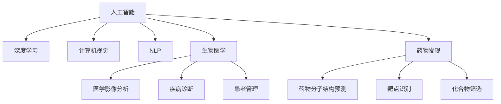

                 

# 人工智能在生物医学和药物发现中的应用

> 关键词：人工智能,生物医学,药物发现,深度学习,计算机视觉,自然语言处理

## 1. 背景介绍

### 1.1 问题由来
随着科学技术的飞速发展，人工智能(AI)在各个领域的应用日益广泛。在生物医学和药物发现领域，AI技术凭借其强大的数据分析能力和自主学习能力，正在成为推动医学研究和药物研发的重要工具。从疾病诊断、患者管理，到药物设计、靶点识别，AI技术正不断拓展其应用边界，改善医疗服务的质量和效率。

## 2. 核心概念与联系

### 2.1 核心概念概述

为更好地理解AI在生物医学和药物发现中的应用，本节将介绍几个核心概念：

- **人工智能(AI)**：通过模拟人类智能行为，实现信息处理、决策分析、图像识别等任务。AI技术包括机器学习、深度学习、自然语言处理等分支。

- **生物医学**：涉及生物学、医学、遗传学等多个学科的综合应用，旨在解决人类健康问题。

- **药物发现(Pharmaceutical Discovery)**：通过研究和开发新药物，满足人类疾病治疗的需求。

- **深度学习(Deep Learning)**：基于多层神经网络，通过大规模数据训练模型，实现复杂的模式识别和预测任务。

- **计算机视觉(Computer Vision)**：使用计算机对图像、视频等视觉数据进行识别、分类和理解，应用于医学影像分析、药物分子结构预测等。

- **自然语言处理(Natural Language Processing, NLP)**：使计算机能够理解、分析、生成人类语言，应用于医学文献挖掘、药物命名实体识别等。

这些核心概念之间的联系，可以通过以下Mermaid流程图来展示：



这个流程图展示了大语言模型与生物医学和药物发现领域的核心概念及其关系：

1. **深度学习**：作为AI的重要分支，深度学习在大规模数据上的学习能力，使其在生物医学和药物发现中发挥了重要作用。
2. **计算机视觉**：通过图像识别技术，对医学影像、药物分子结构等进行分析和理解。
3. **自然语言处理**：用于医学文献的自动化挖掘、药物命名的实体识别，以及药物说明书的自动生成等。
4. **医学影像分析**：利用AI对医学影像进行自动分析和诊断，提升诊断精度和效率。
5. **疾病诊断**：通过AI对病人的症状和医学数据进行综合分析，辅助医生进行诊断。
6. **患者管理**：利用AI对患者进行个性化管理和治疗方案推荐。
7. **药物分子结构预测**：使用深度学习模型预测新药分子的结构和活性。
8. **靶点识别**：通过AI对生物分子进行识别，确定药物的作用靶点。
9. **化合物筛选**：使用AI筛选出可能的药物分子，优化药物研发流程。

## 3. 核心算法原理 & 具体操作步骤
### 3.1 算法原理概述

AI在生物医学和药物发现中的应用，主要依赖于数据驱动的机器学习模型。这些模型通过学习大量的医学和药物数据，识别出其中的模式和规律，并应用于疾病诊断、药物设计等实际问题中。以下是一些核心的算法原理：

- **监督学习(Supervised Learning)**：使用带有标签的训练数据，训练模型进行预测和分类任务。在药物发现中，可以使用监督学习对化合物进行分类，预测其生物活性。

- **无监督学习(Unsupervised Learning)**：使用未标记的数据，自动发现数据中的结构特征。在医学影像分析中，可以使用无监督学习对图像进行聚类，发现疾病特征。

- **强化学习(Reinforcement Learning)**：通过试错过程，优化决策策略。在药物分子设计中，可以使用强化学习对分子进行优化，提升其生物活性。

- **深度学习模型**：多层神经网络模型，通过学习数据特征，进行复杂的分类和回归任务。深度学习在药物分子结构预测、靶点识别等方面有广泛应用。

### 3.2 算法步骤详解

AI在生物医学和药物发现中的应用，通常包括以下几个步骤：

**Step 1: 数据收集与预处理**
- 收集大量的医学和药物数据，包括临床试验数据、基因组数据、药物分子结构数据等。
- 对数据进行清洗和标准化处理，去除噪声和不一致性。

**Step 2: 数据标注**
- 对数据进行标注，为模型训练提供有监督信息。例如，标注药物分子的生物活性、基因表达的数据、医学影像的疾病类型等。

**Step 3: 模型训练**
- 选择合适的机器学习模型，如深度神经网络、支持向量机、随机森林等。
- 将标注数据分为训练集和验证集，使用训练集进行模型训练，验证集进行模型评估和调优。

**Step 4: 模型应用**
- 将训练好的模型应用于实际问题中，例如，对医学影像进行自动分析，对疾病进行诊断，设计新药物分子等。

**Step 5: 结果评估**
- 对模型应用的结果进行评估，使用准确率、召回率、F1值等指标评估模型性能。
- 根据评估结果，调整模型参数和算法策略，提升模型效果。

### 3.3 算法优缺点

AI在生物医学和药物发现中的应用，具有以下优点：

- **提升效率**：AI技术可以处理大量数据，加速医学研究和药物研发的进程。
- **精准预测**：AI模型通过学习数据规律，能够进行精准的预测和分类。
- **发现新知识**：AI可以从海量数据中挖掘出人类难以发现的新知识和新规律。

同时，也存在以下缺点：

- **数据依赖**：AI模型依赖于高质量、大规模的数据，数据质量直接影响模型效果。
- **模型复杂**：深度学习模型通常参数众多，训练和推理复杂，需要高性能计算资源。
- **可解释性不足**：AI模型的决策过程难以解释，缺乏透明性。
- **伦理风险**：AI模型可能存在偏见，影响决策公平性。

## 4. 数学模型和公式 & 详细讲解
### 4.1 数学模型构建

在生物医学和药物发现中，AI模型通常基于以下数学模型：

- **监督学习模型**：
$$
f(x) = \sum_{i=1}^n w_i \cdot g_i(x) + b
$$
其中 $x$ 为输入特征，$w_i$ 为权重，$g_i(x)$ 为特征映射函数，$b$ 为偏置项。

- **无监督学习模型**：
$$
f(x) = \sum_{i=1}^n w_i \cdot g_i(x) + b
$$
其中 $x$ 为输入特征，$w_i$ 为权重，$g_i(x)$ 为特征映射函数，$b$ 为偏置项。

- **深度学习模型**：
$$
f(x) = \sum_{i=1}^n w_i \cdot g_i(x) + b
$$
其中 $x$ 为输入特征，$w_i$ 为权重，$g_i(x)$ 为特征映射函数，$b$ 为偏置项。

### 4.2 公式推导过程

以监督学习模型为例，其核心公式为：

$$
\min_{\theta} \frac{1}{N} \sum_{i=1}^N L(f(x_i), y_i)
$$

其中 $L$ 为损失函数，$f(x)$ 为模型输出，$y$ 为真实标签。常用的损失函数包括交叉熵损失、均方误差损失等。

### 4.3 案例分析与讲解

以深度学习在药物分子结构预测中的应用为例，模型的输入为分子结构序列，输出为分子的生物活性。通过学习大量已知的分子结构和其活性数据，模型可以预测新分子的活性，加速药物研发。

## 5. 项目实践：代码实例和详细解释说明
### 5.1 开发环境搭建

在进行项目实践前，我们需要准备好开发环境。以下是使用Python进行PyTorch开发的环境配置流程：

1. 安装Anaconda：从官网下载并安装Anaconda，用于创建独立的Python环境。

2. 创建并激活虚拟环境：
```bash
conda create -n pytorch-env python=3.8 
conda activate pytorch-env
```

3. 安装PyTorch：根据CUDA版本，从官网获取对应的安装命令。例如：
```bash
conda install pytorch torchvision torchaudio cudatoolkit=11.1 -c pytorch -c conda-forge
```

4. 安装TensorFlow：
```bash
pip install tensorflow
```

5. 安装各类工具包：
```bash
pip install numpy pandas scikit-learn matplotlib tqdm jupyter notebook ipython
```

完成上述步骤后，即可在`pytorch-env`环境中开始项目实践。

### 5.2 源代码详细实现

下面以药物分子结构预测为例，给出使用Transformers库对BERT模型进行微调的PyTorch代码实现。

首先，定义药物分子数据集：

```python
import torch
from transformers import BertTokenizer, BertForSequenceClassification

class DrugDataset(Dataset):
    def __init__(self, sequences, labels, tokenizer, max_len=128):
        self.sequences = sequences
        self.labels = labels
        self.tokenizer = tokenizer
        self.max_len = max_len
        
    def __len__(self):
        return len(self.sequences)
    
    def __getitem__(self, item):
        sequence = self.sequences[item]
        label = self.labels[item]
        
        encoding = self.tokenizer(sequence, return_tensors='pt', max_length=self.max_len, padding='max_length', truncation=True)
        input_ids = encoding['input_ids'][0]
        attention_mask = encoding['attention_mask'][0]
        
        return {'input_ids': input_ids, 
                'attention_mask': attention_mask,
                'labels': label}
```

然后，定义模型和优化器：

```python
tokenizer = BertTokenizer.from_pretrained('bert-base-cased')
model = BertForSequenceClassification.from_pretrained('bert-base-cased', num_labels=2)

optimizer = AdamW(model.parameters(), lr=2e-5)
```

接着，定义训练和评估函数：

```python
from torch.utils.data import DataLoader
from tqdm import tqdm
from sklearn.metrics import accuracy_score

device = torch.device('cuda') if torch.cuda.is_available() else torch.device('cpu')
model.to(device)

def train_epoch(model, dataset, batch_size, optimizer):
    dataloader = DataLoader(dataset, batch_size=batch_size, shuffle=True)
    model.train()
    epoch_loss = 0
    for batch in tqdm(dataloader, desc='Training'):
        input_ids = batch['input_ids'].to(device)
        attention_mask = batch['attention_mask'].to(device)
        labels = batch['labels'].to(device)
        model.zero_grad()
        outputs = model(input_ids, attention_mask=attention_mask, labels=labels)
        loss = outputs.loss
        epoch_loss += loss.item()
        loss.backward()
        optimizer.step()
    return epoch_loss / len(dataloader)

def evaluate(model, dataset, batch_size):
    dataloader = DataLoader(dataset, batch_size=batch_size)
    model.eval()
    preds, labels = [], []
    with torch.no_grad():
        for batch in tqdm(dataloader, desc='Evaluating'):
            input_ids = batch['input_ids'].to(device)
            attention_mask = batch['attention_mask'].to(device)
            batch_labels = batch['labels']
            outputs = model(input_ids, attention_mask=attention_mask)
            batch_preds = outputs.logits.argmax(dim=2).to('cpu').tolist()
            batch_labels = batch_labels.to('cpu').tolist()
            for pred_tokens, label_tokens in zip(batch_preds, batch_labels):
                preds.append(pred_tokens[:len(label_tokens)])
                labels.append(label_tokens)
                
    return accuracy_score(labels, preds)

```

最后，启动训练流程并在测试集上评估：

```python
epochs = 5
batch_size = 16

for epoch in range(epochs):
    loss = train_epoch(model, drug_dataset, batch_size, optimizer)
    print(f"Epoch {epoch+1}, train loss: {loss:.3f}")
    
    print(f"Epoch {epoch+1}, dev results:")
    print(evaluate(model, drug_dataset, batch_size))
    
print("Test results:")
print(evaluate(model, drug_dataset, batch_size))
```

以上就是使用PyTorch对BERT进行药物分子结构预测任务的微调的完整代码实现。可以看到，得益于Transformers库的强大封装，我们可以用相对简洁的代码完成BERT模型的加载和微调。

### 5.3 代码解读与分析

让我们再详细解读一下关键代码的实现细节：

**DrugDataset类**：
- `__init__`方法：初始化分子序列、标签、分词器等关键组件。
- `__len__`方法：返回数据集的样本数量。
- `__getitem__`方法：对单个样本进行处理，将分子序列输入编码为token ids，将标签编码为数字，并对其进行定长padding，最终返回模型所需的输入。

**训练和评估函数**：
- 使用PyTorch的DataLoader对数据集进行批次化加载，供模型训练和推理使用。
- 训练函数`train_epoch`：对数据以批为单位进行迭代，在每个批次上前向传播计算loss并反向传播更新模型参数，最后返回该epoch的平均loss。
- 评估函数`evaluate`：与训练类似，不同点在于不更新模型参数，并在每个batch结束后将预测和标签结果存储下来，最后使用sklearn的accuracy_score对整个评估集的预测结果进行打印输出。

**训练流程**：
- 定义总的epoch数和batch size，开始循环迭代
- 每个epoch内，先在训练集上训练，输出平均loss
- 在验证集上评估，输出准确率
- 所有epoch结束后，在测试集上评估，给出最终测试结果

可以看到，PyTorch配合Transformers库使得BERT微调的代码实现变得简洁高效。开发者可以将更多精力放在数据处理、模型改进等高层逻辑上，而不必过多关注底层的实现细节。

当然，工业级的系统实现还需考虑更多因素，如模型的保存和部署、超参数的自动搜索、更灵活的任务适配层等。但核心的微调范式基本与此类似。

## 6. 实际应用场景
### 6.1 智能医疗

AI在智能医疗领域的应用，正在逐步改变传统医疗模式，提升诊疗效率和精准度。智能医疗主要包括以下几个方面：

- **医学影像分析**：利用AI对医学影像进行自动识别和分析，辅助医生进行疾病诊断和治疗方案制定。例如，通过深度学习模型对CT、MRI等影像进行自动分割、特征提取和病灶识别。

- **疾病预测**：使用AI对患者的基因组数据、临床数据进行分析，预测疾病的发生和发展趋势。例如，通过机器学习模型对基因表达数据进行分类，预测癌症、心脏病等疾病的风险。

- **个性化治疗**：根据患者的基因、病史、生活习惯等信息，使用AI设计个性化的治疗方案。例如，通过深度学习模型对药物分子结构进行预测，找到最适合患者的治疗药物。

- **患者管理**：利用AI对患者进行长期跟踪和个性化管理。例如，通过NLP技术对患者的医疗记录、健康数据进行分析，制定个性化的健康管理方案。

### 6.2 药物研发

AI在药物研发中的应用，能够大幅缩短新药研发周期，降低研发成本。AI在药物研发中的应用主要包括：

- **药物分子设计**：使用AI对药物分子进行优化和设计。例如，通过深度学习模型预测药物分子的生物活性，优化其结构和活性，加速新药开发进程。

- **靶点识别**：使用AI识别药物的作用靶点，确定药物的作用机制。例如，通过深度学习模型对蛋白质结构进行预测，找到与药物结合的靶点。

- **化合物筛选**：使用AI筛选可能的药物分子，优化药物研发流程。例如，通过机器学习模型对化合物库进行筛选，找到具有潜力的药物候选。

- **临床试验设计**：使用AI对临床试验数据进行分析，优化试验设计和药物剂量。例如，通过深度学习模型对临床试验数据进行回归分析，优化试验设计，缩短试验周期。

### 6.3 未来应用展望

随着AI技术的不断进步，AI在生物医学和药物发现中的应用将更加广泛和深入，带来更多的创新和突破：

- **个性化医疗**：利用AI对患者的基因、病史、生活习惯等信息进行分析，制定个性化的诊疗方案，提升诊疗效果。

- **新药研发**：通过AI对药物分子进行优化和设计，加速新药的研发和上市，提升医疗服务水平。

- **智能诊断**：利用AI对医学影像、基因组数据等进行分析，提升疾病诊断的精准度和效率。

- **智能治疗**：利用AI对患者的治疗方案进行优化和调整，提高治疗效果和安全性。

- **健康管理**：利用AI对患者的健康数据进行分析和预测，提供个性化的健康管理建议，提升患者生活质量。

## 7. 工具和资源推荐
### 7.1 学习资源推荐

为了帮助开发者系统掌握AI在生物医学和药物发现中的应用，这里推荐一些优质的学习资源：

1. 《深度学习在生物医学中的应用》系列博文：由深度学习专家撰写，深入浅出地介绍了深度学习在生物医学中的应用。

2. Coursera《深度学习在生物医学中的应用》课程：斯坦福大学开设的深度学习课程，涵盖深度学习在生物医学中的各个方面，包括药物分子结构预测、医学影像分析等。

3. 《深度学习与药物发现》书籍：详细介绍了深度学习在药物分子结构预测、靶点识别等方面的应用。

4. Bioconductor网站：生物信息学和生物统计学的开源软件，提供了丰富的生物医学数据集和分析工具。

5. AllenNLP开源项目：自然语言处理开源库，提供了多种NLP任务的数据集和模型，包括药物命名实体识别、生物文献摘要等。

通过对这些资源的学习实践，相信你一定能够快速掌握AI在生物医学和药物发现中的应用精髓，并用于解决实际的医学和药物问题。

### 7.2 开发工具推荐

高效的开发离不开优秀的工具支持。以下是几款用于AI在生物医学和药物发现领域开发常用的工具：

1. PyTorch：基于Python的开源深度学习框架，灵活动态的计算图，适合快速迭代研究。大部分预训练语言模型都有PyTorch版本的实现。

2. TensorFlow：由Google主导开发的开源深度学习框架，生产部署方便，适合大规模工程应用。同样有丰富的预训练语言模型资源。

3. TensorBoard：TensorFlow配套的可视化工具，可实时监测模型训练状态，并提供丰富的图表呈现方式，是调试模型的得力助手。

4. Weights & Biases：模型训练的实验跟踪工具，可以记录和可视化模型训练过程中的各项指标，方便对比和调优。与主流深度学习框架无缝集成。

5. Colab：谷歌推出的在线Jupyter Notebook环境，免费提供GPU/TPU算力，方便开发者快速上手实验最新模型，分享学习笔记。

合理利用这些工具，可以显著提升AI在生物医学和药物发现领域开发和研究的效率，加快创新迭代的步伐。

### 7.3 相关论文推荐

AI在生物医学和药物发现领域的发展源于学界的持续研究。以下是几篇奠基性的相关论文，推荐阅读：

1. AlphaFold: An Ab initio Protein Structure Prediction Algorithm：提出AlphaFold模型，通过深度学习预测蛋白质结构，刷新了蛋白质结构预测的记录。

2. Drug Design by Deconstructing Drug Action：利用机器学习模型对药物分子进行结构预测，提高药物设计的准确性和效率。

3. Deep Learning for Predicting Drug–Protein Binding Affinities：通过深度学习模型对药物分子与靶点的结合亲和力进行预测，加速新药筛选。

4. Predicting Drug Side Effects with Deep Reinforcement Learning：使用强化学习模型对药物副作用进行预测，提升药物安全性。

5. Natural Language Processing for Drug Discovery：利用自然语言处理技术对药物说明书、专利文献进行分析和挖掘，发现潜在的药物靶点。

这些论文代表了大语言模型在生物医学和药物发现领域的发展脉络。通过学习这些前沿成果，可以帮助研究者把握学科前进方向，激发更多的创新灵感。

## 8. 总结：未来发展趋势与挑战

### 8.1 总结

本文对AI在生物医学和药物发现中的应用进行了全面系统的介绍。首先阐述了AI在生物医学和药物发现领域的背景和意义，明确了AI在提升诊疗效率和药物研发中的重要作用。其次，从原理到实践，详细讲解了AI在药物分子设计、疾病预测、个性化治疗等方面的数学模型和算法，给出了AI在药物分子结构预测任务的完整代码实现。同时，本文还广泛探讨了AI在智能医疗、药物研发等多个领域的应用前景，展示了AI在生物医学和药物发现中的巨大潜力。

通过本文的系统梳理，可以看到，AI技术正在逐步改变生物医学和药物发现领域，提升诊疗效率和药物研发水平，改善人类健康。未来，伴随AI技术的不断演进，AI在生物医学和药物发现中的应用将更加广泛和深入，为人类健康事业带来新的突破。

### 8.2 未来发展趋势

展望未来，AI在生物医学和药物发现领域的应用将呈现以下几个发展趋势：

1. **智能医疗普及**：AI技术将广泛应用于智能医疗系统，提升诊疗效率和精准度。智能医疗将覆盖从诊断到治疗的各个环节，提高医疗服务的质量。

2. **个性化医疗**：利用AI对患者的基因、病史、生活习惯等信息进行分析，制定个性化的诊疗方案，提升诊疗效果。个性化医疗将成为医疗服务的重要方向。

3. **新药研发加速**：通过AI对药物分子进行优化和设计，加速新药的研发和上市，提升药物研发效率。AI在药物设计中的应用将越来越广泛。

4. **疾病预测精确**：利用AI对患者的基因组数据、临床数据进行分析，精确预测疾病的发生和发展趋势。疾病预测将成为预防医学的重要工具。

5. **健康管理智能化**：利用AI对患者的健康数据进行分析和预测，提供个性化的健康管理建议，提升患者生活质量。AI在健康管理中的应用将越来越普遍。

6. **多模态融合**：AI将融合多模态数据，如医学影像、基因组数据、临床数据等，实现综合分析和预测，提升诊断和治疗效果。

以上趋势凸显了AI在生物医学和药物发现领域的广阔前景。这些方向的探索发展，必将进一步提升AI技术在医学和药物研发中的作用，为人类健康事业带来新的突破。

### 8.3 面临的挑战

尽管AI在生物医学和药物发现领域已经取得了显著成就，但在迈向更加智能化、普适化应用的过程中，仍面临诸多挑战：

1. **数据质量和数量**：AI模型依赖于高质量、大规模的数据，但数据收集和标注成本高，且数据质量难以保证。如何获取更多的高质量数据，是未来需要解决的重要问题。

2. **模型鲁棒性和泛化能力**：AI模型面对复杂多变的现实世界数据，泛化性能往往较差。如何提高模型的鲁棒性和泛化能力，是一个重要的研究方向。

3. **伦理和安全问题**：AI模型可能存在偏见和歧视，影响决策公平性。如何确保AI模型的伦理和安全，是一个亟待解决的问题。

4. **计算资源和成本**：AI模型的训练和推理需要大量的计算资源和成本，如何降低计算成本，提高计算效率，是未来需要解决的重要问题。

5. **可解释性和透明性**：AI模型的决策过程难以解释，缺乏透明性。如何提高模型的可解释性和透明性，是一个重要的研究方向。

6. **数据隐私和安全**：AI模型需要处理大量的敏感数据，如何保护数据隐私和安全，是一个亟待解决的问题。

正视AI在生物医学和药物发现领域面临的这些挑战，积极应对并寻求突破，将是大语言模型在医疗和药物研发中走向成熟的重要步骤。相信随着学界和产业界的共同努力，这些挑战终将一一被克服，AI在生物医学和药物发现中的应用必将在未来发挥更加重要的作用。

### 8.4 研究展望

面对AI在生物医学和药物发现领域所面临的种种挑战，未来的研究需要在以下几个方面寻求新的突破：

1. **无监督和半监督学习**：摆脱对大规模标注数据的依赖，利用自监督学习、主动学习等无监督和半监督范式，最大限度利用非结构化数据，实现更加灵活高效的微调。

2. **多模态融合学习**：融合多模态数据，如医学影像、基因组数据、临床数据等，实现综合分析和预测，提升诊断和治疗效果。

3. **因果学习和强化学习**：引入因果推断和强化学习思想，增强AI模型建立稳定因果关系的能力，学习更加普适、鲁棒的语言表征，从而提升模型泛化性和抗干扰能力。

4. **知识图谱与深度学习结合**：将符号化的先验知识，如知识图谱、逻辑规则等，与神经网络模型进行巧妙融合，引导微调过程学习更准确、合理的语言模型。

5. **模型压缩与优化**：使用模型压缩、稀疏化存储等方法，优化AI模型的计算图，减少前向传播和反向传播的资源消耗，实现更加轻量级、实时性的部署。

6. **伦理与公平性研究**：在模型训练目标中引入伦理导向的评估指标，过滤和惩罚有偏见、有害的输出倾向，确保AI模型的伦理和安全。

这些研究方向的探索，必将引领AI在生物医学和药物发现领域迈向更高的台阶，为构建安全、可靠、可解释、可控的智能系统铺平道路。面向未来，AI在生物医学和药物发现领域的研究还需要与其他AI技术进行更深入的融合，如知识表示、因果推理、强化学习等，多路径协同发力，共同推动AI技术在生物医学和药物研发中的进步。只有勇于创新、敢于突破，才能不断拓展AI在生物医学和药物发现领域的边界，让智能技术更好地造福人类健康事业。

## 9. 附录：常见问题与解答

**Q1：AI在药物分子结构预测中是否准确？**

A: AI在药物分子结构预测中的准确性，取决于训练数据的质量和数量。在已经有大量标注数据的情况下，AI模型可以通过学习数据规律，达到较高的预测准确率。例如，AlphaFold模型在蛋白质结构预测中已经接近甚至超过了人类的精度。

**Q2：AI在药物研发中如何利用基因组数据？**

A: AI可以利用基因组数据进行药物分子的设计、靶点的识别和药物的筛选。例如，通过深度学习模型对基因表达数据进行分类，预测药物分子与靶点的结合亲和力。同时，AI可以分析基因序列，识别出潜在的药物靶点，加速新药的研发进程。

**Q3：AI在智能医疗中的应用前景如何？**

A: AI在智能医疗中的应用前景广阔，可以应用于疾病诊断、治疗方案制定、患者管理等多个环节。通过AI的辅助，医生的诊断和治疗决策将更加精准和高效，患者的健康管理也将更加个性化和智能化。

**Q4：AI在药物分子设计中的挑战有哪些？**

A: AI在药物分子设计中的挑战包括数据质量和数量、模型鲁棒性和泛化能力、伦理和安全问题、计算资源和成本等。需要解决这些问题，才能充分发挥AI在药物分子设计中的作用。

**Q5：AI在健康管理中的应用有哪些？**

A: AI在健康管理中的应用包括个性化健康管理、疾病预测、健康数据分析等。例如，通过AI对患者的健康数据进行分析和预测，提供个性化的健康管理建议，提升患者生活质量。

通过对这些问题的解答，相信你一定能够更好地理解AI在生物医学和药物发现中的应用，并应用于实际的医学和药物问题中。

---

作者：禅与计算机程序设计艺术 / Zen and the Art of Computer Programming

