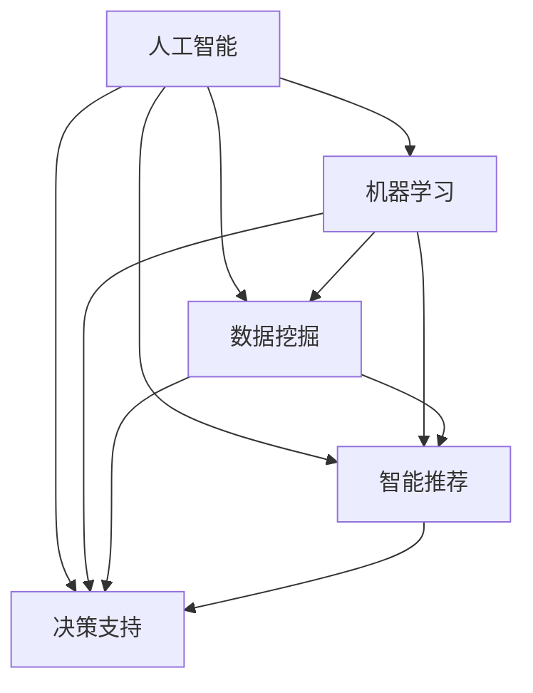

                 

# 人工智能在知识发现中的应用

> 关键词：人工智能, 知识发现, 机器学习, 数据挖掘, 智能推荐, 决策支持

## 1. 背景介绍

### 1.1 问题由来

在信息爆炸的时代，知识的获取和应用变得愈发重要。传统的知识获取方式依靠手工梳理和整理，耗费时间和精力。而人工智能技术，特别是机器学习和数据挖掘技术，为知识发现提供了全新的视角和方法。通过自动化地分析和挖掘海量数据，人工智能能够从数据中提炼出有价值的信息和知识，显著提高知识发现的效率和准确性。

本文将系统探讨人工智能在知识发现中的应用，涵盖机器学习、数据挖掘、智能推荐和决策支持等多个领域。通过理论结合实践，本文将展示人工智能在知识发现中的强大能力和潜力，为相关领域的进一步研究和应用提供参考。

### 1.2 问题核心关键点

人工智能在知识发现中，通过自动化学习和分析大量数据，帮助人类发现隐含的规律、模式和关联。关键点包括：

- **数据驱动**：以数据为中心，通过统计学习、深度学习等方法进行知识发现。
- **自动分析**：无需人工干预，机器学习算法能够自动分析数据，识别出有价值的知识。
- **多维度融合**：结合多源数据和不同类型知识，提升知识发现的全面性和准确性。
- **智能推荐**：根据用户行为和偏好，进行个性化推荐，提升用户体验和满意度。
- **决策支持**：通过数据分析和建模，为决策提供依据，提升决策的科学性和合理性。

本文将详细分析这些关键点，并结合具体案例和实例，展示人工智能在知识发现中的实际应用。

## 2. 核心概念与联系

### 2.1 核心概念概述

为更好地理解人工智能在知识发现中的应用，本节将介绍几个密切相关的核心概念：

- **人工智能(Artificial Intelligence, AI)**：一种能够模拟人类智能行为的技术体系，包括学习、推理、自然语言处理等。
- **机器学习(Machine Learning, ML)**：通过数据驱动的方式，让机器自动学习，发现数据中的规律和模式。
- **数据挖掘(Data Mining)**：从海量数据中提取有用信息和知识的过程，包括分类、聚类、关联规则挖掘等。
- **智能推荐(Recommendation Systems)**：根据用户行为和偏好，自动推荐合适的产品、信息和服务。
- **决策支持(Decision Support Systems, DSS)**：利用数据分析和建模，为决策提供科学依据，提升决策质量。

这些核心概念之间的逻辑关系可以通过以下Mermaid流程图来展示：



这个流程图展示了几大核心概念之间的关联性：

1. 人工智能是整个技术体系的统称。
2. 机器学习是人工智能中的核心技术，通过数据驱动的方式进行学习。
3. 数据挖掘是机器学习的一部分，主要从数据中提取有用信息和知识。
4. 智能推荐和决策支持是人工智能在特定应用领域的体现，通过自动化分析和推荐，提升决策质量。

这些概念共同构成了人工智能在知识发现中的主要技术框架，为其在各领域的应用提供了理论基础。

## 3. 核心算法原理 & 具体操作步骤

### 3.1 算法原理概述

人工智能在知识发现中，主要通过机器学习和数据挖掘算法，从数据中提取有价值的信息和知识。这些算法包括但不限于：

- **分类算法**：将数据分成不同的类别，如K-Means、SVM等。
- **聚类算法**：将相似的数据点聚为一类，如层次聚类、DBSCAN等。
- **关联规则挖掘**：从大量交易数据中发现规则，如Apriori算法、FP-growth算法等。
- **推荐算法**：根据用户行为进行个性化推荐，如协同过滤、基于内容的推荐等。
- **预测算法**：基于历史数据预测未来趋势，如线性回归、神经网络等。

这些算法通过自动化地处理数据，发现数据中的规律和模式，从而实现知识发现。

### 3.2 算法步骤详解

以下以机器学习中的分类算法为例，介绍基于机器学习的知识发现步骤：

**Step 1: 数据预处理**
- 收集数据集，并进行清洗、去重、归一化等预处理操作。
- 划分训练集和测试集，用于模型训练和验证。

**Step 2: 特征工程**
- 选择和构造有意义的特征，如文本中的关键词、时间戳、用户行为等。
- 对特征进行编码和处理，转化为模型可以接受的格式。

**Step 3: 模型训练**
- 选择合适的机器学习算法，如K-Means、SVM等。
- 设定模型参数，并进行训练，最小化预测误差。

**Step 4: 模型评估**
- 使用测试集对模型进行评估，计算准确率、召回率、F1-score等指标。
- 根据评估结果调整模型参数，提升模型性能。

**Step 5: 模型应用**
- 将训练好的模型应用于实际问题，进行预测、分类、聚类等任务。
- 根据应用效果，进一步优化和调整模型。

### 3.3 算法优缺点

基于机器学习的知识发现方法，具有以下优点：

- **自动化程度高**：算法能够自动分析数据，发现数据中的规律和模式。
- **泛化能力强**：通过大量数据训练，模型能够适应多种数据分布。
- **可解释性强**：许多机器学习算法具有较好的可解释性，便于理解模型的决策过程。

但同时，这些方法也存在一些局限性：

- **数据依赖性强**：需要大量的标注数据或领域专家知识。
- **算法复杂度高**：部分算法计算复杂度较高，训练时间较长。
- **模型风险**：过度拟合训练数据，可能导致模型泛化能力不足。

### 3.4 算法应用领域

基于机器学习的知识发现方法，广泛应用于多个领域，例如：

- **金融风控**：利用分类和聚类算法，进行信用风险评估和客户分类。
- **电子商务**：通过关联规则挖掘，发现用户的购买行为规律，进行个性化推荐。
- **医疗诊断**：应用分类和预测算法，进行疾病诊断和治疗方案推荐。
- **供应链管理**：使用聚类和关联规则挖掘，优化库存管理和物流配送。
- **市场营销**：通过分类和预测算法，进行市场细分和客户分群。

此外，知识发现技术还被应用于城市规划、教育分析、环境监测等多个领域，为决策提供科学依据，提升决策的科学性和合理性。

## 4. 数学模型和公式 & 详细讲解 & 举例说明

### 4.1 数学模型构建

本节将使用数学语言对基于机器学习的知识发现过程进行更加严格的刻画。

记数据集为 $\{(x_i, y_i)\}_{i=1}^N$，其中 $x_i$ 为输入特征，$y_i$ 为对应的标签。假设模型为 $f(x; \theta)$，其中 $\theta$ 为模型参数。

定义损失函数 $\ell(f(x; \theta), y_i)$ 用于衡量模型输出与真实标签之间的误差。常见的损失函数包括交叉熵损失、均方误差损失等。

模型训练的目标是找到最优参数 $\theta^*$，使得损失函数最小化：

$$
\theta^* = \mathop{\arg\min}_{\theta} \frac{1}{N} \sum_{i=1}^N \ell(f(x_i; \theta), y_i)
$$

通过梯度下降等优化算法，不断更新模型参数，直至收敛。

### 4.2 公式推导过程

以下以逻辑回归为例，推导分类模型的损失函数及其梯度公式。

假设数据集为 $\{(x_i, y_i)\}_{i=1}^N$，其中 $x_i$ 为特征向量，$y_i \in \{0, 1\}$ 为二分类标签。逻辑回归模型的输出为：

$$
y_i = \sigma(w^Tx_i + b)
$$

其中 $\sigma$ 为 sigmoid 函数，$w$ 和 $b$ 为模型参数。定义交叉熵损失函数为：

$$
\ell(y_i, \hat{y_i}) = -(y_i\log\hat{y_i} + (1-y_i)\log(1-\hat{y_i}))
$$

则损失函数为：

$$
\mathcal{L}(w, b) = -\frac{1}{N}\sum_{i=1}^N \ell(y_i, \sigma(w^Tx_i + b))
$$

对损失函数求导，得到模型参数的梯度公式：

$$
\frac{\partial \mathcal{L}(w, b)}{\partial w_j} = \frac{1}{N} \sum_{i=1}^N (x_{ij}(\hat{y_i}-y_i))
$$

$$
\frac{\partial \mathcal{L}(w, b)}{\partial b} = \frac{1}{N} \sum_{i=1}^N (\hat{y_i}-y_i)
$$

其中 $x_{ij}$ 为特征向量 $x_i$ 的第 $j$ 维特征。

### 4.3 案例分析与讲解

以下以信用风险评估为例，展示如何利用逻辑回归模型进行知识发现：

**数据集**：收集银行贷款数据集，包含贷款金额、贷款期限、还款记录等特征，以及是否违约的标签。

**特征选择**：选择贷款金额、还款记录等关键特征，忽略不相关特征。

**模型训练**：使用逻辑回归模型进行训练，计算交叉熵损失，并通过梯度下降更新模型参数。

**模型评估**：使用测试集对模型进行评估，计算准确率、召回率、F1-score等指标。

**模型应用**：将训练好的模型应用于新贷款申请的信用风险评估，预测违约概率，辅助银行决策。

## 5. 项目实践：代码实例和详细解释说明

### 5.1 开发环境搭建

在进行知识发现实践前，我们需要准备好开发环境。以下是使用Python进行Scikit-Learn开发的环境配置流程：

1. 安装Anaconda：从官网下载并安装Anaconda，用于创建独立的Python环境。

2. 创建并激活虚拟环境：
```bash
conda create -n scikit-learn-env python=3.8 
conda activate scikit-learn-env
```

3. 安装Scikit-Learn：从官网获取对应的安装命令。例如：
```bash
conda install scikit-learn -c conda-forge
```

4. 安装各类工具包：
```bash
pip install numpy pandas matplotlib seaborn scikit-learn
```

完成上述步骤后，即可在`scikit-learn-env`环境中开始知识发现实践。

### 5.2 源代码详细实现

这里我们以信用风险评估为例，给出使用Scikit-Learn进行逻辑回归模型开发的Python代码实现。

首先，准备数据集：

```python
from sklearn.datasets import load_breast_cancer
from sklearn.model_selection import train_test_split
from sklearn.linear_model import LogisticRegression
from sklearn.metrics import accuracy_score

# 加载数据集
data = load_breast_cancer()
X, y = data.data, data.target

# 划分训练集和测试集
X_train, X_test, y_train, y_test = train_test_split(X, y, test_size=0.2, random_state=42)
```

然后，定义模型和训练参数：

```python
# 定义逻辑回归模型
model = LogisticRegression(max_iter=1000)

# 设定训练参数
model.fit(X_train, y_train)
```

接着，进行模型评估和应用：

```python
# 预测测试集结果
y_pred = model.predict(X_test)

# 计算准确率
accuracy = accuracy_score(y_test, y_pred)
print(f"Accuracy: {accuracy:.2f}")
```

### 5.3 代码解读与分析

让我们再详细解读一下关键代码的实现细节：

**load_breast_cancer函数**：
- 从Scikit-Learn中加载经典的数据集 breast cancer，用于逻辑回归模型的训练和测试。

**train_test_split函数**：
- 将数据集划分为训练集和测试集，测试集占比20%，使用随机数生成器保证可复现性。

**LogisticRegression模型**：
- 定义逻辑回归模型，并设定最大迭代次数为1000次。

**模型训练**：
- 使用训练集数据对模型进行拟合训练。

**预测和评估**：
- 对测试集数据进行预测，并使用准确率评估模型性能。

可以看到，Scikit-Learn库提供了丰富的机器学习工具和接口，使得模型开发和应用变得简洁高效。开发者可以将更多精力放在数据处理和模型改进上，而不必过多关注底层的实现细节。

## 6. 实际应用场景

### 6.1 金融风控

金融风控是知识发现技术的重要应用场景之一。传统金融风控依靠人工审核和经验判断，效率低、成本高。而基于机器学习的风控模型，能够自动分析海量数据，识别出潜在的信用风险，提升风险评估的准确性和效率。

具体而言，可以收集历史贷款数据，提取关键特征，如贷款金额、还款记录、信用评分等。在此基础上对逻辑回归模型进行微调，使其能够预测贷款违约概率。对于新申请的贷款，通过逻辑回归模型进行风险评估，辅助银行决策。

### 6.2 电子商务

电子商务领域中，推荐系统是提升用户体验和增加销售的关键技术。传统的推荐系统依靠用户行为数据，如浏览记录、购买历史等，进行个性化推荐。而基于机器学习的推荐模型，能够利用用户行为数据和商品属性，发现用户和商品之间的关联关系，提供更加精准的推荐。

具体而言，可以收集用户浏览、点击、购买等行为数据，提取商品标题、描述、价格等属性特征。在此基础上对协同过滤算法进行训练，找出用户和商品之间的相似性，进行个性化推荐。对于新商品，可以通过推荐模型预测用户兴趣，提升新商品曝光率，增加销售量。

### 6.3 医疗诊断

医疗诊断是知识发现技术在医疗领域的重要应用。传统的医疗诊断依靠医生的经验判断，时间成本高、误诊率高。而基于机器学习的诊断模型，能够自动分析医学影像和病历数据，识别出疾病的特征和风险，提升诊断的准确性和效率。

具体而言，可以收集医学影像数据和病历数据，提取关键特征，如肿瘤大小、病灶位置等。在此基础上对分类算法进行训练，识别出肿瘤类型、疾病风险等。对于新病人的诊断，通过分类模型进行预测，辅助医生决策。

### 6.4 未来应用展望

随着人工智能技术的发展，基于机器学习的知识发现技术将在更多领域得到应用，为各行各业带来变革性影响。

在智慧城市治理中，知识发现技术可以应用于城市事件监测、舆情分析、应急指挥等环节，提高城市管理的自动化和智能化水平，构建更安全、高效的未来城市。

在智慧教育领域，知识发现技术可以应用于作业批改、学情分析、知识推荐等方面，因材施教，促进教育公平，提高教学质量。

在智慧医疗领域，知识发现技术可以应用于疾病预测、治疗方案推荐、药物研发等环节，提升医疗服务的智能化水平，加速新药开发进程。

此外，在农业、环保、能源等多个领域，知识发现技术也将不断涌现，为行业发展注入新的动力。

## 7. 工具和资源推荐

### 7.1 学习资源推荐

为了帮助开发者系统掌握知识发现技术的理论基础和实践技巧，这里推荐一些优质的学习资源：

1. 《机器学习实战》系列博文：由机器学习专家撰写，深入浅出地介绍了机器学习的基本概念和经典算法。

2. 斯坦福大学《机器学习》课程：由机器学习领域的泰斗Andrew Ng教授主讲，涵盖机器学习的理论和实践，是学习机器学习的必选课程。

3. 《数据挖掘与统计学习》书籍：详细介绍了数据挖掘和统计学习的原理和方法，是数据挖掘领域的经典教材。

4. Scikit-Learn官方文档：Scikit-Learn库的官方文档，提供了丰富的学习资源和样例代码，是上手实践的必备资料。

5. Kaggle平台：全球最大的数据科学竞赛平台，提供海量数据集和竞赛题目，是提升机器学习和数据挖掘技能的好地方。

通过对这些资源的学习实践，相信你一定能够快速掌握知识发现技术的精髓，并用于解决实际的业务问题。

### 7.2 开发工具推荐

高效的开发离不开优秀的工具支持。以下是几款用于知识发现开发的常用工具：

1. Python：开源的编程语言，具有丰富的第三方库和框架，适用于机器学习和数据挖掘。

2. Scikit-Learn：基于Python的开源机器学习库，提供了丰富的算法和接口，简单易用。

3. TensorFlow：由Google主导开发的开源机器学习框架，支持分布式计算和大规模模型训练。

4. PyTorch：由Facebook开发的开源深度学习框架，灵活高效，适用于复杂的深度学习模型。

5. Weights & Biases：模型训练的实验跟踪工具，可以记录和可视化模型训练过程中的各项指标，方便对比和调优。

6. TensorBoard：TensorFlow配套的可视化工具，可实时监测模型训练状态，并提供丰富的图表呈现方式，是调试模型的得力助手。

合理利用这些工具，可以显著提升知识发现任务的开发效率，加快创新迭代的步伐。

### 7.3 相关论文推荐

知识发现技术的发展源于学界的持续研究。以下是几篇奠基性的相关论文，推荐阅读：

1. On the Shoulders of Giants: The Elements of Computing Systems（《程序员修炼之道》）：由计算机领域的经典书籍，介绍了编程、算法、数据结构等基础内容，是学习计算机科学的重要参考。

2. TensorFlow: A System for Large-Scale Machine Learning：介绍TensorFlow框架的设计和实现，是理解深度学习和分布式计算的好材料。

3. Scikit-Learn: Machine Learning in Python：介绍Scikit-Learn库的算法和接口，是机器学习开发的重要工具。

4. Data Mining: Concepts and Techniques（《数据挖掘概念与技术》）：详细介绍了数据挖掘的理论和实践，是数据挖掘领域的经典教材。

这些论文代表了大数据和机器学习技术的发展脉络。通过学习这些前沿成果，可以帮助研究者把握学科前进方向，激发更多的创新灵感。

## 8. 总结：未来发展趋势与挑战

### 8.1 总结

本文对基于机器学习的知识发现方法进行了全面系统的介绍。首先阐述了知识发现技术在金融风控、电子商务、医疗诊断等多个领域的应用背景和价值，明确了机器学习和数据挖掘技术在知识发现中的重要作用。其次，从原理到实践，详细讲解了机器学习模型的构建、训练、评估和应用，给出了知识发现任务开发的完整代码实例。同时，本文还广泛探讨了知识发现技术在各行业领域的应用前景，展示了其巨大的潜力。

通过本文的系统梳理，可以看到，基于机器学习的知识发现方法正在成为各行各业的重要工具，极大地提升了数据驱动决策的效率和准确性。未来，伴随深度学习、自然语言处理等技术的进一步发展，知识发现技术将迎来新的突破，推动各领域智能化水平的进一步提升。

### 8.2 未来发展趋势

展望未来，知识发现技术将呈现以下几个发展趋势：

1. **深度学习成为主流**：深度学习模型在处理复杂数据时表现优异，将成为知识发现技术的重要手段。

2. **多模态数据融合**：结合视觉、语音、文本等多模态数据，提升知识发现的全面性和准确性。

3. **自动化程度提高**：自动化特征选择、模型训练、结果解释等环节，提升知识发现的效率和可解释性。

4. **跨领域应用拓展**：知识发现技术将在更多领域得到应用，推动各行业的数字化转型升级。

5. **决策支持系统智能化**：通过机器学习与专家知识结合，构建智能决策支持系统，提升决策的科学性和合理性。

这些趋势凸显了知识发现技术的广阔前景，必将进一步推动各行各业的智能化进程。

### 8.3 面临的挑战

尽管知识发现技术已经取得了显著成果，但在迈向更加智能化、普适化应用的过程中，仍面临诸多挑战：

1. **数据隐私和安全**：在处理敏感数据时，需要保障数据隐私和安全，防止数据泄露和滥用。

2. **模型鲁棒性**：知识发现模型需要具备良好的鲁棒性，避免对训练数据的过度拟合，提升模型的泛化能力。

3. **数据质量问题**：数据质量的参差不齐，可能导致知识发现的准确性降低。

4. **模型复杂度**：部分复杂模型计算资源消耗大，训练和推理速度较慢，需要进一步优化。

5. **解释性不足**：部分知识发现模型缺乏可解释性，难以理解其内部工作机制和决策过程。

6. **领域知识缺乏**：跨领域知识迁移困难，难以在不同的应用场景中推广应用。

正视这些挑战，积极应对并寻求突破，将是大数据和机器学习技术迈向成熟的必由之路。相信随着学界和产业界的共同努力，这些挑战终将一一被克服，知识发现技术必将在构建人机协同的智能时代中扮演越来越重要的角色。

### 8.4 研究展望

面向未来，知识发现技术的研究方向可以从以下几个方面进行探索：

1. **自动化特征选择**：引入自动化特征选择方法，提升特征工程效率和模型性能。

2. **多模态数据融合**：结合多种数据源和模态，构建多模态知识发现模型。

3. **模型可解释性**：引入可解释性技术，提升知识发现模型的透明性和可信度。

4. **跨领域知识迁移**：通过领域自适应方法，实现知识在不同领域的迁移和应用。

5. **数据隐私保护**：研究数据隐私保护技术，保障数据安全和隐私。

6. **模型优化和加速**：通过模型压缩、量化加速等方法，提升知识发现模型的效率和性能。

这些研究方向将为知识发现技术带来新的突破，推动其在更多领域的应用和发展。

## 9. 附录：常见问题与解答

**Q1：知识发现技术是否适用于所有数据类型？**

A: 知识发现技术主要适用于结构化数据和半结构化数据，如表格数据、文本数据等。对于非结构化数据，如视频、音频等，需要进一步处理和预处理，才能进行知识发现。

**Q2：知识发现算法是否需要大量的标注数据？**

A: 部分知识发现算法需要大量的标注数据，如分类算法、聚类算法等。但对于无监督和半监督算法，如关联规则挖掘、主成分分析等，则无需标注数据。

**Q3：知识发现算法如何处理噪声和缺失数据？**

A: 在处理数据时，需要考虑噪声和缺失数据的处理方法，如数据清洗、填补缺失值、降维等。部分算法，如回归算法，可以直接处理噪声和缺失数据。

**Q4：知识发现算法的计算复杂度如何？**

A: 部分算法计算复杂度较高，如神经网络、深度学习等。需要使用高性能计算资源进行训练和推理。

**Q5：知识发现算法的可解释性如何？**

A: 部分知识发现算法具备较好的可解释性，如逻辑回归、决策树等。但对于深度学习和黑箱算法，如神经网络、随机森林等，可解释性较差，需要通过特征工程、可视化工具等手段进行解释。

---

作者：禅与计算机程序设计艺术 / Zen and the Art of Computer Programming

