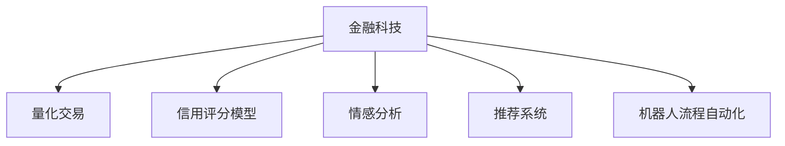

                 

# 人工智能在金融和经济中的应用

## 1. 背景介绍

金融和经济领域一直是人工智能(AI)应用的重点领域，近年来随着深度学习、自然语言处理等AI技术的突破性进展，AI在金融和经济中的应用不断拓展和深化。AI技术在风险控制、市场分析、客户服务、业务决策等多个方面展现出卓越的潜力。本文将从金融和经济的多个应用场景出发，介绍AI技术的最新应用案例，探讨其潜在的商业价值和未来发展方向。

## 2. 核心概念与联系

### 2.1 核心概念概述

为更好地理解AI在金融和经济中的应用，本节将介绍几个核心概念：

- **金融科技(Fintech)**：以AI和互联网技术为驱动，通过创新金融服务和业务模式，提高金融系统的效率和公平性。
- **量化交易(Quantitative Trading)**：基于数据驱动和大规模计算，利用算法模型进行交易决策，以期获得超额收益。
- **信用评分模型(Credit Scoring Model)**：利用AI模型评估借款人的信用风险，辅助金融决策。
- **情感分析(Sentiment Analysis)**：通过自然语言处理技术分析市场情绪和客户反馈，预测市场变化。
- **推荐系统(Recommendation System)**：根据用户行为和偏好，推荐个性化的金融产品和服务。
- **机器人流程自动化(RPA)**：通过AI驱动的自动化工具，提高金融业务流程的效率和准确性。

这些核心概念之间的逻辑关系可以通过以下Mermaid流程图来展示：



### 2.2 核心概念原理和架构

#### 2.2.1 金融科技

金融科技是传统金融行业与互联网、AI技术的深度融合。其核心思想是通过技术手段优化金融业务流程，降低交易成本，提高金融服务的覆盖面和效率。金融科技的架构一般包括：

- **底层技术**：云计算、大数据、区块链等基础设施。
- **中台系统**：包括数据中台、AI中台、客户中台等，提供数据共享和业务复用。
- **前端应用**：如移动应用、网上银行、支付系统等，直接面向用户。

#### 2.2.2 量化交易

量化交易是基于数据分析和机器学习算法进行自动交易的过程。其核心架构包括：

- **数据源**：实时市场数据、历史交易数据等。
- **算法模型**：如神经网络、时间序列分析模型等。
- **交易系统**：连接交易所和清算系统的系统。
- **监控和风险控制**：实时监控交易行为，防范潜在的系统风险。

#### 2.2.3 信用评分模型

信用评分模型是利用AI技术评估借款人信用风险的模型。其核心架构包括：

- **数据收集与清洗**：获取借款人的各类信息，如收入、资产、信用记录等。
- **特征工程**：提取与信用评分相关的特征。
- **模型训练与评估**：使用机器学习算法训练评分模型，并评估模型性能。
- **应用部署**：将训练好的模型部署到业务系统中，实时计算信用评分。

#### 2.2.4 情感分析

情感分析是通过自然语言处理技术，从文本数据中提取情绪信息，用于金融市场分析和客户服务。其核心架构包括：

- **数据采集**：收集社交媒体、新闻、公告等文本数据。
- **文本预处理**：清洗、分词、向量化等预处理步骤。
- **情感模型**：如情感分类、情感回归模型等。
- **结果应用**：预测市场情绪，优化投资策略或提升客户服务。

#### 2.2.5 推荐系统

推荐系统是根据用户行为和偏好，推荐个性化的金融产品和服务的系统。其核心架构包括：

- **用户画像**：构建用户兴趣和行为的画像。
- **推荐算法**：如协同过滤、内容推荐算法等。
- **数据管理**：用户行为数据、产品信息等。
- **应用接口**：将推荐结果提供给前端应用，如移动应用、网站等。

#### 2.2.6 机器人流程自动化

RPA是通过AI驱动的自动化工具，优化和自动化金融业务流程。其核心架构包括：

- **任务定义**：定义需要自动化的金融业务流程。
- **自动化工具**：如UiPath、Blue Prism等RPA平台。
- **流程监控**：实时监控自动化流程，确保流程顺利执行。
- **接口集成**：与金融系统的集成，确保数据一致性和系统稳定。

## 3. 核心算法原理 & 具体操作步骤

### 3.1 算法原理概述

AI在金融和经济中的应用，通常基于大量的数据和复杂的算法模型进行决策和分析。以下是几个典型应用场景的算法原理概述：

#### 3.1.1 量化交易

量化交易的算法模型通常基于历史交易数据、市场情绪和基本面数据。模型通过训练数据集，学习市场规律和交易模式，进而预测未来的价格走势，进行交易决策。其算法原理包括：

- **市场数据处理**：清洗、归一化、特征提取等步骤。
- **时间序列分析**：利用ARIMA、LSTM等模型进行时间序列预测。
- **特征选择与融合**：选择与预测目标相关的特征，并结合多种模型进行融合。
- **回测与优化**：通过历史数据对模型进行回测，调整模型参数，优化策略。

#### 3.1.2 信用评分模型

信用评分模型的算法原理基于机器学习算法，对借款人的信用行为进行建模和预测。具体步骤包括：

- **数据收集与预处理**：获取借款人的各类信息，并进行清洗和处理。
- **特征工程**：选择和构造与信用评分相关的特征。
- **模型训练与评估**：使用逻辑回归、随机森林等算法训练评分模型，并评估模型性能。
- **模型部署与监控**：将训练好的模型部署到业务系统中，实时计算信用评分，并监控模型表现。

#### 3.1.3 情感分析

情感分析的算法原理基于自然语言处理技术，从文本数据中提取情绪信息。具体步骤包括：

- **文本预处理**：清洗、分词、向量化等预处理步骤。
- **情感模型训练**：使用情感分类模型、情感回归模型等进行训练。
- **情绪分析与预测**：从市场数据、新闻、公告等文本中提取情绪信息，预测市场变化。
- **结果应用**：优化投资策略或提升客户服务。

#### 3.1.4 推荐系统

推荐系统的算法原理基于协同过滤、内容推荐等算法，通过用户行为和偏好，推荐个性化的金融产品和服务。具体步骤包括：

- **用户画像构建**：根据用户行为数据，构建用户兴趣和行为的画像。
- **推荐算法训练**：使用协同过滤、内容推荐等算法训练推荐模型。
- **推荐结果生成**：根据用户画像和推荐算法，生成个性化的推荐结果。
- **应用接口提供**：将推荐结果提供给前端应用，如移动应用、网站等。

#### 3.1.5 机器人流程自动化

RPA的算法原理基于流程定义和任务调度，通过AI驱动的自动化工具，优化和自动化金融业务流程。具体步骤包括：

- **任务定义与编排**：定义需要自动化的金融业务流程，并编排任务的执行顺序。
- **自动化工具调用**：调用RPA平台提供的自动化工具，执行具体的金融业务任务。
- **流程监控与控制**：实时监控自动化流程，确保流程顺利执行，处理异常情况。
- **接口集成与数据同步**：与金融系统的集成，确保数据一致性和系统稳定。

### 3.2 算法步骤详解

#### 3.2.1 量化交易

量化交易的详细步骤包括：

1. **数据收集**：收集历史交易数据、市场数据、基本面数据等。
2. **数据预处理**：清洗、归一化、特征提取等步骤。
3. **模型训练**：使用机器学习算法训练预测模型，如ARIMA、LSTM等。
4. **策略回测**：通过历史数据对模型进行回测，评估策略性能。
5. **实时交易**：在市场实时数据上，根据模型预测结果进行交易决策。

#### 3.2.2 信用评分模型

信用评分模型的详细步骤包括：

1. **数据收集与预处理**：获取借款人的各类信息，并进行清洗和处理。
2. **特征工程**：选择和构造与信用评分相关的特征。
3. **模型训练**：使用逻辑回归、随机森林等算法训练评分模型。
4. **模型评估与优化**：评估模型性能，调整模型参数，优化策略。
5. **模型部署**：将训练好的模型部署到业务系统中，实时计算信用评分。

#### 3.2.3 情感分析

情感分析的详细步骤包括：

1. **数据采集**：收集社交媒体、新闻、公告等文本数据。
2. **文本预处理**：清洗、分词、向量化等预处理步骤。
3. **情感模型训练**：使用情感分类模型、情感回归模型等进行训练。
4. **情绪分析与预测**：从文本数据中提取情绪信息，预测市场变化。
5. **结果应用**：优化投资策略或提升客户服务。

#### 3.2.4 推荐系统

推荐系统的详细步骤包括：

1. **用户画像构建**：根据用户行为数据，构建用户兴趣和行为的画像。
2. **推荐算法训练**：使用协同过滤、内容推荐等算法训练推荐模型。
3. **推荐结果生成**：根据用户画像和推荐算法，生成个性化的推荐结果。
4. **应用接口提供**：将推荐结果提供给前端应用，如移动应用、网站等。

#### 3.2.5 机器人流程自动化

RPA的详细步骤包括：

1. **任务定义与编排**：定义需要自动化的金融业务流程，并编排任务的执行顺序。
2. **自动化工具调用**：调用RPA平台提供的自动化工具，执行具体的金融业务任务。
3. **流程监控与控制**：实时监控自动化流程，确保流程顺利执行，处理异常情况。
4. **接口集成与数据同步**：与金融系统的集成，确保数据一致性和系统稳定。

### 3.3 算法优缺点

#### 3.3.1 量化交易

- **优点**：
  - **高效率**：基于算法决策，交易速度快。
  - **客观性**：基于数据分析，减少人为干扰。
  - **风险控制**：通过模型评估风险，优化投资策略。

- **缺点**：
  - **模型风险**：模型过于复杂或数据不足可能导致模型失效。
  - **市场变化**：市场变化超乎预期，模型预测失效。

#### 3.3.2 信用评分模型

- **优点**：
  - **自动化决策**：通过模型自动化评估信用风险。
  - **数据驱动**：基于数据驱动的决策，减少人为主观因素。
  - **实时评估**：实时计算信用评分，提高决策效率。

- **缺点**：
  - **数据局限性**：数据质量、数量影响模型效果。
  - **模型偏差**：模型训练数据偏差可能导致评估偏差。

#### 3.3.3 情感分析

- **优点**：
  - **市场预测**：及时获取市场情绪信息，预测市场变化。
  - **客户服务**：提升客户体验，优化服务质量。
  - **决策支持**：为投资策略优化提供数据支持。

- **缺点**：
  - **文本复杂性**：文本数据复杂，处理难度大。
  - **情绪解读**：情绪解读可能存在误差，影响预测结果。

#### 3.3.4 推荐系统

- **优点**：
  - **个性化服务**：根据用户行为和偏好，提供个性化推荐。
  - **数据利用**：充分利用用户行为数据，提高服务质量。
  - **用户体验**：提升用户粘性和满意度。

- **缺点**：
  - **冷启动问题**：新用户或少交互用户推荐效果差。
  - **数据隐私**：用户行为数据可能涉及隐私问题。

#### 3.3.5 机器人流程自动化

- **优点**：
  - **提高效率**：自动化流程减少人工操作，提高效率。
  - **降低错误**：减少人为错误，提高流程稳定性。
  - **灵活性**：流程编排灵活，适应性强。

- **缺点**：
  - **成本投入**：初始实施和维护成本较高。
  - **依赖系统**：依赖现有金融系统的接口，限制较大。

### 3.4 算法应用领域

#### 3.4.1 量化交易

量化交易主要应用于高频交易、套利交易、程序化交易等领域。金融机构和交易公司利用量化模型进行自动交易决策，以期获取超额收益。

#### 3.4.2 信用评分模型

信用评分模型主要应用于贷款审批、信用风险评估等领域。金融机构通过信用评分模型评估借款人的信用风险，优化贷款审批流程，降低违约风险。

#### 3.4.3 情感分析

情感分析主要应用于市场情绪监测、舆情分析、投资策略优化等领域。金融公司利用情感分析技术，及时获取市场情绪信息，优化投资策略，提升客户服务质量。

#### 3.4.4 推荐系统

推荐系统主要应用于个性化金融服务、产品推荐等领域。金融机构通过推荐系统，提供个性化的金融产品和服务，提升用户满意度和忠诚度。

#### 3.4.5 机器人流程自动化

RPA主要应用于业务流程自动化、客户服务自动化等领域。金融机构通过RPA工具，优化金融业务流程，提升业务效率和客户服务体验。

## 4. 数学模型和公式 & 详细讲解 & 举例说明

### 4.1 数学模型构建

#### 4.1.1 量化交易

量化交易的数学模型主要基于时间序列分析、机器学习等方法，其核心数学模型包括：

- **ARIMA模型**：自回归移动平均模型，用于时间序列预测。
- **LSTM模型**：长短期记忆网络，用于复杂序列数据的处理。
- **回归模型**：线性回归、逻辑回归等，用于分类和回归问题。

#### 4.1.2 信用评分模型

信用评分模型的数学模型主要基于逻辑回归、随机森林等方法，其核心数学模型包括：

- **逻辑回归模型**：用于二分类问题，评估借款人是否违约。
- **随机森林模型**：用于多分类问题，评估借款人的信用等级。

#### 4.1.3 情感分析

情感分析的数学模型主要基于情感分类、情感回归等方法，其核心数学模型包括：

- **情感分类模型**：用于文本情感分类，如情感二分类、情感多分类。
- **情感回归模型**：用于文本情感回归，如情感评分。

#### 4.1.4 推荐系统

推荐系统的数学模型主要基于协同过滤、内容推荐等方法，其核心数学模型包括：

- **协同过滤模型**：用于用户行为相似性计算，生成推荐结果。
- **内容推荐模型**：用于根据用户行为和产品特征，生成推荐结果。

#### 4.1.5 机器人流程自动化

RPA的数学模型主要基于流程编排、任务调度等方法，其核心数学模型包括：

- **流程编排模型**：用于任务定义和编排，确保流程顺利执行。
- **任务调度模型**：用于自动化工具的调用和任务执行顺序控制。

### 4.2 公式推导过程

#### 4.2.1 量化交易

量化交易的公式推导过程包括：

- **ARIMA模型**：
  $$
  y_t = c + \sum_{i=1}^p \alpha_i y_{t-i} + \sum_{j=1}^d \beta_j \epsilon_{t-j} + \sum_{k=1}^q \gamma_k \epsilon_{t+k}
  $$
  其中，$y_t$ 为时间$t$的预测值，$c$ 为截距，$\alpha_i$ 和 $\beta_j$ 为模型参数，$\epsilon_{t-j}$ 为误差项。

- **LSTM模型**：
  $$
  h_t = \tanh(W_{hh} h_{t-1} + W_{hX} x_t + b_h)
  $$
  $$
  o_t = \sigma(W_{ho} h_t + b_o)
  $$
  $$
  c_t = o_t \odot \tanh(h_t)
  $$
  其中，$h_t$ 为时间$t$的隐藏状态，$x_t$ 为时间$t$的输入数据，$W_{hh}$、$W_{hX}$、$b_h$、$W_{ho}$、$b_o$ 为模型参数，$\sigma$ 为sigmoid函数。

#### 4.2.2 信用评分模型

信用评分模型的公式推导过程包括：

- **逻辑回归模型**：
  $$
  P(y=1|x) = \frac{1}{1+e^{-z}}
  $$
  $$
  z = w^T x + b
  $$
  其中，$P(y=1|x)$ 为预测值，$w$ 和 $b$ 为模型参数，$x$ 为输入数据。

- **随机森林模型**：
  $$
  F(x) = \frac{1}{M} \sum_{m=1}^M F_m(x)
  $$
  其中，$F(x)$ 为预测值，$M$ 为树的数量，$F_m(x)$ 为第$m$棵树的预测值。

#### 4.2.3 情感分析

情感分析的公式推导过程包括：

- **情感分类模型**：
  $$
  P(C|x) = \frac{e^{W_C^T x + b_C}}{\sum_{c=1}^C e^{W_c^T x + b_c}}
  $$
  其中，$P(C|x)$ 为分类概率，$W_C$ 和 $b_C$ 为模型参数，$C$ 为类别数量。

- **情感回归模型**：
  $$
  y = w^T x + b
  $$
  其中，$y$ 为预测值，$w$ 和 $b$ 为模型参数，$x$ 为输入数据。

#### 4.2.4 推荐系统

推荐系统的公式推导过程包括：

- **协同过滤模型**：
  $$
  \hat{r}_{ui} = e^{\hat{p}_{ui}}
  $$
  $$
  \hat{p}_{ui} = \hat{q}_u^T K^{-1} \hat{p}_i
  $$
  其中，$\hat{r}_{ui}$ 为预测评分，$\hat{p}_{ui}$ 为预测向量，$K$ 为相似度矩阵，$K^{-1}$ 为其逆矩阵，$\hat{q}_u$ 和 $\hat{p}_i$ 为用户和商品的嵌入向量。

- **内容推荐模型**：
  $$
  \hat{y} = w^T x + b
  $$
  其中，$\hat{y}$ 为预测值，$w$ 和 $b$ 为模型参数，$x$ 为输入数据。

#### 4.2.5 机器人流程自动化

RPA的公式推导过程包括：

- **流程编排模型**：
  $$
  S = \sum_{i=1}^n P_i \cdot \mathrm{cost}_i
  $$
  其中，$S$ 为流程总成本，$P_i$ 为流程概率，$\mathrm{cost}_i$ 为流程成本。

- **任务调度模型**：
  $$
  T_i = \frac{1}{\sum_{j=1}^m P_{ij}} \sum_{j=1}^m \frac{P_{ij} \cdot D_{ij}}{C_j}
  $$
  其中，$T_i$ 为任务$i$的执行时间，$P_{ij}$ 为任务$i$和$j$的并发概率，$D_{ij}$ 为任务$i$和$j$的执行时间，$C_j$ 为任务$j$的并发数。

### 4.3 案例分析与讲解

#### 4.3.1 量化交易

**案例：高频交易策略开发**

某金融机构利用量化模型开发高频交易策略。其步骤如下：

1. **数据收集**：收集历史交易数据和市场数据。
2. **数据预处理**：清洗、归一化、特征提取。
3. **模型训练**：使用ARIMA模型进行时间序列预测。
4. **策略回测**：通过历史数据对模型进行回测，评估策略性能。
5. **实时交易**：在市场实时数据上，根据模型预测结果进行交易决策。

#### 4.3.2 信用评分模型

**案例：贷款审批流程优化**

某银行利用信用评分模型优化贷款审批流程。其步骤如下：

1. **数据收集与预处理**：获取借款人的各类信息，并进行清洗和处理。
2. **特征工程**：选择和构造与信用评分相关的特征。
3. **模型训练**：使用逻辑回归模型进行信用评分。
4. **模型评估与优化**：评估模型性能，调整模型参数，优化策略。
5. **模型部署**：将训练好的模型部署到业务系统中，实时计算信用评分。

#### 4.3.3 情感分析

**案例：市场情绪监测**

某基金公司利用情感分析技术监测市场情绪。其步骤如下：

1. **数据采集**：收集社交媒体、新闻、公告等文本数据。
2. **文本预处理**：清洗、分词、向量化。
3. **情感模型训练**：使用情感分类模型进行情感分类。
4. **情绪分析与预测**：从文本数据中提取情绪信息，预测市场变化。
5. **结果应用**：优化投资策略，提升客户服务质量。

#### 4.3.4 推荐系统

**案例：个性化金融服务**

某金融公司利用推荐系统提供个性化金融服务。其步骤如下：

1. **用户画像构建**：根据用户行为数据，构建用户兴趣和行为的画像。
2. **推荐算法训练**：使用协同过滤模型进行推荐算法训练。
3. **推荐结果生成**：根据用户画像和推荐算法，生成个性化的推荐结果。
4. **应用接口提供**：将推荐结果提供给前端应用，如移动应用、网站等。

#### 4.3.5 机器人流程自动化

**案例：客户服务自动化**

某银行利用RPA工具优化客户服务流程。其步骤如下：

1. **任务定义与编排**：定义需要自动化的客户服务流程，并编排任务的执行顺序。
2. **自动化工具调用**：调用RPA平台提供的自动化工具，执行具体的客户服务任务。
3. **流程监控与控制**：实时监控自动化流程，确保流程顺利执行，处理异常情况。
4. **接口集成与数据同步**：与客户服务系统的集成，确保数据一致性和系统稳定。

## 5. 项目实践：代码实例和详细解释说明

### 5.1 开发环境搭建

在进行AI项目实践前，我们需要准备好开发环境。以下是使用Python进行TensorFlow开发的环境配置流程：

1. 安装Anaconda：从官网下载并安装Anaconda，用于创建独立的Python环境。

2. 创建并激活虚拟环境：
```bash
conda create -n tf-env python=3.8 
conda activate tf-env
```

3. 安装TensorFlow：根据CUDA版本，从官网获取对应的安装命令。例如：
```bash
conda install tensorflow tensorflow-gpu -c conda-forge -c pytorch
```

4. 安装各类工具包：
```bash
pip install numpy pandas scikit-learn matplotlib tqdm jupyter notebook ipython
```

完成上述步骤后，即可在`tf-env`环境中开始AI项目实践。

### 5.2 源代码详细实现

这里我们以信用评分模型为例，给出使用TensorFlow进行开发的Python代码实现。

首先，定义信用评分模型的训练函数：

```python
import tensorflow as tf
from tensorflow.keras import layers, models
from sklearn.model_selection import train_test_split
import pandas as pd
import numpy as np

# 数据加载
df = pd.read_csv('credit_data.csv')
X = df.drop(['default'], axis=1)
y = df['default']

# 数据预处理
X_train, X_test, y_train, y_test = train_test_split(X, y, test_size=0.2)

# 模型定义
model = models.Sequential([
    layers.Dense(32, activation='relu', input_shape=[X_train.shape[1]]),
    layers.Dense(1, activation='sigmoid')
])

# 模型编译
model.compile(optimizer='adam', loss='binary_crossentropy', metrics=['accuracy'])

# 模型训练
model.fit(X_train, y_train, epochs=10, batch_size=32, validation_data=(X_test, y_test))
```

然后，定义信用评分模型的评估函数：

```python
# 模型评估
loss, accuracy = model.evaluate(X_test, y_test)
print('Test loss:', loss)
print('Test accuracy:', accuracy)
```

最后，运行训练和评估过程：

```python
# 模型训练与评估
model.fit(X_train, y_train, epochs=10, batch_size=32, validation_data=(X_test, y_test))
loss, accuracy = model.evaluate(X_test, y_test)
print('Test loss:', loss)
print('Test accuracy:', accuracy)
```

以上就是使用TensorFlow进行信用评分模型开发的完整代码实现。可以看到，得益于TensorFlow的强大封装，我们可以用相对简洁的代码完成模型的构建、训练和评估。

### 5.3 代码解读与分析

让我们再详细解读一下关键代码的实现细节：

**信用评分模型训练函数**：
- `df = pd.read_csv('credit_data.csv')`：读取信用评分数据集，包含用户各类信息（如收入、资产、信用记录等）和是否违约的标签。
- `X = df.drop(['default'], axis=1)`：删除目标标签，获取特征数据集。
- `y = df['default']`：获取目标标签数据集。
- `X_train, X_test, y_train, y_test = train_test_split(X, y, test_size=0.2)`：将数据集分为训练集和测试集。
- `model = models.Sequential([...]`：定义一个顺序模型，包含两个全连接层。
- `model.compile(optimizer='adam', loss='binary_crossentropy', metrics=['accuracy'])`：编译模型，选择Adam优化器，二分类交叉熵损失函数，评估指标为准确率。
- `model.fit(X_train, y_train, epochs=10, batch_size=32, validation_data=(X_test, y_test))`：训练模型，设置迭代轮数为10次，批次大小为32。
- `loss, accuracy = model.evaluate(X_test, y_test)`：评估模型性能，输出测试集上的损失和准确率。

**信用评分模型评估函数**：
- `loss, accuracy = model.evaluate(X_test, y_test)`：使用测试集评估模型性能，输出测试集上的损失和准确率。

**训练与评估流程**：
- `model.fit(X_train, y_train, epochs=10, batch_size=32, validation_data=(X_test, y_test))`：训练模型，并输出训练集和测试集的损失和准确率。
- `loss, accuracy = model.evaluate(X_test, y_test)`：评估模型性能，输出测试集上的损失和准确率。

可以看到，TensorFlow提供了一站式的机器学习开发平台，可以方便地进行模型定义、编译、训练、评估等操作，显著降低了AI应用的开发难度。开发者可以将更多精力放在数据处理、模型改进等高层逻辑上，而不必过多关注底层的实现细节。

当然，工业级的系统实现还需考虑更多因素，如模型的保存和部署、超参数的自动搜索、更灵活的任务适配层等。但核心的AI开发范式基本与此类似。

## 6. 实际应用场景

### 6.1 金融科技

金融科技在金融行业中的应用已经相当广泛，包括但不限于以下几个方面：

- **数字化银行**：利用AI技术优化银行服务，如智能客服、反欺诈检测、智能风控等。
- **区块链金融**：利用区块链技术进行去中心化金融服务，如智能合约、去中心化交易所等。
- **智能投顾**：利用AI技术提供个性化投资建议和资产管理服务。
- **供应链金融**：利用AI技术优化供应链管理，如预测库存需求、信用风险评估等。

### 6.2 量化交易

量化交易作为AI在金融市场中的重要应用之一，已经在高频交易、套利交易、程序化交易等领域取得了显著成效。通过算法模型对市场数据进行分析，自动进行交易决策，以期获取超额收益。

### 6.3 信用评分模型

信用评分模型在贷款审批、信用风险评估等领域发挥了重要作用，可以帮助金融机构优化贷款审批流程，降低违约风险。

### 6.4 情感分析

情感分析在市场情绪监测、舆情分析、投资策略优化等领域，帮助金融公司及时获取市场情绪信息，优化投资策略，提升客户服务质量。

### 6.5 推荐系统

推荐系统在个性化金融服务、产品推荐等领域，帮助金融机构提供个性化的金融产品和服务，提升用户满意度和忠诚度。

### 6.6 机器人流程自动化

RPA在客户服务自动化、业务流程优化等领域，帮助金融机构提高业务效率和客户服务体验。

## 7. 工具和资源推荐

### 7.1 学习资源推荐

为了帮助开发者系统掌握AI在金融和经济中的应用，这里推荐一些优质的学习资源：

1. **《深度学习》课程**：由斯坦福大学提供，系统介绍深度学习的基本概念和应用场景。
2. **《金融科技实战》课程**：由Coursera提供，涵盖金融科技的基本概念、技术实现和案例分析。
3. **《金融数据分析》书籍**：介绍金融数据分析的基本方法和技术，适用于金融领域的AI应用开发。
4. **《金融量化交易》书籍**：介绍量化交易的基本原理和方法，适用于量化交易的实践开发。
5. **《机器人流程自动化》书籍**：介绍RPA的基本原理和方法，适用于机器人流程自动化的实践开发。

通过对这些资源的学习实践，相信你一定能够快速掌握AI在金融和经济中的应用，并用于解决实际的金融问题。

### 7.2 开发工具推荐

高效的开发离不开优秀的工具支持。以下是几款用于AI开发常用的工具：

1. **Jupyter Notebook**：交互式编程环境，适用于数据探索、模型训练、结果展示等。
2. **TensorFlow**：Google提供的深度学习框架，支持分布式计算、模型优化等。
3. **Keras**：高层次的深度学习API，适用于快速原型开发和模型实验。
4. **PyTorch**：Facebook提供的深度学习框架，支持动态计算图和高效训练。
5. **RPA工具**：如UiPath、Blue Prism等，适用于自动化业务流程的开发。

合理利用这些工具，可以显著提升AI应用的开发效率，加快创新迭代的步伐。

### 7.3 相关论文推荐

AI在金融和经济中的应用涉及大量研究和论文，以下是几篇经典论文，推荐阅读：

1. **《Deep Learning in Credit Risk Management》**：介绍深度学习在信用评分中的应用。
2. **《Algorithmic Trading: From Theory to Practice》**：介绍量化交易的算法和实现。
3. **《Sentiment Analysis in Financial Markets》**：介绍情感分析在金融市场中的应用。
4. **《Recommendation Systems for Financial Services》**：介绍推荐系统在金融服务中的应用。
5. **《Robotic Process Automation: A Practical Guide》**：介绍RPA的基本原理和实现。

这些论文代表了大规模AI在金融和经济中的应用前沿，通过学习这些前沿成果，可以帮助研究者把握学科前进方向，激发更多的创新灵感。

## 8. 总结：未来发展趋势与挑战

### 8.1 未来发展趋势

展望未来，AI在金融和经济中的应用将呈现以下几个发展趋势：

1. **技术融合与创新**：AI技术与区块链、物联网等新兴技术的融合，将推动金融科技的创新发展。
2. **大数据应用**：基于大数据分析的AI模型将进一步提升金融决策的准确性和效率。
3. **个性化服务**：AI技术将提供更加个性化的金融服务，提升用户体验和满意度。
4. **跨领域应用**：AI技术将在更多行业领域实现应用，如医疗、教育、制造等，拓展AI的应用边界。
5. **伦理与安全**：随着AI技术在金融和经济中的应用，数据隐私、模型偏见、伦理安全等问题将引起广泛关注。

### 8.2 面临的挑战

尽管AI在金融和经济中的应用取得了显著成效，但在迈向更加智能化、普适化应用的过程中，它仍面临着诸多挑战：

1. **数据质量与隐私**：高质量的数据是AI应用的基础，但数据隐私和数据获取成本高昂。如何平衡数据隐私和数据质量，将是重要问题。
2. **模型鲁棒性**：金融市场变化多端，AI模型的鲁棒性不足将影响其应用效果。
3. **系统复杂性**：AI系统通常涉及多个组件和技术栈，系统复杂性高，维护成本高。
4. **伦理与安全**：AI模型的决策过程缺乏透明度，可能存在偏见和误导性。如何保障模型伦理与安全，将是重要课题。
5. **技术普及**：AI技术在金融和经济中的应用门槛较高，如何降低技术壁垒，普及AI应用，将是重要挑战。

### 8.3 研究展望

未来，AI在金融和经济中的应用研究需要在以下几个方面寻求新的突破：

1. **模型透明性与可解释性**：开发更透明、可解释的AI模型，提升金融决策的可信度和可解释性。
2. **跨模态学习**：探索跨模态学习方法，融合多种数据源，提升AI模型的泛化能力和应用效果。
3. **多智能体协同**：探索多智能体协同方法，提升AI系统在复杂场景下的决策能力。
4. **数据隐私保护**：探索数据隐私保护方法，在保护用户隐私的同时，确保AI应用的效果。
5. **伦理与安全约束**：引入伦理和安全约束，确保AI系统的决策符合人类价值观和伦理道德。

这些研究方向的探索，必将引领AI在金融和经济中的应用迈向更高的台阶，为构建安全、可靠、可解释、可控的智能系统铺平道路。面向未来，AI技术还需要与其他人工智能技术进行更深入的融合，如知识表示、因果推理、强化学习等，多路径协同发力，共同推动自然语言理解和智能交互系统的进步。只有勇于创新、敢于突破，才能不断拓展AI的应用边界，让智能技术更好地造福人类社会。

## 9. 附录：常见问题与解答

**Q1：AI在金融和经济中的应用有哪些主要领域？**

A: AI在金融和经济中的应用主要包括以下几个领域：
1. 金融科技：数字化银行、区块链金融、智能投顾、供应链金融等。
2. 量化交易：高频交易、套利交易、程序化交易等。
3. 信用评分模型：贷款审批、信用风险评估等。
4. 情感分析：市场情绪监测、舆情分析、投资策略优化等。
5. 推荐系统：个性化金融服务、产品推荐等。
6. 机器人流程自动化：客户服务自动化、业务流程优化等。

**Q2：AI在金融和经济中的应用面临哪些挑战？**

A: AI在金融和经济中的应用面临以下挑战：
1. 数据质量与隐私：高质量的数据是AI应用的基础，但数据隐私和数据获取成本高昂。
2. 模型鲁棒性：金融市场变化多端，AI模型的鲁棒性不足将影响其应用效果。
3. 系统复杂性：AI系统通常涉及多个组件和技术栈，系统复杂性高，维护成本高。
4. 伦理与安全：AI模型的决策过程缺乏透明度，可能存在偏见和误导性。
5. 技术普及：AI技术在金融和经济中的应用门槛较高，如何降低技术壁垒，普及AI应用，将是重要挑战。

**Q3：AI在金融和经济中的应用未来有哪些发展趋势？**

A: AI在金融和经济中的应用未来有以下发展趋势：
1. 技术融合与创新：AI技术与区块链、物联网等新兴技术的融合，将推动金融科技的创新发展。
2. 大数据应用：基于大数据分析的AI模型将进一步提升金融决策的准确性和效率。
3. 个性化服务：AI技术将提供更加个性化的金融服务，提升用户体验和满意度。
4. 跨领域应用：AI技术将在更多行业领域实现应用，如医疗、教育、制造等，拓展AI的应用边界。
5. 伦理与安全：随着AI技术在金融和经济中的应用，数据隐私、模型偏见、伦理安全等问题将引起广泛关注。

**Q4：如何平衡数据隐私和数据质量？**

A: 平衡数据隐私和数据质量，可以从以下几个方面入手：
1. 数据脱敏：对敏感数据进行脱敏处理，保护用户隐私。
2. 数据匿名化：将数据匿名化处理，去除与个人身份相关的信息。
3. 数据共享协议：制定数据共享协议，明确数据使用范围和权限。
4. 数据加密：对数据进行加密处理，确保数据传输和存储的安全性。
5. 隐私保护技术：采用隐私保护技术，如差分隐私、联邦学习等，保护数据隐私。

**Q5：如何提高AI模型的鲁棒性？**

A: 提高AI模型的鲁棒性，可以从以下几个方面入手：
1. 数据多样性：收集更多样化的数据，提高模型泛化能力。
2. 模型复杂性：增加模型复杂度，提高模型的表达能力。
3. 对抗训练：引入对抗样本，提高模型鲁棒性。
4. 多模型融合：使用多个模型进行融合，提高模型的鲁棒性。
5. 模型解释性：增强模型的可解释性，便于发现模型的漏洞和改进。

通过本文的系统梳理，可以看到，AI在金融和经济中的应用已经相当广泛，并在多个领域取得了显著成效。未来，伴随技术的不断进步，AI在金融和经济中的应用将进一步拓展，带来更多的商业价值和社会效益。

