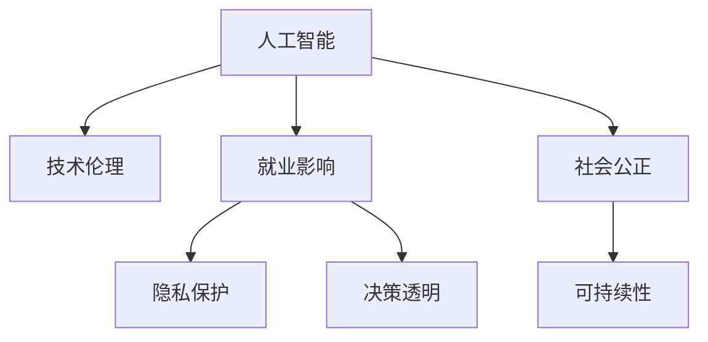

                 

# 人工智能：社会影响与思考

> 关键词：人工智能,社会影响,技术伦理,就业,隐私,可解释性,决策透明

## 1. 背景介绍

### 1.1 问题由来

随着人工智能(AI)技术的迅猛发展，其在社会各个领域的渗透和应用越来越广泛，从医疗、教育到金融、交通，AI技术正逐渐改变着人类生活的方方面面。然而，AI技术的普及也引发了一系列复杂的社会问题，这些问题不仅涉及技术层面，更关系到伦理、经济、法律等多个方面。如何理性看待AI的社会影响，合理利用技术，解决由此带来的挑战，已经成为当前亟需解决的重要课题。

### 1.2 问题核心关键点

本文聚焦于AI技术的社会影响及其伦理挑战，探讨了AI技术在社会生活、经济发展、决策透明和就业市场等方面的影响，并提出了应对这些问题的策略和建议。通过分析AI技术发展的内在逻辑和外在表现，旨在帮助社会各界更好地理解和应对AI技术的普及。

## 2. 核心概念与联系

### 2.1 核心概念概述

为更好地理解AI技术的社会影响，本节将介绍几个关键概念：

- **人工智能(Artificial Intelligence, AI)**：通过计算机模拟人类智能过程，实现数据处理、决策支持等功能的技术。AI主要包括机器学习、深度学习、自然语言处理等子领域。

- **技术伦理(Ethics in Technology)**：在AI技术设计和应用过程中，考虑伦理道德、社会责任等因素，确保技术使用的公平性、透明度和可控性。

- **就业影响(Employment Impacts)**：AI技术的发展对劳动力市场的影响，包括对工作岗位的替代、就业结构的改变等。

- **隐私保护(Privacy Protection)**：在AI技术使用过程中，对个人数据的保护和隐私的尊重，避免数据滥用和隐私泄露。

- **决策透明(Decision Transparency)**：在AI决策过程中，确保决策依据的可解释性和透明度，避免"黑盒"操作。

- **社会公正(Social Equity)**：确保AI技术应用过程中，不同群体、不同地域的公平性，避免技术偏见和歧视。

- **可持续性(Sustainability)**：AI技术在应用过程中，对环境、资源的影响，以及如何实现技术与生态的和谐发展。

这些核心概念之间的逻辑关系可以通过以下Mermaid流程图来展示：



这个流程图展示了一系列与AI技术相关的关键概念及其之间的内在联系。

## 3. 核心算法原理 & 具体操作步骤
### 3.1 算法原理概述

AI技术的应用广泛而复杂，涉及大量算法和模型。本节将从算法原理的角度，概述AI技术的基本框架和运作机制。

AI技术主要由以下几个核心组件构成：

- **数据获取与处理**：收集和预处理数据，为模型训练提供基础。
- **模型训练**：使用机器学习、深度学习等方法，训练出能够解决问题的模型。
- **模型部署**：将训练好的模型部署到实际应用环境中，进行推理和决策。
- **模型评估与优化**：通过测试和反馈，评估模型性能并不断优化。

这一过程通常需要跨学科的知识，包括数据科学、计算机科学、统计学等。

### 3.2 算法步骤详解

AI技术的核心算法步骤包括：

1. **数据获取与预处理**：
   - 收集与问题相关的数据集。
   - 清洗和标注数据，确保数据质量和一致性。

2. **模型选择与设计**：
   - 选择合适的算法和模型结构，如神经网络、支持向量机等。
   - 设计模型架构，包括层数、激活函数、损失函数等。

3. **模型训练与优化**：
   - 使用训练数据集，通过反向传播等方法优化模型参数。
   - 应用正则化、Dropout等技术，防止过拟合。

4. **模型评估与测试**：
   - 使用验证集和测试集评估模型性能。
   - 通过交叉验证等方法，确保模型泛化能力。

5. **模型部署与维护**：
   - 将模型部署到实际应用环境中，进行推理和决策。
   - 定期更新和维护模型，适应新的数据和环境变化。

### 3.3 算法优缺点

AI技术在带来巨大便利的同时，也存在一些局限和风险：

**优点**：

- **自动化和高效性**：AI技术可以自动处理大量数据，提高工作效率和准确性。
- **个性化和定制化**：AI技术能够根据用户需求提供个性化的解决方案。
- **创新和应用广泛**：AI技术在各个领域的应用，推动了新技术和新产品的开发。

**缺点**：

- **依赖数据质量**：AI模型性能高度依赖于数据质量和标注准确性。
- **复杂性和透明度**：AI模型的内部机制复杂，缺乏透明度，难以解释。
- **偏见和歧视**：AI模型可能继承数据中的偏见，导致决策不公平。
- **就业冲击**：AI技术的普及可能对某些职业产生替代效应。

### 3.4 算法应用领域

AI技术在多个领域都得到了广泛应用，例如：

- **医疗**：通过图像识别、自然语言处理等技术，辅助诊断和治疗。
- **金融**：利用机器学习算法进行风险评估、欺诈检测等。
- **教育**：通过智能推荐系统，个性化教育内容，提升学习效果。
- **交通**：使用自动驾驶、智能交通管理等技术，提高交通效率和安全性。
- **工业制造**：利用AI进行质量检测、设备维护等，提升生产效率和产品质量。

这些应用展示了AI技术在各个领域所带来的巨大变革和潜力。

## 4. 数学模型和公式 & 详细讲解 & 举例说明

### 4.1 数学模型构建

AI技术的核心算法通常基于数学模型，以下以线性回归为例，展示模型的构建过程。

设输入特征为 $x_1, x_2, ..., x_n$，输出为目标值 $y$，假设模型为线性函数：

$$ y = \theta_0 + \sum_{i=1}^{n} \theta_i x_i $$

其中 $\theta_0$ 为截距，$\theta_i$ 为权重系数。

### 4.2 公式推导过程

线性回归模型的最小二乘法损失函数为：

$$ \mathcal{L}(\theta) = \frac{1}{2m} \sum_{i=1}^{m} (y_i - (\theta_0 + \sum_{j=1}^{n} \theta_j x_{ij}))^2 $$

通过求解损失函数的最小值，可以得到最优参数 $\theta$。

### 4.3 案例分析与讲解

以图像识别为例，使用卷积神经网络(CNN)进行分类任务。CNN通过卷积层、池化层等结构，提取图像特征，然后通过全连接层进行分类。

具体步骤包括：

1. 数据预处理：对图像进行归一化、缩放等操作。
2. 构建模型：设计CNN架构，包括卷积核大小、层数等。
3. 模型训练：使用训练数据集进行前向传播和反向传播，优化模型参数。
4. 模型评估：使用测试集评估模型性能，计算准确率、精确率等指标。
5. 模型部署：将训练好的模型部署到实际应用环境中，进行图像识别。

## 5. 项目实践：代码实例和详细解释说明

### 5.1 开发环境搭建

在进行AI项目开发前，需要搭建好开发环境。以下是使用Python进行TensorFlow开发的环境配置流程：

1. 安装Anaconda：从官网下载并安装Anaconda，用于创建独立的Python环境。

2. 创建并激活虚拟环境：
```bash
conda create -n tf-env python=3.8 
conda activate tf-env
```

3. 安装TensorFlow：根据CUDA版本，从官网获取对应的安装命令。例如：
```bash
pip install tensorflow==2.7.0
```

4. 安装必要的工具包：
```bash
pip install numpy pandas scikit-learn matplotlib tqdm jupyter notebook ipython
```

完成上述步骤后，即可在`tf-env`环境中开始AI项目开发。

### 5.2 源代码详细实现

以下是一个简单的线性回归模型的TensorFlow实现代码：

```python
import tensorflow as tf

# 准备数据
x_data = [1, 2, 3, 4, 5]
y_data = [1, 2, 3, 4, 5]

# 定义模型
x = tf.placeholder(tf.float32, shape=[None])
y = tf.placeholder(tf.float32, shape=[None])
theta = tf.Variable(tf.zeros([1]), name='theta')
y_pred = tf.add(tf.multiply(x, theta), 0.5)

# 定义损失函数和优化器
loss = tf.reduce_mean(tf.square(y - y_pred))
optimizer = tf.train.GradientDescentOptimizer(learning_rate=0.01).minimize(loss)

# 训练模型
init = tf.global_variables_initializer()
with tf.Session() as sess:
    sess.run(init)
    for i in range(100):
        sess.run(optimizer, feed_dict={x: x_data, y: y_data})
```

### 5.3 代码解读与分析

**x_data和y_data**：定义输入和输出数据。

**theta**：定义模型参数，初始化为0。

**y_pred**：定义模型预测的输出值。

**loss**：定义损失函数，计算预测值与实际值之间的平方误差。

**optimizer**：定义优化器，使用梯度下降法最小化损失函数。

**with tf.Session() as sess**：创建一个会话，用于执行图上的操作。

**sess.run(optimizer, feed_dict={x: x_data, y: y_data})**：在每个训练步骤中，将输入数据传入模型，计算梯度并更新参数。

### 5.4 运行结果展示

```python
import matplotlib.pyplot as plt

plt.plot(x_data, y_data, 'ro', label='Original data')
plt.plot(x_data, sess.run(theta) * x_data + 0.5, label='Fitted line')
plt.legend()
plt.show()
```

运行结果展示线性回归模型的拟合效果，可以看到拟合直线与数据点较为接近，证明模型能够较好地学习数据特征。

## 6. 实际应用场景

### 6.1 医疗诊断

AI技术在医疗领域的应用，尤其是图像识别和自然语言处理，极大地提升了诊断的准确性和效率。例如，使用卷积神经网络进行医学影像分析，识别肿瘤、病变等，辅助医生进行诊断和治疗决策。

### 6.2 金融风险管理

AI技术在金融领域主要用于风险评估和欺诈检测。通过机器学习算法，分析历史数据，预测市场趋势和风险，防范金融诈骗，保护投资者权益。

### 6.3 智能客服

AI技术在智能客服中的应用，通过自然语言处理和机器学习，能够自动理解用户需求，提供快速响应，提高客户满意度。

### 6.4 未来应用展望

未来，AI技术将在更多领域得到应用，例如：

- **自动驾驶**：使用AI技术实现自动驾驶，提高道路安全性和效率。
- **智能家居**：利用AI技术，实现智能家居系统的自动化管理。
- **智慧城市**：通过AI技术，优化城市交通、环保、公共安全等方面，提高城市管理水平。

AI技术的广泛应用，将极大地改变人类的生活和工作方式，带来巨大的社会变革。

## 7. 工具和资源推荐

### 7.1 学习资源推荐

为了帮助开发者系统掌握AI技术的社会影响，这里推荐一些优质的学习资源：

1. **《人工智能伦理与治理》**：介绍了AI技术在社会各领域的伦理问题，提供全面的治理策略。
2. **《机器学习实战》**：详细讲解了机器学习算法和实践应用，适合入门学习。
3. **CS231n《卷积神经网络》**：斯坦福大学开设的深度学习课程，讲解了CNN等模型的构建和应用。
4. **《深度学习》**：Ian Goodfellow等著，讲解了深度学习的基础理论和应用实例。
5. **Kaggle竞赛平台**：提供大量数据集和竞赛项目，可以实践AI算法的应用和优化。

通过这些资源的学习，相信你一定能够全面理解AI技术的社会影响，并掌握其实际应用的技术要点。

### 7.2 开发工具推荐

高效的开发离不开优秀的工具支持。以下是几款用于AI项目开发的常用工具：

1. **PyTorch**：基于Python的开源深度学习框架，支持动态图和静态图，适合研究和实验。
2. **TensorFlow**：由Google主导开发的开源深度学习框架，生产部署方便，适合大规模工程应用。
3. **Keras**：基于TensorFlow的高级API，易于使用，适合快速原型开发。
4. **Jupyter Notebook**：支持交互式代码执行和数据可视化，适合数据科学和机器学习应用。
5. **Matplotlib**：Python数据可视化库，支持各种图表和可视化效果。

合理利用这些工具，可以显著提升AI项目开发的效率，加速技术创新。

### 7.3 相关论文推荐

AI技术的发展源于学界的持续研究。以下是几篇奠基性的相关论文，推荐阅读：

1. **《人工智能的未来》**：探讨了AI技术的未来发展趋势和应用前景。
2. **《机器学习的伦理问题》**：分析了机器学习在伦理和法律方面的挑战和解决方案。
3. **《深度学习在医疗中的应用》**：讲解了深度学习在医学影像分析、疾病预测等方面的应用。
4. **《金融数据挖掘与机器学习》**：介绍了机器学习在金融领域的应用，包括信用评分、欺诈检测等。
5. **《智能客服的实现》**：介绍了AI技术在智能客服中的应用，包括对话系统、情感分析等。

这些论文代表了大AI技术发展的历程和方向，通过学习这些前沿成果，可以帮助研究者把握学科前进方向，激发更多的创新灵感。

## 8. 总结：未来发展趋势与挑战

### 8.1 总结

本文对AI技术的社会影响及其伦理挑战进行了全面系统的介绍。首先阐述了AI技术在医疗、金融、智能客服等领域的广泛应用，明确了AI技术在提升工作效率、改善服务质量等方面的巨大潜力。其次，从技术伦理、就业影响、隐私保护等多个角度，详细分析了AI技术对社会的多方面影响，并提出了相应的应对策略。通过本文的系统梳理，可以看到，AI技术正在深刻地改变人类的生活和工作方式，带来巨大的社会变革。

### 8.2 未来发展趋势

展望未来，AI技术将在更多领域得到应用，呈现以下几个发展趋势：

1. **自动化和智能化**：AI技术将更广泛地应用于各个行业，实现自动化和智能化管理。
2. **人机协同**：AI技术将与人类协作，提升工作效果和决策水平。
3. **多模态融合**：AI技术将整合多种数据形式，实现多模态信息的协同分析和应用。
4. **深度学习和强化学习**：深度学习和强化学习等技术将进一步发展，推动AI技术在复杂问题上的应用。
5. **隐私保护和可解释性**：AI技术将更注重隐私保护和决策透明，确保技术使用的公平性和安全性。

### 8.3 面临的挑战

尽管AI技术带来了巨大的便利和应用前景，但在迈向更加智能化、普适化应用的过程中，它仍面临着诸多挑战：

1. **伦理道德问题**：AI技术的使用需要遵循伦理道德准则，避免数据滥用和算法偏见。
2. **隐私保护**：在使用AI技术时，需要严格保护用户隐私，防止数据泄露。
3. **就业冲击**：AI技术的应用可能对某些职业产生替代效应，需要制定相应的就业政策。
4. **技术透明**：AI技术的内部机制复杂，缺乏透明度，难以解释。
5. **安全和可信**：AI技术在应用过程中需要确保安全性和可信度，避免系统崩溃和错误决策。

### 8.4 研究展望

未来，AI技术的研究和应用需要从多个方面进行突破：

1. **伦理与法规**：制定和完善AI技术的伦理标准和法律法规，确保技术使用的公平性和安全性。
2. **隐私保护**：采用隐私保护技术，如差分隐私、联邦学习等，保护用户隐私。
3. **可解释性**：开发可解释的AI模型，增强技术应用的透明度和可信度。
4. **多模态融合**：将不同数据类型进行整合，实现多模态信息的协同分析。
5. **人机协同**：探索人机协作的新模式，提升工作效果和决策水平。

这些研究方向的探索，必将引领AI技术迈向更高的台阶，为构建人机协同的智能社会铺平道路。面向未来，AI技术还需要与其他技术进行更深入的融合，如知识表示、因果推理、强化学习等，多路径协同发力，共同推动技术进步和应用创新。只有勇于创新、敢于突破，才能不断拓展AI技术的边界，让人工智能更好地服务于社会。

## 9. 附录：常见问题与解答

**Q1：AI技术在社会各领域的普及是否会对就业产生负面影响？**

A: AI技术的普及确实可能对某些职业产生替代效应，例如简单的重复性工作。然而，AI技术也将创造新的就业机会，如数据标注、模型维护等。因此，关键在于如何通过政策引导，确保技术进步与就业市场的协调发展。

**Q2：AI技术在应用过程中需要注意哪些伦理问题？**

A: AI技术的应用需要注意多个伦理问题，如数据隐私、算法偏见、决策透明等。需要建立伦理审查机制，确保技术使用的公平性和安全性。

**Q3：如何增强AI技术的可解释性？**

A: 增强AI技术的可解释性可以通过以下几种方式：
1. 采用可解释的模型结构，如决策树、线性回归等。
2. 开发可解释的算法，如LIME、SHAP等。
3. 引入先验知识，如专家规则、知识图谱等。

这些方法可以帮助增强AI技术的可解释性和透明度，提升技术应用的可信度。

**Q4：AI技术在实际应用过程中需要注意哪些安全性问题？**

A: AI技术在应用过程中需要注意以下安全性问题：
1. 数据安全：保护用户数据，防止数据泄露和滥用。
2. 模型安全：防止模型被恶意篡改，确保模型的可信度和安全性。
3. 系统安全：确保系统的稳定性和可靠性，避免系统崩溃和错误决策。

通过建立安全防护机制，可以有效提升AI技术的安全性和可信度。

**Q5：AI技术在医疗领域的应用是否可靠？**

A: AI技术在医疗领域的应用已经取得了一定的成果，例如医学影像分析和疾病预测。然而，AI技术仍然存在一些局限，如数据质量和算法偏见等。因此，在医疗领域应用AI技术，需要严格的数据验证和模型评估，确保技术的可靠性和安全性。

---

作者：禅与计算机程序设计艺术 / Zen and the Art of Computer Programming

