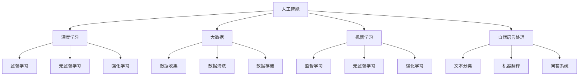

                 

# 人工智能：社会影响与思考

## 1. 背景介绍

### 1.1 问题由来

随着人工智能（AI）技术的迅猛发展，其在社会各个领域的应用日益广泛，从医疗、金融到教育、交通，AI的应用渗透到了人类生活的方方面面。AI技术的进步不仅推动了生产力的提升，也引发了一系列关于AI社会影响的深度思考。

从1956年达特茅斯会议首次提出人工智能概念至今，AI技术经历了多次起伏和突破。特别是近年来，深度学习和大数据技术的成熟，使得AI在计算机视觉、自然语言处理、语音识别等领域取得了显著进展。然而，这些技术进步也带来了新的挑战和问题，如隐私保护、就业替代、伦理道德等，需要引起全社会的广泛关注。

### 1.2 问题核心关键点

AI对社会的影响是复杂而深远的。其核心关键点包括：

1. **技术进步与社会变迁**：AI技术的进步如何推动社会进步，同时也带来了哪些挑战和问题？
2. **隐私与数据安全**：在AI应用中，如何平衡数据的使用和隐私保护？
3. **就业与劳动力市场**：AI技术对就业市场的影响是什么？
4. **伦理与道德**：AI应用中如何避免偏见、歧视等伦理问题？
5. **监管与政策**：如何在AI技术的快速发展中，制定合适的监管政策和法律框架？

这些问题不仅是技术难题，更是社会问题，需要在技术进步的同时，积极探索解决之道。本文将围绕这些关键点，深入探讨AI的社会影响，并提出相应的思考和建议。

## 2. 核心概念与联系

### 2.1 核心概念概述

为了更好地理解AI的社会影响，我们需要对一些核心概念进行澄清和梳理：

- **人工智能（Artificial Intelligence, AI）**：指通过计算机算法和数据处理，使计算机系统具有智能行为的技术。AI可以执行各种复杂的任务，如视觉识别、语言处理、决策分析等。

- **深度学习（Deep Learning, DL）**：一种基于神经网络的机器学习方法，通过多层次的抽象，从大量数据中学习复杂的模式和关系。深度学习在图像识别、自然语言处理等领域取得了显著成果。

- **大数据（Big Data）**：指规模庞大、类型多样的数据集，包括结构化数据和非结构化数据。大数据技术使得AI系统能够处理和分析海量数据，从而提升AI系统的性能和应用范围。

- **机器学习（Machine Learning, ML）**：一种使计算机系统通过数据学习规律的技术，包括监督学习、无监督学习和强化学习等。机器学习是AI技术的基础，也是实现智能行为的关键。

- **自然语言处理（Natural Language Processing, NLP）**：指使计算机能够理解、处理和生成人类语言的技术。NLP在AI应用中占据重要地位，包括文本分类、机器翻译、问答系统等。

这些概念之间的逻辑关系可以通过以下Mermaid流程图来展示：



这个流程图展示了大规模语言模型构建所需的核心技术路径和算法，以及各技术之间的相互关系。

## 3. 核心算法原理 & 具体操作步骤

### 3.1 算法原理概述

AI技术的核心在于算法的设计和应用。在AI的社会影响探讨中，需要重点关注以下几个方面的算法原理：

1. **监督学习（Supervised Learning）**：指使用有标签数据进行训练，使模型能够预测新数据的算法。监督学习广泛应用于分类、回归、命名实体识别等任务中。
2. **无监督学习（Unsupervised Learning）**：指使用无标签数据进行训练，使模型能够发现数据中的模式和结构。无监督学习广泛应用于聚类、降维、异常检测等任务中。
3. **强化学习（Reinforcement Learning）**：指通过与环境的交互，学习最优策略以最大化奖励的算法。强化学习广泛应用于游戏、机器人控制、自动驾驶等任务中。
4. **迁移学习（Transfer Learning）**：指将在一个任务上学习到的知识，应用到另一个相关任务中，以提高新任务的性能。迁移学习广泛应用于预训练模型和微调模型中。
5. **对抗生成网络（Generative Adversarial Networks, GANs）**：指两个神经网络（生成器和判别器）相互对抗，生成逼真的数据样本的算法。GANs广泛应用于图像生成、视频制作等任务中。

这些算法原理构成了AI技术的基石，推动了AI技术在各个领域的应用和发展。

### 3.2 算法步骤详解

AI技术的具体实现步骤通常包括以下几个关键环节：

1. **数据收集与预处理**：收集相关领域的数据，并进行清洗、标注、归一化等预处理，以提高数据质量。
2. **模型训练**：根据算法原理选择合适的模型结构，使用训练数据进行模型训练，优化模型参数。
3. **模型评估与调优**：在验证集或测试集上评估模型性能，根据评估结果进行调优，优化模型参数和结构。
4. **模型应用**：将训练好的模型应用于实际问题中，实现智能行为和决策。
5. **模型维护与更新**：根据实际应用中的反馈，定期更新和维护模型，以适应新的数据和需求。

这些步骤在AI技术的开发和应用过程中必不可少，需要在各个环节进行细致的操作和调整。

### 3.3 算法优缺点

AI算法在应用中既带来了诸多优势，也存在一定的局限性：

1. **优势**：
   - **高效性**：AI算法能够高效处理和分析大量数据，提升决策效率和精度。
   - **自动化**：AI算法能够自动学习和优化，减少人工干预，提高工作效率。
   - **泛化性**：AI算法通过训练，能够泛化到新数据和场景中，提高应用范围和可靠性。

2. **局限性**：
   - **依赖数据**：AI算法的效果很大程度上依赖于数据的质量和量，数据不足或质量差会导致模型性能下降。
   - **黑箱性**：许多AI算法如深度学习，模型内部机制复杂，难以解释和调试，增加了应用的风险。
   - **偏见与歧视**：AI模型可能会学习到数据中的偏见和歧视，导致不公平的决策和输出。
   - **计算资源需求高**：AI算法特别是深度学习模型，对计算资源和存储空间要求较高，增加了应用成本。

在应用AI技术时，需要充分考虑其优缺点，合理设计算法和系统，以发挥其最大优势，规避潜在风险。

### 3.4 算法应用领域

AI算法在多个领域得到了广泛应用，以下列举几个典型应用场景：

1. **医疗领域**：AI在医疗影像分析、疾病预测、个性化治疗等领域取得了显著成果，提高了医疗服务的质量和效率。
2. **金融领域**：AI在风险评估、投资决策、反欺诈等领域具有重要作用，提高了金融行业的智能化水平。
3. **教育领域**：AI在智能辅导、学习分析、资源推荐等领域展示了巨大潜力，推动了教育公平和个性化教育的发展。
4. **交通领域**：AI在自动驾驶、交通管理、智慧物流等领域展现了未来应用前景，提升了交通系统的智能化水平。
5. **制造业**：AI在质量检测、生产调度、设备维护等领域具有广泛应用，推动了制造业的数字化转型。

这些应用场景展示了AI技术的强大潜力和广阔前景，为各行业的数字化转型提供了新的方向和思路。

## 4. 数学模型和公式 & 详细讲解

### 4.1 数学模型构建

在AI的社会影响探讨中，我们通常会构建一些数学模型来描述和分析AI系统的行为和影响。以图像识别为例，常用的数学模型包括：

1. **卷积神经网络（Convolutional Neural Network, CNN）**：通过卷积层、池化层、全连接层等结构，提取图像特征并进行分类。
2. **目标检测算法（Object Detection）**：通过滑动窗口、区域提议等方法，检测图像中的目标物体。
3. **生成对抗网络（GANs）**：通过生成器和判别器两个网络相互对抗，生成逼真的图像样本。

### 4.2 公式推导过程

以卷积神经网络（CNN）为例，其核心公式为：

$$
\mathcal{L} = \frac{1}{N}\sum_{i=1}^N \sum_{j=1}^M \ell(y_j, \hat{y}_j)
$$

其中，$N$ 为样本数，$M$ 为类别数，$y_j$ 为真实标签，$\hat{y}_j$ 为模型预测值，$\ell$ 为损失函数，常用的损失函数包括交叉熵损失（Cross-Entropy Loss）和均方误差损失（Mean Squared Error Loss）。

CNN中的卷积操作可以表示为：

$$
f(x, \theta) = \sum_{i=1}^{N} w_i g(x_i)
$$

其中，$x$ 为输入数据，$\theta$ 为模型参数，$w_i$ 为卷积核，$g(x_i)$ 为卷积操作，$f(x, \theta)$ 为卷积后的输出。

### 4.3 案例分析与讲解

以图像识别为例，深度学习模型通过卷积操作提取图像特征，并通过全连接层进行分类。模型训练过程中，通过反向传播算法不断调整模型参数，最小化损失函数，从而提高模型分类精度。在实际应用中，模型可以通过GPU加速，大幅提升计算效率。

## 5. 项目实践：代码实例和详细解释说明

### 5.1 开发环境搭建

在AI项目的开发和实践过程中，需要搭建相应的开发环境。以下是Python和TensorFlow环境的搭建流程：

1. 安装Anaconda：从官网下载并安装Anaconda，用于创建独立的Python环境。
2. 创建并激活虚拟环境：
```bash
conda create -n tensorflow-env python=3.7
conda activate tensorflow-env
```
3. 安装TensorFlow：从官网获取对应的安装命令。例如：
```bash
pip install tensorflow
```

### 5.2 源代码详细实现

以下是使用TensorFlow实现图像分类的完整代码：

```python
import tensorflow as tf
from tensorflow import keras

# 加载数据集
mnist = keras.datasets.mnist
(train_images, train_labels), (test_images, test_labels) = mnist.load_data()

# 数据预处理
train_images = train_images / 255.0
test_images = test_images / 255.0

# 定义模型
model = keras.Sequential([
    keras.layers.Flatten(input_shape=(28, 28)),
    keras.layers.Dense(128, activation='relu'),
    keras.layers.Dense(10)
])

# 编译模型
model.compile(optimizer='adam',
              loss=tf.keras.losses.SparseCategoricalCrossentropy(from_logits=True),
              metrics=['accuracy'])

# 训练模型
model.fit(train_images, train_labels, epochs=10)

# 评估模型
test_loss, test_acc = model.evaluate(test_images,  test_labels, verbose=2)
print('\nTest accuracy:', test_acc)
```

### 5.3 代码解读与分析

上述代码展示了使用TensorFlow实现图像分类的过程。具体步骤如下：

1. **数据加载**：使用Keras数据集加载MNIST数据集，将数据集分为训练集和测试集。
2. **数据预处理**：对图像数据进行归一化处理，将像素值转换为[0,1]范围内的值。
3. **模型定义**：使用Sequential模型，定义一个包含两个全连接层的神经网络。
4. **模型编译**：指定优化器、损失函数和评估指标，编译模型。
5. **模型训练**：使用训练集数据训练模型，设定训练轮数为10。
6. **模型评估**：在测试集上评估模型性能，输出测试精度。

## 6. 实际应用场景

### 6.1 智能医疗

在医疗领域，AI技术被广泛应用于疾病预测、影像诊断、个性化治疗等领域。通过深度学习算法，AI能够分析大量的医疗数据，提供精准的诊断和治疗建议。例如，AI系统可以通过分析影像数据，检测出早期癌症病变，辅助医生进行诊断和治疗。

### 6.2 智能金融

在金融领域，AI技术被用于风险评估、投资决策、反欺诈等任务。通过深度学习算法，AI能够分析历史交易数据，预测市场趋势，识别潜在的风险和欺诈行为。例如，AI系统可以通过分析交易模式，识别异常交易行为，提高金融交易的安全性和效率。

### 6.3 智能教育

在教育领域，AI技术被用于智能辅导、学习分析、资源推荐等任务。通过自然语言处理算法，AI能够分析学生的学习行为，提供个性化的学习建议。例如，AI系统可以通过分析学生的学习数据，推荐适合的学习资源和课程，提高学生的学习效率和效果。

### 6.4 未来应用展望

未来，AI技术将在更多领域得到应用，为社会带来深远的影响：

1. **智慧城市**：AI技术将被广泛应用于智慧城市建设中，提高城市的智能化水平。例如，通过智能交通系统，提高城市交通的效率和安全性。
2. **环境保护**：AI技术将被应用于环境保护中，提高环境监测和治理的智能化水平。例如，通过分析卫星数据，监测气候变化和环境污染。
3. **能源管理**：AI技术将被应用于能源管理中，提高能源利用效率和安全性。例如，通过智能电网系统，优化电力供应和分配。

## 7. 工具和资源推荐

### 7.1 学习资源推荐

为了帮助开发者系统掌握AI技术的理论基础和实践技巧，这里推荐一些优质的学习资源：

1. **《深度学习》课程**：斯坦福大学开设的深度学习课程，系统介绍了深度学习的核心概念和算法，包括神经网络、卷积神经网络、生成对抗网络等。
2. **《机器学习实战》书籍**：介绍了机器学习的基本概念和算法，包括监督学习、无监督学习和强化学习等。
3. **Kaggle平台**：数据科学竞赛平台，提供大量数据集和竞赛题目，帮助开发者练习和提高AI技术应用能力。
4. **Google AI博客**：谷歌AI团队定期发布技术文章和研究进展，深入介绍AI技术的最新研究和发展。
5. **ArXiv预印本平台**：提供大量学术论文和研究报告，涵盖AI技术的各个领域。

通过对这些资源的学习实践，相信你一定能够快速掌握AI技术的精髓，并用于解决实际的AI问题。

### 7.2 开发工具推荐

高效的开发离不开优秀的工具支持。以下是几款用于AI开发常用的工具：

1. **Python**：作为AI开发的主要编程语言，Python具有丰富的库和框架，方便开发和调试。
2. **TensorFlow**：谷歌开源的深度学习框架，支持分布式计算和GPU加速，适用于大规模数据处理和模型训练。
3. **PyTorch**：Facebook开源的深度学习框架，灵活性和易用性高，适用于研究和原型开发。
4. **Jupyter Notebook**：交互式编程环境，方便代码编写、调试和分享。
5. **Anaconda**：Python环境的容器化管理工具，方便多环境管理和依赖管理。

合理利用这些工具，可以显著提升AI开发和应用效率，加快创新迭代的步伐。

### 7.3 相关论文推荐

AI技术的发展离不开学界的持续研究。以下是几篇奠基性的相关论文，推荐阅读：

1. **《深度学习》论文**：深度学习领域的奠基性论文，介绍了深度学习的基本原理和算法。
2. **《卷积神经网络》论文**：卷积神经网络的研究论文，介绍了卷积神经网络的结构和应用。
3. **《生成对抗网络》论文**：生成对抗网络的研究论文，介绍了生成器和判别器的结构和应用。
4. **《机器学习实战》书籍**：介绍了机器学习的基本概念和算法，涵盖监督学习、无监督学习和强化学习等。
5. **《智能系统中的AI伦理》论文**：探讨AI技术的伦理问题，提出相应的解决方案。

这些论文和书籍代表了大规模语言模型微调技术的发展脉络。通过学习这些前沿成果，可以帮助研究者把握学科前进方向，激发更多的创新灵感。

## 8. 总结：未来发展趋势与挑战

### 8.1 总结

本文对AI技术在社会各个领域的应用进行了全面系统的探讨。首先阐述了AI技术的社会影响，明确了AI技术在医疗、金融、教育等领域的重要作用。其次，从算法原理到实际应用，详细讲解了AI技术的核心算法和操作步骤，给出了具体的代码实现和分析。同时，本文还探讨了AI技术在实际应用中面临的挑战和问题，提出了相应的思考和建议。

通过本文的系统梳理，可以看到，AI技术在各个领域的应用前景广阔，但也面临一些挑战和问题。如何在技术进步的同时，平衡伦理道德、隐私保护和公平性，是未来AI技术发展的重要方向。相信通过全社会的共同努力，AI技术必将在未来的社会变革中发挥更大的作用。

### 8.2 未来发展趋势

展望未来，AI技术将呈现以下几个发展趋势：

1. **技术进步**：AI技术将在深度学习、自然语言处理、计算机视觉等领域取得进一步突破，推动各行业的数字化转型。
2. **伦理和道德**：AI技术的伦理和道德问题将受到越来越多的关注，需要建立相应的规范和标准。
3. **跨领域融合**：AI技术将与其他领域的技术进行更深度的融合，如机器人、生物技术等，推动跨学科的创新。
4. **普及和应用**：AI技术将更广泛地应用于社会各个领域，提高各行业的智能化水平。

这些趋势展示了AI技术的广阔前景，为未来社会的发展带来了新的机遇和挑战。

### 8.3 面临的挑战

尽管AI技术在各个领域取得了显著进展，但在应用过程中仍面临诸多挑战：

1. **隐私和数据安全**：AI技术需要大量的数据支持，数据隐私和安全性问题亟待解决。
2. **伦理和道德**：AI模型可能学习到数据中的偏见和歧视，导致不公平的决策和输出。
3. **计算资源需求**：AI算法特别是深度学习模型，对计算资源和存储空间要求较高，增加了应用成本。
4. **可解释性和透明性**：AI算法的黑箱性增加了应用的风险，需要提高模型的可解释性和透明性。
5. **公平性和公正性**：AI模型的决策过程可能存在偏见，需要提高公平性和公正性。

这些挑战需要在技术进步的同时，积极探索解决之道。

### 8.4 研究展望

面对AI技术面临的诸多挑战，未来的研究需要在以下几个方面寻求新的突破：

1. **隐私保护技术**：开发更加高效的数据保护和隐私保护技术，确保数据的安全性和隐私性。
2. **伦理和道德框架**：建立AI技术的伦理和道德框架，规范AI技术的开发和应用。
3. **可解释性和透明性**：提高AI算法的可解释性和透明性，增强模型的可信度和公平性。
4. **公平性和公正性**：开发公平和公正的AI模型，减少偏见和歧视，提高模型的公平性和公正性。
5. **跨学科融合**：推动AI技术与其他领域技术的深度融合，推动跨学科的创新和发展。

这些研究方向的探索，必将引领AI技术迈向更高的台阶，为构建安全、可靠、可解释、可控的智能系统铺平道路。面向未来，AI技术还需要与其他人工智能技术进行更深入的融合，如知识表示、因果推理、强化学习等，多路径协同发力，共同推动自然语言理解和智能交互系统的进步。只有勇于创新、敢于突破，才能不断拓展AI技术的边界，让智能技术更好地造福人类社会。

## 9. 附录：常见问题与解答

**Q1：AI技术在医疗领域有哪些应用？**

A: AI技术在医疗领域的应用非常广泛，主要包括：

1. **疾病预测**：通过分析患者的历史数据和基因数据，预测患者的疾病风险。
2. **影像诊断**：通过分析医学影像数据，检测出早期癌症病变，辅助医生进行诊断和治疗。
3. **个性化治疗**：通过分析患者的基因数据和病历数据，制定个性化的治疗方案。
4. **智能客服**：通过自然语言处理技术，解答患者的问题，提供医疗咨询和指导。

这些应用展示了AI技术在医疗领域的重要价值，为医疗服务的智能化和个性化提供了新的思路。

**Q2：AI技术在金融领域有哪些应用？**

A: AI技术在金融领域的应用非常广泛，主要包括：

1. **风险评估**：通过分析历史交易数据和市场数据，预测市场趋势和风险。
2. **投资决策**：通过分析市场数据和财务数据，提供投资建议和交易策略。
3. **反欺诈**：通过分析交易模式和行为数据，识别潜在的欺诈行为。
4. **客户服务**：通过自然语言处理技术，解答客户的问题，提供金融咨询和指导。

这些应用展示了AI技术在金融领域的重要价值，为金融行业的智能化和高效化提供了新的思路。

**Q3：AI技术在教育领域有哪些应用？**

A: AI技术在教育领域的应用非常广泛，主要包括：

1. **智能辅导**：通过分析学生的学习数据，提供个性化的学习建议和资源推荐。
2. **学习分析**：通过分析学生的学习行为和成绩，评估学生的学习效果和进步情况。
3. **资源推荐**：通过分析学生的学习数据和兴趣点，推荐适合的学习资源和课程。
4. **智能评测**：通过自然语言处理技术，自动评估学生的作业和论文，提高评分的公平性和效率。

这些应用展示了AI技术在教育领域的重要价值，为教育公平和个性化教育提供了新的思路。

**Q4：AI技术在智慧城市建设中有哪些应用？**

A: AI技术在智慧城市建设中的应用非常广泛，主要包括：

1. **智能交通**：通过智能交通系统，提高城市交通的效率和安全性。
2. **环境监测**：通过智能传感器和数据分析，监测城市环境变化和污染情况。
3. **公共安全**：通过智能视频监控和数据分析，提高城市公共安全。
4. **能源管理**：通过智能电网系统，优化电力供应和分配。

这些应用展示了AI技术在智慧城市建设中的重要价值，为城市智能化和可持续发展提供了新的思路。

**Q5：AI技术在环境保护中有哪些应用？**

A: AI技术在环境保护中的应用非常广泛，主要包括：

1. **气候变化监测**：通过分析卫星数据和气象数据，监测气候变化和极端天气。
2. **环境污染监测**：通过智能传感器和数据分析，监测环境污染和生态变化。
3. **资源管理**：通过智能数据分析，优化资源配置和利用。
4. **智能农业**：通过智能数据分析，提高农业生产效率和可持续发展。

这些应用展示了AI技术在环境保护中的重要价值，为环境保护和可持续发展提供了新的思路。

---

作者：禅与计算机程序设计艺术 / Zen and the Art of Computer Programming

