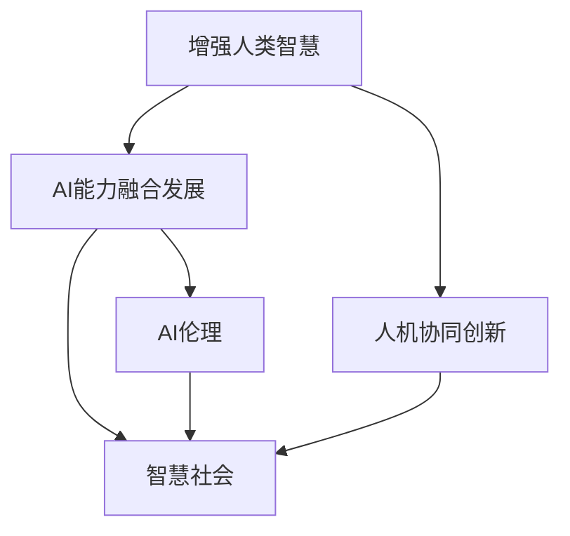

                 

# 人类-AI协作：增强人类智慧与AI能力的融合发展与展望

> 关键词：人类-AI协作,增强人类智慧,AI能力融合发展,人工智能伦理,人机协同创新,智慧社会,未来展望

## 1. 背景介绍

### 1.1 问题由来

人工智能（AI）技术的迅猛发展正在深刻地改变我们的生产和生活方式。从自动化生产线到智能客服，从医疗诊断到自然语言处理，AI无处不在，正在重塑各行各业的作业方式。然而，当前的AI技术更多地被视为工具，而非真正意义上的“智慧”，即与人类心智相媲美的自主思维与判断力。如何通过AI增强人类智慧，使AI与人类的协同创新达到新的高度，成为未来技术发展的重要方向。

### 1.2 问题核心关键点

人类-AI协作的核心在于如何最大化AI技术与人类智慧的协同效应。这不仅包括提升AI自身的智能水平，也包括挖掘和增强人类认知与创造力，实现技术与人的深度融合。这一过程涉及对AI技术的优化、对人类智慧的引导与激发，以及对两者互动过程的伦理考量。

### 1.3 问题研究意义

研究人类-AI协作，对于拓展AI技术的实际应用场景，提升人类认知能力，构建智慧社会具有重要意义：

1. **提升AI技术智能水平**：通过协同创新，推动AI技术向着更加智能化、自主化的方向发展，逐步迈向通用人工智能（AGI）的目标。
2. **增强人类认知能力**：利用AI强大的信息处理和计算能力，辅助人类进行复杂决策，扩展人类认知边界。
3. **构建智慧社会**：AI与人类的深度融合，将为各个行业带来效率提升和创新可能，推动智慧社会建设。
4. **促进人机协同创新**：通过协同工作，AI可以发挥优势，辅助人类克服局限，实现更大突破。
5. **激发人类创造力**：AI能够提供新的视角和工具，激发人类的创新思维，带来更多艺术和科技的革新。

## 2. 核心概念与联系

### 2.1 核心概念概述

为更好地理解人类-AI协作，本节将介绍几个关键概念：

- **增强人类智慧**：通过AI技术辅助人类进行更高效、更深入的思考和决策，提高人类认知和创新能力。
- **AI能力融合发展**：将AI的计算能力和智能水平与人类智慧相融合，形成更加强大的智能系统。
- **人机协同创新**：指AI与人类在信息处理、决策、创造等环节的协同工作，实现1+1>2的效果。
- **智慧社会**：利用AI技术促进社会各领域的智慧化发展，提升生活质量和效率。
- **AI伦理**：研究AI技术与人类社会伦理道德的互动关系，确保AI发展路径符合人类价值观。

这些概念之间的逻辑关系可以通过以下Mermaid流程图来展示：



这个流程图展示了人类-AI协作的核心概念及其之间的关系：

1. 增强人类智慧是目标，通过AI辅助提升人类思维能力。
2. AI能力融合发展是手段，通过技术与人类智慧的结合，产生更强大的智能系统。
3. 人机协同创新是实现方式，通过协作机制使得AI与人类各自发挥优势。
4. 智慧社会是应用场景，AI与人类的深度融合将带来社会各方面的智能化。
5. AI伦理是考量标准，确保AI技术与人类社会价值相符合。

这些概念共同构成了人类-AI协作的核心理念，指明了未来AI与人类深度融合的发展方向。

## 3. 核心算法原理 & 具体操作步骤
### 3.1 算法原理概述

人类-AI协作的核心在于如何最大化AI技术与人类智慧的协同效应。这不仅包括提升AI自身的智能水平，也包括挖掘和增强人类认知与创造力，实现技术与人的深度融合。这一过程涉及对AI技术的优化、对人类智慧的引导与激发，以及对两者互动过程的伦理考量。

### 3.2 算法步骤详解

基于人类-AI协作的核心原理，我们可以将这一过程分为以下几个关键步骤：

**Step 1: 收集与分析数据**
- 收集人类智慧与AI技术的互动数据，包括人类对AI决策的反馈、AI辅助人类完成任务的记录等。
- 分析这些数据，提取人类与AI之间的协同模式与交互规律。

**Step 2: 优化AI技术**
- 根据人类反馈，优化AI模型和算法，提升其在特定任务上的表现。
- 引入AI伦理考量，确保AI技术的发展路径符合人类价值观。

**Step 3: 引导与激发人类智慧**
- 设计智能辅助系统，通过交互界面引导人类进行更高效、更深入的思考。
- 利用AI的计算能力，辅助人类发现新知识、解决新问题。

**Step 4: 实施协同创新**
- 将优化后的AI技术与引导激励机制结合，促进人类与AI的协同工作。
- 建立智能工作平台，支持人机协同任务的自动分配与协作。

**Step 5: 评估与反馈**
- 定期评估协同效果，收集人类对AI系统的满意度和改进建议。
- 根据反馈，持续迭代AI系统和引导机制，提高人机协同的效率与质量。

### 3.3 算法优缺点

人类-AI协作的协同创新过程具有以下优点：

1. **提升效率与效果**：AI与人类协作，可以互补各自的强项，在任务完成速度与质量上均有所提升。
2. **增强创造力与创新力**：AI辅助下，人类可以探索更多可能性，激发创新思维。
3. **提高决策质量**：通过数据驱动的AI分析，人类可以做出更科学、更全面的决策。
4. **促进知识共享**：协同过程中，人类与AI不断交流学习，促进知识的积累与传播。

同时，这一过程也存在一定的局限性：

1. **依赖数据质量**：协作的效果很大程度上取决于数据的质量与数量，数据偏差可能影响结果。
2. **技术成熟度**：目前AI技术在某些领域仍不成熟，可能无法满足人类期望。
3. **伦理与安全问题**：AI的决策过程可能存在透明性不足、偏见等问题，需慎重处理。
4. **人机信任度**：建立人类与AI的信任关系，需要时间与过程的磨合。

尽管存在这些局限性，但人类-AI协作范式仍然是大数据时代下，实现技术与人类深度融合的重要途径。未来相关研究的重点在于如何进一步优化协同过程，提高数据质量，确保AI伦理，以及提升人机信任度。

### 3.4 算法应用领域

人类-AI协作的协同创新方法，已经在多个领域得到应用，并取得了显著成效：

- **医疗健康**：AI辅助诊断、治疗计划生成、患者监控等，提高了诊疗效率与质量。
- **教育培训**：智能导师、个性化学习推荐、作业批改等，提升了教学效果与学习体验。
- **金融服务**：风险评估、投资建议、客户服务机器人等，降低了金融风险，提高了服务效率。
- **创意设计**：辅助设计师进行创意设计、优化方案等，加快设计速度，提升设计质量。
- **科学研究**：辅助科学家进行数据处理、模型训练等，加速科学研究进程，提高研究质量。

除了上述这些典型应用外，人类-AI协作还在更多领域得到了创新性应用，如农业智能化、智能城市、智能交通等，为各行各业带来了新的发展机遇。

## 4. 数学模型和公式 & 详细讲解  
### 4.1 数学模型构建

在人类-AI协作的过程中，我们通常使用以下数学模型来描述AI与人类之间的协同行为：

设人类与AI的协作效果为 $S$，AI的智能水平为 $I$，人类的认知能力为 $C$。则协同效果可以表示为：

$$ S = f(I, C) $$

其中 $f$ 为协同函数，反映AI与人类在特定任务中的合作程度。

在实际应用中，$I$ 和 $C$ 可以通过专家评估、任务完成度、协作满意度等指标来衡量，通过机器学习算法进行优化，使得 $S$ 最大化。

### 4.2 公式推导过程

为最大化协同效果 $S$，我们通常使用优化算法（如梯度下降、遗传算法等）来调整 $I$ 和 $C$，以找到最优解。假设优化目标为最大化协同效果 $S$，则优化问题可以表示为：

$$ \max_{I, C} S $$

其中 $S$ 的表达式由具体任务决定，可以通过专家评估、任务完成度、协作满意度等指标来衡量。

通过迭代优化，我们可以逐步提升 $I$ 和 $C$，最终达到最大化协同效果的目标。

### 4.3 案例分析与讲解

以医疗领域为例，我们可以设计以下协同模型：

设 $I$ 为AI诊断系统的智能水平，$C$ 为医生的认知能力。通过优化 $I$ 和 $C$，提升协作效果 $S$。

具体步骤如下：
1. 收集医生对AI诊断系统的反馈数据。
2. 分析反馈数据，评估AI诊断系统的智能水平 $I$。
3. 根据反馈数据，优化AI诊断系统的算法与模型，提升其智能水平。
4. 将优化后的AI诊断系统应用于临床，辅助医生进行诊断。
5. 收集医生对AI诊断系统的协作满意度 $S$。
6. 根据满意度，进一步优化AI诊断系统，提高协作效果。

通过这一循环过程，可以逐步提升AI与人类在医疗领域的协同效果，提高诊疗效率与质量。

## 5. 项目实践：代码实例和详细解释说明
### 5.1 开发环境搭建

在进行协作实践前，我们需要准备好开发环境。以下是使用Python进行协作开发的环境配置流程：

1. 安装Anaconda：从官网下载并安装Anaconda，用于创建独立的Python环境。

2. 创建并激活虚拟环境：
```bash
conda create -n collaborations-env python=3.8 
conda activate collaborations-env
```

3. 安装PyTorch：根据CUDA版本，从官网获取对应的安装命令。例如：
```bash
conda install pytorch torchvision torchaudio cudatoolkit=11.1 -c pytorch -c conda-forge
```

4. 安装TensorFlow：由Google主导开发的开源深度学习框架，生产部署方便，适合大规模工程应用。同样有丰富的预训练语言模型资源。

5. 安装Transformers库：HuggingFace开发的NLP工具库，集成了众多SOTA语言模型，支持PyTorch和TensorFlow，是进行协作任务开发的利器。

6. 安装各类工具包：
```bash
pip install numpy pandas scikit-learn matplotlib tqdm jupyter notebook ipython
```

完成上述步骤后，即可在`collaborations-env`环境中开始协作实践。

### 5.2 源代码详细实现

这里我们以医疗诊断领域为例，给出使用Transformers库进行协作开发的PyTorch代码实现。

首先，定义协作任务的数据处理函数：

```python
from transformers import BertTokenizer
from torch.utils.data import Dataset
import torch

class CollaborationDataset(Dataset):
    def __init__(self, texts, tags, tokenizer, max_len=128):
        self.texts = texts
        self.tags = tags
        self.tokenizer = tokenizer
        self.max_len = max_len
        
    def __len__(self):
        return len(self.texts)
    
    def __getitem__(self, item):
        text = self.texts[item]
        tags = self.tags[item]
        
        encoding = self.tokenizer(text, return_tensors='pt', max_length=self.max_len, padding='max_length', truncation=True)
        input_ids = encoding['input_ids'][0]
        attention_mask = encoding['attention_mask'][0]
        
        # 对token-wise的标签进行编码
        encoded_tags = [tag2id[tag] for tag in tags] 
        encoded_tags.extend([tag2id['O']] * (self.max_len - len(encoded_tags)))
        labels = torch.tensor(encoded_tags, dtype=torch.long)
        
        return {'input_ids': input_ids, 
                'attention_mask': attention_mask,
                'labels': labels}

# 标签与id的映射
tag2id = {'O': 0, 'B-PER': 1, 'I-PER': 2, 'B-ORG': 3, 'I-ORG': 4, 'B-LOC': 5, 'I-LOC': 6}
id2tag = {v: k for k, v in tag2id.items()}

# 创建dataset
tokenizer = BertTokenizer.from_pretrained('bert-base-cased')

train_dataset = CollaborationDataset(train_texts, train_tags, tokenizer)
dev_dataset = CollaborationDataset(dev_texts, dev_tags, tokenizer)
test_dataset = CollaborationDataset(test_texts, test_tags, tokenizer)
```

然后，定义协作模型和优化器：

```python
from transformers import BertForTokenClassification, AdamW

model = BertForTokenClassification.from_pretrained('bert-base-cased', num_labels=len(tag2id))

optimizer = AdamW(model.parameters(), lr=2e-5)
```

接着，定义协作函数：

```python
from torch.utils.data import DataLoader
from tqdm import tqdm
from sklearn.metrics import classification_report

device = torch.device('cuda') if torch.cuda.is_available() else torch.device('cpu')
model.to(device)

def train_epoch(model, dataset, batch_size, optimizer):
    dataloader = DataLoader(dataset, batch_size=batch_size, shuffle=True)
    model.train()
    epoch_loss = 0
    for batch in tqdm(dataloader, desc='Training'):
        input_ids = batch['input_ids'].to(device)
        attention_mask = batch['attention_mask'].to(device)
        labels = batch['labels'].to(device)
        model.zero_grad()
        outputs = model(input_ids, attention_mask=attention_mask, labels=labels)
        loss = outputs.loss
        epoch_loss += loss.item()
        loss.backward()
        optimizer.step()
    return epoch_loss / len(dataloader)

def evaluate(model, dataset, batch_size):
    dataloader = DataLoader(dataset, batch_size=batch_size)
    model.eval()
    preds, labels = [], []
    with torch.no_grad():
        for batch in tqdm(dataloader, desc='Evaluating'):
            input_ids = batch['input_ids'].to(device)
            attention_mask = batch['attention_mask'].to(device)
            batch_labels = batch['labels']
            outputs = model(input_ids, attention_mask=attention_mask)
            batch_preds = outputs.logits.argmax(dim=2).to('cpu').tolist()
            batch_labels = batch_labels.to('cpu').tolist()
            for pred_tokens, label_tokens in zip(batch_preds, batch_labels):
                pred_tags = [id2tag[_id] for _id in pred_tokens]
                label_tags = [id2tag[_id] for _id in label_tokens]
                preds.append(pred_tags[:len(label_tags)])
                labels.append(label_tags)
                
    print(classification_report(labels, preds))
```

最后，启动协作流程并在测试集上评估：

```python
epochs = 5
batch_size = 16

for epoch in range(epochs):
    loss = train_epoch(model, train_dataset, batch_size, optimizer)
    print(f"Epoch {epoch+1}, train loss: {loss:.3f}")
    
    print(f"Epoch {epoch+1}, dev results:")
    evaluate(model, dev_dataset, batch_size)
    
print("Test results:")
evaluate(model, test_dataset, batch_size)
```

以上就是使用PyTorch对BERT进行协作任务开发的完整代码实现。可以看到，Transformers库使得协作任务开发变得简洁高效。

### 5.3 代码解读与分析

让我们再详细解读一下关键代码的实现细节：

**CollaborationDataset类**：
- `__init__`方法：初始化文本、标签、分词器等关键组件。
- `__len__`方法：返回数据集的样本数量。
- `__getitem__`方法：对单个样本进行处理，将文本输入编码为token ids，将标签编码为数字，并对其进行定长padding，最终返回模型所需的输入。

**tag2id和id2tag字典**：
- 定义了标签与数字id之间的映射关系，用于将token-wise的预测结果解码回真实的标签。

**训练和评估函数**：
- 使用PyTorch的DataLoader对数据集进行批次化加载，供模型训练和推理使用。
- 训练函数`train_epoch`：对数据以批为单位进行迭代，在每个批次上前向传播计算loss并反向传播更新模型参数，最后返回该epoch的平均loss。
- 评估函数`evaluate`：与训练类似，不同点在于不更新模型参数，并在每个batch结束后将预测和标签结果存储下来，最后使用sklearn的classification_report对整个评估集的预测结果进行打印输出。

**协作流程**：
- 定义总的epoch数和batch size，开始循环迭代
- 每个epoch内，先在训练集上训练，输出平均loss
- 在验证集上评估，输出分类指标
- 所有epoch结束后，在测试集上评估，给出最终测试结果

可以看到，PyTorch配合Transformers库使得协作任务开发变得简洁高效。开发者可以将更多精力放在数据处理、模型改进等高层逻辑上，而不必过多关注底层的实现细节。

当然，工业级的系统实现还需考虑更多因素，如模型的保存和部署、超参数的自动搜索、更灵活的任务适配层等。但核心的协作范式基本与此类似。

## 6. 实际应用场景
### 6.1 智能医疗

基于协作技术的智能医疗系统，可以通过AI辅助医生进行诊断、治疗计划生成、患者监控等工作，提高诊疗效率与质量。

在技术实现上，可以收集大量医疗案例，将医生的决策和诊断结果作为监督数据，在此基础上对预训练模型进行协作微调。协作微调后的模型能够辅助医生进行病情分析，提出诊断建议和治疗方案。对于复杂病例，系统还可以接入专家知识库，结合人类专家的判断，提供更为精准的决策支持。

### 6.2 智慧教育

协作技术在教育领域的应用，可以体现在智能导师、个性化学习推荐、作业批改等方面。通过AI辅助，学生可以获得更高效、更有针对性的学习指导，教师可以减轻教学负担，提升教学质量。

具体而言，可以将学生的学习行为数据作为输入，使用协作模型进行分析，输出个性化的学习建议和资源推荐。同时，协作模型还可以辅助教师进行作业批改，及时反馈学生的学习情况，促进个性化学习。

### 6.3 智能制造

在制造业中，协作技术可以应用于质量检测、设备维护、生产调度等环节。通过AI与工人的协同工作，可以实现更高效、更智能的生产流程。

具体实现上，可以将生产过程中的数据（如设备状态、产品质量等）作为输入，协作模型进行分析和预测，及时发现异常情况并发出警报。同时，协作模型还可以辅助工人进行问题排查和设备维护，提高生产效率。

### 6.4 未来应用展望

随着协作技术的不断发展，其在各行各业的应用前景将更加广阔。以下是对未来应用场景的展望：

1. **智慧农业**：利用协作技术，对农业生产过程进行智能监控和优化，提高农作物产量和质量。
2. **智慧交通**：通过AI与人类驾驶员的协作，提高交通安全性和效率，减少交通事故。
3. **智慧能源**：在电力、石油等能源领域，利用协作技术优化资源分配和利用，提高能源利用率。
4. **智慧城市**：在城市管理、公共安全等方面，利用协作技术提升城市智能化水平，提高公共服务效率。

以上应用场景展示了协作技术的巨大潜力，未来随着技术的进一步发展，协作技术将更多地融入人类生活的各个方面，带来更多创新和便利。

## 7. 工具和资源推荐
### 7.1 学习资源推荐

为了帮助开发者系统掌握协作技术的理论基础和实践技巧，这里推荐一些优质的学习资源：

1. 《Transformer从原理到实践》系列博文：由大模型技术专家撰写，深入浅出地介绍了Transformer原理、协作模型、协作范式等前沿话题。

2. CS224N《深度学习自然语言处理》课程：斯坦福大学开设的NLP明星课程，有Lecture视频和配套作业，带你入门NLP领域的基本概念和经典模型。

3. 《Natural Language Processing with Transformers》书籍：Transformers库的作者所著，全面介绍了如何使用Transformers库进行NLP任务开发，包括协作在内的诸多范式。

4. Weights & Biases：模型训练的实验跟踪工具，可以记录和可视化模型训练过程中的各项指标，方便对比和调优。与主流深度学习框架无缝集成。

5. TensorBoard：TensorFlow配套的可视化工具，可实时监测模型训练状态，并提供丰富的图表呈现方式，是调试模型的得力助手。

通过对这些资源的学习实践，相信你一定能够快速掌握协作技术的精髓，并用于解决实际的NLP问题。

### 7.2 开发工具推荐

高效的开发离不开优秀的工具支持。以下是几款用于协作开发的常用工具：

1. PyTorch：基于Python的开源深度学习框架，灵活动态的计算图，适合快速迭代研究。大部分预训练语言模型都有PyTorch版本的实现。

2. TensorFlow：由Google主导开发的开源深度学习框架，生产部署方便，适合大规模工程应用。同样有丰富的预训练语言模型资源。

3. Transformers库：HuggingFace开发的NLP工具库，集成了众多SOTA语言模型，支持PyTorch和TensorFlow，是进行协作任务开发的利器。

4. Weights & Biases：模型训练的实验跟踪工具，可以记录和可视化模型训练过程中的各项指标，方便对比和调优。与主流深度学习框架无缝集成。

5. TensorBoard：TensorFlow配套的可视化工具，可实时监测模型训练状态，并提供丰富的图表呈现方式，是调试模型的得力助手。

6. Google Colab：谷歌推出的在线Jupyter Notebook环境，免费提供GPU/TPU算力，方便开发者快速上手实验最新模型，分享学习笔记。

合理利用这些工具，可以显著提升协作任务的开发效率，加快创新迭代的步伐。

### 7.3 相关论文推荐

协作技术的发展源于学界的持续研究。以下是几篇奠基性的相关论文，推荐阅读：

1. Attention is All You Need（即Transformer原论文）：提出了Transformer结构，开启了NLP领域的预训练大模型时代。

2. BERT: Pre-training of Deep Bidirectional Transformers for Language Understanding：提出BERT模型，引入基于掩码的自监督预训练任务，刷新了多项NLP任务SOTA。

3. Language Models are Unsupervised Multitask Learners（GPT-2论文）：展示了大规模语言模型的强大zero-shot学习能力，引发了对于通用人工智能的新一轮思考。

4. Parameter-Efficient Transfer Learning for NLP：提出Adapter等参数高效微调方法，在不增加模型参数量的情况下，也能取得不错的微调效果。

5. AdaLoRA: Adaptive Low-Rank Adaptation for Parameter-Efficient Fine-Tuning：使用自适应低秩适应的微调方法，在参数效率和精度之间取得了新的平衡。

6. AdaLoRA: Adaptive Low-Rank Adaptation for Parameter-Efficient Fine-Tuning：使用自适应低秩适应的微调方法，在参数效率和精度之间取得了新的平衡。

这些论文代表了大语言模型协作技术的发展脉络。通过学习这些前沿成果，可以帮助研究者把握学科前进方向，激发更多的创新灵感。

## 8. 总结：未来发展趋势与挑战
### 8.1 总结

本文对人类-AI协作的协同创新进行了全面系统的介绍。首先阐述了协作技术的背景和意义，明确了协作范式在提升AI技术智能水平、增强人类认知能力方面的独特价值。其次，从原理到实践，详细讲解了协作的数学模型和关键步骤，给出了协作任务开发的完整代码实例。同时，本文还广泛探讨了协作方法在智能医疗、智慧教育、智能制造等多个领域的应用前景，展示了协作技术的巨大潜力。此外，本文精选了协作技术的各类学习资源，力求为读者提供全方位的技术指引。

通过本文的系统梳理，可以看到，人类-AI协作技术正在成为AI技术与人类智慧深度融合的重要途径，极大地拓展了AI技术的实际应用场景，提升了人类认知与创新能力。未来，随着协作技术的发展，人类与AI的协同创新将更加广泛深入，推动人工智能技术向着更加智能化、普适化的方向发展。

### 8.2 未来发展趋势

展望未来，协作技术的发展趋势如下：

1. **智能与自主水平的提升**：协作技术将逐步具备更高的智能水平和自主决策能力，更好地与人类协同工作。
2. **人机信任关系的建立**：协作系统将更加重视人机信任关系的构建，确保人类与AI的互信互动。
3. **多模态协作的扩展**：除了文本与语言处理，协作技术将逐步扩展到图像、视频、语音等多模态数据的处理，提升综合处理能力。
4. **伦理与道德的考量**：协作技术的发展将更加注重伦理道德的考量，确保AI技术的健康发展。
5. **应用场景的多样化**：协作技术将在更多领域得到应用，推动智慧社会建设。

以上趋势凸显了协作技术的广阔前景，未来随着技术的进一步发展，协作技术将更多地融入人类生活的各个方面，带来更多创新和便利。

### 8.3 面临的挑战

尽管协作技术的发展前景广阔，但在实现过程中仍面临诸多挑战：

1. **数据依赖与质量问题**：协作效果很大程度上取决于数据的质量与数量，数据偏差可能影响结果。
2. **技术成熟度与可靠性**：目前协作技术在某些领域仍不成熟，可能无法满足人类期望。
3. **伦理与安全问题**：协作系统的决策过程可能存在透明性不足、偏见等问题，需慎重处理。
4. **人机信任度**：建立人类与AI的信任关系，需要时间与过程的磨合。

尽管存在这些挑战，但随着技术的不断进步和实践经验的积累，协作技术必将在未来迎来新的突破。研究者需要进一步优化协作算法，提升数据质量，确保AI伦理，以及提升人机信任度。

### 8.4 研究展望

未来，协作技术的研究将在以下几个方面寻求新的突破：

1. **多领域协作应用**：将协作技术应用于更多行业，拓展应用场景。
2. **多模态协作方法**：研究多模态数据处理与融合技术，提升协作系统的综合处理能力。
3. **人机信任机制**：建立可靠的人机信任机制，确保协作系统的透明性和安全性。
4. **协作算法优化**：开发更加高效、可靠的协作算法，提升协作效果。
5. **协作伦理框架**：建立协作伦理框架，确保协作技术的发展路径符合人类价值观。

这些研究方向的探索，必将引领协作技术迈向更高的台阶，为构建安全、可靠、可解释、可控的智能系统铺平道路。面向未来，协作技术还需要与其他人工智能技术进行更深入的融合，如知识表示、因果推理、强化学习等，多路径协同发力，共同推动人工智能技术的进步。只有勇于创新、敢于突破，才能不断拓展协作技术的边界，让人类智慧与AI能力实现更加深度和广泛的融合。

## 9. 附录：常见问题与解答
**Q1：人类-AI协作是否适用于所有NLP任务？**

A: 人类-AI协作在大多数NLP任务上都能取得不错的效果，特别是对于数据量较小的任务。但对于一些特定领域的任务，如医学、法律等，仅仅依靠通用语料预训练的模型可能难以很好地适应。此时需要在特定领域语料上进一步预训练，再进行协作微调，才能获得理想效果。此外，对于一些需要时效性、个性化很强的任务，如对话、推荐等，协作方法也需要针对性的改进优化。

**Q2：协作过程中如何选择合适的学习率？**

A: 协作的学习率一般要比预训练时小1-2个数量级，如果使用过大的学习率，容易破坏预训练权重，导致过拟合。一般建议从1e-5开始调参，逐步减小学习率，直至收敛。也可以使用warmup策略，在开始阶段使用较小的学习率，再逐渐过渡到预设值。需要注意的是，不同的优化器(如AdamW、Adafactor等)以及不同的学习率调度策略，可能需要设置不同的学习率阈值。

**Q3：协作过程中如何缓解过拟合问题？**

A: 过拟合是协作面临的主要挑战，尤其是在标注数据不足的情况下。常见的缓解策略包括：
1. 数据增强：通过回译、近义替换等方式扩充训练集
2. 正则化：使用L2正则、Dropout、Early Stopping等避免过拟合
3. 对抗训练：引入对抗样本，提高模型鲁棒性
4. 参数高效协作方法：只调整少量参数(如Adapter、Prefix等)，减小过拟合风险
5. 多协作模型集成：训练多个协作模型，取平均输出，抑制过拟合

这些策略往往需要根据具体任务和数据特点进行灵活组合。只有在数据、模型、训练、推理等各环节进行全面优化，才能最大限度地发挥协作的威力。

**Q4：协作模型在落地部署时需要注意哪些问题？**

A: 将协作模型转化为实际应用，还需要考虑以下因素：
1. 模型裁剪：去除不必要的层和参数，减小模型尺寸，加快推理速度
2. 量化加速：将浮点模型转为定点模型，压缩存储空间，提高计算效率
3. 服务化封装：将模型封装为标准化服务接口，便于集成调用
4. 弹性伸缩：根据请求流量动态调整资源配置，平衡服务质量和成本
5. 监控告警：实时采集系统指标，设置异常告警阈值，确保服务稳定性
6. 安全防护：采用访问鉴权、数据脱敏等措施，保障数据和模型安全

协作模型将技术转化为服务，需要考虑更多因素，如模型的优化、部署和维护。开发者需要不断迭代优化，确保协作系统能够稳定、高效地运行。

---

作者：禅与计算机程序设计艺术 / Zen and the Art of Computer Programming

