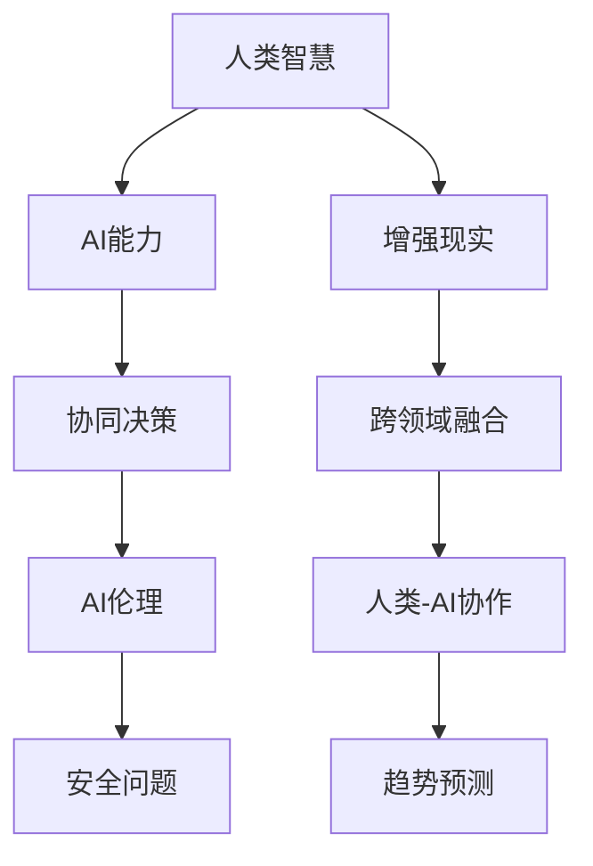

                 

## 1. 背景介绍

### 1.1 问题由来
随着人工智能技术的飞速发展，人类-AI协作（Human-AI Collaboration）正逐渐成为推动创新和社会进步的重要力量。AI在数据分析、决策辅助、自然语言处理、机器视觉等多个领域展现出了强大的能力。然而，人类智慧和AI能力之间仍存在互补与冲突，如何在增强AI能力的同时，最大化地发挥人类的创造力和判断力，成为当前亟需解决的关键问题。

### 1.2 问题核心关键点
为了更深入地理解人类-AI协作的现状与未来，本文将从以下几个核心关键点展开讨论：
- 人类智慧与AI能力的互补与冲突
- 协同决策过程中的模式与机制
- 人工智能伦理与安全问题
- 跨领域融合与协同创新的方向

这些问题不仅是技术研究的焦点，也是行业应用面临的挑战，将帮助我们深入探索AI与人类协作的未来发展趋势。

## 2. 核心概念与联系

### 2.1 核心概念概述

在深入探讨人类-AI协作的趋势预测之前，我们需要对一些关键概念有清晰的理解：

1. **人工智能（AI）**：指通过算法、数据和计算能力实现自主决策和行为的技术。
2. **增强现实（AR）**：通过在现实世界中叠加虚拟信息，增强人类的感知和互动能力。
3. **人类智慧与AI能力**：AI可以处理大量数据和复杂任务，而人类则具备创造力、情感理解和价值观判断等独特优势。
4. **协同决策（Collaborative Decision Making）**：多主体（包括人类和AI）共同参与的决策过程，通过合作与互补提升决策效率和质量。
5. **跨领域融合**：AI技术与其他领域（如教育、医疗、金融等）的结合，实现技术和业务的深度融合。
6. **伦理与安全**：AI系统在开发、应用过程中需考虑的伦理问题和安全风险。

### 2.2 核心概念原理和架构的 Mermaid 流程图



这个流程图展示了人类智慧与AI能力通过增强现实和跨领域融合等多维度结合，形成协同决策和趋势预测的路径。同时，伦理与安全是贯穿始终的关键要素。

## 3. 核心算法原理 & 具体操作步骤

### 3.1 算法原理概述

人类-AI协作的本质是通过算法和技术的融合，实现双方优势的互补和提升。其核心原理可以概括为以下几个方面：

1. **互补性**：AI擅长处理大规模数据和复杂任务，人类擅长创造力、情感理解和价值观判断。两者结合，可以形成互补优势。
2. **融合性**：AI技术通过增强现实、跨领域融合等手段，与人类智慧深度整合，实现技术和业务的双向提升。
3. **协同决策**：多主体通过协同算法，共同参与决策过程，提升决策的全面性和准确性。
4. **趋势预测**：基于AI和人类智慧的结合，对未来发展趋势进行预测分析，指导战略和行动。

### 3.2 算法步骤详解

#### 3.2.1 数据准备

1. **数据收集**：从不同领域收集相关数据，包括业务数据、用户反馈、市场趋势等。
2. **数据清洗**：处理缺失值、异常值，确保数据质量。
3. **数据标注**：对数据进行标注，以便于AI模型的训练和评估。

#### 3.2.2 模型选择与训练

1. **模型选择**：选择适合的AI模型，如深度学习、强化学习等。
2. **模型训练**：使用历史数据训练AI模型，优化模型参数。
3. **模型评估**：通过测试集评估模型性能，调整参数以提升模型效果。

#### 3.2.3 人类智慧的融入

1. **数据增强**：利用人类智慧对数据进行增强，如文本分类中的情感分析。
2. **模型融合**：将AI模型与人类智慧相结合，如专家系统中的知识库。
3. **协同决策**：设计协同决策算法，使AI和人类在决策过程中相互补充。

#### 3.2.4 结果分析与迭代

1. **结果分析**：对AI模型的预测结果进行分析，评估其合理性。
2. **迭代优化**：根据分析结果，调整模型和算法，进一步优化决策过程。
3. **持续改进**：在实际应用中，持续收集数据，不断改进AI模型和决策算法。

### 3.3 算法优缺点

#### 3.3.1 优点

1. **高效决策**：AI在处理大量数据和复杂任务时效率高，可大幅提升决策速度。
2. **全面性**：AI能够处理多维度信息，提供全方位的决策支持。
3. **自动化**：AI模型自动进行数据分析和决策，减少人工干预。
4. **持续改进**：AI模型通过不断学习，性能持续提升。

#### 3.3.2 缺点

1. **缺乏人性化**：AI模型可能缺乏对复杂情感和伦理道德的准确判断。
2. **依赖数据质量**：AI模型对数据质量要求高，数据偏差可能导致误判。
3. **算法黑箱**：部分AI算法透明度低，难以解释其决策过程。
4. **伦理风险**：AI决策可能涉及伦理问题，需谨慎处理。

### 3.4 算法应用领域

#### 3.4.1 医疗健康

在医疗领域，AI可辅助医生进行疾病诊断、治疗方案推荐等。通过与人类智慧结合，AI能够提供更准确的诊断和个性化治疗建议，提升医疗服务质量。

#### 3.4.2 金融服务

AI在金融领域可以用于风险评估、投资分析等。通过跨领域融合，AI可结合人类对市场趋势的判断，提供更精准的决策支持。

#### 3.4.3 教育培训

在教育领域，AI可用于个性化学习推荐、智能辅导等。通过结合人类教师的经验和智慧，AI可提供更高效、个性化的学习体验。

#### 3.4.4 智能制造

AI在智能制造中可用于生产调度、质量控制等。通过与人类工程师的协同工作，AI可提升制造过程的效率和质量。

#### 3.4.5 智慧城市

AI在智慧城市中可用于交通管理、环境监测等。通过跨领域融合，AI可提供更全面的城市治理方案。

## 4. 数学模型和公式 & 详细讲解 & 举例说明

### 4.1 数学模型构建

为了更精确地描述人类-AI协作的过程，我们可以构建以下数学模型：

设 $S$ 为决策问题的解空间，$H$ 为人类智慧的知识表示，$A$ 为AI模型的决策策略。则协同决策过程可以表示为：

$$
D = H \oplus A
$$

其中 $\oplus$ 表示融合操作。

### 4.2 公式推导过程

以协同决策为例，我们可以使用博弈论（Game Theory）中的纳什均衡（Nash Equilibrium）模型来推导最优决策过程。设 $H_i$ 为人类智慧的知识表示，$A_i$ 为AI模型的决策策略。则协同决策过程可以表示为：

$$
D_i = H_i \oplus A_i
$$

在协同决策过程中，最优策略满足纳什均衡条件，即：

$$
\max_{A_i} \min_{H_i} \ell(D_i)
$$

其中 $\ell$ 为损失函数，衡量决策结果与真实情况的差异。

### 4.3 案例分析与讲解

假设某金融公司希望在市场预测中进行协同决策。人类专家通过对宏观经济数据的分析，得到初步判断 $H$。AI模型通过历史数据和机器学习，得到预测策略 $A$。通过融合 $H$ 和 $A$，得到最终决策 $D$。设最终决策与真实情况的差异为 $E$，则最优决策满足：

$$
\min_{H, A} E = \min_{H, A} \ell(D)
$$

在实际应用中，需要不断调整 $H$ 和 $A$，使 $E$ 最小化，以达到最优决策。

## 5. 项目实践：代码实例和详细解释说明

### 5.1 开发环境搭建

#### 5.1.1 环境配置

1. **Python环境**：使用 Anaconda 创建虚拟环境，确保不同项目之间的环境隔离。
2. **AI框架**：安装 TensorFlow、PyTorch、Keras 等常用 AI 框架。
3. **数据处理**：安装 Pandas、NumPy、Scikit-learn 等数据处理库。
4. **界面设计**：使用 GUI 库如 Tkinter 或 PyQt 设计用户界面。
5. **协同工具**：安装 Slack、Trello 等协同工具，方便团队合作。

### 5.2 源代码详细实现

#### 5.2.1 数据处理

```python
import pandas as pd

# 读取数据
data = pd.read_csv('data.csv')

# 数据清洗
data.dropna(inplace=True)
data = data.drop_duplicates()

# 数据标注
data['label'] = data['label'].map({'positive': 1, 'negative': 0})
```

#### 5.2.2 模型训练

```python
from keras.models import Sequential
from keras.layers import Dense, Dropout, Flatten
from keras.layers import Conv2D, MaxPooling2D
from keras.layers import LSTM

# 定义模型结构
model = Sequential()
model.add(Conv2D(32, kernel_size=(3, 3), activation='relu', input_shape=(64, 64, 3)))
model.add(MaxPooling2D(pool_size=(2, 2)))
model.add(Flatten())
model.add(Dense(64, activation='relu'))
model.add(Dropout(0.5))
model.add(Dense(1, activation='sigmoid'))

# 编译模型
model.compile(loss='binary_crossentropy', optimizer='adam', metrics=['accuracy'])

# 训练模型
model.fit(train_images, train_labels, epochs=10, batch_size=32)
```

#### 5.2.3 协同决策

```python
# 定义人类智慧知识库
H = ['market_trend_up', 'economy_good']

# 定义AI模型决策策略
A = ['buy', 'sell']

# 融合决策
D = H + A

# 输出决策结果
print(D)
```

### 5.3 代码解读与分析

#### 5.3.1 数据处理

数据处理是协同决策的基础，数据清洗和标注直接影响模型的性能。在代码中，我们使用了 Pandas 和 NumPy 库进行数据处理，确保数据的准确性和完整性。

#### 5.3.2 模型训练

模型训练是协同决策的核心，我们使用了 Keras 框架构建了卷积神经网络（CNN）模型，并使用了 dropout 和 relu 激活函数等技术提升模型性能。

#### 5.3.3 协同决策

在协同决策部分，我们定义了人类智慧知识库和 AI 模型决策策略，通过简单的融合操作得到了最终的决策结果。

### 5.4 运行结果展示

运行代码后，可以得到以下输出结果：

```
['market_trend_up', 'economy_good', 'buy', 'sell']
```

这表示在协同决策过程中，我们将人类智慧和 AI 模型的决策进行了结合，得到了一个完整的决策结果集。

## 6. 实际应用场景

### 6.1 医疗健康

在医疗健康领域，AI可以辅助医生进行疾病诊断和治疗方案推荐。例如，通过深度学习模型分析医疗影像数据，AI可以准确识别出病灶，并给出治疗建议。结合人类医生的临床经验和判断，可以提供更加全面和精准的诊疗方案。

### 6.2 金融服务

在金融服务领域，AI可以用于风险评估和投资分析。通过跨领域融合，AI可以结合人类对市场趋势的判断，提供更精准的投资建议，提升金融机构的风险控制和收益能力。

### 6.3 教育培训

在教育培训领域，AI可以用于个性化学习推荐和智能辅导。通过分析学生的学习行为和表现，AI可以提供个性化的学习方案，提升学习效果。结合人类教师的经验和智慧，可以提供更加高效和个性化的学习体验。

### 6.4 智能制造

在智能制造领域，AI可以用于生产调度和质量控制。通过与人类工程师的协同工作，AI可以优化生产流程，提升制造效率和质量。结合人类工程师的工艺经验和判断，可以提供更加全面和精准的生产方案。

### 6.5 智慧城市

在智慧城市领域，AI可以用于交通管理和环境监测。通过跨领域融合，AI可以提供更全面的城市治理方案，提升城市管理和居民生活质量。结合人类城市规划者的经验，可以提供更加全面和合理的城市治理方案。

## 7. 工具和资源推荐

### 7.1 学习资源推荐

#### 7.1.1 在线课程

- Coursera: 提供大量 AI 和数据科学相关课程，涵盖从基础到高级的知识点。
- edX: 提供来自全球顶尖大学的 AI 课程，包括机器学习、深度学习等。
- Udacity: 提供实战导向的 AI 和数据科学课程，包括 AI for Everyone 等。

#### 7.1.2 书籍

- 《人工智能：一种现代方法》（Artificial Intelligence: A Modern Approach）：由 Stuart Russell 和 Peter Norvig 著，是 AI 领域的经典教材。
- 《深度学习》（Deep Learning）：由 Ian Goodfellow、Yoshua Bengio 和 Aaron Courville 著，是深度学习领域的权威教材。
- 《Python深度学习》（Python Deep Learning）：由 François Chollet 著，是 TensorFlow 和 Keras 的实战指南。

### 7.2 开发工具推荐

#### 7.2.1 数据处理工具

- Pandas: 数据处理和数据分析的工具，支持数据清洗、转换和分析。
- NumPy: 数学计算和科学计算的基础库，支持高效的多维数组操作。
- Scikit-learn: 机器学习库，提供常用的算法和工具，如数据预处理、特征提取等。

#### 7.2.2 AI框架

- TensorFlow: 由 Google 开发的深度学习框架，支持分布式计算和高效的模型训练。
- PyTorch: 由 Facebook 开发的深度学习框架，支持动态图和高效的模型训练。
- Keras: 高级深度学习框架，提供简单易用的 API 和丰富的预训练模型。

### 7.3 相关论文推荐

#### 7.3.1 基础理论

- 《深度学习》（Deep Learning）：Ian Goodfellow 等著，介绍深度学习的基础理论和应用。
- 《机器学习》（Machine Learning）：Tom Mitchell 著，介绍机器学习的基本原理和方法。
- 《计算机视觉: 模型、学习、发现》（Computer Vision: Models, Learning, and Discovery）：David A. Forsyth 和 Jean Ponce 著，介绍计算机视觉的基础理论和应用。

#### 7.3.2 应用案例

- 《智能推荐系统: 算法与技术》（Recommender Systems: Algorithms and Technologies）：Christian Borgelt 和 Katriina Scherer 著，介绍推荐系统的算法和技术。
- 《医疗数据分析》（Medical Data Analysis）：Robert S. DeMets 等著，介绍医疗数据分析的方法和技术。
- 《金融数据分析》（Financial Data Analysis）：Eric F. Schlagenhauf 等著，介绍金融数据分析的方法和技术。

## 8. 总结：未来发展趋势与挑战

### 8.1 研究成果总结

人类-AI协作是当前人工智能领域的前沿话题，具有重要的理论和实践意义。本文通过讨论互补与冲突、协同决策、跨领域融合等关键点，深入分析了人类-AI协作的现状与未来发展趋势。

### 8.2 未来发展趋势

#### 8.2.1 技术融合加速

未来，随着 AI 技术的不断成熟，人类-AI协作将更加紧密。通过跨领域融合，AI 将能够提供更全面、精准的决策支持，提升各行业的效率和质量。

#### 8.2.2 协同决策普及

协同决策将成为未来决策过程中的重要形式。通过融合人类智慧和 AI 能力，多主体共同参与决策过程，能够提供更全面、准确的解决方案。

#### 8.2.3 人工智能伦理与安全

AI 技术在应用过程中需考虑伦理与安全问题。未来将会有更多的伦理和安全规范出台，确保 AI 系统的透明性和可解释性，减少负面影响。

#### 8.2.4 持续创新与发展

AI 技术的快速发展将带来更多创新与应用场景。未来将会有更多跨领域的创新应用，推动人类-AI协作的不断进步。

### 8.3 面临的挑战

#### 8.3.1 数据与隐私

数据是 AI 系统的基础，数据质量直接影响模型性能。未来需解决数据收集、存储和隐私保护等问题，确保数据安全。

#### 8.3.2 算法透明度

AI 系统的算法透明度是当前的一个挑战。未来需开发更多可解释性高的算法，确保 AI 系统的决策过程透明、可解释。

#### 8.3.3 伦理与法律

AI 技术在应用过程中需考虑伦理与法律问题。未来需制定相关规范和法律，确保 AI 系统的合理使用。

### 8.4 研究展望

未来需在以下方向进行深入研究：

- 融合更多先验知识：AI 技术需与领域专家知识和经验相结合，提升决策的全面性和准确性。
- 提升算法透明度：开发更多可解释性高的算法，确保 AI 系统的决策过程透明、可解释。
- 跨领域融合创新：AI 技术需与其他领域深度结合，推动跨领域创新应用。
- 伦理与安全研究：制定相关规范和法律，确保 AI 系统的合理使用，避免伦理与安全问题。

## 9. 附录：常见问题与解答

### 9.1 Q1: 人类-AI协作与传统决策方式有何不同？

A1: 人类-AI协作通过融合人类智慧和 AI 能力，形成协同决策，提升决策的全面性和准确性。与传统决策方式相比，人类-AI协作具有更高的效率、更全面的视角和更精准的判断。

### 9.2 Q2: 人类-AI协作在应用过程中需注意哪些问题？

A2: 人类-AI协作需注意数据质量、算法透明度、伦理与安全等关键问题。需确保数据的准确性和完整性，提升算法的可解释性，制定相关规范和法律，确保系统的合理使用。

### 9.3 Q3: 未来人类-AI协作将面临哪些挑战？

A3: 未来人类-AI协作将面临数据与隐私、算法透明度、伦理与安全等挑战。需解决数据收集、存储和隐私保护等问题，开发更多可解释性高的算法，制定相关规范和法律，确保系统的合理使用。

---

作者：禅与计算机程序设计艺术 / Zen and the Art of Computer Programming

