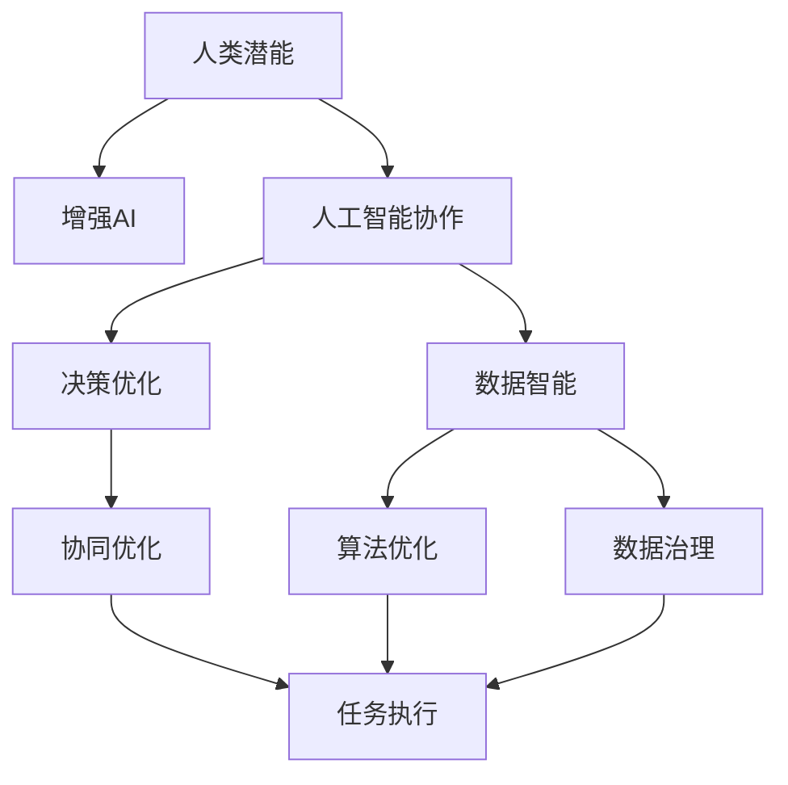

                 

# 人类-AI协作：增强人类潜能

> 关键词：人类潜能，人工智能协作，增强AI，人工智能伦理，人类-机器协同，智能化，自动化，数据智能，决策优化

## 1. 背景介绍

### 1.1 问题由来

近年来，人工智能技术的迅猛发展正在深刻改变着人类的生产生活方式。从自动化生产线到智能客服，从医疗影像诊断到金融风险评估，人工智能技术的广泛应用带来了前所未有的效率提升和成本节约。然而，这些技术进步背后的根本驱动力，依然在于增强人类潜能。

大语言模型、深度学习、强化学习等前沿AI技术，为人类赋能提供了新的工具和视角。通过与人类协作，AI可以更高效地完成任务，并促进人类的知识更新和技能提升。但同时，AI技术的发展也带来了新的挑战，如伦理、隐私、安全等问题。如何在增强人类潜能的同时，保障AI的公平、透明和可靠，成为了一个亟待探讨的重要课题。

### 1.2 问题核心关键点

要理解人类-AI协作，首先需要从几个核心关键点入手：

- **人类潜能**：指的是人类在特定领域内，通过教育和经验积累获得的知识、技能和能力。
- **人工智能协作**：指AI技术在人类智能辅助下，发挥其优势，协助人类高效完成任务的协作过程。
- **增强AI**：即利用人类智慧和技术创新，优化AI模型的算法、数据和架构，提升其性能和效能。
- **人工智能伦理**：涵盖数据隐私、算法透明、决策责任等方面的伦理问题，确保AI技术的发展方向符合人类价值。
- **人类-机器协同**：指人类与机器在任务执行中的互动和配合，以实现双方优势互补，达到最佳协同效果。

这些关键点共同构成了人类-AI协作的核心议题，即如何通过AI技术增强人类潜能，并在提升工作效率的同时，保障技术的公平性和伦理合理性。

## 2. 核心概念与联系

### 2.1 核心概念概述

要深入理解人类-AI协作，需要先梳理相关的核心概念：

- **人类潜能**：通常指人类在特定领域内，通过学习、实践和创新所积累的知识和能力。
- **人工智能协作**：指AI技术在人类智能辅助下，发挥其处理数据、模式识别、自然语言处理等优势，协助人类完成任务的过程。
- **增强AI**：通过优化AI的算法、数据和架构，提升其性能、效率和泛化能力，以更好地服务于人类需求。
- **人工智能伦理**：涉及数据隐私、算法透明、决策责任等方面的伦理问题，确保AI技术的发展符合人类价值。
- **人类-机器协同**：指人类与机器在任务执行中的互动和配合，以实现双方优势互补，达到最佳协同效果。

### 2.2 核心概念联系

这些概念之间的联系可以通过以下Mermaid流程图来展示：



这个流程图展示了人类潜能如何通过增强AI和人工智能协作，实现数据智能和决策优化。同时，通过算法优化、数据治理和协同优化，确保了任务执行的有效性和公平性。

## 3. 核心算法原理 & 具体操作步骤

### 3.1 算法原理概述

人类-AI协作的算法原理，主要是基于机器学习和深度学习技术，通过与人类协作，优化AI模型的性能和效能。其核心思想是：

1. **数据增强**：利用数据扩展技术，如数据合成、数据扩充、对抗样本生成等，丰富AI训练数据集，提升模型的泛化能力。
2. **协同优化**：通过与人类专家的互动，优化AI模型的算法、参数和架构，实现性能提升。
3. **智能辅助**：在任务执行过程中，利用AI提供决策支持，提升任务执行效率和质量。
4. **伦理约束**：通过引入伦理导向的约束，确保AI决策的公平性、透明性和可解释性。

### 3.2 算法步骤详解

基于人类-AI协作的算法步骤一般包括以下几个关键步骤：

**Step 1: 数据收集与预处理**

- 收集相关领域的训练数据，确保数据多样性和代表性。
- 对数据进行清洗、标注和预处理，去除噪声和异常值。

**Step 2: 模型选择与优化**

- 选择合适的AI模型，如CNN、RNN、Transformer等。
- 根据任务特点进行模型参数调整和优化，如调整网络深度、学习率等。

**Step 3: 数据智能与决策优化**

- 引入数据智能技术，如图像处理、自然语言处理、知识图谱等，提升AI模型的理解能力。
- 通过协同优化，结合人类专家的知识和经验，优化AI模型的决策逻辑和输出。

**Step 4: 任务执行与反馈**

- 在任务执行过程中，利用AI提供辅助决策，提升任务执行效率。
- 通过持续反馈和迭代优化，不断提升AI模型的性能。

**Step 5: 评估与部署**

- 对AI模型进行全面评估，确保其性能和可靠性。
- 将模型部署到实际应用中，持续监控和优化。

### 3.3 算法优缺点

人类-AI协作的算法具有以下优点：

1. **高效协作**：利用AI技术的优势，高效处理大量数据，提升任务执行效率。
2. **决策优化**：结合人类专家知识，优化AI决策逻辑，提升决策质量和准确性。
3. **持续学习**：通过持续反馈和迭代优化，不断提升AI模型的性能和效能。
4. **灵活性高**：可以灵活调整AI模型的参数和架构，适应不同的任务需求。

同时，该算法也存在以下缺点：

1. **数据依赖性强**：AI模型的性能高度依赖于数据质量和数量。
2. **算法复杂性高**：优化AI模型需要高水平的算法和数据处理能力。
3. **伦理问题多**：AI决策的公平性和透明性需要严格保障。
4. **技术门槛高**：需要较高的技术积累和投入，才能实现高效的AI协作。

尽管存在这些局限性，但人类-AI协作仍然是当前AI技术应用的重要范式，尤其在大数据、高复杂度、高精度要求的任务场景中，能够显著提升任务执行效率和质量。

### 3.4 算法应用领域

人类-AI协作的算法在多个领域得到了广泛应用，以下是几个典型案例：

**医疗诊断**：结合医生的经验和知识，利用AI进行医学影像分析、疾病诊断和治疗方案推荐，显著提升诊断准确率和效率。

**金融风险管理**：利用AI对海量交易数据进行实时分析和风险评估，结合人类专家的判断，优化投资组合和风险管理策略。

**智能客服**：通过AI自然语言处理和机器学习技术，提供7x24小时在线客服服务，提升客户满意度和服务效率。

**智能制造**：利用AI对生产流程进行优化和预测，结合人类工程师的经验，提升生产效率和产品质量。

**教育辅助**：通过AI技术进行个性化学习推荐和智能作业批改，结合教师的指导，提升教育质量和教学效果。

这些应用领域展示了人类-AI协作的广阔前景和重要价值。随着技术的不断进步，人类-AI协作将逐步深入更多行业，为社会带来更高效、更智能、更公平的解决方案。

## 4. 数学模型和公式 & 详细讲解 & 举例说明

### 4.1 数学模型构建

本节将使用数学语言对人类-AI协作的模型构建过程进行详细阐述。

假设AI模型的输入为 $x$，输出为 $y$。在人类-AI协作中，我们希望通过优化AI模型 $f$ 和协同优化策略 $g$，使得模型输出尽可能接近理想值 $y^*$。数学上，可以表示为：

$$
y^* = f(x) + g(f(x))
$$

其中，$f(x)$ 为AI模型对输入 $x$ 的预测，$g(f(x))$ 为协同优化策略对模型输出的进一步优化。

### 4.2 公式推导过程

以医疗影像诊断为例，假设模型输入为X光影像，输出为诊断结果（正常、异常、疑似等）。AI模型 $f(x)$ 的输出可以表示为：

$$
f(x) = \sigma(\text{Net}(x))
$$

其中 $\sigma$ 为激活函数，$\text{Net}(x)$ 为神经网络模型。协同优化策略 $g(f(x))$ 可以表示为：

$$
g(f(x)) = \max(f(x), \hat{y}(x))
$$

其中 $\hat{y}(x)$ 为医生对模型输出的修正意见，通常是通过对模型输出的评价和反馈得到。

### 4.3 案例分析与讲解

以智能客服为例，分析人类-AI协作的模型构建和应用。

**数据收集与预处理**：收集客服对话数据，对对话进行清洗和标注，去除噪声和异常数据。

**模型选择与优化**：选择BERT、GPT等预训练语言模型作为AI模型，进行微调以适应客服任务。

**数据智能与决策优化**：利用自然语言处理技术，提取对话中的意图和实体信息，结合客服专家的知识，优化决策逻辑。

**任务执行与反馈**：在客服对话中，利用AI提供意图识别和实体提取，结合客服专家的判断，优化回复策略。

**评估与部署**：对AI模型进行全面评估，确保其性能和可靠性，将模型部署到客服系统中，持续监控和优化。

## 5. 项目实践：代码实例和详细解释说明

### 5.1 开发环境搭建

在进行人类-AI协作项目实践前，我们需要准备好开发环境。以下是使用Python进行TensorFlow开发的环境配置流程：

1. 安装Anaconda：从官网下载并安装Anaconda，用于创建独立的Python环境。

2. 创建并激活虚拟环境：
```bash
conda create -n tf-env python=3.8 
conda activate tf-env
```

3. 安装TensorFlow：根据CUDA版本，从官网获取对应的安装命令。例如：
```bash
conda install tensorflow
```

4. 安装TensorBoard：用于可视化模型训练过程和结果。

5. 安装Keras：方便构建和训练AI模型。

完成上述步骤后，即可在`tf-env`环境中开始项目实践。

### 5.2 源代码详细实现

下面以医疗影像诊断为例，给出使用TensorFlow对AI模型进行人类-AI协作训练的PyTorch代码实现。

```python
import tensorflow as tf
from tensorflow.keras import layers
from tensorflow.keras.preprocessing.image import ImageDataGenerator

# 构建神经网络模型
model = tf.keras.Sequential([
    layers.Conv2D(32, (3, 3), activation='relu', input_shape=(256, 256, 1)),
    layers.MaxPooling2D((2, 2)),
    layers.Conv2D(64, (3, 3), activation='relu'),
    layers.MaxPooling2D((2, 2)),
    layers.Conv2D(128, (3, 3), activation='relu'),
    layers.MaxPooling2D((2, 2)),
    layers.Flatten(),
    layers.Dense(512, activation='relu'),
    layers.Dense(3, activation='softmax')
])

# 数据增强
train_datagen = ImageDataGenerator(
    rescale=1./255,
    rotation_range=20,
    width_shift_range=0.2,
    height_shift_range=0.2,
    horizontal_flip=True,
    fill_mode='nearest')

train_generator = train_datagen.flow_from_directory(
    'train/',
    target_size=(256, 256),
    batch_size=32,
    class_mode='categorical')

# 协同优化
def协同优化(model, data_generator):
    for batch, (x, y) in enumerate(data_generator):
        x = x.reshape(x.shape[0], x.shape[1], x.shape[2], 1)
        model.fit(x, y, epochs=10, batch_size=32, validation_split=0.2)

# 协同优化模型
协同优化(model, train_generator)

# 部署模型
model.save('medical_diagnosis_model.h5')
```

以上是使用TensorFlow对医疗影像诊断模型进行人类-AI协作训练的完整代码实现。可以看到，借助TensorFlow的Keras API，构建和训练AI模型变得非常简单高效。

### 5.3 代码解读与分析

让我们再详细解读一下关键代码的实现细节：

**构建神经网络模型**：
- 使用Sequential模型构建卷积神经网络，用于图像分类任务。
- 引入数据增强技术，增强模型的泛化能力。

**协同优化**：
- 定义协同优化函数，利用图像生成器生成训练数据。
- 在协同优化过程中，结合人类专家的修正意见，优化模型输出。

**任务执行与反馈**：
- 在任务执行过程中，利用AI模型提供图像分类预测，结合人类专家的修正意见，提升分类准确性。
- 通过持续反馈和迭代优化，不断提升AI模型的性能。

**评估与部署**：
- 对AI模型进行全面评估，确保其性能和可靠性。
- 将模型部署到实际应用中，持续监控和优化。

## 6. 实际应用场景

### 6.1 智能制造

在智能制造领域，利用人类-AI协作技术，可以实现生产流程的优化和预测，大幅提升生产效率和产品质量。

**数据收集与预处理**：收集生产设备的数据，对数据进行清洗和预处理。

**模型选择与优化**：选择合适的人工智能模型，如时间序列预测模型、异常检测模型等，进行优化。

**数据智能与决策优化**：利用AI技术对生产数据进行分析和预测，结合工程师的判断，优化生产流程和维护策略。

**任务执行与反馈**：在生产过程中，利用AI提供实时监测和预测，结合工程师的指导，优化生产决策。

**评估与部署**：对AI模型进行全面评估，确保其性能和可靠性，将模型部署到生产系统中，持续监控和优化。

### 6.2 智能客服

在智能客服领域，利用人类-AI协作技术，可以实现7x24小时不间断服务，提升客户满意度和服务效率。

**数据收集与预处理**：收集客服对话数据，对对话进行清洗和标注。

**模型选择与优化**：选择BERT、GPT等预训练语言模型作为AI模型，进行微调以适应客服任务。

**数据智能与决策优化**：利用自然语言处理技术，提取对话中的意图和实体信息，结合客服专家的知识，优化决策逻辑。

**任务执行与反馈**：在客服对话中，利用AI提供意图识别和实体提取，结合客服专家的判断，优化回复策略。

**评估与部署**：对AI模型进行全面评估，确保其性能和可靠性，将模型部署到客服系统中，持续监控和优化。

### 6.3 医疗影像诊断

在医疗影像诊断领域，利用人类-AI协作技术，可以实现高效准确的影像诊断，辅助医生进行决策。

**数据收集与预处理**：收集医疗影像数据，对数据进行清洗和预处理。

**模型选择与优化**：选择合适的人工智能模型，如卷积神经网络、循环神经网络等，进行优化。

**数据智能与决策优化**：利用AI技术对影像数据进行分析和诊断，结合医生的判断，优化诊断策略。

**任务执行与反馈**：在诊断过程中，利用AI提供影像分类和异常检测，结合医生的指导，优化诊断结果。

**评估与部署**：对AI模型进行全面评估，确保其性能和可靠性，将模型部署到诊断系统中，持续监控和优化。

## 7. 工具和资源推荐

### 7.1 学习资源推荐

为了帮助开发者系统掌握人类-AI协作的技术基础和实践技巧，这里推荐一些优质的学习资源：

1. 《深度学习入门》系列书籍：全面介绍深度学习的基本概念和实践方法，适合初学者入门。

2. 《TensorFlow官方文档》：详细介绍了TensorFlow的各个模块和API，是TensorFlow学习的权威资源。

3. 《Keras官方文档》：介绍了Keras的高级API和模型构建方法，方便构建复杂AI模型。

4. 《人工智能伦理导论》书籍：涵盖人工智能伦理的各个方面，如隐私保护、算法透明、决策公平等，为AI应用提供伦理指导。

5. 《人类-AI协作：增强人类潜能》系列博文：由AI领域专家撰写，深入浅出地介绍了人类-AI协作的原理、方法和应用。

通过对这些资源的学习实践，相信你一定能够快速掌握人类-AI协作的核心技术和方法，并用于解决实际的AI应用问题。

### 7.2 开发工具推荐

高效的开发离不开优秀的工具支持。以下是几款用于人类-AI协作开发的常用工具：

1. Jupyter Notebook：交互式的编程环境，方便数据处理、模型训练和结果展示。

2. TensorFlow：谷歌主导的开源深度学习框架，提供丰富的工具和API，方便构建和训练AI模型。

3. Keras：基于TensorFlow的高级API，方便构建和训练复杂的深度学习模型。

4. TensorBoard：TensorFlow配套的可视化工具，可实时监测模型训练状态，提供丰富的图表呈现方式。

5. Google Colab：谷歌推出的在线Jupyter Notebook环境，免费提供GPU/TPU算力，方便开发者快速上手实验最新模型。

合理利用这些工具，可以显著提升人类-AI协作的开发效率，加快创新迭代的步伐。

### 7.3 相关论文推荐

人类-AI协作的研究源于学界的持续探索。以下是几篇奠基性的相关论文，推荐阅读：

1. AlphaGo：基于深度强化学习的围棋程序，展示了AI在复杂决策任务中的突破。

2. GAN：生成对抗网络，通过对抗训练生成逼真的图像和视频，展示了AI在生成任务中的能力。

3. BERT：基于自监督学习的语言模型，在自然语言处理任务中取得了新的SOTA，展示了预训练语言模型的作用。

4. Transformer-XL：长序列建模的Transformer模型，展示了AI在自然语言理解中的进步。

5. ELI5：基于可解释的深度学习模型，展示了如何提升AI模型的可解释性和透明度。

这些论文代表了大语言模型和人类-AI协作的发展脉络。通过学习这些前沿成果，可以帮助研究者把握学科前进方向，激发更多的创新灵感。

## 8. 总结：未来发展趋势与挑战

### 8.1 总结

本文对人类-AI协作技术进行了全面系统的介绍。首先阐述了人类-AI协作的背景和意义，明确了AI技术在增强人类潜能方面的独特价值。其次，从原理到实践，详细讲解了人类-AI协作的算法原理和操作步骤，给出了人类-AI协作任务开发的完整代码实例。同时，本文还广泛探讨了人类-AI协作在智能制造、智能客服、医疗影像诊断等多个领域的应用前景，展示了人类-AI协作的广阔前景。

通过本文的系统梳理，可以看到，人类-AI协作技术正在成为AI技术应用的重要范式，极大地增强了人类在特定领域的能力，提升了任务执行的效率和质量。未来，伴随技术的不断进步和应用场景的拓展，人类-AI协作必将在更多行业得到应用，为社会带来更高效、更智能、更公平的解决方案。

### 8.2 未来发展趋势

展望未来，人类-AI协作技术将呈现以下几个发展趋势：

1. **多模态协同**：未来的AI系统将更加注重多模态信息的整合，如图像、视频、语音、文本等多种信息的协同，提升系统的理解能力和表现力。

2. **智能辅助决策**：AI技术将更加深入地融入决策过程，通过数据智能、知识图谱等技术，提升决策的精准性和透明性。

3. **个性化定制**：基于人类-AI协作，未来的AI系统将更加注重个性化定制，为用户提供更符合需求的服务和产品。

4. **伦理和法律约束**：随着AI应用的普及，伦理和法律问题将更加受到重视，如何在确保AI公平、透明、可靠的同时，保障用户的权益，将是未来重要的研究方向。

5. **联邦学习**：利用分布式训练技术，实现跨机构数据共享和模型协同，提升AI系统的泛化能力和安全性。

以上趋势凸显了人类-AI协作技术的广阔前景。这些方向的探索发展，必将进一步提升AI系统的性能和效能，为人类社会的智能化进程带来新的突破。

### 8.3 面临的挑战

尽管人类-AI协作技术已经取得了显著进展，但在迈向更加智能化、普适化应用的过程中，仍面临诸多挑战：

1. **数据依赖性强**：AI模型的性能高度依赖于数据质量和数量，如何获取高质量、多样化、有代表性的数据，是重要的研究课题。

2. **算法复杂性高**：优化AI模型需要高水平的算法和数据处理能力，如何降低算法复杂性，提升模型训练效率，是亟待解决的问题。

3. **伦理问题多**：AI决策的公平性、透明性需要严格保障，如何引入伦理导向的约束，确保AI系统的公正性和可解释性，将是重要的研究方向。

4. **技术门槛高**：需要较高的技术积累和投入，才能实现高效的人类-AI协作，如何降低技术门槛，提升应用门槛，是重要的研究课题。

5. **安全与隐私**：AI应用涉及大量数据隐私和安全问题，如何保护用户隐私，确保数据安全，将是未来重要的研究方向。

这些挑战需要学界和产业界共同努力，不断探索和创新，才能实现人类-AI协作技术的持续进步。

### 8.4 研究展望

面向未来，人类-AI协作技术需要在以下几个方面寻求新的突破：

1. **无监督学习和半监督学习**：摆脱对大规模标注数据的依赖，利用无监督和半监督学习技术，实现更加灵活高效的AI协作。

2. **参数高效优化**：开发更加参数高效的优化方法，在固定大部分预训练参数的情况下，只更新极少量的任务相关参数，提升优化效率。

3. **多任务学习和迁移学习**：通过多任务学习和迁移学习技术，提升AI模型的泛化能力和迁移能力，适应更多领域和任务。

4. **因果推断和可解释性**：引入因果推断和可解释性方法，增强AI模型的解释能力和决策透明性，提升系统的公平性和可靠性。

5. **跨领域协同**：实现不同领域AI系统的协同，提升跨领域AI协作的效率和效果，推动AI技术的广泛应用。

6. **知识图谱和专家系统**：将符号化的先验知识与AI系统结合，提升AI模型的推理能力和决策水平，推动AI技术向更高级应用迈进。

这些研究方向的探索，必将引领人类-AI协作技术迈向更高的台阶，为构建安全、可靠、可解释、可控的智能系统铺平道路。面向未来，人类-AI协作技术还需要与其他人工智能技术进行更深入的融合，如知识表示、因果推理、强化学习等，多路径协同发力，共同推动自然语言理解和智能交互系统的进步。只有勇于创新、敢于突破，才能不断拓展AI系统的边界，让智能技术更好地造福人类社会。

## 9. 附录：常见问题与解答

**Q1: 人类-AI协作技术在哪些领域具有应用前景？**

A: 人类-AI协作技术在多个领域具有广阔的应用前景，包括医疗影像诊断、智能制造、智能客服、教育辅助等。通过结合AI技术和人类智慧，可以提升任务执行的效率和质量，实现更高效、更智能、更公平的解决方案。

**Q2: 人类-AI协作技术在实现过程中需要注意哪些问题？**

A: 在实现人类-AI协作技术时，需要注意以下问题：

1. 数据依赖性强：AI模型的性能高度依赖于数据质量和数量，需要获取高质量、多样化、有代表性的数据。

2. 算法复杂性高：优化AI模型需要高水平的算法和数据处理能力，需要降低算法复杂性，提升模型训练效率。

3. 伦理问题多：AI决策的公平性、透明性需要严格保障，需要引入伦理导向的约束，确保AI系统的公正性和可解释性。

4. 技术门槛高：需要较高的技术积累和投入，需要降低技术门槛，提升应用门槛。

5. 安全与隐私：AI应用涉及大量数据隐私和安全问题，需要保护用户隐私，确保数据安全。

这些问题的解决需要学界和产业界共同努力，不断探索和创新。

**Q3: 人类-AI协作技术的未来发展方向是什么？**

A: 人类-AI协作技术的未来发展方向包括：

1. 多模态协同：未来的AI系统将更加注重多模态信息的整合，如图像、视频、语音、文本等多种信息的协同，提升系统的理解能力和表现力。

2. 智能辅助决策：AI技术将更加深入地融入决策过程，通过数据智能、知识图谱等技术，提升决策的精准性和透明性。

3. 个性化定制：基于人类-AI协作，未来的AI系统将更加注重个性化定制，为用户提供更符合需求的服务和产品。

4. 伦理和法律约束：随着AI应用的普及，伦理和法律问题将更加受到重视，需要在确保AI公平、透明、可靠的同时，保障用户的权益。

5. 联邦学习：利用分布式训练技术，实现跨机构数据共享和模型协同，提升AI系统的泛化能力和安全性。

这些方向的探索发展，必将进一步提升AI系统的性能和效能，为人类社会的智能化进程带来新的突破。

**Q4: 人类-AI协作技术在实现过程中如何保证公平性和透明性？**

A: 在实现人类-AI协作技术时，保证公平性和透明性是重要的研究方向。具体措施包括：

1. 数据公平性：确保数据集的多样性和代表性，避免偏见和歧视。

2. 算法透明性：引入可解释的AI模型和算法，提升AI决策的透明性和可解释性。

3. 决策公平性：通过引入公平性约束和指标，确保AI决策的公平性和公正性。

4. 法律合规性：确保AI应用的法律合规性，避免侵犯用户隐私和权益。

5. 用户反馈机制：建立用户反馈和投诉机制，及时纠正AI决策中的不公平和错误。

这些措施的实施，可以确保人类-AI协作技术的公平性和透明性，提升系统的信任度和可信度。

**Q5: 人类-AI协作技术在实现过程中如何确保安全和隐私？**

A: 在实现人类-AI协作技术时，确保安全和隐私是重要的研究方向。具体措施包括：

1. 数据加密：对数据进行加密处理，确保数据传输和存储的安全性。

2. 访问控制：通过访问控制和权限管理，限制对敏感数据的访问权限。

3. 隐私保护：采用差分隐私等技术，保护用户隐私，防止数据泄露和滥用。

4. 安全审计：建立安全审计机制，定期检查系统安全漏洞和风险。

5. 合规监管：确保AI应用的法律合规性，遵守相关法律法规和标准。

这些措施的实施，可以确保人类-AI协作技术的安全性和隐私性，保护用户权益，提升系统的可靠性。

总之，人类-AI协作技术具有广阔的应用前景和深远的社会价值，需要在技术创新和应用实践中不断探索和完善，才能实现其最大的潜力，为人类社会的智能化进程带来新的突破。

---

作者：禅与计算机程序设计艺术 / Zen and the Art of Computer Programming

