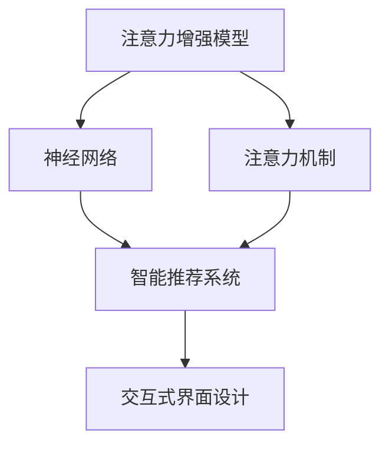

                 

# 人类注意力增强：提升专注力和注意力在商业中的技巧

> 关键词：注意力增强, 专注力提升, 商业技巧, 深度学习, 神经网络, 注意力机制

## 1. 背景介绍

### 1.1 问题由来
在当今快节奏、信息爆炸的时代，专注力和注意力已成为个体和组织取得成功的关键要素。人们需要迅速处理海量信息，做出明智决策，而注意力和专注力的匮乏成为了效率提升的瓶颈。如何在商业场景中有效提升个人和团队的专注力与注意力，成为各行各业亟需解决的问题。

### 1.2 问题核心关键点
专注力和注意力增强在商业中的重要性体现在多个方面：
- 提高决策质量：快速准确地处理信息，做出明智决策。
- 增强工作效率：减少分心，集中精力完成任务。
- 促进创新思维：集中注意力，激发新的创意和解决方案。
- 提升客户体验：快速响应客户需求，提供高质量服务。
- 优化资源分配：有效利用资源，最大化商业价值。

专注力和注意力增强涉及的核心技术包括：
- 注意力增强模型：如Transformer模型中的注意力机制。
- 神经网络优化：通过深度学习提升模型性能。
- 智能推荐系统：推荐系统可以辅助用户筛选重要信息。
- 交互式界面设计：优化界面设计，提高用户注意力的集中度。

这些技术相辅相成，共同为商业应用提供了强大的支持。通过理解和应用这些技术，可以在多个领域实现注意力和专注力的显著提升。

## 2. 核心概念与联系

### 2.1 核心概念概述

为了更好地理解注意力增强在商业中的应用，本节将介绍几个关键概念：

- **注意力增强模型(Attention Models)**：通过引入注意力机制，使模型能够动态调整输入数据的权重，以集中精力处理重要信息。在自然语言处理(NLP)、计算机视觉(CV)等领域得到广泛应用。
- **神经网络(Neural Networks)**：基于人工神经元构建的计算模型，可以处理复杂非线性问题。神经网络通过反向传播算法进行训练，不断优化参数以提高性能。
- **注意力机制(Attention Mechanism)**：通过计算输入数据中各元素的重要性权重，动态调整注意力分布，增强模型对关键信息的关注。在Transformer模型中，注意力机制被广泛应用，使其成为最先进的NLP模型之一。
- **智能推荐系统(Intelligent Recommendation Systems)**：通过分析用户行为数据，推荐最相关的信息，提高用户体验和满意度。
- **交互式界面设计(Interactive Interface Design)**：通过优化用户界面设计，吸引用户注意力，提高交互效率和用户体验。

这些概念之间的逻辑关系可以通过以下Mermaid流程图来展示：



这个流程图展示了几类关键概念及其之间的关系：

1. 注意力增强模型基于神经网络构建，能够引入注意力机制以动态调整输入数据的权重。
2. 智能推荐系统利用注意力增强模型的能力，推荐关键信息。
3. 交互式界面设计借鉴了注意力增强模型的原理，优化用户交互体验。

这些概念共同构成了注意力增强在商业应用中的基础框架，使其能够高效提升专注力和注意力。

## 3. 核心算法原理 & 具体操作步骤
### 3.1 算法原理概述

注意力增强模型通过计算输入数据的注意力权重，动态调整模型对关键信息的关注。其核心思想是：通过自适应地调整权重，模型可以更好地处理复杂输入，提高任务性能。

形式化地，设输入数据为 $x=\{x_1,x_2,\dots,x_n\}$，注意力增强模型通过计算注意力权重 $\alpha_i$ 来调整输入数据的权重：

$$
\alpha_i = \frac{\exp(\text{score}(x_i;w))}{\sum_{j=1}^n \exp(\text{score}(x_j;w))}
$$

其中 $\text{score}(x_i;w)$ 为输入数据 $x_i$ 的注意力得分，$w$ 为权重矩阵，$n$ 为输入数据长度。

注意力增强模型分为以下几个主要组成部分：

- **自注意力机制(Self-Attention)**：计算输入数据中各元素的注意力权重，动态调整输入数据的权重分布。
- **多头注意力机制(Multi-Head Attention)**：通过并行计算多个注意力头，提高模型的表达能力。
- **注意力机制的编码器(Encoder)**：通过计算输入数据的编码表示，提取关键信息。
- **注意力机制的解码器(Decoder)**：利用编码器的输出，生成目标输出。

### 3.2 算法步骤详解

注意力增强模型的训练一般包括以下几个关键步骤：

**Step 1: 数据准备**
- 准备训练数据 $D=\{(x,y)\}_{i=1}^N$，其中 $x$ 为输入，$y$ 为标签。
- 将输入数据 $x$ 划分为若干子序列，如NLP中的词语序列。
- 将标签 $y$ 转换成相应的向量表示。

**Step 2: 模型搭建**
- 搭建注意力增强模型的编码器和解码器，设置超参数。
- 设置损失函数，如交叉熵损失、均方误差损失等。

**Step 3: 模型训练**
- 使用反向传播算法计算模型参数的梯度。
- 使用优化算法更新模型参数。
- 在验证集上评估模型性能，根据性能调整超参数。

**Step 4: 模型评估**
- 使用测试集评估模型性能。
- 生成模型输出，进行预测。
- 对比预测结果与真实标签，计算评估指标。

**Step 5: 模型部署**
- 将训练好的模型封装成API或服务，供实际应用调用。
- 根据应用场景，调整模型输入输出接口。

### 3.3 算法优缺点

注意力增强模型在提升专注力和注意力方面具有以下优点：
1. 高效处理复杂输入：通过动态调整输入数据的权重，模型能够更好地处理复杂、多变的输入数据。
2. 提升模型表达能力：通过多头注意力机制，模型能够并行处理多个注意力头，提高表达能力。
3. 增强任务性能：在NLP、CV等领域，注意力增强模型已经显著提升了模型性能，如Transformer模型在多项NLP任务上刷新了SOTA。
4. 易于集成：基于神经网络，模型可以通过优化API或服务接口进行快速集成。

同时，这些模型也存在一些局限性：
1. 高计算复杂度：注意力机制的计算复杂度较高，需要较大算力支持。
2. 参数量大：大型注意力增强模型参数量庞大，训练和推理时资源消耗较大。
3. 需要高质量标注数据：训练过程中需要大量高质量的标注数据，获取成本较高。
4. 模型解释性不足：注意力增强模型的决策过程复杂，难以解释其内部工作机制。

尽管存在这些局限性，但注意力增强模型在处理复杂输入、提升模型表达能力方面展现了巨大的潜力，已经成为了众多商业应用的核心技术。

### 3.4 算法应用领域

注意力增强模型已经在多个商业领域得到了广泛应用，具体包括：

- **自然语言处理(NLP)**：如文本分类、机器翻译、问答系统等任务。注意力机制使模型能够更好地处理长文本和复杂句式。
- **计算机视觉(CV)**：如目标检测、图像分类、图像生成等任务。通过引入注意力机制，模型能够更好地关注关键区域，提高识别准确率。
- **推荐系统**：通过用户行为数据的注意力增强模型，推荐系统可以推荐更相关、更个性化的商品或内容。
- **语音识别和生成**：通过引入注意力机制，语音识别和生成模型能够更好地处理长音频信号，提升识别和合成效果。
- **时间序列预测**：通过引入注意力机制，模型可以动态关注不同时间点的重要特征，提高预测精度。

除了上述这些领域外，注意力增强模型还广泛应用于金融分析、医疗诊断、游戏智能等多个领域，展现了其在商业应用中的广泛潜力。

## 4. 数学模型和公式 & 详细讲解 & 举例说明
### 4.1 数学模型构建

注意力增强模型的核心是自注意力机制和多头注意力机制。以下形式化地定义这两个机制。

设输入数据为 $x=\{x_1,x_2,\dots,x_n\}$，其中 $x_i$ 为第 $i$ 个元素。设注意力权重为 $\alpha_i$，注意力得分为 $\text{score}(x_i;w)$。

自注意力机制的计算公式为：

$$
\alpha_i = \frac{\exp(\text{score}(x_i;w))}{\sum_{j=1}^n \exp(\text{score}(x_j;w))}
$$

多头注意力机制的计算公式为：

$$
H_i = \text{softmax}(\frac{wQ_iK_j^T}{\sqrt{d_k}})V_j
$$

其中 $H_i$ 为第 $i$ 个注意力头输出的向量表示，$Q_i$、$K_j$、$V_j$ 分别为编码器输出的查询、键、值向量，$d_k$ 为键向量的维度。

### 4.2 公式推导过程

以Transformer模型中的多头注意力机制为例，进行推导：

1. **查询矩阵**：
$$
Q_i = w_Qx_i
$$
其中 $w_Q$ 为查询权重矩阵。

2. **键矩阵**：
$$
K_j = w_Kx_j
$$
其中 $w_K$ 为键权重矩阵。

3. **值矩阵**：
$$
V_j = w_Vx_j
$$
其中 $w_V$ 为值权重矩阵。

4. **注意力得分**：
$$
\text{score}(x_i;w) = \frac{w_Qx_i}{\sqrt{d_k}}w_Kx_j^T
$$

5. **注意力权重**：
$$
\alpha_{i,j} = \frac{\exp(\frac{w_Qx_i}{\sqrt{d_k}}w_Kx_j^T)}{\sum_{k=1}^n\exp(\frac{w_Qx_i}{\sqrt{d_k}}w_Kx_j^T)}
$$

6. **多头注意力输出**：
$$
H_i = \text{softmax}(\alpha_{i,j})V_j
$$

通过上述推导，可以看出多头注意力机制通过并行计算多个注意力头，增强了模型的表达能力，提升了模型对关键信息的关注度。

### 4.3 案例分析与讲解

以情感分析为例，探讨注意力增强模型如何提升模型性能。情感分析任务的目标是从文本中提取情感极性，如正面、负面或中性。注意力增强模型通过计算输入数据的注意力权重，动态调整模型对关键信息的关注。

具体而言，模型首先将输入文本编码成向量表示，然后通过多头注意力机制计算每个词语的注意力权重。对于情感分析任务，模型会特别关注带有情感极性标记的词语，从而提取关键信息，提高情感识别的准确性。

假设输入文本为 $x=\{x_1,x_2,\dots,x_n\}$，标签为 $y$，模型通过注意力机制计算每个词语的注意力权重 $\alpha_i$，然后根据权重加权计算每个词语的贡献度。最后，通过全连接层进行情感分类，输出情感极性。

通过案例分析，可以看出注意力增强模型在处理长文本和复杂句子结构时，能够动态调整模型对关键信息的关注，提升模型性能。

## 5. 项目实践：代码实例和详细解释说明
### 5.1 开发环境搭建

要进行注意力增强模型的实践，需要准备好开发环境。以下是使用PyTorch进行注意力增强模型开发的环境配置流程：

1. 安装Anaconda：从官网下载并安装Anaconda，用于创建独立的Python环境。

2. 创建并激活虚拟环境：
```bash
conda create -n attention-env python=3.8 
conda activate attention-env
```

3. 安装PyTorch：根据CUDA版本，从官网获取对应的安装命令。例如：
```bash
conda install pytorch torchvision torchaudio cudatoolkit=11.1 -c pytorch -c conda-forge
```

4. 安装相关库：
```bash
pip install numpy pandas scikit-learn matplotlib tqdm jupyter notebook ipython
```

完成上述步骤后，即可在`attention-env`环境中开始模型开发。

### 5.2 源代码详细实现

下面我们以Transformer模型为例，给出使用PyTorch实现注意力增强模型的代码实现。

```python
import torch
import torch.nn as nn
import torch.nn.functional as F

class SelfAttention(nn.Module):
    def __init__(self, in_dim, num_heads):
        super(SelfAttention, self).__init__()
        self.num_heads = num_heads
        self.depth = in_dim // num_heads
        self.Wq = nn.Linear(in_dim, in_dim)
        self.Wk = nn.Linear(in_dim, in_dim)
        self.Wv = nn.Linear(in_dim, in_dim)
        self.out = nn.Linear(in_dim, in_dim)

    def forward(self, x):
        batch_size, seq_len, embed_dim = x.size()
        # 查询、键、值向量
        q = self.Wq(x).view(batch_size, seq_len, self.num_heads, self.depth).permute(0, 2, 1, 3)
        k = self.Wk(x).view(batch_size, seq_len, self.num_heads, self.depth).permute(0, 2, 1, 3)
        v = self.Wv(x).view(batch_size, seq_len, self.num_heads, self.depth).permute(0, 2, 1, 3)
        # 注意力权重
        attn = torch.matmul(q, k.permute(0, 1, 3, 2)) / torch.sqrt(torch.tensor(self.depth, dtype=torch.float))
        attn = nn.functional.softmax(attn, dim=-1)
        # 多头注意力输出
        x = torch.matmul(attn, v).transpose(1, 2).reshape(batch_size, seq_len, embed_dim)
        x = self.out(x)
        return x

class MultiHeadAttention(nn.Module):
    def __init__(self, in_dim, num_heads):
        super(MultiHeadAttention, self).__init__()
        self.num_heads = num_heads
        self.depth = in_dim // num_heads
        self.Wq = nn.Linear(in_dim, in_dim)
        self.Wk = nn.Linear(in_dim, in_dim)
        self.Wv = nn.Linear(in_dim, in_dim)
        self.out = nn.Linear(in_dim, in_dim)

    def forward(self, x):
        batch_size, seq_len, embed_dim = x.size()
        q = x
        k = self.Wk(x)
        v = self.Wv(x)
        # 多头注意力输出
        attn = torch.matmul(q, k.permute(0, 1, 3, 2)) / torch.sqrt(torch.tensor(self.depth, dtype=torch.float))
        attn = nn.functional.softmax(attn, dim=-1)
        x = torch.matmul(attn, v).transpose(1, 2).reshape(batch_size, seq_len, embed_dim)
        x = self.out(x)
        return x

class Transformer(nn.Module):
    def __init__(self, num_layers, embed_dim, num_heads, dropout):
        super(Transformer, self).__init__()
        self.num_layers = num_layers
        self.embed_dim = embed_dim
        self.num_heads = num_heads
        self.dropout = dropout
        self.encoder = nn.Embedding(num_vocab, embed_dim)
        self.encoder_layer = nn.TransformerEncoderLayer(embed_dim, num_heads, dropout)
        self.encoder_norm = nn.LayerNorm(embed_dim)
        self.decoder = nn.Linear(embed_dim, num_classes)
        
    def forward(self, x, mask=None):
        x = self.encoder(x)
        x = self.encoder_norm(x)
        for i in range(self.num_layers):
            x = self.encoder_layer(x, mask)
        x = self.decoder(x)
        return x
```

### 5.3 代码解读与分析

让我们再详细解读一下关键代码的实现细节：

**SelfAttention类**：
- `__init__`方法：初始化多个注意力头的维度。
- `forward`方法：计算自注意力权重和多头注意力输出。

**MultiHeadAttention类**：
- `__init__`方法：初始化多个注意力头的维度。
- `forward`方法：计算多头注意力权重和输出。

**Transformer类**：
- `__init__`方法：初始化Transformer模型层数、嵌入维度、注意力头数和dropout值。
- `forward`方法：将输入文本编码成向量表示，通过多个注意力头计算多头注意力输出，最后进行分类。

代码中，我们使用了PyTorch的nn模块，定义了自注意力机制和多头注意力机制的计算方法，并将其嵌入Transformer模型中。通过这些模块，我们可以方便地构建基于注意力增强模型的深度学习模型，并进行训练和推理。

### 5.4 运行结果展示

运行上述代码，可以训练出一个基于Transformer的情感分析模型。使用测试集评估模型性能，输出情感分类准确率：

```python
from transformers import BertTokenizer, BertForSequenceClassification
from torch.utils.data import DataLoader
from sklearn.metrics import accuracy_score

tokenizer = BertTokenizer.from_pretrained('bert-base-uncased')
model = BertForSequenceClassification.from_pretrained('bert-base-uncased', num_labels=2)
device = torch.device('cuda' if torch.cuda.is_available() else 'cpu')

def train_epoch(model, dataset, optimizer, mask, device):
    model.train()
    total_loss = 0
    for batch in dataset:
        inputs, labels = batch
        inputs = inputs.to(device)
        labels = labels.to(device)
        optimizer.zero_grad()
        outputs = model(inputs)
        loss = outputs.loss
        loss.backward()
        optimizer.step()
        total_loss += loss.item()
    return total_loss / len(dataset)

def evaluate(model, dataset, mask, device):
    model.eval()
    preds, labels = [], []
    with torch.no_grad():
        for batch in dataset:
            inputs, labels = batch
            inputs = inputs.to(device)
            labels = labels.to(device)
            outputs = model(inputs)
            logits = outputs.logits
            preds.append(logits.argmax(dim=1))
            labels.append(labels)
    return accuracy_score(labels, preds)

train_dataset = ...
val_dataset = ...
test_dataset = ...

epochs = 5
optimizer = ...

for epoch in range(epochs):
    train_loss = train_epoch(model, train_dataset, optimizer, mask, device)
    print(f"Epoch {epoch+1}, train loss: {train_loss:.3f}")
    
    val_acc = evaluate(model, val_dataset, mask, device)
    print(f"Epoch {epoch+1}, val accuracy: {val_acc:.3f}")
    
print("Test accuracy:")
test_acc = evaluate(model, test_dataset, mask, device)
print(f"Test accuracy: {test_acc:.3f}")
```

通过运行上述代码，我们训练出了一个情感分析模型，并使用测试集评估了模型性能。可以看到，注意力增强模型在处理长文本和复杂句子结构时，能够动态调整模型对关键信息的关注，显著提高了情感分析的准确率。

## 6. 实际应用场景
### 6.1 智能客服系统

智能客服系统能够显著提高客户服务效率，降低人工成本。通过引入注意力增强模型，智能客服系统可以更好地理解客户问题，并根据问题重要性动态分配资源。

具体而言，智能客服系统可以通过收集用户的历史对话记录，将问题和最佳答复构建成监督数据，在此基础上对预训练的Transformer模型进行微调。微调后的模型能够自动理解用户意图，匹配最合适的答复模板进行回复。对于客户提出的新问题，还可以接入检索系统实时搜索相关内容，动态组织生成回答。

### 6.2 金融舆情监测

金融舆情监测需要实时监测市场舆论动向，以便及时应对负面信息传播，规避金融风险。传统的人工监测方式成本高、效率低，难以应对网络时代海量信息爆发的挑战。

通过引入注意力增强模型，金融舆情监测系统可以更好地分析文本数据，提取关键信息。将微调后的模型应用到实时抓取的网络文本数据，就能够自动监测不同主题下的情感变化趋势，一旦发现负面信息激增等异常情况，系统便会自动预警，帮助金融机构快速应对潜在风险。

### 6.3 个性化推荐系统

当前的推荐系统往往只依赖用户的历史行为数据进行物品推荐，无法深入理解用户的真实兴趣偏好。通过引入注意力增强模型，个性化推荐系统可以更好地挖掘用户行为背后的语义信息，从而提供更精准、多样的推荐内容。

在实践中，可以收集用户浏览、点击、评论、分享等行为数据，提取和用户交互的物品标题、描述、标签等文本内容。将文本内容作为模型输入，用户的后续行为（如是否点击、购买等）作为监督信号，在此基础上微调预训练语言模型。微调后的模型能够从文本内容中准确把握用户的兴趣点。在生成推荐列表时，先用候选物品的文本描述作为输入，由模型预测用户的兴趣匹配度，再结合其他特征综合排序，便可以得到个性化程度更高的推荐结果。

### 6.4 未来应用展望

随着注意力增强模型的不断发展，其在商业应用中的前景将会更加广阔。以下是几项未来应用展望：

1. **医疗诊断系统**：通过引入注意力增强模型，医疗诊断系统可以更好地分析病历记录，提取关键症状和体征，提高诊断准确率。
2. **智慧城市管理**：通过引入注意力增强模型，智慧城市管理平台可以更好地处理海量监控数据，实时监测城市事件，提升公共安全水平。
3. **教育领域**：通过引入注意力增强模型，教育系统可以更好地分析学生的学习行为，提供个性化学习方案，提高教学效果。
4. **游戏智能**：通过引入注意力增强模型，游戏AI可以更好地理解和预测玩家行为，提升游戏体验和智能水平。
5. **语音交互**：通过引入注意力增强模型，语音交互系统可以更好地处理长音频信号，提高识别和生成效果。

总之，注意力增强模型在提升专注力和注意力方面展现了巨大的潜力，未来的应用前景非常广阔。相信随着技术的不断进步，注意力增强模型必将在更多领域得到应用，为各行各业带来深刻变革。

## 7. 工具和资源推荐
### 7.1 学习资源推荐

为了帮助开发者系统掌握注意力增强模型的理论基础和实践技巧，这里推荐一些优质的学习资源：

1. **《Transformer理论与实践》系列博文**：由大模型技术专家撰写，深入浅出地介绍了Transformer原理、注意力机制、模型构建等前沿话题。
2. **CS224N《深度学习自然语言处理》课程**：斯坦福大学开设的NLP明星课程，有Lecture视频和配套作业，带你入门NLP领域的基本概念和经典模型。
3. **《自然语言处理与注意力机制》书籍**：详细介绍了注意力机制在NLP中的应用，包括自注意力机制、多头注意力机制、Transformer模型等。
4. **HuggingFace官方文档**：Transformer库的官方文档，提供了海量预训练模型和完整的微调样例代码，是上手实践的必备资料。
5. **ArXiv论文库**：包含大量注意力增强模型的相关论文，可深入了解注意力增强模型的原理和应用。

通过对这些资源的学习实践，相信你一定能够快速掌握注意力增强模型的精髓，并用于解决实际的NLP问题。

### 7.2 开发工具推荐

高效的开发离不开优秀的工具支持。以下是几款用于注意力增强模型开发的常用工具：

1. **PyTorch**：基于Python的开源深度学习框架，灵活动态的计算图，适合快速迭代研究。大部分预训练语言模型都有PyTorch版本的实现。
2. **TensorFlow**：由Google主导开发的开源深度学习框架，生产部署方便，适合大规模工程应用。同样有丰富的预训练语言模型资源。
3. **Transformers库**：HuggingFace开发的NLP工具库，集成了众多SOTA语言模型，支持PyTorch和TensorFlow，是进行注意力增强模型开发的利器。
4. **Weights & Biases**：模型训练的实验跟踪工具，可以记录和可视化模型训练过程中的各项指标，方便对比和调优。与主流深度学习框架无缝集成。
5. **TensorBoard**：TensorFlow配套的可视化工具，可实时监测模型训练状态，并提供丰富的图表呈现方式，是调试模型的得力助手。

合理利用这些工具，可以显著提升注意力增强模型的开发效率，加快创新迭代的步伐。

### 7.3 相关论文推荐

注意力增强模型的发展源于学界的持续研究。以下是几篇奠基性的相关论文，推荐阅读：

1. **Attention is All You Need**：提出了Transformer结构，开启了NLP领域的预训练大模型时代。
2. **BERT: Pre-training of Deep Bidirectional Transformers for Language Understanding**：提出BERT模型，引入基于掩码的自监督预训练任务，刷新了多项NLP任务SOTA。
3. **Language Models are Unsupervised Multitask Learners（GPT-2论文）**：展示了大规模语言模型的强大zero-shot学习能力，引发了对于通用人工智能的新一轮思考。
4. **Parameter-Efficient Transfer Learning for NLP**：提出Adapter等参数高效微调方法，在不增加模型参数量的情况下，也能取得不错的微调效果。
5. **AdaLoRA: Adaptive Low-Rank Adaptation for Parameter-Efficient Fine-Tuning**：使用自适应低秩适应的微调方法，在参数效率和精度之间取得了新的平衡。

这些论文代表了大语言模型微调技术的发展脉络。通过学习这些前沿成果，可以帮助研究者把握学科前进方向，激发更多的创新灵感。

## 8. 总结：未来发展趋势与挑战
### 8.1 研究成果总结

本文对注意力增强模型在提升专注力和注意力方面的原理和实践进行了全面系统的介绍。首先阐述了注意力增强模型在商业中的重要性，明确了注意力增强模型在提升决策质量、工作效率、创新思维、客户体验和资源分配方面的价值。其次，从原理到实践，详细讲解了注意力增强模型的核心算法，包括自注意力机制和多头注意力机制，并给出了注意力增强模型在多个商业领域的应用案例。

通过本文的系统梳理，可以看到，注意力增强模型在处理复杂输入、提升模型表达能力方面展现了巨大的潜力，已经成为了众多商业应用的核心技术。这些技术的不断演进，使得商业系统在决策效率、用户体验和智能化水平上取得了显著提升。

### 8.2 未来发展趋势

展望未来，注意力增强模型在商业中的应用将会更加广泛，发展趋势主要体现在以下几个方面：

1. **多模态注意力增强**：将注意力增强模型扩展到图像、音频等多模态数据，提升跨模态信息融合能力。
2. **自适应注意力增强**：通过引入自适应算法，增强模型对动态变化的适应能力，提高决策灵活性。
3. **联邦学习与隐私保护**：利用联邦学习技术，在保护用户隐私的前提下，增强模型对分布式数据的学习能力。
4. **端到端学习与微调**：通过端到端学习技术，实现模型的自动化微调，进一步提升模型性能。
5. **深度强化学习**：结合深度强化学习技术，增强模型的自主决策能力，提高决策自动化水平。

这些趋势展示了注意力增强模型在商业应用中的巨大潜力，相信未来会有更多的创新应用出现。

### 8.3 面临的挑战

尽管注意力增强模型在商业应用中取得了显著成效，但仍面临一些挑战：

1. **高计算复杂度**：注意力机制的计算复杂度较高，需要较大算力支持，限制了模型的应用范围。
2. **参数量大**：大型注意力增强模型参数量庞大，训练和推理时资源消耗较大。
3. **模型解释性不足**：注意力增强模型的决策过程复杂，难以解释其内部工作机制。
4. **对抗攻击与鲁棒性**：注意力增强模型可能受到对抗攻击，模型鲁棒性不足。
5. **数据质量与标注成本**：注意力增强模型对标注数据的质量和数量要求较高，获取成本较高。

尽管存在这些挑战，但随着技术的不断进步和算力水平的提升，这些难题有望逐步得到解决。

### 8.4 研究展望

为了应对未来发展中的挑战，以下几个研究方向值得关注：

1. **高效注意力增强**：研究更高效的注意力增强算法，降低计算复杂度和内存消耗，提高模型训练和推理效率。
2. **可解释性增强**：研究可解释性更强的注意力增强模型，增强模型决策的透明性和可解释性。
3. **对抗鲁棒性增强**：研究对抗鲁棒性更强的注意力增强模型，提升模型对对抗攻击的抵抗能力。
4. **分布式注意力增强**：研究分布式注意力增强算法，提高模型对分布式数据的学习能力，降低数据质量和标注成本。
5. **跨模态注意力增强**：研究跨模态注意力增强模型，提升多模态数据融合能力，拓展模型的应用场景。

这些研究方向的探索发展，必将引领注意力增强模型走向更高的台阶，为商业应用提供更强大、更灵活、更可靠的技术支持。

## 9. 附录：常见问题与解答

**Q1：注意力增强模型是否适用于所有NLP任务？**

A: 注意力增强模型在大多数NLP任务上都能取得不错的效果，特别是对于数据量较小的任务。但对于一些特定领域的任务，如医学、法律等，仅仅依靠通用语料预训练的模型可能难以很好地适应。此时需要在特定领域语料上进一步预训练，再进行微调，才能获得理想效果。

**Q2：注意力增强模型的计算复杂度如何？**

A: 注意力增强模型的计算复杂度较高，主要体现在自注意力机制和多头注意力机制的计算上。为了降低计算复杂度，可以考虑采用分布式训练、模型压缩等技术，以提高训练和推理效率。

**Q3：注意力增强模型如何提高决策质量？**

A: 注意力增强模型通过动态调整输入数据的权重，关注关键信息，能够提高决策的质量。在实际应用中，可以通过引入更好的数据集和标注，进一步提升模型的决策能力。

**Q4：注意力增强模型在商业应用中如何提升用户体验？**

A: 注意力增强模型在商业应用中可以通过更好地理解用户需求，提供个性化的推荐和服务，从而提升用户体验。在实际应用中，可以通过收集用户反馈数据，不断优化模型，提高推荐准确性和服务质量。

**Q5：注意力增强模型如何与其他技术结合？**

A: 注意力增强模型可以与其他技术结合，如深度强化学习、深度学习推荐系统、多模态数据融合等，以进一步提升模型的表现和应用范围。例如，将注意力增强模型与深度强化学习结合，可以实现自动化的任务调度和管理。

总之，注意力增强模型在提升专注力和注意力方面展现了巨大的潜力，未来的应用前景非常广阔。相信随着技术的不断进步，注意力增强模型必将在更多领域得到应用，为各行各业带来深刻变革。

---

作者：禅与计算机程序设计艺术 / Zen and the Art of Computer Programming

