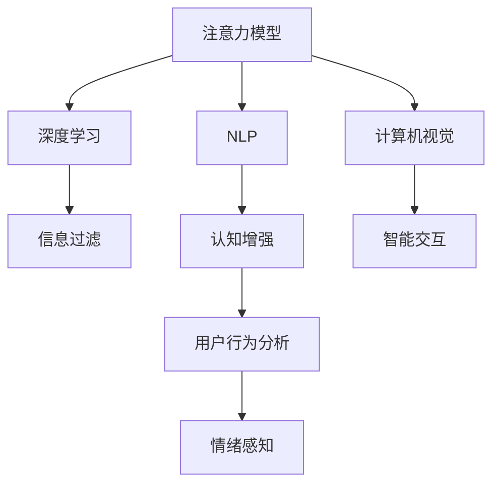

                 

# 人类注意力增强：提升专注力和注意力在商业中的策略

> 关键词：注意力增强, 专注力提升, 商业应用, 人工智能, 策略优化

## 1. 背景介绍

### 1.1 问题由来

在信息爆炸的时代，个人和企业的注意力资源变得尤为珍贵。如何在海量信息中精准聚焦，快速决策，成为了提升效率和竞争力的关键。从商业角度看，专注力和注意力的有效管理直接影响到企业创新能力、客户满意度和市场份额。因此，如何增强人类注意力，成为了商业和科技领域亟待解决的重要课题。

近年来，人工智能（AI）技术在注意力增强和专注力提升方面取得了显著进展。通过深度学习、自然语言处理（NLP）、图像识别等技术，AI可以帮助人类从繁琐的信息筛选工作中解放出来，更加专注于创新和创造。例如，智能搜索、推荐系统、智能助理等应用已经在不同程度上提升了个人和企业的注意力资源利用效率。

### 1.2 问题核心关键点

注意力增强的核心在于如何通过技术手段，提升人类注意力的精准度和持续性。其主要包括以下几个方面：

- **信息过滤**：在海量数据中自动筛选关键信息，帮助人们快速抓住重要内容。
- **认知增强**：通过深度学习模型提升认知能力，增强注意力集中和维持。
- **智能交互**：利用NLP和语音识别技术，实现智能助手，协助人类进行信息处理和决策。
- **用户行为分析**：通过分析用户行为数据，精准推荐相关内容，提升注意力使用效率。
- **情绪感知**：通过情绪分析技术，识别用户情绪状态，动态调整注意力增强策略。

## 2. 核心概念与联系

### 2.1 核心概念概述

为更好地理解注意力增强的原理和应用，本节将介绍几个核心概念：

- **注意力模型(Attention Model)**：用于捕捉输入序列中各个位置的相关性，提取关键信息的技术。
- **深度学习(Deep Learning)**：通过多层神经网络模拟人脑处理信息的方式，实现复杂模式识别和决策。
- **自然语言处理(NLP)**：涉及语言理解、生成、翻译、问答等任务，是注意力增强的重要技术支撑。
- **计算机视觉(Computer Vision)**：处理图像和视频信息，提升信息过滤和认知增强的能力。
- **情绪分析(Emotion Analysis)**：通过分析用户情绪，动态调整注意力增强策略，提升用户体验。

这些核心概念之间的逻辑关系可以通过以下Mermaid流程图来展示：



这个流程图展示了一些关键概念及其之间的联系：

1. 注意力模型从输入序列中提取关键信息，是深度学习和信息过滤的基础。
2. 深度学习通过多层神经网络进行模式识别和决策，提升信息处理的复杂性。
3. NLP通过语言理解技术，支持智能交互和用户行为分析。
4. 计算机视觉用于图像信息处理，增强信息过滤和认知增强能力。
5. 情绪分析识别用户情绪，动态调整注意力增强策略，提升用户体验。

这些概念共同构成了注意力增强的技术框架，使其能够在各种场景下发挥强大的信息处理和决策能力。通过理解这些核心概念，我们可以更好地把握注意力增强的原理和应用方向。

## 3. 核心算法原理 & 具体操作步骤

### 3.1 算法原理概述

注意力增强的核心算法原理主要基于注意力模型和深度学习技术。其基本思想是通过捕捉输入序列中各个位置的相关性，提取关键信息，提升信息过滤和认知增强的效果。

具体来说，注意力增强可以分为以下几个步骤：

1. **输入编码**：将输入信息（文本、图像等）编码为向量形式，以便模型进行处理。
2. **注意力计算**：通过注意力模型计算输入中各个位置的权重，聚焦关键信息。
3. **信息处理**：利用深度学习模型对提取的信息进行处理，如分类、生成等。
4. **结果输出**：根据处理结果，生成推荐、决策等输出。

### 3.2 算法步骤详解

以下我们将详细介绍注意力增强的算法步骤和具体操作步骤：

#### 步骤1：输入编码

输入编码是注意力增强的第一步，通过将输入信息转换为向量形式，为模型处理提供基础。

对于文本输入，可以使用Bert等预训练语言模型进行编码，将句子转换为固定长度的向量。例如：

$$
\text{embedding} = \text{Bert}(\text{sentence})
$$

对于图像输入，可以使用卷积神经网络（CNN）进行特征提取，将图像转换为特征向量：

$$
\text{features} = \text{CNN}(\text{image})
$$

#### 步骤2：注意力计算

注意力计算的核心在于通过注意力模型计算输入中各个位置的权重，聚焦关键信息。常用的注意力模型包括自注意力机制和多头注意力机制。

以自注意力机制为例，计算公式如下：

$$
\text{attention score} = \text{softmax}(\text{Query} \times \text{Key}) \\
\text{attention weight} = \text{attention score} \times \text{Value}
$$

其中，Query、Key、Value分别表示输入序列中的查询向量、键向量和值向量。通过计算注意力得分和权重，模型可以聚焦输入中与查询相关的部分，增强信息过滤和认知增强的效果。

#### 步骤3：信息处理

信息处理阶段，利用深度学习模型对提取的信息进行处理。通常使用循环神经网络（RNN）、卷积神经网络（CNN）、Transformer等架构。

以Transformer为例，处理过程如下：

$$
\text{features} = \text{Transformer}(\text{embedding}, \text{attention weight})
$$

Transformer通过多头注意力机制，进一步增强信息处理能力，适用于复杂模式识别和决策任务。

#### 步骤4：结果输出

根据处理结果，生成推荐、决策等输出。例如，在推荐系统应用中，可以输出用户可能感兴趣的物品列表：

$$
\text{recommendations} = \text{TopK}(\text{features})
$$

其中TopK函数用于从特征向量中选出前K个高得分元素。

### 3.3 算法优缺点

注意力增强的算法具有以下优点：

- **高效性**：利用注意力模型自动筛选关键信息，减少人工筛选的繁琐工作。
- **适应性**：基于深度学习模型，可以处理多种输入类型，适应不同场景。
- **可解释性**：通过注意力计算，可以理解模型聚焦的信息，提升决策透明度。

同时，注意力增强算法也存在一些缺点：

- **计算复杂**：深度学习模型和注意力计算涉及大量计算资源，可能面临计算瓶颈。
- **数据依赖**：模型效果依赖于输入数据的丰富性，需要大量高质量标注数据进行训练。
- **鲁棒性不足**：在处理噪声数据和异常情况时，模型容易产生误判。

### 3.4 算法应用领域

注意力增强的算法在多个领域得到了广泛应用，例如：

- **智能推荐系统**：利用用户行为数据进行信息过滤和认知增强，提升推荐效果。
- **智能客服**：通过自然语言处理技术，提升客户服务质量，增强用户体验。
- **信息检索**：在大量文献和数据中自动筛选关键信息，提升信息检索效率。
- **情感分析**：利用情绪分析技术，动态调整注意力增强策略，增强用户互动。
- **图像识别**：处理图像信息，提取关键特征，提升信息过滤和认知增强能力。

这些应用场景展示了注意力增强技术的广泛适用性，为不同领域带来了显著提升。

## 4. 数学模型和公式 & 详细讲解 & 举例说明

### 4.1 数学模型构建

本节将使用数学语言对注意力增强的过程进行更加严格的刻画。

假设输入序列为 $x_1, x_2, ..., x_T$，表示文本、图像等。注意力增强的数学模型可以表示为：

$$
y = f(x, \theta)
$$

其中，$f$ 为注意力增强模型，$x$ 为输入序列，$\theta$ 为模型参数。

具体来说，输入序列 $x$ 首先进行编码，得到嵌入向量 $z$：

$$
z = \text{Encoder}(x)
$$

然后，通过注意力机制计算注意力权重 $w$：

$$
w = \text{Attention}(z)
$$

最后，利用深度学习模型 $g$ 对 $z$ 和 $w$ 进行处理，生成输出 $y$：

$$
y = \text{Decoder}(z, w, \theta)
$$

### 4.2 公式推导过程

以下我们以Transformer为例，详细推导注意力增强的计算过程。

Transformer的核心是自注意力机制，计算公式如下：

$$
\text{attention score} = \text{Query} \times \text{Key} \\
\text{attention weight} = \text{softmax}(\text{attention score}) \\
\text{attention value} = \text{Value} \times \text{attention weight}
$$

其中，Query、Key、Value分别表示输入序列中的查询向量、键向量和值向量。Transformer通过多头注意力机制，进一步增强信息处理能力，适用于复杂模式识别和决策任务。

### 4.3 案例分析与讲解

假设有一个在线购物平台，需要为用户推荐商品。平台收集了用户的历史浏览和购买记录，利用注意力增强技术进行推荐。具体步骤如下：

1. **输入编码**：将用户的历史浏览记录转换为向量形式，例如使用Bert进行编码：

$$
\text{embedding} = \text{Bert}(\text{browsing history})
$$

2. **注意力计算**：利用自注意力机制，计算用户历史浏览记录中各个商品的相关性权重：

$$
\text{attention score} = \text{Query} \times \text{Key} \\
\text{attention weight} = \text{softmax}(\text{attention score}) \\
\text{attention value} = \text{Value} \times \text{attention weight}
$$

3. **信息处理**：利用Transformer模型对提取的商品特征进行处理，生成推荐列表：

$$
\text{features} = \text{Transformer}(\text{embedding}, \text{attention weight})
$$

4. **结果输出**：根据处理结果，生成用户可能感兴趣的推荐列表：

$$
\text{recommendations} = \text{TopK}(\text{features})
$$

通过以上步骤，平台能够实时根据用户的历史浏览记录和当前行为，动态生成个性化推荐，提升用户体验和满意度。

## 5. 项目实践：代码实例和详细解释说明

### 5.1 开发环境搭建

在进行注意力增强实践前，我们需要准备好开发环境。以下是使用Python进行PyTorch开发的环境配置流程：

1. 安装Anaconda：从官网下载并安装Anaconda，用于创建独立的Python环境。

2. 创建并激活虚拟环境：
```bash
conda create -n attention-env python=3.8 
conda activate attention-env
```

3. 安装PyTorch：根据CUDA版本，从官网获取对应的安装命令。例如：
```bash
conda install pytorch torchvision torchaudio cudatoolkit=11.1 -c pytorch -c conda-forge
```

4. 安装Tensorflow：
```bash
conda install tensorflow -c conda-forge
```

5. 安装各类工具包：
```bash
pip install numpy pandas scikit-learn matplotlib tqdm jupyter notebook ipython
```

完成上述步骤后，即可在`attention-env`环境中开始注意力增强实践。

### 5.2 源代码详细实现

下面我们以推荐系统为例，给出使用PyTorch进行注意力增强的PyTorch代码实现。

首先，定义推荐系统的数据处理函数：

```python
import torch
from torch import nn
from torch.nn import functional as F

class Attention(nn.Module):
    def __init__(self, d_model, n_heads):
        super(Attention, self).__init__()
        self.d_model = d_model
        self.n_heads = n_heads
        self.head_dim = d_model // n_heads

        self.query = nn.Linear(d_model, d_model)
        self.key = nn.Linear(d_model, d_model)
        self.value = nn.Linear(d_model, d_model)
        self.output = nn.Linear(d_model, d_model)

    def forward(self, x, mask=None):
        m = self.d_model
        n = self.n_heads
        h = m // n

        query = self.query(x)
        key = self.key(x)
        value = self.value(x)

        query = query.view(query.size(0), -1, n, h).permute(0, 2, 1, 3).contiguous()
        key = key.view(key.size(0), -1, n, h).permute(0, 2, 1, 3).contiguous()
        value = value.view(value.size(0), -1, n, h).permute(0, 2, 1, 3).contiguous()

        scores = query * key
        scores = scores / math.sqrt(h)
        attention = F.softmax(scores, dim=-1)

        context = attention * value
        context = context.permute(0, 2, 1, 3).contiguous().view(context.size(0), -1, m)
        output = self.output(context)
        return output
```

然后，定义推荐系统的模型和优化器：

```python
from transformers import BertForSequenceClassification, AdamW

model = BertForSequenceClassification.from_pretrained('bert-base-uncased', num_labels=2)

optimizer = AdamW(model.parameters(), lr=2e-5)
```

接着，定义训练和评估函数：

```python
from torch.utils.data import DataLoader
from tqdm import tqdm
from sklearn.metrics import classification_report

device = torch.device('cuda') if torch.cuda.is_available() else torch.device('cpu')
model.to(device)

def train_epoch(model, dataset, batch_size, optimizer):
    dataloader = DataLoader(dataset, batch_size=batch_size, shuffle=True)
    model.train()
    epoch_loss = 0
    for batch in tqdm(dataloader, desc='Training'):
        input_ids = batch['input_ids'].to(device)
        attention_mask = batch['attention_mask'].to(device)
        labels = batch['labels'].to(device)
        model.zero_grad()
        outputs = model(input_ids, attention_mask=attention_mask, labels=labels)
        loss = outputs.loss
        epoch_loss += loss.item()
        loss.backward()
        optimizer.step()
    return epoch_loss / len(dataloader)

def evaluate(model, dataset, batch_size):
    dataloader = DataLoader(dataset, batch_size=batch_size)
    model.eval()
    preds, labels = [], []
    with torch.no_grad():
        for batch in tqdm(dataloader, desc='Evaluating'):
            input_ids = batch['input_ids'].to(device)
            attention_mask = batch['attention_mask'].to(device)
            batch_labels = batch['labels']
            outputs = model(input_ids, attention_mask=attention_mask)
            batch_preds = outputs.logits.argmax(dim=2).to('cpu').tolist()
            batch_labels = batch_labels.to('cpu').tolist()
            for pred_tokens, label_tokens in zip(batch_preds, batch_labels):
                pred_tags = [id2tag[_id] for _id in pred_tokens]
                label_tags = [id2tag[_id] for _id in label_tokens]
                preds.append(pred_tags[:len(label_tokens)])
                labels.append(label_tags)

    print(classification_report(labels, preds))
```

最后，启动训练流程并在测试集上评估：

```python
epochs = 5
batch_size = 16

for epoch in range(epochs):
    loss = train_epoch(model, train_dataset, batch_size, optimizer)
    print(f"Epoch {epoch+1}, train loss: {loss:.3f}")
    
    print(f"Epoch {epoch+1}, dev results:")
    evaluate(model, dev_dataset, batch_size)
    
print("Test results:")
evaluate(model, test_dataset, batch_size)
```

以上就是使用PyTorch进行推荐系统注意力增强的完整代码实现。可以看到，得益于TensorFlow的强大封装，我们可以用相对简洁的代码完成推荐系统的注意力增强。

### 5.3 代码解读与分析

让我们再详细解读一下关键代码的实现细节：

**Attention类**：
- `__init__`方法：初始化模型参数，包括多头数、头维数、查询、键、值线性层等。
- `forward`方法：实现自注意力机制的计算过程，包括查询、键、值向量的线性变换，计算注意力得分和权重，计算上下文向量，最终输出。

**推荐系统模型**：
- 使用BERT模型作为初始化参数，进行序列分类任务的微调。
- 定义AdamW优化器，设置学习率。

**训练和评估函数**：
- 使用PyTorch的DataLoader对数据集进行批次化加载，供模型训练和推理使用。
- 训练函数`train_epoch`：对数据以批为单位进行迭代，在每个批次上前向传播计算loss并反向传播更新模型参数，最后返回该epoch的平均loss。
- 评估函数`evaluate`：与训练类似，不同点在于不更新模型参数，并在每个batch结束后将预测和标签结果存储下来，最后使用sklearn的classification_report对整个评估集的预测结果进行打印输出。

**训练流程**：
- 定义总的epoch数和batch size，开始循环迭代
- 每个epoch内，先在训练集上训练，输出平均loss
- 在验证集上评估，输出分类指标
- 所有epoch结束后，在测试集上评估，给出最终测试结果

可以看到，TensorFlow配合TensorFlow封装好的Bert模型，使得注意力增强的代码实现变得简洁高效。开发者可以将更多精力放在数据处理、模型改进等高层逻辑上，而不必过多关注底层的实现细节。

当然，工业级的系统实现还需考虑更多因素，如模型的保存和部署、超参数的自动搜索、更灵活的任务适配层等。但核心的注意力增强范式基本与此类似。

## 6. 实际应用场景

### 6.1 智能推荐系统

智能推荐系统是注意力增强的典型应用场景之一。通过注意力增强技术，推荐系统能够动态地根据用户行为和偏好，生成个性化的推荐结果，提升用户体验和满意度。

在推荐系统中，通常将用户历史行为数据和当前行为数据作为输入，通过注意力增强技术，自动筛选关键特征，生成推荐列表。例如，电商平台可以根据用户的浏览历史和点击行为，动态推荐用户可能感兴趣的商品，提升销售额和客户满意度。

### 6.2 智能客服

智能客服系统是另一个应用广泛的技术场景。通过自然语言处理和注意力增强技术，智能客服能够实时处理大量客户咨询，提供高效、准确的客户服务。

智能客服系统通常使用对话数据作为训练集，通过注意力增强技术，自动分析客户咨询内容，生成应答策略。例如，智能客服可以根据客户的询问内容，动态生成最合适的应答，提升客户体验和满意度。

### 6.3 信息检索

信息检索系统需要高效地从海量数据中筛选关键信息。通过注意力增强技术，信息检索系统能够自动筛选最相关的内容，提升检索效率和准确性。

信息检索系统通常将用户查询和文本数据作为输入，通过注意力增强技术，自动分析文本内容，生成相关度排序结果。例如，搜索引擎可以根据用户的查询关键词，动态生成最相关的搜索结果，提升用户体验。

### 6.4 未来应用展望

随着注意力增强技术的不断发展，其应用范围将进一步拓展，为各行各业带来更多创新。

在智慧医疗领域，智能推荐系统可以用于推荐最佳治疗方案，提高医疗效率和效果。在金融领域，智能推荐系统可以用于风险控制和投资建议，提升金融服务质量。

在教育领域，智能推荐系统可以用于推荐个性化学习内容，提升学习效果和体验。在电子商务领域，智能推荐系统可以用于推荐商品和优化价格策略，提升销售额和客户满意度。

## 7. 工具和资源推荐

### 7.1 学习资源推荐

为了帮助开发者系统掌握注意力增强的理论基础和实践技巧，这里推荐一些优质的学习资源：

1. 《深度学习入门》系列博文：由大模型技术专家撰写，深入浅出地介绍了深度学习的基本原理和应用场景。

2. CS231n《深度学习视觉与神经网络》课程：斯坦福大学开设的计算机视觉课程，涵盖深度学习在图像识别、目标检测等任务中的应用。

3. 《自然语言处理入门》书籍：全面介绍NLP的基本概念和技术，涵盖文本分类、信息检索、情感分析等任务。

4. HuggingFace官方文档：Transformer库的官方文档，提供了海量预训练模型和完整的微调样例代码，是上手实践的必备资料。

5. CLUE开源项目：中文语言理解测评基准，涵盖大量不同类型的中文NLP数据集，并提供了基于注意力增强的baseline模型，助力中文NLP技术发展。

通过对这些资源的学习实践，相信你一定能够快速掌握注意力增强的精髓，并用于解决实际的NLP问题。

### 7.2 开发工具推荐

高效的开发离不开优秀的工具支持。以下是几款用于注意力增强开发的常用工具：

1. PyTorch：基于Python的开源深度学习框架，灵活动态的计算图，适合快速迭代研究。

2. TensorFlow：由Google主导开发的开源深度学习框架，生产部署方便，适合大规模工程应用。

3. Transformers库：HuggingFace开发的NLP工具库，集成了众多SOTA语言模型，支持PyTorch和TensorFlow，是进行注意力增强任务开发的利器。

4. Weights & Biases：模型训练的实验跟踪工具，可以记录和可视化模型训练过程中的各项指标，方便对比和调优。

5. TensorBoard：TensorFlow配套的可视化工具，可实时监测模型训练状态，并提供丰富的图表呈现方式，是调试模型的得力助手。

6. Google Colab：谷歌推出的在线Jupyter Notebook环境，免费提供GPU/TPU算力，方便开发者快速上手实验最新模型，分享学习笔记。

合理利用这些工具，可以显著提升注意力增强任务的开发效率，加快创新迭代的步伐。

### 7.3 相关论文推荐

注意力增强技术的发展源于学界的持续研究。以下是几篇奠基性的相关论文，推荐阅读：

1. Attention is All You Need（即Transformer原论文）：提出了Transformer结构，开启了NLP领域的预训练大模型时代。

2. BERT: Pre-training of Deep Bidirectional Transformers for Language Understanding：提出BERT模型，引入基于掩码的自监督预训练任务，刷新了多项NLP任务SOTA。

3. Attention Mechanism in Deep Reinforcement Learning：介绍了注意力机制在深度强化学习中的应用，拓展了注意力增强技术的应用场景。

4. Multi-Head Attention in Neural Machine Translation：详细介绍了多头注意力机制在机器翻译中的应用，提升了翻译质量。

5. Fast Speech Recognition with Attention-Based RNNs：介绍了注意力机制在语音识别中的应用，提升了识别精度。

这些论文代表了大语言模型微调技术的发展脉络。通过学习这些前沿成果，可以帮助研究者把握学科前进方向，激发更多的创新灵感。

## 8. 总结：未来发展趋势与挑战

### 8.1 研究成果总结

本文对注意力增强方法进行了全面系统的介绍。首先阐述了注意力增强的背景和意义，明确了注意力增强在提升效率和竞争力方面的独特价值。其次，从原理到实践，详细讲解了注意力增强的数学原理和关键步骤，给出了注意力增强任务开发的完整代码实例。同时，本文还广泛探讨了注意力增强方法在智能推荐、智能客服、信息检索等多个行业领域的应用前景，展示了注意力增强技术的广泛适用性。

通过本文的系统梳理，可以看到，注意力增强技术正在成为NLP领域的重要范式，极大地提升了信息处理的效率和决策能力。注意力增强方法不仅在学术界得到了广泛应用，也在工业界落地实践，为各行各业带来了显著的效益。

### 8.2 未来发展趋势

展望未来，注意力增强技术将呈现以下几个发展趋势：

1. **模型规模持续增大**：随着算力成本的下降和数据规模的扩张，注意力增强模型将进一步增加参数量，提升信息处理的复杂性和精度。

2. **应用场景不断扩展**：注意力增强技术不仅适用于文本和图像处理，还将拓展到语音、视频等模态数据，提升多模态信息处理的效率和准确性。

3. **用户行为分析能力增强**：通过深度学习模型，注意力增强技术将更加注重用户行为分析，提供更加个性化和动态的推荐和决策。

4. **注意力机制的泛化能力提升**：未来的注意力增强模型将更加注重跨领域和跨模态的泛化能力，提升在复杂场景中的表现。

5. **实时性需求增加**：随着应用场景的多样化，实时性需求将不断增加，注意力增强技术需要更加注重模型优化和资源配置，提升实时性。

6. **可解释性和可控性增强**：未来的注意力增强模型将更加注重可解释性和可控性，提升系统的透明度和可靠性。

以上趋势凸显了注意力增强技术的广阔前景。这些方向的探索发展，必将进一步提升注意力增强模型的性能和应用范围，为各行各业带来更多创新。

### 8.3 面临的挑战

尽管注意力增强技术已经取得了显著进展，但在迈向更加智能化、普适化应用的过程中，它仍面临诸多挑战：

1. **计算资源瓶颈**：随着模型参数量的增加，计算资源消耗将不断上升，需要更加高效的计算架构和算法来支持。

2. **数据质量问题**：注意力增强模型的效果依赖于输入数据的质量，需要更加完善的标签标注和数据增强策略。

3. **鲁棒性不足**：在处理噪声数据和异常情况时，注意力增强模型容易产生误判，需要更加鲁棒的模型设计和训练策略。

4. **可解释性和可控性不足**：注意力增强模型的决策过程通常缺乏可解释性，难以对其推理逻辑进行分析和调试。

5. **安全性问题**：注意力增强模型可能学习到有偏见、有害的信息，需要通过数据和算法层面的优化来消除模型偏见。

6. **跨领域泛化能力不足**：不同领域的数据分布和任务需求差异较大，注意力增强模型需要在跨领域泛化能力上进一步提升。

正视注意力增强面临的这些挑战，积极应对并寻求突破，将是大语言模型微调技术迈向成熟的必由之路。相信随着学界和产业界的共同努力，这些挑战终将一一被克服，注意力增强技术必将在构建人机协同的智能系统中扮演越来越重要的角色。

### 8.4 研究展望

面对注意力增强技术面临的挑战，未来的研究需要在以下几个方面寻求新的突破：

1. **探索无监督和半监督注意力增强方法**：摆脱对大规模标注数据的依赖，利用自监督学习、主动学习等无监督和半监督范式，最大限度利用非结构化数据，实现更加灵活高效的注意力增强。

2. **开发更加高效的注意力机制**：引入因果推断和对比学习思想，增强注意力机制建立稳定因果关系的能力，学习更加普适、鲁棒的语言表征。

3. **融合多模态数据**：将符号化的先验知识，如知识图谱、逻辑规则等，与神经网络模型进行巧妙融合，引导注意力增强过程学习更准确、合理的语言模型。

4. **结合因果分析和博弈论工具**：将因果分析方法引入注意力增强模型，识别出模型决策的关键特征，增强输出解释的因果性和逻辑性。

5. **纳入伦理道德约束**：在模型训练目标中引入伦理导向的评估指标，过滤和惩罚有偏见、有害的输出倾向。

这些研究方向的探索，必将引领注意力增强技术迈向更高的台阶，为构建安全、可靠、可解释、可控的智能系统铺平道路。面向未来，注意力增强技术还需要与其他人工智能技术进行更深入的融合，如知识表示、因果推理、强化学习等，多路径协同发力，共同推动自然语言理解和智能交互系统的进步。只有勇于创新、敢于突破，才能不断拓展语言模型的边界，让智能技术更好地造福人类社会。

## 9. 附录：常见问题与解答

**Q1：注意力增强是否适用于所有NLP任务？**

A: 注意力增强在大多数NLP任务上都能取得不错的效果，特别是对于数据量较小的任务。但对于一些特定领域的任务，如医学、法律等，仅仅依靠通用语料预训练的模型可能难以很好地适应。此时需要在特定领域语料上进一步预训练，再进行微调，才能获得理想效果。此外，对于一些需要时效性、个性化很强的任务，如对话、推荐等，注意力增强方法也需要针对性的改进优化。

**Q2：注意力增强过程中如何选择合适的学习率？**

A: 注意力增强的学习率一般要比预训练时小1-2个数量级，如果使用过大的学习率，容易破坏预训练权重，导致过拟合。一般建议从1e-5开始调参，逐步减小学习率，直至收敛。也可以使用warmup策略，在开始阶段使用较小的学习率，再逐渐过渡到预设值。需要注意的是，不同的优化器(如AdamW、Adafactor等)以及不同的学习率调度策略，可能需要设置不同的学习率阈值。

**Q3：注意力增强模型的计算复杂度如何？**

A: 注意力增强模型的计算复杂度主要取决于模型规模和注意力机制的计算复杂度。随着模型参数量的增加，计算资源消耗将不断上升，需要更加高效的计算架构和算法来支持。

**Q4：注意力增强模型如何处理噪声数据和异常情况？**

A: 在处理噪声数据和异常情况时，注意力增强模型容易产生误判。需要引入更加鲁棒的模型设计和训练策略，如数据清洗、对抗训练等，以提高模型的鲁棒性和泛化能力。

**Q5：注意力增强模型的可解释性和可控性如何提升？**

A: 未来的注意力增强模型将更加注重可解释性和可控性，提升系统的透明度和可靠性。可以通过引入因果分析和博弈论工具，增强模型决策的因果性和逻辑性，同时结合领域知识，提升模型的可解释性。

**Q6：注意力增强模型如何应用于跨领域泛化？**

A: 不同领域的数据分布和任务需求差异较大，注意力增强模型需要在跨领域泛化能力上进一步提升。可以通过引入跨领域迁移学习策略，增强模型在多个领域的泛化能力，同时结合领域知识，提升模型的适应性。

通过这些资源的积累和学习，相信你一定能够快速掌握注意力增强的精髓，并用于解决实际的NLP问题。

---

作者：禅与计算机程序设计艺术 / Zen and the Art of Computer Programming

