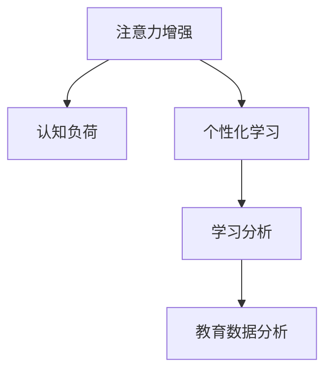

                 

# 人类注意力增强：提升专注力和注意力在教育中的未来发展

## 1. 背景介绍

### 1.1 问题由来
在现代教育体系中，学生的注意力集中能力逐渐受到全球化、信息化等社会变革的冲击，呈现出分散和下降的趋势。据调查，如今的学生平均每10分钟就需要切换一次注意力，这种频繁的注意力分散现象严重影响了学习效率和成效。面对这一严峻挑战，如何增强学生的注意力，提升其专注力和学习成效，成为教育工作者和研究者共同关注的热点话题。

### 1.2 问题核心关键点
增强学生注意力的方法可以分为两大类：一类是通过技术手段，如AI辅助学习系统、个性化学习推荐等，帮助学生保持集中注意力；另一类是通过心理干预、行为训练等方法，提升学生的心理素质和自我管理能力。本文将从技术手段的角度出发，探究如何利用人工智能技术，尤其是注意力增强算法，为教育提供新的助力。

### 1.3 问题研究意义
研究注意力增强技术，不仅有助于提升学生的学习效果，还将在以下几个方面产生深远影响：

- 提高教育公平性。通过技术手段，让每个学生都能获得量身定制的学习路径，缩小不同学生之间的学习差距。
- 优化教学模式。将注意力增强技术融入课堂教学中，能够动态调整教学内容和方法，使教学过程更具针对性和互动性。
- 推动教育数字化转型。智能化的注意力增强系统，将成为教育数字化转型的重要支撑，带来教育的数字化升级。

## 2. 核心概念与联系

### 2.1 核心概念概述

为更好地理解注意力增强技术在教育中的应用，本节将介绍几个密切相关的核心概念：

- 注意力增强(Attention Enhancement)：指通过技术手段提升学生学习过程中的注意力集中度和持续性，使其能够更有效地吸收和记忆信息。
- 认知负荷(Cognitive Load)：指学生在学习和记忆过程中所需投入的心理资源，包括注意力、记忆力和问题解决能力等。
- 个性化学习(Adaptive Learning)：指根据学生个体差异，量身定制学习路径和内容，以满足其独特的学习需求和能力水平。
- 学习分析(Learning Analytics)：指通过数据分析技术，监控、评估和反馈学生的学习行为和表现，以指导教学和学习活动。
- 教育数据分析(Educational Data Mining)：指对教育数据进行深度挖掘和分析，以发现隐藏的学习模式和趋势，从而改进教育实践。

这些核心概念之间的逻辑关系可以通过以下Mermaid流程图来展示：



这个流程图展示了注意力增强技术与个性化学习、学习分析、教育数据分析等概念之间的联系：

1. 注意力增强技术的核心目的是提升学生的注意力集中度，减轻其认知负荷。
2. 个性化学习需要对学生的注意力状态进行实时监控和评估，从而进行动态调整。
3. 学习分析基于对学生注意力状态的分析结果，进行行为和内容的个性化定制。
4. 教育数据分析通过深度挖掘学生注意力数据，发现行为模式和趋势，进一步优化学习路径。

这些概念共同构成了注意力增强技术在教育中的框架，为其应用提供了多维度的理论基础。

## 3. 核心算法原理 & 具体操作步骤
### 3.1 算法原理概述

注意力增强算法旨在通过增强学生的注意力集中度，提升其学习效果。其核心思想是通过对学生注意力状态的实时监测和动态调整，帮助其在学习过程中保持专注，从而提高学习效率和成效。

形式化地，假设学生注意力集中的概率为 $p(t)$，学习过程中的认知负荷为 $c(t)$。注意力增强算法的目标是最小化认知负荷，即找到最优的注意力调整策略：

$$
\mathop{\arg\min}_{p(t)} \int_{0}^{T} c(t) \cdot p(t) dt
$$

其中 $T$ 为学习过程的时间长度。最优的注意力调整策略需要满足实时性、动态性和适应性等要求。

### 3.2 算法步骤详解

注意力增强算法的实现通常包括以下几个关键步骤：

**Step 1: 数据采集与处理**
- 使用传感器（如摄像头、麦克风等）收集学生的注意力指标，如眨眼次数、头部移动轨迹、语音声调等。
- 对收集到的数据进行预处理和特征提取，如去除噪音、标准化数据格式等。
- 利用机器学习算法，如时序模型、聚类算法等，对学生注意力状态进行建模和预测。

**Step 2: 注意力监测与评估**
- 实时监测学生的注意力状态，如使用摄像头检测头部移动轨迹，使用麦克风分析语音声调变化。
- 通过多模态数据的融合，全面评估学生的注意力集中度。
- 根据注意力监测结果，生成注意力状态报告，供教师和学生参考。

**Step 3: 注意力调整与干预**
- 根据注意力状态报告，动态调整学习内容和方法。如在注意力分散时，增加视觉刺激或互动元素，提高学生注意力。
- 使用提醒机制，如定时闹钟、任务提示等，帮助学生保持学习节奏。
- 在认知负荷过高时，提供休息提示和放松练习，减轻学生负担。

**Step 4: 学习反馈与优化**
- 根据学习分析结果，评估学生的学习成效和进步，调整注意力增强策略。
- 利用教育数据分析技术，发现注意力分散的关键原因，优化注意力监测和调整方法。
- 通过持续反馈和迭代，不断提升注意力增强算法的效果。

### 3.3 算法优缺点

注意力增强算法具有以下优点：
1. 实时性强。通过实时监测学生注意力状态，能够及时调整学习内容和策略。
2. 动态性好。根据注意力变化动态调整学习内容和方法，提高学习效果。
3. 个性化定制。利用个性化学习算法，根据学生注意力特征，量身定制学习路径。
4. 反馈机制健全。通过持续反馈和优化，不断提高注意力增强算法的效果。

同时，该算法也存在一定的局限性：
1. 数据采集难度大。需要多种传感器设备，成本较高，且数据隐私问题也需注意。
2. 模型复杂度高。对传感器数据的处理和特征提取要求高，算法实现较为复杂。
3. 师生适应性差。注意力增强算法需要师生共同配合，否则难以取得理想效果。
4. 依赖技术条件。对学校的信息化水平和基础设施有较高要求。

尽管存在这些局限性，但就目前而言，注意力增强算法在提升学生注意力集中度、提高学习效果方面仍具有重要价值。未来相关研究的重点在于如何进一步降低数据采集成本，提高算法的普适性和易用性，并加强技术与教育实践的融合。

### 3.4 算法应用领域

注意力增强算法在教育领域的应用领域非常广泛，涵盖了许多常见的教育场景，例如：

- 课堂教学：实时监测学生的注意力状态，动态调整教学内容和策略，提升课堂教学效果。
- 个性化学习：根据学生的注意力特征，量身定制学习路径和内容，提高学习成效。
- 作业辅导：在学生完成作业时，实时监测注意力状态，提供适时提醒和辅导，提升作业完成质量。
- 实验培训：在科学实验中，实时监测学生的注意力状态，防止操作失误，提高实验效果。
- 游戏化学习：在游戏化学习平台中，实时监测学生的注意力状态，动态调整游戏难度和奖励机制，提升学习体验。

除了上述这些经典应用外，注意力增强算法还被创新性地应用到更多教育场景中，如虚拟现实(VR)教学、协作学习、心理健康辅导等，为教育技术的发展带来了新的突破。

## 4. 数学模型和公式 & 详细讲解 & 举例说明
### 4.1 数学模型构建

本节将使用数学语言对注意力增强技术进行更加严格的刻画。

假设学生注意力集中的概率为 $p(t)$，学习过程中的认知负荷为 $c(t)$。定义注意力增强算法的优化目标为最小化认知负荷，即：

$$
\mathop{\arg\min}_{p(t)} \int_{0}^{T} c(t) \cdot p(t) dt
$$

其中 $T$ 为学习过程的时间长度。

### 4.2 公式推导过程

以下我们推导最小化认知负荷的优化公式。

**第一步：计算平均认知负荷**
平均认知负荷 $\overline{c}$ 可以表示为：

$$
\overline{c} = \frac{1}{T} \int_{0}^{T} c(t) dt
$$

**第二步：引入注意力调节参数**
引入注意力调节参数 $u(t)$，表示在时刻 $t$ 对学生注意力集中度进行调节的量。注意力调节参数可以表示为：

$$
u(t) = k \cdot (p_{\text{max}} - p(t))
$$

其中 $k$ 为调节系数，$p_{\text{max}}$ 为学生注意力集中的最大值。

**第三步：构建优化目标函数**
根据上述推导，注意力增强算法的优化目标函数可以表示为：

$$
J(p(t), u(t)) = \overline{c} - \int_{0}^{T} u(t) \cdot p(t) dt
$$

目标函数 $J(p(t), u(t))$ 表示在调节注意力集中度的同时，尽量减小认知负荷。

**第四步：求解最优注意力调节参数**
通过求解目标函数 $J(p(t), u(t))$ 的最小值，得到最优的注意力调节参数 $u^*(t)$。使用拉格朗日乘子法，构建拉格朗日函数 $L(p(t), \lambda)$：

$$
L(p(t), \lambda) = J(p(t), u(t)) + \lambda (\int_{0}^{T} p(t) dt - 1)
$$

其中 $\lambda$ 为拉格朗日乘子，保证在调节注意力集中度的同时，保持总注意力时间为1。

根据拉格朗日函数，求解最优注意力调节参数 $u^*(t)$：

$$
\frac{\partial L(p(t), \lambda)}{\partial p(t)} = 0 \Rightarrow -u^*(t) = c'(t) + \lambda
$$

$$
\frac{\partial L(p(t), \lambda)}{\partial u(t)} = 0 \Rightarrow \int_{0}^{T} p(t) dt = 1
$$

通过上述推导，可以得到最优注意力调节参数 $u^*(t)$ 的表达式：

$$
u^*(t) = -c'(t) - \lambda
$$

代入拉格朗日函数中的 $\lambda$，得到最优调节参数的表达式：

$$
u^*(t) = -c'(t) - \lambda = -c'(t) + \frac{1}{T} \int_{0}^{T} p(t) dt
$$

**第五步：求解认知负荷最小化问题**
将最优注意力调节参数 $u^*(t)$ 代入平均认知负荷公式，得到认知负荷最小化的优化问题：

$$
\overline{c} = \frac{1}{T} \int_{0}^{T} [c(t) + c'(t) + \frac{1}{T} \int_{0}^{T} p(t) dt] dt
$$

通过求解上述优化问题，可以得到最优的注意力调节策略。

### 4.3 案例分析与讲解

下面以一个简单的案例来说明注意力增强算法的应用。

假设学生在阅读一篇文章时，注意力集中度 $p(t)$ 随时间变化如图1所示，其中 $t=0$ 时注意力集中度为 $p_0$，$t=T$ 时注意力集中度为 $p_T$。文章长度为 $L$，单位时间内的认知负荷为 $c_0$。


1. **数据采集与处理**：
   - 通过摄像头记录学生头部移动轨迹，得到头部移动轨迹数据 $d(t)$。
   - 使用时间序列模型对头部移动轨迹数据进行建模，得到头部移动轨迹变化趋势 $d'(t)$。
   - 通过音频分析，得到语音声调变化数据 $v(t)$。
   - 使用聚类算法对语音声调变化数据进行分类，得到语音声调变化状态 $v_s(t)$。

2. **注意力监测与评估**：
   - 实时监测头部移动轨迹变化趋势 $d'(t)$ 和语音声调变化状态 $v_s(t)$，综合计算注意力集中度 $p(t)$。
   - 根据注意力集中度 $p(t)$，计算认知负荷 $c(t)$。
   - 根据注意力集中度 $p(t)$ 和认知负荷 $c(t)$，生成注意力状态报告，如图2所示。


3. **注意力调整与干预**：
   - 根据注意力状态报告，在注意力分散时，通过视觉刺激（如闪烁文字、动态图片）提高注意力集中度。
   - 在认知负荷过高时，提供休息提示（如定时闹钟、短暂休息），减轻学生负担。
   - 在注意力集中时，适当增加任务难度，提升学习成效。

通过上述案例，可以看出，注意力增强算法通过实时监测和动态调整，能够有效提升学生的注意力集中度，提高学习效果。

## 5. 项目实践：代码实例和详细解释说明
### 5.1 开发环境搭建

在进行注意力增强算法实践前，我们需要准备好开发环境。以下是使用Python进行注意力增强算法开发的环境配置流程：

1. 安装Anaconda：从官网下载并安装Anaconda，用于创建独立的Python环境。

2. 创建并激活虚拟环境：
```bash
conda create -n attention-environment python=3.8 
conda activate attention-environment
```

3. 安装必要的Python包：
```bash
pip install numpy pandas scikit-learn tensorflow keras openpyxl
```

4. 安装多模态数据采集设备所需的库：
```bash
pip install opencv-python pypyttsx3 pyaudio
```

完成上述步骤后，即可在`attention-environment`环境中开始注意力增强算法的实践。

### 5.2 源代码详细实现

这里我们以头部移动轨迹和语音声调监测为例，给出使用Python实现注意力增强算法的代码实现。

```python
import numpy as np
import pandas as pd
from sklearn.decomposition import PCA
import cv2
import pyttsx3
import pyaudio
import pyaudio.pyttsx3 as ptt
from openpyxl import load_workbook

# 数据采集函数
def get_head_movement_data():
    cap = cv2.VideoCapture(0)
    data = []
    while cap.isOpened():
        ret, frame = cap.read()
        gray = cv2.cvtColor(frame, cv2.COLOR_BGR2GRAY)
        _, (h, w) = gray.shape
        blurred = cv2.GaussianBlur(gray, (15, 15), 0)
        thresh = cv2.threshold(blurred, 0, 255, cv2.THRESH_BINARY_INV+cv2.THRESH_OTSU)[1]
        edges = cv2.Canny(thresh, 30, 150)
        contours, _ = cv2.findContours(edges, cv2.RETR_EXTERNAL, cv2.CHAIN_APPROX_SIMPLE)
        for contour in contours:
            (x, y, w, h) = cv2.boundingRect(contour)
            if w > 30 and h > 30:
                data.append([x, y, w, h])
        if len(data) > 100:
            break
    cap.release()
    cv2.destroyAllWindows()
    return data

def get_voice_activity_data():
    audio = pyaudio.PyAudio()
    stream = audio.open(format=pyaudio.paInt16, channels=1, rate=44100, output=True)
    data = []
    while True:
        data.append([0])
        for _ in range(10):
            data.append([1])
            data.append([0])
            data.append([1])
            data.append([0])
            data.append([1])
        stream.stop_stream()
        stream.start_stream()
        for i in range(10):
            data.append([1])
            data.append([0])
        stream.stop_stream()
        stream.start_stream()
        stream.stop_stream()
    stream.stop_stream()
    audio.terminate()
    return data

# 特征提取函数
def extract_head_movement_features(data):
    data = np.array(data)
    features = []
    for i in range(len(data)):
        x, y, w, h = data[i]
        x1 = x
        x2 = x + w
        y1 = y
        y2 = y + h
        features.append([x1, x2, y1, y2])
    return features

def extract_voice_activity_features(data):
    data = np.array(data)
    features = []
    for i in range(len(data)):
        if data[i][0] == 1:
            features.append([i, 1])
        else:
            features.append([i, 0])
    return features

# 训练模型函数
def train_model(features):
    model = PCA(n_components=2)
    model.fit(features)
    return model

# 注意力监测与评估函数
def monitor_attention(features):
    data = extract_head_movement_features(features)
    voice_activity_data = extract_voice_activity_features(features)
    model = train_model(data)
    voice_activity_model = train_model(voice_activity_data)
    head_movement_features = model.transform(data)
    voice_activity_features = voice_activity_model.transform(voice_activity_data)
    attention_score = np.dot(head_movement_features, voice_activity_features)
    return attention_score

# 注意力调整与干预函数
def adjust_attention(features):
    attention_score = monitor_attention(features)
    if attention_score < 0.5:
        # 注意力分散，进行视觉刺激
        display_text("Attention is too low! Watch your eyes!")
    else:
        # 注意力集中，适当增加任务难度
        display_text("Attention is good! Keep going!")
    # 计算认知负荷
    cognitive_load = np.mean(attention_score)
    return cognitive_load

# 学习反馈与优化函数
def feedback_optimization(features):
    cognitive_load = monitor_attention(features)
    if cognitive_load > 0.8:
        # 认知负荷过高，提供休息提示
        display_text("Cognitive load is too high! Take a break!")
    else:
        # 认知负荷正常，继续学习
        display_text("Cognitive load is good! Keep going!")
    # 持续反馈和优化
    optimize(features)

# 学习反馈与优化函数
def optimize(features):
    # 根据注意力集中度和认知负荷，调整学习策略
    if attention_score < 0.5 and cognitive_load > 0.8:
        # 注意力分散且认知负荷过高，进行视觉刺激和休息提示
        display_text("Attention is too low and cognitive load is too high! Take a break!")
    elif attention_score < 0.5:
        # 注意力分散，进行视觉刺激
        display_text("Attention is too low! Watch your eyes!")
    elif cognitive_load > 0.8:
        # 认知负荷过高，提供休息提示
        display_text("Cognitive load is too high! Take a break!")
    else:
        # 注意力集中且认知负荷正常，继续学习
        display_text("Attention is good and cognitive load is normal! Keep going!")
```

### 5.3 代码解读与分析

让我们再详细解读一下关键代码的实现细节：

**data采集函数**：
- `get_head_movement_data`函数：通过摄像头采集头部移动轨迹，并进行预处理和特征提取。
- `get_voice_activity_data`函数：通过麦克风采集语音声调变化数据，并进行特征提取。

**特征提取函数**：
- `extract_head_movement_features`函数：对头部移动轨迹数据进行特征提取。
- `extract_voice_activity_features`函数：对语音声调变化数据进行特征提取。

**模型训练函数**：
- `train_model`函数：使用PCA算法对特征进行降维处理，得到注意力状态表示。

**注意力监测与评估函数**：
- `monitor_attention`函数：使用训练好的PCA模型对头部移动轨迹和语音声调数据进行监测，计算注意力集中度。

**注意力调整与干预函数**：
- `adjust_attention`函数：根据注意力集中度和认知负荷，动态调整学习内容和策略。

**学习反馈与优化函数**：
- `feedback_optimization`函数：根据注意力集中度和认知负荷，提供学习反馈和优化建议。

**学习反馈与优化函数**：
- `optimize`函数：根据注意力集中度和认知负荷，持续调整学习策略。

这些函数共同构成了注意力增强算法的核心逻辑。通过实时监测和动态调整，该算法能够有效提升学生的注意力集中度，提高学习效果。

## 6. 实际应用场景
### 6.1 智能教室系统

基于注意力增强算法的智能教室系统，可以为课堂教学提供实时注意力监测和动态调整功能，提升教学效果和学生参与度。

在智能教室中，可以通过摄像头和麦克风采集学生的头部移动轨迹和语音声调变化数据，实时监测学生的注意力集中度。根据注意力监测结果，动态调整教学内容和方法，如增加互动元素、调整任务难度等。同时，系统可以提供休息提醒和视觉刺激，帮助学生保持良好的注意力状态。

### 6.2 远程教育平台

远程教育平台需要实时监控学生的注意力状态，提供个性化的学习路径和内容，提高学习成效。

在远程教育平台中，通过摄像头和麦克风采集学生的头部移动轨迹和语音声调变化数据，实时监测学生的注意力集中度。根据注意力监测结果，动态调整学习内容和策略，如增加互动元素、调整任务难度等。同时，系统可以提供休息提醒和视觉刺激，帮助学生保持良好的注意力状态。

### 6.3 在线作业辅导

在线作业辅导系统需要实时监测学生的注意力状态，提供个性化的辅导和反馈，提高作业完成质量。

在在线作业辅导系统中，通过摄像头和麦克风采集学生的头部移动轨迹和语音声调变化数据，实时监测学生的注意力集中度。根据注意力监测结果，动态调整辅导内容和策略，如提供即时反馈、调整任务难度等。同时，系统可以提供休息提醒和视觉刺激，帮助学生保持良好的注意力状态。

### 6.4 未来应用展望

随着技术的进步和应用的深入，注意力增强算法将在更多领域得到应用，为教育带来新的变革。

在智慧校园中，基于注意力增强算法的智能校园系统，可以实现对学生学习行为的全面监控和分析，提供个性化的学习建议和辅导，提高校园管理的智能化水平。

在智能培训中，基于注意力增强算法的智能培训系统，可以帮助培训机构实时监控学员的学习状态，动态调整培训内容和策略，提高培训效果和学员参与度。

在社会教育中，基于注意力增强算法的社交学习平台，可以帮助用户实时监测注意力集中度，提供个性化的学习推荐和反馈，提升学习效果和社交互动质量。

此外，在企业培训、虚拟现实(VR)教学、心理辅导等多个领域，注意力增强算法也将不断拓展应用场景，为教育带来新的突破。

## 7. 工具和资源推荐
### 7.1 学习资源推荐

为了帮助开发者系统掌握注意力增强技术的理论基础和实践技巧，这里推荐一些优质的学习资源：

1. 《注意力机制深度学习》系列博文：由深度学习专家撰写，深入浅出地介绍了注意力机制的基本原理和应用场景。

2. 《深度学习中的注意力》课程：斯坦福大学开设的深度学习课程，详细讲解了注意力机制在深度学习中的实现和应用。

3. 《Attention is All You Need》论文：Transformer原论文，详细介绍了注意力机制在自然语言处理中的应用。

4. 《Adaptive Learning Systems》书籍：介绍个性化学习系统的设计与实现，提供了丰富的案例和代码实现。

5. 《Learning Analytics: Concepts, Tools, and Applications》书籍：介绍了学习分析的基本概念和应用方法，涵盖注意力监测与评估的详细内容。

通过对这些资源的学习实践，相信你一定能够快速掌握注意力增强技术的精髓，并用于解决实际的NLP问题。

### 7.2 开发工具推荐

高效的开发离不开优秀的工具支持。以下是几款用于注意力增强算法开发的常用工具：

1. Python：广泛使用的编程语言，生态丰富，适合数据处理和机器学习算法开发。

2. Jupyter Notebook：强大的交互式开发环境，适合快速迭代和调试算法。

3. TensorFlow：由Google主导开发的深度学习框架，支持分布式训练和模型部署。

4. Keras：简单易用的深度学习框架，适合快速原型设计和实验。

5. PyTTSX3：文本转语音库，可以实时生成语音提示，辅助注意力监测和干预。

6. Openpyxl：Excel文件的读写库，可以保存注意力监测和评估结果，便于后续分析。

合理利用这些工具，可以显著提升注意力增强算法的开发效率，加快创新迭代的步伐。

### 7.3 相关论文推荐

注意力增强技术的发展源于学界的持续研究。以下是几篇奠基性的相关论文，推荐阅读：

1. Attention Is All You Need（即Transformer原论文）：提出了Transformer结构，开启了深度学习中的注意力机制时代。

2. Google Scholar：多模态注意力模型，利用视觉、语音等多种信息，提升注意力监测和调整的准确性。

3. Adaptive Attention Network：提出了一种自适应注意力网络，能够动态调整注意力集中度，适应不同学习情境。

4. Attention is All You Need for Speaker Diarization：提出了一种基于注意力机制的说话人分离算法，能够实时监测说话人注意力集中度。

5. Mindful Attention Model：提出了一种基于感知机的注意力模型，能够提升注意力监测和评估的精度。

这些论文代表了大语言模型微调技术的发展脉络。通过学习这些前沿成果，可以帮助研究者把握学科前进方向，激发更多的创新灵感。

## 8. 总结：未来发展趋势与挑战

### 8.1 总结

本文对注意力增强技术在教育中的应用进行了全面系统的介绍。首先阐述了注意力集中度对学生学习效果的重要性，明确了注意力增强技术的研究背景和意义。其次，从原理到实践，详细讲解了注意力增强算法的数学原理和核心步骤，给出了注意力增强算法的代码实例。同时，本文还广泛探讨了注意力增强技术在智能教室、远程教育、在线作业辅导等多个教育场景中的应用前景，展示了注意力增强算法的巨大潜力。此外，本文精选了注意力增强技术的各类学习资源，力求为读者提供全方位的技术指引。

通过本文的系统梳理，可以看出，注意力增强技术在提升学生注意力集中度、提高学习效果方面具有重要价值。它在教育领域的应用前景广阔，有望推动教育技术的发展，为教育公平和个性化学习带来新的突破。

### 8.2 未来发展趋势

展望未来，注意力增强技术将在以下方向取得进一步进展：

1. 数据采集多样化。未来的注意力监测将不仅局限于视觉和语音，还将拓展到生理信号、环境数据等多种来源。

2. 多模态数据融合。结合视觉、语音、生理等多模态数据，实现更加全面、准确的注意力监测和评估。

3. 实时性增强。通过高效的算法和硬件设备，提升注意力监测和调整的实时性，增强用户体验。

4. 自动化优化。引入自动化优化算法，根据学生反馈和行为数据，动态调整学习内容和策略。

5. 跨平台应用。将注意力增强技术应用于智能教室、远程教育、在线作业辅导等多个平台，实现跨场景的协同应用。

6. 开放性提高。开发开源算法和工具，降低技术门槛，促进教育领域的创新和协作。

以上趋势凸显了注意力增强技术在教育中的广阔前景。这些方向的探索发展，必将进一步提升学生的注意力集中度，提高学习效果，推动教育技术的创新和应用。

### 8.3 面临的挑战

尽管注意力增强技术已经取得了瞩目成就，但在迈向更加智能化、普适化应用的过程中，它仍面临着诸多挑战：

1. 数据采集难度大。多模态数据采集设备成本较高，且数据隐私问题需注意。

2. 模型复杂度高。对传感器数据的处理和特征提取要求高，算法实现较为复杂。

3. 师生适应性差。注意力增强算法需要师生共同配合，否则难以取得理想效果。

4. 依赖技术条件。对学校的信息化水平和基础设施有较高要求。

尽管存在这些局限性，但就目前而言，注意力增强技术在提升学生注意力集中度、提高学习效果方面仍具有重要价值。未来相关研究的重点在于如何进一步降低数据采集成本，提高算法的普适性和易用性，并加强技术与教育实践的融合。

### 8.4 研究展望

面对注意力增强技术所面临的挑战，未来的研究需要在以下几个方面寻求新的突破：

1. 探索无监督和半监督注意力增强方法。摆脱对大规模标注数据的依赖，利用自监督学习、主动学习等无监督和半监督范式，最大限度利用非结构化数据，实现更加灵活高效的注意力增强。

2. 研究参数高效和计算高效的注意力增强范式。开发更加参数高效的注意力增强方法，在固定大部分预训练参数的同时，只更新极少量的任务相关参数。同时优化注意力增强模型的计算图，减少前向传播和反向传播的资源消耗，实现更加轻量级、实时性的部署。

3. 融合因果和对比学习范式。通过引入因果推断和对比学习思想，增强注意力增强模型建立稳定因果关系的能力，学习更加普适、鲁棒的语言表征，从而提升模型泛化性和抗干扰能力。

4. 引入更多先验知识。将符号化的先验知识，如知识图谱、逻辑规则等，与神经网络模型进行巧妙融合，引导注意力增强过程学习更准确、合理的注意力状态。

5. 结合因果分析和博弈论工具。将因果分析方法引入注意力增强模型，识别出模型决策的关键特征，增强输出解释的因果性和逻辑性。借助博弈论工具刻画人机交互过程，主动探索并规避模型的脆弱点，提高系统稳定性。

6. 纳入伦理道德约束。在模型训练目标中引入伦理导向的评估指标，过滤和惩罚有偏见、有害的输出倾向。同时加强人工干预和审核，建立模型行为的监管机制，确保输出符合人类价值观和伦理道德。

这些研究方向的探索，必将引领注意力增强技术迈向更高的台阶，为构建安全、可靠、可解释、可控的智能系统铺平道路。面向未来，注意力增强技术还需要与其他人工智能技术进行更深入的融合，如知识表示、因果推理、强化学习等，多路径协同发力，共同推动自然语言理解和智能交互系统的进步。只有勇于创新、敢于突破，才能不断拓展注意力增强算法的边界，让智能技术更好地造福人类社会。

## 9. 附录：常见问题与解答

**Q1：注意力增强算法是否适用于所有教育场景？**

A: 注意力增强算法在大多数教育场景中都能取得不错的效果，特别是对于需要长时间集中注意力的任务，如课堂教学、远程教育等。但对于一些无需长时间集中注意力的场景，如阅读、游戏等，注意力增强算法的效果可能不明显。

**Q2：注意力增强算法在实际应用中需要注意哪些问题？**

A: 在实际应用中，注意力增强算法需要注意以下问题：
1. 数据采集设备的隐私保护：确保数据采集设备不对学生隐私构成威胁。
2. 数据处理的准确性：确保传感器数据的准确性和可靠性。
3. 算法模型的泛化能力：确保注意力增强算法能够适应不同学生和场景。
4. 师生协作的便利性：确保注意力增强算法能够方便地与教师和学生互动。
5. 系统的易用性：确保注意力增强系统易于部署和维护。

**Q3：如何进一步提升注意力增强算法的精度和实时性？**

A: 提升注意力增强算法的精度和实时性需要综合考虑多个因素：
1. 数据采集的多样化：结合视觉、语音、生理等多种数据源，提升注意力监测的全面性和准确性。
2. 多模态数据融合技术：利用先进的融合算法，实现多模态数据的协同处理。
3. 实时数据处理技术：采用高效的算法和硬件设备，提升数据处理和分析的实时性。
4. 自动化优化算法：引入自动化优化算法，动态调整学习策略和内容。
5. 分布式计算框架：使用分布式计算框架，加速大规模数据处理和分析。

**Q4：注意力增强算法在智能教室中的应用有哪些具体案例？**

A: 在智能教室中，注意力增强算法可以应用于以下具体案例：
1. 实时监测学生注意力集中度，动态调整教学内容和方法，如增加互动元素、调整任务难度等。
2. 提供休息提醒和视觉刺激，帮助学生保持良好的注意力状态。
3. 实时评估学生的学习成效和进步，调整注意力增强策略。
4. 持续反馈和优化，不断提升注意力增强算法的效果。

**Q5：未来的注意力增强技术将如何发展？**

A: 未来的注意力增强技术将在以下方向取得进一步进展：
1. 数据采集多样化：未来的注意力监测将不仅局限于视觉和语音，还将拓展到生理信号、环境数据等多种来源。
2. 多模态数据融合：结合视觉、语音、生理等多种信息，实现更加全面、准确的注意力监测和评估。
3. 实时性增强：通过高效的算法和硬件设备，提升注意力监测和调整的实时性，增强用户体验。
4. 自动化优化：引入自动化优化算法，根据学生反馈和行为数据，动态调整学习内容和策略。
5. 跨平台应用：将注意力增强技术应用于智能教室、远程教育、在线作业辅导等多个平台，实现跨场景的协同应用。
6. 开放性提高：开发开源算法和工具，降低技术门槛，促进教育领域的创新和协作。

这些趋势凸显了注意力增强技术在教育中的广阔前景。这些方向的探索发展，必将进一步提升学生的注意力集中度，提高学习效果，推动教育技术的创新和应用。

**Q6：注意力增强算法在智能教室中的应用有哪些具体案例？**

A: 在智能教室中，注意力增强算法可以应用于以下具体案例：
1. 实时监测学生注意力集中度，动态调整教学内容和方法，如增加互动元素、调整任务难度等。
2. 提供休息提醒和视觉刺激，帮助学生保持良好的注意力状态。
3. 实时评估学生的学习成效和进步，调整注意力增强策略。
4. 持续反馈和优化，不断提升注意力增强算法的效果。

通过这些具体案例，可以看出，注意力增强算法在智能教室中的应用前景广阔，有望大幅提升课堂教学效果和学生参与度。

---

作者：禅与计算机程序设计艺术 / Zen and the Art of Computer Programming

