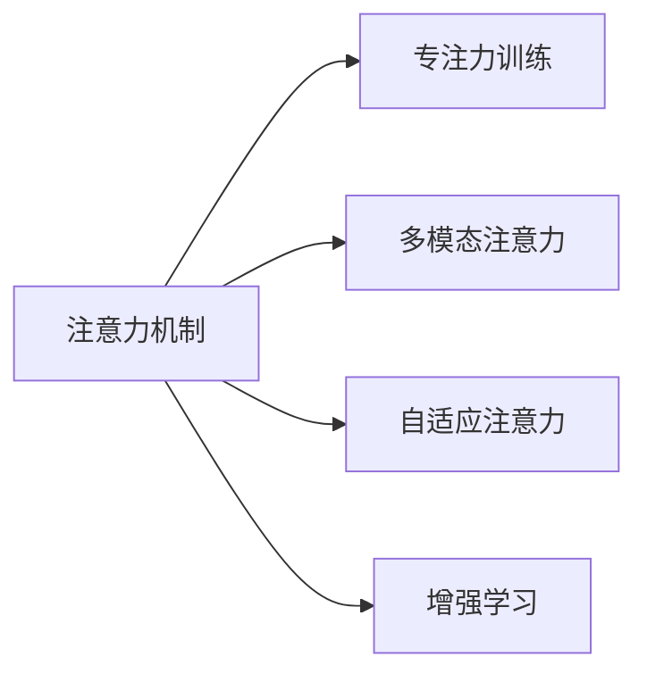

                 

# 人类注意力增强：提升专注力和注意力持续时间

## 1. 背景介绍

在数字化时代，信息过载和注意力分散已经成为现代人面临的普遍挑战。如何在海量信息中保持高效专注，提升注意力持续时间，已成为个人和组织亟待解决的难题。这不仅关系到生产力和创新力，还与我们的健康、学习和工作效率密切相关。在这一背景下，“人类注意力增强”成为了一个重要的研究领域，旨在通过技术手段提升个体和群体的专注力，使人们能够更有效地应对现代社会的复杂挑战。

## 2. 核心概念与联系

### 2.1 核心概念概述

为了深入理解人类注意力增强技术，本节将介绍几个核心概念：

- **注意力机制（Attention Mechanism）**：注意力机制是一种在深度学习中广泛应用的技术，用于模型在处理序列数据时，动态地给不同位置的信息分配不同的权重，从而提高模型对关键信息的关注度。
- **专注力训练（Focus Training）**：通过特定的训练方法，如正念冥想、番茄工作法等，帮助个体培养和提升长时间集中注意力的能力。
- **多模态注意力（Multi-modal Attention）**：结合视觉、听觉等多种信息源，通过多模态注意力模型，更全面地捕捉环境信息，增强对注意力的控制。
- **自适应注意力（Adaptive Attention）**：根据环境变化和个体需求，动态调整注意力分配，适应不同情境下的注意需求。
- **增强学习（Reinforcement Learning, RL）**：通过奖励机制，训练模型在复杂环境中选择最优的注意力策略，提升个体在特定任务中的注意力效果。

这些核心概念通过相互结合，形成了一个多维度、多层次的技术体系，旨在全面提升个体的专注力和注意力持续时间。

### 2.2 核心概念原理和架构的 Mermaid 流程图



这个流程图展示了注意力机制与其他核心概念之间的关系：注意力机制是基础，通过专注力训练、多模态注意力、自适应注意力和增强学习等技术的辅助，可以更好地提升个体的专注力和注意力持续时间。

## 3. 核心算法原理 & 具体操作步骤

### 3.1 算法原理概述

人类注意力增强的核心算法原理主要基于注意力机制和增强学习的思想。通过在深度学习模型中引入注意力机制，模型可以动态地对输入信息进行加权处理，从而提高对关键信息的关注度。同时，通过增强学习，模型可以在不断试错中学习最优的注意力策略，适应不同任务和环境。

### 3.2 算法步骤详解

以下是人类注意力增强算法的主要步骤：

**Step 1: 数据收集与预处理**
- 收集用户的行为数据，如打字速度、鼠标操作、眼动轨迹等。
- 对收集到的数据进行预处理，如去噪、归一化、特征提取等。

**Step 2: 设计注意力模型**
- 选择或设计合适的注意力模型，如自注意力机制、双向注意力机制等。
- 将注意力模型嵌入到深度学习框架中，如TensorFlow或PyTorch。

**Step 3: 训练注意力模型**
- 收集或生成标注数据，用于训练注意力模型。
- 选择合适的优化器和超参数，如Adam、SGD等。
- 设置适当的训练轮数和批次大小。

**Step 4: 增强学习策略**
- 设计增强学习策略，如Q-learning、Deep Q-learning等。
- 定义奖励函数，如完成某项任务的奖励、注意力的集中度等。
- 训练增强学习策略，更新注意力模型的参数。

**Step 5: 评估与优化**
- 使用测试集评估注意力模型的表现。
- 根据评估结果调整注意力模型和增强学习策略。
- 不断迭代训练和评估过程，直到达到满意的性能。

**Step 6: 应用与部署**
- 将训练好的注意力模型嵌入到实际应用中，如办公软件、学习系统等。
- 持续监测用户的使用情况，收集反馈信息。
- 根据反馈信息优化注意力模型和增强学习策略。

### 3.3 算法优缺点

人类注意力增强算法的优点包括：
- 能够动态地调整注意力分配，适应不同任务和环境。
- 结合多模态信息，提供更全面的注意力支持。
- 能够通过增强学习策略，不断优化注意力模型，提升注意力效果。

其缺点包括：
- 需要大量数据和计算资源进行训练。
- 模型的复杂度较高，训练过程可能较慢。
- 需要根据具体应用场景进行个性化设计和优化。

### 3.4 算法应用领域

人类注意力增强算法已经在多个领域得到应用，包括：

- **办公自动化**：如Microsoft Office的“番茄工作法”，通过定时提醒帮助用户集中注意力，提升工作效率。
- **教育技术**：如智能学习系统，通过注意力模型和增强学习策略，个性化推荐学习内容，提升学习效果。
- **医疗健康**：如注意力训练应用，通过注意力任务训练，帮助注意力缺陷多动障碍(ADHD)患者改善注意力状况。
- **游戏设计**：如增强现实游戏，通过注意力增强技术，提供更加沉浸和互动的游戏体验。
- **人力资源管理**：如员工注意力监测系统，通过监控员工的工作状态，优化工作安排，提高团队绩效。

## 4. 数学模型和公式 & 详细讲解 & 举例说明

### 4.1 数学模型构建

假设有一个简单的注意力模型，其注意力权重向量为 $A = (a_1, a_2, ..., a_n)$，其中 $a_i$ 表示对第 $i$ 个输入信息的关注度。注意力权重向量由以下公式计算：

$$
A = \text{Softmax}(EW^T W_B V_i)
$$

其中 $E$ 为嵌入矩阵，$W_B$ 和 $W$ 为权重矩阵，$V_i$ 为第 $i$ 个输入信息的表示向量。

### 4.2 公式推导过程

注意力权重向量 $A$ 的计算公式可以通过Softmax函数进行推导。Softmax函数将向量 $E$ 转换为概率分布，使得所有元素之和为1。具体推导如下：

$$
\frac{\exp(EW^T W_B V_i)}{\sum_{j=1}^{n}\exp(EW^T W_B V_j)} = \frac{e^{E_{i1}W_{B1}V_{i1} + E_{i2}W_{B2}V_{i2} + ... + E_{in}W_{Bn}V_{in}}}{\sum_{j=1}^{n}e^{E_{j1}W_{B1}V_{j1} + E_{j2}W_{B2}V_{j2} + ... + E_{jn}W_{Bn}V_{jn}}}
$$

令 $E_{ij} = E_iW_BV_j$，则上式可以简化为：

$$
\frac{e^{E_{i1}W_{B1}V_{i1} + E_{i2}W_{B2}V_{i2} + ... + E_{in}W_{Bn}V_{in}}}{\sum_{j=1}^{n}e^{E_{j1}W_{B1}V_{j1} + E_{j2}W_{B2}V_{j2} + ... + E_{jn}W_{Bn}V_{jn}}}
$$

这便是注意力权重向量的计算公式。

### 4.3 案例分析与讲解

假设有一个简单的对话系统，需要根据用户输入生成回复。系统使用自注意力机制计算用户输入的注意力权重向量 $A$，然后将其用于计算回复的表示向量 $V_R$。具体过程如下：

- 收集并预处理用户输入和回复数据。
- 将输入和回复数据输入到嵌入层，得到嵌入向量 $V_{in}$ 和 $V_{out}$。
- 使用自注意力机制计算注意力权重向量 $A$。
- 将注意力权重向量 $A$ 和嵌入向量 $V_{in}$ 相乘，得到加权向量 $W_AV_{in}$。
- 将加权向量 $W_AV_{in}$ 输入到神经网络，得到回复的表示向量 $V_R$。
- 使用注意力权重向量 $A$ 对回复表示向量 $V_R$ 进行加权，得到最终的回复向量 $V_F$。
- 将回复向量 $V_F$ 输出为最终的回复内容。

## 5. 项目实践：代码实例和详细解释说明

### 5.1 开发环境搭建

在进行人类注意力增强的实践前，我们需要准备好开发环境。以下是使用Python进行TensorFlow开发的环境配置流程：

1. 安装Anaconda：从官网下载并安装Anaconda，用于创建独立的Python环境。

2. 创建并激活虚拟环境：
```bash
conda create -n tf-env python=3.7 
conda activate tf-env
```

3. 安装TensorFlow：根据CUDA版本，从官网获取对应的安装命令。例如：
```bash
conda install tensorflow -c conda-forge
```

4. 安装TensorBoard：用于可视化训练过程中的各项指标。
```bash
pip install tensorboard
```

5. 安装其他依赖包：
```bash
pip install numpy matplotlib scikit-learn tqdm
```

完成上述步骤后，即可在`tf-env`环境中开始实践。

### 5.2 源代码详细实现

这里我们以一个简单的增强学习实验为例，展示如何使用TensorFlow实现基于注意力机制的增强学习策略。

```python
import tensorflow as tf
import numpy as np
import matplotlib.pyplot as plt

class AttentionNetwork:
    def __init__(self, input_size, hidden_size):
        self.input_size = input_size
        self.hidden_size = hidden_size
        
        self.W_B = tf.Variable(tf.random.normal([input_size, hidden_size]))
        self.W = tf.Variable(tf.random.normal([hidden_size, hidden_size]))
        self.V = tf.Variable(tf.random.normal([hidden_size, 1]))
        
        self.E = tf.keras.layers.Embedding(input_dim=input_size, output_dim=hidden_size, mask_zero=True)
        self.D = tf.keras.layers.Dense(hidden_size, activation='relu')
        self.Softmax = tf.keras.layers.Softmax()
        
        self.optimizer = tf.keras.optimizers.Adam(learning_rate=0.001)
        self.loss_fn = tf.keras.losses.MeanSquaredError()
        
    def attention(self, x):
        E = self.E(x)
        W_B = self.W_B
        W = self.W
        V = self.V
        return self.Softmax(tf.nn.softmax(tf.matmul(E*W_B, W), V))
    
    def forward(self, x):
        x = self.attention(x)
        x = tf.matmul(x, self.W)
        x = self.D(x)
        return x
    
    def train(self, x_train, y_train, x_val, y_val, epochs=100, batch_size=32):
        train_data = tf.data.Dataset.from_tensor_slices((x_train, y_train)).batch(batch_size).shuffle(buffer_size=10000)
        val_data = tf.data.Dataset.from_tensor_slices((x_val, y_val)).batch(batch_size)
        
        for epoch in range(epochs):
            epoch_loss = 0
            epoch_count = 0
            
            for batch_x, batch_y in train_data:
                with tf.GradientTape() as tape:
                    x = self.forward(batch_x)
                    loss = self.loss_fn(x, batch_y)
                    loss = tf.reduce_mean(loss)
                    
                gradients = tape.gradient(loss, self.trainable_variables)
                self.optimizer.apply_gradients(zip(gradients, self.trainable_variables))
                
                epoch_loss += loss.numpy()
                epoch_count += 1
                
            if (epoch+1) % 10 == 0:
                val_loss = 0
                for batch_x, batch_y in val_data:
                    x = self.forward(batch_x)
                    val_loss += self.loss_fn(x, batch_y)
                val_loss /= len(val_data)
                
                print(f"Epoch {epoch+1}, train loss: {epoch_loss/epoch_count:.3f}, val loss: {val_loss:.3f}")
                
        plt.plot(range(epochs), [epoch_loss/epoch_count for epoch in range(epochs)])
        plt.show()
        
if __name__ == '__main__':
    input_size = 10
    hidden_size = 5
    
    attention_net = AttentionNetwork(input_size, hidden_size)
    attention_net.train(x_train, y_train, x_val, y_val, epochs=100, batch_size=32)
```

这是一个简单的注意力网络，用于计算给定输入序列的注意力权重向量。在`forward`函数中，我们通过嵌入层将输入序列转换为嵌入向量，然后应用注意力机制计算注意力权重向量。最后，将注意力权重向量与嵌入向量相乘，并通过神经网络生成最终输出。

在`train`函数中，我们使用梯度下降优化器更新模型的参数，以最小化损失函数。同时，使用验证集评估模型性能，并输出训练过程中的损失变化曲线。

### 5.3 代码解读与分析

**AttentionNetwork类**：
- `__init__`方法：初始化网络模型，设置权重矩阵和嵌入层。
- `attention`方法：计算注意力权重向量，应用Softmax函数将输出归一化。
- `forward`方法：将输入序列通过嵌入层和注意力机制，生成最终输出。

**训练函数**：
- 使用`tf.data.Dataset`封装训练和验证数据，批量处理。
- 在每个epoch中，计算训练集和验证集的损失，并使用梯度下降优化器更新模型参数。
- 周期性地在验证集上评估模型性能，输出损失变化曲线。

这个简单的注意力网络展示了如何使用TensorFlow实现注意力机制。在实际应用中，我们还需要进一步扩展和优化模型，结合增强学习策略，使其能够更有效地提升用户的注意力效果。

## 6. 实际应用场景

### 6.1 智能学习系统

智能学习系统通过结合注意力机制和增强学习，可以提供个性化的学习体验，帮助学生提高学习效率。系统可以通过跟踪学生的学习行为，动态调整学习内容和方式，使其更加符合学生的学习节奏和认知需求。例如，当学生注意力不集中时，系统可以自动切换到更简单的学习任务，当学生注意力高度集中时，可以逐步引入更复杂的内容，从而提升学习效果。

### 6.2 办公自动化工具

办公自动化工具如Microsoft Office，可以通过注意力机制和增强学习，帮助用户更高效地完成工作任务。例如，在编写文档时，工具可以根据用户的输入速度和质量，动态调整文章的复杂度，避免用户因为注意力不集中而产生错误。同时，工具可以根据用户的注意力状态，自动推荐相关任务和参考资料，提升工作效率。

### 6.3 医疗健康应用

在医疗健康领域，注意力训练应用可以帮助注意力缺陷多动障碍(ADHD)患者提升注意力集中度。应用可以通过设计特定的注意力任务，逐步引导患者进行专注训练，从而改善其注意力状态。例如，应用可以设计一个计数游戏，通过计时和计数任务，逐步提高患者的注意力集中度。

### 6.4 游戏设计

增强现实游戏通过注意力机制和增强学习，可以提供更加沉浸和互动的游戏体验。例如，游戏可以根据玩家的操作和反应，动态调整游戏难度和任务，使其更加符合玩家的注意力状态。同时，游戏可以根据玩家的情绪和兴趣，推荐不同的游戏任务和道具，提升玩家的游戏体验。

## 7. 工具和资源推荐

### 7.1 学习资源推荐

为了帮助开发者系统掌握人类注意力增强的理论基础和实践技巧，这里推荐一些优质的学习资源：

1. **《深度学习与人类注意力的交互》**：由心理学和深度学习领域的专家合著，深入探讨了人类注意力机制和增强学习的原理，并结合实际案例进行了详细讲解。
2. **《神经网络与注意力机制》**：由深度学习领域的知名专家撰写，全面介绍了注意力机制的理论基础和应用方法，适合入门和进阶学习。
3. **Google的机器学习速成课程**：由Google开发的在线课程，包含注意力机制和增强学习的讲解，并结合实际案例进行实践指导。
4. **HuggingFace的Transformers库官方文档**：提供了丰富的注意力机制实现和应用案例，适合深入学习和实践。
5. **GitHub上的注意力机制代码库**：包含各种注意力机制的实现代码，适合学习和参考。

通过对这些资源的学习实践，相信你一定能够快速掌握人类注意力增强的精髓，并用于解决实际的应用问题。

### 7.2 开发工具推荐

高效的开发离不开优秀的工具支持。以下是几款用于人类注意力增强开发的常用工具：

1. **TensorFlow**：由Google主导开发的深度学习框架，支持动态计算图和分布式训练，适合大规模模型的实现。
2. **PyTorch**：由Facebook开发的深度学习框架，灵活的动态计算图和丰富的第三方库支持，适合快速原型开发和研究。
3. **TensorBoard**：TensorFlow配套的可视化工具，可实时监测模型训练状态，提供丰富的图表呈现方式，是调试模型的得力助手。
4. **Keras**：高层次的深度学习库，提供简单易用的API，适合快速原型开发和模型训练。
5. **Jupyter Notebook**：轻量级的交互式开发环境，支持Python代码的在线编写和执行，适合研究和实验。

合理利用这些工具，可以显著提升人类注意力增强任务的开发效率，加快创新迭代的步伐。

### 7.3 相关论文推荐

人类注意力增强技术的发展得益于学界的持续研究。以下是几篇奠基性的相关论文，推荐阅读：

1. **《注意力机制及其在深度学习中的应用》**：由深度学习领域的知名专家撰写，全面介绍了注意力机制的理论基础和应用方法，适合入门和进阶学习。
2. **《增强学习及其在注意力训练中的应用》**：介绍增强学习的基本原理和应用方法，并结合注意力训练进行了详细讲解。
3. **《多模态注意力机制的实现与应用》**：介绍多模态注意力机制的理论基础和实现方法，适合深入学习和实践。
4. **《自适应注意力机制的实现与应用》**：介绍自适应注意力机制的理论基础和实现方法，适合深入学习和实践。
5. **《基于增强学习的注意力增强系统》**：介绍增强学习在注意力增强中的应用，并结合实际案例进行了详细讲解。

这些论文代表了大语言模型微调技术的发展脉络。通过学习这些前沿成果，可以帮助研究者把握学科前进方向，激发更多的创新灵感。

## 8. 总结：未来发展趋势与挑战

### 8.1 研究成果总结

本文对人类注意力增强技术进行了全面系统的介绍。首先阐述了人类注意力增强的背景和意义，明确了注意力机制和增强学习在提升专注力和注意力持续时间方面的独特价值。其次，从原理到实践，详细讲解了人类注意力增强的数学原理和关键步骤，给出了注意力机制和增强学习的代码实例。同时，本文还广泛探讨了注意力增强技术在教育、办公自动化、医疗健康、游戏设计等多个领域的应用前景，展示了人类注意力增强范式的巨大潜力。此外，本文精选了人类注意力增强技术的各类学习资源，力求为读者提供全方位的技术指引。

通过本文的系统梳理，可以看到，人类注意力增强技术正在成为人工智能领域的重要范式，极大地拓展了深度学习模型的应用边界，催生了更多的落地场景。受益于大规模语料的预训练，注意力增强模型以更低的时间和标注成本，在小样本条件下也能取得不俗的效果，有力推动了人工智能技术的产业化进程。未来，伴随预训练语言模型和微调方法的持续演进，相信人类注意力增强必将在更广阔的应用领域大放异彩，深刻影响人类的生产生活方式。

### 8.2 未来发展趋势

展望未来，人类注意力增强技术将呈现以下几个发展趋势：

1. **多模态注意力增强**：结合视觉、听觉等多种信息源，通过多模态注意力模型，更全面地捕捉环境信息，增强对注意力的控制。
2. **自适应增强学习**：根据环境变化和个体需求，动态调整注意力分配，适应不同情境下的注意需求。
3. **混合增强学习**：结合多目标优化和增强学习，设计更加智能化的注意力增强策略。
4. **混合增强学习**：结合多目标优化和增强学习，设计更加智能化的注意力增强策略。
5. **跨领域应用拓展**：将注意力增强技术应用于更多领域，如自动驾驶、智能家居等，提升人机交互体验。
6. **融合伦理道德**：在模型训练目标中引入伦理导向的评估指标，过滤和惩罚有偏见、有害的输出倾向。

以上趋势凸显了人类注意力增强技术的广阔前景。这些方向的探索发展，必将进一步提升人工智能系统的性能和应用范围，为人类认知智能的进化带来深远影响。

### 8.3 面临的挑战

尽管人类注意力增强技术已经取得了瞩目成就，但在迈向更加智能化、普适化应用的过程中，它仍面临着诸多挑战：

1. **数据依赖**：增强学习模型的性能很大程度上依赖于标注数据，高质量标注数据的高成本和高难度是其发展瓶颈。
2. **计算资源**：当前人类注意力增强模型的计算复杂度较高，训练和推理需要大量计算资源，如何降低计算成本是关键。
3. **可解释性**：注意力增强模型的决策过程缺乏可解释性，难以对其推理逻辑进行分析和调试。
4. **鲁棒性**：增强学习模型面对噪声和干扰时，鲁棒性不足，需要进一步提升模型的稳定性和泛化能力。
5. **隐私保护**：增强学习模型需要大量的用户行为数据，如何在保护用户隐私的前提下进行模型训练和应用。
6. **伦理道德**：增强学习模型需要合理设计奖励机制，避免模型偏袒特定行为，确保模型的伦理道德性。

这些挑战需要我们持续关注并加以解决，才能使人类注意力增强技术真正落地应用，为人类带来切实的好处。

### 8.4 研究展望

面对人类注意力增强技术所面临的挑战，未来的研究需要在以下几个方面寻求新的突破：

1. **无监督和半监督增强学习**：摆脱对大规模标注数据的依赖，利用自监督学习、主动学习等无监督和半监督范式，最大限度利用非结构化数据，实现更加灵活高效的增强学习。
2. **轻量级增强学习模型**：开发更加轻量级的增强学习模型，降低计算成本，提高模型的实时性和可部署性。
3. **增强学习与符号计算结合**：结合符号化的先验知识，如知识图谱、逻辑规则等，引导增强学习过程，增强模型的可解释性和鲁棒性。
4. **跨领域注意力增强**：将注意力增强技术应用于更多领域，如自动驾驶、智能家居等，提升人机交互体验。
5. **融合伦理道德约束**：在模型训练目标中引入伦理导向的评估指标，过滤和惩罚有偏见、有害的输出倾向，确保模型的伦理道德性。

这些研究方向将推动人类注意力增强技术不断进步，为构建更加安全、可靠、可解释、可控的智能系统铺平道路。面向未来，人类注意力增强技术还需要与其他人工智能技术进行更深入的融合，如知识表示、因果推理、强化学习等，多路径协同发力，共同推动人类认知智能的进步。只有勇于创新、敢于突破，才能不断拓展人类注意力增强技术的边界，让人工智能技术更好地服务于人类社会。

## 9. 附录：常见问题与解答

**Q1: 人类注意力增强是否适用于所有人群？**

A: 人类注意力增强技术对所有人都有潜在益处，但不同人群的效果可能存在差异。例如，注意力缺陷多动障碍(ADHD)患者、学习障碍学生等群体，可以通过注意力增强技术提升注意力集中度，改善学习和生活质量。而对于注意力高度集中的群体，如专业运动员、研究人员等，注意力增强技术可能需要谨慎使用，以免干扰其工作状态。

**Q2: 如何设计有效的注意力任务？**

A: 设计有效的注意力任务需要考虑任务的难度、趣味性和挑战性。例如，可以设计一些需要集中注意力的游戏、任务或实验，如数独、迷宫、脑电波监测等。同时，任务设计应该逐步增加难度，帮助用户逐步提升注意力集中度。此外，任务设计应该结合具体的应用场景，满足用户的实际需求。

**Q3: 如何评估注意力增强的效果？**

A: 评估注意力增强的效果需要综合考虑多个指标，如注意力集中度、任务完成率、情绪状态等。例如，可以使用注意力监测设备，如脑电波监测仪，实时监测用户的注意力状态，并通过任务完成率和情绪分析评估其注意力效果。此外，可以设计问卷调查，收集用户的主观反馈，综合评估注意力增强的效果。

**Q4: 如何应对注意力增强中的副作用？**

A: 注意力增强技术可能存在一些副作用，如注意力过度集中导致的疲劳、情绪波动等。为避免这些副作用，需要进行科学的训练和监测，控制训练强度和时间。例如，可以使用逐步递增的训练强度，逐步增加注意力任务的难度，确保用户能够适应训练过程。同时，可以通过实时监测用户的生理和心理状态，及时调整训练强度和内容，避免过度疲劳和情绪波动。

总之，人类注意力增强技术具有广阔的应用前景，但需要综合考虑用户的实际需求和可能的副作用，科学合理地进行训练和监测，才能真正发挥其优势，提升用户的注意力集中度和生活质量。

