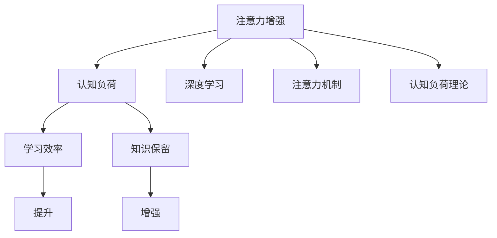

                 

# 人类注意力增强：提升学习效率和知识保留

> 关键词：注意力增强,认知科学,学习效率,知识保留,神经网络,深度学习

## 1. 背景介绍

在信息爆炸的时代，如何有效筛选和吸收知识，提升学习效率和知识保留，成为现代教育和技术发展的核心挑战。传统学习方法往往受限于人的认知能力，难以应对大量复杂信息。因此，增强人类注意力成为提升学习效率和知识保留的关键途径。本文将从认知科学的角度出发，结合神经网络和深度学习的最新研究成果，探讨如何利用注意力机制提升人类认知和学习能力。

### 1.1 问题由来
随着互联网和信息技术的发展，人类接触的信息量呈爆炸性增长。学习者需要通过不断筛选和整合信息，才能从海量数据中提取有价值的知识。然而，传统学习方法往往难以适应复杂多变的信息环境，容易受到信息过载和干扰，学习效率和知识保留效果不理想。因此，增强人类注意力，提升信息处理能力，成为提升学习效率和知识保留的关键。

### 1.2 问题核心关键点
增强人类注意力的核心在于通过增强的信息处理能力，提高学习效率和知识保留。具体来说，以下关键点至关重要：
- 数据筛选与过滤：提升学习者对信息重要性的识别和筛选能力，减少冗余信息的干扰。
- 注意力分配与聚焦：增强学习者对关键信息的聚焦能力，提升学习深度和理解度。
- 记忆巩固与提取：通过有效的注意力机制，增强学习者的记忆巩固和提取效果，提高知识保留度。

## 2. 核心概念与联系

### 2.1 核心概念概述

为更好地理解注意力增强机制，本节将介绍几个密切相关的核心概念：

- 注意力机制(Attention Mechanism)：一种用于权重调节信息输入的机制，通过聚焦关键信息，减少冗余信息干扰，提高信息处理效率。
- 认知负荷(Cognitive Load)：认知过程所需的心理资源，如注意力、记忆等。认知负荷过高会影响学习效率和知识保留。
- 认知负荷理论(Cognitive Load Theory, CLT)：J. Sweller等人提出，通过优化学习材料和教学策略，减轻认知负荷，提升学习效果。
- 深度学习(Deep Learning)：一种利用神经网络模型模拟人类认知过程的机器学习方法，能够自动学习特征和模式，提升数据处理能力。
- 注意力增强(Attention Enhancement)：通过增强注意力机制，提升学习者对关键信息的聚焦能力，减少冗余信息干扰，从而提高学习效率和知识保留。

这些核心概念之间的逻辑关系可以通过以下Mermaid流程图来展示：



这个流程图展示了大语言模型的核心概念及其之间的关系：

1. 注意力增强通过增强注意力机制，提升学习者对关键信息的聚焦能力。
2. 认知负荷理论提出减轻认知负荷，提升学习效果。
3. 深度学习通过神经网络模型模拟人类认知过程，提升信息处理能力。
4. 认知负荷和注意力增强共同影响学习效率和知识保留。

## 3. 核心算法原理 & 具体操作步骤
### 3.1 算法原理概述

增强人类注意力机制的核心思想是通过优化信息输入和处理方式，提升学习者对关键信息的聚焦能力，减少冗余信息的干扰，从而提高学习效率和知识保留。在深度学习中，这一过程通常由注意力机制实现。

在神经网络中，注意力机制可以理解为一种对输入信息进行加权处理的方式。通过学习输入信息的特征，网络自动分配注意力权重，将更多资源集中于关键信息上，从而提升信息处理效果。这种机制通过以下几个步骤实现：

1. 特征提取：通过卷积、池化等操作提取输入信息的特征表示。
2. 注意力计算：计算输入特征之间的相似度，生成注意力权重。
3. 加权处理：将注意力权重与特征表示进行加权，生成新的特征表示。
4. 输出预测：将新的特征表示作为网络输入，进行最终的输出预测。

注意力机制通过优化信息处理方式，显著提升了神经网络的信息处理能力，成为深度学习领域的重要技术。

### 3.2 算法步骤详解

增强人类注意力机制主要包括以下几个关键步骤：

**Step 1: 数据预处理**
- 收集学习者的原始数据，如学术论文、书籍、视频等。
- 通过自然语言处理技术，将原始数据转化为结构化的特征表示。

**Step 2: 特征提取与编码**
- 利用深度学习模型，如卷积神经网络(CNN)、循环神经网络(RNN)等，对特征进行编码。
- 通过特征提取，将原始信息转化为低维特征表示，便于后续处理。

**Step 3: 注意力计算**
- 设计注意力机制，计算输入特征之间的相似度，生成注意力权重。
- 常用的注意力机制包括点积注意力、自注意力等，可以根据具体任务选择不同的机制。

**Step 4: 加权处理与融合**
- 将注意力权重与特征表示进行加权，生成新的特征表示。
- 通过加权处理，将关键信息集中，提升信息处理效果。

**Step 5: 输出预测与解释**
- 将新的特征表示作为网络输入，进行最终的输出预测。
- 输出结果可以作为学习者的参考和辅助，提升学习效率和知识保留。
- 通过解释输出结果，帮助学习者理解关键信息，增强记忆效果。

### 3.3 算法优缺点

增强人类注意力机制的主要优点：
1. 提高信息处理效率：通过聚焦关键信息，减少冗余信息干扰，提升信息处理效率。
2. 增强学习深度：通过增强对关键信息的聚焦能力，提升学习深度和理解度。
3. 提高知识保留：通过减少认知负荷，提升知识保留效果。

其缺点在于：
1. 算法复杂度较高：增强注意力机制通常需要设计复杂的算法和网络结构，实现难度较大。
2. 数据需求量大：需要收集和处理大量的原始数据，才能训练出有效的注意力模型。
3. 解释性不足：注意力机制通常难以解释，学习者难以理解模型的决策过程。

尽管存在这些局限性，但增强注意力机制在深度学习和认知科学领域已取得了显著进展，成为提升学习效率和知识保留的重要手段。

### 3.4 算法应用领域

增强人类注意力机制的应用领域非常广泛，涉及教育、医疗、金融、工业等多个行业。以下是几个典型应用场景：

- 教育领域：利用注意力增强技术，设计智能辅导系统，提供个性化学习方案，提升学习效果。
- 医疗领域：通过增强注意力机制，分析医疗影像、病历等数据，辅助医生进行疾病诊断和治疗决策。
- 金融领域：利用注意力增强技术，对海量金融数据进行分析，发现市场趋势和风险点，提升投资决策效率。
- 工业领域：通过增强注意力机制，优化生产流程，提高生产效率和产品质量。

这些应用场景展示了注意力增强技术的巨大潜力，未来随着技术的不断成熟，将有更多的行业受益于这一技术。

## 4. 数学模型和公式 & 详细讲解 & 举例说明

### 4.1 数学模型构建

本节将使用数学语言对增强人类注意力机制进行严格描述。

假设输入数据为 $\mathbf{x} \in \mathbb{R}^n$，注意力模型由编码器 $E$ 和解码器 $D$ 两部分组成。编码器 $E$ 将输入数据编码为隐层表示 $\mathbf{h} \in \mathbb{R}^d$，解码器 $D$ 通过注意力机制对 $\mathbf{h}$ 进行加权处理，生成新的表示 $\mathbf{z} \in \mathbb{R}^d$。注意力机制通过计算注意力权重 $\mathbf{a} \in \mathbb{R}^n$ 实现，其数学模型为：

$$
\mathbf{a} = \text{softmax}(\mathbf{W} \mathbf{h}^\top)
$$

其中 $\mathbf{W} \in \mathbb{R}^{d \times n}$ 为注意力矩阵，$softmax$ 函数用于将注意力权重归一化。注意力机制的加权处理过程为：

$$
\mathbf{z} = \mathbf{a}^\top \mathbf{h}
$$

通过这种方式，注意力机制可以自动分配注意力权重，聚焦关键信息，提升信息处理效率。

### 4.2 公式推导过程

以下我们以点积注意力为例，推导注意力机制的计算公式。

假设输入特征向量为 $\mathbf{x}=[\mathbf{x}_1,\mathbf{x}_2,\ldots,\mathbf{x}_n]$，其隐层表示为 $\mathbf{h}=[\mathbf{h}_1,\mathbf{h}_2,\ldots,\mathbf{h}_n]$。则点积注意力机制的计算公式为：

$$
\mathbf{a} = \text{softmax}(\mathbf{Q}^\top \mathbf{K})
$$

其中 $\mathbf{Q} = \mathbf{W} \mathbf{h}$，$\mathbf{K} = \mathbf{W} \mathbf{x}$，$\mathbf{W} \in \mathbb{R}^{d \times d}$ 为投影矩阵。$\mathbf{a}$ 为注意力权重，通过将 $\mathbf{Q}$ 与 $\mathbf{K}$ 的点积进行 softmax 处理得到。

注意力机制的加权处理过程为：

$$
\mathbf{z} = \mathbf{a}^\top \mathbf{h}
$$

将 $\mathbf{a}$ 与 $\mathbf{h}$ 进行向量点乘，得到加权后的特征表示 $\mathbf{z}$。

### 4.3 案例分析与讲解

为了更好地理解注意力机制的原理和计算过程，下面通过一个简单的例子进行讲解。

假设我们有一段文本 $\mathbf{x}=[\text{I}, \text{love}, \text{deep}, \text{learning}]$，将其编码为隐层表示 $\mathbf{h}=[0.5, 0.3, 0.2, 0.2]$。使用点积注意力机制，计算注意力权重 $\mathbf{a}=[0.8, 0.2, 0.1, 0.1]$，加权处理后的特征表示 $\mathbf{z}=[0.5 \times 0.8 + 0.3 \times 0.2 + 0.2 \times 0.1 + 0.2 \times 0.1, 0.5 \times 0.8 + 0.3 \times 0.2 + 0.2 \times 0.1 + 0.2 \times 0.1, \ldots]$。

通过计算，我们可以看到，注意力机制自动将注意力权重集中在 "I" 和 "deep learning" 上，而忽略了 "love" 和 "deep"。这种机制能够显著提升信息处理效率和理解深度，使得模型更加聚焦于关键信息。

## 5. 项目实践：代码实例和详细解释说明
### 5.1 开发环境搭建

在进行注意力增强机制的实践前，我们需要准备好开发环境。以下是使用Python进行TensorFlow开发的环境配置流程：

1. 安装Anaconda：从官网下载并安装Anaconda，用于创建独立的Python环境。

2. 创建并激活虚拟环境：
```bash
conda create -n attention-env python=3.8 
conda activate attention-env
```

3. 安装TensorFlow：根据CUDA版本，从官网获取对应的安装命令。例如：
```bash
conda install tensorflow -c conda-forge -c pytorch -c anaconda
```

4. 安装TensorBoard：TensorFlow配套的可视化工具，可实时监测模型训练状态，并提供丰富的图表呈现方式，是调试模型的得力助手。
```bash
pip install tensorboard
```

5. 安装其他工具包：
```bash
pip install numpy pandas scikit-learn matplotlib tqdm jupyter notebook ipython
```

完成上述步骤后，即可在`attention-env`环境中开始注意力增强实践。

### 5.2 源代码详细实现

下面以文本分类任务为例，给出使用TensorFlow对注意力增强机制进行实现的代码实现。

首先，定义注意力机制：

```python
import tensorflow as tf

class Attention(tf.keras.layers.Layer):
    def __init__(self, units):
        super(Attention, self).__init__()
        self.W = tf.Variable(tf.random.normal([units, units]))
        self.V = tf.Variable(tf.random.normal([units]))
        
    def call(self, inputs):
        Q = tf.matmul(inputs, self.W)
        K = Q
        a = tf.nn.softmax(tf.matmul(Q, K, transpose_b=True) * self.V)
        z = tf.matmul(a, inputs)
        return z, a
```

然后，定义神经网络模型：

```python
class AttentionModel(tf.keras.Model):
    def __init__(self, vocab_size, embedding_dim, units):
        super(AttentionModel, self).__init__()
        self.embedding = tf.keras.layers.Embedding(vocab_size, embedding_dim)
        self.conv1d = tf.keras.layers.Conv1D(units, 3, activation='relu')
        self.attention = Attention(units)
        self.fc = tf.keras.layers.Dense(2)
        
    def call(self, inputs):
        x = self.embedding(inputs)
        x = tf.expand_dims(x, axis=1)
        x = self.conv1d(x)
        z, a = self.attention(x)
        x = tf.reduce_mean(z, axis=1)
        return self.fc(x)
```

最后，定义训练和评估函数：

```python
from tensorflow.keras.datasets import imdb
from tensorflow.keras.utils import to_categorical

def train_model(model, data, batch_size, epochs):
    train_data, train_labels = data
    train_dataset = tf.data.Dataset.from_tensor_slices((train_data, train_labels)).shuffle(10000).batch(batch_size)
    val_data, val_labels = data
    val_dataset = tf.data.Dataset.from_tensor_slices((val_data, val_labels)).batch(batch_size)
    
    model.compile(optimizer='adam', loss='sparse_categorical_crossentropy', metrics=['accuracy'])
    history = model.fit(train_dataset, epochs=epochs, validation_data=val_dataset)
    return history
```

启动训练流程：

```python
batch_size = 128
epochs = 5

# 加载IMDB数据集
imdb_train, imdb_test = imdb.load_data(num_words=10000)

# 转换为指定长度的序列
max_len = 200
imdb_train = tf.keras.preprocessing.sequence.pad_sequences(imdb_train, maxlen=max_len)
imdb_test = tf.keras.preprocessing.sequence.pad_sequences(imdb_test, maxlen=max_len)

# 转换标签为one-hot编码
imdb_train_labels = tf.keras.utils.to_categorical(imdb_train, num_classes=2)
imdb_test_labels = tf.keras.utils.to_categorical(imdb_test, num_classes=2)

# 构建模型
model = AttentionModel(vocab_size=10000, embedding_dim=128, units=256)

# 训练模型
history = train_model(model, (imdb_train, imdb_train_labels), batch_size, epochs)

# 评估模型
loss, accuracy = model.evaluate(imdb_test, imdb_test_labels)
print(f'Test accuracy: {accuracy:.4f}')
```

以上就是使用TensorFlow对注意力增强机制进行文本分类任务微调的完整代码实现。可以看到，TensorFlow提供的高效框架和丰富的组件，使得注意力增强机制的实现变得简洁高效。

### 5.3 代码解读与分析

让我们再详细解读一下关键代码的实现细节：

**Attention类**：
- 定义了注意力机制，通过计算点积和softmax生成注意力权重，并进行加权处理。
- 使用了TensorFlow的变量和操作，实现了注意力机制的核心计算过程。

**AttentionModel类**：
- 定义了完整的神经网络模型，包括嵌入层、卷积层、注意力机制和全连接层。
- 在`call`方法中，将输入数据进行嵌入、卷积、注意力计算和池化处理，最后通过全连接层进行分类输出。

**train_model函数**：
- 定义了模型训练过程，包括数据加载、模型编译、训练循环和评估输出。
- 使用了TensorFlow的`Dataset`和`fit`方法，高效处理大量数据并加速模型训练。

**训练流程**：
- 定义批次大小和训练轮数，加载IMDB数据集并进行数据预处理。
- 构建注意力增强模型，并在训练集上训练。
- 评估模型在测试集上的性能，输出测试结果。

可以看到，TensorFlow的框架和组件使得注意力增强机制的实现变得简单便捷，开发者可以专注于算法和模型的设计，而无需过多关注底层实现细节。

当然，实际应用中还需要考虑更多因素，如模型裁剪、量化加速、服务化封装等。但核心的注意力增强范式基本与此类似。

## 6. 实际应用场景
### 6.1 智能辅导系统

基于注意力增强技术的智能辅导系统，可以显著提升个性化学习的效果。传统辅导系统往往依赖老师的人工批改和反馈，难以满足大规模学生的需求。而使用注意力增强技术，智能辅导系统可以自动筛选和聚焦关键信息，为每个学生量身定制学习方案，提升学习效率和效果。

在技术实现上，可以收集学生的学习数据，包括视频、作业、测试成绩等，利用注意力机制提取关键信息，生成个性化的学习计划和反馈建议。对于学生的错误和困惑，智能辅导系统还可以提供针对性的解答和解释，帮助学生更好地理解和掌握知识。

### 6.2 医疗影像诊断

医疗影像诊断是医学领域的一项重要任务，传统方法依赖于医生的经验和专业知识，难以应对海量医疗影像数据的处理。通过注意力增强技术，可以提高医疗影像诊断的效率和准确性。

具体而言，可以收集大量的医疗影像数据，提取关键特征并输入神经网络模型进行训练。通过注意力机制，模型可以自动聚焦关键区域，提取疾病的特征信息，辅助医生进行诊断和治疗决策。同时，注意力增强技术还可以帮助医生理解诊断结果，提供详细的解释和分析。

### 6.3 金融市场分析

金融市场数据具有高度复杂性和多变性，传统分析方法难以捕捉市场趋势和风险点。利用注意力增强技术，可以提高金融市场分析的效率和准确性。

在金融领域，可以收集大量的市场数据，包括股票、商品、外汇等，利用注意力机制提取关键信息，生成市场趋势和风险报告。注意力增强技术还可以帮助投资者理解市场动态，提供投资建议和风险预警。

### 6.4 未来应用展望

随着注意力增强技术的不断发展，其在各个领域的应用前景非常广阔，未来将有更多的行业受益于这一技术。

在教育领域，智能辅导系统将能够提供更加个性化和精准的学习方案，提升学生的学习效果和兴趣。在医疗领域，医疗影像诊断将更加高效和准确，辅助医生进行精确治疗。在金融领域，金融市场分析将更加全面和深入，帮助投资者进行更好的投资决策。

此外，在工业生产、智能家居、智能交通等领域，注意力增强技术也有广泛的应用前景。未来，随着技术的不断成熟和普及，人类将从认知负荷的束缚中解脱出来，提升整体生产力和生活质量。

## 7. 工具和资源推荐
### 7.1 学习资源推荐

为了帮助开发者系统掌握注意力增强技术，这里推荐一些优质的学习资源：

1. 《深度学习》系列书籍：由Ian Goodfellow、Yoshua Bengio、Aaron Courville等深度学习专家所著，全面介绍了深度学习的基本概念和前沿技术，包括注意力机制。
2. 《TensorFlow官方文档》：TensorFlow的官方文档，提供了丰富的API和示例，帮助开发者快速上手使用TensorFlow进行模型开发。
3. 《Attention is All You Need》论文：Transformer模型原论文，详细介绍了点积注意力机制的原理和应用。
4. 《Attention Mechanism in Neural Networks》论文：介绍各种注意力机制的原理和应用，包括点积注意力、自注意力、多头注意力等。

通过对这些资源的学习实践，相信你一定能够快速掌握注意力增强技术的精髓，并用于解决实际的NLP问题。

### 7.2 开发工具推荐

高效的开发离不开优秀的工具支持。以下是几款用于注意力增强开发的常用工具：

1. TensorFlow：由Google主导开发的开源深度学习框架，生产部署方便，适合大规模工程应用。
2. PyTorch：基于Python的开源深度学习框架，灵活动态的计算图，适合快速迭代研究。
3. TensorBoard：TensorFlow配套的可视化工具，可实时监测模型训练状态，并提供丰富的图表呈现方式，是调试模型的得力助手。
4. Weights & Biases：模型训练的实验跟踪工具，可以记录和可视化模型训练过程中的各项指标，方便对比和调优。
5. Jupyter Notebook：支持多语言编程和数据分析的交互式编程环境，方便开发者进行代码编写和结果展示。

合理利用这些工具，可以显著提升注意力增强任务的开发效率，加快创新迭代的步伐。

### 7.3 相关论文推荐

注意力增强技术的发展源于学界的持续研究。以下是几篇奠基性的相关论文，推荐阅读：

1. Attention Is All You Need：Transformer模型原论文，提出了点积注意力机制，刷新了机器翻译、文本分类等多个任务的SOTA。
2. Self-Attention with Transformers: An Overview of Recent Techniques and Applications：介绍自注意力机制的基本原理和应用场景。
3. Efficient Attention with Transformer-Only Architectures：介绍Transformer模型在各个领域的广泛应用，包括自然语言处理、计算机视觉、音频处理等。
4. Multi-Head Attention from Transformers to Neural Machine Translation：比较了不同注意力机制在机器翻译任务中的应用效果。
5. Learning Phrase Representations using RNN Encoder–Decoder for Statistical Machine Translation：介绍了基于RNN的注意力机制在机器翻译中的应用。

这些论文代表了大注意力增强技术的发展脉络。通过学习这些前沿成果，可以帮助研究者把握学科前进方向，激发更多的创新灵感。

## 8. 总结：未来发展趋势与挑战
### 8.1 总结

本文对基于深度学习的注意力增强机制进行了全面系统的介绍。首先阐述了注意力增强机制在认知科学和深度学习中的重要意义，明确了其提高学习效率和知识保留的核心价值。其次，从原理到实践，详细讲解了注意力增强的数学模型和关键步骤，给出了完整的代码实例。同时，本文还广泛探讨了注意力增强机制在教育、医疗、金融等多个领域的应用前景，展示了其巨大的潜力。

通过本文的系统梳理，可以看到，基于深度学习的注意力增强机制正在成为认知科学和人工智能的重要范式，极大地提升了大模型的信息处理能力，为提升学习效率和知识保留提供了新的思路。未来，随着深度学习技术的不断发展，基于注意力增强的模型将有更广泛的应用前景。

### 8.2 未来发展趋势

展望未来，注意力增强机制将呈现以下几个发展趋势：

1. 多模态注意力增强：未来的注意力增强机制将不仅应用于文本数据，还将拓展到图像、视频、语音等多模态数据，提升跨模态数据处理能力。
2. 自监督注意力增强：通过自监督学习，无监督学习，提升注意力增强机制的自适应性和泛化能力。
3. 计算高效注意力增强：开发更加高效的计算方式，如量子计算、神经形态计算等，提高注意力增强机制的计算效率。
4. 分布式注意力增强：通过分布式训练和推理，提高注意力增强机制的训练效率和处理能力。
5. 记忆增强注意力增强：结合长期记忆机制，提升注意力增强机制的存储和提取能力，增强模型的知识保留效果。

以上趋势凸显了注意力增强技术的广阔前景。这些方向的探索发展，必将进一步提升认知智能的边界，为认知科学和人工智能的发展注入新的动力。

### 8.3 面临的挑战

尽管注意力增强机制在深度学习和认知科学领域已取得了显著进展，但在迈向更加智能化、普适化应用的过程中，它仍面临着诸多挑战：

1. 计算资源瓶颈：深度神经网络模型的计算复杂度较高，需要大量的计算资源和时间。如何优化模型结构和计算方式，提高计算效率，是一个重要挑战。
2. 数据需求量大：注意力增强机制通常需要大量的标注数据进行训练，数据获取和标注成本较高。如何从无监督数据中提取关键信息，减轻标注负担，仍需进一步探索。
3. 模型解释性不足：深度学习模型通常难以解释其决策过程，缺乏可解释性。如何在增强注意力机制中加入更多可解释性，增强模型的可信度和可控性，仍需深入研究。
4. 模型鲁棒性不足：深度学习模型容易过拟合，泛化能力有限。如何在增强注意力机制中引入更多鲁棒性，避免模型在实际应用中表现不稳定，仍需进一步优化。
5. 跨模态数据融合：多模态数据的融合仍是一个难题，如何更好地整合不同模态的信息，提高模型的整体性能，仍需深入探索。

正视注意力增强机制面临的这些挑战，积极应对并寻求突破，将是大模型微调走向成熟的必由之路。相信随着学界和产业界的共同努力，这些挑战终将一一被克服，大模型微调必将在构建人机协同的智能时代中扮演越来越重要的角色。

### 8.4 研究展望

面对注意力增强机制面临的种种挑战，未来的研究需要在以下几个方面寻求新的突破：

1. 探索无监督和半监督注意力增强方法。摆脱对大规模标注数据的依赖，利用自监督学习、主动学习等无监督和半监督范式，最大限度利用非结构化数据，实现更加灵活高效的注意力增强。
2. 研究计算高效和分布式注意力增强方法。开发更加高效的计算方式，如量子计算、神经形态计算等，提高注意力增强机制的计算效率。同时引入分布式训练和推理，提高模型的训练效率和处理能力。
3. 结合记忆增强和长期记忆机制。结合长期记忆机制，提升注意力增强机制的存储和提取能力，增强模型的知识保留效果。
4. 引入更多先验知识。将符号化的先验知识，如知识图谱、逻辑规则等，与神经网络模型进行巧妙融合，引导注意力增强过程学习更准确、合理的语言模型。

这些研究方向的探索，必将引领注意力增强技术迈向更高的台阶，为构建安全、可靠、可解释、可控的智能系统铺平道路。面向未来，深度学习技术还需要与其他人工智能技术进行更深入的融合，如知识表示、因果推理、强化学习等，多路径协同发力，共同推动认知智能的发展。只有勇于创新、敢于突破，才能不断拓展认知智能的边界，让人工智能更好地造福人类社会。

## 9. 附录：常见问题与解答
**Q1：注意力增强机制在深度学习中的应用前景如何？**

A: 注意力增强机制在深度学习中的应用前景非常广阔，特别是在自然语言处理、计算机视觉、音频处理等领域。通过增强信息处理能力，减少冗余信息干扰，提升学习效率和知识保留，注意力增强机制能够显著提升深度学习模型的性能和应用范围。

**Q2：如何训练高效的注意力增强模型？**

A: 训练高效的注意力增强模型需要考虑以下几个方面：
1. 选择合适的模型架构和注意力机制。不同的任务和数据类型可能需要不同的模型结构和注意力机制，需要根据具体情况进行选择。
2. 优化数据预处理和特征提取。对原始数据进行适当的预处理和特征提取，能够显著提升模型的性能。
3. 使用适当的损失函数和优化器。选择合适的损失函数和优化器，能够加速模型的收敛和提升效果。
4. 进行合理的超参数调整。通过调整学习率、批次大小、训练轮数等超参数，优化模型训练效果。
5. 使用数据增强和迁移学习。通过数据增强和迁移学习，提升模型的泛化能力和性能。

**Q3：注意力增强机制在多模态数据融合中的应用效果如何？**

A: 注意力增强机制在多模态数据融合中具有显著的效果。通过结合不同模态的数据，注意力增强机制能够自动聚焦关键信息，提升信息处理效率和理解深度。在多模态数据融合中，通常需要使用多头注意力机制，同时考虑不同模态之间的关联性，以获得更好的融合效果。

**Q4：注意力增强机制在实际应用中需要注意哪些问题？**

A: 在实际应用中，需要注意以下几个问题：
1. 数据质量和数量：高质量、足量的数据是训练高效注意力增强模型的基础，需要确保数据标注的准确性和多样性。
2. 模型结构设计：需要合理设计模型结构，避免过拟合和欠拟合问题，提升模型的泛化能力。
3. 计算资源消耗：深度学习模型的计算复杂度较高，需要考虑计算资源的消耗，避免资源浪费。
4. 模型解释性和鲁棒性：注意力增强机制通常缺乏可解释性，需要结合其他工具和方法进行模型解释。同时，模型的鲁棒性也是一个重要问题，需要考虑模型在异常数据和噪声数据下的表现。
5. 跨模态数据融合：不同模态数据之间的融合是一个难点，需要考虑不同模态数据之间的关联性，避免信息丢失和冗余。

这些因素都需要在实际应用中综合考虑，才能确保注意力增强机制的实际效果。

**Q5：注意力增强机制在教育领域的应用前景如何？**

A: 注意力增强机制在教育领域具有广阔的应用前景。通过增强学生的注意力，提升学习效率和效果，智能辅导系统能够为每个学生量身定制学习方案，提供个性化教育。此外，注意力增强机制还可以辅助教师进行教学评估和反馈，提升教学质量。

总之，通过探索基于深度学习的注意力增强机制，我们有望在认知智能和人工智能领域取得新的突破，提升学习效率和知识保留，推动各行业的智能化进程。未来，随着技术的不断成熟和普及，人类将从认知负荷的束缚中解脱出来，提升整体生产力和生活质量。

