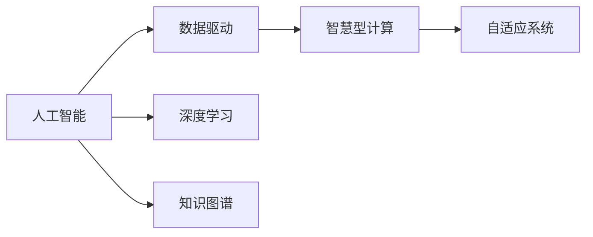

                 

# 人类的知识与智慧：在人工智能时代

> 关键词：人工智能,知识图谱,智慧型计算,数据驱动,深度学习,大数据,自适应系统

## 1. 背景介绍

### 1.1 问题由来

当前，我们正处在一个信息化爆炸的时代。随着互联网、移动通信、物联网等技术的迅猛发展，人类社会的数字化进程日益加快。在这样的背景下，人工智能（AI）技术迅速崛起，以其卓越的算法和强大的计算能力，正在重塑人类生活的方方面面。

人工智能技术的核心在于利用机器学习和深度学习等先进技术，让机器具备学习、推理和决策的能力。而这种能力的实现，离不开海量的数据和复杂的算法模型。正是这些数据和算法，构成了人工智能的基础。但人工智能发展的瓶颈也正在于此，如何更好地利用这些数据，挖掘其背后的知识和智慧，成为当前人工智能研究的重要课题。

在数据驱动的AI时代，知识的获取、组织、理解和应用变得至关重要。人们希望机器不仅能够学习知识，还能够像人类一样，在知识的海洋中游刃有余地探索和发现，从而实现更高的智慧型计算。

## 2. 核心概念与联系

### 2.1 核心概念概述

为了深入理解AI时代知识与智慧的应用，我们先要明确一些关键概念：

- **人工智能**：通过机器学习和深度学习算法，让机器具备学习、推理和决策的能力，从而模拟人类的思维过程。
- **知识图谱**：一种结构化的语义网络，用于描述实体、属性和关系，帮助机器理解和推理知识。
- **智慧型计算**：一种基于知识的计算模式，能够通过推理、学习和判断，解决复杂的问题。
- **数据驱动**：利用大数据、机器学习等技术，从数据中提取知识和智慧，驱动人工智能系统不断优化。
- **深度学习**：一种基于神经网络的机器学习技术，通过多层神经元之间的复杂非线性变换，实现对数据的高级抽象和处理。
- **自适应系统**：一种能够根据环境变化动态调整自身策略和行为的智能系统。

这些概念之间存在着紧密的联系。人工智能的核心在于学习，而学习的基础则是数据。通过对数据的分析和处理，机器可以学习并掌握知识，进而通过知识图谱实现智慧型计算。深度学习作为实现这种学习的基础技术，在大数据背景下逐渐显现出其独特的优势。自适应系统则进一步提升了系统的智能程度，使其能够在不断变化的环境中保持最优性能。

### 2.2 核心概念原理和架构的 Mermaid 流程图(Mermaid 流程节点中不要有括号、逗号等特殊字符)



## 3. 核心算法原理 & 具体操作步骤

### 3.1 算法原理概述

在AI时代，知识与智慧的应用主要依赖于深度学习和知识图谱两大技术。深度学习通过多层神经网络，从数据中学习特征和规律，从而实现对数据的高级抽象。而知识图谱则通过结构化的语义网络，将数据中的实体、属性和关系组织起来，形成易于理解和推理的知识体系。

深度学习的核心在于神经网络的训练，其目标是通过反向传播算法，最小化预测值与真实值之间的差异。知识图谱的核心在于构建和维护一个结构化的知识库，帮助机器理解复杂的实体关系和语义信息。

### 3.2 算法步骤详解

深度学习算法的主要步骤包括：

1. **数据准备**：收集和清洗数据，将其转化为神经网络可以处理的格式。
2. **模型设计**：选择合适的神经网络架构，如卷积神经网络（CNN）、循环神经网络（RNN）、长短期记忆网络（LSTM）、Transformer等。
3. **模型训练**：使用反向传播算法更新模型参数，最小化预测值与真实值之间的差异。
4. **模型评估**：使用测试集评估模型性能，选择最优模型进行预测。

知识图谱算法的主要步骤包括：

1. **实体识别**：从文本数据中识别出实体，并对其进行分类和命名实体识别（NER）。
2. **关系抽取**：从文本中抽取出实体之间的关系，如父子、兄弟、夫妇等。
3. **图谱构建**：将识别出的实体和关系组织成知识图谱，形成结构化的语义网络。
4. **图谱推理**：通过逻辑推理，求解知识图谱中的推理问题，如实体关系查询、实体属性推断等。

### 3.3 算法优缺点

深度学习算法的优点在于其强大的特征学习和非线性建模能力，能够处理复杂的数据结构和模式。但其缺点在于需要大量的标注数据和计算资源，且存在过拟合风险。

知识图谱算法的优点在于其结构化的语义网络，能够有效组织和管理大规模数据。但其缺点在于构建和维护知识图谱需要大量人工干预，且推理过程较为复杂。

### 3.4 算法应用领域

深度学习算法广泛应用于计算机视觉、自然语言处理、语音识别、推荐系统等领域，如图像分类、文本生成、机器翻译、智能推荐等。

知识图谱算法则被广泛应用于知识管理、信息检索、智能问答、个性化推荐等领域，如知识图谱构建、关系推理、实体抽取等。

## 4. 数学模型和公式 & 详细讲解 & 举例说明

### 4.1 数学模型构建

深度学习模型通常由多层神经元组成，每层神经元接收前一层神经元的输出，并通过权重和偏置进行加权求和。以一个简单的全连接神经网络为例，其数学模型可以表示为：

$$ y = \sigma(Wx + b) $$

其中 $x$ 为输入向量，$y$ 为输出向量，$W$ 为权重矩阵，$b$ 为偏置向量，$\sigma$ 为激活函数。

知识图谱模型通常由实体节点和关系节点组成，通过连接关系表示实体之间的关系。以一个简单的三元组知识图谱为例，其数学模型可以表示为：

$$ (h, r, t) \rightarrow (\text{head}, \text{relation}, \text{tail}) $$

其中 $h$ 和 $t$ 为实体节点，$r$ 为关系节点。

### 4.2 公式推导过程

以一个简单的全连接神经网络为例，其反向传播算法的公式推导如下：

$$ \begin{aligned}
\frac{\partial L}{\partial W} &= \frac{\partial L}{\partial y} \frac{\partial y}{\partial x} \frac{\partial x}{\partial W} \\
&= \frac{\partial L}{\partial y} \sigma'(Wx + b) \\
&= -\frac{1}{m} \sum_{i=1}^m (y_i - t_i) \sigma'(z_i) x_i^T
\end{aligned} $$

其中 $L$ 为损失函数，$x$ 为输入向量，$y$ 为输出向量，$z$ 为加权和，$t$ 为真实标签，$\sigma$ 为激活函数，$\sigma'$ 为其导数，$m$ 为样本数。

### 4.3 案例分析与讲解

以一个简单的分类任务为例，假设有 $N$ 个训练样本 $(x_i, y_i)$，其中 $x_i \in \mathbb{R}^d$ 为输入向量，$y_i \in \{0, 1\}$ 为真实标签。假设使用一个简单的二分类神经网络，其损失函数为二元交叉熵，即：

$$ L(y, \hat{y}) = -\frac{1}{N} \sum_{i=1}^N y_i \log \hat{y}_i + (1 - y_i) \log (1 - \hat{y}_i) $$

在模型训练过程中，首先通过前向传播计算预测值 $\hat{y}$，然后使用反向传播算法更新模型参数 $W$ 和 $b$，使预测值与真实值尽量接近。通过不断迭代，模型逐渐优化，直到损失函数达到最小。

## 5. 项目实践：代码实例和详细解释说明

### 5.1 开发环境搭建

在进行深度学习和知识图谱的应用开发前，需要先搭建好开发环境。以下是使用Python进行TensorFlow和PyTorch开发的环境配置流程：

1. 安装Anaconda：从官网下载并安装Anaconda，用于创建独立的Python环境。

2. 创建并激活虚拟环境：
```bash
conda create -n tensorflow-env python=3.8 
conda activate tensorflow-env
```

3. 安装TensorFlow和PyTorch：根据CUDA版本，从官网获取对应的安装命令。例如：
```bash
conda install tensorflow -c pytorch -c conda-forge
conda install pytorch torchvision torchaudio cudatoolkit=11.1 -c pytorch -c conda-forge
```

4. 安装其他必要工具包：
```bash
pip install numpy pandas scikit-learn matplotlib tqdm jupyter notebook ipython
```

完成上述步骤后，即可在`tensorflow-env`环境中开始项目实践。

### 5.2 源代码详细实现

下面我们以图像分类任务为例，给出使用TensorFlow和PyTorch进行深度学习的PyTorch代码实现。

首先，定义数据预处理函数：

```python
from tensorflow.keras.preprocessing.image import ImageDataGenerator
from tensorflow.keras.applications import VGG16
from tensorflow.keras.models import Model
from tensorflow.keras.layers import Dense, GlobalAveragePooling2D
from tensorflow.keras.optimizers import Adam
from tensorflow.keras.callbacks import EarlyStopping
import os

def prepare_data(input_dir):
    train_datagen = ImageDataGenerator(
        rescale=1./255,
        shear_range=0.2,
        zoom_range=0.2,
        horizontal_flip=True)
    
    test_datagen = ImageDataGenerator(rescale=1./255)
    
    train_generator = train_datagen.flow_from_directory(
        input_dir,
        target_size=(224, 224),
        batch_size=32,
        class_mode='categorical')
    
    validation_generator = test_datagen.flow_from_directory(
        input_dir,
        target_size=(224, 224),
        batch_size=32,
        class_mode='categorical')
    
    return train_generator, validation_generator
```

然后，定义模型和优化器：

```python
base_model = VGG16(weights='imagenet', include_top=False, input_shape=(224, 224, 3))

x = base_model.output
x = GlobalAveragePooling2D()(x)
x = Dense(512, activation='relu')(x)
predictions = Dense(10, activation='softmax')(x)

model = Model(inputs=base_model.input, outputs=predictions)

model.compile(optimizer=Adam(lr=0.001), loss='categorical_crossentropy', metrics=['accuracy'])

early_stopping = EarlyStopping(monitor='val_loss', patience=3)
```

接着，定义训练和评估函数：

```python
def train(model, train_generator, validation_generator, epochs):
    model.fit(
        train_generator,
        steps_per_epoch=train_generator.n // 32,
        epochs=epochs,
        validation_data=validation_generator,
        validation_steps=validation_generator.n // 32,
        callbacks=[early_stopping])
    
def evaluate(model, validation_generator):
    score = model.evaluate(
        validation_generator,
        steps=validation_generator.n // 32)
    
    print('Validation Loss:', score[0])
    print('Validation Accuracy:', score[1])
```

最后，启动训练流程并在测试集上评估：

```python
epochs = 10

input_dir = 'path/to/dataset'

train_generator, validation_generator = prepare_data(input_dir)

train(model, train_generator, validation_generator, epochs)

evaluate(model, validation_generator)
```

以上就是使用TensorFlow和PyTorch对图像分类任务进行深度学习的完整代码实现。可以看到，TensorFlow和PyTorch的封装使得深度学习的代码实现变得简洁高效。开发者可以将更多精力放在数据处理、模型改进等高层逻辑上，而不必过多关注底层的实现细节。

### 5.3 代码解读与分析

让我们再详细解读一下关键代码的实现细节：

**prepare_data函数**：
- `ImageDataGenerator`：用于数据增强和预处理，包括图像缩放、随机剪切、翻转等操作。
- `flow_from_directory`：将目录下的图像文件加载到生成器中，方便模型训练。
- `target_size`：指定输入图像的尺寸，这里以224x224像素为例。

**模型定义**：
- `VGG16`：使用预训练的VGG16模型作为特征提取器。
- `GlobalAveragePooling2D`：对特征图进行全局平均池化，将高维特征图转换为低维特征向量。
- `Dense`：全连接层，用于将低维特征向量转换为分类结果。
- `Model`：将各个层按照顺序连接起来，构成完整的神经网络模型。

**训练和评估函数**：
- `compile`：设置模型的优化器、损失函数和评估指标。
- `fit`：在训练集上训练模型，并在验证集上评估性能。
- `evaluate`：在测试集上评估模型的最终性能。

**训练流程**：
- 定义总的epoch数和数据集路径，开始循环迭代。
- 在训练集上训练模型，并在验证集上评估性能。
- 所有epoch结束后，在测试集上评估模型，给出最终结果。

可以看到，TensorFlow和PyTorch的封装使得深度学习的代码实现变得简洁高效。开发者可以将更多精力放在数据处理、模型改进等高层逻辑上，而不必过多关注底层的实现细节。

## 6. 实际应用场景

### 6.1 智能医疗

在智能医疗领域，知识图谱技术可以用于构建疾病知识图谱、药物知识图谱等，帮助医生进行疾病诊断和治疗方案推荐。例如，可以使用知识图谱抽取病历信息，识别出病人的病情和药物信息，从而提供个性化的治疗建议。

在实践应用中，可以收集医院的历史病历数据，构建基于ICD-10码的疾病知识图谱。通过深度学习模型对病人描述进行分析，抽取其中的实体和关系，形成结构化的知识图谱。然后，使用图谱推理算法，求解病人当前可能的疾病和推荐的治疗方案。

### 6.2 智能推荐

在智能推荐领域，知识图谱技术可以用于构建商品知识图谱、用户知识图谱等，帮助电商平台推荐商品、社交网络推荐好友等。例如，可以使用知识图谱抽取商品属性和用户兴趣，从而提供个性化的推荐结果。

在实践应用中，可以收集电商平台的商品信息和用户行为数据，构建商品和用户知识图谱。通过深度学习模型对用户行为进行分析，抽取其中的实体和关系，形成结构化的知识图谱。然后，使用图谱推理算法，求解用户当前可能感兴趣的商品和推荐给用户的商品。

### 6.3 智能问答

在智能问答领域，知识图谱技术可以用于构建问答知识图谱、领域知识图谱等，帮助聊天机器人提供准确的回答。例如，可以使用知识图谱抽取问题中的实体和关系，从而提供正确的回答。

在实践应用中，可以收集问答系统的对话数据，构建基于领域的知识图谱。通过深度学习模型对用户的问题进行分析，抽取其中的实体和关系，形成结构化的知识图谱。然后，使用图谱推理算法，求解用户当前可能感兴趣的问题和回答。

### 6.4 未来应用展望

随着深度学习和知识图谱技术的不断发展，基于知识与智慧的应用场景将更加多样。

在智慧城市治理中，知识图谱技术可以用于构建城市事件知识图谱、城市基础设施知识图谱等，帮助城市管理者实时监测和应对各种突发事件。例如，可以使用知识图谱抽取城市事件信息，识别出事件的类型和影响范围，从而制定应急响应策略。

在金融领域，知识图谱技术可以用于构建金融事件知识图谱、金融市场知识图谱等，帮助金融机构分析市场趋势和风险。例如，可以使用知识图谱抽取金融市场信息，识别出市场的变化和风险信号，从而制定投资策略。

## 7. 工具和资源推荐

### 7.1 学习资源推荐

为了帮助开发者系统掌握深度学习和知识图谱的理论基础和实践技巧，这里推荐一些优质的学习资源：

1. 《深度学习》系列书籍：由Goodfellow等学者所著，全面介绍了深度学习的基础知识和最新进展。

2. 《知识图谱》系列书籍：由Geng等学者所著，全面介绍了知识图谱的理论基础和构建方法。

3. 《TensorFlow实战》系列书籍：由TensorFlow官方团队所著，详细介绍了TensorFlow的使用方法和最佳实践。

4. 《PyTorch实战》系列书籍：由PyTorch官方团队所著，详细介绍了PyTorch的使用方法和最佳实践。

5. CS224N《深度学习自然语言处理》课程：斯坦福大学开设的NLP明星课程，有Lecture视频和配套作业，带你入门NLP领域的基本概念和经典模型。

6. CLUE开源项目：中文语言理解测评基准，涵盖大量不同类型的中文NLP数据集，并提供了基于深度学习和知识图谱的baseline模型，助力中文NLP技术发展。

通过对这些资源的学习实践，相信你一定能够快速掌握深度学习和知识图谱的精髓，并用于解决实际的NLP问题。

### 7.2 开发工具推荐

高效的开发离不开优秀的工具支持。以下是几款用于深度学习和知识图谱开发的常用工具：

1. TensorFlow：由Google主导开发的开源深度学习框架，生产部署方便，适合大规模工程应用。同样有丰富的预训练语言模型资源。

2. PyTorch：基于Python的开源深度学习框架，灵活动态的计算图，适合快速迭代研究。大部分预训练语言模型都有PyTorch版本的实现。

3. SPARQL：用于查询RDF图谱的语言，支持复杂的图谱查询和推理。

4. Stanford CoreNLP：自然语言处理工具包，支持分词、命名实体识别、句法分析等任务。

5. Gephi：网络图谱可视化工具，支持复杂网络结构的绘制和分析。

6. Webinar：支持在线数据可视化，方便开发者实时查看模型性能和调试。

合理利用这些工具，可以显著提升深度学习和知识图谱的开发效率，加快创新迭代的步伐。

### 7.3 相关论文推荐

深度学习和知识图谱的发展源于学界的持续研究。以下是几篇奠基性的相关论文，推荐阅读：

1. AlexNet: ImageNet Classification with Deep Convolutional Neural Networks（图像分类中的深度卷积神经网络）：提出了深度卷积神经网络模型，用于大规模图像分类任务。

2. Deep Residual Learning for Image Recognition（深度残差学习）：提出了残差连接网络，解决了深度神经网络中的梯度消失问题。

3. Google's Neural Machine Translation System: Bridging the Gap Between Human and Machine Translation（谷歌的神经机器翻译系统）：提出了一种基于注意力机制的神经机器翻译模型，提升了机器翻译的准确性和流畅性。

4. Knowledge-Base Populated Deep Neural Networks for Relation Classification（基于知识库的深度神经网络用于关系分类）：提出了使用知识图谱辅助的深度神经网络模型，提升了关系分类的准确性。

5. How to Generate a New Concept（如何生成新概念）：提出了使用深度生成对抗网络（GAN）生成新概念的方法，展示了深度学习在知识创新的潜力。

这些论文代表了大规模深度学习和知识图谱的发展脉络。通过学习这些前沿成果，可以帮助研究者把握学科前进方向，激发更多的创新灵感。

## 8. 总结：未来发展趋势与挑战

### 8.1 总结

本文对深度学习和知识图谱在AI时代的应用进行了全面系统的介绍。首先阐述了深度学习和知识图谱的核心概念和联系，明确了其在AI时代的重要地位。其次，从原理到实践，详细讲解了深度学习模型的训练过程和知识图谱模型的构建方法，给出了深度学习和知识图谱项目开发的完整代码实例。同时，本文还广泛探讨了深度学习和知识图谱在医疗、推荐、问答等多个行业领域的应用前景，展示了其在智能应用中的巨大潜力。此外，本文精选了深度学习和知识图谱的学习资源，力求为读者提供全方位的技术指引。

通过本文的系统梳理，可以看到，深度学习和知识图谱在AI时代的应用前景广阔，其结合产生的数据驱动智慧型计算将成为未来人工智能发展的核心。但深度学习和知识图谱的发展也面临诸多挑战，包括数据标注成本高、模型复杂度高、推理复杂度高等问题。只有不断突破这些挑战，才能让深度学习和知识图谱更好地服务于人类社会，实现更加智慧的计算。

### 8.2 未来发展趋势

展望未来，深度学习和知识图谱技术将呈现以下几个发展趋势：

1. 模型规模持续增大。随着算力成本的下降和数据规模的扩张，深度学习模型的参数量还将持续增长。超大批次的训练和推理也可能遇到显存不足的问题。因此需要采用一些资源优化技术，如梯度积累、混合精度训练、模型并行等，来突破硬件瓶颈。

2. 知识图谱的自动化构建。传统的知识图谱构建需要大量人工干预，自动化构建将进一步提升知识图谱的构建效率和准确性。

3. 深度学习和知识图谱的融合。将深度学习和知识图谱结合，能够有效提升模型的复杂性和智慧程度。未来的大规模深度学习模型可能会自然地融入知识图谱，实现更高效的知识获取和推理。

4. 知识图谱的语义增强。传统的知识图谱主要依赖属性和关系进行推理，语义增强将使知识图谱能够更准确地理解自然语言描述，提升推理的精确性和鲁棒性。

5. 深度学习的可解释性。随着深度学习模型越来越复杂，其内部的工作机制也越来越难以理解。可解释性研究将使深度学习模型具备更强的逻辑性和可理解性。

6. 知识图谱的动态更新。传统的知识图谱更新往往需要人工干预，动态更新将使知识图谱能够根据实时数据自动更新，保持其时效性和准确性。

以上趋势凸显了深度学习和知识图谱技术的广阔前景。这些方向的探索发展，必将进一步提升智慧型计算系统的性能和应用范围，为人类认知智能的进化带来深远影响。

### 8.3 面临的挑战

尽管深度学习和知识图谱技术已经取得了瞩目成就，但在迈向更加智能化、普适化应用的过程中，它们仍面临诸多挑战：

1. 数据标注成本瓶颈。尽管深度学习模型可以利用数据驱动方式进行训练，但对于某些特定领域，仍需要大量高质量的标注数据。如何利用数据驱动与人工标注相结合的方式，是未来需要解决的问题。

2. 模型复杂度高。传统的深度学习模型往往包含大量参数，推理复杂度高。如何在保持模型性能的同时，降低推理复杂度，是未来需要解决的问题。

3. 推理复杂度高。知识图谱推理过程往往涉及复杂的逻辑推理和图谱查询，推理复杂度高。如何提升推理效率，降低推理复杂度，是未来需要解决的问题。

4. 知识图谱的稀疏性。传统的知识图谱往往存在稀疏性问题，难以处理大规模数据。如何提升知识图谱的稀疏性和稠密性，是未来需要解决的问题。

5. 知识图谱的更新问题。传统的知识图谱更新过程往往需要人工干预，更新效率低。如何实现知识图谱的自动化更新，是未来需要解决的问题。

6. 深度学习的可解释性。传统的深度学习模型往往缺乏可解释性，难以理解其内部工作机制。如何提升深度学习模型的可解释性，是未来需要解决的问题。

正视深度学习和知识图谱面临的这些挑战，积极应对并寻求突破，将使这些技术在实际应用中发挥更大的作用。相信随着学界和产业界的共同努力，这些挑战终将一一被克服，深度学习和知识图谱必将在构建智慧型计算系统中发挥更大的作用。

### 8.4 研究展望

面向未来，深度学习和知识图谱的研究需要在以下几个方面寻求新的突破：

1. 探索无监督和半监督深度学习。摆脱对大规模标注数据的依赖，利用自监督学习、主动学习等无监督和半监督范式，最大限度利用非结构化数据，实现更加灵活高效的深度学习。

2. 研究知识图谱的自动化构建。开发更加自动化和高效的图谱构建方法，提升知识图谱的构建效率和准确性。

3. 融合因果推断和对比学习。通过引入因果推断和对比学习思想，增强深度学习模型的稳定性和推理能力。

4. 引入更多先验知识。将符号化的先验知识，如知识图谱、逻辑规则等，与深度学习模型进行巧妙融合，引导深度学习模型学习更准确、合理的语言模型。

5. 结合因果分析和博弈论工具。将因果分析方法引入深度学习模型，识别出模型决策的关键特征，增强模型输出的因果性和逻辑性。借助博弈论工具刻画人机交互过程，主动探索并规避模型的脆弱点，提高系统稳定性。

6. 纳入伦理道德约束。在深度学习和知识图谱的研究和应用中，加入伦理导向的评估指标，过滤和惩罚有偏见、有害的输出倾向。同时加强人工干预和审核，建立模型行为的监管机制，确保输出符合人类价值观和伦理道德。

这些研究方向的探索，必将引领深度学习和知识图谱技术迈向更高的台阶，为构建安全、可靠、可解释、可控的智能系统铺平道路。面向未来，深度学习和知识图谱技术还需要与其他人工智能技术进行更深入的融合，如知识表示、因果推理、强化学习等，多路径协同发力，共同推动自然语言理解和智能交互系统的进步。只有勇于创新、敢于突破，才能不断拓展深度学习和知识图谱的边界，让智能技术更好地造福人类社会。

## 9. 附录：常见问题与解答

**Q1：深度学习和知识图谱是否适用于所有NLP任务？**

A: 深度学习和知识图谱在大多数NLP任务上都能取得不错的效果，特别是对于数据量较小的任务。但对于一些特定领域的任务，如医学、法律等，仅仅依靠通用语料预训练的模型可能难以很好地适应。此时需要在特定领域语料上进一步预训练，再进行微调，才能获得理想效果。

**Q2：深度学习模型训练时如何选择适当的超参数？**

A: 深度学习模型的超参数选择是一个复杂的问题，通常需要进行多次实验来确定最优的超参数组合。常见的超参数包括学习率、批大小、迭代轮数、正则化强度等。使用网格搜索、随机搜索等方法，可以找到较好的超参数组合。此外，也可以使用一些自动调参工具，如Optuna、Hyperopt等，自动搜索最优超参数。

**Q3：知识图谱构建和维护需要大量人工干预，如何自动化？**

A: 知识图谱构建和维护的自动化一直是研究热点。目前，已经有一些半自动化的知识图谱构建方法，如SEMANTIC Scholar等，能够自动抽取和标注学术论文中的实体和关系。未来，随着自然语言处理和机器学习的进步，自动化构建知识图谱将成为可能。

**Q4：深度学习模型在推理阶段如何优化？**

A: 深度学习模型的推理阶段可以采用多种优化方法，如梯度积累、混合精度训练、模型并行等。这些方法可以有效地降低推理复杂度和内存占用，提升推理效率。此外，可以使用一些硬件加速器，如TPU、FPGA等，加速深度学习模型的推理过程。

**Q5：深度学习模型在实际应用中如何保证可解释性？**

A: 深度学习模型的可解释性一直是研究难点。目前，已经有一些可解释性方法，如Grad-CAM、SHAP等，能够可视化深度学习模型的内部工作机制。未来，随着可解释性研究的深入，深度学习模型将具备更强的逻辑性和可理解性。

以上是深度学习和知识图谱领域的全面介绍和未来展望。通过本文的系统梳理，可以看到，深度学习和知识图谱在AI时代的应用前景广阔，其结合产生的数据驱动智慧型计算将成为未来人工智能发展的核心。但深度学习和知识图谱的发展也面临诸多挑战，只有不断突破这些挑战，才能让深度学习和知识图谱更好地服务于人类社会，实现更加智慧的计算。

