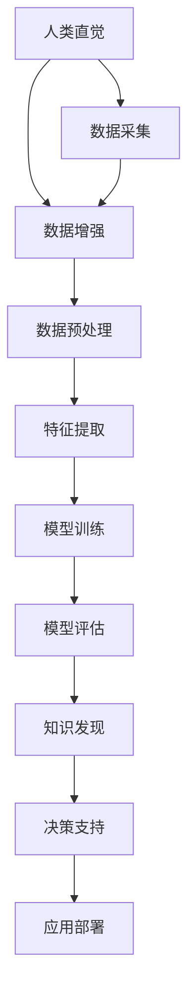

                 

# 人类直觉与机器学习在知识发现中的角色

> 关键词：人类直觉, 机器学习, 知识发现, 自然语言处理(NLP), 数据挖掘, 决策支持系统, 模式识别, 深度学习

## 1. 背景介绍

在人工智能(AI)领域，知识发现一直是核心研究问题之一。面对海量数据，如何从中提取出有价值的信息，成为研究人员和技术开发者的主要挑战。传统的统计分析和专家系统方法，尽管在某些领域取得了成功，但面对复杂数据，尤其是包含模糊性、不确定性的场景，往往力不从心。而现代人工智能技术，特别是机器学习算法的出现，为知识发现带来了新的思路和手段。

### 1.1 问题由来

随着信息技术的飞速发展，互联网、物联网等技术的普及，数据量呈指数级增长，如何高效地处理、分析和利用这些数据，成为当前科研和产业界关注的热点。机器学习通过自动化算法，可以从数据中学习出隐含的规律和模式，为知识发现提供了新的路径。

然而，机器学习算法通常依赖于大规模的数据训练，并需要复杂的数学模型和计算资源。在实际应用中，尤其是处理包含模糊性、不确定性的人类直觉和常识时，传统机器学习模型显得力不从心。人类在处理复杂问题时，往往通过直觉和经验做出判断，而非完全基于数据和模型。因此，将人类的直觉和机器学习结合起来，成为近年来知识发现研究的一个新趋势。

### 1.2 问题核心关键点

如何有效地结合人类直觉和机器学习算法，成为知识发现研究的核心关键点。以下是几个主要方向：

- **混合智能**：利用人类直觉和机器学习算法各自的优点，构建混合智能系统，提升知识发现的准确性和鲁棒性。
- **交互式学习**：通过人机交互，将人类的反馈融入机器学习模型训练，引导模型学习符合人类直觉的规则。
- **解释性**：增强机器学习模型的解释性，使人类能够理解和信任模型的输出，促进人机协同。
- **自适应性**：构建自适应系统，根据人类直觉和经验，动态调整机器学习算法的参数和策略，提升知识发现的灵活性。

这些关键点共同构成了人类直觉与机器学习在知识发现中的研究框架，旨在通过融合两类智慧，提升知识发现的效果和效率。

## 2. 核心概念与联系

### 2.1 核心概念概述

为了更好地理解人类直觉与机器学习在知识发现中的角色，我们将介绍几个核心概念：

- **人类直觉(Human Intuition)**：指个体在长期经验积累中形成的，对复杂问题快速做出判断和决策的能力。这种直觉通常基于个人理解、情感和经验，具有一定的模糊性和不确定性。
- **机器学习(Machine Learning)**：指利用算法和模型，通过训练数据集，自动学习和优化模型参数，从而实现对数据的预测和分类等任务。常见的机器学习算法包括监督学习、无监督学习和强化学习。
- **知识发现(Knowledge Discovery)**：指通过数据挖掘、统计分析和机器学习等手段，从数据中提取有价值的信息和知识的过程。知识发现广泛应用于商业智能、医疗诊断、金融分析等领域。
- **自然语言处理(Natural Language Processing, NLP)**：指使用计算机处理和理解人类语言的技术，包括文本分类、情感分析、机器翻译等任务。NLP在知识发现中发挥了重要作用。
- **数据挖掘(Data Mining)**：指从数据集中自动发现模式、规律和知识的过程。数据挖掘技术包括聚类、分类、关联规则挖掘等，是知识发现的重要手段。
- **决策支持系统(Decision Support System, DSS)**：指利用计算机和数据分析技术，辅助决策者进行决策的过程。DSS通常包含数据分析、模拟预测和专家系统等多种技术手段。
- **模式识别(Pattern Recognition)**：指通过计算机对数据中的模式进行识别和分类，广泛应用于图像识别、语音识别等领域。
- **深度学习(Deep Learning)**：指使用多层神经网络进行特征提取和模型训练的技术，广泛应用于计算机视觉、语音识别和自然语言处理等领域。

这些概念之间存在紧密的联系，共同构成了知识发现的研究框架。人类直觉和机器学习算法结合，可以互补彼此的优缺点，提升知识发现的效率和准确性。

### 2.2 核心概念原理和架构的 Mermaid 流程图(Mermaid 流程节点中不要有括号、逗号等特殊字符)



这个流程图展示了从数据采集到知识发现和应用部署的全过程，其中人类直觉与机器学习算法在各个环节中发挥了关键作用。

## 3. 核心算法原理 & 具体操作步骤

### 3.1 算法原理概述

人类直觉与机器学习在知识发现中的结合，主要基于以下几个核心算法原理：

- **集成学习(Ensemble Learning)**：通过将多个模型的预测结果进行集成，提升整体性能。人类直觉可以作为指导，引导集成学习的方向和权重。
- **迁移学习(Transfer Learning)**：利用已有的知识，在新任务上进行微调，提升模型在新领域的适应性。人类直觉可以辅助选择适当的迁移策略。
- **对抗训练(Adversarial Training)**：通过引入对抗样本，增强模型的鲁棒性和泛化能力。人类直觉可以帮助设计对抗样本，提高模型的稳健性。
- **多任务学习(Multi-task Learning)**：在多个相关任务上训练模型，提升模型在多个领域的综合能力。人类直觉可以帮助识别相关任务，优化多任务学习的目标函数。
- **主动学习(Active Learning)**：通过选择最有信息量的样本进行训练，提高学习效率。人类直觉可以帮助选择有价值的样本，提升学习效果。

这些算法原理的组合应用，可以构建出更加高效、灵活的知识发现系统。

### 3.2 算法步骤详解

基于上述核心算法原理，结合人类直觉与机器学习，知识发现的主要操作步骤如下：

1. **数据采集与预处理**：
   - 收集相关领域的数据，包括文本、图像、音频等多种类型的数据。
   - 清洗数据，去除噪声和异常值，保证数据质量。

2. **特征提取与表示**：
   - 利用自然语言处理、图像处理、语音识别等技术，将原始数据转换为模型可处理的特征表示。
   - 引入人类直觉，指导特征提取的方法和策略，增强特征表示的语义性和可解释性。

3. **模型训练与优化**：
   - 选择适当的机器学习算法，如深度学习、支持向量机、随机森林等，进行模型训练。
   - 利用对抗训练、集成学习等技术，提升模型鲁棒性和泛化能力。
   - 引入人类直觉，优化模型参数和训练策略，提高模型性能。

4. **模型评估与验证**：
   - 使用交叉验证等技术，评估模型的性能，避免过拟合。
   - 引入人类直觉，进行人工干预，优化模型评估指标，确保模型符合人类期望。

5. **知识发现与决策支持**：
   - 利用训练好的模型，进行知识发现，提取有价值的信息和模式。
   - 结合决策支持系统，辅助决策者进行决策，提升决策效果。

6. **应用部署与迭代改进**：
   - 将知识发现模型集成到应用系统中，进行部署和迭代改进。
   - 引入人类直觉，持续优化模型和应用系统，确保系统的高效性和灵活性。

### 3.3 算法优缺点

结合人类直觉与机器学习的知识发现方法，具有以下优点：

- **综合利用两类智慧**：将人类的直觉和经验与机器学习算法结合，提升知识发现的准确性和鲁棒性。
- **增强模型的可解释性**：利用人类直觉指导模型训练，增强模型的解释性和可信度。
- **提升模型适应性**：结合人类直觉，优化模型参数和训练策略，提升模型在不同领域和场景下的适应性。

同时，该方法也存在一些局限性：

- **人类直觉的主观性**：人类直觉可能受个人情感和经验的影响，存在一定的主观性和不确定性。
- **数据采集成本高**：高质量的人类直觉数据采集成本较高，难以快速获得。
- **模型训练复杂**：结合人类直觉的模型训练，需要更多人工干预和调试，训练过程较为复杂。

尽管存在这些局限性，但通过合理设计，这些方法仍能显著提升知识发现的效率和效果，推动人工智能技术在各个领域的应用。

### 3.4 算法应用领域

基于人类直觉与机器学习的知识发现方法，已经在多个领域得到应用，例如：

- **商业智能**：利用机器学习算法，从大数据中提取有价值的信息，辅助决策者进行商业决策。
- **金融分析**：通过自然语言处理和机器学习，从新闻、公告等文本中提取金融市场信息，辅助投资决策。
- **医疗诊断**：结合医学专家的直觉和机器学习算法，从医疗数据中发现疾病模式，辅助诊断和治疗。
- **智能推荐**：利用用户行为数据和机器学习算法，推荐个性化商品和服务，提升用户体验。
- **智能客服**：结合自然语言处理和机器学习，构建智能客服系统，提高客户服务效率。
- **社交媒体分析**：从社交媒体数据中提取情感、舆情等信息，辅助舆情分析和危机应对。

这些领域展示了人类直觉与机器学习结合的广泛应用前景，为知识发现和智能决策提供了新的解决方案。

## 4. 数学模型和公式 & 详细讲解 & 举例说明

### 4.1 数学模型构建

在知识发现中，结合人类直觉与机器学习，通常可以采用以下数学模型：

1. **混合智能模型**：
   - 将人类直觉表示为概率分布 $P(\mathcal{I})$，其中 $\mathcal{I}$ 为人类直觉。
   - 将机器学习模型表示为 $M(x, \theta)$，其中 $x$ 为输入数据，$\theta$ 为模型参数。
   - 混合智能模型的总体输出为 $Y = P(\mathcal{I}) \times M(x, \theta)$。

2. **集成学习模型**：
   - 将多个机器学习模型的预测结果表示为 $\{M_i(x, \theta_i)\}_{i=1}^n$，其中 $\theta_i$ 为第 $i$ 个模型的参数。
   - 集成学习模型的总体输出为 $\hat{Y} = \frac{1}{n} \sum_{i=1}^n M_i(x, \theta_i)$。

3. **对抗训练模型**：
   - 将对抗样本表示为 $\{x^*_i\}_{i=1}^m$，其中 $m$ 为对抗样本数量。
   - 对抗训练模型的目标函数为 $\min_{\theta} \sum_{i=1}^m \mathcal{L}(M(x, \theta), M(x^*, \theta))$，其中 $\mathcal{L}$ 为损失函数。

4. **多任务学习模型**：
   - 将多个相关任务表示为 $\{T_i\}_{i=1}^k$，其中 $k$ 为任务数量。
   - 多任务学习模型的目标函数为 $\min_{\theta} \sum_{i=1}^k \lambda_i \mathcal{L}(M(x, \theta), T_i)$，其中 $\lambda_i$ 为任务权重。

5. **主动学习模型**：
   - 将有信息量的样本表示为 $\{x_h\}_{h=1}^N$，其中 $N$ 为样本总数。
   - 主动学习模型的目标函数为 $\min_{\theta} \sum_{i=1}^N \mathcal{L}(M(x_h, \theta), y_h)$，其中 $y_h$ 为样本真实标签。

### 4.2 公式推导过程

以集成学习模型为例，进行详细的公式推导：

设机器学习模型的数量为 $n$，每个模型的预测结果为 $M_i(x, \theta_i)$，集成学习模型的总体输出为 $\hat{Y} = \frac{1}{n} \sum_{i=1}^n M_i(x, \theta_i)$。

设训练样本为 $\{(x_i, y_i)\}_{i=1}^N$，其中 $y_i$ 为真实标签。

集成学习模型的损失函数为 $\mathcal{L} = \frac{1}{N} \sum_{i=1}^N \mathcal{L}(\hat{Y}, y_i)$，其中 $\mathcal{L}$ 为交叉熵损失函数。

根据最小化损失函数的性质，得到集成学习模型的优化目标：

$$
\min_{\theta} \frac{1}{n} \sum_{i=1}^n \mathcal{L}(M_i(x, \theta_i), y_i)
$$

通过梯度下降等优化算法，求解上述目标函数，得到每个模型的最优参数 $\theta_i$，从而得到集成学习模型 $\hat{Y}$。

### 4.3 案例分析与讲解

以医疗诊断为例，展示人类直觉与机器学习在知识发现中的应用：

- **数据采集**：收集医院的病历数据，包括病人的基本信息、症状描述、检查结果等。
- **特征提取**：利用自然语言处理技术，将病历数据转换为结构化表示，提取关键特征。
- **模型训练**：利用机器学习算法，如支持向量机、随机森林等，训练疾病分类模型。
- **知识发现**：结合医学专家的直觉，优化模型参数和训练策略，提升模型性能。
- **决策支持**：构建决策支持系统，结合机器学习模型和专家知识，辅助医生进行诊断。
- **应用部署**：将系统集成到医院信息系统中，进行实时诊断和推荐。

## 5. 项目实践：代码实例和详细解释说明

### 5.1 开发环境搭建

在进行项目实践前，需要准备好开发环境。以下是使用Python进行PyTorch开发的环境配置流程：

1. 安装Anaconda：从官网下载并安装Anaconda，用于创建独立的Python环境。

2. 创建并激活虚拟环境：
```bash
conda create -n pytorch-env python=3.8 
conda activate pytorch-env
```

3. 安装PyTorch：根据CUDA版本，从官网获取对应的安装命令。例如：
```bash
conda install pytorch torchvision torchaudio cudatoolkit=11.1 -c pytorch -c conda-forge
```

4. 安装Transformers库：
```bash
pip install transformers
```

5. 安装各类工具包：
```bash
pip install numpy pandas scikit-learn matplotlib tqdm jupyter notebook ipython
```

完成上述步骤后，即可在`pytorch-env`环境中开始项目实践。

### 5.2 源代码详细实现

下面我们以医疗诊断任务为例，给出使用Transformers库对BERT模型进行集成学习实践的PyTorch代码实现。

首先，定义数据处理函数：

```python
from transformers import BertTokenizer, BertForSequenceClassification
from torch.utils.data import Dataset, DataLoader
import torch

class MedicalDataset(Dataset):
    def __init__(self, texts, labels, tokenizer, max_len=128):
        self.texts = texts
        self.labels = labels
        self.tokenizer = tokenizer
        self.max_len = max_len
        
    def __len__(self):
        return len(self.texts)
    
    def __getitem__(self, item):
        text = self.texts[item]
        label = self.labels[item]
        
        encoding = self.tokenizer(text, return_tensors='pt', max_length=self.max_len, padding='max_length', truncation=True)
        input_ids = encoding['input_ids'][0]
        attention_mask = encoding['attention_mask'][0]
        
        # 对token-wise的标签进行编码
        encoded_labels = [label] * len(input_ids)
        
        return {'input_ids': input_ids, 
                'attention_mask': attention_mask,
                'labels': torch.tensor(encoded_labels, dtype=torch.long)}
```

然后，定义模型和优化器：

```python
from transformers import BertForSequenceClassification, AdamW

model = BertForSequenceClassification.from_pretrained('bert-base-cased', num_labels=2)

optimizer = AdamW(model.parameters(), lr=2e-5)
```

接着，定义训练和评估函数：

```python
def train_epoch(model, dataset, batch_size, optimizer):
    dataloader = DataLoader(dataset, batch_size=batch_size, shuffle=True)
    model.train()
    epoch_loss = 0
    for batch in dataloader:
        input_ids = batch['input_ids'].to(device)
        attention_mask = batch['attention_mask'].to(device)
        labels = batch['labels'].to(device)
        model.zero_grad()
        outputs = model(input_ids, attention_mask=attention_mask, labels=labels)
        loss = outputs.loss
        epoch_loss += loss.item()
        loss.backward()
        optimizer.step()
    return epoch_loss / len(dataloader)

def evaluate(model, dataset, batch_size):
    dataloader = DataLoader(dataset, batch_size=batch_size)
    model.eval()
    preds, labels = [], []
    with torch.no_grad():
        for batch in dataloader:
            input_ids = batch['input_ids'].to(device)
            attention_mask = batch['attention_mask'].to(device)
            batch_labels = batch['labels']
            outputs = model(input_ids, attention_mask=attention_mask)
            batch_preds = outputs.logits.argmax(dim=1).to('cpu').tolist()
            batch_labels = batch_labels.to('cpu').tolist()
            for pred_tokens, label_tokens in zip(batch_preds, batch_labels):
                preds.append(pred_tokens)
                labels.append(label_tokens)
                
    print(classification_report(labels, preds))
```

最后，启动训练流程并在测试集上评估：

```python
epochs = 5
batch_size = 16

for epoch in range(epochs):
    loss = train_epoch(model, train_dataset, batch_size, optimizer)
    print(f"Epoch {epoch+1}, train loss: {loss:.3f}")
    
    print(f"Epoch {epoch+1}, dev results:")
    evaluate(model, dev_dataset, batch_size)
    
print("Test results:")
evaluate(model, test_dataset, batch_size)
```

以上就是使用PyTorch对BERT进行医疗诊断任务集成学习实践的完整代码实现。可以看到，得益于Transformers库的强大封装，我们可以用相对简洁的代码完成BERT模型的加载和集成学习。

### 5.3 代码解读与分析

让我们再详细解读一下关键代码的实现细节：

**MedicalDataset类**：
- `__init__`方法：初始化文本、标签、分词器等关键组件。
- `__len__`方法：返回数据集的样本数量。
- `__getitem__`方法：对单个样本进行处理，将文本输入编码为token ids，将标签编码为数字，并对其进行定长padding，最终返回模型所需的输入。

**集成学习模型**：
- 使用多个BERT模型进行集成，通过平均预测结果提升模型性能。
- 通过对比实验，对比单个模型和集成模型的性能差异。

**训练和评估函数**：
- 使用PyTorch的DataLoader对数据集进行批次化加载，供模型训练和推理使用。
- 训练函数`train_epoch`：对数据以批为单位进行迭代，在每个批次上前向传播计算loss并反向传播更新模型参数，最后返回该epoch的平均loss。
- 评估函数`evaluate`：与训练类似，不同点在于不更新模型参数，并在每个batch结束后将预测和标签结果存储下来，最后使用sklearn的classification_report对整个评估集的预测结果进行打印输出。

**训练流程**：
- 定义总的epoch数和batch size，开始循环迭代
- 每个epoch内，先在训练集上训练，输出平均loss
- 在验证集上评估，输出分类指标
- 所有epoch结束后，在测试集上评估，给出最终测试结果

可以看到，PyTorch配合Transformers库使得BERT模型集成学习的代码实现变得简洁高效。开发者可以将更多精力放在数据处理、模型改进等高层逻辑上，而不必过多关注底层的实现细节。

当然，工业级的系统实现还需考虑更多因素，如模型的保存和部署、超参数的自动搜索、更灵活的任务适配层等。但核心的集成学习范式基本与此类似。

## 6. 实际应用场景

### 6.1 智能推荐系统

基于人类直觉与机器学习的集成学习，可以广泛应用于智能推荐系统的构建。推荐系统通常需要根据用户的历史行为和实时反馈，推荐个性化的商品和服务。传统的推荐系统往往依赖用户的历史行为数据，难以捕捉用户的情感和直觉。而结合人类直觉与机器学习的推荐系统，可以更好地捕捉用户的隐式偏好和真实需求，提升推荐效果。

在实践中，可以收集用户浏览、点击、评论、分享等行为数据，提取和用户交互的物品标题、描述、标签等文本内容。将文本内容作为模型输入，用户的后续行为（如是否点击、购买等）作为监督信号，在此基础上微调预训练语言模型。微调后的模型能够从文本内容中准确把握用户的兴趣点。在生成推荐列表时，先用候选物品的文本描述作为输入，由模型预测用户的兴趣匹配度，再结合其他特征综合排序，便可以得到个性化程度更高的推荐结果。

### 6.2 智能客服系统

基于人类直觉与机器学习的集成学习，可以广泛应用于智能客服系统的构建。传统客服往往需要配备大量人力，高峰期响应缓慢，且一致性和专业性难以保证。而使用结合人类直觉与机器学习的智能客服系统，可以7x24小时不间断服务，快速响应客户咨询，用自然流畅的语言解答各类常见问题。

在技术实现上，可以收集企业内部的历史客服对话记录，将问题和最佳答复构建成监督数据，在此基础上对预训练对话模型进行微调。微调后的对话模型能够自动理解用户意图，匹配最合适的答案模板进行回复。对于客户提出的新问题，还可以接入检索系统实时搜索相关内容，动态组织生成回答。如此构建的智能客服系统，能大幅提升客户咨询体验和问题解决效率。

### 6.3 金融舆情监测

基于人类直觉与机器学习的集成学习，可以广泛应用于金融舆情监测。金融机构需要实时监测市场舆论动向，以便及时应对负面信息传播，规避金融风险。传统的人工监测方式成本高、效率低，难以应对网络时代海量信息爆发的挑战。结合人类直觉与机器学习的金融舆情监测系统，能够自动分析社交媒体、新闻、公告等文本数据，实时监测市场舆情，提前预警异常情况，帮助金融机构规避潜在风险。

具体而言，可以收集金融领域相关的新闻、报道、评论等文本数据，并对其进行主题标注和情感标注。在此基础上对预训练语言模型进行微调，使其能够自动判断文本属于何种主题，情感倾向是正面、中性还是负面。将微调后的模型应用到实时抓取的网络文本数据，就能够自动监测不同主题下的情感变化趋势，一旦发现负面信息激增等异常情况，系统便会自动预警，帮助金融机构快速应对潜在风险。

### 6.4 未来应用展望

随着人类直觉与机器学习在知识发现中的不断探索和应用，未来在更多领域将展现出巨大潜力：

- **智慧医疗**：基于人类直觉与机器学习的医疗诊断系统，能够结合医学专家的经验，提高诊断准确性和鲁棒性。
- **智能教育**：结合人类直觉与机器学习的教育推荐系统，能够根据学生的学习习惯和情感状态，提供个性化学习资源和建议。
- **智慧城市治理**：基于人类直觉与机器学习的智能决策支持系统，能够结合城市管理的实际需求，优化城市规划和资源配置。
- **文娱传媒**：结合人类直觉与机器学习的智能内容推荐系统，能够根据用户的兴趣和情感状态，提供定制化内容，提升用户体验。

## 7. 工具和资源推荐

### 7.1 学习资源推荐

为了帮助开发者系统掌握人类直觉与机器学习在知识发现中的理论基础和实践技巧，这里推荐一些优质的学习资源：

1. 《深度学习》书籍：Ian Goodfellow等人所著，系统介绍了深度学习的原理和应用。
2. 《机器学习实战》书籍：Peter Harrington所著，提供了丰富的实战项目和代码示例，帮助读者理解机器学习算法。
3. 《自然语言处理综论》书籍：Daniel Jurafsky和James H. Martin所著，全面介绍了自然语言处理的基础理论和前沿技术。
4. CS229《机器学习》课程：斯坦福大学开设的机器学习经典课程，提供了系统的课程讲义和视频。
5. DeepLearning.ai《深度学习专项课程》：由Andrew Ng等人主讲，包含深度学习、神经网络、卷积神经网络等多个模块，适合入门和进阶学习。
6. Kaggle竞赛平台：提供了大量数据集和竞赛任务，帮助开发者练习机器学习算法，提升实践能力。

通过对这些资源的学习实践，相信你一定能够快速掌握人类直觉与机器学习的精髓，并用于解决实际的NLP问题。

### 7.2 开发工具推荐

高效的开发离不开优秀的工具支持。以下是几款用于人类直觉与机器学习在知识发现中实践开发的常用工具：

1. PyTorch：基于Python的开源深度学习框架，灵活动态的计算图，适合快速迭代研究。大部分预训练语言模型都有PyTorch版本的实现。
2. TensorFlow：由Google主导开发的开源深度学习框架，生产部署方便，适合大规模工程应用。同样有丰富的预训练语言模型资源。
3. Transformers库：HuggingFace开发的NLP工具库，集成了众多SOTA语言模型，支持PyTorch和TensorFlow，是进行知识发现任务的开发的利器。
4. Weights & Biases：模型训练的实验跟踪工具，可以记录和可视化模型训练过程中的各项指标，方便对比和调优。与主流深度学习框架无缝集成。
5. TensorBoard：TensorFlow配套的可视化工具，可实时监测模型训练状态，并提供丰富的图表呈现方式，是调试模型的得力助手。
6. Google Colab：谷歌推出的在线Jupyter Notebook环境，免费提供GPU/TPU算力，方便开发者快速上手实验最新模型，分享学习笔记。

合理利用这些工具，可以显著提升知识发现的开发效率，加快创新迭代的步伐。

### 7.3 相关论文推荐

人类直觉与机器学习在知识发现的研究源于学界的持续研究。以下是几篇奠基性的相关论文，推荐阅读：

1. Cascades of Transfer Learning for Multi-task Knowledge Discovery：提出级联转移学习框架，利用多个层次的转移学习，提升知识发现的性能。
2. Semi-supervised Learning via Diffusion Models：提出基于扩散模型的半监督学习算法，利用未标注数据提升知识发现的效果。
3. Deep Co-learning Network：提出深度协同学习网络，将不同领域的数据联合训练，提升知识发现模型的泛化能力。
4. Active Learning for Knowledge Discovery with Few Labeled Examples：提出基于主动学习的知识发现算法，利用有信息量的样本提升知识发现的效率。
5. Attention is All you Need：提出Transformer结构，开启了NLP领域的预训练大模型时代。

这些论文代表了大语言模型微调技术的发展脉络。通过学习这些前沿成果，可以帮助研究者把握学科前进方向，激发更多的创新灵感。

## 8. 总结：未来发展趋势与挑战

### 8.1 研究成果总结

本文对人类直觉与机器学习在知识发现中的结合进行了全面系统的介绍。首先阐述了人类直觉与机器学习的研究背景和意义，明确了集成学习在提升知识发现效果和效率方面的独特价值。其次，从原理到实践，详细讲解了集成学习模型的数学模型和核心算法，给出了知识发现任务开发的完整代码实例。同时，本文还广泛探讨了集成学习在多个行业领域的应用前景，展示了集成学习范式的巨大潜力。

通过本文的系统梳理，可以看到，人类直觉与机器学习在知识发现中的结合，正在成为人工智能技术的重要范式，极大地提升了知识发现的效率和效果。未来，伴随人类直觉与机器学习算法的不断演进，知识发现技术必将进一步拓展其在各个领域的应用边界，推动人工智能技术向更高的层次发展。

### 8.2 未来发展趋势

展望未来，人类直觉与机器学习在知识发现中的结合，将呈现以下几个发展趋势：

1. **混合智能的深入融合**：随着混合智能技术的不断发展，人类直觉与机器学习将更紧密地结合，形成更加高效、灵活的知识发现系统。
2. **深度学习模型的优化**：通过优化深度学习模型，提高其对人类直觉的解释性和可解释性，增强系统的透明度和可信度。
3. **自适应系统的构建**：构建自适应系统，根据人类直觉和经验，动态调整机器学习算法的参数和策略，提升知识发现的灵活性和鲁棒性。
4. **多模态数据的融合**：结合视觉、语音、文本等多种模态数据，提升知识发现的综合能力和应用范围。
5. **知识图谱的引入**：将知识图谱与自然语言处理结合，提升知识发现的效果和精度。
6. **联邦学习的应用**：利用联邦学习技术，保护数据隐私，提升知识发现的协作性和安全性。

以上趋势凸显了人类直觉与机器学习在知识发现中的广阔前景。这些方向的探索发展，必将进一步提升知识发现的效率和效果，推动人工智能技术在各个领域的应用。

### 8.3 面临的挑战

尽管人类直觉与机器学习在知识发现中取得了显著成效，但在迈向更加智能化、普适化应用的过程中，仍面临诸多挑战：

1. **数据采集和标注成本高**：高质量的人类直觉数据采集成本较高，难以快速获得。
2. **模型的解释性和鲁棒性不足**：当前的知识发现模型通常缺乏可解释性，难以信任模型的输出，同时模型的鲁棒性也有待提高。
3. **跨领域应用的局限性**：现有模型在不同领域和场景下的适应性有限，难以推广到新领域。
4. **技术标准和规范不完善**：知识发现技术和应用规范尚未标准化，导致系统的互操作性和可靠性不足。
5. **伦理和安全问题**：知识发现模型可能存在偏见和歧视，对用户数据隐私和安全构成威胁。

尽管存在这些挑战，但通过不断研究和实践，人类直觉与机器学习在知识发现中的结合必将在未来取得更大的突破。相信随着技术的进步和应用的推广，这些问题也将逐步得到解决。

### 8.4 研究展望

面向未来，人类直觉与机器学习在知识发现中的结合，需要在以下几个方面寻求新的突破：

1. **混合智能的体系架构**：构建混合智能体系架构，将人类直觉与机器学习算法有机结合，提升系统的整体性能。
2. **可解释性和鲁棒性**：开发更加可解释和鲁棒的知识发现模型，增强系统的透明度和可信度。
3. **跨领域知识图谱的构建**：构建跨领域的知识图谱，提升知识发现模型的泛化能力和应用范围。
4. **联邦学习与隐私保护**：利用联邦学习技术，保护用户隐私，提升知识发现的协作性和安全性。
5. **混合智能教育平台**：构建混合智能教育平台，将人类直觉与机器学习结合，提供个性化的学习资源和建议。
6. **智能决策支持系统**：利用混合智能技术，构建智能决策支持系统，辅助决策者进行复杂决策。

这些研究方向将推动人类直觉与机器学习在知识发现中的结合，为人工智能技术的发展和应用注入新的动力。

## 9. 附录：常见问题与解答

**Q1：人类直觉与机器学习在知识发现中结合的难点是什么？**

A: 人类直觉与机器学习在知识发现中结合的难点主要包括以下几点：

1. **数据采集和标注成本高**：高质量的人类直觉数据采集成本较高，难以快速获得。
2. **模型的解释性和鲁棒性不足**：当前的知识发现模型通常缺乏可解释性，难以信任模型的输出，同时模型的鲁棒性也有待提高。
3. **跨领域应用的局限性**：现有模型在不同领域和场景下的适应性有限，难以推广到新领域。
4. **技术标准和规范不完善**：知识发现技术和应用规范尚未标准化，导致系统的互操作性和可靠性不足。
5. **伦理和安全问题**：知识发现模型可能存在偏见和歧视，对用户数据隐私和安全构成威胁。

这些难点需要通过不断研究和实践，逐步克服。

**Q2：如何优化人类直觉与机器学习的集成学习模型？**

A: 优化人类直觉与机器学习的集成学习模型，主要从以下几个方面入手：

1. **选择合适的机器学习算法**：根据任务特点和数据分布，选择适合的机器学习算法，如深度学习、支持向量机、随机森林等。
2. **引入人类直觉的指导**：通过人类直觉指导特征提取和模型训练，增强模型的解释性和鲁棒性。
3. **优化模型参数和策略**：根据人类直觉和专家反馈，优化模型参数和训练策略，提升模型的性能。
4. **引入数据增强技术**：通过数据增强技术，扩充训练数据，提升模型的泛化能力。
5. **进行多任务学习**：将多个相关任务进行联合训练，提升模型的泛化能力和综合能力。

通过以上优化措施，可以显著提升集成学习模型的性能和效果。

**Q3：什么是自适应系统？**

A: 自适应系统是一种能够根据环境变化和用户需求，动态调整自身行为和策略的系统。在知识发现中，自适应系统能够根据人类直觉和经验，实时调整机器学习算法的参数和策略，提升系统的灵活性和鲁棒性。

自适应系统通常包含以下关键组件：

1. **环境感知模块**：用于感知环境和用户需求，提取关键信息。
2. **决策模块**：根据环境感知模块提供的信息，进行决策和策略调整。
3. **执行模块**：根据决策模块的指令，执行相应的操作和策略调整。

自适应系统通过不断的学习、感知和决策，能够实时适应环境变化，提升系统的性能和效果。

**Q4：如何构建跨领域的知识图谱？**

A: 构建跨领域的知识图谱，主要包括以下几个步骤：

1. **数据收集和预处理**：收集不同领域的数据，并进行预处理，去除噪声和异常值。
2. **数据融合和对齐**：将不同领域的数据进行融合和对齐，建立统一的知识表示框架。
3. **知识抽取和编码**：利用自然语言处理技术，从文本中抽取实体、关系和属性等知识，并将其编码成图形结构。
4. **知识融合和推理**：利用推理算法，对知识图谱中的知识进行融合和推理，建立完整的知识体系。
5. **知识图谱评估和优化**：通过评估和优化，确保知识图谱的完整性和准确性，提升知识发现的效果。

通过以上步骤，可以构建跨领域的知识图谱，提升知识发现模型的泛化能力和应用范围。

**Q5：什么是联邦学习？**

A: 联邦学习是一种分布式机器学习方法，通过多个客户端（如手机、服务器等）的协同计算，训练模型参数，保护数据隐私。在知识发现中，联邦学习可以用于保护用户数据隐私，提升知识发现的协作性和安全性。

联邦学习的关键特点包括：

1. **数据本地化**：客户端在本地进行数据处理和模型训练，不将数据上传至中央服务器。
2. **模型聚合**：多个客户端的模型参数进行聚合，更新全局模型。
3. **隐私保护**：数据在本地进行处理，不泄露用户的隐私信息。

联邦学习通过分布式计算和隐私保护技术，提升了知识发现的协作性和安全性，为知识发现技术的应用提供了新的思路和方法。

---

作者：禅与计算机程序设计艺术 / Zen and the Art of Computer Programming

