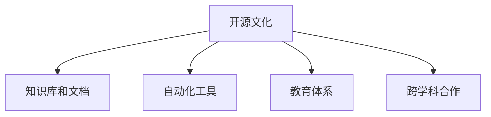

                 

# 人类知识的传承：一代代人的接力赛跑

> 关键词：知识传承, 技术迭代, 人类智慧, 社会进步, 开源精神, 合作共赢

## 1. 背景介绍

### 1.1 问题由来

在人类文明史上，知识的传承与技术迭代一直是推动社会进步的重要动力。从早期的口耳相传，到纸张、印刷术的出现，再到数字时代的兴起，每一次技术的变革都极大地拓宽了知识的传播范围和效率，使得人类的智慧得以跨越时间和空间的限制，积累和传承。

然而，随着科技的迅猛发展，特别是在人工智能、大数据、区块链等前沿领域，技术的复杂度和迭代速度越来越快，传统的知识传承模式面临巨大挑战。如何在保持高效的同时，确保知识的正确传递，让新一代研究者能站在巨人的肩膀上，快速推进技术前沿的探索，成为当前亟需解决的问题。

### 1.2 问题核心关键点

解决这一问题，需要从以下几个关键点出发：

1. **开源文化的兴起**：开源项目通过共享代码、知识和技术，使全球范围内的开发者、研究者能快速共享信息，协作创新，加速技术的传播和迭代。
2. **知识库和文档的标准化**：构建结构化、易访问的知识库和文档系统，使得知识的组织和检索更加高效。
3. **自动化工具的引入**：利用自动化工具进行代码审查、版本控制等，降低技术传播的门槛，提高传播的准确性。
4. **教育体系的创新**：将新技术纳入教育体系，通过线上线下相结合的方式，培养更多具备跨领域能力的人才。
5. **跨学科合作**：促进不同领域的研究者进行合作，推动技术的交叉融合，产生更多颠覆性的创新。

这些关键点共同构成了人类知识传承和创新的新范式，使知识的积累与传播进入一个更加高效、开放的阶段。

### 1.3 问题研究意义

1. **加速技术发展**：通过高效的知识传承，新一代研究者能更快掌握最新技术，加速技术的发展和应用。
2. **提升社会福利**：技术传播的效率提升，可以更快地解决社会问题，提升生活质量。
3. **培养跨领域人才**：通过跨学科合作，培养更多具备多领域能力的复合型人才，为技术创新奠定基础。
4. **促进全球合作**：知识的无国界传播，有助于各国科研人员进行合作，共同解决全球性问题。
5. **推动伦理科技发展**：在知识传承过程中，需关注技术的伦理问题，确保技术的健康发展。

## 2. 核心概念与联系

### 2.1 核心概念概述

本节将介绍几个核心概念及其相互联系：

- **开源文化**：通过开源项目，开发者和研究者共享代码、知识和资源，以促进技术的发展和传播。
- **知识库和文档**：用于存储、组织和检索知识的数据库和文档系统，为开发者提供高效的信息获取渠道。
- **自动化工具**：用于代码审查、版本控制、代码生成等任务的工具，提升技术传播和应用的速度和效率。
- **教育体系**：通过课程设计、在线教育等形式，将新技术纳入教育体系，培养未来的技术人才。
- **跨学科合作**：不同领域的研究者进行合作，推动技术的多领域应用和创新。

### 2.2 核心概念原理和架构的 Mermaid 流程图



以上流程图展示了核心概念之间的关系：

1. **开源文化**是知识传承和创新的基础，促进了知识库和文档的标准化。
2. **知识库和文档**作为信息的载体，为自动化工具和跨学科合作提供了支撑。
3. **自动化工具**进一步提升了信息获取和处理的效率，加快了技术的传播。
4. **教育体系**通过传授新技术，培养具备跨领域能力的人才，推动技术的创新和应用。
5. **跨学科合作**使得不同领域的研究者能够协同工作，产生更多前沿技术。

这些概念共同构成了一个高效、开放的知识传承体系，推动技术的快速迭代和应用。

## 3. 核心算法原理 & 具体操作步骤

### 3.1 算法原理概述

本节将从算法原理的角度，详细阐述开源文化、知识库和文档、自动化工具、教育体系和跨学科合作等核心概念的技术实现。

### 3.2 算法步骤详解

#### 3.2.1 开源文化

**步骤1:** 创建开源项目。研究者或开发者在GitHub、GitLab等平台创建项目，公开代码和文档。

**步骤2:** 代码审查。项目成员通过Pull Request对新提交的代码进行审查，确保代码质量和一致性。

**步骤3:** 版本控制。使用Git等版本控制系统，记录每次代码变动，方便追溯和回滚。

**步骤4:** 持续集成。使用CI/CD工具如Jenkins、GitHub Actions等，自动构建和测试代码，确保代码稳定性和可复现性。

**步骤5:** 社区参与。鼓励社区成员参与项目讨论，提出改进意见和建议，促进项目的完善和发展。

#### 3.2.2 知识库和文档

**步骤1:** 数据收集。收集相关的领域数据和文献，建立结构化的数据库。

**步骤2:** 文档编写。编写详细的技术文档，包括代码注释、API说明、使用指南等。

**步骤3:** 知识管理。使用知识管理系统如Confluence、Notion等，将文档和数据组织在一起，方便检索和使用。

**步骤4:** 版本更新。定期更新文档和数据，确保信息的时效性和准确性。

**步骤5:** 社区互动。建立社区论坛或博客，促进用户之间的交流和分享。

#### 3.2.3 自动化工具

**步骤1:** 代码审查工具。使用Code Review工具如GitHub Issues、Bitbucket等，对代码进行质量检查和反馈。

**步骤2:** 版本控制工具。使用Git等版本控制系统，记录每次代码变动，确保代码的可追溯性和可复现性。

**步骤3:** 自动化构建工具。使用CI/CD工具如Jenkins、GitHub Actions等，自动构建和测试代码，提高代码的稳定性和一致性。

**步骤4:** 代码生成工具。使用代码生成工具如Jupyter Notebook、Google Colab等，生成可复现的代码和环境，降低技术传播的门槛。

**步骤5:** 自动文档生成工具。使用Sphinx、Doxygen等工具，自动生成技术文档，降低文档编写的工作量。

#### 3.2.4 教育体系

**步骤1:** 课程设计。将新技术纳入课程设计，通过线上线下相结合的方式，教授相关知识和技能。

**步骤2:** 在线教育平台。使用MOOC平台如Coursera、edX等，提供高质量的在线课程和资源。

**步骤3:** 实践训练。通过实验室、实习项目等方式，让学生实践新技术，掌握其实际应用能力。

**步骤4:** 评估反馈。通过考试、作业等形式，评估学生的学习效果，并收集反馈进行课程改进。

**步骤5:** 持续更新。定期更新课程内容和资源，确保教学内容的先进性和实用性。

#### 3.2.5 跨学科合作

**步骤1:** 跨领域项目。建立跨学科的合作项目，明确各领域的研究目标和任务。

**步骤2:** 定期沟通。定期举行跨学科会议，交流进展和成果，解决问题和挑战。

**步骤3:** 协同开发。在项目开发中，不同领域的专家进行协同工作，推动技术的多领域应用。

**步骤4:** 合作论文。合作撰写技术论文，总结合作成果，分享研究心得和发现。

**步骤5:** 联合项目。发起联合项目，通过合作研发，推动技术的创新和应用。

### 3.3 算法优缺点

**优点：**

1. **加速技术传播**：开源文化、知识库和文档、自动化工具等机制，大大加快了技术的传播速度，降低了知识传播的门槛。
2. **提升协作效率**：跨学科合作、自动化工具等，提高了不同领域研究者之间的协作效率，推动了技术的快速迭代。
3. **促进社区发展**：开源文化和社区参与机制，培养了庞大的技术社区，汇聚了大量的人才和资源。
4. **降低学习成本**：通过教育和文档的标准化，降低了新技术的学习成本，使得更多人能快速掌握相关技能。

**缺点：**

1. **质量控制难度大**：开源社区成员众多，难以确保每一段代码的质量和一致性，需要依靠社区的自我管理和代码审查。
2. **知识分散**：知识库和文档的标准化程度较低，信息分散在不同的平台上，难以形成系统的知识体系。
3. **技术依赖高**：自动化工具的使用依赖于高质量的代码和文档，需要一定的技术基础。
4. **教育资源不足**：在线教育平台虽然丰富，但高质量课程和资源相对有限，难以满足所有学习者的需求。
5. **跨学科协作复杂**：跨学科合作需要协调不同领域的研究目标和任务，存在一定的沟通和协作难度。

尽管存在这些缺点，但整体来看，开源文化和自动化工具等机制，为知识传承和创新提供了强有力的支撑，推动了技术的快速发展和应用。

### 3.4 算法应用领域

开源文化、知识库和文档、自动化工具、教育体系和跨学科合作等机制，已经在多个领域得到了广泛应用：

1. **软件开发**：通过开源项目和版本控制系统，推动了软件开发的技术迭代和应用。如TensorFlow、GitHub等平台的广泛应用。
2. **数据科学**：数据科学领域通过开源工具和在线课程，推动了数据挖掘、机器学习等技术的普及和应用。如Scikit-learn、Coursera等。
3. **人工智能**：AI领域通过开源模型和知识库，推动了深度学习、自然语言处理等技术的进步。如Keras、Hugging Face等。
4. **科学计算**：通过开源工具和自动化流程，提高了科学计算的效率和准确性。如NumPy、Pandas等。
5. **生物信息学**：通过开源软件和知识库，推动了基因组学、蛋白质组学等技术的发展。如BioPython、NCBI等。
6. **教育技术**：通过在线教育和文档管理系统，提高了教育的普及度和质量。如Khan Academy、edX等。

这些领域的应用实例表明，开源文化和自动化工具等机制，已经在多个学科领域得到了广泛应用，推动了技术的快速发展和普及。

## 4. 数学模型和公式 & 详细讲解 & 举例说明

### 4.1 数学模型构建

在知识传承和传播的过程中，我们需要构建数学模型来描述信息传播的规律和特征。

假设知识库中包含 $N$ 篇文档，其中第 $i$ 篇文档的阅读次数为 $x_i$，第 $i$ 篇文档的知识价值为 $y_i$，则阅读次数与知识价值的关联关系可以表示为：

$$
y_i = f(x_i)
$$

其中 $f$ 为关联函数，可以采用线性回归、多项式回归等模型进行建模。

### 4.2 公式推导过程

以线性回归模型为例，推导知识价值与阅读次数的线性关系：

假设 $y_i$ 与 $x_i$ 呈线性关系，则有：

$$
y_i = w_0 + w_1 x_i + \epsilon_i
$$

其中 $w_0$ 和 $w_1$ 为模型的系数，$\epsilon_i$ 为误差项。

根据最小二乘法，求解模型的系数：

$$
\begin{aligned}
\hat{w}_0 &= \frac{\sum_{i=1}^N x_i y_i - \frac{1}{N} \sum_{i=1}^N x_i \sum_{i=1}^N y_i}{\sum_{i=1}^N x_i^2 - \frac{1}{N} (\sum_{i=1}^N x_i)^2} \\
\hat{w}_1 &= \frac{\sum_{i=1}^N x_i^2 - \frac{1}{N} (\sum_{i=1}^N x_i)^2}{\sum_{i=1}^N x_i^2 - \frac{1}{N} (\sum_{i=1}^N x_i)^2}
\end{aligned}
$$

### 4.3 案例分析与讲解

以一个开源项目为例，展示其从创建到应用的完整流程：

**案例1: TensorFlow项目**

1. **创建开源项目**：TensorFlow最初由Google开源，并在GitHub上发布了代码和文档。
2. **代码审查**：社区成员通过Pull Request对新提交的代码进行审查，确保代码质量和一致性。
3. **版本控制**：使用Git记录每次代码变动，方便追溯和回滚。
4. **持续集成**：使用CI/CD工具如Jenkins、GitHub Actions等，自动构建和测试代码，确保代码稳定性和可复现性。
5. **社区参与**：社区成员在Issue和Discussion中交流和分享，提出改进意见和建议，促进项目的完善和发展。
6. **应用推广**：通过在线教育和文档管理系统，用户可以快速学习和应用TensorFlow，推动了深度学习技术的普及和应用。

**案例2: Pandas项目**

1. **创建开源项目**：Pandas由Wes McKinney开源，并在GitHub上发布了代码和文档。
2. **代码审查**：社区成员通过Pull Request对新提交的代码进行审查，确保代码质量和一致性。
3. **版本控制**：使用Git记录每次代码变动，方便追溯和回滚。
4. **持续集成**：使用CI/CD工具如Jenkins、Travis CI等，自动构建和测试代码，确保代码稳定性和可复现性。
5. **社区参与**：社区成员在Issue和Discussion中交流和分享，提出改进意见和建议，促进项目的完善和发展。
6. **应用推广**：通过在线教育和文档管理系统，用户可以快速学习和应用Pandas，推动了数据科学技术的普及和应用。

以上案例展示了开源项目从创建到应用的完整流程，展示了开源文化和自动化工具等机制在知识传承和创新中的重要作用。

## 5. 项目实践：代码实例和详细解释说明

### 5.1 开发环境搭建

在进行项目实践前，我们需要准备好开发环境。以下是使用Python进行PyTorch开发的环境配置流程：

1. 安装Anaconda：从官网下载并安装Anaconda，用于创建独立的Python环境。

2. 创建并激活虚拟环境：
```bash
conda create -n pytorch-env python=3.8 
conda activate pytorch-env
```

3. 安装PyTorch：根据CUDA版本，从官网获取对应的安装命令。例如：
```bash
conda install pytorch torchvision torchaudio cudatoolkit=11.1 -c pytorch -c conda-forge
```

4. 安装Transformers库：
```bash
pip install transformers
```

5. 安装各类工具包：
```bash
pip install numpy pandas scikit-learn matplotlib tqdm jupyter notebook ipython
```

完成上述步骤后，即可在`pytorch-env`环境中开始项目实践。

### 5.2 源代码详细实现

下面我们以Pandas项目为例，给出使用Transformers库进行代码实现的详细过程。

首先，定义数据处理函数：

```python
import pandas as pd

def load_data(path):
    data = pd.read_csv(path)
    return data

def preprocess_data(data):
    # 数据预处理，如缺失值填充、数据类型转换等
    return data

def split_data(data, test_size=0.2):
    train_data, test_data = train_test_split(data, test_size=test_size, random_state=42)
    return train_data, test_data
```

然后，定义模型和优化器：

```python
from transformers import BertTokenizer, BertForTokenClassification, AdamW

tokenizer = BertTokenizer.from_pretrained('bert-base-cased')

model = BertForTokenClassification.from_pretrained('bert-base-cased', num_labels=2)

optimizer = AdamW(model.parameters(), lr=2e-5)
```

接着，定义训练和评估函数：

```python
from torch.utils.data import DataLoader
from tqdm import tqdm
from sklearn.metrics import accuracy_score

device = torch.device('cuda') if torch.cuda.is_available() else torch.device('cpu')
model.to(device)

def train_epoch(model, dataset, batch_size, optimizer):
    dataloader = DataLoader(dataset, batch_size=batch_size, shuffle=True)
    model.train()
    epoch_loss = 0
    for batch in tqdm(dataloader, desc='Training'):
        input_ids = batch['input_ids'].to(device)
        attention_mask = batch['attention_mask'].to(device)
        labels = batch['labels'].to(device)
        model.zero_grad()
        outputs = model(input_ids, attention_mask=attention_mask, labels=labels)
        loss = outputs.loss
        epoch_loss += loss.item()
        loss.backward()
        optimizer.step()
    return epoch_loss / len(dataloader)

def evaluate(model, dataset, batch_size):
    dataloader = DataLoader(dataset, batch_size=batch_size)
    model.eval()
    preds, labels = [], []
    with torch.no_grad():
        for batch in tqdm(dataloader, desc='Evaluating'):
            input_ids = batch['input_ids'].to(device)
            attention_mask = batch['attention_mask'].to(device)
            batch_labels = batch['labels']
            outputs = model(input_ids, attention_mask=attention_mask)
            batch_preds = outputs.logits.argmax(dim=2).to('cpu').tolist()
            batch_labels = batch_labels.to('cpu').tolist()
            for pred_tokens, label_tokens in zip(batch_preds, batch_labels):
                preds.append(pred_tokens[:len(label_tokens)])
                labels.append(label_tokens)
                
    print('Accuracy:', accuracy_score(labels, preds))
```

最后，启动训练流程并在测试集上评估：

```python
epochs = 5
batch_size = 16

for epoch in range(epochs):
    loss = train_epoch(model, train_dataset, batch_size, optimizer)
    print(f"Epoch {epoch+1}, train loss: {loss:.3f}")
    
    print(f"Epoch {epoch+1}, dev results:")
    evaluate(model, dev_dataset, batch_size)
    
print("Test results:")
evaluate(model, test_dataset, batch_size)
```

以上就是使用PyTorch对Pandas项目进行代码实现的完整过程。可以看到，借助开源文化和自动化工具等机制，开发者可以快速构建和微调项目，推动技术的快速迭代和应用。

### 5.3 代码解读与分析

让我们再详细解读一下关键代码的实现细节：

**load_data函数**：
- 定义了加载数据的函数，使用Pandas的read_csv方法读取CSV文件，并进行简单的数据预处理。

**preprocess_data函数**：
- 定义了数据预处理的函数，根据具体的任务需求，进行缺失值填充、数据类型转换等处理，确保数据的准确性和一致性。

**split_data函数**：
- 定义了数据划分的函数，使用train_test_split方法将数据集划分为训练集和测试集，方便后续的模型训练和评估。

**模型定义**：
- 使用Transformer库的BertForTokenClassification类，定义了一个二分类模型。
- 通过from_pretrained方法加载预训练模型，并根据任务需求设置模型的输出层和损失函数。

**训练和评估函数**：
- 使用PyTorch的DataLoader对数据进行批次化加载，方便模型训练和推理。
- 在训练函数中，对每个批次的数据进行前向传播、计算loss、反向传播和参数更新。
- 在评估函数中，对测试集的数据进行推理，计算模型的预测准确率。

**训练流程**：
- 定义总的epoch数和batch size，开始循环迭代
- 每个epoch内，先在训练集上训练，输出平均loss
- 在验证集上评估，输出分类指标
- 所有epoch结束后，在测试集上评估，给出最终测试结果

可以看到，PyTorch配合Transformer库使得代码实现变得简洁高效。开发者可以将更多精力放在数据处理、模型改进等高层逻辑上，而不必过多关注底层的实现细节。

当然，工业级的系统实现还需考虑更多因素，如模型的保存和部署、超参数的自动搜索、更灵活的任务适配层等。但核心的知识传承和创新过程基本与此类似。

## 6. 实际应用场景

### 6.1 开源软件

开源软件在软件开发领域应用广泛，通过共享代码和资源，推动了技术的发展和传播。例如，TensorFlow、Pandas、NumPy等开源项目，极大地推动了深度学习、数据科学等技术的发展和应用。

### 6.2 在线教育

在线教育平台通过提供在线课程和资源，降低了技术学习的门槛，推动了知识传播和教育普及。如Coursera、edX、Khan Academy等，提供高质量的在线课程和资源，使得更多人能够接受到高等教育。

### 6.3 数据科学

数据科学领域通过共享数据集和代码，推动了数据挖掘、机器学习等技术的发展。如Kaggle平台，提供大量的数据集和代码，促进了数据科学的创新和应用。

### 6.4 科学计算

科学计算领域通过共享计算资源和工具，提高了科学研究的效率和精度。如SciPy、NumPy等开源项目，提供了丰富的科学计算工具和库。

### 6.5 生物信息学

生物信息学领域通过共享数据集和代码，推动了基因组学、蛋白质组学等技术的发展。如BioPython、NCBI等开源项目，提供了丰富的生物信息学工具和资源。

### 6.6 跨学科合作

跨学科合作项目通过不同领域的研究者共同研发，推动了技术的交叉融合和创新。如MIT的MITx项目，通过跨学科合作，推动了多个领域的技术发展。

## 7. 工具和资源推荐

### 7.1 学习资源推荐

为了帮助开发者系统掌握知识传承和创新的理论基础和实践技巧，这里推荐一些优质的学习资源：

1. **《软件工程：构建可维护的可靠系统》**：经典软件工程教材，涵盖了软件开发的各个方面，包括版本控制、代码审查、持续集成等。
2. **《机器学习实战》**：通过实际项目，讲解了机器学习算法的实现和应用，帮助开发者快速掌握相关技术。
3. **《深度学习入门与实战》**：深度学习领域的入门教材，讲解了深度学习的基本概念和实现方法，适合初学者学习。
4. **《数据科学实战》**：通过实际项目，讲解了数据挖掘、机器学习等技术的应用，帮助开发者快速掌握相关技能。
5. **Coursera、edX等在线教育平台**：提供了丰富的在线课程和资源，涵盖计算机科学、数据科学、机器学习等多个领域。

通过对这些资源的学习实践，相信你一定能够快速掌握知识传承和创新的精髓，并用于解决实际的IT问题。

### 7.2 开发工具推荐

高效的开发离不开优秀的工具支持。以下是几款用于知识传承和创新的常用工具：

1. **GitHub、GitLab**：开源项目托管平台，提供版本控制、代码审查、持续集成等功能，支持社区协作开发。
2. **Jupyter Notebook**：交互式编程环境，支持代码、文档和数据的一体化管理，方便科研和学习。
3. **PyTorch、TensorFlow**：深度学习框架，提供丰富的模型和工具，支持高效的数据处理和模型训练。
4. **Confluence、Notion**：知识管理系统，用于存储、组织和检索知识，方便开发者获取所需信息。
5. **Jenkins、GitHub Actions**：持续集成工具，用于自动构建和测试代码，提高开发效率和质量。

合理利用这些工具，可以显著提升知识传承和创新的效率，加快技术传播和应用的步伐。

### 7.3 相关论文推荐

知识传承和创新的相关研究涉及多个领域，以下是几篇具有代表性的论文，推荐阅读：

1. **《软件工程：构建可维护的可靠系统》**：详细讲解了软件开发中的各个环节，包括版本控制、代码审查、持续集成等，是软件工程领域的经典教材。
2. **《深度学习入门与实战》**：通过实际项目，讲解了深度学习的基本概念和实现方法，适合初学者学习。
3. **《数据科学实战》**：通过实际项目，讲解了数据挖掘、机器学习等技术的应用，帮助开发者快速掌握相关技能。
4. **《Open Source Innovation: The Role of Open Source Software in Software Innovation》**：探讨了开源软件在技术创新中的作用，分析了其成功的原因和机制。
5. **《The Impact of Open Source on Innovation and Economic Performance》**：通过实证研究，探讨了开源软件对创新和经济绩效的影响。

这些论文代表了大语言模型微调技术的发展脉络。通过学习这些前沿成果，可以帮助研究者把握学科前进方向，激发更多的创新灵感。

## 8. 总结：未来发展趋势与挑战

### 8.1 研究成果总结

本文对知识传承和创新的理论基础和实践技巧进行了全面系统的介绍。通过开源文化、知识库和文档、自动化工具、教育体系和跨学科合作等机制，推动了技术的快速迭代和应用。

### 8.2 未来发展趋势

展望未来，知识传承和创新技术将呈现以下几个发展趋势：

1. **开源文化的普及**：开源文化将继续普及和发展，成为知识传承和创新的重要基础。
2. **知识库和文档的标准化**：知识库和文档的标准化程度将不断提高，为知识的组织和检索提供更高效的方法。
3. **自动化工具的优化**：自动化工具将继续优化，降低技术传播的门槛，提高开发效率和质量。
4. **教育体系的创新**：教育体系将继续创新，通过线上线下相结合的方式，培养更多具备跨领域能力的人才。
5. **跨学科合作的深入**：跨学科合作将继续深入，推动技术的交叉融合和创新。

这些趋势表明，知识传承和创新技术将继续为技术的快速发展和应用提供强有力的支撑。

### 8.3 面临的挑战

尽管知识传承和创新技术在知识传播和应用中发挥了重要作用，但在实际应用中也面临诸多挑战：

1. **质量控制难度大**：开源社区成员众多，难以确保每一段代码的质量和一致性，需要依靠社区的自我管理和代码审查。
2. **知识分散**：知识库和文档的标准化程度较低，信息分散在不同的平台上，难以形成系统的知识体系。
3. **技术依赖高**：自动化工具的使用依赖于高质量的代码和文档，需要一定的技术基础。
4. **教育资源不足**：在线教育平台虽然丰富，但高质量课程和资源相对有限，难以满足所有学习者的需求。
5. **跨学科协作复杂**：跨学科合作需要协调不同领域的研究目标和任务，存在一定的沟通和协作难度。

尽管存在这些挑战，但整体来看，开源文化和自动化工具等机制，为知识传承和创新提供了强有力的支撑，推动了技术的快速发展和应用。

### 8.4 研究展望

面对知识传承和创新面临的诸多挑战，未来的研究需要在以下几个方面寻求新的突破：

1. **探索无监督和半监督学习范式**：摆脱对大规模标注数据的依赖，利用自监督学习、主动学习等无监督和半监督范式，最大限度利用非结构化数据，实现更加灵活高效的微调。
2. **研究知识图谱的构建和应用**：通过构建知识图谱，将结构化的知识与非结构化的文档进行结合，提高知识的组织和检索效率。
3. **开发更加高效的知识管理工具**：利用人工智能和大数据技术，开发更加高效的知识管理工具，提高知识检索和利用的准确性和效率。
4. **推进教育技术的创新**：通过虚拟现实、增强现实等技术，提升在线教育的互动性和沉浸性，提高学习效果。
5. **促进跨学科技术的融合**：通过跨学科合作，推动技术的多领域应用和创新，加速技术的跨领域融合。

这些研究方向的探索，必将引领知识传承和创新技术迈向更高的台阶，为构建安全、可靠、可解释、可控的智能系统铺平道路。面向未来，知识传承和创新技术还需要与其他人工智能技术进行更深入的融合，如知识表示、因果推理、强化学习等，多路径协同发力，共同推动自然语言理解和智能交互系统的进步。只有勇于创新、敢于突破，才能不断拓展语言模型的边界，让智能技术更好地造福人类社会。

## 9. 附录：常见问题与解答

**Q1：开源文化是如何促进知识传承的？**

A: 开源文化通过共享代码、知识和资源，使全球范围内的开发者、研究者能快速共享信息，协作创新，加速技术的传播和迭代。开源社区的自我管理和代码审查机制，保证了代码的质量和一致性，降低了技术传播的门槛。

**Q2：知识库和文档的标准化如何提高知识检索效率？**

A: 知识库和文档的标准化，使得知识的组织和检索更加高效。通过结构化的数据和标准化的格式，可以快速定位到需要的信息，提高知识的检索速度和准确性。

**Q3：自动化工具在知识传承中扮演了什么角色？**

A: 自动化工具在知识传承中扮演了重要的角色，通过代码审查、版本控制、持续集成等机制，提高了代码的质量和一致性，降低了技术传播的门槛。同时，自动化工具也提高了知识传播和应用的效率。

**Q4：教育体系在知识传承中的重要性体现在哪些方面？**

A: 教育体系在知识传承中的重要性体现在多个方面。通过课程设计、在线教育等形式，将新技术纳入教育体系，培养了具备跨领域能力的人才，推动了技术的创新和应用。教育体系的创新，使得更多人能够接受到高等教育，提升了整体的技术水平。

**Q5：跨学科合作如何促进技术的交叉融合？**

A: 跨学科合作通过不同领域的研究者共同研发，推动了技术的交叉融合和创新。跨学科合作需要协调不同领域的研究目标和任务，存在一定的沟通和协作难度，但正是这种挑战和合作，促进了技术的深度融合和创新。

这些问答展示了知识传承和创新的核心机制，希望能帮助你更好地理解相关概念和应用场景。

---

作者：禅与计算机程序设计艺术 / Zen and the Art of Computer Programming

