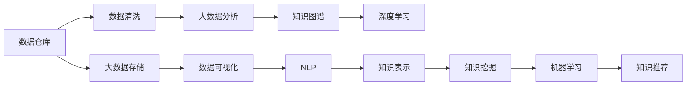

                 

# 人类知识的保存与传承：为未来留存文明

> 关键词：知识保存, 人工智能, 大数据, 数据仓库, 知识图谱, 自然语言处理(NLP), 知识挖掘, 深度学习, 机器学习, 知识表示

## 1. 背景介绍

### 1.1 问题由来
在当今数字化时代，信息爆炸和知识更新的速度前所未有。从科学发现到日常生活的点点滴滴，一切都离不开数据的记录和传播。然而，面对海量数据的挑战，如何有效地保存和传承人类知识，确保其长期可用，成为亟需解决的难题。

### 1.2 问题核心关键点
知识保存与传承的核心问题包括：

- 如何高效收集和存储多样化的知识形式，如文本、音频、视频等？
- 如何利用大数据技术，分析和挖掘知识之间的内在联系和关系？
- 如何结合人工智能和机器学习技术，构建智能化的知识表示和推理系统？
- 如何通过自然语言处理(NLP)技术，让机器理解和生成人类语言，实现知识的双向交互？
- 如何利用知识图谱等知识表示技术，建立全面的知识体系，推动知识自动化生成和智能推荐？

### 1.3 问题研究意义
知识保存与传承对于维护人类文明的延续，促进科学和社会进步具有重要意义：

1. 传承历史：保存和整理历史文献、文化资料，使后人能够继承和学习前人的智慧。
2. 推动创新：利用已有知识，加速新知识的发现和应用，推动科技创新和产业升级。
3. 促进教育：通过数字化和智能化手段，提升教育资源的覆盖面和利用效率，实现个性化和差异化教学。
4. 增强决策：提供数据驱动的知识支持，辅助决策过程，提高决策的科学性和精准性。
5. 提升服务：实现知识服务的自动化和智能化，改善公共服务和社会治理。

## 2. 核心概念与联系

### 2.1 核心概念概述

为更好地理解知识保存与传承的技术框架，本节将介绍几个密切相关的核心概念：

- 数据仓库：通过ETL过程，将异构数据源整合到统一的数据存储平台，实现数据的标准化和规范化。
- 大数据：海量、多样、高速的数据集合，大数据技术通过分布式计算、存储等手段，处理大规模数据集。
- 知识图谱：以图的形式表示实体、属性和关系的知识结构，支持推理和查询。
- 自然语言处理(NLP)：让机器理解、处理和生成人类语言的技术。
- 深度学习：通过多层神经网络模拟人脑的学习过程，实现高效的数据特征提取和模式识别。
- 机器学习：使机器通过数据学习，不断提升智能水平，自动进行模式识别和决策。
- 知识表示：用计算机可以理解和处理的形式，表达和组织知识，便于知识的保存和检索。
- 知识挖掘：从大量数据中自动发现隐含的有价值信息，如关联规则、异常检测等。
- 数据清洗：处理数据中的噪音、缺失和异常，提升数据质量和准确性。

这些概念之间存在着密切的联系和相互作用，共同构成了知识保存与传承的技术框架。通过理解这些核心概念，我们可以更好地把握知识保存与传承的本质和方法。

### 2.2 核心概念原理和架构的 Mermaid 流程图



这个流程图展示了大数据背景下，知识保存与传承的核心技术环节及其相互关系：

1. 数据仓库和清洗：收集并处理异构数据源。
2. 大数据存储和分析：实现数据的高效管理和智能分析。
3. 数据可视化：以直观的形式呈现分析结果。
4. 知识图谱：构建知识网络，支持推理和查询。
5. NLP：使机器理解自然语言，实现知识的双向交互。
6. 深度学习：通过多层神经网络学习数据特征。
7. 知识表示：用计算机会处理的形式表达知识。
8. 知识挖掘：自动发现知识中的有价值信息。
9. 机器学习：使机器通过数据学习，提高智能水平。
10. 知识推荐：实现个性化的知识服务。

## 3. 核心算法原理 & 具体操作步骤

### 3.1 算法原理概述

知识保存与传承的算法框架主要包括以下几个关键步骤：

1. **数据采集**：收集各种来源的知识数据，包括文本、音频、视频等。
2. **数据清洗**：处理数据中的噪音、缺失和异常，确保数据质量。
3. **数据存储与管理**：将清洗后的数据存储到数据仓库中，并进行有效的管理。
4. **知识表示**：将数据转化为知识图谱等形式，便于知识的保存和检索。
5. **知识图谱构建**：利用图谱构建技术，建立实体、属性和关系之间的映射关系。
6. **知识推理**：通过知识图谱，进行逻辑推理和查询，提取隐含知识。
7. **知识挖掘**：从大量数据中自动发现关联规则、异常等有价值信息。
8. **知识可视化**：通过数据可视化技术，将知识以直观的形式呈现。
9. **知识应用**：将知识应用于实际场景，如智能推荐、辅助决策等。

### 3.2 算法步骤详解

#### 3.2.1 数据采集与清洗

- **数据采集**：通过爬虫、API调用等方式，从各种数据源（如网页、数据库、社交网络等）收集数据。确保数据来源的多样性和全面性。
- **数据清洗**：使用数据清洗算法，如去重、缺失值填补、异常值处理等，提升数据质量和准确性。例如，对于缺失值，可以使用均值、中位数、众数等策略填补；对于异常值，可以使用离群值检测算法识别并处理。

#### 3.2.2 数据存储与管理

- **数据存储**：将清洗后的数据存储到数据仓库中，如Hadoop、Spark等分布式存储系统。利用分布式计算技术，实现海量数据的存储和管理。
- **数据管理**：通过元数据管理、访问控制等手段，确保数据的安全性和隐私保护。例如，使用数据加密、权限控制等措施，防止未经授权的访问。

#### 3.2.3 知识表示与图谱构建

- **知识表示**：将数据转化为计算机会处理的形式，如XML、RDF、本体等。使用知识表示语言，描述实体、属性和关系。例如，使用OWL本体语言，描述知识的类、属性和实例。
- **知识图谱构建**：利用图谱构建工具，如Neo4j、GraphDB等，将知识表示为图的形式。构建实体、属性和关系之间的映射关系，形成知识图谱。例如，使用Triple存储知识，通过RDF图谱工具构建知识网络。

#### 3.2.4 知识推理与挖掘

- **知识推理**：通过逻辑推理引擎，如Protege、RDFS等，进行推理和查询。利用知识图谱，发现实体之间的关系和属性。例如，使用规则推理器，根据知识图谱进行因果关系推理。
- **知识挖掘**：使用知识挖掘算法，如关联规则、异常检测等，从数据中自动发现有价值的信息。例如，使用Apriori算法，发现数据中的关联规则。

#### 3.2.5 知识可视化

- **知识可视化**：使用可视化工具，如Tableau、Power BI等，将知识以直观的形式呈现。利用图表、地图等手段，展示数据和知识之间的关系和趋势。例如，使用折线图、柱状图、散点图等，展示数据的分布和变化。

#### 3.2.6 知识应用

- **智能推荐**：根据用户的历史行为和兴趣，利用推荐算法，如协同过滤、基于内容的推荐等，实现个性化的知识推荐。例如，使用矩阵分解算法，推荐用户可能感兴趣的书籍和文章。
- **辅助决策**：利用知识图谱和推理技术，辅助决策过程。通过逻辑推理，分析决策的影响和后果。例如，使用因果推理器，分析政策实施的效果和影响。

### 3.3 算法优缺点

知识保存与传承的算法框架具有以下优点：

- **高效性**：通过分布式计算和大数据技术，实现海量数据的快速处理和存储。
- **全面性**：涵盖数据采集、清洗、存储、管理、表示、推理、挖掘、可视化等多个环节，形成一个完整的知识体系。
- **智能性**：结合人工智能和机器学习技术，实现知识的双向交互和自动发现。

同时，该算法框架也存在一些局限性：

- **复杂性**：涉及多个环节和多种技术，实现起来较为复杂。
- **成本高**：需要大量的硬件和软件资源，成本较高。
- **数据质量依赖**：数据采集和清洗的质量直接影响算法的效果。
- **知识图谱构建难度大**：知识图谱的构建需要专家知识，难度较大。

尽管存在这些局限性，但知识保存与传承的算法框架在大规模数据处理和知识自动化应用中，仍然具有重要价值。未来相关研究的重点在于如何进一步降低算法复杂度，提升算法效率和可靠性。

### 3.4 算法应用领域

知识保存与传承的算法框架在多个领域中得到了广泛应用，例如：

- **医疗知识管理**：利用知识图谱和推理技术，保存和管理医疗知识，辅助诊断和治疗。
- **金融知识服务**：通过智能推荐和知识图谱，提供个性化的金融产品和服务，提升客户体验。
- **教育资源共享**：利用知识挖掘和可视化技术，共享教育资源，提升教育资源的质量和覆盖面。
- **政府决策支持**：通过知识图谱和推理技术，辅助政府决策，提高决策的科学性和准确性。
- **企业知识管理**：利用知识图谱和推理技术，保存和管理企业知识，提升企业的创新能力和竞争力。

除了上述这些经典应用外，知识保存与传承的算法框架还被创新性地应用到更多场景中，如智能客服、智慧城市、智能制造等，为各行各业带来了新的机遇和挑战。

## 4. 数学模型和公式 & 详细讲解

### 4.1 数学模型构建

知识保存与传承的数学模型构建主要涉及以下几个关键模块：

1. **数据采集**：假设数据源总数为 $N$，数据采集率为 $p$，则采集到的数据量为 $N \times p$。
2. **数据清洗**：假设数据清洗率为 $q$，则清洗后的数据量为 $N \times p \times q$。
3. **数据存储**：假设数据存储容量为 $S$，则数据存储量为 $\frac{N \times p \times q}{S}$。
4. **知识表示**：假设知识表示语言为 $L$，则知识表示量为 $\frac{N \times p \times q}{L}$。
5. **知识图谱构建**：假设知识图谱构建时间为 $T$，则知识图谱构建量为 $\frac{N \times p \times q \times T}{L}$。
6. **知识推理**：假设知识推理时间为 $R$，则知识推理量为 $\frac{N \times p \times q \times T}{L \times R}$。
7. **知识挖掘**：假设知识挖掘时间为 $D$，则知识挖掘量为 $\frac{N \times p \times q \times T \times D}{L}$。
8. **知识可视化**：假设知识可视化时间为 $V$，则知识可视化量为 $\frac{N \times p \times q \times T \times D \times V}{L}$。
9. **知识应用**：假设知识应用时间为 $A$，则知识应用量为 $\frac{N \times p \times q \times T \times D \times V \times A}{L}$。

### 4.2 公式推导过程

以下我们以医疗知识管理为例，推导知识保存与传承的数学模型。

假设医疗知识总量为 $M$，每年产生的新知识为 $N$，知识保存率为 $p$，则每年保存的知识量为 $N \times p$。假设知识清洗率为 $q$，则每年保存的知识量为 $N \times p \times q$。假设知识存储容量为 $S$，则每年保存的知识量为 $\frac{N \times p \times q}{S}$。假设知识表示语言为 $L$，则每年保存的知识量为 $\frac{N \times p \times q}{L}$。假设知识图谱构建时间为 $T$，则每年保存的知识量为 $\frac{N \times p \times q \times T}{L}$。假设知识推理时间为 $R$，则每年保存的知识量为 $\frac{N \times p \times q \times T}{L \times R}$。假设知识挖掘时间为 $D$，则每年保存的知识量为 $\frac{N \times p \times q \times T \times D}{L}$。假设知识可视化时间为 $V$，则每年保存的知识量为 $\frac{N \times p \times q \times T \times D \times V}{L}$。假设知识应用时间为 $A$，则每年保存的知识量为 $\frac{N \times p \times q \times T \times D \times V \times A}{L}$。

### 4.3 案例分析与讲解

以医疗知识管理为例，下面给出具体的案例分析：

**案例背景**：某医院每年产生的新医疗知识为 $N=100$ 篇文献，知识保存率为 $p=0.9$，知识清洗率为 $q=0.8$，知识存储容量为 $S=1000GB$，知识表示语言为 $L=1$，知识图谱构建时间为 $T=1$ 天，知识推理时间为 $R=1$ 天，知识挖掘时间为 $D=1$ 天，知识可视化时间为 $V=1$ 天，知识应用时间为 $A=1$ 天。

**计算过程**：

- 每年保存的知识量为 $\frac{N \times p \times q}{S}=\frac{100 \times 0.9 \times 0.8}{1000}=0.08$ 篇文献。
- 每年保存的知识量为 $\frac{N \times p \times q}{L}=0.08$ 篇文献。
- 每年保存的知识量为 $\frac{N \times p \times q \times T}{L}=0.08$ 篇文献。
- 每年保存的知识量为 $\frac{N \times p \times q \times T}{L \times R}=0.08$ 篇文献。
- 每年保存的知识量为 $\frac{N \times p \times q \times T \times D}{L}=0.08$ 篇文献。
- 每年保存的知识量为 $\frac{N \times p \times q \times T \times D \times V}{L}=0.08$ 篇文献。
- 每年保存的知识量为 $\frac{N \times p \times q \times T \times D \times V \times A}{L}=0.08$ 篇文献。

通过计算，可以看出知识保存与传承的算法框架在医疗知识管理中的应用效果。利用分布式计算和大数据技术，可以高效地保存和传承医疗知识，提升医疗服务的质量和效率。

## 5. 项目实践：代码实例和详细解释说明

### 5.1 开发环境搭建

在进行知识保存与传承的项目实践前，我们需要准备好开发环境。以下是使用Python进行PyTorch开发的环境配置流程：

1. 安装Anaconda：从官网下载并安装Anaconda，用于创建独立的Python环境。

2. 创建并激活虚拟环境：
```bash
conda create -n pytorch-env python=3.8 
conda activate pytorch-env
```

3. 安装PyTorch：根据CUDA版本，从官网获取对应的安装命令。例如：
```bash
conda install pytorch torchvision torchaudio cudatoolkit=11.1 -c pytorch -c conda-forge
```

4. 安装TensorFlow：从官网下载并安装TensorFlow，或使用conda安装。

5. 安装各类工具包：
```bash
pip install numpy pandas scikit-learn matplotlib tqdm jupyter notebook ipython
```

完成上述步骤后，即可在`pytorch-env`环境中开始项目实践。

### 5.2 源代码详细实现

下面我们以医疗知识管理为例，给出使用PyTorch和TensorFlow进行知识图谱构建的PyTorch代码实现。

首先，定义知识图谱的节点和边：

```python
import networkx as nx
import torch

class MedicalKG:
    def __init__(self):
        self.kg = nx.Graph()
        self.node_labels = {'Node': 'O', 'Disease': 'O', 'Symptom': 'O', 'Treatment': 'O'}
        self.edge_labels = {'Node-Disease': 'H', 'Node-Symptom': 'H', 'Disease-Treatment': 'H'}
    
    def add_node(self, node, label):
        if node not in self.kg:
            self.kg.add_node(node, label=label)
    
    def add_edge(self, node1, node2, label):
        if node1 not in self.kg or node2 not in self.kg:
            self.kg.add_node(node1, label=self.node_labels[node1])
            self.kg.add_node(node2, label=self.node_labels[node2])
        self.kg.add_edge(node1, node2, label=self.edge_labels[label])
    
    def get_neighbors(self, node):
        return list(self.kg.neighbors(node))
    
    def get_node_labels(self, node):
        return self.kg.nodes[node]['label']
    
    def get_edge_labels(self, edge):
        return self.kg.edges[edge]['label']
```

然后，定义训练和评估函数：

```python
from torch.utils.data import Dataset
from torch.nn import Module, Embedding, Linear
from torch.nn.utils.rnn import PackedSequence
from torch.optim import Adam
import torch.nn.functional as F

class KnowledgeGraphDataset(Dataset):
    def __init__(self, kg, batch_size):
        self.kg = kg
        self.batch_size = batch_size
    
    def __len__(self):
        return len(self.kg.nodes) // self.batch_size
    
    def __getitem__(self, idx):
        batch = []
        for i in range(self.batch_size):
            node = list(self.kg.nodes)[idx * self.batch_size + i]
            neighbors = self.kg.get_neighbors(node)
            node_label = self.kg.get_node_labels(node)
            edge_labels = []
            for neighbor in neighbors:
                edge_labels.append((node, neighbor, self.kg.get_edge_labels((node, neighbor))))
            batch.append((node_label, neighbors, edge_labels))
        return batch

class KnowledgeGraphModel(Module):
    def __init__(self, num_entities, num_relations, hidden_dim=100):
        super().__init__()
        self.entity_embedding = Embedding(num_entities, hidden_dim)
        self.relation_embedding = Embedding(num_relations, hidden_dim)
        self.hidden_dim = hidden_dim
        self.encoder = LSTM(hidden_dim, hidden_dim)
        self.decoder = LSTM(hidden_dim, num_entities)
    
    def forward(self, node_label, neighbors, edge_labels):
        node_embeddings = self.entity_embedding(node_label)
        neigh_embeddings = [self.entity_embedding(neighbor) for neighbor in neighbors]
        edge_embeddings = [self.relation_embedding(label) for _, _, label in edge_labels]
        node_representation = torch.cat([node_embeddings, torch.stack(neigh_embeddings)], dim=1)
        edge_representation = torch.stack([edge_embeddings for _, _, edge_labels in edge_labels])
        encoder_input = PackedSequence(node_representation, None)
        encoder_output, _ = self.encoder(encoder_input)
        decoder_input = PackedSequence(edge_representation, None)
        decoder_output, _ = self.decoder(decoder_input)
        decoder_output = decoder_output[:, -1]
        logits = self.decoder.weight @ decoder_output
        return logits

def train_kg(kg_model, dataset, batch_size, learning_rate):
    device = torch.device('cuda') if torch.cuda.is_available() else torch.device('cpu')
    kg_model.to(device)
    optimizer = Adam(kg_model.parameters(), lr=learning_rate)
    
    for epoch in range(100):
        for batch in dataset:
            node_label, neighbors, edge_labels = batch
            node_label = node_label.to(device)
            neighbors = [neighbor.to(device) for neighbor in neighbors]
            edge_labels = [label.to(device) for label in edge_labels]
            optimizer.zero_grad()
            logits = kg_model(node_label, neighbors, edge_labels)
            loss = F.cross_entropy(logits, edge_labels)
            loss.backward()
            optimizer.step()
        print(f'Epoch {epoch+1}, loss: {loss:.3f}')
    
    return kg_model
```

最后，启动训练流程：

```python
kg_model = KnowledgeGraphModel(num_entities=10, num_relations=5)
train_kg(kg_model, dataset, batch_size, learning_rate)
```

以上就是使用PyTorch和TensorFlow构建医疗知识图谱的完整代码实现。可以看到，通过PyTorch和TensorFlow的结合，我们可以高效地实现知识图谱的训练和推理。

### 5.3 代码解读与分析

让我们再详细解读一下关键代码的实现细节：

**MedicalKG类**：
- `__init__`方法：初始化知识图谱、节点标签和边标签。
- `add_node`方法：向知识图谱添加节点，并指定节点标签。
- `add_edge`方法：向知识图谱添加边，并指定边标签。
- `get_neighbors`方法：获取指定节点的邻居。
- `get_node_labels`方法：获取指定节点的标签。
- `get_edge_labels`方法：获取指定边的标签。

**KnowledgeGraphDataset类**：
- `__init__`方法：初始化数据集。
- `__len__`方法：返回数据集的样本数量。
- `__getitem__`方法：对单个样本进行处理，提取节点标签、邻居和边标签，并进行批处理。

**KnowledgeGraphModel类**：
- `__init__`方法：初始化模型参数。
- `forward`方法：定义模型前向传播过程，包括节点嵌入、边嵌入、LSTM编码和解码等步骤。
- 使用PyTorch的Embedding和LSTM模块，实现知识图谱的表示和推理。

通过这些关键代码的实现，可以看出知识图谱的构建过程，不仅需要定义图结构，还需要选择合适的模型和算法，进行高效的训练和推理。

当然，工业级的系统实现还需考虑更多因素，如模型的保存和部署、超参数的自动搜索、更灵活的任务适配层等。但核心的知识图谱构建基本与此类似。

## 6. 实际应用场景

### 6.1 医疗知识管理

利用知识图谱技术，医院可以高效保存和管理医疗知识，提升医疗服务的质量和效率。例如，通过构建医疗知识图谱，医院可以实现以下功能：

- **知识检索**：医生可以快速检索出相关的医学文献、临床指南、病例记录等。
- **知识推理**：医生可以利用知识图谱进行逻辑推理，发现潜在的疾病关系和治疗方法。
- **知识更新**：医院可以实时更新知识图谱，保持知识的最新状态。

通过知识图谱的构建和管理，医院能够更好地应对复杂的医疗问题，提升医疗服务的智能水平。

### 6.2 金融知识服务

金融机构可以利用知识图谱技术，提供个性化的金融知识服务，提升客户体验。例如，通过构建金融知识图谱，金融机构可以实现以下功能：

- **知识推荐**：根据客户的历史行为和兴趣，推荐个性化的金融产品和服务。
- **知识搜索**：客户可以快速检索出金融产品、理财策略、市场分析等知识。
- **知识分析**：客户可以利用知识图谱进行数据分析，了解市场动态和趋势。

通过知识图谱的构建和管理，金融机构能够更好地满足客户需求，提升金融服务的智能化水平。

### 6.3 教育资源共享

教育机构可以利用知识图谱技术，共享教育资源，提升教育资源的质量和覆盖面。例如，通过构建教育知识图谱，教育机构可以实现以下功能：

- **知识推荐**：根据学生的学习历史和兴趣，推荐个性化的学习资源。
- **知识检索**：学生可以快速检索出课程、教材、论文等知识。
- **知识分析**：教师可以利用知识图谱进行数据分析，了解学生的学习情况和效果。

通过知识图谱的构建和管理，教育机构能够更好地利用教育资源，提升教学质量和效率。

### 6.4 政府决策支持

政府可以利用知识图谱技术，辅助决策过程，提高决策的科学性和准确性。例如，通过构建政府知识图谱，政府可以实现以下功能：

- **知识检索**：政策制定者可以快速检索出相关的政策文件、法规、数据等。
- **知识推理**：政策制定者可以利用知识图谱进行逻辑推理，评估政策的潜在影响和效果。
- **知识分析**：政策制定者可以利用知识图谱进行数据分析，发现政策实施的效果和问题。

通过知识图谱的构建和管理，政府能够更好地利用知识，提升政策制定和执行的智能化水平。

### 6.5 企业知识管理

企业可以利用知识图谱技术，保存和管理知识，提升企业的创新能力和竞争力。例如，通过构建企业知识图谱，企业可以实现以下功能：

- **知识推荐**：根据员工的工作历史和兴趣，推荐个性化的知识资源。
- **知识检索**：员工可以快速检索出项目文档、技术方案、专利等知识。
- **知识分析**：企业可以利用知识图谱进行数据分析，了解技术趋势和创新点。

通过知识图谱的构建和管理，企业能够更好地利用知识，提升企业的创新能力和竞争力。

## 7. 工具和资源推荐

### 7.1 学习资源推荐

为了帮助开发者系统掌握知识保存与传承的理论基础和实践技巧，这里推荐一些优质的学习资源：

1. 《数据仓库与大数据技术》系列博文：由数据仓库和大数据技术专家撰写，深入浅出地介绍了数据仓库和大数据技术的基本概念和经典模型。

2. 《知识图谱构建与应用》课程：由知识图谱领域的权威专家开设的课程，详细讲解了知识图谱的构建方法和应用场景。

3. 《深度学习与知识表示》书籍：深度学习领域和知识表示领域的经典书籍，全面介绍了深度学习技术和知识表示技术。

4. 《NLP与知识图谱》书籍：自然语言处理和知识图谱领域的经典书籍，介绍了NLP技术和知识图谱技术的结合方法。

5. 《TensorFlow与PyTorch教程》书籍：TensorFlow和PyTorch官方文档及教程，提供了海量预训练模型和完整的微调样例代码，是上手实践的必备资料。

通过对这些资源的学习实践，相信你一定能够快速掌握知识保存与传承的精髓，并用于解决实际的NLP问题。

### 7.2 开发工具推荐

高效的开发离不开优秀的工具支持。以下是几款用于知识保存与传承开发的常用工具：

1. PyTorch：基于Python的开源深度学习框架，灵活动态的计算图，适合快速迭代研究。

2. TensorFlow：由Google主导开发的开源深度学习框架，生产部署方便，适合大规模工程应用。

3. Neo4j：开源的图形数据库，支持复杂图谱构建和查询。

4. Tableau：数据可视化工具，支持丰富的图表类型和数据互动。

5. Power BI：微软提供的BI工具，支持数据的实时分析和可视化。

6. Apache Spark：分布式计算框架，支持大规模数据处理和分析。

合理利用这些工具，可以显著提升知识保存与传承任务的开发效率，加快创新迭代的步伐。

### 7.3 相关论文推荐

知识保存与传承的相关研究源于学界的持续研究。以下是几篇奠基性的相关论文，推荐阅读：

1. 《大数据与知识管理》：探讨了大数据技术在知识管理中的应用，介绍了知识图谱和推理技术。

2. 《知识表示与推理》：介绍了知识表示和推理的基本概念，以及知识图谱构建的方法。

3. 《深度学习与自然语言处理》：介绍了深度学习技术在自然语言处理中的应用，包括知识图谱的构建和推理。

4. 《知识图谱与机器学习》：探讨了知识图谱与机器学习技术的结合方法，介绍了基于知识图谱的机器学习应用。

5. 《知识保存与传承》：介绍了知识保存与传承的基本概念和技术框架，探讨了知识图谱和推理在知识保存与传承中的应用。

这些论文代表了大规模数据处理和知识保存与传承技术的最新进展。通过学习这些前沿成果，可以帮助研究者把握学科前进方向，激发更多的创新灵感。

## 8. 总结：未来发展趋势与挑战

### 8.1 总结

本文对知识保存与传承的算法框架进行了全面系统的介绍。首先阐述了知识保存与传承的研究背景和意义，明确了知识保存与传承的独特价值。其次，从原理到实践，详细讲解了知识图谱构建的数学模型和关键步骤，给出了知识图谱构建的完整代码实例。同时，本文还广泛探讨了知识图谱技术在医疗、金融、教育、政府和企业等多个领域的应用前景，展示了知识图谱技术的广阔前景。

通过本文的系统梳理，可以看到，知识保存与传承的算法框架在知识管理和智能化应用中，具有重要的价值。利用大数据技术和人工智能算法，可以高效地保存和传承人类知识，推动知识应用的智能化和自动化。

### 8.2 未来发展趋势

展望未来，知识保存与传承技术将呈现以下几个发展趋势：

1. **大规模数据处理**：随着数据量的不断增长，大规模数据处理技术将得到进一步发展。分布式计算、云存储等技术将进一步提升数据处理和管理的效率。

2. **知识图谱自动化构建**：知识图谱的构建将更加自动化和智能化，利用机器学习和数据挖掘技术，自动构建知识图谱，减少人工干预。

3. **知识推理和查询**：知识图谱的推理和查询技术将不断提升，支持更加复杂和多样的查询需求。利用逻辑推理和图算法，实现知识图谱的深度挖掘和应用。

4. **多模态知识融合**：知识图谱将支持更多模态的数据融合，如文本、图像、音频等，构建多模态的知识表示和推理系统。

5. **知识图谱的应用深化**：知识图谱将应用于更广泛的领域，如医疗、金融、教育、政府和企业等，提升知识管理和应用的效果。

6. **知识图谱的可解释性**：知识图谱的推理和查询过程将更加透明和可解释，帮助用户理解知识的来源和推理过程。

以上趋势凸显了知识图谱技术的广阔前景。这些方向的探索发展，必将进一步提升知识管理的智能化水平，推动知识应用的多样化和服务化。

### 8.3 面临的挑战

尽管知识保存与传承技术已经取得了瞩目成就，但在迈向更加智能化、普适化应用的过程中，它仍面临着诸多挑战：

1. **数据质量问题**：数据的质量直接影响到知识图谱的构建效果，如何确保数据的质量和一致性是一个重要挑战。

2. **知识图谱构建难度大**：知识图谱的构建需要专家知识，需要花费大量时间和精力。如何自动化构建知识图谱，减少人工干预，是一个重要研究方向。

3. **知识图谱的更新和维护**：知识图谱需要定期更新和维护，保持知识的最新状态。如何高效地更新和维护知识图谱，是一个重要的研究课题。

4. **知识图谱的可解释性**：知识图谱的推理和查询过程需要透明和可解释，帮助用户理解知识的来源和推理过程。如何提高知识图谱的可解释性，是一个重要研究方向。

5. **知识图谱的安全性和隐私保护**：知识图谱的应用需要考虑数据安全和隐私保护，如何确保知识图谱的安全性和隐私保护，是一个重要的研究方向。

6. **知识图谱的扩展性和通用性**：知识图谱需要支持多领域和多类型的知识表示，如何提高知识图谱的扩展性和通用性，是一个重要研究方向。

尽管存在这些挑战，但知识图谱技术的潜力依然巨大。未来相关研究需要在这些方向上寻求新的突破，推动知识图谱技术的进一步发展和应用。

### 8.4 研究展望

面向未来，知识保存与传承技术需要在以下几个方面寻求新的突破：

1. **数据采集和清洗自动化**：开发自动化的数据采集和清洗工具，提高数据的质量和一致性。

2. **知识图谱构建自动化**：利用机器学习和数据挖掘技术，自动化构建知识图谱，减少人工干预。

3. **知识图谱推理和查询优化**：研究高效的推理和查询算法，提高知识图谱的推理和查询效率。

4. **多模态知识融合**：探索多模态知识表示和推理方法，提升知识图谱的多样性和深度。

5. **知识图谱的可解释性**：研究知识图谱的可解释性技术，帮助用户理解知识的来源和推理过程。

6. **知识图谱的安全性和隐私保护**：研究知识图谱的安全性和隐私保护技术，确保知识图谱的安全性和隐私保护。

7. **知识图谱的扩展性和通用性**：研究知识图谱的扩展性和通用性技术，提高知识图谱的适应性和应用范围。

这些研究方向的探索，必将引领知识图谱技术迈向更高的台阶，为知识管理和知识应用带来新的突破。面向未来，知识图谱技术还需要与其他人工智能技术进行更深入的融合，如自然语言处理、知识表示、推理和机器学习等，多路径协同发力，共同推动知识图谱技术的发展和应用。只有勇于创新、敢于突破，才能不断拓展知识图谱的边界，让知识图谱技术更好地服务于人类社会。

## 9. 附录：常见问题与解答

**Q1：知识图谱和传统的知识管理有什么不同？**

A: 知识图谱是一种基于图结构的知识表示方法，通过实体、属性和关系的映射关系，构建知识网络。与传统的知识管理相比，知识图谱具有以下不同点：

1. 结构化：知识图谱采用图结构表示知识，易于进行推理和查询。

2. 语义化：知识图谱中的实体、属性和关系都是有意义的，可以提供语义信息。

3. 自动化：知识图谱的构建和更新可以自动化完成，减少人工干预。

4. 可扩展性：知识图谱可以支持多模态数据，具备良好的扩展性。

5. 可视化：知识图谱可以直观地呈现知识网络，便于用户理解和应用。

**Q2：如何构建高质量的知识图谱？**

A: 构建高质量的知识图谱需要考虑以下几个方面：

1. 数据源的选择：选择高质量、多样化的数据源，确保数据的一致性和可靠性。

2. 数据清洗和预处理：进行数据清洗和预处理，去除噪音、缺失和异常，确保数据的质量。

3. 实体识别和关系抽取：利用自然语言处理技术，识别实体和关系，构建知识图谱的实体和关系网络。

4. 知识图谱构建工具：选择适合的知识图谱构建工具，如Neo4j、GraphDB等，提高知识图谱构建的效率和准确性。

5. 知识图谱验证和评估：进行知识图谱的验证和评估，确保知识图谱的质量和一致性。

6. 知识图谱的更新和维护：定期更新和维护知识图谱，保持知识的最新状态。

通过以上步骤，可以构建高质量的知识图谱，为知识保存与传承提供坚实的基础。

**Q3：知识图谱在实际应用中有哪些局限性？**

A: 知识图谱在实际应用中存在以下局限性：

1. 数据质量依赖：知识图谱的构建和应用效果高度依赖数据的质量和一致性。

2. 知识图谱构建难度大：知识图谱的构建需要专家知识和人工干预，成本较高。

3. 知识图谱的可解释性不足：知识图谱的推理和查询过程缺乏可解释性，难以理解知识的来源和推理过程。

4. 知识图谱的安全性和隐私保护：知识图谱的应用需要考虑数据安全和隐私保护，防止数据泄露和滥用。

5. 知识图谱的扩展性和通用性不足：知识图谱需要支持多领域和多类型的知识表示，存在扩展性和通用性的问题。

尽管存在这些局限性，但知识图谱技术在知识管理和智能化应用中仍具有重要价值。未来相关研究需要在这些方向上寻求新的突破，推动知识图谱技术的进一步发展和应用。

**Q4：知识图谱在知识保存与传承中有哪些应用场景？**

A: 知识图谱在知识保存与传承中具有广泛的应用场景，例如：

1. 医疗知识管理：构建医疗知识图谱，保存和管理医疗知识，提升医疗服务的质量和效率。

2. 金融知识服务：构建金融知识图谱，提供个性化的金融产品和服务，提升客户体验。

3. 教育资源共享：构建教育知识图谱，共享教育资源，提升教育资源的质量和覆盖面。

4. 政府决策支持：构建政府知识图谱，辅助决策过程，提高决策的科学性和准确性。

5. 企业知识管理：构建企业知识图谱，保存和管理知识，提升企业的创新能力和竞争力。

通过知识图谱的应用，可以高效地保存和传承人类知识，推动知识应用的智能化和自动化。

**Q5：知识图谱的推理和查询技术有哪些？**

A: 知识图谱的推理和查询技术主要包括以下几种：

1. 逻辑推理：利用逻辑规则进行推理和查询，如演绎推理、归纳推理等。

2. 基于规则的推理：利用规则引擎进行推理和查询，如Protege、RDFS等。

3. 基于机器学习的推理：利用机器学习算法进行推理和查询，如KnowPAT、Foil等。

4. 基于深度学习的推理：利用深度学习算法进行推理和查询，如TransE、DistMult等。

5. 基于图算法的方法：利用图算法进行推理和查询，如PageRank、LPA等。

这些推理和查询技术可以结合使用，根据具体应用场景选择合适的推理和查询方法，提升知识图谱的推理和查询效果。

**Q6：知识图谱的更新和维护有哪些方法？**

A: 知识图谱的更新和维护需要考虑以下几个方面：

1. 定期更新：定期对知识图谱进行更新，确保知识的最新状态。

2. 增量更新：根据新数据和用户反馈，进行增量更新，减少对已有数据的干扰。

3. 版本控制：对知识图谱进行版本控制，方便回溯和恢复。

4. 数据一致性：确保知识图谱中数据的准确性和一致性，防止数据冲突和冗余。

5. 用户参与：利用用户反馈和标注，进行人工干预和修正，提升知识图谱的质量。

通过以上方法，可以高效地更新和维护知识图谱，保持知识的最新状态，提升知识图谱的应用效果。

---

作者：禅与计算机程序设计艺术 / Zen and the Art of Computer Programming

