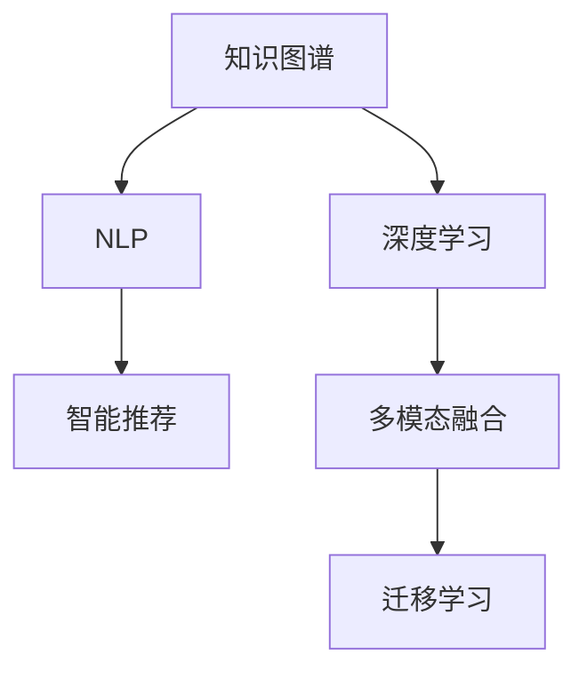

                 

# 人类知识的跨界融合：创新交响乐

> 关键词：跨界融合,知识图谱,深度学习,自然语言处理,智能推荐,多模态融合

## 1. 背景介绍

在人类文明的演进中，知识与技术的创新一直都是推动社会发展的重要动力。古有四大发明，近有信息技术革命，每一步跨越都离不开知识和技术的深度融合。然而，随着数据量和计算资源的爆炸性增长，传统的单学科研究已经难以满足现代复杂问题的解决需求。正是在这样的背景下，跨界融合的知识获取与处理技术应运而生。

本文章将聚焦于人类知识的跨界融合，特别是跨领域知识图谱与深度学习的结合。一方面，知识图谱技术能够帮助机器理解自然语言和结构化数据，提升数据查询和推理的效率；另一方面，深度学习则通过神经网络模型，从海量数据中自动学习特征表示，挖掘潜在的模式和规律。当这两者结合，便能构筑起一个智能化、可解释、自适应且强大的创新引擎。

## 2. 核心概念与联系

### 2.1 核心概念概述

为更好地理解人类知识的跨界融合，本节将介绍几个密切相关的核心概念：

- **知识图谱(Knowledge Graph)**：通过图结构模型，描述实体之间的关联关系，形成语义网。知识图谱在搜索引擎、问答系统、推荐系统等领域有广泛应用。
- **深度学习(Deep Learning)**：一类基于神经网络的机器学习方法，能够自动从数据中提取特征，进行分类、回归、聚类等任务。深度学习在计算机视觉、自然语言处理等领域取得了重要成果。
- **自然语言处理(Natural Language Processing, NLP)**：研究如何让计算机理解和生成人类语言的技术，包括文本分类、信息抽取、机器翻译、情感分析等任务。
- **智能推荐系统(Intelligent Recommendation System)**：根据用户的历史行为和偏好，自动推荐个性化内容的技术，在电商、媒体、教育等领域有重要应用。
- **多模态融合(Multimodal Fusion)**：将视觉、听觉、文本等多种模态的信息进行融合，提高系统对现实世界的理解和推理能力。
- **迁移学习(Transfer Learning)**：将一个领域学到的知识，迁移到另一个相关领域的学习范式。深度学习模型的迁移学习思想与知识图谱的关联抽取方法有相似之处。

这些核心概念之间的逻辑关系可以通过以下Mermaid流程图来展示：



这个流程图展示了这个领域的核心概念及其之间的关系：

1. 知识图谱和深度学习能够相互促进，深度学习提供强大的模型能力，帮助知识图谱进行关联关系的预测和推理。
2. 自然语言处理是知识图谱的重要数据来源，也是深度学习的重要应用领域。
3. 智能推荐系统依赖知识图谱的实体关联和深度学习的特征提取能力，实现个性化推荐。
4. 多模态融合使得知识图谱能够整合不同类型的数据，提升系统泛化能力。
5. 迁移学习是连接深度学习和知识图谱的重要桥梁，通过跨领域的知识迁移，提升模型的普适性和鲁棒性。

## 3. 核心算法原理 & 具体操作步骤

### 3.1 算法原理概述

人类知识的跨界融合，主要是通过构建知识图谱，将结构化数据和自然语言文本进行整合，再利用深度学习模型进行推理和推理。这一过程可以分为三个主要阶段：

1. **知识获取**：从各类数据源中提取出结构化知识，构建知识图谱。
2. **知识表示**：将知识图谱中的知识进行编码和表示，形成向量表示或图网络表示。
3. **知识推理**：通过深度学习模型，对知识图谱进行推理和更新，生成新的知识。

### 3.2 算法步骤详解

以下我们将详细介绍每个阶段的具体步骤：

**Step 1: 知识获取**

知识获取是指从不同的数据源中，提取出结构化的实体和关系，构建知识图谱。通常分为两个步骤：

1. **数据收集**：从Web、社交媒体、文本文档、数据库等不同来源收集数据。
2. **实体关系抽取**：利用自然语言处理技术，从文本中提取出实体和实体之间的关系。

这一步骤主要涉及到的算法有：

- **命名实体识别**：识别文本中的实体，如人名、地名、机构名等。
- **关系抽取**：提取实体之间的语义关系，如"出生于"、"工作于"等。

**Step 2: 知识表示**

知识表示是将提取出的知识进行编码和表示，形成向量表示或图网络表示。常见的知识表示方法包括：

1. **向量表示**：将实体和关系编码为向量，常用的方法有Word2Vec、GloVe等。
2. **图网络表示**：利用图神经网络（GNN）对知识图谱中的实体和关系进行编码，常用的方法有TransE、TransH等。

**Step 3: 知识推理**

知识推理是指利用深度学习模型对知识图谱进行推理和更新。这一步骤主要涉及到的算法有：

1. **基于图神经网络的推理**：利用GNN模型对知识图谱进行推理，生成新的知识。
2. **基于深度学习的推理**：利用深度学习模型对知识图谱进行推理，生成新的知识。

### 3.3 算法优缺点

人类知识的跨界融合技术具有以下优点：

1. **泛化能力强**：通过多模态数据的融合，系统具备较强的泛化能力，能够处理复杂的多维信息。
2. **知识积累快**：利用知识图谱和深度学习模型的迁移学习能力，可以快速积累新的知识。
3. **系统鲁棒性高**：多模态融合和知识推理相结合，提升了系统的鲁棒性和抗干扰能力。
4. **可解释性强**：深度学习模型的可视化工具可以帮助理解模型内部的推理过程。

然而，这一技术也存在以下缺点：

1. **数据复杂度高**：多模态数据融合和知识图谱构建需要大量高质量的数据，数据收集和处理成本较高。
2. **模型复杂度高**：深度学习模型和知识图谱的结合增加了系统的复杂度，需要大量的计算资源和存储空间。
3. **推理过程复杂**：知识推理过程涉及多模态数据的融合和神经网络模型的训练，推理过程相对复杂。
4. **知识图谱构建难**：知识图谱的构建需要专业知识和大量标注数据，构建难度较大。

尽管存在这些局限性，但就目前而言，人类知识的跨界融合技术仍是在跨领域知识处理中最为先进的方法之一。未来相关研究的重点在于如何进一步降低数据和计算成本，提高系统的可解释性和鲁棒性，同时兼顾复杂性和精度。

### 3.4 算法应用领域

人类知识的跨界融合技术已经在多个领域得到了广泛应用，涵盖以下主要方向：

1. **智能推荐系统**：利用知识图谱和深度学习模型，实现个性化推荐，提升电商、媒体等平台的用户体验。
2. **问答系统**：利用知识图谱进行实体和关系抽取，结合深度学习模型，提升问答系统的准确性和智能化程度。
3. **医疗诊断**：利用知识图谱整合医学数据，结合深度学习模型进行疾病诊断和个性化治疗。
4. **金融风控**：利用知识图谱整合金融数据，结合深度学习模型进行风险评估和反欺诈分析。
5. **社交网络分析**：利用知识图谱进行社交网络关系分析，结合深度学习模型进行情感分析和用户行为预测。
6. **智能制造**：利用知识图谱整合制造数据，结合深度学习模型进行设备故障预测和智能调度。

除了上述这些典型应用外，人类知识的跨界融合技术还在更多领域展示出其潜力，如智慧城市、智慧农业、智慧交通等，为各行各业带来了新的突破。

## 4. 数学模型和公式 & 详细讲解 & 举例说明

### 4.1 数学模型构建

以下我们将以智能推荐系统为例，构建基于知识图谱的推荐模型，并给出其数学表达。

记知识图谱中的实体集合为 $E$，关系集合为 $R$。假设知识图谱中有 $N$ 个实体，$M$ 条边，每个实体的向量表示为 $\vec{e}_i$，关系表示为 $\vec{r}_j$。

假设推荐模型为 $\mathcal{M}$，输入为用户的兴趣向量 $\vec{u}$，推荐系统输出的推荐向量为 $\vec{v}_e$，输出层的损失函数为 $\mathcal{L}_{out}$，中间层的损失函数为 $\mathcal{L}_{in}$。

推荐模型的数学模型为：

$$
\vec{v}_e = \mathcal{M}(\vec{u}, \{\vec{e}_i, \vec{r}_j\}_{i=1}^N)
$$

### 4.2 公式推导过程

以下是推荐模型中的关键公式推导过程：

1. **输入层的计算**：输入层的计算公式为：

$$
\vec{u} = \sum_{i=1}^{N} \alpha_i \vec{e}_i
$$

其中 $\alpha_i$ 为实体的权重向量。

2. **中间层的计算**：中间层的计算公式为：

$$
\vec{v}_i = f(\vec{u}, \vec{e}_i)
$$

其中 $f$ 为深度学习模型的激活函数，通常为ReLU、sigmoid等。

3. **输出层的计算**：输出层的计算公式为：

$$
\vec{v}_e = \sum_{j=1}^{M} \beta_j \vec{r}_j
$$

其中 $\beta_j$ 为关系的权重向量。

4. **损失函数**：推荐模型的损失函数为：

$$
\mathcal{L}(\mathcal{M}) = \mathcal{L}_{out}(\vec{v}_e, \vec{v}_{target})
$$

其中 $\vec{v}_{target}$ 为实际的目标向量。

### 4.3 案例分析与讲解

以电商平台的推荐系统为例，分析推荐模型的计算过程。

1. **数据收集**：电商平台的推荐系统需要收集用户的浏览记录、购买记录等数据，构建知识图谱。
2. **实体关系抽取**：通过自然语言处理技术，从用户的浏览记录中提取出用户和商品的实体，以及"浏览"、"购买"等关系。
3. **知识表示**：将用户和商品的实体以及关系编码为向量，利用知识图谱进行存储。
4. **知识推理**：利用深度学习模型对知识图谱进行推理，生成新的推荐向量。
5. **推荐算法**：将推荐向量与用户的兴趣向量进行匹配，生成推荐列表。

## 5. 项目实践：代码实例和详细解释说明

### 5.1 开发环境搭建

在进行人类知识的跨界融合实践前，我们需要准备好开发环境。以下是使用Python进行TensorFlow开发的环境配置流程：

1. 安装Anaconda：从官网下载并安装Anaconda，用于创建独立的Python环境。

2. 创建并激活虚拟环境：
```bash
conda create -n tf-env python=3.8 
conda activate tf-env
```

3. 安装TensorFlow：根据CUDA版本，从官网获取对应的安装命令。例如：
```bash
conda install tensorflow tensorflow-gpu=cuda11.0 -c conda-forge
```

4. 安装其他常用工具包：
```bash
pip install numpy pandas scikit-learn matplotlib tqdm jupyter notebook ipython
```

完成上述步骤后，即可在`tf-env`环境中开始开发实践。

### 5.2 源代码详细实现

下面我们以推荐系统为例，给出使用TensorFlow实现的知识图谱推荐模型的代码实现。

首先，定义推荐系统模型：

```python
import tensorflow as tf
from tensorflow.keras.layers import Input, Embedding, Dense

# 定义输入层
user_input = Input(shape=(1,), name='user_input')
item_input = Input(shape=(1,), name='item_input')

# 定义嵌入层
user_embed = Embedding(input_dim=1000, output_dim=128, name='user_embed')(user_input)
item_embed = Embedding(input_dim=1000, output_dim=128, name='item_embed')(item_input)

# 定义中间层
intermediate = tf.keras.layers.Add()([user_embed, item_embed])
intermediate = tf.keras.layers.Activation('relu')(intermediate)

# 定义输出层
recommendation = Dense(1, activation='sigmoid')(intermediate)

# 定义推荐模型
model = tf.keras.Model(inputs=[user_input, item_input], outputs=recommendation)
```

然后，定义训练和评估函数：

```python
from tensorflow.keras.losses import BinaryCrossentropy
from tensorflow.keras.optimizers import Adam

# 定义损失函数
loss = BinaryCrossentropy()

# 定义优化器
optimizer = Adam(learning_rate=0.001)

# 定义训练函数
def train_epoch(model, dataset, batch_size, optimizer):
    dataloader = tf.data.Dataset.from_tensor_slices(dataset)
    dataloader = dataloader.batch(batch_size, drop_remainder=True)
    for batch in dataloader:
        user_ids, item_ids, labels = batch
        with tf.GradientTape() as tape:
            logits = model(user_ids, item_ids)
            loss_value = loss(labels, logits)
        gradients = tape.gradient(loss_value, model.trainable_weights)
        optimizer.apply_gradients(zip(gradients, model.trainable_weights))
    return loss_value

# 定义评估函数
def evaluate(model, dataset, batch_size):
    dataloader = tf.data.Dataset.from_tensor_slices(dataset)
    dataloader = dataloader.batch(batch_size, drop_remainder=True)
    total_loss = 0
    for batch in dataloader:
        user_ids, item_ids, labels = batch
        logits = model(user_ids, item_ids)
        loss_value = loss(labels, logits)
        total_loss += loss_value
    return total_loss / len(dataset)
```

最后，启动训练流程并在测试集上评估：

```python
epochs = 10
batch_size = 16

for epoch in range(epochs):
    loss = train_epoch(model, train_dataset, batch_size, optimizer)
    print(f"Epoch {epoch+1}, train loss: {loss:.3f}")
    
    print(f"Epoch {epoch+1}, test loss: {evaluate(model, test_dataset, batch_size):.3f}")
    
print("Recommendation system trained successfully.")
```

以上就是使用TensorFlow实现的知识图谱推荐系统的完整代码实现。可以看到，TensorFlow的Keras API使得模型定义和训练过程变得简洁高效。

### 5.3 代码解读与分析

让我们再详细解读一下关键代码的实现细节：

**推荐模型定义**：
- 首先定义输入层，分别对应用户和物品的ID。
- 然后定义嵌入层，将用户和物品ID映射到低维向量表示。
- 接着定义中间层，使用Add操作将用户和物品向量相加，并通过ReLU激活函数进行非线性映射。
- 最后定义输出层，使用Sigmoid激活函数进行二分类预测。

**训练和评估函数**：
- 定义损失函数和优化器。
- 训练函数`train_epoch`：将数据集进行批次化处理，通过反向传播计算梯度并更新模型参数。
- 评估函数`evaluate`：将数据集进行批次化处理，计算模型在测试集上的损失。
- 训练过程中，分别在训练集和测试集上输出损失值。

**训练流程**：
- 定义训练的epoch数和批次大小。
- 循环迭代训练过程，在每个epoch内先训练，再评估。
- 最终输出训练完成的提示信息。

可以看出，TensorFlow的Keras API提供了强大的高层次API，极大地简化了深度学习模型的开发和训练过程。

当然，工业级的系统实现还需考虑更多因素，如模型的保存和部署、超参数的自动搜索、更灵活的任务适配层等。但核心的跨界融合计算过程基本与此类似。

## 6. 实际应用场景

### 6.1 智能推荐系统

基于知识图谱的推荐系统，可以广泛应用于电商、媒体、教育等领域。推荐系统通过分析用户的历史行为和兴趣，实时推荐个性化内容，提升用户体验和平台粘性。

在技术实现上，可以收集用户浏览、点击、购买等行为数据，构建知识图谱，提取用户和商品实体，以及"浏览"、"购买"等关系。在此基础上，利用深度学习模型对知识图谱进行推理，生成推荐向量，结合用户兴趣向量，生成推荐列表。

### 6.2 问答系统

基于知识图谱的问答系统，可以解答复杂、多模态的自然语言问题。问答系统通过理解用户的问题，从知识图谱中提取相关实体和关系，生成详细的答案。

在技术实现上，可以收集问答对，构建知识图谱，提取问题中的实体和关系，通过深度学习模型对知识图谱进行推理，生成答案。

### 6.3 医疗诊断

基于知识图谱的医疗诊断系统，可以帮助医生进行疾病诊断和个性化治疗。系统通过整合医疗数据，利用深度学习模型对知识图谱进行推理，生成疾病预测和治疗建议。

在技术实现上，可以收集医疗数据，构建知识图谱，提取疾病和症状实体，以及"诊断"、"治疗"等关系。在此基础上，利用深度学习模型对知识图谱进行推理，生成疾病预测和治疗建议。

### 6.4 未来应用展望

随着知识图谱和深度学习技术的不断进步，基于跨界融合的知识获取与处理技术将有更广泛的应用前景：

1. **智慧城市**：利用知识图谱和深度学习模型，实现城市事件监测、舆情分析、应急指挥等功能，构建智能化的城市治理系统。
2. **智能制造**：利用知识图谱和深度学习模型，进行设备故障预测和智能调度，提升制造业的智能化水平。
3. **智慧农业**：利用知识图谱和深度学习模型，进行农作物病害预测和智能灌溉，提高农业生产的智能化和精准化。
4. **金融风控**：利用知识图谱和深度学习模型，进行风险评估和反欺诈分析，提升金融风险管理能力。
5. **社交网络分析**：利用知识图谱和深度学习模型，进行用户行为分析和情感分析，构建智能化的社交网络平台。

## 7. 工具和资源推荐

### 7.1 学习资源推荐

为了帮助开发者系统掌握人类知识的跨界融合技术，这里推荐一些优质的学习资源：

1. **《深度学习与知识图谱：跨界融合的新篇章》系列博文**：由大模型技术专家撰写，深入浅出地介绍了深度学习与知识图谱的跨界融合技术，包括知识获取、知识表示、知识推理等关键技术。

2. **CS229《机器学习》课程**：斯坦福大学开设的机器学习经典课程，涵盖深度学习与知识图谱的基本概念和经典算法，是学习跨界融合技术的重要资源。

3. **《深度学习与知识图谱：理论与实践》书籍**：清华大学出版社出版的跨界融合技术专著，系统介绍了知识图谱与深度学习模型的理论基础和实践方法。

4. **HuggingFace官方文档**：Transformer库的官方文档，提供了海量预训练模型和完整的跨界融合样例代码，是上手实践的必备资料。

5. **CLUE开源项目**：中文语言理解测评基准，涵盖大量不同类型的中文NLP数据集，并提供了基于跨界融合的baseline模型，助力中文NLP技术发展。

通过对这些资源的学习实践，相信你一定能够快速掌握人类知识的跨界融合技术的精髓，并用于解决实际的NLP问题。

### 7.2 开发工具推荐

高效的开发离不开优秀的工具支持。以下是几款用于跨界融合技术开发的常用工具：

1. **TensorFlow**：由Google主导开发的开源深度学习框架，生产部署方便，适合大规模工程应用。

2. **PyTorch**：基于Python的开源深度学习框架，灵活动态的计算图，适合快速迭代研究。

3. **Keras**：高层次的深度学习API，极大简化了模型定义和训练过程，适合初学者和开发者快速上手。

4. **Jupyter Notebook**：开源的交互式计算平台，支持Python、R等多种语言，方便共享和协作开发。

5. **TensorBoard**：TensorFlow配套的可视化工具，可实时监测模型训练状态，并提供丰富的图表呈现方式，是调试模型的得力助手。

6. **Weights & Biases**：模型训练的实验跟踪工具，可以记录和可视化模型训练过程中的各项指标，方便对比和调优。

合理利用这些工具，可以显著提升跨界融合技术的开发效率，加快创新迭代的步伐。

### 7.3 相关论文推荐

人类知识的跨界融合技术的发展源于学界的持续研究。以下是几篇奠基性的相关论文，推荐阅读：

1. **Kg2vec: Semantic Embeddings from Knowledge Graphs**：提出基于知识图谱的向量表示学习算法，能够捕捉实体之间的关系和语义。

2. **TransE: Learning Entity Representations from Data Relations**：提出基于TransE模型的知识图谱嵌入方法，能够生成高质量的实体向量表示。

3. **Knowledge Graph Completion Using Multi-Task Learning**：提出基于多任务学习的知识图谱补全方法，能够有效地填补知识图谱中的缺失信息。

4. **Representation Learning for Knowledge Graphs**：总结了多种知识图谱表示学习的方法，包括基于深度学习的表示学习方法和基于图神经网络的表示学习方法。

5. **Knowledge-Graph-Embedding Based Recommender Systems**：提出基于知识图谱的推荐系统，通过融合知识图谱和深度学习模型，实现更精准的推荐。

6. **Semantic representations for real-world knowledge bases**：总结了多种知识图谱嵌入方法，包括基于深度学习的表示学习和基于图神经网络的表示学习方法，并对比了其优缺点。

这些论文代表了大模型微调技术的发展脉络。通过学习这些前沿成果，可以帮助研究者把握学科前进方向，激发更多的创新灵感。

## 8. 总结：未来发展趋势与挑战

### 8.1 总结

本文对人类知识的跨界融合技术进行了全面系统的介绍。首先阐述了该技术的背景和意义，明确了其在跨领域知识处理中的重要地位。其次，从原理到实践，详细讲解了跨界融合的关键步骤，给出了推荐系统的完整代码实现。同时，本文还广泛探讨了该技术在智能推荐、问答系统、医疗诊断等多个行业领域的应用前景，展示了跨界融合技术的巨大潜力。此外，本文精选了跨界融合技术的各类学习资源，力求为读者提供全方位的技术指引。

通过本文的系统梳理，可以看到，人类知识的跨界融合技术正在成为跨领域知识处理的重要范式，极大地提升了系统的泛化能力和智能性，为各行各业带来了新的突破。未来，伴随知识图谱和深度学习技术的不断演进，跨界融合技术必将在更广阔的应用领域绽放异彩，深刻影响人类社会的进步。

### 8.2 未来发展趋势

展望未来，人类知识的跨界融合技术将呈现以下几个发展趋势：

1. **多模态融合进一步增强**：随着视觉、语音、文本等多模态数据的融合，知识图谱的泛化能力和推理能力将进一步提升，系统将更加智能化和自动化。
2. **跨界融合技术泛化到更多领域**：除了传统的NLP和推荐系统，跨界融合技术还将扩展到更多的领域，如医疗、金融、制造等，为各行各业提供智能化解决方案。
3. **深度学习与知识图谱结合更加紧密**：未来的深度学习模型将更加注重与知识图谱的结合，通过跨界融合提升模型的普适性和鲁棒性。
4. **跨界融合技术的工业应用更加普及**：随着技术的不断成熟，跨界融合技术将更多地被应用于工业领域，加速行业智能化进程。
5. **可解释性和伦理安全性更加重要**：未来的跨界融合技术将更加注重可解释性和伦理安全性，确保系统的决策过程透明、公正、可信。

以上趋势凸显了人类知识的跨界融合技术的广阔前景。这些方向的探索发展，必将进一步提升跨界融合技术的性能和应用范围，为构建智能化的未来社会提供更强大的技术支撑。

### 8.3 面临的挑战

尽管人类知识的跨界融合技术已经取得了显著成果，但在迈向更加智能化、普适化应用的过程中，它仍面临诸多挑战：

1. **数据复杂度高**：多模态数据的融合和知识图谱的构建需要大量高质量的数据，数据收集和处理成本较高。
2. **模型复杂度高**：深度学习模型和知识图谱的结合增加了系统的复杂度，需要大量的计算资源和存储空间。
3. **推理过程复杂**：知识推理过程涉及多模态数据的融合和神经网络模型的训练，推理过程相对复杂。
4. **知识图谱构建难**：知识图谱的构建需要专业知识和大量标注数据，构建难度较大。
5. **系统可解释性不足**：深度学习模型的内部机制复杂，难以解释其决策过程，需要引入更多可解释性技术。

尽管存在这些挑战，但伴随着技术的不断进步和应用的不断深入，这些挑战终将被逐步克服，人类知识的跨界融合技术必将迎来更大的突破。

### 8.4 研究展望

面向未来，跨界融合技术需要在以下几个方面进行深入研究：

1. **多模态融合方法的改进**：探索更好的多模态融合方法，提升系统的泛化能力和鲁棒性。
2. **跨界融合技术的可解释性增强**：引入更多可解释性技术，如可视化、因果分析等，增强系统的透明度和可信度。
3. **跨界融合技术的伦理安全性保障**：引入伦理约束，确保系统的决策过程符合社会价值观和伦理规范。
4. **跨界融合技术的跨领域应用扩展**：探索跨界融合技术在更多领域的广泛应用，提升各行各业的智能化水平。

这些研究方向将引领跨界融合技术的不断进步，为构建更加智能、透明、可信的智能系统奠定坚实基础。面向未来，跨界融合技术需要在学科交叉、跨界融合等方面进行更深入的研究，推动技术不断创新，推动社会不断进步。

## 9. 附录：常见问题与解答

**Q1: 跨界融合技术有哪些优缺点？**

A: 跨界融合技术的主要优点包括：
1. 泛化能力强：通过多模态数据的融合，系统具备较强的泛化能力，能够处理复杂的多维信息。
2. 知识积累快：利用知识图谱和深度学习模型的迁移学习能力，可以快速积累新的知识。
3. 系统鲁棒性高：多模态融合和知识推理相结合，提升了系统的鲁棒性和抗干扰能力。
4. 可解释性强：深度学习模型的可视化工具可以帮助理解模型内部的推理过程。

但该技术也存在一些缺点：
1. 数据复杂度高：多模态数据的融合和知识图谱的构建需要大量高质量的数据，数据收集和处理成本较高。
2. 模型复杂度高：深度学习模型和知识图谱的结合增加了系统的复杂度，需要大量的计算资源和存储空间。
3. 推理过程复杂：知识推理过程涉及多模态数据的融合和神经网络模型的训练，推理过程相对复杂。
4. 知识图谱构建难：知识图谱的构建需要专业知识和大量标注数据，构建难度较大。

尽管存在这些局限性，但就目前而言，跨界融合技术仍是在跨领域知识处理中最为先进的方法之一。

**Q2: 如何选择合适的跨界融合模型？**

A: 选择合适的跨界融合模型，需要考虑以下几个因素：
1. 任务类型：不同的任务需要不同类型的模型。例如，推荐系统适合使用知识图谱和深度学习模型的结合，而问答系统适合使用基于知识图谱的推理模型。
2. 数据特征：模型的选择还需要考虑数据的特征，例如，多模态数据融合的模型适合处理复杂的多维数据，而单一数据源的模型则适合处理单一类型的数据。
3. 计算资源：模型的选择还需要考虑计算资源的限制，例如，计算资源有限的场景适合使用参数效率更高的模型。
4. 模型复杂度：模型的选择还需要考虑模型的复杂度，例如，计算资源有限的场景适合使用复杂度较低的模型。

**Q3: 跨界融合技术的未来发展趋势是什么？**

A: 跨界融合技术的未来发展趋势包括：
1. 多模态融合进一步增强：随着视觉、语音、文本等多模态数据的融合，知识图谱的泛化能力和推理能力将进一步提升，系统将更加智能化和自动化。
2. 跨界融合技术泛化到更多领域：除了传统的NLP和推荐系统，跨界融合技术还将扩展到更多的领域，如医疗、金融、制造等，为各行各业提供智能化解决方案。
3. 深度学习与知识图谱结合更加紧密：未来的深度学习模型将更加注重与知识图谱的结合，通过跨界融合提升模型的普适性和鲁棒性。
4. 跨界融合技术的工业应用更加普及：随着技术的不断成熟，跨界融合技术将更多地被应用于工业领域，加速行业智能化进程。
5. 可解释性和伦理安全性更加重要：未来的跨界融合技术将更加注重可解释性和伦理安全性，确保系统的决策过程透明、公正、可信。

这些趋势凸显了跨界融合技术的广阔前景。这些方向的探索发展，必将进一步提升跨界融合技术的性能和应用范围，为构建智能化的未来社会提供更强大的技术支撑。

**Q4: 跨界融合技术在工业应用中需要注意哪些问题？**

A: 跨界融合技术在工业应用中需要注意以下几个问题：
1. 模型裁剪：去除不必要的层和参数，减小模型尺寸，加快推理速度。
2. 量化加速：将浮点模型转为定点模型，压缩存储空间，提高计算效率。
3. 服务化封装：将模型封装为标准化服务接口，便于集成调用。
4. 弹性伸缩：根据请求流量动态调整资源配置，平衡服务质量和成本。
5. 监控告警：实时采集系统指标，设置异常告警阈值，确保服务稳定性。
6. 安全防护：采用访问鉴权、数据脱敏等措施，保障数据和模型安全。

这些问题需要在跨界融合技术的开发和部署中加以考虑，确保系统能够在实际应用中稳定、高效地运行。

---

作者：禅与计算机程序设计艺术 / Zen and the Art of Computer Programming

