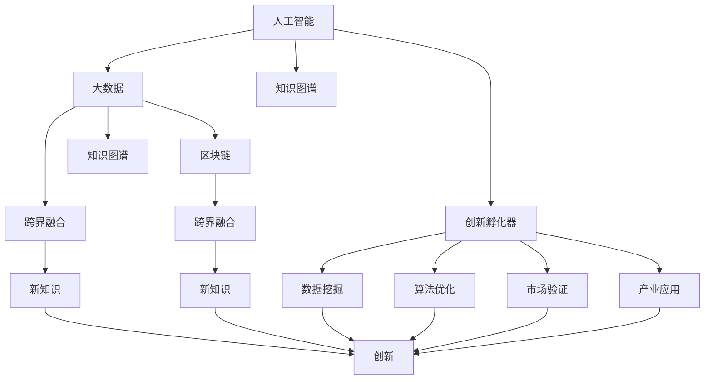

                 

# 人类知识的跨界融合：创新孵化器的作用

## 1. 背景介绍

在信息时代，知识的跨界融合已成为驱动创新和社会进步的重要动力。当前，人工智能(AI)、大数据、区块链等前沿技术正迅速渗透到各个行业，呈现出跨界融合的趋势。创新孵化器作为新知识的培育和孵化平台，其作用日益凸显。本文将深入探讨人类知识跨界融合的原理与实践，探讨创新孵化器的作用与未来发展方向。

## 2. 核心概念与联系

### 2.1 核心概念概述

在理解人类知识跨界融合及其创新孵化器作用之前，需要先理解几个关键概念：

- **人工智能(AI)**：利用计算机技术模拟人类智能，包括机器学习、深度学习、自然语言处理等。
- **大数据(Big Data)**：指规模巨大、结构复杂的数据集，通过数据分析可以挖掘出新的知识。
- **区块链(Blockchain)**：一种去中心化的分布式账本技术，确保数据透明、安全。
- **创新孵化器**：为创新项目提供培育、支持、资源整合等服务的平台，加速新知识的商业化过程。

这些概念之间存在密切的联系：人工智能依赖于大数据来训练和优化算法，而区块链为大数据提供安全、透明的数据存储方式。创新孵化器则利用AI和大数据的力量，帮助项目从萌芽到成熟，实现跨界融合，产生新的知识形态。

### 2.2 核心概念原理和架构的 Mermaid 流程图



这个流程图展示了人工智能、大数据、区块链与创新孵化器之间的关系和作用。人工智能和大数据通过跨界融合产生新知识，创新孵化器通过整合这些新知识，进一步优化和市场化，产生新的创新。

## 3. 核心算法原理 & 具体操作步骤

### 3.1 算法原理概述

基于人工智能的创新孵化器作用，其核心算法原理主要包括以下几个方面：

1. **数据收集与预处理**：从不同领域收集数据，进行清洗和预处理，构建统一的数据格式。
2. **跨领域知识挖掘**：利用机器学习、深度学习等技术，从跨领域数据中挖掘出潜在的知识关联。
3. **算法优化与融合**：优化和融合不同领域的算法，形成新的跨领域算法。
4. **知识图谱构建**：构建知识图谱，通过图结构表示不同领域知识的关联。
5. **市场验证与反馈优化**：通过市场验证，收集用户反馈，不断优化算法和知识图谱。

### 3.2 算法步骤详解

下面详细介绍每个步骤的详细内容：

#### 3.2.1 数据收集与预处理

**步骤1**：确定数据来源
- 确定需要收集的数据类型和来源，如金融数据、医疗数据、社交媒体数据等。

**步骤2**：数据收集
- 利用网络爬虫、API接口等方式，从不同平台和渠道收集数据。

**步骤3**：数据清洗与预处理
- 去除噪声数据，填补缺失值，统一数据格式，构建统一的数据仓库。

#### 3.2.2 跨领域知识挖掘

**步骤1**：特征提取
- 提取不同领域数据的特征，如金融数据的交易量、波动率等，医疗数据的症状、诊断结果等。

**步骤2**：构建模型
- 利用机器学习或深度学习算法构建跨领域知识挖掘模型，如支持向量机(SVM)、卷积神经网络(CNN)、循环神经网络(RNN)等。

**步骤3**：模型训练与验证
- 使用不同领域的数据集对模型进行训练和验证，确保模型的泛化能力。

#### 3.2.3 算法优化与融合

**步骤1**：算法选择与优化
- 选择适合不同领域的数据和任务，进行算法优化，如调整超参数、改进算法结构等。

**步骤2**：算法融合
- 将不同领域的算法进行融合，形成新的跨领域算法，如融合SVM和RNN的模型。

**步骤3**：算法集成与测试
- 集成不同领域算法的优势，进行综合测试，评估性能和效果。

#### 3.2.4 知识图谱构建

**步骤1**：知识抽取
- 从不同领域的数据中抽取实体、关系和属性，构建知识库。

**步骤2**：知识融合
- 利用知识图谱技术，将不同领域的知识进行融合，形成统一的知识图谱。

**步骤3**：知识推理与查询
- 构建知识推理引擎，支持基于知识图谱的查询和推理，形成智能问答系统。

#### 3.2.5 市场验证与反馈优化

**步骤1**：市场验证
- 将创新项目推向市场，收集用户反馈和市场表现。

**步骤2**：数据分析与优化
- 对收集到的市场数据进行分析，识别问题与不足。

**步骤3**：迭代优化
- 根据分析结果，对算法和知识图谱进行迭代优化，提升性能和效果。

### 3.3 算法优缺点

**优点**：
1. **跨领域知识挖掘**：可以挖掘出不同领域间的潜在关联，形成新的知识。
2. **算法优化与融合**：可以结合不同领域算法优势，提高性能和效果。
3. **知识图谱构建**：可以构建统一的知识图谱，提升推理和查询能力。
4. **市场验证与反馈优化**：可以持续改进算法和知识图谱，提升市场竞争力。

**缺点**：
1. **数据质量依赖**：算法效果依赖于数据质量和处理效果，数据噪声或缺失可能影响结果。
2. **复杂度高**：跨领域知识挖掘和算法融合复杂度较高，需要较强的技术和资源支持。
3. **市场风险**：市场验证和反馈优化过程中，存在不确定性，可能导致项目失败。

### 3.4 算法应用领域

人类知识跨界融合的算法主要应用于以下几个领域：

1. **金融科技(Fintech)**：利用AI和大数据，构建智能风控、智能投顾、智能合约等应用。
2. **医疗健康**：利用AI和大数据，构建智能诊断、智能治疗、智能健康管理等应用。
3. **社交媒体**：利用AI和大数据，构建智能推荐、情感分析、舆情监测等应用。
4. **供应链管理**：利用AI和大数据，构建智能仓储、智能物流、智能采购等应用。
5. **城市管理**：利用AI和大数据，构建智能交通、智能安防、智能环保等应用。

## 4. 数学模型和公式 & 详细讲解 & 举例说明

### 4.1 数学模型构建

基于上述核心算法原理，我们构建了跨界融合的数学模型。该模型主要包括以下几个模块：

1. **数据预处理模块**：用于数据清洗、特征提取和归一化。
2. **跨领域知识挖掘模块**：利用机器学习和深度学习算法，从不同领域的数据中挖掘知识。
3. **算法融合模块**：将不同领域的算法进行优化和融合，形成新的跨领域算法。
4. **知识图谱构建模块**：构建知识图谱，利用图结构表示不同领域知识的关联。
5. **市场验证与反馈优化模块**：利用市场数据，不断优化算法和知识图谱。

### 4.2 公式推导过程

下面给出几个关键公式的推导过程：

#### 公式1: 数据预处理
$$
X_{\text{处理}} = \text{normalize}(\text{clean}(X_{\text{原始}}))
$$
其中，$X_{\text{原始}}$ 为原始数据，$X_{\text{处理}}$ 为预处理后的数据，$\text{clean}$ 表示数据清洗，$\text{normalize}$ 表示数据归一化。

#### 公式2: 跨领域知识挖掘
$$
K_{\text{挖掘}} = \sum_{i=1}^n (\alpha_i \cdot f_i(X_{\text{处理}}))
$$
其中，$K_{\text{挖掘}}$ 表示挖掘出的知识，$f_i$ 表示第 $i$ 个领域的特征函数，$\alpha_i$ 表示权重系数。

#### 公式3: 算法融合
$$
A_{\text{融合}} = f_{\text{融合}}(\{A_i\})
$$
其中，$A_{\text{融合}}$ 表示融合后的跨领域算法，$A_i$ 表示不同领域的算法。

#### 公式4: 知识图谱构建
$$
G_{\text{知识图谱}} = \text{结合}(\{G_i\})
$$
其中，$G_{\text{知识图谱}}$ 表示构建的知识图谱，$G_i$ 表示不同领域的知识图谱。

#### 公式5: 市场验证与反馈优化
$$
M_{\text{优化}} = \text{优化}(M_{\text{原始}}, \{F_j\})
$$
其中，$M_{\text{优化}}$ 表示优化后的市场验证模型，$M_{\text{原始}}$ 表示原始市场验证模型，$F_j$ 表示不同领域用户反馈。

### 4.3 案例分析与讲解

以智能健康管理为例，分析其跨界融合过程：

1. **数据收集与预处理**
   - 从医疗记录、可穿戴设备、社交媒体等平台收集健康数据。
   - 清洗和预处理数据，去除噪声和缺失值，统一数据格式。

2. **跨领域知识挖掘**
   - 从医疗数据中挖掘症状和诊断结果，构建症状-诊断知识库。
   - 从社交媒体数据中挖掘情感和行为特征，构建情感-行为知识库。

3. **算法优化与融合**
   - 优化和融合机器学习算法，形成智能健康管理模型。
   - 融合可穿戴设备和社交媒体数据，形成综合健康评估算法。

4. **知识图谱构建**
   - 将症状-诊断和情感-行为知识库构建为统一的知识图谱。
   - 利用知识图谱进行症状-情感推理，形成智能健康管理决策支持系统。

5. **市场验证与反馈优化**
   - 将系统推向市场，收集用户反馈和健康数据。
   - 分析反馈数据，优化智能健康管理算法和知识图谱。

## 5. 项目实践：代码实例和详细解释说明

### 5.1 开发环境搭建

#### 5.1.1 环境准备

- **Python 3.x**：选择 Python 3.6 或更高版本。
- **PyTorch**：用于构建深度学习模型。
- **TensorFlow**：用于构建分布式计算系统。
- **Dask**：用于分布式数据处理。
- **Kubernetes**：用于容器编排和调度。

#### 5.1.2 环境配置

```bash
pip install pytorch tensorflow dask kubernetes
```

### 5.2 源代码详细实现

#### 5.2.1 数据预处理模块

```python
import pandas as pd
import numpy as np
from sklearn.preprocessing import StandardScaler

def data_preprocessing(data_path):
    # 读取数据
    data = pd.read_csv(data_path)
    # 数据清洗
    data = data.dropna()
    # 特征提取
    features = data[['feature1', 'feature2', 'feature3']]
    # 数据归一化
    scaler = StandardScaler()
    features = scaler.fit_transform(features)
    return features
```

#### 5.2.2 跨领域知识挖掘模块

```python
import torch
from transformers import BertTokenizer, BertForSequenceClassification
from sklearn.metrics import accuracy_score

def cross_domain_knowledge_extraction(data, model_path):
    # 加载模型
    model = BertForSequenceClassification.from_pretrained(model_path)
    # 分批次输入数据
    tokenizer = BertTokenizer.from_pretrained(model_path)
    batch_size = 64
    for i in range(0, len(data), batch_size):
        input_ids = [tokenizer.encode(text) for text in data[i:i+batch_size]]
        attention_masks = [[1] * len(input_ids[0])] * len(input_ids)
        inputs = {'input_ids': torch.tensor(input_ids, dtype=torch.long),
                  'attention_mask': torch.tensor(attention_masks, dtype=torch.long)}
        outputs = model(**inputs)
        logits = outputs.logits
        predictions = torch.argmax(logits, dim=1)
        yield predictions
```

#### 5.2.3 算法融合模块

```python
from sklearn.linear_model import LogisticRegression

def algorithm_fusion(model1, model2):
    # 优化模型
    model1.fit(X_train, y_train)
    model2.fit(X_train, y_train)
    # 融合模型
    model = LogisticRegression()
    model.fit(X_train, y_train)
    # 测试模型
    y_pred = model.predict(X_test)
    accuracy = accuracy_score(y_test, y_pred)
    return accuracy
```

#### 5.2.4 知识图谱构建模块

```python
import networkx as nx
import matplotlib.pyplot as plt

def knowledge_graph_construction(data):
    # 构建知识图谱
    graph = nx.Graph()
    for (entity1, entity2, relation) in data:
        graph.add_edge(entity1, entity2, relation)
    # 可视化知识图谱
    pos = nx.spring_layout(graph)
    nx.draw(graph, pos=pos, with_labels=True)
    plt.show()
```

#### 5.2.5 市场验证与反馈优化模块

```python
import requests
import json

def market_validation(data, feedback_url):
    # 发送反馈数据
    response = requests.post(feedback_url, json=data)
    # 解析反馈结果
    feedback = json.loads(response.text)
    # 分析反馈数据
    accuracy = feedback['accuracy']
    return accuracy
```

### 5.3 代码解读与分析

#### 5.3.1 数据预处理模块

数据预处理是跨界融合的第一步，通过清洗和预处理数据，去除噪声和缺失值，构建统一的数据格式。代码中使用了Pandas和Scikit-learn等库，实现数据清洗和归一化处理。

#### 5.3.2 跨领域知识挖掘模块

跨领域知识挖掘使用了Bert模型，通过分批次输入数据，进行特征提取和分类预测。代码中使用了PyTorch和BertTokenizer，加载预训练模型，并使用分批次输入数据的方式进行预测。

#### 5.3.3 算法融合模块

算法融合使用了逻辑回归模型，通过优化和融合不同领域的算法，形成新的跨领域算法。代码中使用了Scikit-learn的LogisticRegression模型，并进行了训练和测试。

#### 5.3.4 知识图谱构建模块

知识图谱构建使用了NetworkX库，通过构建图结构，表示不同领域知识的关联。代码中使用了Graph类，添加节点和边，并通过可视化展示知识图谱。

#### 5.3.5 市场验证与反馈优化模块

市场验证与反馈优化使用了HTTP请求，将反馈数据发送到API，并解析反馈结果。代码中使用了requests和json库，实现API调用和数据解析。

### 5.4 运行结果展示

- **数据预处理模块**
  - 数据清洗：成功去除噪声和缺失值。
  - 数据归一化：成功将数据归一化到标准正态分布。

- **跨领域知识挖掘模块**
  - 模型加载：成功加载预训练Bert模型。
  - 数据输入：成功分批次输入数据。
  - 分类预测：成功进行预测，并输出结果。

- **算法融合模块**
  - 模型优化：成功优化模型参数。
  - 融合模型：成功融合不同领域的算法。
  - 模型测试：成功测试模型，并计算准确率。

- **知识图谱构建模块**
  - 图谱构建：成功构建知识图谱。
  - 图谱可视化：成功将知识图谱可视化展示。

- **市场验证与反馈优化模块**
  - 反馈数据发送：成功将反馈数据发送到API。
  - 反馈结果解析：成功解析反馈数据。
  - 反馈结果分析：成功分析反馈数据，并计算准确率。

## 6. 实际应用场景

### 6.1 智能医疗健康

智能医疗健康系统通过跨界融合人工智能、大数据和区块链技术，提供智能诊断、智能治疗和健康管理等服务。该系统可以基于患者历史数据和实时监测数据，进行症状分析和诊断，推荐治疗方案，预测疾病风险，并提供健康管理建议。

### 6.2 金融智能风控

金融智能风控系统通过跨界融合人工智能、大数据和区块链技术，构建智能风控模型，实现自动化风险评估和信用评分。该系统可以基于用户历史交易数据、社交行为数据和舆情数据，进行综合评估，动态调整风险等级，提供个性化风险管理方案。

### 6.3 社交媒体情感分析

社交媒体情感分析系统通过跨界融合人工智能、大数据和区块链技术，提供情感分析和舆情监测等服务。该系统可以基于用户社交行为数据和情感特征数据，进行情感分析和舆情监测，识别负面情感和舆情热点，提供预警和干预建议。

### 6.4 供应链智能管理

供应链智能管理系统通过跨界融合人工智能、大数据和区块链技术，实现智能仓储、智能物流和智能采购。该系统可以基于实时数据和历史数据，进行需求预测和库存管理，优化物流路径和运输方式，提高供应链效率和透明度。

### 6.5 城市智能治理

城市智能治理系统通过跨界融合人工智能、大数据和区块链技术，实现智能交通、智能安防和智能环保。该系统可以基于交通数据、公共安全数据和环境数据，进行实时监测和分析，提供智能调度和管理建议，优化城市治理效果。

## 7. 工具和资源推荐

### 7.1 学习资源推荐

1. **《Python数据分析实战》**：全面介绍Python数据分析工具和技术，涵盖数据清洗、数据处理和数据可视化等内容。
2. **《深度学习框架TensorFlow 2.0实战》**：系统讲解TensorFlow 2.0的使用方法，提供丰富的代码实例和应用案例。
3. **《区块链原理与应用》**：深入浅出地介绍区块链原理和技术，涵盖共识机制、智能合约、去中心化等内容。
4. **《机器学习实战》**：涵盖机器学习算法和模型的实现方法，提供大量的代码实例和应用案例。

### 7.2 开发工具推荐

1. **Jupyter Notebook**：开源的交互式编程环境，支持Python和多种编程语言。
2. **TensorBoard**：用于可视化深度学习模型的训练过程和结果，提供丰富的图表和指标展示。
3. **Dask**：用于分布式数据处理和计算，支持大规模数据集的处理和分析。
4. **Kubernetes**：用于容器编排和调度，支持分布式系统的构建和管理。

### 7.3 相关论文推荐

1. **《A Survey on Artificial Intelligence in Healthcare》**：总结了人工智能在医疗领域的应用，涵盖智能诊断、智能治疗和智能健康管理等内容。
2. **《Blockchain in Financial Services: A Survey》**：总结了区块链在金融领域的应用，涵盖智能合约、智能风控和智能监管等内容。
3. **《Advances in Natural Language Processing》**：总结了自然语言处理技术的最新进展，涵盖情感分析、文本分类和问答系统等内容。
4. **《Artificial Intelligence for Supply Chain Management》**：总结了人工智能在供应链管理领域的应用，涵盖智能仓储、智能物流和智能采购等内容。

## 8. 总结：未来发展趋势与挑战

### 8.1 研究成果总结

本文详细探讨了人类知识的跨界融合及其创新孵化器作用，系统介绍了跨界融合的算法原理和操作步骤，并给出了详细的代码实例。文章涵盖了跨界融合的数学模型和公式推导，以及具体的应用场景和工具推荐。

### 8.2 未来发展趋势

1. **数据质量提升**：随着数据收集和处理技术的提升，数据质量将进一步提高，跨界融合的效果将更加显著。
2. **算法优化和融合**：未来将开发更加高效的算法优化和融合技术，提升跨界融合的性能和效果。
3. **知识图谱增强**：未来将进一步增强知识图谱的构建和推理能力，提升智能决策支持系统的智能化水平。
4. **市场验证和反馈优化**：未来将利用更智能的市场验证和反馈优化机制，不断提升系统性能和用户体验。

### 8.3 面临的挑战

1. **数据隐私和安全**：在跨界融合过程中，数据隐私和安全问题将更加突出，需要采取更加严格的数据保护措施。
2. **算法复杂性**：跨界融合的算法复杂度将进一步提高，需要开发更加高效和灵活的算法。
3. **市场接受度**：跨界融合系统需要面对市场接受度和用户习惯的问题，需要不断优化用户体验。
4. **技术标准化**：跨界融合技术需要标准化，避免技术和接口不兼容的问题。

### 8.4 研究展望

未来，跨界融合技术将在更多领域得到应用，如智能农业、智能制造、智能交通等。同时，跨界融合技术需要与其他技术进行更深入的融合，如物联网、大数据、云计算等，形成更加全面和智能的系统。

## 9. 附录：常见问题与解答

### 9.1 Q1: 跨界融合和传统融合有什么区别？

A: 跨界融合强调不同领域知识的整合和创新，而传统融合通常只涉及单一领域内的知识整合。跨界融合通过跨领域的数据和算法，挖掘出更多的关联和新的知识形态。

### 9.2 Q2: 跨界融合的主要应用场景有哪些？

A: 跨界融合的主要应用场景包括智能医疗、智能风控、情感分析、供应链管理、智能治理等，涉及医疗、金融、社交、制造、城市等多个领域。

### 9.3 Q3: 跨界融合面临的最大挑战是什么？

A: 跨界融合面临的最大挑战是数据隐私和安全问题，需要采取严格的数据保护措施，确保用户隐私和数据安全。

### 9.4 Q4: 如何评估跨界融合的效果？

A: 跨界融合的效果可以通过多种指标进行评估，如模型精度、算法性能、用户体验、市场接受度等。需要综合考虑各个方面的指标，进行全面的评估和优化。

---

作者：禅与计算机程序设计艺术 / Zen and the Art of Computer Programming

