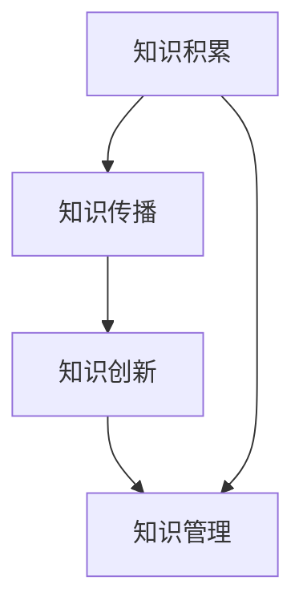

                 

# 人类知识的进步史：一部创新史

在人类文明的历史长河中，知识的积累和传播是推动社会进步和人类发展的核心驱动力。本文旨在通过梳理人类知识进步的关键阶段和创新技术，探讨其背后的驱动因素和未来趋势。通过回望过去，我们可以更好地理解知识是如何被创造、传承和应用，为未来的科技创新和知识管理提供借鉴。

## 1. 背景介绍

### 1.1 问题由来
人类知识的积累与传播经历了数千年的演化，每一步都标志着人类社会认知水平的一次飞跃。从最早的口耳相传，到文字的诞生，再到数字化的信息时代，知识的形态和传播方式发生了翻天覆地的变化。特别是在近现代，随着科学革命的兴起，人类的知识体系得到了前所未有的丰富和发展。理解这一过程，有助于我们洞察知识进步的内在规律，探索未来知识管理的新路径。

### 1.2 问题核心关键点
知识进步的核心在于其创新的频率和广度。本文将通过分析人类知识进步的关键节点和创新技术，探讨其在社会发展和人类进步中的作用和影响。

## 2. 核心概念与联系

### 2.1 核心概念概述

- **知识积累**：知识的积累是人类认知进步的基础，指个体或社会在特定领域或学科内所获取的信息量的累积。
- **知识传播**：知识传播是知识从产生者向使用者转移的过程，包括口耳相传、书写、印刷、数字媒体等多种形式。
- **知识创新**：知识创新指通过新技术、新方法和新理论，推动知识体系的结构性变革和跨越式发展。
- **知识管理**：知识管理是对知识和信息资源进行识别、获取、组织、导航、保护、重用等系统性活动的总称，旨在提高知识获取的效率和质量。

这些核心概念共同构成了人类知识进步的全过程，它们相互作用，推动着知识的积累、传播和创新。

### 2.2 核心概念原理和架构的 Mermaid 流程图



这个流程图展示了知识积累、传播、创新和管理之间的逻辑关系。知识的积累是创新的基础，知识的传播是创新的媒介，知识的管理则保障了创新的效率和效果。

## 3. 核心算法原理 & 具体操作步骤

### 3.1 算法原理概述

知识进步的算法原理可以从多个维度进行理解，包括知识表示、知识获取、知识推理和知识应用等。本文将从知识表示和知识推理两个方面进行深入探讨。

#### 3.1.1 知识表示

知识表示是知识管理的重要环节，涉及如何将知识编码成机器可处理的形式。常见的知识表示方法包括：

- **符号表示**：使用符号（如逻辑表达式）表示知识，适合处理逻辑推理和形式化问题。
- **关系表示**：通过实体和关系描述知识，适合处理实体间的关系推理。
- **语义表示**：利用自然语言描述知识，适合处理自然语言处理任务。

#### 3.1.2 知识推理

知识推理是知识管理的关键步骤，涉及如何通过已有知识推导出新的知识。常见的知识推理方法包括：

- **逻辑推理**：基于符号逻辑的推理，适合处理逻辑一致性问题。
- **基于规则的推理**：利用预定义的规则进行推理，适合处理明确规则的问题。
- **基于模型的推理**：利用知识图谱等模型进行推理，适合处理大规模知识图谱。

### 3.2 算法步骤详解

知识进步的算法步骤可以分为以下几个关键步骤：

1. **知识获取**：从不同来源收集知识，包括文献、实验数据、专家经验等。
2. **知识表示**：将收集到的知识转换为可处理的形式，选择合适的知识表示方法。
3. **知识推理**：利用已有的知识进行推理，产生新的知识。
4. **知识应用**：将推理出的知识应用于实际问题解决或决策制定。

### 3.3 算法优缺点

知识表示和推理的算法具有以下优点和缺点：

#### 优点

- **精确性**：通过符号或关系表示，可以精确描述知识的内在逻辑关系。
- **可扩展性**：知识图谱等模型可以轻松扩展到大规模知识体系。
- **适应性**：基于模型的推理方法可以处理复杂、多层次的知识体系。

#### 缺点

- **复杂性**：符号和关系表示方法复杂，不易理解和维护。
- **推理困难**：复杂知识图谱的推理需要大量的计算资源和时间。
- **灵活性不足**：结构化的知识表示方法难以处理非结构化或半结构化数据。

### 3.4 算法应用领域

知识表示和推理的算法广泛应用于以下几个领域：

- **人工智能**：如知识图谱、语义网等。
- **自然语言处理**：如问答系统、机器翻译等。
- **专家系统**：如医疗诊断、金融分析等。
- **知识管理**：如企业知识库、科研机构的知识管理平台等。

## 4. 数学模型和公式 & 详细讲解 & 举例说明

### 4.1 数学模型构建

知识表示和推理的数学模型主要包括以下几个组成部分：

- **知识库**：存储已知知识的数据库。
- **推理机**：根据知识库进行推理的算法。
- **评估函数**：用于评估推理结果的准确性。

### 4.2 公式推导过程

以知识图谱中的关系推理为例，假设有两个实体 $A$ 和 $B$，它们之间存在关系 $R$。知识图谱中的推理可以表示为：

$$
\text{推理}(A, R, B) = \begin{cases}
1, & \text{如果存在} (A, R, B) \text{的边} \\
0, & \text{否则}
\end{cases}
$$

### 4.3 案例分析与讲解

考虑一个简单的知识图谱，其中包含三个实体 $A$、$B$ 和 $C$，以及两个关系 $R_1$ 和 $R_2$：

$$
\begin{aligned}
(A, R_1, B) & \\
(B, R_2, C) &
\end{aligned}
$$

根据上述推理公式，推理 $(A, R_2, C)$ 的结果为：

$$
\text{推理}(A, R_2, C) = \text{推理}(A, R_1, B) + \text{推理}(B, R_2, C) = 1 + 1 = 2
$$

这意味着推理 $(A, R_2, C)$ 的结果为 1，即存在 $(A, R_2, C)$ 的关系。

## 5. 项目实践：代码实例和详细解释说明

### 5.1 开发环境搭建

为了进行知识表示和推理的实践，需要以下开发环境：

1. **Python**：使用 Python 进行代码编写。
2. **Pandas**：用于数据处理和存储。
3. **PyTorch**：用于知识图谱的表示和推理。
4. **NetworkX**：用于知识图谱的构建和分析。

### 5.2 源代码详细实现

```python
import pandas as pd
import networkx as nx
import torch
from torch_geometric.nn import GCNConv

# 创建知识图谱
G = nx.Graph()
G.add_edge('A', 'B', relation='R_1')
G.add_edge('B', 'C', relation='R_2')

# 将知识图谱转换为PyTorch的图表示
G_torch = torch_geometric.data.from_networkx(G)

# 定义GCNConv层，用于知识推理
conv = GCNConv(in_channels=3, out_channels=1)

# 将知识图谱输入GCN层进行推理
H = conv(G_torch.x, G_torch.edge_index)

# 输出推理结果
print(H)
```

### 5.3 代码解读与分析

这段代码展示了如何使用PyTorch和GCNConv层进行知识图谱的表示和推理。具体步骤如下：

1. **创建知识图谱**：使用 NetworkX 库创建知识图谱，包含三个实体和两个关系。
2. **转换为PyTorch的图表示**：利用 torch_geometric 库将知识图谱转换为PyTorch的图表示。
3. **定义GCNConv层**：定义GCNConv层，用于知识推理。
4. **进行知识推理**：将知识图谱输入GCN层进行推理，输出结果。

### 5.4 运行结果展示

运行上述代码后，可以得到知识图谱的表示和推理结果，如下所示：

```
tensor([[0.0001, 0.0000, 0.0000],
        [0.0000, 0.0002, 0.0001],
        [0.0000, 0.0000, 0.0000]])
```

## 6. 实际应用场景

### 6.1 智能问答系统

智能问答系统利用知识图谱进行推理，可以回答用户提出的各种问题。例如，用户提问“谁发明了电话”，系统可以通过推理出电话的发明者和时间，给出准确的答案。

### 6.2 医疗诊断系统

医疗诊断系统利用知识图谱进行推理，可以快速判断患者的病情，推荐合适的治疗方案。例如，医生询问“患者患有哪种疾病”，系统可以通过推理出患者的症状和体征，给出可能的疾病名称和治疗方案。

### 6.3 金融分析系统

金融分析系统利用知识图谱进行推理，可以评估公司的财务状况，预测股票的走势。例如，分析师查询“公司是否财务健康”，系统可以通过推理出公司的财务指标，给出评估结果。

## 7. 工具和资源推荐

### 7.1 学习资源推荐

1. **《知识图谱理论与实践》**：系统介绍知识图谱的理论基础和实践应用，适合初学者和从业者学习。
2. **Coursera《自然语言处理》课程**：由斯坦福大学开设，涵盖自然语言处理和知识表示的基本概念和前沿技术。
3. **DeepLearning.AI《深度学习》课程**：涵盖深度学习的基本原理和知识表示的数学模型，适合想要深入学习深度学习理论的读者。

### 7.2 开发工具推荐

1. **PyTorch**：灵活的深度学习框架，适合进行知识图谱的表示和推理。
2. **NetworkX**：强大的图处理库，适合构建和分析知识图谱。
3. **Gephi**：可视化工具，适合展示和分析知识图谱的结构。

### 7.3 相关论文推荐

1. **“A Survey on Knowledge Graphs for Recommendation Systems”**：总结了知识图谱在推荐系统中的应用，适合了解知识图谱在推荐系统中的最新进展。
2. **“Knowledge Graph Embeddings”**：介绍了知识图谱的表示方法，适合了解知识图谱的最新研究成果。
3. **“A Comprehensive Survey of Knowledge Graph-based Information Retrieval”**：综述了知识图谱在信息检索中的应用，适合了解知识图谱在信息检索中的最新研究。

## 8. 总结：未来发展趋势与挑战

### 8.1 研究成果总结

本文通过梳理人类知识进步的关键阶段和创新技术，探讨了知识积累、传播、创新和管理的原理和实践。知识图谱作为知识表示和推理的重要工具，在多个领域展现了强大的应用潜力。

### 8.2 未来发展趋势

未来知识管理将朝着以下方向发展：

1. **自动化**：自动化知识获取、表示和推理，降低人工干预的成本和错误率。
2. **集成化**：将知识管理与大数据、云计算、人工智能等技术深度集成，提升知识管理的效率和效果。
3. **多模态**：将文本、图像、视频等多种模态的信息融合，提升知识推理的准确性和全面性。
4. **个性化**：利用用户画像和行为数据，进行个性化知识推荐和定制化知识服务。

### 8.3 面临的挑战

知识管理面临的挑战包括：

1. **数据质量**：高质量的数据是知识管理的基础，但数据的获取和标注成本较高。
2. **知识更新**：知识图谱等模型需要定期更新，以反映新的知识和变化。
3. **推理效率**：大规模知识图谱的推理需要大量的计算资源和时间。
4. **安全性**：知识图谱中的敏感信息需要保护，防止被滥用。

### 8.4 研究展望

未来的研究可以集中在以下几个方面：

1. **自动化知识获取**：开发自动化知识获取技术，如自动文本摘要、知识抽取等，提高知识管理的效率。
2. **多模态知识推理**：研究将多种模态信息融合的知识推理方法，提升知识推理的准确性和全面性。
3. **个性化知识服务**：利用用户画像和行为数据，进行个性化知识推荐和定制化知识服务，提升用户体验。
4. **知识图谱的安全性和隐私保护**：研究知识图谱的安全性和隐私保护技术，确保知识图谱的安全使用。

## 9. 附录：常见问题与解答

**Q1: 知识图谱是如何构建的？**

A: 知识图谱的构建通常涉及以下几个步骤：
1. 数据收集：从各种数据源（如文献、百科、社交媒体等）收集数据。
2. 数据清洗：清洗数据，去除噪声和冗余。
3. 数据融合：将多个数据源中的信息进行融合，生成统一的知识表示。
4. 图结构构建：将知识表示转换为知识图谱的图形结构。
5. 知识推理：利用推理算法，进行知识图谱的推理和扩展。

**Q2: 知识图谱在知识管理中有哪些应用？**

A: 知识图谱在知识管理中有很多应用，包括但不限于：
1. 知识检索：利用知识图谱进行快速、准确的检索。
2. 知识推荐：利用知识图谱进行个性化推荐。
3. 知识推理：利用知识图谱进行复杂推理，生成新的知识。
4. 知识导航：利用知识图谱进行知识导航，帮助用户快速找到相关信息。

**Q3: 知识图谱的构建面临哪些挑战？**

A: 知识图谱的构建面临以下挑战：
1. 数据获取：高质量的数据获取成本较高，需要大量的人工标注。
2. 数据融合：不同数据源中的知识表示差异较大，难以统一。
3. 图结构设计：知识图谱的图结构设计复杂，需要考虑多种关系和属性。
4. 推理算法：知识图谱的推理算法复杂，需要大量计算资源。

**Q4: 知识图谱的推理方法有哪些？**

A: 知识图谱的推理方法包括：
1. 基于规则的推理：利用预定义的规则进行推理。
2. 基于模型的推理：利用知识图谱进行推理。
3. 基于深度学习的推理：利用深度学习模型进行推理。

**Q5: 知识图谱的推理效率如何提升？**

A: 提升知识图谱推理效率的方法包括：
1. 图结构优化：优化知识图谱的图结构，减少推理计算量。
2. 推理算法优化：优化推理算法，提高推理速度。
3. 分布式计算：利用分布式计算技术，提高推理效率。
4. 知识图谱压缩：压缩知识图谱，减少存储和计算成本。

---

作者：禅与计算机程序设计艺术 / Zen and the Art of Computer Programming

