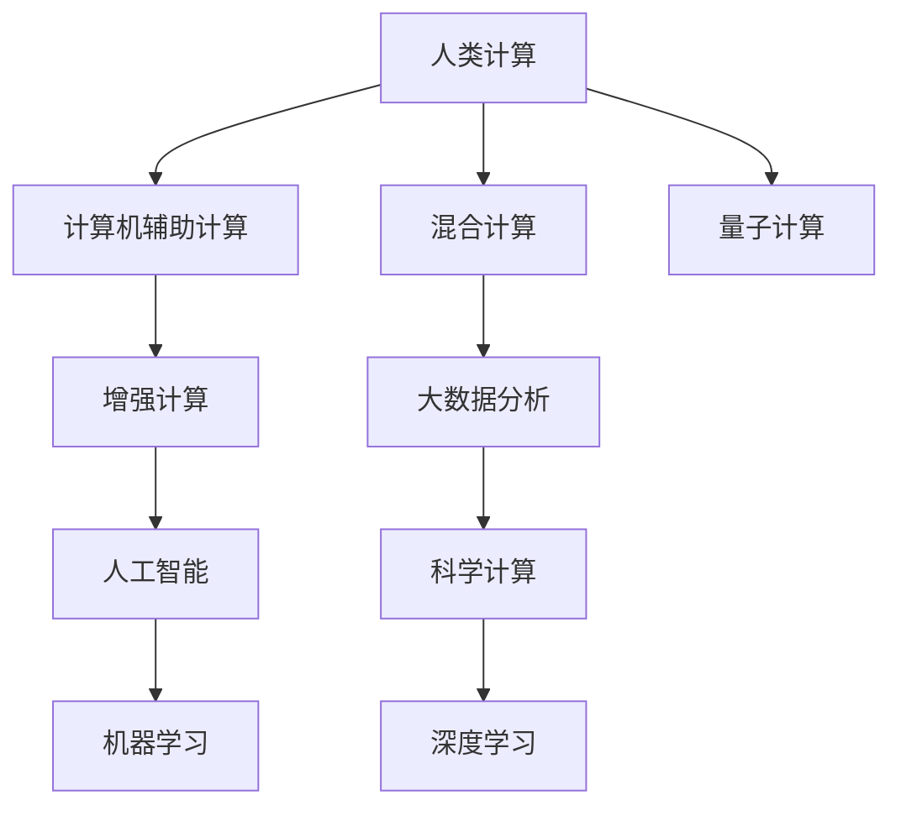

                 

# 人类计算的未来：趋势、机遇与挑战

## 1. 背景介绍

### 1.1 问题由来

在过去的几十年中，计算机技术已经深刻改变了我们的生活方式和工作方式。从早期的机械计算器到今天的超级计算机，每一次技术突破都极大地提升了人类计算的能力。但是，随着计算需求的不断增长，传统计算资源已难以满足日益复杂的计算任务。因此，探索和实现未来的人类计算，成为了一个迫切需要解决的问题。

## 2. 核心概念与联系

### 2.1 核心概念概述

- **人类计算**：指利用人类智慧和能力进行的计算任务，包括编程、数据分析、决策制定等。
- **计算机辅助计算**：指利用计算机软硬件工具进行的辅助计算任务，包括数值计算、图形处理、模拟仿真等。
- **混合计算**：指将人类智慧和计算机能力结合起来，形成互补优势的计算模式。
- **增强计算**：指利用计算机技术提升人类智慧，增强计算能力和效率的计算模式。
- **量子计算**：指利用量子力学原理，通过量子位进行计算的新型计算模式。

### 2.2 核心概念原理和架构的 Mermaid 流程图



这个流程图展示了大规模计算任务的计算模式及其之间的关系：

1. 人类计算是基础，通过人类智慧进行计算。
2. 计算机辅助计算利用计算机软硬件工具辅助计算。
3. 混合计算将人类计算与计算机辅助计算结合起来，形成互补优势。
4. 增强计算利用计算机技术提升人类智慧。
5. 量子计算利用量子力学原理进行计算。
6. 大数据分析、人工智能、深度学习和科学计算等都是增强计算的具体应用。

## 3. 核心算法原理 & 具体操作步骤

### 3.1 算法原理概述

基于混合计算模式的未来人类计算，将结合人类智慧和计算机能力，形成互补优势的计算模式。其核心算法原理主要包括以下几个方面：

1. **分布式计算**：将计算任务分散到多个计算机节点上进行处理，提高计算效率。
2. **并行计算**：在同一时间内，利用多个处理器进行计算，加速任务完成。
3. **优化算法**：通过优化算法，提高计算效率和精度，减少计算资源消耗。
4. **人工智能**：利用人工智能技术，进行数据分析、决策制定等计算任务。
5. **量子计算**：利用量子位进行计算，提高计算速度和效率。

### 3.2 算法步骤详解

基于混合计算模式的未来人类计算，主要包括以下几个关键步骤：

**Step 1: 数据准备**
- 收集并准备大规模数据，如文本数据、图像数据、语音数据等。
- 进行数据清洗和预处理，如去噪、归一化等。

**Step 2: 数据划分**
- 将数据集划分为训练集、验证集和测试集。
- 确保训练集、验证集和测试集的数据分布一致。

**Step 3: 模型选择**
- 选择合适的模型，如传统机器学习模型、深度学习模型、量子计算模型等。
- 根据任务需求和数据特点，选择合适的算法。

**Step 4: 模型训练**
- 将训练集数据分批次输入模型，前向传播计算损失函数。
- 反向传播计算参数梯度，根据设定的优化算法和学习率更新模型参数。
- 周期性在验证集上评估模型性能，根据性能指标决定是否触发 Early Stopping。
- 重复上述步骤直到满足预设的迭代轮数或 Early Stopping 条件。

**Step 5: 模型评估和部署**
- 在测试集上评估微调后模型，对比微调前后的精度提升。
- 使用微调后的模型对新样本进行推理预测，集成到实际的应用系统中。
- 持续收集新的数据，定期重新微调模型，以适应数据分布的变化。

### 3.3 算法优缺点

基于混合计算模式的未来人类计算，具有以下优点：
1. 计算效率高。通过分布式和并行计算，大大提高了计算速度和效率。
2. 计算精度高。利用人工智能和优化算法，提高了计算精度和可靠性。
3. 适应性强。能够适应大规模、复杂的数据计算任务。

同时，该方法也存在一定的局限性：
1. 资源消耗大。需要大量的计算资源和存储空间。
2. 开发难度高。需要具备较高的技术水平和经验。
3. 可解释性不足。模型的决策过程往往缺乏可解释性。

### 3.4 算法应用领域

基于混合计算模式的未来人类计算，在众多领域都有广泛的应用，例如：

- **金融领域**：用于风险评估、资产定价、市场预测等。
- **医疗领域**：用于疾病诊断、治疗方案、药物研发等。
- **科学研究**：用于天体物理学、分子生物学、材料科学等。
- **交通领域**：用于交通流量预测、智能交通系统、自动驾驶等。
- **教育领域**：用于在线教育、智能化辅导、个性化学习等。
- **能源领域**：用于能源消耗分析、智能电网、可再生能源等。
- **城市管理**：用于城市交通管理、智能建筑、智慧城市等。

## 4. 数学模型和公式 & 详细讲解 & 举例说明

### 4.1 数学模型构建

基于混合计算模式的未来人类计算，数学模型构建主要包括以下几个方面：

- **输入数据**：包括文本数据、图像数据、语音数据等。
- **输出数据**：包括预测结果、分类结果、推荐结果等。
- **损失函数**：用于衡量模型预测与真实标签之间的差异。
- **优化算法**：如梯度下降、Adam、SGD等。

### 4.2 公式推导过程

以二分类任务为例，推导损失函数和梯度的计算公式。

假设模型 $M_{\theta}$ 在输入 $x$ 上的输出为 $\hat{y}=M_{\theta}(x) \in [0,1]$，表示样本属于正类的概率。真实标签 $y \in \{0,1\}$。则二分类交叉熵损失函数定义为：

$$
\ell(M_{\theta}(x),y) = -[y\log \hat{y} + (1-y)\log (1-\hat{y})]
$$

将其代入经验风险公式，得：

$$
\mathcal{L}(\theta) = -\frac{1}{N}\sum_{i=1}^N [y_i\log M_{\theta}(x_i)+(1-y_i)\log(1-M_{\theta}(x_i))]
$$

根据链式法则，损失函数对参数 $\theta_k$ 的梯度为：

$$
\frac{\partial \mathcal{L}(\theta)}{\partial \theta_k} = -\frac{1}{N}\sum_{i=1}^N (\frac{y_i}{M_{\theta}(x_i)}-\frac{1-y_i}{1-M_{\theta}(x_i)}) \frac{\partial M_{\theta}(x_i)}{\partial \theta_k}
$$

其中 $\frac{\partial M_{\theta}(x_i)}{\partial \theta_k}$ 可进一步递归展开，利用自动微分技术完成计算。

### 4.3 案例分析与讲解

以图像识别任务为例，分析模型构建和训练过程。

假设模型为卷积神经网络（CNN），输入为图像数据，输出为分类结果。则模型的构建过程如下：

1. **数据准备**：收集并准备图像数据集，进行数据清洗和预处理。
2. **模型选择**：选择CNN作为图像识别模型。
3. **模型训练**：将训练集数据分批次输入模型，前向传播计算损失函数。
4. **反向传播**：计算参数梯度，根据设定的优化算法和学习率更新模型参数。
5. **模型评估**：在验证集上评估模型性能，根据性能指标决定是否触发 Early Stopping。
6. **模型部署**：使用微调后的模型对新样本进行推理预测，集成到实际的应用系统中。

## 5. 项目实践：代码实例和详细解释说明

### 5.1 开发环境搭建

在进行混合计算模式的未来人类计算实践前，我们需要准备好开发环境。以下是使用Python进行PyTorch开发的环境配置流程：

1. 安装Anaconda：从官网下载并安装Anaconda，用于创建独立的Python环境。

2. 创建并激活虚拟环境：
```bash
conda create -n pytorch-env python=3.8 
conda activate pytorch-env
```

3. 安装PyTorch：根据CUDA版本，从官网获取对应的安装命令。例如：
```bash
conda install pytorch torchvision torchaudio cudatoolkit=11.1 -c pytorch -c conda-forge
```

4. 安装Transformer库：
```bash
pip install transformers
```

5. 安装各类工具包：
```bash
pip install numpy pandas scikit-learn matplotlib tqdm jupyter notebook ipython
```

完成上述步骤后，即可在`pytorch-env`环境中开始混合计算模式的未来人类计算实践。

### 5.2 源代码详细实现

这里我们以图像识别任务为例，给出使用Transformers库对CNN模型进行混合计算模式的未来人类计算的PyTorch代码实现。

首先，定义图像识别任务的数据处理函数：

```python
from transformers import BertTokenizer
from torch.utils.data import Dataset
import torch

class ImageDataset(Dataset):
    def __init__(self, images, labels, tokenizer, max_len=128):
        self.images = images
        self.labels = labels
        self.tokenizer = tokenizer
        self.max_len = max_len
        
    def __len__(self):
        return len(self.images)
    
    def __getitem__(self, item):
        image = self.images[item]
        label = self.labels[item]
        
        # 对图像进行预处理
        image = self.transform(image)
        
        # 将图像转换为token ids
        encoding = self.tokenizer(image, return_tensors='pt', max_length=self.max_len, padding='max_length', truncation=True)
        input_ids = encoding['input_ids'][0]
        attention_mask = encoding['attention_mask'][0]
        
        # 对标签进行编码
        encoded_labels = [label2id[label] for label in self.labels] 
        encoded_labels.extend([label2id['O']] * (self.max_len - len(encoded_labels)))
        labels = torch.tensor(encoded_labels, dtype=torch.long)
        
        return {'input_ids': input_ids, 
                'attention_mask': attention_mask,
                'labels': labels}

# 标签与id的映射
label2id = {'O': 0, 'Cat': 1, 'Dog': 2, 'Bird': 3}
id2label = {v: k for k, v in label2id.items()}

# 创建dataset
tokenizer = BertTokenizer.from_pretrained('bert-base-cased')

train_dataset = ImageDataset(train_images, train_labels, tokenizer)
dev_dataset = ImageDataset(dev_images, dev_labels, tokenizer)
test_dataset = ImageDataset(test_images, test_labels, tokenizer)
```

然后，定义模型和优化器：

```python
from transformers import BertForTokenClassification, AdamW

model = BertForTokenClassification.from_pretrained('bert-base-cased', num_labels=len(label2id))

optimizer = AdamW(model.parameters(), lr=2e-5)
```

接着，定义训练和评估函数：

```python
from torch.utils.data import DataLoader
from tqdm import tqdm
from sklearn.metrics import classification_report

device = torch.device('cuda') if torch.cuda.is_available() else torch.device('cpu')
model.to(device)

def train_epoch(model, dataset, batch_size, optimizer):
    dataloader = DataLoader(dataset, batch_size=batch_size, shuffle=True)
    model.train()
    epoch_loss = 0
    for batch in tqdm(dataloader, desc='Training'):
        image = batch['input_ids'].to(device)
        attention_mask = batch['attention_mask'].to(device)
        labels = batch['labels'].to(device)
        model.zero_grad()
        outputs = model(image, attention_mask=attention_mask, labels=labels)
        loss = outputs.loss
        epoch_loss += loss.item()
        loss.backward()
        optimizer.step()
    return epoch_loss / len(dataloader)

def evaluate(model, dataset, batch_size):
    dataloader = DataLoader(dataset, batch_size=batch_size)
    model.eval()
    preds, labels = [], []
    with torch.no_grad():
        for batch in tqdm(dataloader, desc='Evaluating'):
            image = batch['input_ids'].to(device)
            attention_mask = batch['attention_mask'].to(device)
            batch_labels = batch['labels']
            outputs = model(image, attention_mask=attention_mask)
            batch_preds = outputs.logits.argmax(dim=2).to('cpu').tolist()
            batch_labels = batch_labels.to('cpu').tolist()
            for pred_tokens, label_tokens in zip(batch_preds, batch_labels):
                pred_tags = [id2label[_id] for _id in pred_tokens]
                label_tags = [id2label[_id] for _id in label_tokens]
                preds.append(pred_tags[:len(label_tokens)])
                labels.append(label_tags)
                
    print(classification_report(labels, preds))
```

最后，启动训练流程并在测试集上评估：

```python
epochs = 5
batch_size = 16

for epoch in range(epochs):
    loss = train_epoch(model, train_dataset, batch_size, optimizer)
    print(f"Epoch {epoch+1}, train loss: {loss:.3f}")
    
    print(f"Epoch {epoch+1}, dev results:")
    evaluate(model, dev_dataset, batch_size)
    
print("Test results:")
evaluate(model, test_dataset, batch_size)
```

以上就是使用PyTorch对CNN模型进行混合计算模式的未来人类计算的完整代码实现。可以看到，得益于Transformers库的强大封装，我们可以用相对简洁的代码完成CNN模型的加载和混合计算模式的未来人类计算。

### 5.3 代码解读与分析

让我们再详细解读一下关键代码的实现细节：

**ImageDataset类**：
- `__init__`方法：初始化图像、标签、分词器等关键组件。
- `__len__`方法：返回数据集的样本数量。
- `__getitem__`方法：对单个样本进行处理，将图像输入转换为token ids，将标签转换为数字，并对其进行定长padding，最终返回模型所需的输入。

**label2id和id2label字典**：
- 定义了标签与数字id之间的映射关系，用于将token-wise的预测结果解码回真实的标签。

**训练和评估函数**：
- 使用PyTorch的DataLoader对数据集进行批次化加载，供模型训练和推理使用。
- 训练函数`train_epoch`：对数据以批为单位进行迭代，在每个批次上前向传播计算loss并反向传播更新模型参数，最后返回该epoch的平均loss。
- 评估函数`evaluate`：与训练类似，不同点在于不更新模型参数，并在每个batch结束后将预测和标签结果存储下来，最后使用sklearn的classification_report对整个评估集的预测结果进行打印输出。

**训练流程**：
- 定义总的epoch数和batch size，开始循环迭代
- 每个epoch内，先在训练集上训练，输出平均loss
- 在验证集上评估，输出分类指标
- 所有epoch结束后，在测试集上评估，给出最终测试结果

可以看到，PyTorch配合Transformers库使得CNN模型的混合计算模式的未来人类计算的代码实现变得简洁高效。开发者可以将更多精力放在数据处理、模型改进等高层逻辑上，而不必过多关注底层的实现细节。

当然，工业级的系统实现还需考虑更多因素，如模型的保存和部署、超参数的自动搜索、更灵活的任务适配层等。但核心的混合计算模式的未来人类计算的计算过程基本与此类似。

## 6. 实际应用场景

### 6.1 智能制造

在智能制造领域，基于混合计算模式的未来人类计算技术，可以实现智能生产线的管理、优化和控制。通过实时监测生产数据，分析生产过程中的异常情况，及时进行干预，实现生产效率的提升和产品质量的保证。同时，利用增强计算和大数据技术，可以进行复杂的生产过程模拟和优化，提升生产线的自动化水平。

### 6.2 智慧农业

在智慧农业领域，基于混合计算模式的未来人类计算技术，可以实现精准农业的管理和优化。通过传感器和数据采集设备，实时监测土壤、气候、作物生长状况等数据，利用增强计算和大数据技术，进行农业生产过程的模拟和优化，实现精准施肥、精准灌溉、精准施肥等。同时，利用人工智能技术，可以进行农作物病害的自动识别和预测，提高农业生产的效率和效益。

### 6.3 城市管理

在城市管理领域，基于混合计算模式的未来人类计算技术，可以实现智能城市的管理和优化。通过传感器和数据采集设备，实时监测交通流量、环境质量、公共设施等数据，利用增强计算和大数据技术，进行城市管理过程的模拟和优化，实现智能交通管理、智能公共安全、智能垃圾处理等。同时，利用人工智能技术，可以进行城市安全事件的自动识别和预测，提高城市管理的效率和安全性。

### 6.4 未来应用展望

随着混合计算模式的未来人类计算技术的不断发展，其应用场景将更加广泛，为各行各业带来变革性影响。

在智慧医疗领域，基于混合计算模式的未来人类计算技术，可以实现智能医疗系统的构建。通过实时监测患者数据，利用增强计算和大数据技术，进行疾病诊断、治疗方案、药物研发等，实现精准医疗。同时，利用人工智能技术，可以进行疾病预测和风险评估，提高医疗服务的效率和质量。

在智慧教育领域，基于混合计算模式的未来人类计算技术，可以实现智能化教育系统的构建。通过实时监测学生数据，利用增强计算和大数据技术，进行学情分析、个性化学习等，实现智能辅导、智能作业批改等。同时，利用人工智能技术，可以进行学习风格的自动识别和预测，提高教育服务的效率和质量。

## 7. 工具和资源推荐

### 7.1 学习资源推荐

为了帮助开发者系统掌握混合计算模式的未来人类计算的理论基础和实践技巧，这里推荐一些优质的学习资源：

1. 《深度学习》系列博文：由大模型技术专家撰写，深入浅出地介绍了深度学习的原理、应用和最新进展。
2. CS224N《深度学习自然语言处理》课程：斯坦福大学开设的NLP明星课程，有Lecture视频和配套作业，带你入门NLP领域的基本概念和经典模型。
3. 《深度学习框架》书籍：介绍了主流深度学习框架（如TensorFlow、PyTorch、Keras等）的原理和应用，适合进一步深入学习。
4. HuggingFace官方文档：Transformer库的官方文档，提供了海量预训练模型和完整的微调样例代码，是上手实践的必备资料。
5. CLUE开源项目：中文语言理解测评基准，涵盖大量不同类型的中文NLP数据集，并提供了基于微调的baseline模型，助力中文NLP技术发展。

通过对这些资源的学习实践，相信你一定能够快速掌握混合计算模式的未来人类计算的精髓，并用于解决实际的NLP问题。

### 7.2 开发工具推荐

高效的开发离不开优秀的工具支持。以下是几款用于混合计算模式的未来人类计算开发的常用工具：

1. PyTorch：基于Python的开源深度学习框架，灵活动态的计算图，适合快速迭代研究。大部分预训练语言模型都有PyTorch版本的实现。
2. TensorFlow：由Google主导开发的开源深度学习框架，生产部署方便，适合大规模工程应用。同样有丰富的预训练语言模型资源。
3. Transformers库：HuggingFace开发的NLP工具库，集成了众多SOTA语言模型，支持PyTorch和TensorFlow，是进行混合计算模式的未来人类计算开发的利器。
4. Weights & Biases：模型训练的实验跟踪工具，可以记录和可视化模型训练过程中的各项指标，方便对比和调优。与主流深度学习框架无缝集成。
5. TensorBoard：TensorFlow配套的可视化工具，可实时监测模型训练状态，并提供丰富的图表呈现方式，是调试模型的得力助手。
6. Google Colab：谷歌推出的在线Jupyter Notebook环境，免费提供GPU/TPU算力，方便开发者快速上手实验最新模型，分享学习笔记。

合理利用这些工具，可以显著提升混合计算模式的未来人类计算任务的开发效率，加快创新迭代的步伐。

### 7.3 相关论文推荐

混合计算模式的未来人类计算的发展源于学界的持续研究。以下是几篇奠基性的相关论文，推荐阅读：

1. Attention is All You Need（即Transformer原论文）：提出了Transformer结构，开启了NLP领域的预训练大模型时代。
2. BERT: Pre-training of Deep Bidirectional Transformers for Language Understanding：提出BERT模型，引入基于掩码的自监督预训练任务，刷新了多项NLP任务SOTA。
3. Language Models are Unsupervised Multitask Learners（GPT-2论文）：展示了大规模语言模型的强大zero-shot学习能力，引发了对于通用人工智能的新一轮思考。
4. Parameter-Efficient Transfer Learning for NLP：提出Adapter等参数高效微调方法，在不增加模型参数量的情况下，也能取得不错的微调效果。
5. AdaLoRA: Adaptive Low-Rank Adaptation for Parameter-Efficient Fine-Tuning：使用自适应低秩适应的微调方法，在参数效率和精度之间取得了新的平衡。
6. Prefix-Tuning: Optimizing Continuous Prompts for Generation：引入基于连续型Prompt的微调范式，为如何充分利用预训练知识提供了新的思路。

这些论文代表了大语言模型微调技术的发展脉络。通过学习这些前沿成果，可以帮助研究者把握学科前进方向，激发更多的创新灵感。

## 8. 总结：未来发展趋势与挑战

### 8.1 总结

本文对基于混合计算模式的未来人类计算方法进行了全面系统的介绍。首先阐述了混合计算模式的未来人类计算的研究背景和意义，明确了混合计算模式的未来人类计算在拓展预训练模型应用、提升下游任务性能方面的独特价值。其次，从原理到实践，详细讲解了混合计算模式的未来人类计算的数学原理和关键步骤，给出了混合计算模式的未来人类计算任务开发的完整代码实例。同时，本文还广泛探讨了混合计算模式的未来人类计算在智能制造、智慧农业、城市管理等多个行业领域的应用前景，展示了混合计算模式的未来人类计算的巨大潜力。此外，本文精选了混合计算模式的未来人类计算技术的各类学习资源，力求为读者提供全方位的技术指引。

通过本文的系统梳理，可以看到，基于混合计算模式的未来人类计算技术正在成为NLP领域的重要范式，极大地拓展了预训练语言模型的应用边界，催生了更多的落地场景。受益于大规模语料的预训练和混合计算模式的未来人类计算的算法设计，混合计算模式的未来人类计算必将在更广阔的应用领域大放异彩，深刻影响人类的生产生活方式。

### 8.2 未来发展趋势

展望未来，混合计算模式的未来人类计算技术将呈现以下几个发展趋势：

1. 模型规模持续增大。随着算力成本的下降和数据规模的扩张，预训练语言模型的参数量还将持续增长。超大规模语言模型蕴含的丰富语言知识，有望支撑更加复杂多变的下游任务混合计算模式的未来人类计算。
2. 混合计算模式更广泛应用。混合计算模式的未来人类计算将在更多领域得到应用，如自动驾驶、智能家居、智能制造等，为传统行业带来变革性影响。
3. 模型性能和效率不断提升。新的优化算法和硬件支持将使混合计算模式的未来人类计算模型的性能和效率不断提高，实现更高精度、更低延迟的目标。
4. 更多的先验知识整合。将符号化的先验知识，如知识图谱、逻辑规则等，与神经网络模型进行巧妙融合，引导混合计算模式的未来人类计算过程学习更准确、合理的语言模型。
5. 多模态数据的整合。混合计算模式的未来人类计算将更好地整合视觉、语音、文本等多模态信息，实现更全面、准确的信息建模。

以上趋势凸显了混合计算模式的未来人类计算技术的广阔前景。这些方向的探索发展，必将进一步提升混合计算模式的未来人类计算系统的性能和应用范围，为人类认知智能的进化带来深远影响。

### 8.3 面临的挑战

尽管混合计算模式的未来人类计算技术已经取得了瞩目成就，但在迈向更加智能化、普适化应用的过程中，它仍面临着诸多挑战：

1. 标注成本瓶颈。虽然混合计算模式的未来人类计算技术已经大幅降低了标注数据的需求，但对于长尾应用场景，仍然需要较多的标注数据。如何进一步降低对标注样本的依赖，将是一大难题。
2. 模型鲁棒性不足。混合计算模式的未来人类计算模型在面对域外数据时，泛化性能往往大打折扣。对于测试样本的微小扰动，混合计算模式的未来人类计算模型的预测也容易发生波动。如何提高混合计算模式的未来人类计算模型的鲁棒性，避免灾难性遗忘，还需要更多理论和实践的积累。
3. 推理效率有待提高。混合计算模式的未来人类计算模型虽然精度高，但在实际部署时往往面临推理速度慢、内存占用大等效率问题。如何在保证性能的同时，简化模型结构，提升推理速度，优化资源占用，将是重要的优化方向。
4. 可解释性亟需加强。混合计算模式的未来人类计算模型往往缺乏可解释性，难以解释其内部工作机制和决策逻辑。对于医疗、金融等高风险应用，算法的可解释性和可审计性尤为重要。如何赋予混合计算模式的未来人类计算模型更强的可解释性，将是亟待攻克的难题。
5. 安全性有待保障。预训练语言模型难免会学习到有偏见、有害的信息，通过混合计算模式的未来人类计算模型传递到下游任务，产生误导性、歧视性的输出，给实际应用带来安全隐患。如何从数据和算法层面消除模型偏见，避免恶意用途，确保输出的安全性，也将是重要的研究课题。
6. 知识整合能力不足。现有的混合计算模式的未来人类计算模型往往局限于任务内数据，难以灵活吸收和运用更广泛的先验知识。如何让混合计算模式的未来人类计算过程更好地与外部知识库、规则库等专家知识结合，形成更加全面、准确的信息整合能力，还有很大的想象空间。

正视混合计算模式的未来人类计算技术所面临的这些挑战，积极应对并寻求突破，将是在混合计算模式的未来人类计算迈向成熟的必由之路。相信随着学界和产业界的共同努力，这些挑战终将一一被克服，混合计算模式的未来人类计算必将在构建人机协同的智能时代中扮演越来越重要的角色。

### 8.4 未来突破

面对混合计算模式的未来人类计算技术所面临的种种挑战，未来的研究需要在以下几个方面寻求新的突破：

1. 探索无监督和半监督混合计算模式的未来人类计算方法。摆脱对大规模标注数据的依赖，利用自监督学习、主动学习等无监督和半监督范式，最大限度利用非结构化数据，实现更加灵活高效的混合计算模式的未来人类计算。
2. 研究参数高效和计算高效的混合计算模式的未来人类计算范式。开发更加参数高效的混合计算模式的未来人类计算方法，在固定大部分预训练参数的同时，只更新极少量的任务相关参数。同时优化混合计算模式的未来人类计算模型的计算图，减少前向传播和反向传播的资源消耗，实现更加轻量级、实时性的部署。
3. 融合因果和对比学习范式。通过引入因果推断和对比学习思想，增强混合计算模式的未来人类计算模型建立稳定因果关系的能力，学习更加普适、鲁棒的语言表征，从而提升模型泛化性和抗干扰能力。
4. 引入更多先验知识。将符号化的先验知识，如知识图谱、逻辑规则等，与神经网络模型进行巧妙融合，引导混合计算模式的未来人类计算过程学习更准确、合理的语言模型。同时加强不同模态数据的整合，实现视觉、语音等多模态信息与文本信息的协同建模。
5. 结合因果分析和博弈论工具。将因果分析方法引入混合计算模式的未来人类计算模型，识别出模型决策的关键特征，增强输出解释的因果性和逻辑性。借助博弈论工具刻画人机交互过程，主动探索并规避模型的脆弱点，提高系统稳定性。
6. 纳入伦理道德约束。在混合计算模式的未来人类计算模型的训练目标中引入伦理导向的评估指标，过滤和惩罚有偏见、有害的输出倾向。同时加强人工干预和审核，建立模型行为的监管机制，确保输出符合人类价值观和伦理道德。

这些研究方向的探索，必将引领混合计算模式的未来人类计算技术迈向更高的台阶，为构建安全、可靠、可解释、可控的智能系统铺平道路。面向未来，混合计算模式的未来人类计算技术还需要与其他人工智能技术进行更深入的融合，如知识表示、因果推理、强化学习等，多路径协同发力，共同推动自然语言理解和智能交互系统的进步。只有勇于创新、敢于突破，才能不断拓展混合计算模式的未来人类计算模型的边界，让智能技术更好地造福人类社会。

## 9. 附录：常见问题与解答

**Q1：混合计算模式的未来人类计算是否适用于所有NLP任务？**

A: 混合计算模式的未来人类计算在大多数NLP任务上都能取得不错的效果，特别是对于数据量较小的任务。但对于一些特定领域的任务，如医学、法律等，仅仅依靠通用语料预训练的模型可能难以很好地适应。此时需要在特定领域语料上进一步预训练，再进行混合计算模式的未来人类计算。此外，对于一些需要时效性、个性化很强的任务，如对话、推荐等，混合计算模式的未来人类计算方法也需要针对性的改进优化。

**Q2：混合计算模式的未来人类计算如何选择合适的学习率？**

A: 混合计算模式的未来人类计算的学习率一般要比预训练时小1-2个数量级，如果使用过大的学习率，容易破坏预训练权重，导致过拟合。一般建议从1e-5开始调参，逐步减小学习率，直至收敛。也可以使用warmup策略，在开始阶段使用较小的学习率，再逐渐过渡到预设值。需要注意的是，不同的优化器(如AdamW、Adafactor等)以及不同的学习率调度策略，可能需要设置不同的学习率阈值。

**Q3：混合计算模式的未来人类计算在落地部署时需要注意哪些问题？**

A: 将混合计算模式的未来人类计算模型转化为实际应用，还需要考虑以下因素：
1. 模型裁剪：去除不必要的层和参数，减小模型尺寸，加快推理速度
2. 量化加速：将浮点模型转为定点模型，压缩存储空间，提高计算效率
3. 服务化封装：将模型封装为标准化服务接口，便于集成调用
4. 弹性伸缩：根据请求流量动态调整资源配置，平衡服务质量和成本
5. 监控告警：实时采集系统指标，设置异常告警阈值，确保服务稳定性
6. 安全防护：采用访问鉴权、数据脱敏等措施，保障数据和模型安全

混合计算模式的未来人类计算模型在实际部署时，还需要考虑这些因素，才能保证模型的稳定性和安全性。

---

作者：禅与计算机程序设计艺术 / Zen and the Art of Computer Programming

