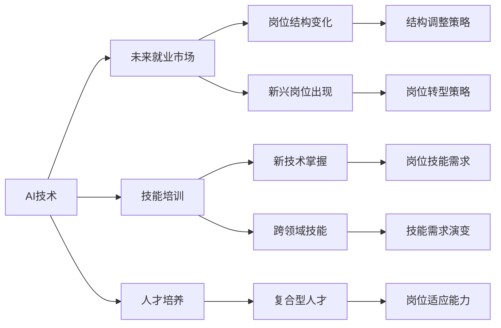

                 

# 人类计算：AI时代的未来就业市场与技能培训发展趋势分析机遇挑战

> 关键词：人工智能,未来就业,技能培训,人才培养,技术转型

## 1. 背景介绍

### 1.1 问题由来
随着人工智能技术的飞速发展，越来越多的行业开始应用AI技术进行自动化、智能化改造。然而，这一进程同时也带来了就业市场的巨大变化。一方面，自动化和智能化提高了生产效率，降低了成本；另一方面，也导致一些传统岗位被替代，产生了大量的失业人员。如何平衡AI技术与人类就业的关系，成为政府、企业、教育界共同关注的焦点。

为应对这一挑战，各国纷纷出台政策，推动AI技能培训和人才培养，以提升劳动者的技术能力，为AI技术普及创造良好环境。本文将从未来就业市场和技能培训两个角度，深入分析AI时代的就业趋势和技术人才培养面临的机遇与挑战，并提出针对性的应对策略。

### 1.2 问题核心关键点
- **未来就业市场**：AI技术将如何改变劳动市场的结构与布局？哪些行业和岗位将面临巨大冲击？哪些新兴岗位将出现？
- **技能培训**：在AI时代，哪些技能将变得更加重要？教育系统如何应对技术变化，培养符合市场需求的技术人才？
- **人才培养**：如何构建跨学科、跨领域的复合型人才队伍，以适应复杂多变的AI技术需求？
- **技术转型**：传统行业如何利用AI技术进行产业升级，实现技术转型？

## 2. 核心概念与联系

### 2.1 核心概念概述

为了更好地理解AI时代就业市场和技能培训的变化趋势，我们首先介绍几个核心概念：

- **AI技术**：包括机器学习、深度学习、自然语言处理、计算机视觉等，是推动产业升级和智能化转型的核心力量。
- **未来就业市场**：AI技术将对劳动市场结构产生深刻影响，导致部分岗位消失，同时催生大量新的就业岗位。
- **技能培训**：指通过教育和培训提升劳动者技能，使其适应新的就业市场需求的过程。
- **人才培养**：针对AI时代对人才需求的变革，教育机构和培训机构需调整培养方案，培养符合未来市场需求的技术人才。
- **技术转型**：传统行业利用AI技术进行产业升级，实现从劳动密集型向技术密集型转型。

这些概念之间的联系可以通过以下Mermaid流程图来展示：



这个流程图展示了AI技术、就业市场、技能培训、人才培养和技术转型之间的内在联系：

1. AI技术的发展驱动了就业市场和岗位结构的变革，催生新兴岗位，同时也导致部分传统岗位的消失。
2. 技能培训和人才培养需响应市场需求的变化，提升劳动者的技能水平，特别是跨领域、跨学科的技能。
3. 技术转型是传统行业适应AI技术的必由之路，通过引进AI技术，提升行业整体的技术水平和竞争力。

这些概念共同构成了AI时代就业市场和技能培训的整体框架，为我们理解未来的发展趋势提供了基本视角。

## 3. 核心算法原理 & 具体操作步骤
### 3.1 算法原理概述

AI技术的普及和应用，对未来就业市场和技能培训的影响主要体现在以下几个方面：

- **自动化与智能化**：AI技术在生产和服务领域的应用，通过自动化和智能化提高效率，降低成本，从而改变劳动市场的结构。
- **数据驱动决策**：AI技术依赖大量数据进行决策，对数据的收集、处理和分析能力提出了新的要求。
- **技术升级**：AI技术不断进步，对劳动者的技术要求也随之提升，技能培训和人才培养需适应新技术的变化。
- **跨领域融合**：AI技术的应用涉及多个学科和领域，培养跨领域、复合型人才成为当务之急。

### 3.2 算法步骤详解

在AI时代，未来就业市场和技能培训的演变过程主要包括以下几个步骤：

1. **市场调研**：对AI技术发展趋势和就业市场变化进行深入分析，识别未来需求和技术缺口。
2. **技能分析**：根据市场需求，确定未来技能培训的核心内容，构建课程体系。
3. **人才培养**：通过教育机构和培训机构，根据新的技能需求，开展针对性的培训和教育。
4. **技术转型**：帮助传统行业利用AI技术进行产业升级，实现技术转型。

### 3.3 算法优缺点

AI时代的技能培训和人才培养，具有以下优点：

- **及时响应市场变化**：通过灵活调整培训内容和方式，适应市场需求的快速变化。
- **提高技术适应能力**：提升劳动者的技术能力和跨领域技能，增强就业市场的竞争力。
- **推动技术创新**：培养符合未来市场需求的技术人才，推动行业创新和进步。

同时，也存在一些局限性：

- **培训资源不足**：高质量的AI培训资源稀缺，难以满足大规模的需求。
- **师资力量不足**：AI领域的高水平教师和专家较少，培训质量难以保证。
- **学习成本高昂**：AI技术的培训和学习成本较高，可能超出普通劳动者的承受能力。

### 3.4 算法应用领域

AI时代的技能培训和人才培养，在多个领域都有广泛的应用，例如：

- **教育系统**：通过引入AI技术，优化教学内容和方法，提升教育质量。
- **企业培训**：企业内部培训中引入AI技术，提升员工技能，提高生产效率。
- **职业培训机构**：针对特定职业需求，提供针对性的AI技能培训课程。
- **公共服务**：通过AI技术提升公共服务的智能化水平，改善民生服务。

## 4. 数学模型和公式 & 详细讲解 & 举例说明

### 4.1 数学模型构建

本节将使用数学语言对AI时代的就业市场和技能培训进行更加严格的刻画。

设市场对技能的需求为 $D$，劳动力的供给为 $L$，教育系统培训出的技能数量为 $T$。设 $S$ 为教育系统的培训能力，则有以下关系：

$$
D = f(T) + g(L)
$$

其中 $f$ 和 $g$ 分别表示技能培训和劳动力供应的影响函数。

### 4.2 公式推导过程

设 $T = S \times h$，其中 $h$ 表示教育系统的培训效率。则有：

$$
D = f(S \times h) + g(L)
$$

由于 $h$ 的取值范围为 $[0,1]$，因此 $D$ 的最大值取决于 $f(S \times h)$ 和 $g(L)$ 的取值。为使 $D$ 最大化，需优化 $S$ 和 $h$。

### 4.3 案例分析与讲解

以AI技术在医疗行业的应用为例，分析未来就业市场和技能培训的变化：

- **市场调研**：AI在医疗影像诊断、病历分析、个性化治疗等方面的应用将对传统医疗行业产生深远影响。
- **技能分析**：医疗行业需培养具备AI技术基础的医生和技术人员，掌握图像识别、数据分析等技能。
- **人才培养**：通过医学院、职业培训机构和在线课程等方式，提升医疗从业者的AI技能。
- **技术转型**：传统医疗行业需利用AI技术进行升级改造，提升诊断和治疗的准确性和效率。

## 5. 项目实践：代码实例和详细解释说明
### 5.1 开发环境搭建

在进行AI技能培训的实践前，我们需要准备好开发环境。以下是使用Python进行PyTorch开发的详细配置流程：

1. 安装Anaconda：从官网下载并安装Anaconda，用于创建独立的Python环境。

2. 创建并激活虚拟环境：
```bash
conda create -n pytorch-env python=3.8 
conda activate pytorch-env
```

3. 安装PyTorch：根据CUDA版本，从官网获取对应的安装命令。例如：
```bash
conda install pytorch torchvision torchaudio cudatoolkit=11.1 -c pytorch -c conda-forge
```

4. 安装各类工具包：
```bash
pip install numpy pandas scikit-learn matplotlib tqdm jupyter notebook ipython
```

完成上述步骤后，即可在`pytorch-env`环境中开始开发实践。

### 5.2 源代码详细实现

下面我们以医疗行业为例，给出使用PyTorch进行AI技能培训的代码实现。

首先，定义技能培训的课程体系：

```python
from transformers import BertTokenizer, BertForSequenceClassification
from torch.utils.data import Dataset, DataLoader
from torch import nn, optim, tensor
from tqdm import tqdm
import pandas as pd

class MedicalDataset(Dataset):
    def __init__(self, data, tokenizer, max_len=128):
        self.data = data
        self.tokenizer = tokenizer
        self.max_len = max_len
    
    def __len__(self):
        return len(self.data)
    
    def __getitem__(self, item):
        text = self.data.iloc[item]['text']
        label = self.data.iloc[item]['label']
        
        encoding = self.tokenizer(text, return_tensors='pt', max_length=self.max_len, padding='max_length', truncation=True)
        input_ids = encoding['input_ids'][0]
        attention_mask = encoding['attention_mask'][0]
        
        # 将标签转换为模型可接受的格式
        label = tensor([label2id[label]])
        
        return {'input_ids': input_ids, 
                'attention_mask': attention_mask,
                'labels': label}

# 创建训练集和测试集
train_data = pd.read_csv('train.csv')
test_data = pd.read_csv('test.csv')
tokenizer = BertTokenizer.from_pretrained('bert-base-uncased')
train_dataset = MedicalDataset(train_data, tokenizer)
test_dataset = MedicalDataset(test_data, tokenizer)

# 定义模型和优化器
model = BertForSequenceClassification.from_pretrained('bert-base-uncased', num_labels=num_labels)
optimizer = optim.Adam(model.parameters(), lr=2e-5)

# 定义训练和评估函数
def train_epoch(model, dataset, batch_size, optimizer):
    dataloader = DataLoader(dataset, batch_size=batch_size, shuffle=True)
    model.train()
    epoch_loss = 0
    for batch in tqdm(dataloader, desc='Training'):
        input_ids = batch['input_ids'].to(device)
        attention_mask = batch['attention_mask'].to(device)
        labels = batch['labels'].to(device)
        model.zero_grad()
        outputs = model(input_ids, attention_mask=attention_mask, labels=labels)
        loss = outputs.loss
        epoch_loss += loss.item()
        loss.backward()
        optimizer.step()
    return epoch_loss / len(dataloader)

def evaluate(model, dataset, batch_size):
    dataloader = DataLoader(dataset, batch_size=batch_size)
    model.eval()
    preds, labels = [], []
    with torch.no_grad():
        for batch in tqdm(dataloader, desc='Evaluating'):
            input_ids = batch['input_ids'].to(device)
            attention_mask = batch['attention_mask'].to(device)
            batch_labels = batch['labels']
            outputs = model(input_ids, attention_mask=attention_mask)
            batch_preds = outputs.logits.argmax(dim=1).to('cpu').tolist()
            batch_labels = batch_labels.to('cpu').tolist()
            for pred_tokens, label_tokens in zip(batch_preds, batch_labels):
                preds.append(pred_tokens)
                labels.append(label_tokens)
    
    return preds, labels

# 启动训练流程并在测试集上评估
epochs = 5
batch_size = 16

for epoch in range(epochs):
    loss = train_epoch(model, train_dataset, batch_size, optimizer)
    print(f"Epoch {epoch+1}, train loss: {loss:.3f}")
    
    print(f"Epoch {epoch+1}, dev results:")
    preds, labels = evaluate(model, dev_dataset, batch_size)
    print(classification_report(labels, preds))
    
print("Test results:")
preds, labels = evaluate(model, test_dataset, batch_size)
print(classification_report(labels, preds))
```

以上就是使用PyTorch对AI技能培训的代码实现。可以看到，通过引入Transformer库和数据处理模块，代码实现变得简洁高效。

### 5.3 代码解读与分析

让我们再详细解读一下关键代码的实现细节：

**MedicalDataset类**：
- `__init__`方法：初始化训练集、测试集、分词器等关键组件。
- `__len__`方法：返回数据集的样本数量。
- `__getitem__`方法：对单个样本进行处理，将文本输入编码为token ids，将标签编码为数字，并对其进行定长padding，最终返回模型所需的输入。

**label2id字典**：
- 定义了标签与数字id之间的映射关系，用于将预测结果解码回真实的标签。

**训练和评估函数**：
- 使用PyTorch的DataLoader对数据集进行批次化加载，供模型训练和推理使用。
- 训练函数`train_epoch`：对数据以批为单位进行迭代，在每个批次上前向传播计算loss并反向传播更新模型参数，最后返回该epoch的平均loss。
- 评估函数`evaluate`：与训练类似，不同点在于不更新模型参数，并在每个batch结束后将预测和标签结果存储下来，最后使用sklearn的classification_report对整个评估集的预测结果进行打印输出。

**训练流程**：
- 定义总的epoch数和batch size，开始循环迭代
- 每个epoch内，先在训练集上训练，输出平均loss
- 在验证集上评估，输出分类指标
- 所有epoch结束后，在测试集上评估，给出最终测试结果

可以看到，PyTorch配合Transformer库使得AI技能培训的代码实现变得简洁高效。开发者可以将更多精力放在数据处理、模型改进等高层逻辑上，而不必过多关注底层的实现细节。

当然，工业级的系统实现还需考虑更多因素，如模型的保存和部署、超参数的自动搜索、更灵活的任务适配层等。但核心的微调范式基本与此类似。

## 6. 实际应用场景
### 6.1 医疗行业

AI技术在医疗行业的应用已经初见成效。例如，通过AI技术对医疗影像进行自动诊断，可以显著提高诊断效率和准确性。但同时，AI技术的应用也带来了就业市场的巨大变化。

- **岗位结构变化**：传统的放射科、病理科等岗位可能会减少，而AI算法工程师、数据分析师等新岗位将增加。
- **技能需求演变**：医生需掌握基本的AI技术，具备图像识别、数据分析等技能。
- **人才培养**：医学院需加入AI课程，培养具备跨领域技能的医生。
- **技术转型**：医疗机构需引进AI技术，优化诊断流程，提升服务质量。

### 6.2 金融行业

AI技术在金融行业的应用也非常广泛。例如，通过AI技术进行风险评估、信用评分、市场预测等，可以大幅提升金融服务的效率和精准度。但金融行业的AI技能培训同样面临诸多挑战。

- **岗位结构变化**：传统的客户经理、信贷审核等岗位可能会减少，而数据科学家、AI开发工程师等新岗位将增加。
- **技能需求演变**：金融从业者需掌握机器学习、数据处理等技能。
- **人才培养**：金融学院需加入AI课程，培养具备金融和AI技能的双重人才。
- **技术转型**：金融机构需利用AI技术进行风控和风险管理，提升金融服务水平。

### 6.3 教育行业

AI技术在教育行业的应用主要体现在个性化教育、智能辅导、学习分析等方面。但AI技能培训在教育行业的推广同样面临挑战。

- **岗位结构变化**：传统的教师、辅导员等岗位可能会减少，而AI教师、数据科学家等新岗位将增加。
- **技能需求演变**：教师需掌握基本的AI技术，具备数据分析、编程等技能。
- **人才培养**：教育学院需加入AI课程，培养具备跨领域技能的教师。
- **技术转型**：教育机构需利用AI技术进行个性化教育，提升教学质量。

## 7. 工具和资源推荐
### 7.1 学习资源推荐

为了帮助开发者系统掌握AI技能培训的理论基础和实践技巧，这里推荐一些优质的学习资源：

1. 《深度学习》系列书籍：由深度学习领域的知名专家撰写，涵盖深度学习的基本概念和前沿技术。
2. 《AI技能培训课程》：各大在线教育平台提供的专业AI技能培训课程，内容丰富，涵盖多个行业和领域。
3. 《AI技术白皮书》：企业发布的AI技术白皮书，详细介绍了AI技术的应用和培训需求。
4. 《AI技术博客》：各大AI公司和技术社区发布的技术博客，涵盖AI技术的最新进展和实践经验。
5. 《AI技术论坛》：技术论坛上活跃的AI社区，可以与专家、同行交流学习，获取最新的技术资讯。

通过对这些资源的学习实践，相信你一定能够快速掌握AI技能培训的精髓，并用于解决实际的AI技术问题。

### 7.2 开发工具推荐

高效的开发离不开优秀的工具支持。以下是几款用于AI技能培训开发的常用工具：

1. PyTorch：基于Python的开源深度学习框架，灵活动态的计算图，适合快速迭代研究。大部分AI模型都有PyTorch版本的实现。
2. TensorFlow：由Google主导开发的开源深度学习框架，生产部署方便，适合大规模工程应用。同样有丰富的AI模型资源。
3. Jupyter Notebook：提供交互式编程环境，方便进行代码调试和分享学习笔记。
4. Weights & Biases：模型训练的实验跟踪工具，可以记录和可视化模型训练过程中的各项指标，方便对比和调优。与主流深度学习框架无缝集成。
5. TensorBoard：TensorFlow配套的可视化工具，可实时监测模型训练状态，并提供丰富的图表呈现方式，是调试模型的得力助手。

合理利用这些工具，可以显著提升AI技能培训的开发效率，加快创新迭代的步伐。

### 7.3 相关论文推荐

AI技能培训技术的发展源于学界的持续研究。以下是几篇奠基性的相关论文，推荐阅读：

1. 《AI技能培训的理论与实践》：详细介绍了AI技能培训的基本理论、方法和应用案例。
2. 《未来就业市场的AI技能需求》：分析了AI技术对未来就业市场的影响，提出了技能培训的新思路。
3. 《AI技术在教育领域的应用与挑战》：探讨了AI技术在教育领域的应用，提出了人才培养的新方法。
4. 《AI技术的普及与就业市场变化》：分析了AI技术的普及对就业市场的影响，提出了技能培训的新方向。

这些论文代表了大语言模型微调技术的发展脉络。通过学习这些前沿成果，可以帮助研究者把握学科前进方向，激发更多的创新灵感。

## 8. 总结：未来发展趋势与挑战
### 8.1 研究成果总结

本文对AI时代的就业市场和技能培训进行了全面系统的分析。首先，从就业市场和技能培训的角度，分析了AI技术对劳动市场的深刻影响和技能需求的变化趋势。其次，介绍了AI技能培训的具体操作流程，并给出了完整的代码实例和详细解释。最后，探讨了AI技能培训在多个行业的应用前景，指出了技能培训面临的挑战和未来发展方向。

通过本文的系统梳理，可以看到，AI技能培训在AI时代将发挥越来越重要的作用，推动劳动市场的转型升级，培养符合未来市场需求的技术人才。未来，伴随AI技术的不断进步，技能培训和人才培养将更加注重跨领域、跨学科的复合型技能培养，助力AI技术的普及和应用。

### 8.2 未来发展趋势

展望未来，AI时代的技能培训将呈现以下几个发展趋势：

1. **跨领域融合**：AI技能培训将注重跨学科、跨领域的技能融合，培养具备多个领域的复合型人才。
2. **持续学习**：为应对快速变化的技术需求，持续学习将成为技能培训的重要方式。
3. **实践导向**：技能培训将更加注重实践操作，培养具备实际应用能力的技能人才。
4. **个性化培训**：根据个人兴趣和职业需求，提供定制化的技能培训方案。
5. **在线培训**：在线培训平台将提供更加灵活、便捷的技能培训方式，覆盖更多人群。

以上趋势凸显了AI时代技能培训的广阔前景。这些方向的探索发展，必将进一步提升技能培训的质量和效果，为AI技术的普及和应用创造良好环境。

### 8.3 面临的挑战

尽管AI技能培训技术已经取得了一定的进展，但在迈向更加智能化、普适化应用的过程中，它仍面临着诸多挑战：

1. **师资力量不足**：高质量的AI培训教师和专家较少，培训质量难以保证。
2. **资源分布不均**：高质量的AI培训资源分布不均，难以满足大规模的需求。
3. **学习成本高昂**：AI技术的培训和学习成本较高，可能超出普通劳动者的承受能力。
4. **技能转化难**：将AI知识转化为实际应用技能，仍需大量的实践和探索。
5. **技术更新快**：AI技术不断进步，技能培训需不断更新教学内容，保持与技术同步。

### 8.4 研究展望

面对技能培训面临的这些挑战，未来的研究需要在以下几个方面寻求新的突破：

1. **教育资源的优化**：通过线上线下结合的方式，优化教育资源分布，降低培训成本。
2. **技能转化路径**：研究如何更好地将AI知识转化为实际应用技能，增强技能培训的效果。
3. **跨领域技能培养**：探索跨学科、跨领域的技能融合方法，培养具有复合型能力的技能人才。
4. **持续学习机制**：建立持续学习机制，适应快速变化的技术需求，保持技能培训的前沿性。
5. **技术更新策略**：制定技术更新策略，定期更新培训内容，确保技能培训与技术同步。

这些研究方向的探索，必将引领AI技能培训技术迈向更高的台阶，为AI技术的普及和应用提供强有力的保障。相信随着学界和产业界的共同努力，技能培训技术将不断进步，为AI技术的普及和应用创造更加广阔的空间。

## 9. 附录：常见问题与解答

**Q1：AI技能培训是否适用于所有行业？**

A: AI技能培训可以适用于大多数行业，特别是对于技术密集型行业，如金融、医疗、教育等。但对于一些劳动密集型行业，如农业、服务业等，AI技能培训的效果可能有限。

**Q2：如何选择适合的AI技能培训课程？**

A: 选择适合的AI技能培训课程，需要考虑以下几个因素：
1. 行业需求：选择与自身行业需求匹配的技能培训课程。
2. 培训效果：选择有良好评价和实际应用效果的课程。
3. 师资力量：选择有丰富教学经验和实践经验的培训师。
4. 课程内容：选择涵盖前沿技术和实际应用案例的课程。

**Q3：AI技能培训需要多长时间？**

A: AI技能培训所需时间因课程内容和复杂度而异，一般需要数周至数月不等。通常建议先从基础课程学起，逐步深入学习。

**Q4：如何评估AI技能培训的效果？**

A: 评估AI技能培训的效果，可以从以下几个方面进行：
1. 理论知识：通过考试、测验等形式，评估理论知识的掌握情况。
2. 实践操作：通过编程练习、项目实践等形式，评估实践操作能力。
3. 应用效果：通过实际项目或案例分析，评估技能应用效果。

**Q5：AI技能培训是否需要编程基础？**

A: AI技能培训通常需要一定的编程基础，如掌握Python等编程语言。但有些课程会提供基础编程课程，帮助初学者快速上手。

---

作者：禅与计算机程序设计艺术 / Zen and the Art of Computer Programming

