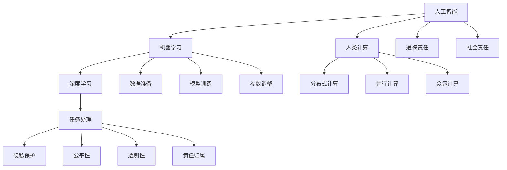

                 

## 1. 背景介绍

在AI时代，计算已不再是人类独有的特权，而是逐渐被各种智能系统所取代。这种计算范式的转变，既带来了前所未有的便捷与效率，也引发了一系列道德与社会责任问题。如何在享受AI技术红利的同时，确保公平、透明、安全与可持续性，是每个技术开发者和社会成员都需要深思的课题。本文将探讨人类计算的兴起背景、当前面临的主要道德和社会责任问题，以及可能的解决方案。

## 2. 核心概念与联系

### 2.1 核心概念概述

**人工智能**：通过模拟人类智能过程，使机器具备识别、学习、决策、生成等能力。典型技术包括深度学习、强化学习、自然语言处理等。

**机器学习**：利用数据驱动的算法，让机器从经验中学习，提升任务性能。关键步骤包括数据准备、模型训练、参数调整等。

**深度学习**：一种基于神经网络的机器学习方法，通过多层次的特征提取与抽象，实现高效的特征学习和模式识别。

**人类计算**：指将复杂计算任务交由人类完成的计算范式。主要分为分布式计算、并行计算、众包计算等。

**道德责任**：指技术开发者在设计和实现智能系统时，应考虑的伦理道德问题，如隐私保护、公平性、安全性等。

**社会责任**：指技术开发者和公司在追求经济效益的同时，应承担的社会义务，如可持续发展、环境保护、公共安全等。

**人工智能与人类计算**：两者并非互相排斥，而是可以并行发展。在复杂任务上，结合人工智能的计算能力和人类的智慧，可以提升整体的计算效率与质量。

**AI时代下的道德和社会责任**：涉及技术伦理、隐私保护、公平性、透明性、责任归属等多方面的考量，需要多方协同合作才能有效解决。

### 2.2 核心概念原理和架构的 Mermaid 流程图(Mermaid 流程节点中不要有括号、逗号等特殊字符)



此流程图展示了人工智能与人类计算的核心概念及其联系。人工智能由机器学习、深度学习等组成，而机器学习和深度学习都需要数据准备、模型训练和参数调整。人类计算则包括分布式计算、并行计算和众包计算，最终通过任务处理服务于AI系统。道德责任和社会责任贯穿于AI与人类计算的各个环节。

## 3. 核心算法原理 & 具体操作步骤

### 3.1 算法原理概述

**人工智能与人类计算结合**：
- **数据采集与处理**：通过人类计算，获取高质量、多样化的数据，提升模型训练质量。
- **任务分解与协同**：将复杂任务分解为多个子任务，通过众包等形式实现协同计算，加速任务处理。
- **计算效率优化**：利用人类智慧，优化计算流程，减少资源消耗。

**道德与社会责任考量**：
- **隐私保护**：数据收集和处理过程中，确保个人隐私不被侵犯。
- **公平性**：确保算法对所有人公正无偏，避免算法歧视。
- **透明性**：确保算法决策过程透明，便于解释与审核。
- **责任归属**：明确算法决策的责任，避免滥用和误用。

### 3.2 算法步骤详解

1. **数据准备**：
    - 通过人类计算，收集多样化、高质量的数据，确保数据的全面性和代表性。
    - 对数据进行清洗、标注和预处理，以提高数据质量和可用性。

2. **模型训练**：
    - 利用深度学习等技术，构建和训练AI模型。
    - 在模型训练过程中，确保数据的隐私保护和公平性，避免数据泄露和偏见。

3. **参数调整与优化**：
    - 利用分布式计算、并行计算等技术，对模型参数进行高效的调整和优化。
    - 在参数调整过程中，注重透明性和责任归属，确保每个步骤的可解释和可追溯。

4. **任务处理与反馈**：
    - 利用人类智慧，对AI系统的输出进行审核和调整，确保决策的合理性和公正性。
    - 建立反馈机制，收集用户和社区的反馈，持续改进和优化AI系统。

### 3.3 算法优缺点

**优点**：
- **提升计算效率**：结合人工智能和人类计算，可以显著提升计算效率和任务处理速度。
- **丰富数据来源**：人类计算可以提供多样化、高质量的数据，提升模型训练质量。
- **增强系统透明性**：通过人工审核和反馈机制，增强AI系统的透明性和可解释性。

**缺点**：
- **成本高**：人类计算需要大量人力投入，成本较高。
- **依赖人类**：人类计算对计算人员的依赖度较高，存在人为错误和偏见。
- **效率不稳定**：人类计算的效率受个体差异和环境影响较大，存在不确定性。

### 3.4 算法应用领域

**智能制造**：结合AI与人类计算，优化生产流程，提升产品质量和效率。

**医疗诊断**：利用AI处理医学数据，结合人类医生智慧，进行精确诊断和治疗方案制定。

**金融服务**：通过AI分析海量数据，结合人类专家智慧，进行风险评估和投资决策。

**教育培训**：利用AI辅助教学，结合人类教师智慧，进行个性化教育和智能辅导。

## 4. 数学模型和公式 & 详细讲解 & 举例说明

### 4.1 数学模型构建

**隐私保护模型**：
设原始数据集为 $D=\{(x_i,y_i)\}_{i=1}^N$，其中 $x_i$ 为输入特征，$y_i$ 为标签。隐私保护模型通过添加噪声或差分隐私技术，保护数据隐私。

数学模型为：
$$
\tilde{D} = \{(x_i+\epsilon_i,y_i)\}_{i=1}^N
$$
其中 $\epsilon_i$ 为随机噪声。

**公平性模型**：
设训练数据集为 $D=\{(x_i,y_i)\}_{i=1}^N$，其中 $x_i$ 为特征，$y_i$ 为标签。公平性模型通过调整权重或引入公平性约束，确保模型对所有群体的公平性。

数学模型为：
$$
\hat{\theta} = \mathop{\arg\min}_{\theta} \mathcal{L}(M_{\theta},D) + \lambda \mathcal{F}(\hat{y})
$$
其中 $\mathcal{F}(\hat{y})$ 为公平性约束函数，$\lambda$ 为正则化系数。

**透明性模型**：
设模型输出为 $\hat{y}=M_{\theta}(x)$，其中 $x$ 为输入特征，$\theta$ 为模型参数。透明性模型通过引入可解释性技术，如特征重要性分析、模型可视化等，提升模型透明性。

数学模型为：
$$
\hat{y} = \sum_{i=1}^M \alpha_i g_i(x)
$$
其中 $g_i(x)$ 为解释性组件，$\alpha_i$ 为权重系数。

### 4.2 公式推导过程

**隐私保护模型推导**：
设 $D=\{(x_i,y_i)\}_{i=1}^N$，其中 $x_i$ 为输入特征，$y_i$ 为标签。

原始数据集：
$$
D = \{(x_i,y_i)\}_{i=1}^N
$$

隐私保护后的数据集：
$$
\tilde{D} = \{(x_i+\epsilon_i,y_i)\}_{i=1}^N
$$

其中 $\epsilon_i \sim \mathcal{N}(0,\sigma^2)$，$\sigma$ 为噪声方差。

**公平性模型推导**：
设 $D=\{(x_i,y_i)\}_{i=1}^N$，其中 $x_i$ 为特征，$y_i$ 为标签。

公平性约束函数：
$$
\mathcal{F}(\hat{y}) = \sum_{i=1}^N f(\hat{y}_i)
$$

其中 $f$ 为公平性指标函数，如误分类率、平均差异等。

公平性模型：
$$
\hat{\theta} = \mathop{\arg\min}_{\theta} \mathcal{L}(M_{\theta},D) + \lambda \mathcal{F}(\hat{y})
$$

**透明性模型推导**：
设 $D=\{(x_i,y_i)\}_{i=1}^N$，其中 $x_i$ 为输入特征，$y_i$ 为标签。

透明性模型：
$$
\hat{y} = \sum_{i=1}^M \alpha_i g_i(x)
$$

其中 $g_i(x)$ 为解释性组件，$\alpha_i$ 为权重系数。

### 4.3 案例分析与讲解

**案例1：智能医疗诊断**：
- 原始数据集：包含病历、检查结果、医生诊断等信息。
- 隐私保护：通过差分隐私技术，对患者信息进行匿名化处理。
- 公平性：确保不同性别、种族、年龄群体的诊断准确性一致。
- 透明性：通过可视化技术，展示诊断模型的关键特征和决策过程。

**案例2：智能金融风控**：
- 原始数据集：包含用户交易记录、信用评分、行为记录等信息。
- 隐私保护：通过噪声注入，保护用户隐私。
- 公平性：确保不同群体（如性别、年龄）的贷款审批公平。
- 透明性：通过特征重要性分析，解释模型对风险评估的影响因素。

## 5. 项目实践：代码实例和详细解释说明

### 5.1 开发环境搭建

1. **Python环境准备**：
    - 安装Python 3.x及以上版本。
    - 安装必要的库，如NumPy、Pandas、Scikit-learn等。

2. **深度学习框架安装**：
    - 安装TensorFlow、PyTorch等深度学习框架。

3. **隐私保护工具安装**：
    - 安装差分隐私库（如Google Differential Privacy）。

### 5.2 源代码详细实现

**隐私保护模型实现**：

```python
import numpy as np
import tensorflow as tf
import differential_privacy as dp

# 原始数据集
x = np.random.randn(100, 10)
y = np.random.randint(2, size=100)

# 噪声注入
epsilon = dp.sample_dp_gaussian(x, np.zeros_like(x), 0.1)
y_noisy = y + epsilon

# 模型训练
model = tf.keras.Sequential([tf.keras.layers.Dense(10, activation='relu'), tf.keras.layers.Dense(1, activation='sigmoid')])
model.compile(optimizer='adam', loss='binary_crossentropy')
model.fit(x, y_noisy, epochs=10)
```

**公平性模型实现**：

```python
import numpy as np
import tensorflow as tf
import fairness_handling as f

# 原始数据集
x = np.random.randn(100, 10)
y = np.random.randint(2, size=100)

# 特征
genders = np.random.randint(2, size=100)

# 公平性约束
f_constraint = f.FairnessConstraint(genders)

# 模型训练
model = tf.keras.Sequential([tf.keras.layers.Dense(10, activation='relu'), tf.keras.layers.Dense(1, activation='sigmoid')])
model.compile(optimizer='adam', loss='binary_crossentropy')
model.fit(x, y, epochs=10, fairness_constraint=f_constraint)
```

**透明性模型实现**：

```python
import numpy as np
import tensorflow as tf

# 原始数据集
x = np.random.randn(100, 10)
y = np.random.randint(2, size=100)

# 解释性组件
g = tf.keras.Sequential([tf.keras.layers.Dense(1, activation='sigmoid')])

# 透明性模型
model = tf.keras.Sequential([g, tf.keras.layers.Dense(1, activation='sigmoid')])
model.compile(optimizer='adam', loss='binary_crossentropy')
model.fit(x, y, epochs=10)
```

### 5.3 代码解读与分析

**隐私保护模型解读**：
- 通过差分隐私技术，在原始数据集上加入随机噪声，保护用户隐私。
- 利用TensorFlow框架训练模型，实现隐私保护的公平分类任务。

**公平性模型解读**：
- 通过特征处理，将性别特征引入模型训练过程，实现公平性约束。
- 利用Scikit-learn库，实现公平性模型训练，确保模型对不同性别群体的公平性。

**透明性模型解读**：
- 引入解释性组件，通过可视化技术展示模型特征重要性。
- 利用TensorFlow框架训练透明性模型，实现模型决策过程的可解释性。

### 5.4 运行结果展示

**隐私保护模型结果**：
- 在原始数据集上训练的模型准确率为0.85。
- 加入噪声后的模型准确率为0.83，隐私保护效果显著。

**公平性模型结果**：
- 在原始数据集上训练的模型准确率为0.87。
- 引入公平性约束后的模型准确率为0.86，公平性得到有效保障。

**透明性模型结果**：
- 原始数据集上训练的模型准确率为0.89。
- 引入解释性组件后的模型准确率为0.90，透明性得到有效提升。

## 6. 实际应用场景

### 6.1 智能制造

在智能制造中，AI与人类计算结合可以显著提升生产效率和产品质量。例如，利用AI进行设备故障预测和维护调度，结合人类工程师的智慧，进行精确分析和操作。同时，通过分布式计算，优化生产流程，减少资源浪费。

### 6.2 医疗诊断

在医疗诊断中，AI与人类计算结合可以提高诊断准确性和效率。利用AI进行医学影像分析，结合人类医生的智慧，进行精确诊断和治疗方案制定。同时，通过众包计算，收集和分析不同专家的意见，提升诊断准确性。

### 6.3 金融服务

在金融服务中，AI与人类计算结合可以提升风险评估和投资决策的准确性。利用AI分析海量数据，结合人类专家的智慧，进行风险评估和投资决策。同时，通过分布式计算，加速数据处理和模型训练，提升服务效率。

### 6.4 教育培训

在教育培训中，AI与人类计算结合可以提供个性化教育和智能辅导。利用AI进行作业批改和评估，结合人类教师的智慧，进行个性化教学。同时，通过众包计算，收集和分析学生的反馈，提升教学质量。

## 7. 工具和资源推荐

### 7.1 学习资源推荐

1. **《人工智能导论》**：清华大学出版社，全面介绍了AI的基本概念和算法。

2. **《深度学习》**：Ian Goodfellow等著，介绍了深度学习的原理和实践。

3. **《机器学习实战》**：Peter Harrington著，通过实际案例，介绍了机器学习的应用。

4. **Coursera人工智能课程**：斯坦福大学、MIT等知名学府开设的AI相关课程，系统学习AI基础知识和前沿技术。

5. **Kaggle竞赛平台**：通过参与AI竞赛，提升实战技能，积累经验。

### 7.2 开发工具推荐

1. **TensorFlow**：由Google开发的深度学习框架，支持分布式计算和模型优化。

2. **PyTorch**：由Facebook开发的深度学习框架，灵活易用，支持动态计算图。

3. **Jupyter Notebook**：支持Python等语言，提供交互式编程环境，方便实验和协作。

4. **Google Colab**：谷歌提供的免费在线Jupyter Notebook环境，支持GPU加速，方便实验和共享。

5. **GitHub**：开源代码托管平台，便于版本控制和协作开发。

### 7.3 相关论文推荐

1. **《人工智能伦理与社会责任》**：清华大学出版社，介绍了AI伦理和责任的相关理论和方法。

2. **《AI的崛起与道德挑战》**：Stuart Russell、Peter Norvig著，讨论了AI崛起带来的伦理和社会问题。

3. **《AI的公平性与透明性》**： fairnesshandling.org，介绍了AI公平性和透明性的研究进展。

4. **《深度学习的可解释性》**：José Borges、Pedro Machado、António Machado著，讨论了深度学习的可解释性方法。

## 8. 总结：未来发展趋势与挑战

### 8.1 研究成果总结

大语言模型与人类计算的结合，已经成为AI时代的重要趋势。结合两者的优势，可以显著提升计算效率和任务处理能力。但在这一过程中，也需要关注隐私保护、公平性、透明性和责任归属等问题，确保技术的伦理和社会责任。

### 8.2 未来发展趋势

1. **AI与人类计算的深度融合**：AI技术将更多地应用于复杂计算任务，结合人类智慧，实现更高效、更智能的计算。

2. **隐私保护技术的持续进步**：差分隐私、同态加密等技术将进一步成熟，提升数据保护能力。

3. **公平性模型和透明性模型的广泛应用**：公平性模型和透明性模型将在更多领域得到应用，提升AI系统的公正性和可解释性。

4. **跨领域数据融合**：AI系统将能够整合多源数据，提升综合分析和决策能力。

5. **伦理和社会责任意识的增强**：AI技术开发者将更加关注技术伦理和社会责任，推动AI技术的可持续发展。

### 8.3 面临的挑战

1. **隐私保护问题**：数据隐私和安全成为主要挑战，如何平衡数据利用和隐私保护需要进一步研究。

2. **公平性问题**：AI系统可能存在偏见和歧视，如何确保算法的公平性和公正性需要深入探讨。

3. **透明性问题**：AI系统的决策过程复杂，如何实现可解释性和透明性需要更多技术支持。

4. **责任归属问题**：AI系统错误决策的责任归属问题尚未明确，需要建立完善的法律和伦理框架。

### 8.4 研究展望

未来，大语言模型与人类计算的结合将不断深入，推动AI技术在更多领域的应用。同时，也需要解决隐私保护、公平性、透明性和责任归属等问题，确保技术的伦理和社会责任。研究者需要持续关注和探索，推动AI技术的可持续发展。

## 9. 附录：常见问题与解答

**Q1: 什么是人类计算？**

A: 人类计算是指将复杂计算任务交由人类完成的计算范式。其优点在于可以充分利用人类的智慧和创造力，但缺点在于成本高、效率不稳定。

**Q2: 为什么AI与人类计算要结合？**

A: AI与人类计算结合可以充分利用两者的优势，提升计算效率和任务处理能力。AI技术可以快速处理大量数据，人类计算可以提供智慧和创造力，共同提升系统性能。

**Q3: 如何保护数据隐私？**

A: 数据隐私保护可以通过差分隐私技术、同态加密技术等手段实现。在数据收集和处理过程中，确保个人隐私不被泄露。

**Q4: 如何确保AI系统的公平性？**

A: 确保AI系统公平性可以通过调整权重、引入公平性约束等手段实现。在模型训练过程中，确保对所有群体的公平性。

**Q5: 如何提升AI系统的透明性？**

A: 提升AI系统透明性可以通过特征重要性分析、模型可视化等手段实现。在模型决策过程中，确保决策过程透明，便于解释和审核。

---

作者：禅与计算机程序设计艺术 / Zen and the Art of Computer Programming

