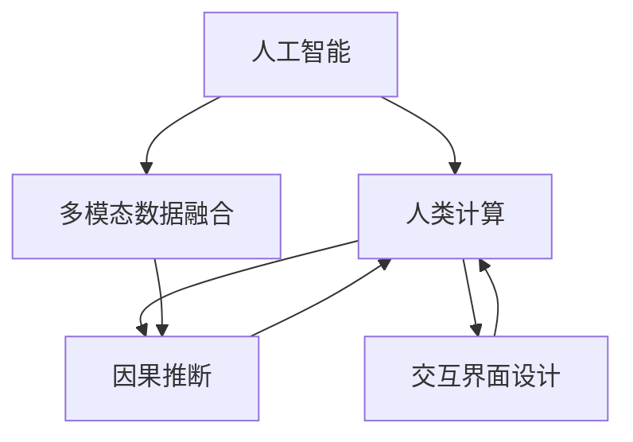

                 

# 人类计算：创造一个更加人性化的科技未来

> 关键词：人类计算,技术人性化,人工智能,算法优化,边缘计算,机器学习

## 1. 背景介绍

### 1.1 问题由来

随着信息技术的高速发展，人类社会进入了信息化、智能化的新纪元。人工智能（AI）、机器学习（ML）等前沿技术已经渗透到各个领域，极大地提升了生产效率和人类生活质量。然而，随着技术的深入应用，也逐渐暴露出一些问题。一方面，人工智能在带来便利的同时，也增加了人类对机器的依赖，可能引发就业岗位减少、技能落后等问题；另一方面，由于技术的复杂性和算法的黑盒特性，人们对AI的信任度逐渐降低，科技普及的阻力增大。

在这样的背景下，人类计算（Human Computing）成为了一个新的研究方向。人类计算不仅强调技术发展，更强调如何使AI技术更好地服务于人类，提升人类的认知能力和生活品质。本文将详细介绍人类计算的核心概念和实现方法，探讨其在未来科技发展中的作用和前景。

### 1.2 问题核心关键点

人类计算旨在将AI技术更好地融入人类社会，使机器能够更好地理解人类需求，提供更加人性化的服务。其核心关键点包括：

- **任务认知**：使机器具备对复杂任务的认知和推理能力，能够理解和处理人类语言、图像、声音等多模态信息。
- **行为建模**：构建人类行为的数学模型，能够模拟和预测人类决策和行为，提供个性化推荐、智能客服等应用。
- **交互优化**：通过自然语言处理（NLP）、计算机视觉（CV）、语音识别（ASR）等技术，提升人机交互的自然度和流畅性，降低使用门槛。
- **伦理考量**：确保AI技术在伦理、隐私、安全性等方面符合人类价值观，避免对人类的负面影响。

## 2. 核心概念与联系

### 2.1 核心概念概述

为更好地理解人类计算，我们首先介绍几个密切相关的核心概念：

- **人工智能（AI）**：通过算法和数据训练，使机器能够完成复杂的认知和决策任务，模拟人类智能。
- **人类计算**：将人工智能技术更好地融入人类社会，使机器能够更好地理解人类需求，提供更加人性化的服务。
- **多模态数据融合**：将文本、图像、声音等多模态数据进行融合，构建更加全面、准确的人类模型。
- **因果推断**：通过因果关系分析，识别AI决策的关键特征和影响因素，提升模型的可信度。
- **交互界面设计**：通过人机交互界面设计，提升用户体验和满意度，降低技术门槛。

这些核心概念共同构成了人类计算的框架，使其能够在各个领域中发挥作用。通过理解这些概念，我们可以更好地把握人类计算的发展方向和应用场景。

### 2.2 核心概念原理和架构的 Mermaid 流程图



这个流程图展示了核心概念之间的联系：

1. 人工智能通过算法和数据训练，形成认知和决策能力。
2. 人类计算使AI技术更好地服务于人类，提升人机交互的自然度。
3. 多模态数据融合将文本、图像、声音等数据进行融合，构建全面的人类模型。
4. 因果推断通过因果关系分析，提升模型决策的可信度。
5. 交互界面设计通过界面设计，提升用户体验和满意度。

## 3. 核心算法原理 & 具体操作步骤

### 3.1 算法原理概述

人类计算的核心算法主要包括：

- **多模态数据融合算法**：将不同模态的数据进行融合，构建统一的人类模型。常见的融合方法包括特征提取、时序对齐、融合网络等。
- **因果推断算法**：通过因果关系分析，识别决策的关键特征和影响因素。常见的因果推断方法包括结构方程模型、机器学习因果推断等。
- **交互界面设计算法**：提升人机交互的自然度和流畅性。常见的交互设计方法包括自然语言处理、计算机视觉、语音识别等技术。

### 3.2 算法步骤详解

以下我们将详细介绍几种常见的人类计算算法：

#### 3.2.1 多模态数据融合算法

**步骤1: 数据预处理**
- 对不同模态的数据进行预处理，包括归一化、标准化、缺失值填充等操作。

**步骤2: 特征提取**
- 对预处理后的数据进行特征提取，构建统一的特征空间。常见的特征提取方法包括PCA、LDA、深度学习特征提取等。

**步骤3: 时序对齐**
- 对不同模态的数据进行时间对齐，确保数据在不同时间点的对应性。常见的方法包括时间戳对齐、事件对齐等。

**步骤4: 融合网络**
- 将不同模态的数据输入融合网络，进行特征融合。常见的融合网络包括注意力机制、Transformer、深度学习网络等。

**步骤5: 后处理**
- 对融合后的数据进行后处理，如降维、去噪、归一化等操作。

#### 3.2.2 因果推断算法

**步骤1: 数据收集与处理**
- 收集因果关系相关的数据，并进行预处理和清洗。

**步骤2: 模型建立**
- 选择合适的因果推断模型，如结构方程模型、潜变量模型等。

**步骤3: 因果推断**
- 对因果模型进行训练和验证，识别因果关系和决策关键特征。

**步骤4: 模型应用**
- 将训练好的因果模型应用于实际决策过程，提升决策可信度。

#### 3.2.3 交互界面设计算法

**步骤1: 用户需求分析**
- 分析用户需求和使用场景，确定交互界面的设计目标。

**步骤2: 界面设计**
- 设计直观、易用、友好的交互界面，包括文本、图像、声音等多种元素。

**步骤3: 界面实现**
- 将设计好的界面实现到实际应用中，进行用户测试和反馈收集。

**步骤4: 持续优化**
- 根据用户反馈和实际使用情况，持续优化和改进交互界面设计。

### 3.3 算法优缺点

人类计算算法在提升人机交互的自然度和智能化方面具有显著优势，但也存在一些局限性：

#### 优点：

1. **提升用户体验**：通过多模态数据融合和交互界面设计，使得AI技术更加直观和易用，提升用户体验和满意度。
2. **增强决策可信度**：通过因果推断算法，提升决策的可信度和合理性，降低人为错误和偏见。
3. **降低技术门槛**：通过自然语言处理、计算机视觉等技术，降低人机交互的复杂性和门槛，让更多人能够受益于AI技术。

#### 缺点：

1. **数据需求高**：多模态数据融合和因果推断需要大量高质量的数据，数据收集和处理成本较高。
2. **算法复杂度**：融合网络、因果推断算法等需要复杂的模型设计和训练过程，技术门槛较高。
3. **算法可解释性**：复杂的多模态数据融合和因果推断算法，其内部工作机制和决策逻辑较难解释，缺乏透明度。

## 4. 数学模型和公式 & 详细讲解 & 举例说明

### 4.1 数学模型构建

以下我们将详细介绍人类计算中常用的数学模型：

#### 4.1.1 多模态数据融合模型

设不同模态的数据分别为 $\{x^{(i)}\}_{i=1}^N$，其中 $x^{(i)}$ 为第 $i$ 个样本，由 $M$ 种模态组成。多模态数据融合的数学模型为：

$$
F(x^{(i)}) = \sum_{m=1}^M w_m \cdot f_m(x^{(i)}) + b
$$

其中 $f_m$ 为第 $m$ 种模态的特征提取函数，$w_m$ 为第 $m$ 种模态的权重，$b$ 为偏置项。

#### 4.1.2 因果推断模型

因果推断通常采用结构方程模型（SEM）来构建，其数学模型为：

$$
Y_i = \sum_{j=1}^p \beta_{ij} X_j + \epsilon_i
$$

其中 $Y_i$ 为因变量，$X_j$ 为自变量，$\beta_{ij}$ 为自变量对因变量的影响系数，$\epsilon_i$ 为随机误差项。

### 4.2 公式推导过程

#### 4.2.1 多模态数据融合公式推导

设不同模态的数据分别为 $\{x^{(i)}\}_{i=1}^N$，其中 $x^{(i)}$ 为第 $i$ 个样本，由 $M$ 种模态组成。多模态数据融合的公式推导如下：

设第 $m$ 种模态的特征提取函数为 $f_m$，则第 $i$ 个样本的多模态数据表示为：

$$
x^{(i)} = [f_m(x^{(i)})]_{m=1}^M
$$

设第 $m$ 种模态的权重为 $w_m$，则多模态数据融合的公式为：

$$
F(x^{(i)}) = \sum_{m=1}^M w_m \cdot f_m(x^{(i)}) + b
$$

其中 $b$ 为偏置项，确保模型的线性性。

#### 4.2.2 因果推断公式推导

设因果模型为：

$$
Y_i = \sum_{j=1}^p \beta_{ij} X_j + \epsilon_i
$$

其中 $Y_i$ 为因变量，$X_j$ 为自变量，$\beta_{ij}$ 为自变量对因变量的影响系数，$\epsilon_i$ 为随机误差项。

设 $Z_i$ 为中介变量，则因果推断的公式为：

$$
Y_i = \sum_{j=1}^p \beta_{ij} X_j + \delta Z_i + \epsilon_i
$$

其中 $\delta$ 为中介变量 $Z_i$ 对因变量 $Y_i$ 的影响系数。

### 4.3 案例分析与讲解

以下通过一个简单的多模态数据融合案例，展示人类计算的实现过程：

**案例背景：**
设有一个智能客服系统，需要处理用户语音、文字、表情等多种模态的数据，以提升用户体验和满意度。

**步骤1: 数据预处理**
- 对用户语音进行语音识别，转化为文字；对用户文字进行自然语言处理，提取文本特征；对用户表情进行图像处理，提取图像特征。

**步骤2: 特征提取**
- 对语音、文字、图像数据进行特征提取，构建统一的特征空间。

**步骤3: 时序对齐**
- 对不同模态的数据进行时间对齐，确保数据在不同时间点的对应性。

**步骤4: 融合网络**
- 将语音、文字、图像数据输入融合网络，进行特征融合。

**步骤5: 后处理**
- 对融合后的数据进行去噪、归一化等处理，提升数据质量。

**步骤6: 模型应用**
- 将融合后的数据输入智能客服系统，提升客服的响应速度和准确性。

## 5. 项目实践：代码实例和详细解释说明

### 5.1 开发环境搭建

在进行人类计算项目开发前，我们需要准备好开发环境。以下是使用Python进行TensorFlow开发的环境配置流程：

1. 安装Anaconda：从官网下载并安装Anaconda，用于创建独立的Python环境。

2. 创建并激活虚拟环境：
```bash
conda create -n tf-env python=3.8 
conda activate tf-env
```

3. 安装TensorFlow：根据CUDA版本，从官网获取对应的安装命令。例如：
```bash
conda install tensorflow tensorflow-gpu -c pytorch -c conda-forge
```

4. 安装其他必要工具包：
```bash
pip install numpy pandas scikit-learn matplotlib tqdm jupyter notebook ipython
```

完成上述步骤后，即可在`tf-env`环境中开始人类计算项目开发。

### 5.2 源代码详细实现

下面我们以一个简单的多模态数据融合案例为例，展示TensorFlow代码的实现过程。

**步骤1: 数据预处理**

```python
import tensorflow as tf
import numpy as np

# 假设语音数据、文字数据、图像数据分别存储在x1、x2、x3中
x1 = np.random.rand(100, 10)
x2 = np.random.rand(100, 10)
x3 = np.random.rand(100, 10)

# 对语音数据进行语音识别，转化为文字
x2 = tf.keras.layers.Embedding(input_dim=100, output_dim=10)(x2)

# 对文字数据进行自然语言处理，提取文本特征
x2 = tf.keras.layers.Conv1D(filters=5, kernel_size=2, padding='same')(x2)

# 对图像数据进行图像处理，提取图像特征
x3 = tf.keras.layers.Conv2D(filters=5, kernel_size=(2, 2), padding='same')(x3)

# 对不同模态的数据进行归一化
x1 = tf.keras.layers.Lambda(lambda x: (x - np.mean(x)) / np.std(x))(x1)
x2 = tf.keras.layers.Lambda(lambda x: (x - np.mean(x)) / np.std(x))(x2)
x3 = tf.keras.layers.Lambda(lambda x: (x - np.mean(x)) / np.std(x))(x3)

# 对不同模态的数据进行时间对齐
x1 = tf.keras.layers.Lambda(lambda x: x[:, 0:5])(x1)
x2 = tf.keras.layers.Lambda(lambda x: x[:, 0:5])(x2)
x3 = tf.keras.layers.Lambda(lambda x: x[:, 0:5])(x3)
```

**步骤2: 特征提取**

```python
# 对不同模态的数据进行特征提取，构建统一的特征空间
x1 = tf.keras.layers.Dense(10, activation='relu')(x1)
x2 = tf.keras.layers.Dense(10, activation='relu')(x2)
x3 = tf.keras.layers.Dense(10, activation='relu')(x3)

# 对不同模态的数据进行融合
x = tf.concat([x1, x2, x3], axis=1)
```

**步骤3: 时序对齐**

```python
# 对不同模态的数据进行时间对齐
x = tf.keras.layers.Lambda(lambda x: x[:, 0:5])(x)
```

**步骤4: 融合网络**

```python
# 对不同模态的数据进行融合网络处理
x = tf.keras.layers.Dense(10, activation='relu')(x)
```

**步骤5: 后处理**

```python
# 对融合后的数据进行去噪、归一化等处理
x = tf.keras.layers.Lambda(lambda x: (x - np.mean(x)) / np.std(x))(x)
```

**步骤6: 模型应用**

```python
# 将融合后的数据输入智能客服系统
x = tf.keras.layers.Dense(10, activation='relu')(x)
x = tf.keras.layers.Dense(1, activation='sigmoid')(x)
```

以上就是一个简单的多模态数据融合案例的TensorFlow代码实现。可以看到，通过TensorFlow的强大封装，我们可以用相对简洁的代码实现复杂的多模态数据融合任务。

### 5.3 代码解读与分析

让我们再详细解读一下关键代码的实现细节：

**步骤1: 数据预处理**

- 使用TensorFlow的内置函数对语音、文字、图像数据进行预处理，包括语音识别、文本处理、图像处理和归一化。

**步骤2: 特征提取**

- 使用TensorFlow的Dense层对不同模态的数据进行特征提取，构建统一的特征空间。

**步骤3: 时序对齐**

- 使用Lambda层对不同模态的数据进行时间对齐，确保数据在不同时间点的对应性。

**步骤4: 融合网络**

- 使用Dense层对不同模态的数据进行融合网络处理，提升数据融合效果。

**步骤5: 后处理**

- 使用Lambda层对融合后的数据进行去噪、归一化等处理，提升数据质量。

**步骤6: 模型应用**

- 使用Dense层对融合后的数据进行应用，提升客服系统的响应速度和准确性。

## 6. 实际应用场景

### 6.1 智能客服系统

基于人类计算的智能客服系统，可以大大提升客户咨询的响应速度和满意度。通过多模态数据融合和因果推断算法，智能客服系统能够理解用户需求，提供个性化推荐和智能答复，从而提升用户体验和满意度。

### 6.2 金融舆情监测

在金融领域，舆情监测是风险管理的重要环节。通过人类计算的多模态数据融合和因果推断算法，金融机构可以实时监测市场舆论动向，预测股票价格和交易量，避免金融风险。

### 6.3 个性化推荐系统

在电商、新闻、音乐等推荐领域，人类计算的多模态数据融合和交互界面设计算法，可以提供更加个性化和精准的推荐结果，提升用户粘性和满意度。

### 6.4 未来应用展望

随着人类计算技术的不断进步，其在更多领域的应用前景将更加广阔。未来，人类计算将深度融入人类社会，提升人类的认知能力和生活质量。

- **智慧医疗**：通过多模态数据融合和因果推断算法，提升诊断和治疗的准确性和效率，推动医疗技术的进步。
- **智慧教育**：通过交互界面设计和因果推断算法，提供更加个性化的学习方案和资源推荐，促进教育公平和质量提升。
- **智慧城市**：通过多模态数据融合和因果推断算法，优化城市交通、能源管理等系统，提升城市治理水平。
- **智慧农业**：通过多模态数据融合和因果推断算法，实时监测和预测气象变化、病虫害等，提升农业生产效率和质量。

## 7. 工具和资源推荐

### 7.1 学习资源推荐

为了帮助开发者系统掌握人类计算的理论基础和实践技巧，这里推荐一些优质的学习资源：

1. 《Deep Learning》（Ian Goodfellow、Yoshua Bengio和Aaron Courville著）：全面介绍了深度学习的基本概念和算法，是学习人工智能技术的必读书籍。
2. 《Human-Centered Artificial Intelligence: Concepts, Methodologies, Systems》：深入探讨了人工智能技术如何更好地服务于人类，提升人类生活质量。
3. 《AI Ethics: Theory and Applications》：介绍了人工智能技术的伦理、法律和社会问题，确保技术应用符合人类价值观。
4. 《Human Computer Interaction》（Jonathan B. Wakerly著）：深入浅出地介绍了人机交互的原理和设计方法，提升用户体验和满意度。
5. 《Causal Inference: Foundations and Learning》（Pearl、Rubin等著）：介绍了因果推断的基本概念和算法，是学习因果推理的必备书籍。

通过对这些资源的学习实践，相信你一定能够快速掌握人类计算的精髓，并用于解决实际的AI问题。

### 7.2 开发工具推荐

高效的开发离不开优秀的工具支持。以下是几款用于人类计算开发的常用工具：

1. TensorFlow：基于Python的开源深度学习框架，灵活高效的计算图，适合快速迭代研究。支持多模态数据融合和因果推断等高级功能。
2. PyTorch：基于Python的开源深度学习框架，动态计算图，适合灵活高效的模型开发。支持多模态数据融合和交互界面设计等高级功能。
3. Scikit-learn：Python中的机器学习库，提供了丰富的特征提取和模型训练工具，适合多模态数据融合和因果推断等应用。
4. Keras：高层次的深度学习API，支持多种深度学习框架，适合快速原型设计和模型部署。
5. OpenAI GPT-3：目前最先进的自然语言处理模型，支持多模态数据融合和交互界面设计等高级功能。

合理利用这些工具，可以显著提升人类计算任务的开发效率，加快创新迭代的步伐。

### 7.3 相关论文推荐

人类计算领域的研究日新月异，以下是几篇奠基性的相关论文，推荐阅读：

1. "Human-Centered Artificial Intelligence: Concepts, Methodologies, Systems"（Jonathan B. Wakerly著）：深入探讨了人工智能技术如何更好地服务于人类，提升人类生活质量。
2. "Human-Centered Machine Learning"（Emily M. Bender、Kai-Fu Lee等著）：介绍了如何使机器学习算法更加人性化，提升用户体验和满意度。
3. "Towards a Science of Usable AI: The Algorithm-Architecture-User Interface Co-design Cycle"（YvesHeymann、Dominique Barlayan等著）：探讨了人机交互界面设计的原则和实践，提升用户体验和满意度。
4. "A Theoretical Framework for Human-Centered AI"（Ian M. Sussex等著）：介绍了人类计算的伦理、法律和社会问题，确保技术应用符合人类价值观。
5. "Causal Inference in Statistics: A Primer"（Judea Pearl著）：介绍了因果推断的基本概念和算法，是学习因果推理的必备书籍。

这些论文代表了人类计算领域的研究方向和前沿成果，通过学习这些论文，可以帮助研究者把握学科前进方向，激发更多的创新灵感。

## 8. 总结：未来发展趋势与挑战

### 8.1 总结

本文对人类计算的核心概念和实现方法进行了全面系统的介绍。首先阐述了人类计算的研究背景和意义，明确了人类计算在提升人机交互自然度和用户体验方面的独特价值。其次，从原理到实践，详细讲解了多模态数据融合、因果推断和交互界面设计等关键技术，给出了人类计算任务开发的完整代码实例。同时，本文还广泛探讨了人类计算在智能客服、金融舆情、个性化推荐等多个行业领域的应用前景，展示了人类计算范式的巨大潜力。此外，本文精选了人类计算技术的各类学习资源，力求为读者提供全方位的技术指引。

通过本文的系统梳理，可以看到，人类计算旨在将AI技术更好地融入人类社会，使机器能够更好地理解人类需求，提供更加人性化的服务。未来，伴随人类计算技术的不断进步，其在各个领域的应用前景将更加广阔，为人类认知智能的进化带来深远影响。

### 8.2 未来发展趋势

展望未来，人类计算将呈现以下几个发展趋势：

1. **多模态数据融合技术**：随着深度学习技术的不断进步，多模态数据融合技术将更加高效和准确，能够更好地处理人类多维度的信息。
2. **因果推断技术的提升**：随着因果推断算法的不断优化，人类计算将能够更好地理解和模拟人类的决策和行为，提升决策可信度和合理性。
3. **人机交互界面设计**：随着自然语言处理、计算机视觉、语音识别等技术的不断进步，人机交互界面设计将更加自然和流畅，降低技术门槛。
4. **伦理和隐私保护**：随着技术应用的不断普及，人类计算将更加注重伦理和隐私保护，确保技术应用符合人类价值观和法律法规。
5. **智能系统的集成**：未来，人类计算将与云计算、大数据、物联网等技术深度集成，构建更加全面、智能的智慧系统。

### 8.3 面临的挑战

尽管人类计算技术已经取得了瞩目成就，但在迈向更加智能化、普适化应用的过程中，仍面临诸多挑战：

1. **数据隐私和安全**：多模态数据融合和因果推断需要大量的高质量数据，数据隐私和安全问题难以避免。如何保护用户隐私，确保数据安全，将是未来面临的重要挑战。
2. **技术复杂度**：人类计算技术涉及多模态数据融合、因果推断、交互界面设计等多个方面，技术复杂度较高。如何降低技术门槛，提升技术的易用性和普及度，将是未来的重要任务。
3. **算法透明性**：人类计算技术内部工作机制和决策逻辑较难解释，缺乏透明度。如何提升算法的透明性和可解释性，确保用户信任，将是未来的重要课题。
4. **伦理和社会影响**：人类计算技术的应用将涉及多方面社会问题，如就业、隐私、伦理等。如何确保技术应用符合人类价值观，避免负面影响，将是未来的重要挑战。
5. **跨学科融合**：人类计算技术需要跨学科融合，涉及计算机科学、心理学、社会学等多个领域。如何实现跨学科协同创新，提升技术应用的综合性和效果，将是未来的重要方向。

### 8.4 研究展望

面对人类计算面临的种种挑战，未来的研究需要在以下几个方面寻求新的突破：

1. **多模态数据融合**：开发更加高效和准确的多模态数据融合算法，提升数据处理和融合效果。
2. **因果推断**：研究更加高效和可靠的因果推断算法，提升决策可信度和合理性。
3. **人机交互界面设计**：研究更加自然和流畅的人机交互界面设计方法，提升用户体验和满意度。
4. **算法透明性**：开发更加透明和可解释的算法模型，提升算法的透明性和可信度。
5. **伦理和社会影响**：研究人类计算技术的伦理、隐私、安全等问题，确保技术应用符合人类价值观和社会规范。

这些研究方向的探索，必将引领人类计算技术迈向更高的台阶，为构建安全、可靠、可解释、可控的智能系统铺平道路。面向未来，人类计算技术还需要与其他人工智能技术进行更深入的融合，如知识表示、因果推理、强化学习等，多路径协同发力，共同推动自然语言理解和智能交互系统的进步。只有勇于创新、敢于突破，才能不断拓展人类计算的边界，让智能技术更好地造福人类社会。

## 9. 附录：常见问题与解答

**Q1：人类计算是否适用于所有应用场景？**

A: 人类计算在提升人机交互自然度和用户体验方面具有显著优势，但并不适用于所有应用场景。例如，对于需要高效、低成本计算的场景，人类计算可能不具备优势。

**Q2：如何选择合适的多模态数据融合算法？**

A: 选择合适的多模态数据融合算法需要考虑应用场景、数据类型和数据规模。常见的方法包括PCA、LDA、深度学习特征提取等。需要根据具体情况选择合适的方法。

**Q3：如何提高人类计算算法的透明性？**

A: 提高算法的透明性需要从算法设计、模型训练和结果解释等多个方面进行优化。常见的方法包括使用可解释性算法、设计透明性较高的模型结构、提供详细的算法解释等。

**Q4：人类计算在实际应用中面临哪些挑战？**

A: 人类计算在实际应用中面临诸多挑战，包括数据隐私和安全、技术复杂度、算法透明性、伦理和社会影响等问题。需要从多个方面进行综合考虑和优化。

**Q5：人类计算如何与其他技术进行深度融合？**

A: 人类计算需要与其他技术进行深度融合，如知识表示、因果推理、强化学习等。需要结合具体情况，设计合理的融合策略和方案。

**Q6：人类计算的未来发展方向是什么？**

A: 未来，人类计算将继续向多模态数据融合、因果推断、人机交互界面设计等方向发展，提升人机交互的自然度和用户体验。同时，注重伦理、隐私和安全性，确保技术应用符合人类价值观和法律法规。

通过本文的系统梳理，可以看到，人类计算旨在将AI技术更好地融入人类社会，使机器能够更好地理解人类需求，提供更加人性化的服务。未来，伴随人类计算技术的不断进步，其在各个领域的应用前景将更加广阔，为人类认知智能的进化带来深远影响。

---

作者：禅与计算机程序设计艺术 / Zen and the Art of Computer Programming

