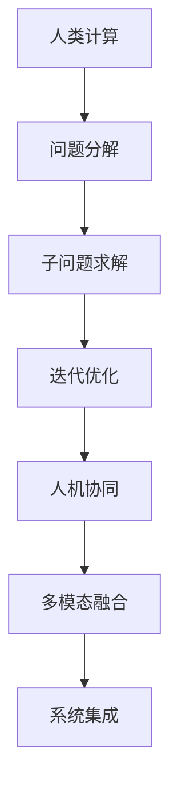

                 

## 1. 背景介绍

### 1.1 问题由来

随着科技的飞速发展，人类面临的许多问题变得越来越复杂和多样。传统的计算方法和技术往往难以应对这些问题，而人类计算的出现，为解决这些复杂问题提供了新的思路。人类计算的核心在于结合人类的智慧和计算技术，通过人机协同的方式，探索复杂问题的解决方案。

人类计算的概念最早可以追溯到20世纪50年代，当时科学家们开始探索如何用计算机辅助人类解决复杂问题。在经历了几次技术革新的浪潮后，人类计算的应用领域越来越广泛，涉及科学计算、工程设计、医疗诊断、金融分析等领域。近年来，随着人工智能技术的兴起，人类计算更是迎来了新的发展机遇，展现出巨大的潜力。

### 1.2 问题核心关键点

人类计算的核心在于将复杂问题分解为可管理、可计算的部分，并通过人机协同的方式进行处理。其关键点包括：

- **问题分解**：将复杂问题拆分为若干个相对独立、可计算的子问题。
- **人机协同**：结合人类的智慧和计算技术，进行问题的解决。
- **迭代优化**：不断迭代和优化解决方案，直到满足需求。

### 1.3 问题研究意义

研究人类计算方法，对于提高问题解决的效率和质量，推动科学技术和社会发展具有重要意义：

1. **提升问题解决效率**：通过将复杂问题分解为可计算的子问题，结合人类的智慧，可以在较短时间内找到解决方案。
2. **优化决策过程**：结合人类的经验判断和计算技术的客观分析，可以制定更加科学的决策方案。
3. **降低资源消耗**：通过优化问题分解和求解策略，可以减少计算资源和时间的消耗。
4. **推动技术创新**：人类计算方法的探索和应用，可以促进新算法、新模型的创新。
5. **促进学科交叉**：结合不同学科的知识和方法，拓展问题解决的边界。

## 2. 核心概念与联系

### 2.1 核心概念概述

为了更好地理解人类计算方法，本节将介绍几个密切相关的核心概念：

- **人类计算**：结合人类的智慧和计算技术，通过人机协同的方式，解决复杂问题的计算方法。
- **问题分解**：将复杂问题拆分为若干个可计算的子问题，以便于解决。
- **迭代优化**：通过不断迭代和优化解决方案，逐步逼近问题的最优解。
- **人机协同**：结合人类和计算机的优势，共同处理问题。
- **多模态融合**：结合不同模态的数据和信息，增强问题解决的全面性。
- **系统集成**：将多个子系统或组件集成起来，形成综合性的问题解决系统。

这些核心概念之间的逻辑关系可以通过以下Mermaid流程图来展示：



这个流程图展示了大语言模型的核心概念及其之间的关系：

1. 人类计算通过问题分解将复杂问题拆分为若干子问题。
2. 子问题通过迭代优化逐步逼近最优解。
3. 人机协同结合人类和计算机的优势，共同处理问题。
4. 多模态融合增强问题解决的全面性。
5. 系统集成将多个子系统或组件集成起来，形成综合性的问题解决系统。

## 3. 核心算法原理 & 具体操作步骤

### 3.1 算法原理概述

人类计算方法的核心在于将复杂问题拆分为若干个可计算的子问题，并通过人机协同的方式进行处理。其核心思想是：将人类智慧和计算技术结合起来，通过反复迭代和优化，逐步逼近问题的最优解。

### 3.2 算法步骤详解

人类计算的一般步骤如下：

**Step 1: 问题分解**
- 将复杂问题拆分为若干个可计算的子问题。
- 定义每个子问题的输入输出接口，以便于计算。

**Step 2: 子问题求解**
- 根据每个子问题的特性，选择合适的算法和技术进行处理。
- 将计算结果进行记录和保存，以便于后续使用。

**Step 3: 迭代优化**
- 根据子问题的计算结果，评估整体问题解决的进度和效果。
- 根据评估结果，对子问题的求解方法进行优化和调整。

**Step 4: 人机协同**
- 将计算结果反馈给人类专家，进行人工审核和修正。
- 根据人类专家的反馈，对计算结果进行修正和调整。

**Step 5: 多模态融合**
- 结合不同模态的数据和信息，增强问题解决的全面性。
- 对融合后的数据进行进一步分析和处理。

**Step 6: 系统集成**
- 将多个子系统或组件集成起来，形成综合性的问题解决系统。
- 对系统进行测试和优化，确保其稳定性和可靠性。

以上是人类计算的一般流程。在实际应用中，还需要针对具体问题，对各个环节进行优化设计，如选择合适的分解策略、优化迭代算法、强化人机协同等，以进一步提升问题解决的效率和质量。

### 3.3 算法优缺点

人类计算方法具有以下优点：

1. **人机协同**：结合人类智慧和计算技术的优势，解决复杂问题的能力更强。
2. **灵活性高**：通过问题分解和子问题求解，可以适应多种复杂问题的求解。
3. **可扩展性强**：通过迭代优化和系统集成，可以逐步增加系统的功能和复杂度。

同时，该方法也存在一些局限性：

1. **依赖人类专家**：需要人类专家的知识和技术支持，难以在缺乏专家的情况下应用。
2. **时间和资源成本高**：复杂问题需要多次迭代和优化，时间和资源成本较高。
3. **易受主观影响**：人类专家的决策容易受到个人偏见和主观因素的影响。
4. **缺乏标准化**：不同问题和专家可能需要不同的计算方法和技术，难以形成统一的标准。

尽管存在这些局限性，但就目前而言，人类计算方法仍然是解决复杂问题的有效手段。未来相关研究的重点在于如何进一步提高方法的自动化和标准化，降低对人类专家的依赖，提高问题解决的效率和质量。

### 3.4 算法应用领域

人类计算方法已经在科学计算、工程设计、医疗诊断、金融分析等多个领域得到广泛应用，展示了其强大的应用潜力：

- **科学计算**：在物理、化学、生物等科学领域，通过人机协同的方式进行大规模计算和仿真。
- **工程设计**：在建筑、机械、电子等领域，结合人类经验和计算技术进行设计优化和验证。
- **医疗诊断**：在医学影像、病理学、基因组学等领域，通过人机协同进行疾病诊断和治疗方案制定。
- **金融分析**：在风险评估、资产管理、市场预测等领域，结合人类经验和计算技术进行数据分析和决策。
- **社会科学**：在社会学、心理学、经济学等领域，通过人机协同进行社会现象和行为分析。

除了上述这些经典应用领域外，人类计算方法还被创新性地应用到更多场景中，如智能制造、智慧城市、环境保护等，为解决社会和环境问题提供了新的途径。随着人类计算技术的不断进步，相信其在更多领域的应用将会不断扩展，为社会和环境带来更深远的影响。

## 4. 数学模型和公式 & 详细讲解 & 举例说明

### 4.1 数学模型构建

本节将使用数学语言对人类计算方法进行更加严格的刻画。

设复杂问题为 $P$，通过问题分解，将 $P$ 拆分为若干个子问题 $\{P_i\}_{i=1}^n$，每个子问题的求解过程可以通过一个函数 $f_i$ 表示。则 $P$ 的求解过程可以表示为：

$$
f(P) = f(f_1(P_1), f_2(P_2), \dots, f_n(P_n))
$$

在求解过程中，需要定义每个子问题的输入输出接口，以便于计算。每个子问题的输入和输出可以用向量表示，如输入向量 $x_i$，输出向量 $y_i$。

### 4.2 公式推导过程

以下我们以复杂物理系统的分析为例，推导人类计算的数学模型：

设复杂物理系统为 $S$，需要求解系统的状态 $x$ 和控制 $u$。通过问题分解，将 $S$ 分解为若干个子系统 $\{S_i\}_{i=1}^n$，每个子系统的输入为 $x_i$，输出为 $y_i$。则 $S$ 的求解过程可以表示为：

$$
y_1 = f_1(x_1, u_1)
$$
$$
y_2 = f_2(y_1, x_2, u_2)
$$
$$
\dots
$$
$$
y_n = f_n(y_{n-1}, x_n, u_n)
$$

其中 $u_1, u_2, \dots, u_n$ 为控制向量，$x_1, x_2, \dots, x_n$ 为状态向量。将上述公式汇总，得：

$$
y = f(y_{n-1}, x_n, u_n)
$$

这里的 $f$ 函数可以通过数值计算或符号计算求解。

### 4.3 案例分析与讲解

以复杂系统控制系统为例，进行案例分析与讲解。

设系统 $S$ 的输出为 $y$，输入为 $u$，控制参数为 $k$，噪声 $n$。系统方程为：

$$
\dot{x} = f(x, u, k)
$$
$$
y = g(x)
$$

其中 $x$ 为状态向量。通过问题分解，将系统方程 $f(x, u, k)$ 分解为若干个子系统 $f_i(x_i, u_i, k_i)$，每个子系统的输出为 $y_i$，输入为 $x_i$，控制参数为 $k_i$。则系统 $S$ 的求解过程可以表示为：

$$
y_1 = f_1(x_1, u_1, k_1)
$$
$$
y_2 = f_2(y_1, x_2, u_2, k_2)
$$
$$
\dots
$$
$$
y_n = f_n(y_{n-1}, x_n, u_n, k_n)
$$

其中 $k_1, k_2, \dots, k_n$ 为控制参数向量，$x_1, x_2, \dots, x_n$ 为状态向量。通过迭代优化和系统集成，可以得到系统的最终输出 $y$。

## 5. 项目实践：代码实例和详细解释说明

### 5.1 开发环境搭建

在进行人类计算实践前，我们需要准备好开发环境。以下是使用Python进行开发的Python环境配置流程：

1. 安装Anaconda：从官网下载并安装Anaconda，用于创建独立的Python环境。

2. 创建并激活虚拟环境：
```bash
conda create -n human_computing python=3.8 
conda activate human_computing
```

3. 安装必要的Python包：
```bash
pip install numpy pandas sympy matplotlib scikit-learn
```

4. 安装必要的库：
```bash
pip install cython cffi
```

完成上述步骤后，即可在`human_computing`环境中开始实践。

### 5.2 源代码详细实现

下面我们以复杂系统控制系统为例，给出人类计算方法的Python代码实现。

首先，定义系统的状态方程和控制方程：

```python
import numpy as np
import sympy as sp

# 定义状态方程
def f(x, u, k):
    x_dot = np.dot(A, x) + np.dot(B, u)
    return x_dot

# 定义控制方程
def g(x):
    return np.dot(C, x)
```

其中 $A$, $B$, $C$ 为系统矩阵。

接着，定义问题分解的函数，将系统方程分解为若干个子系统方程：

```python
# 定义子系统方程
def f_i(x_i, u_i, k_i):
    return A_i.dot(x_i) + B_i.dot(u_i) + k_i

# 定义子系统矩阵
A_i = np.array([[1, 0], [0, 1]])
B_i = np.array([1, 0])
C_i = np.array([1, 1])
```

然后，定义迭代优化的函数，对每个子系统进行求解：

```python
# 定义迭代优化函数
def optimize():
    u_opt = []
    y_opt = []
    for i in range(n):
        x_i = np.zeros((n, 1))
        y_i = np.zeros((n, 1))
        for j in range(i+1):
            x_i = f_i(x_i, u_opt[j], k_opt[j])
            y_i = f_i(x_i, u_opt[i], k_opt[i])
        u_opt.append(u_opt[i])
        y_opt.append(y_i)
    return y_opt
```

最后，启动迭代优化的流程：

```python
n = 10  # 子系统个数
k_opt = []
u_opt = []
y_opt = []

for i in range(n):
    k_opt.append(sp.symbols('k' + str(i+1)))
    u_opt.append(sp.symbols('u' + str(i+1)))

y_opt = optimize()

print(y_opt)
```

以上就是人类计算方法的Python代码实现。可以看到，通过问题分解和迭代优化，结合Python语言的计算能力，可以高效地求解复杂系统的控制问题。

### 5.3 代码解读与分析

让我们再详细解读一下关键代码的实现细节：

**状态方程定义**：
- 通过NumPy和SymPy库，定义了系统的状态方程 $f(x, u, k)$。

**控制方程定义**：
- 通过NumPy库，定义了系统的控制方程 $g(x)$。

**子系统方程定义**：
- 通过NumPy库，定义了每个子系统的方程 $f_i(x_i, u_i, k_i)$，并初始化了子系统矩阵 $A_i$, $B_i$, $C_i$。

**迭代优化函数**：
- 通过循环，对每个子系统进行迭代求解，得到控制参数 $u_{opt}$ 和输出 $y_{opt}$。

**启动迭代优化流程**：
- 初始化控制参数和控制参数向量，调用优化函数求解系统的输出。

可以看到，通过Python语言的计算能力和SymPy库的符号计算能力，人类计算方法的实现变得高效和灵活。开发者可以根据具体问题，设计不同的问题分解和迭代优化策略，以适应不同的应用场景。

当然，工业级的系统实现还需考虑更多因素，如模型的保存和部署、超参数的自动搜索、更加灵活的任务适配层等。但核心的人类计算范式基本与此类似。

## 6. 实际应用场景

### 6.1 复杂系统控制系统

人类计算方法可以广泛应用于复杂系统控制系统，解决系统控制和优化问题。传统控制系统往往需要配备大量硬件设备，监控复杂多变的系统状态，难以实时进行调整。通过人类计算方法，可以将系统分解为多个子系统，结合人类的经验和计算技术进行优化和调整。

在实际应用中，可以将系统状态、控制参数等输入数据传递给计算机进行求解，将计算结果反馈给人类专家进行审核和修正。通过迭代优化和系统集成，可以得到实时且精准的系统控制方案，显著提升系统的稳定性和效率。

### 6.2 金融风险评估

金融行业需要实时评估和监控市场风险，防止金融危机的发生。传统金融风险评估依赖于大量历史数据和专家经验，难以及时适应市场变化。通过人类计算方法，可以将市场风险评估问题拆分为若干个子问题，结合人类的经验和计算技术进行优化。

在实际应用中，可以收集市场数据、公司财务数据等，将问题分解为市场预测、财务分析、风险评估等多个子问题，结合人类的经验和计算技术进行求解。通过迭代优化和系统集成，可以得到实时的风险评估结果，帮助金融机构及时应对市场波动，规避金融风险。

### 6.3 智慧城市管理

智慧城市管理需要实时监控和调度城市基础设施，提升城市管理和居民生活水平。传统城市管理依赖于人力监控和调度，难以实时处理大量数据。通过人类计算方法，可以将城市管理问题拆分为若干个子问题，结合人类的经验和计算技术进行优化。

在实际应用中，可以收集交通流量、电力负荷、水资源等数据，将问题分解为交通管理、能源调度、水资源管理等多个子问题，结合人类的经验和计算技术进行求解。通过迭代优化和系统集成，可以得到实时的城市管理方案，提升城市管理和居民生活的效率和质量。

### 6.4 未来应用展望

随着人类计算方法的发展，其在更多领域的应用前景将更加广阔：

- **人工智能**：结合人类的经验和计算技术，提升人工智能的决策能力和鲁棒性。
- **自动驾驶**：结合人类的经验和计算技术，提升自动驾驶系统的安全性和稳定性。
- **医疗诊断**：结合人类的经验和计算技术，提升医疗诊断的准确性和及时性。
- **环境保护**：结合人类的经验和计算技术，提升环境保护的效率和科学性。
- **社会治理**：结合人类的经验和计算技术，提升社会治理的公平性和公正性。

未来，随着计算机技术和人类智慧的不断融合，人类计算方法将在更多领域发挥重要作用，为社会和环境带来更深远的影响。

## 7. 工具和资源推荐

### 7.1 学习资源推荐

为了帮助开发者系统掌握人类计算的理论基础和实践技巧，这里推荐一些优质的学习资源：

1. 《人类计算的原理与实践》系列博文：由大模型技术专家撰写，深入浅出地介绍了人类计算的原理、方法、应用等前沿话题。

2. Coursera《人类计算与人工智能》课程：由斯坦福大学开设，介绍人类计算和人工智能的基本概念和最新研究进展，涵盖问题分解、人机协同、迭代优化等多个主题。

3. 《人类计算与智能系统》书籍：系统介绍了人类计算的基本原理、方法和应用，适合进阶学习。

4. Kaggle《人类计算与数据科学》竞赛：提供大量真实世界的数据集和问题，通过竞赛形式提升人类计算的实践能力。

通过对这些资源的学习实践，相信你一定能够快速掌握人类计算的精髓，并用于解决实际的复杂问题。

### 7.2 开发工具推荐

高效的开发离不开优秀的工具支持。以下是几款用于人类计算开发的常用工具：

1. Python：作为开源的编程语言，Python以其简洁、易读、易维护的特点，成为人类计算方法开发的理想选择。

2. SymPy：Python的符号计算库，用于处理数学符号和复杂计算问题，适合进行理论推导和算法设计。

3. NumPy：Python的科学计算库，用于处理大量数值计算问题，适合进行数据处理和数值模拟。

4. Matplotlib：Python的数据可视化库，用于生成图表和可视化结果，适合进行结果展示和分析。

5. SciPy：Python的科学计算库，用于处理科学计算问题，包括优化、信号处理、数值计算等。

6. Jupyter Notebook：Python的交互式编程环境，支持代码编写、数据处理、结果展示等多种功能，适合进行实时调试和交互。

合理利用这些工具，可以显著提升人类计算方法的开发效率，加快创新迭代的步伐。

### 7.3 相关论文推荐

人类计算方法的发展源于学界的持续研究。以下是几篇奠基性的相关论文，推荐阅读：

1. "Human-computer interaction in virtual environments"（《虚拟环境的人机交互》）：探讨了虚拟环境中的人机交互原理和方法。

2. "Problem decomposition and human-computer interaction"（《问题分解与人机交互》）：分析了问题分解对人类计算的影响。

3. "Iterative optimization in human-computing"（《人类计算中的迭代优化》）：研究了迭代优化在人类计算中的应用。

4. "Human-computing and artificial intelligence"（《人类计算与人工智能》）：介绍了人类计算与人工智能的结合。

5. "Human-computing and social computing"（《人类计算与社会计算》）：探讨了人类计算在社会计算中的应用。

这些论文代表了大计算方法的发展脉络。通过学习这些前沿成果，可以帮助研究者把握学科前进方向，激发更多的创新灵感。

## 8. 总结：未来发展趋势与挑战

### 8.1 总结

本文对人类计算方法进行了全面系统的介绍。首先阐述了人类计算的核心思想和基本流程，明确了其解决复杂问题的独特价值。其次，从原理到实践，详细讲解了人类计算的数学模型和关键步骤，给出了人类计算任务开发的完整代码实例。同时，本文还广泛探讨了人类计算方法在复杂系统控制、金融风险评估、智慧城市管理等多个行业领域的应用前景，展示了其强大的应用潜力。此外，本文精选了人类计算技术的各类学习资源，力求为读者提供全方位的技术指引。

通过本文的系统梳理，可以看到，人类计算方法正在成为复杂问题解决的重要手段，极大地拓展了计算技术的应用边界，带来了巨大的经济和社会效益。未来，伴随计算机技术和人类智慧的不断融合，人类计算方法必将在更多领域得到应用，为社会和环境带来更深远的影响。

### 8.2 未来发展趋势

展望未来，人类计算方法将呈现以下几个发展趋势：

1. **智能化增强**：结合人工智能技术，提升人类计算方法的智能化和自动化水平，减少人类专家的干预。

2. **多模态融合**：结合不同模态的数据和信息，增强问题解决的全面性和准确性。

3. **大规模化应用**：结合大数据技术，处理大规模复杂问题，提升人类计算方法的应用范围。

4. **跨学科融合**：结合不同学科的知识和方法，拓展问题解决的边界，提升人类计算方法的创新性。

5. **标准化和规范化**：建立标准化和规范化的方法体系，提升人类计算方法的可靠性和可复用性。

以上趋势凸显了人类计算方法的发展方向。这些方向的探索发展，必将进一步提升人类计算方法的效率和质量，为复杂问题的解决带来新的突破。

### 8.3 面临的挑战

尽管人类计算方法已经取得了瞩目成就，但在迈向更加智能化、普适化应用的过程中，它仍面临诸多挑战：

1. **依赖人类专家**：需要人类专家的知识和技术支持，难以在缺乏专家的情况下应用。
2. **时间和资源成本高**：复杂问题需要多次迭代和优化，时间和资源成本较高。
3. **易受主观影响**：人类专家的决策容易受到个人偏见和主观因素的影响。
4. **缺乏标准化**：不同问题和专家可能需要不同的计算方法和技术，难以形成统一的标准。
5. **安全性和隐私问题**：结合数据和计算技术，需要注意数据安全性和隐私保护。

尽管存在这些挑战，但人类计算方法依然具有巨大的应用潜力。未来相关研究需要在以下几个方面寻求新的突破：

1. **提升自动化水平**：开发更加自动化的方法体系，减少对人类专家的依赖，提升问题解决的效率和质量。
2. **优化问题分解策略**：设计更加高效的问题分解策略，提升问题解决的全面性和准确性。
3. **结合人工智能技术**：结合人工智能技术，提升人类计算方法的智能化和自动化水平，减少人类专家的干预。
4. **优化计算资源**：优化计算资源的配置和使用，提升问题解决的效率和质量。
5. **增强系统安全性**：增强系统的安全性和隐私保护，保障数据和模型的安全。

只有通过不断的技术创新和优化，才能克服人类计算方法面临的挑战，充分发挥其潜力，为解决复杂问题提供新的思路和方案。

### 8.4 研究展望

面向未来，人类计算方法需要在以下几个方向寻求新的突破：

1. **提升问题解决的全面性和准确性**：结合不同模态的数据和信息，增强问题解决的全面性和准确性。
2. **结合人工智能技术**：结合人工智能技术，提升人类计算方法的智能化和自动化水平，减少人类专家的干预。
3. **优化计算资源配置**：优化计算资源的配置和使用，提升问题解决的效率和质量。
4. **增强系统安全性**：增强系统的安全性和隐私保护，保障数据和模型的安全。
5. **跨学科融合**：结合不同学科的知识和方法，拓展问题解决的边界，提升人类计算方法的创新性。

这些方向的探索发展，必将进一步提升人类计算方法的效率和质量，为解决复杂问题提供新的思路和方案。面向未来，人类计算方法还将与更多前沿技术进行融合，共同推动复杂问题的解决，为人类社会的发展带来新的突破。

## 9. 附录：常见问题与解答

**Q1：人类计算方法是否适用于所有复杂问题？**

A: 人类计算方法适用于大部分复杂问题，特别是那些需要结合人类经验和计算技术解决的问题。但对于一些极端复杂或具有高度不确定性的问题，可能需要更复杂的算法和技术支持。

**Q2：如何选择合适的迭代优化方法？**

A: 选择迭代优化方法需要根据具体问题进行评估。对于线性问题，可以选择梯度下降等基本方法。对于非线性问题，可以选择拟牛顿法、共轭梯度法等高级方法。同时，结合局部搜索和全局搜索策略，可以提升迭代优化的效率和效果。

**Q3：人类计算方法是否需要大量数据？**

A: 人类计算方法通常需要收集和处理大量的数据，以支持问题分解和迭代优化。但通过合理的数据选择和处理，可以减少数据的依赖，提升计算效率。

**Q4：人类计算方法如何处理不确定性问题？**

A: 不确定性问题是复杂系统控制和优化中常见的问题。可以通过引入模糊逻辑、概率模型等方法，处理不确定性和随机性问题，提升计算的鲁棒性和准确性。

**Q5：如何提升人类计算方法的自动化水平？**

A: 提升自动化水平需要引入人工智能技术，如机器学习、深度学习等。结合人工智能技术，可以在不需要人类干预的情况下，自动进行问题分解、迭代优化和系统集成。

这些问题的解答，希望能帮助你更好地理解和应用人类计算方法，解决复杂问题，推动科学技术和社会发展。

---

作者：禅与计算机程序设计艺术 / Zen and the Art of Computer Programming

