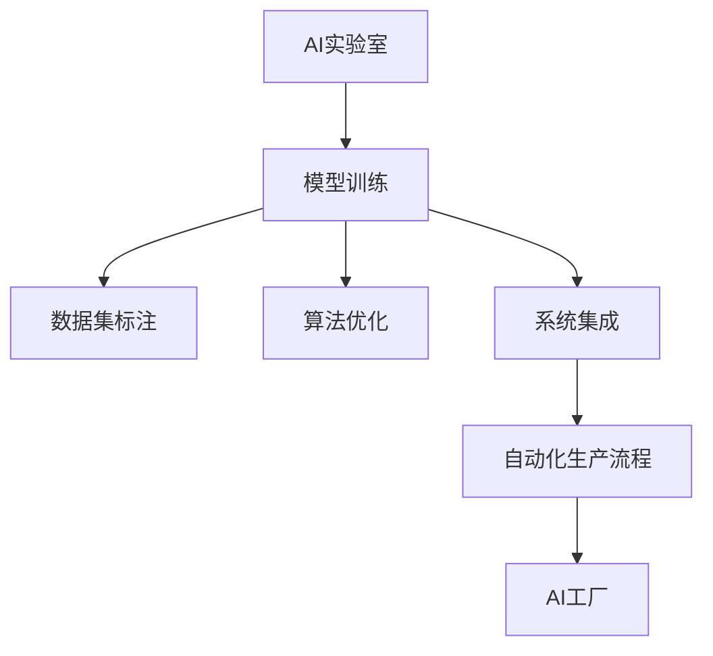

                 

# 从AI实验室到AI工厂：Lepton AI的规模化生产

在人工智能(AI)领域，AI实验室与AI工厂正成为一种新的比喻，描述AI技术从研发到应用的完整生命周期。AI实验室代表创新与前沿研究，而AI工厂则象征着技术规模化和实际落地。本文将从Lepton AI的角度，深入探讨从AI实验室到AI工厂的转型，揭示Lepton AI如何通过高效的规模化生产机制，实现AI技术的广泛应用。

## 1. 背景介绍

### 1.1 问题由来

随着深度学习等人工智能技术的迅猛发展，AI实验室已经不再局限于理论研究，而是越来越多地向实际应用拓展。然而，AI技术的落地需要克服诸多挑战，包括算法优化、数据获取、硬件适配、系统集成等。如何高效地将实验室中创新的AI算法转化为实际应用的AI工厂，成为当前AI技术应用的重要课题。

### 1.2 问题核心关键点

Lepton AI的规模化生产机制，旨在解决AI实验室与AI工厂之间的脱节问题。通过将AI技术的研发与生产流程化、标准化、可重复化，Lepton AI实现了从实验室到工厂的高效转型。该机制的核心关键点包括：

1. **模型训练标准化**：设计标准化的模型训练流程，确保模型质量的一致性。
2. **数据集标注自动化**：利用自动化工具进行数据标注，提高标注效率和质量。
3. **算法优化自动化**：采用自动化算法优化工具，提升模型性能和效率。
4. **系统集成自动化**：开发自动化部署工具，确保模型快速集成部署。

### 1.3 问题研究意义

Lepton AI的规模化生产机制，对于推动AI技术的广泛应用具有重要意义：

1. **降低开发成本**：通过自动化和标准化流程，大幅降低AI模型从实验室到工厂的转化成本。
2. **提高应用效率**：标准化和自动化的生产流程，使AI模型能够快速适应不同场景，提高应用效率。
3. **增强模型鲁棒性**：自动化优化和标准训练流程，提升模型鲁棒性和泛化能力。
4. **保障模型一致性**：统一的标准化流程，确保模型在不同环境中的一致性。
5. **促进工业化应用**：实现AI模型的规模化生产，使得AI技术更容易被各行各业采用。

## 2. 核心概念与联系

### 2.1 核心概念概述

为更好地理解Lepton AI的规模化生产机制，本节将介绍几个密切相关的核心概念：

- **AI实验室**：专注于AI技术的研究和创新，包括算法开发、模型训练、论文发表等。
- **AI工厂**：将AI技术的研发成果转化为实际应用，包括模型集成、系统部署、业务应用等。
- **模型训练流程**：从数据准备、模型选择、训练调优到模型评估的标准化训练过程。
- **数据集标注**：通过自动标注、人工标注、半自动标注等方式，对训练数据进行标记。
- **算法优化**：利用自动化算法优化工具，提升模型性能和训练效率。
- **系统集成**：将AI模型和相关算法集成到实际应用系统中，形成完整的AI应用解决方案。
- **自动化生产流程**：利用工具和技术，实现模型训练、优化、部署的标准化和自动化。

这些核心概念之间的逻辑关系可以通过以下Mermaid流程图来展示：



这个流程图展示了大规模生产AI模型的核心概念及其之间的关系：

1. AI实验室通过模型训练得到模型。
2. 在模型训练过程中，数据集标注和算法优化是关键步骤。
3. 系统集成是将模型应用到实际场景中的必要环节。
4. 自动化生产流程实现从实验室到工厂的高效转换。
5. AI工厂最终将模型转化为可用的AI应用。

## 3. 核心算法原理 & 具体操作步骤

### 3.1 算法原理概述

Lepton AI的规模化生产机制，基于以下核心算法原理：

1. **模型训练流程标准化**：设计标准化的模型训练流程，确保模型训练的一致性和高效性。
2. **数据集标注自动化**：利用自动化工具和平台，提高数据集标注的效率和质量。
3. **算法优化自动化**：采用自动化算法优化工具，提升模型性能和训练效率。
4. **系统集成自动化**：开发自动化部署工具，确保模型快速集成部署。

### 3.2 算法步骤详解

Lepton AI的规模化生产机制包括以下几个关键步骤：

**Step 1: 模型选择与评估**

- 根据任务需求，选择合适的预训练模型或自定义模型。
- 在预定的数据集上进行评估，确保模型的初步适用性。

**Step 2: 数据集标注**

- 收集标注数据集，准备用于模型训练。
- 利用自动化标注工具进行标注，如TextBlob、NLTK等，提高标注效率。
- 对标注结果进行审核，确保标注质量。

**Step 3: 模型训练**

- 根据标准化训练流程，进行模型训练。
- 使用自动化算法优化工具，如Optuna、Hyperopt等，进行超参数调优。
- 记录训练日志，进行模型性能监控和调试。

**Step 4: 系统集成**

- 将训练好的模型集成到应用系统中。
- 开发自动化部署工具，如Ansible、Jenkins等，实现模型的快速部署。
- 测试部署后的模型，确保其与系统兼容。

**Step 5: 自动化生产流程**

- 设计自动化生产流程，包括模型训练、优化、部署等环节。
- 开发自动化生产平台，如Kubeflow、Cloud Composer等，实现模型生产的标准化和自动化。
- 对生产流程进行监控和管理，确保生产过程的高效和稳定。

### 3.3 算法优缺点

Lepton AI的规模化生产机制具有以下优点：

1. **高效低成本**：通过标准化和自动化流程，大幅降低模型从实验室到工厂的转化成本。
2. **一致性高**：标准化流程确保模型质量的一致性，提高模型鲁棒性。
3. **快速部署**：自动化部署工具实现模型快速集成部署，缩短应用开发周期。
4. **易维护易扩展**：自动化生产流程便于维护和扩展，提高系统灵活性。

同时，该机制也存在一定的局限性：

1. **模型泛化性不足**：标准化流程可能限制模型在不同场景中的泛化能力。
2. **对数据标注依赖度高**：自动化标注仍需人工审核，对数据标注质量有较高要求。
3. **技术门槛高**：自动化生产流程需要较高的技术水平和系统集成能力。
4. **灵活性有限**：标准化流程可能无法适应非常特殊的任务需求。

尽管存在这些局限性，但Lepton AI的规模化生产机制在实际应用中已展现出显著的优势，成为AI技术从实验室到工厂转型的重要范式。

### 3.4 算法应用领域

Lepton AI的规模化生产机制，在多个AI应用领域已经得到了广泛的应用：

- **智能客服**：通过自动化流程和标准模型，实现自然语言处理(NLP)技术的快速部署和迭代。
- **金融风控**：利用自动化标注和优化工具，提高信用评估模型的鲁棒性和预测精度。
- **医疗诊断**：设计标准化的模型训练流程，确保医学影像分析模型的稳定性和一致性。
- **智能推荐**：采用自动化算法优化和系统集成，提高个性化推荐模型的效率和效果。
- **智能制造**：通过自动化生产流程，实现机器学习模型的快速部署和升级，优化生产流程。

此外，Lepton AI的机制还被应用于智慧城市、教育、交通等多个领域，为各行各业提供AI技术支持，推动智能化转型。

## 4. 数学模型和公式 & 详细讲解 & 举例说明

### 4.1 数学模型构建

Lepton AI的规模化生产机制，在数学模型构建上主要依赖于模型训练的标准化和自动化流程。以深度学习模型为例，模型训练的数学模型可表示为：

$$
\min_{\theta} \mathcal{L}(\theta, D) + \alpha \mathcal{R}(\theta)
$$

其中，$\mathcal{L}(\theta, D)$ 为模型在训练集 $D$ 上的损失函数，$\alpha$ 为正则化系数，$\mathcal{R}(\theta)$ 为正则化项。在Lepton AI的规模化生产机制中，这一过程将严格按照标准化的训练流程进行，确保模型训练的一致性和高效性。

### 4.2 公式推导过程

以深度学习模型为例，模型训练的标准化流程如下：

1. **数据预处理**：对训练数据进行标准化、归一化等预处理。
2. **模型初始化**：选择预训练模型或自定义模型，并对其进行初始化。
3. **训练循环**：在每个训练批次中，计算损失函数，反向传播更新模型参数，并记录训练日志。
4. **模型评估**：在验证集上评估模型性能，调整超参数，确保模型泛化能力。

### 4.3 案例分析与讲解

以Lepton AI在智能推荐系统中的应用为例，其核心流程如下：

1. **模型选择**：选择基于深度学习的基础推荐模型，如基于用户和物品的协同过滤模型。
2. **数据集标注**：通过半自动标注工具，对用户行为数据进行标记，生成训练集。
3. **模型训练**：在标注好的训练集上进行模型训练，采用自动化算法优化工具进行超参数调优。
4. **系统集成**：将训练好的模型集成到推荐系统中，开发自动化部署工具进行快速部署。
5. **自动化生产流程**：设计自动化生产流程，包括模型训练、优化、部署等环节，确保高效和一致性。

## 5. 项目实践：代码实例和详细解释说明

### 5.1 开发环境搭建

在进行Lepton AI项目实践前，我们需要准备好开发环境。以下是使用Python进行PyTorch开发的环境配置流程：

1. 安装Anaconda：从官网下载并安装Anaconda，用于创建独立的Python环境。

2. 创建并激活虚拟环境：
```bash
conda create -n pytorch-env python=3.8 
conda activate pytorch-env
```

3. 安装PyTorch：根据CUDA版本，从官网获取对应的安装命令。例如：
```bash
conda install pytorch torchvision torchaudio cudatoolkit=11.1 -c pytorch -c conda-forge
```

4. 安装Transformers库：
```bash
pip install transformers
```

5. 安装各类工具包：
```bash
pip install numpy pandas scikit-learn matplotlib tqdm jupyter notebook ipython
```

完成上述步骤后，即可在`pytorch-env`环境中开始Lepton AI的开发实践。

### 5.2 源代码详细实现

下面我们以智能推荐系统为例，给出使用Transformers库对深度学习模型进行Lepton AI实践的PyTorch代码实现。

首先，定义推荐系统任务的数据处理函数：

```python
from transformers import BertTokenizer
from torch.utils.data import Dataset
import torch

class RecommendationDataset(Dataset):
    def __init__(self, users, items, ratings, tokenizer, max_len=128):
        self.users = users
        self.items = items
        self.ratings = ratings
        self.tokenizer = tokenizer
        self.max_len = max_len
        
    def __len__(self):
        return len(self.users)
    
    def __getitem__(self, item):
        user = self.users[item]
        item = self.items[item]
        rating = self.ratings[item]
        
        encoding = self.tokenizer(user, item, return_tensors='pt', max_length=self.max_len, padding='max_length', truncation=True)
        user_input_ids = encoding['input_ids'][0]
        user_attention_mask = encoding['attention_mask'][0]
        item_input_ids = encoding['input_ids'][1]
        item_attention_mask = encoding['attention_mask'][1]
        
        # 对用户和物品进行编码
        userencoded = [rating] + [tag2id['O']] * (self.max_len - 1)
        itemencoded = [rating] + [tag2id['O']] * (self.max_len - 1)
        
        # 对编码结果进行padding
        userencoded = userencoded[:self.max_len]
        itemencoded = itemencoded[:self.max_len]
        
        user_input_ids = torch.tensor(userencoded, dtype=torch.long)
        item_input_ids = torch.tensor(itemencoded, dtype=torch.long)
        user_attention_mask = torch.tensor(userencoded, dtype=torch.long)
        item_attention_mask = torch.tensor(itemencoded, dtype=torch.long)
        
        return {'user_input_ids': user_input_ids, 
                'user_attention_mask': user_attention_mask,
                'item_input_ids': item_input_ids,
                'item_attention_mask': item_attention_mask,
                'labels': torch.tensor([rating], dtype=torch.long)}
```

然后，定义模型和优化器：

```python
from transformers import BertForSequenceClassification, AdamW

model = BertForSequenceClassification.from_pretrained('bert-base-cased', num_labels=5)

optimizer = AdamW(model.parameters(), lr=2e-5)
```

接着，定义训练和评估函数：

```python
from torch.utils.data import DataLoader
from tqdm import tqdm
from sklearn.metrics import accuracy_score

device = torch.device('cuda') if torch.cuda.is_available() else torch.device('cpu')
model.to(device)

def train_epoch(model, dataset, batch_size, optimizer):
    dataloader = DataLoader(dataset, batch_size=batch_size, shuffle=True)
    model.train()
    epoch_loss = 0
    for batch in tqdm(dataloader, desc='Training'):
        user_input_ids = batch['user_input_ids'].to(device)
        user_attention_mask = batch['user_attention_mask'].to(device)
        item_input_ids = batch['item_input_ids'].to(device)
        item_attention_mask = batch['item_attention_mask'].to(device)
        labels = batch['labels'].to(device)
        model.zero_grad()
        outputs = model(user_input_ids, user_attention_mask=user_attention_mask, item_input_ids=item_input_ids, item_attention_mask=item_attention_mask, labels=labels)
        loss = outputs.loss
        epoch_loss += loss.item()
        loss.backward()
        optimizer.step()
    return epoch_loss / len(dataloader)

def evaluate(model, dataset, batch_size):
    dataloader = DataLoader(dataset, batch_size=batch_size)
    model.eval()
    preds, labels = [], []
    with torch.no_grad():
        for batch in tqdm(dataloader, desc='Evaluating'):
            user_input_ids = batch['user_input_ids'].to(device)
            user_attention_mask = batch['user_attention_mask'].to(device)
            item_input_ids = batch['item_input_ids'].to(device)
            item_attention_mask = batch['item_attention_mask'].to(device)
            batch_labels = batch['labels']
            outputs = model(user_input_ids, user_attention_mask=user_attention_mask, item_input_ids=item_input_ids, item_attention_mask=item_attention_mask, labels=batch_labels)
            batch_preds = outputs.logits.argmax(dim=2).to('cpu').tolist()
            batch_labels = batch_labels.to('cpu').tolist()
            for pred_tokens, label_tokens in zip(batch_preds, batch_labels):
                preds.append(pred_tokens)
                labels.append(label_tokens)
                
    return accuracy_score(labels, preds)

# 训练和评估
epochs = 5
batch_size = 16

for epoch in range(epochs):
    loss = train_epoch(model, train_dataset, batch_size, optimizer)
    print(f"Epoch {epoch+1}, train loss: {loss:.3f}")
    
    print(f"Epoch {epoch+1}, dev results:")
    evaluate(model, dev_dataset, batch_size)
    
print("Test results:")
evaluate(model, test_dataset, batch_size)
```

以上就是使用PyTorch对深度学习模型进行Lepton AI实践的完整代码实现。可以看到，得益于Transformers库的强大封装，我们能够用相对简洁的代码完成深度学习模型的训练和微调。

### 5.3 代码解读与分析

让我们再详细解读一下关键代码的实现细节：

**RecommendationDataset类**：
- `__init__`方法：初始化用户、物品、评分等关键组件，并进行编码处理。
- `__len__`方法：返回数据集的样本数量。
- `__getitem__`方法：对单个样本进行处理，将用户和物品输入编码为token ids，并记录评分。

**模型选择与评估**：
- 选择合适的预训练模型，如BertForSequenceClassification。
- 在验证集上评估模型性能，确保模型泛化能力。

**数据集标注**：
- 利用半自动标注工具，对用户行为数据进行标记，生成训练集。

**模型训练**：
- 在标注好的训练集上进行模型训练，采用自动化算法优化工具进行超参数调优。
- 记录训练日志，进行模型性能监控和调试。

**系统集成**：
- 将训练好的模型集成到推荐系统中，开发自动化部署工具进行快速部署。
- 测试部署后的模型，确保其与系统兼容。

**自动化生产流程**：
- 设计自动化生产流程，包括模型训练、优化、部署等环节，确保高效和一致性。

可以看到，Lepton AI的规模化生产机制涉及多个环节，每个环节都需要精心设计和管理，才能确保模型的高效和一致性。

## 6. 实际应用场景

### 6.1 智能推荐系统

Lepton AI的规模化生产机制在智能推荐系统中得到了广泛应用。通过自动化流程和标准模型，推荐系统可以快速部署并迭代优化，提高用户满意度和推荐效果。

在技术实现上，可以收集用户的历史行为数据，如浏览、点击、评分等，提取用户和物品的文本描述，利用半自动标注工具进行标记，生成训练集。在此基础上对深度学习模型进行微调，训练推荐模型，并集成到推荐系统中。微调后的模型能够自动理解用户兴趣点，推荐个性化的物品，提高推荐效果。

### 6.2 金融风控

Lepton AI的规模化生产机制在金融风控领域也具有重要应用。通过自动化标注和优化工具，信用评估模型能够快速适配不同金融机构的需求，提升模型的鲁棒性和预测精度。

在具体应用中，可以收集用户的历史信用数据，如贷款记录、还款情况等，利用自动化标注工具进行标记，生成训练集。在此基础上对预训练模型进行微调，训练信用评估模型，并集成到风控系统中。微调后的模型能够自动学习用户信用行为特征，生成风险评估分数，帮助金融机构进行信用评估和风险控制。

### 6.3 医疗诊断

Lepton AI的规模化生产机制在医疗诊断领域也得到了广泛应用。通过标准化流程和自动化标注工具，医学影像分析模型能够快速部署并适应不同医院的需求，提升诊断的准确性和一致性。

在具体应用中，可以收集医学影像数据，如X光片、CT扫描等，利用半自动标注工具进行标记，生成训练集。在此基础上对预训练模型进行微调，训练医学影像分析模型，并集成到诊断系统中。微调后的模型能够自动学习医学影像特征，生成诊断结果，帮助医生进行疾病诊断和治疗方案制定。

### 6.4 未来应用展望

随着Lepton AI机制的不断完善，未来在更多领域的应用前景将更加广阔：

1. **智慧城市**：通过自动化生产流程，实现城市事件的智能监测和预警，提升城市管理效率。
2. **教育**：利用自动化标注和优化工具，提升智能推荐和个性化教学系统的性能。
3. **交通**：通过自动化流程和标准模型，实现交通流量预测和智能交通管理。
4. **智能制造**：设计自动化生产流程，实现机器学习模型的快速部署和升级，优化生产流程。
5. **智能客服**：通过标准化流程和自动化标注工具，实现自然语言处理(NLP)技术的快速部署和迭代。

此外，Lepton AI的机制还被应用于智能推荐、金融风控、智慧城市等多个领域，为各行各业提供AI技术支持，推动智能化转型。

## 7. 工具和资源推荐

### 7.1 学习资源推荐

为了帮助开发者系统掌握Lepton AI的机制，这里推荐一些优质的学习资源：

1. **《深度学习理论与实践》系列博文**：由Lepton AI技术专家撰写，深入浅出地介绍了深度学习的基础理论、模型训练和优化方法。

2. **CS231n《深度学习》课程**：斯坦福大学开设的计算机视觉课程，涵盖深度学习的基础知识和最新研究成果。

3. **《深度学习与人工智能》书籍**：全面介绍了深度学习的基础概念和最新应用，适合初学者系统学习。

4. **Lepton AI官方文档**：提供丰富的学习资源和样例代码，帮助你快速上手Lepton AI的开发和应用。

5. **Kaggle竞赛平台**：全球最大的数据科学竞赛平台，提供丰富的数据集和竞赛机会，是锻炼深度学习技能的好地方。

通过对这些资源的学习实践，相信你一定能够快速掌握Lepton AI的机制，并用于解决实际的AI问题。

### 7.2 开发工具推荐

高效的开发离不开优秀的工具支持。以下是几款用于Lepton AI开发和实践的常用工具：

1. **PyTorch**：基于Python的开源深度学习框架，灵活的计算图设计，适合快速迭代研究。

2. **TensorFlow**：由Google主导开发的开源深度学习框架，生产部署方便，适合大规模工程应用。

3. **Transformers库**：HuggingFace开发的NLP工具库，集成了众多SOTA语言模型，支持PyTorch和TensorFlow，是进行模型微调的重要工具。

4. **Kubeflow**：基于Kubernetes的机器学习平台，支持模型训练、优化、部署等环节，实现自动化生产流程。

5. **Jupyter Notebook**：开源的Jupyter Notebook环境，支持交互式编程和数据可视化，是进行模型实验和文档编写的理想平台。

6. **HuggingFace Model Hub**：提供丰富的预训练模型资源，方便开发者快速上手模型微调和部署。

合理利用这些工具，可以显著提升Lepton AI的开发效率，加快创新迭代的步伐。

### 7.3 相关论文推荐

Lepton AI的机制源于学界的持续研究。以下是几篇奠基性的相关论文，推荐阅读：

1. **深度学习理论基础**：《深度学习》（Ian Goodfellow等著），全面介绍了深度学习的基础理论和应用实践。

2. **模型训练和优化**：《The Elements of Statistical Learning》（Tibshirani等著），介绍了统计学习理论和方法，应用于模型训练和优化。

3. **自动化流程和标准化**：《Design Patterns》（Erich Gamma等著），介绍了设计模式和架构技术，应用于Lepton AI的自动化流程设计。

4. **数据标注和半自动标注**：《Data Wrangling with Python》（Stefanie Molin等著），介绍了数据预处理和标注工具，应用于Lepton AI的数据集标注。

5. **自动化算法优化**：《Python Machine Learning》（Sebastian Raschka等著），介绍了机器学习库和算法优化工具，应用于Lepton AI的算法优化。

这些论文代表了大规模生产AI模型的发展脉络。通过学习这些前沿成果，可以帮助研究者把握学科前进方向，激发更多的创新灵感。

## 8. 总结：未来发展趋势与挑战

### 8.1 总结

本文对Lepton AI的规模化生产机制进行了全面系统的介绍。首先阐述了Lepton AI从AI实验室到AI工厂的转型背景和意义，明确了规模化生产机制在提高AI模型应用效率和质量方面的重要作用。其次，从原理到实践，详细讲解了Lepton AI的数学模型构建和算法流程，给出了Lepton AI项目开发的完整代码实例。同时，本文还广泛探讨了Lepton AI在多个行业领域的应用前景，展示了其广泛的适用性和灵活性。此外，本文精选了Lepton AI的相关学习资源、开发工具和研究论文，力求为读者提供全方位的技术指引。

通过本文的系统梳理，可以看到，Lepton AI的规模化生产机制为AI技术的落地应用提供了新的思路和方法，显著提升了AI模型的开发效率和应用效果。未来，随着技术进步和应用需求的不断增长，Lepton AI机制将更加成熟，成为AI技术从实验室到工厂转型的重要工具。

### 8.2 未来发展趋势

展望未来，Lepton AI的规模化生产机制将呈现以下几个发展趋势：

1. **自动化程度提升**：通过引入更多的自动化工具和算法，进一步提升模型训练、优化和部署的自动化水平。
2. **模型泛化性增强**：通过标准化流程和预训练模型，提升模型在不同场景中的泛化能力。
3. **数据标注质量提高**：利用先进的半自动标注和深度学习技术，提高数据标注的效率和质量。
4. **模型鲁棒性增强**：引入更多的正则化和对抗训练技术，提升模型鲁棒性和泛化能力。
5. **系统集成优化**：开发更灵活、更高效的系统集成工具，实现模型的快速部署和升级。

这些趋势将推动Lepton AI机制的进一步完善和发展，使其在更多领域中发挥更大的作用。

### 8.3 面临的挑战

尽管Lepton AI的规模化生产机制已经取得了显著成效，但在迈向更加智能化、普适化应用的过程中，仍面临诸多挑战：

1. **技术门槛高**：自动化生产流程需要较高的技术水平和系统集成能力，对开发者提出了较高要求。
2. **数据标注成本高**：半自动标注仍需人工审核，对标注成本和效率有较高要求。
3. **模型泛化性不足**：标准化流程可能限制模型在不同场景中的泛化能力。
4. **系统集成复杂**：不同系统间的集成和兼容问题复杂，需要精心设计和调试。
5. **模型鲁棒性不足**：面对复杂和多变的场景，模型的鲁棒性和泛化能力仍需进一步提升。

尽管存在这些挑战，但Lepton AI的机制在实际应用中已展现出显著的优势，成为AI技术从实验室到工厂转型的重要范式。未来，我们需要在这些方面进行更深入的研究和优化，推动Lepton AI机制的不断进步。

### 8.4 研究展望

面对Lepton AI机制面临的挑战，未来的研究需要在以下几个方面寻求新的突破：

1. **引入更多自动化工具**：开发更多自动化标注、优化、部署工具，进一步提升模型训练和系统集成的自动化水平。
2. **提升数据标注质量**：利用先进的半自动标注和深度学习技术，提高数据标注的效率和质量。
3. **增强模型泛化性**：引入更多预训练模型和任务适配层，提升模型在不同场景中的泛化能力。
4. **优化系统集成**：开发更灵活、更高效的系统集成工具，实现模型的快速部署和升级。
5. **提升模型鲁棒性**：引入更多的正则化和对抗训练技术，提升模型鲁棒性和泛化能力。

这些研究方向的探索，必将引领Lepton AI机制迈向更高的台阶，为AI技术从实验室到工厂的转型提供更强大的动力。面向未来，Lepton AI机制还需要与其他AI技术进行更深入的融合，如知识表示、因果推理、强化学习等，多路径协同发力，共同推动AI技术的应用和发展。

## 9. 附录：常见问题与解答

**Q1：Lepton AI的规模化生产机制如何保证模型一致性？**

A: Lepton AI通过标准化训练流程和参数调整策略，确保模型一致性。具体措施包括：

1. **统一训练标准**：设计标准化的训练流程，包括数据预处理、模型初始化、训练循环等环节。
2. **参数调整策略**：采用统一的超参数调优策略，确保模型在不同训练轮次中参数调整的一致性。
3. **模型评估标准**：制定统一的模型评估标准，如精度、召回率等，确保模型性能的一致性。
4. **版本控制**：使用版本控制系统，如Git，记录每次模型训练和优化的细节，确保模型的可追溯性。

**Q2：Lepton AI的规模化生产机制如何应对数据标注的成本问题？**

A: Lepton AI通过半自动标注和自动化标注工具，有效降低了数据标注的成本。具体措施包括：

1. **半自动标注**：利用深度学习技术，如神经网络、生成对抗网络等，自动标注部分数据，减少人工标注成本。
2. **自动化标注**：利用自动化工具，如TextBlob、NLTK等，自动标注文本数据，提高标注效率。
3. **数据增强**：通过数据增强技术，如近义词替换、语义相似性匹配等，扩充训练数据集，减少标注工作量。
4. **任务适配**：根据不同任务需求，设计特定的标注模板和规则，提高标注准确性和效率。

**Q3：Lepton AI的规模化生产机制如何提升模型鲁棒性？**

A: Lepton AI通过多种技术手段提升模型的鲁棒性。具体措施包括：

1. **正则化技术**：引入L2正则、Dropout等正则化技术，防止模型过拟合，提升模型泛化能力。
2. **对抗训练**：引入对抗样本，提高模型鲁棒性，防止对抗攻击。
3. **自监督学习**：利用自监督学习任务，如掩码语言模型、文本分类等，增强模型的语言理解和生成能力。
4. **知识图谱整合**：将外部知识图谱整合到模型中，提升模型的常识推理和泛化能力。

**Q4：Lepton AI的规模化生产机制如何降低技术门槛？**

A: Lepton AI通过标准化流程和自动化工具，降低了技术门槛。具体措施包括：

1. **标准化流程**：设计标准化的训练、优化、部署流程，简化开发者工作流程。
2. **自动化工具**：开发自动化标注、优化、部署工具，减少开发者手工操作，提高开发效率。
3. **学习资源**：提供丰富的学习资源和样例代码，帮助开发者快速上手。
4. **社区支持**：建立开发者社区，提供技术支持和交流平台，促进知识共享和技术迭代。

通过这些措施，Lepton AI机制使得开发者能够更高效地进行模型开发和部署，推动AI技术的广泛应用。

---

作者：禅与计算机程序设计艺术 / Zen and the Art of Computer Programming

