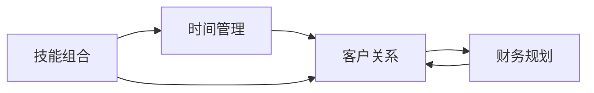

                 

# 从员工到自由职业者的转变

在技术日新月异的今天，越来越多的人开始考虑从传统的职场员工转变为自由职业者。这一转变不仅意味着职业路径的重大变化，还涉及技能提升、时间管理、客户关系等多方面的调整。本文将深入探讨这一转变的核心概念、关键步骤以及潜在挑战，为有意转型的人士提供详细的指导。

## 1. 背景介绍

### 1.1 行业趋势与机遇
近年来，随着远程工作模式的兴起和数字化转型的加速，自由职业市场在全球范围内迅速扩展。根据Freelancers Union的数据，美国自由职业者数量已经超过5600万，占所有劳动力的35%。这一趋势反映了人们对灵活工作模式和高自由度的强烈需求。

### 1.2 个人驱动因素
选择成为自由职业者的驱动因素多种多样，主要包括：

- **追求工作与生活平衡**：摆脱传统9-5的固定工作时间，灵活安排工作与个人时间。
- **职业发展与技能提升**：拓展多样化的项目经验，不断学习新技能，提升专业能力。
- **财务自由与自主性**：拥有更多的收入来源和自主决策权，追求更高的财务自由度。
- **社会与文化影响**：受到身边朋友、同事转型的影响，认同自由职业的生活方式和价值观。

### 1.3 转型案例分享
成功的转型案例可以提供宝贵的经验和教训。例如，曾在大型科技公司工作的John，因不满固定工作环境的局限性，决定转型为自由职业者。通过专注于特定技术领域，John成功吸引了多家大公司的项目合作，建立了稳定的客户关系，实现了职业与生活平衡的结合。

## 2. 核心概念与联系

### 2.1 核心概念概述

为了更好地理解从员工到自由职业者的转变过程，本文将介绍几个核心概念：

- **技能组合**：自由职业者的核心竞争力在于具备多样化的技能组合，如编程、设计、营销等，以应对不同类型的工作需求。
- **时间管理**：自由职业者需要高效管理时间，平衡不同项目之间的进展，确保按时交付。
- **客户关系**：建立和维护客户关系是自由职业成功的关键，良好的客户关系能够带来更多的业务机会。
- **财务规划**：合理规划收入和支出，建立稳定的现金流，是实现财务自由的基础。

这些概念之间的逻辑关系可以通过以下Mermaid流程图来展示：



### 2.2 核心概念原理和架构

自由职业者的成功转型依赖于多个关键能力的综合应用。以下是这些核心概念的详细解析：

- **技能组合**：
  - **技能多样化**：自由职业者需要掌握多种技能，如编程、设计、写作等，以增强自身的市场竞争力。
  - **技能深度**：在某一领域深耕，达到专业水准，成为该领域的专家。
  - **技能更新**：持续学习新技能，适应技术发展，保持竞争力。

- **时间管理**：
  - **优先级排序**：根据项目紧急程度和重要性，合理安排工作任务。
  - **任务分解**：将大型项目分解为小的可管理任务，逐步完成。
  - **时间记录**：使用工具记录时间，评估时间利用效率，进行优化。

- **客户关系**：
  - **建立信任**：通过高质量的工作成果和良好的沟通，建立客户信任。
  - **客户反馈**：积极收集客户反馈，不断改进服务质量。
  - **客户网络**：通过现有客户介绍新客户，扩大客户群体。

- **财务规划**：
  - **收入多样化**：从多个客户和项目中获得收入，降低单一来源的风险。
  - **成本控制**：合理控制固定成本和变动成本，提高利润率。
  - **税务规划**：熟悉税法，进行税务规划，降低税务负担。

## 3. 核心算法原理 & 具体操作步骤

### 3.1 算法原理概述

自由职业者的转型过程可以看作一个多目标优化问题，目标包括技能提升、客户获取、财务稳健等。优化过程涉及技能训练、时间管理、客户关系维护、财务规划等多个方面。算法核心在于通过迭代调整各个环节的策略，逐步接近最优状态。

### 3.2 算法步骤详解

#### 3.2.1 技能提升
1. **技能评估**：识别自身技能短板，明确需要提升的技能领域。
2. **技能学习**：选择合适的学习资源，如在线课程、书籍、项目实战等，进行系统学习。
3. **技能应用**：通过实际项目实践，将学到的技能应用到具体工作中，积累经验。

#### 3.2.2 时间管理
1. **工作计划**：制定每日、每周、每月的工作计划，明确目标和任务。
2. **任务分配**：根据项目优先级，合理分配时间，确保重要项目优先完成。
3. **时间记录**：使用时间记录工具，如Toggl、RescueTime等，监控时间利用效率。

#### 3.2.3 客户关系
1. **市场拓展**：通过LinkedIn、Behance等平台，主动拓展客户资源。
2. **客户沟通**：通过邮件、电话、视频会议等形式，与客户建立良好的沟通关系。
3. **客户反馈**：定期收集客户反馈，了解客户需求，改进服务质量。

#### 3.2.4 财务规划
1. **收入预测**：根据历史数据和市场趋势，预测未来收入。
2. **成本控制**：合理规划固定成本和变动成本，降低开支。
3. **税务规划**：了解税法，合理避税，降低税务负担。

### 3.3 算法优缺点

#### 3.3.1 优点
- **灵活性**：自由职业者可以根据自己的兴趣和市场需求，选择多样化的工作项目。
- **自主性**：工作时间和地点自由，不受公司约束，增强职业满足感。
- **收入多样性**：通过多个项目获得收入，降低风险。

#### 3.3.2 缺点
- **不稳定收入**：项目不确定性可能导致收入波动，影响财务稳定性。
- **客户获取难度**：新客户拓展需要时间和精力，初期可能面临客户资源不足的问题。
- **自我管理要求高**：需要具备良好的时间管理、财务管理能力，否则容易陷入混乱。

### 3.4 算法应用领域

自由职业者的转型过程不仅适用于技术领域，还广泛适用于设计、市场营销、内容创作等多个行业。例如，设计师可以通过自由职业平台接单，为不同品牌提供设计服务；营销人员可以成为自由顾问，为企业提供市场策略咨询。

## 4. 数学模型和公式 & 详细讲解 & 举例说明

### 4.1 数学模型构建

假设自由职业者的总时间为$T$，客户项目数为$N$，每个项目需要的工时为$t_i$，项目的优先级系数为$p_i$，项目获得的收入为$R_i$，成本为$C_i$。则自由职业者的优化目标为：

$$
\max \sum_{i=1}^N p_iR_i - (C_i + C_{fixed})
$$

其中$C_{fixed}$为固定成本，包括租金、设备等。

### 4.2 公式推导过程

为了求解上述优化问题，我们需要考虑以下关键公式：

- **优先级系数$p_i$**：根据项目重要性和紧急程度，设定优先级系数。
- **时间分配**：根据优先级系数和时间总和，计算每个项目分配的时间$t_i$。
- **收入计算**：根据项目工时和收入率计算项目收入$R_i$。
- **成本控制**：根据项目工时和成本率计算项目成本$C_i$。

### 4.3 案例分析与讲解

假设某自由职业者有4个项目A、B、C、D，每个项目需要的工时分别为2小时、4小时、3小时、6小时，优先级系数分别为0.8、0.7、0.6、0.5。设固定成本为$C_{fixed}=100$，每个小时的工作收入率为$R=50$，每个小时的成本率为$C=30$。则优化过程如下：

1. **优先级系数计算**：
   - $p_A = 0.8, p_B = 0.7, p_C = 0.6, p_D = 0.5$
2. **时间分配计算**：
   - 总工时$T = 2 + 4 + 3 + 6 = 15$小时
   - 时间分配：$T_A = \frac{0.8 \times 15}{2.3} \approx 7.35$小时，$T_B = \frac{0.7 \times 15}{2.3} \approx 6.52$小时，$T_C = \frac{0.6 \times 15}{2.3} \approx 5.67$小时，$T_D = \frac{0.5 \times 15}{2.3} \approx 4.35$小时
3. **收入和成本计算**：
   - 项目A收入：$R_A = 7.35 \times 50 = 367.5$
   - 项目A成本：$C_A = 7.35 \times 30 = 220.5$
   - 项目B收入：$R_B = 6.52 \times 50 = 326$
   - 项目B成本：$C_B = 6.52 \times 30 = 195.6$
   - 项目C收入：$R_C = 5.67 \times 50 = 283.5$
   - 项目C成本：$C_C = 5.67 \times 30 = 170.1$
   - 项目D收入：$R_D = 4.35 \times 50 = 217.5$
   - 项目D成本：$C_D = 4.35 \times 30 = 130.5$
4. **总收入和总成本计算**：
   - 总收入：$\sum_{i=1}^N p_iR_i = 0.8 \times 367.5 + 0.7 \times 326 + 0.6 \times 283.5 + 0.5 \times 217.5 = 2182.5$
   - 总成本：$\sum_{i=1}^N (C_i + C_{fixed}) = (220.5 + 195.6 + 170.1 + 130.5 + 100) = 716.7$
5. **优化结果**：
   - 最终优化结果：$\max \{2182.5 - 716.7\} = 1465.8$

通过上述计算，我们可以看到，在时间资源有限的情况下，通过合理分配时间和优先级，自由职业者可以获得最大的收入，同时有效控制成本，实现财务稳健。

## 5. 项目实践：代码实例和详细解释说明

### 5.1 开发环境搭建

为了进行自由职业者转型实践，我们需要搭建一个开发环境，包括以下工具和资源：

1. **开发环境**：选择一个支持Python和相关库的开发环境，如Anaconda或Virtualenv。
2. **编程语言**：Python是自由职业者转型实践的首选语言，具有丰富的第三方库和社区支持。
3. **开发工具**：Jupyter Notebook、PyCharm等IDE支持Python开发，提供便捷的代码编写和调试功能。

### 5.2 源代码详细实现

以下是使用Python实现自由职业者时间管理和财务规划的示例代码：

```python
import numpy as np

# 定义参数
T = 15  # 总时间
R = 50  # 每小时收入
C = 30  # 每小时成本
C_fixed = 100  # 固定成本
p = np.array([0.8, 0.7, 0.6, 0.5])  # 项目优先级系数
t = np.array([2, 4, 3, 6])  # 项目工时

# 计算时间分配
t_allocation = p * T / np.sum(p) * t

# 计算收入和成本
R_allocation = t_allocation * R
C_allocation = t_allocation * C

# 计算总收入和总成本
R_total = np.sum(p * R_allocation)
C_total = np.sum(p * (C_allocation + C_fixed))

# 输出优化结果
optimal_income = R_total - C_total
print(f"优化后的总收入：{optimal_income}")
```

### 5.3 代码解读与分析

- **时间分配**：根据优先级系数和时间总和，计算每个项目分配的时间。
- **收入和成本计算**：根据时间分配和每小时收入、成本，计算每个项目的收入和成本。
- **总收入和总成本计算**：根据优先级系数和项目收入、成本，计算总收入和总成本。
- **优化结果输出**：输出优化后的总收入和总成本，即为最终的优化结果。

## 6. 实际应用场景

### 6.1 智能家居管理

自由职业者转型在智能家居管理领域具有广阔的应用前景。例如，一名软件工程师可以将自由职业与智能家居系统开发结合起来，开发智能家庭自动化、安防监控等系统，为企业提供定制化解决方案。

### 6.2 内容创作与营销

内容创作者可以通过自由职业平台接单，为企业提供文章、视频、设计等创意内容，同时利用社交媒体进行营销推广，提升品牌影响力。

### 6.3 咨询服务

自由职业者可以提供市场分析、战略咨询、IT咨询等服务，帮助企业制定科学的发展战略，提升竞争力。

### 6.4 未来应用展望

未来，自由职业者的转型将更加多样化和专业化。例如，通过AI和数据分析技术，自由职业者可以在更广泛的领域提供服务，如健康管理、金融规划、心理辅导等。

## 7. 工具和资源推荐

### 7.1 学习资源推荐

为了帮助自由职业者系统掌握转型所需的技能和知识，以下是一些推荐的资源：

1. **Coursera和Udemy**：提供丰富的在线课程，涵盖编程、项目管理、财务规划等多个领域。
2. **Codecademy和Khan Academy**：通过互动式学习，快速掌握编程技能和数学知识。
3. **LinkedIn Learning**：提供企业级技能培训，提升专业能力。
4. **GitHub和Stack Overflow**：丰富的开源项目和社区支持，深入学习新技术和最佳实践。

### 7.2 开发工具推荐

以下是一些常用的开发工具，可以帮助自由职业者提升工作效率和项目质量：

1. **Jupyter Notebook**：支持Python等语言，提供交互式编程和代码展示功能。
2. **PyCharm**：功能强大的Python IDE，提供代码高亮、调试、版本控制等功能。
3. **Toggl**：时间记录工具，帮助自由职业者监控时间利用效率。
4. **RescueTime**：自动记录工作时间，提供详细的活动分析，优化时间管理。
5. **Asana和Trello**：项目管理工具，帮助自由职业者安排任务和跟踪进度。

### 7.3 相关论文推荐

为了深入理解自由职业者转型的理论基础和实际应用，以下是一些推荐的论文：

1. "The Gig Economy: Platforms, Pay and Productivity"（《零工经济：平台、薪酬与生产力》）：探讨零工经济对劳动力市场的影响和挑战。
2. "Entrepreneurship and the Gig Economy"（《创业与零工经济》）：分析自由职业者的创业模式和机会。
3. "Freelancing in a Digital World: Opportunities and Challenges"（《数字化世界的自由职业：机遇与挑战》）：探讨数字化时代自由职业者的发展趋势和应用场景。

## 8. 总结：未来发展趋势与挑战

### 8.1 研究成果总结

自由职业者的转型过程涉及技能提升、时间管理、客户关系维护、财务规划等多个方面。通过系统学习和管理，自由职业者可以在多个领域实现职业发展，提升工作效率和收入水平。

### 8.2 未来发展趋势

未来，自由职业者将面临更加多样化和复杂化的工作环境。以下趋势值得关注：

1. **技能要求提升**：随着技术的发展，自由职业者需要不断学习新技能，保持竞争力。
2. **远程协作加强**：数字化转型的加速，使得远程协作成为常态，自由职业者需要具备更好的沟通和协作能力。
3. **自动化与智能化**：AI和自动化工具的应用，将提高自由职业者的工作效率，降低人力成本。
4. **市场细分化**：自由职业者将更多地关注细分市场，提供更加个性化的服务。

### 8.3 面临的挑战

自由职业者在转型过程中也会面临诸多挑战：

1. **技能提升难度大**：技能学习需要时间和精力，且需不断更新，以适应技术发展。
2. **市场竞争激烈**：自由职业者面临来自全球的竞争，需要不断提高自身水平。
3. **财务不稳定**：项目的不确定性可能导致收入波动，影响财务稳定性。
4. **客户关系管理**：需要不断维护和拓展客户关系，获取更多业务机会。

### 8.4 研究展望

未来，自由职业者的转型将更加注重技术融合和市场细分。通过AI和大数据技术，自由职业者可以实现更加精准的服务提供和客户匹配，提升市场竞争力。同时，持续学习和自我提升将是自由职业者不断前进的动力，带来更加广阔的职业前景。

## 9. 附录：常见问题与解答

### Q1：自由职业者转型需要哪些关键技能？

A: 自由职业者转型需要掌握的关键技能包括：
1. **编程技能**：熟练掌握至少一种编程语言，如Python、Java等。
2. **项目管理能力**：能够规划和管理多个项目，确保按时交付。
3. **时间管理技巧**：有效分配时间，提高工作效率。
4. **财务管理能力**：掌握基本的财务管理知识，进行收入和成本控制。
5. **沟通与协作**：具备良好的沟通和协作能力，建立稳定的客户关系。

### Q2：如何选择合适的自由职业平台？

A: 选择合适的自由职业平台需要考虑以下几个方面：
1. **平台声誉**：选择知名、评价较高的平台，确保交易安全和资金安全。
2. **平台佣金**：了解平台佣金比例，选择佣金合理的平台。
3. **平台覆盖范围**：查看平台支持的行业和项目类型，确保与自身技能匹配。
4. **平台用户体验**：体验平台的用户界面和功能，选择操作便捷的平台。

### Q3：自由职业者如何建立和维护客户关系？

A: 建立和维护客户关系需要以下步骤：
1. **提供高质量服务**：通过高质量的工作成果，赢得客户信任。
2. **定期沟通**：通过邮件、电话、视频会议等形式，与客户保持联系。
3. **收集反馈**：定期收集客户反馈，了解客户需求，改进服务质量。
4. **客户推荐**：通过现有客户介绍新客户，扩大客户群体。

### Q4：自由职业者的收入来源有哪些？

A: 自由职业者的收入来源包括：
1. **项目收入**：通过接单和完成项目获得收入。
2. **内容创作**：通过内容创作（如写作、设计、摄影等）获得收入。
3. **咨询服务**：通过提供咨询服务（如市场分析、战略咨询等）获得收入。
4. **产品销售**：通过开发和销售自己的产品获得收入。

### Q5：自由职业者如何应对收入波动？

A: 应对收入波动的方法包括：
1. **多样化收入来源**：通过多个项目和客户获得收入，降低单一来源的风险。
2. **建立紧急基金**：预留一部分收入作为紧急基金，应对突发情况。
3. **灵活定价策略**：根据项目复杂度和自身能力，合理定价，确保利润率。

---

作者：禅与计算机程序设计艺术 / Zen and the Art of Computer Programming

