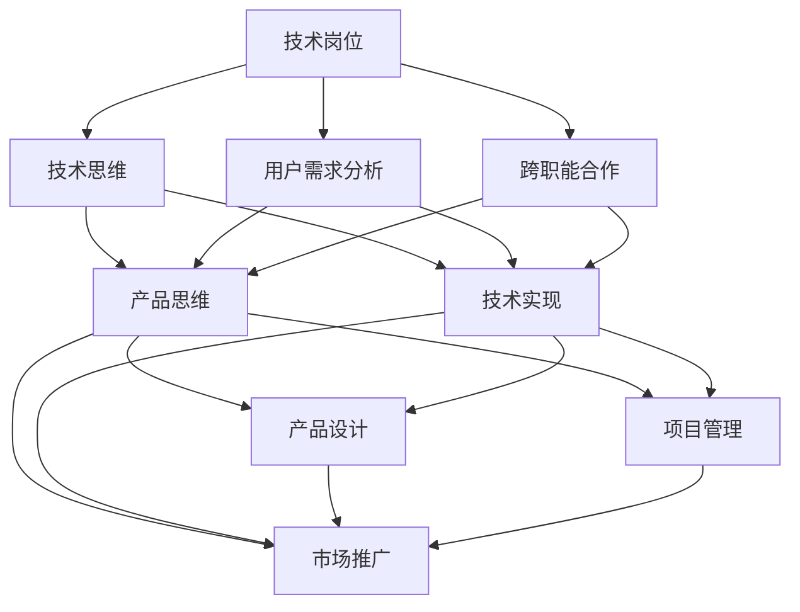

                 

# 从技术岗位到产品经理的转型

> 关键词：技术管理、产品思维、跨职能合作、用户需求分析、产品生命周期管理、项目管理、团队建设、技术创新、商业模式

## 1. 背景介绍

### 1.1 问题由来

在信息技术快速发展的时代背景下，技术人才的稀缺性和重要性愈发凸显。然而，随着企业的业务日益复杂，对技术岗位人员的要求也变得更为多元化。从单纯的技术专家，到具备产品视角、商业思维、用户共情的产品经理，技术岗位人员的转型已成为企业和个人发展的必然趋势。

### 1.2 问题核心关键点

技术岗位向产品经理的转型，不仅仅是职责范围和职业角色的变化，更是工作方式、思维方式、沟通能力等方面的全面提升。以下三点是转型过程中最核心的关键点：

- **技术深入理解**：对核心技术的深入理解和掌握是技术岗位人员转型的基础。只有全面理解技术的优势、局限性以及未来发展趋势，才能在产品设计中做出明智的决策。
- **用户需求洞察**：产品经理需要具备敏锐的用户需求洞察能力，能够从用户角度出发，理解用户需求和痛点，并将这些需求转化为具体的技术方案和产品功能。
- **跨职能合作**：技术岗位人员转型为产品经理后，需要与市场、设计、运营等各个职能部门密切合作，协调沟通，共同推动产品开发和市场推广。

### 1.3 问题研究意义

实现技术岗位到产品经理的转型，对于提升企业产品竞争力、加速技术商业化具有重要意义：

1. **提升产品创新能力**：具有技术背景的产品经理，能够更好地理解技术实现细节，从而在产品创新过程中提出更具创意和可行的解决方案。
2. **加速产品上市速度**：技术转型的产品经理通常对流程和工具有更深的理解和掌控，能够更高效地推动产品开发和迭代。
3. **优化产品性能与体验**：技术专家对细节的关注和把控，有助于确保产品性能与用户体验的卓越表现。
4. **增强团队协作效率**：技术背景的产品经理能够更好地与技术团队沟通协作，提升整体团队的生产力和创新力。
5. **推动技术商业化**：具备商业思维和技术背景的产品经理，能更好地把握市场趋势，推动技术产品从实验室走向市场，实现技术价值最大化。

## 2. 核心概念与联系

### 2.1 核心概念概述

为更好地理解从技术岗位到产品经理的转型过程，本节将介绍几个核心概念，并阐述它们之间的联系：

- **技术岗位**：指以技术为核心职责，负责开发、维护、优化软件系统或应用的平台或团队。
- **产品经理**：负责产品的全生命周期管理，包括需求分析、产品设计、项目管理、团队协作、市场推广等，确保产品能够满足用户需求并实现商业目标。
- **技术思维与产品思维**：技术思维侧重于技术实现、性能优化、算法优化等；产品思维则侧重于用户需求、市场定位、用户体验、商业价值等。
- **跨职能合作**：产品经理需与市场、设计、运营、财务等各职能部门紧密合作，协同推进产品开发和市场推广。
- **用户需求分析**：通过调研、访谈、数据分析等手段，深入了解用户需求和痛点，并将其转化为具体的产品功能和设计。
- **产品生命周期管理**：从产品构思、设计、开发、测试、上线到迭代优化的全流程管理，确保产品持续增长和市场竞争力。

这些核心概念构成了从技术岗位到产品经理转型的基础框架，理解这些概念及其相互关系是成功转型的关键。

### 2.2 核心概念原理和架构的 Mermaid 流程图



此流程图展示了技术岗位与产品经理在思维和行为模式上的联系和转换路径。

## 3. 核心算法原理 & 具体操作步骤

### 3.1 算法原理概述

从技术岗位到产品经理的转型，本质上是一场从“技术执行者”到“产品决策者”的角色转变。其核心在于将技术思维与产品思维有机结合，通过跨职能合作，实现用户需求的洞察和产品的成功落地。

以下是转型过程中应遵循的基本原则：

- **技术驱动，用户导向**：技术岗位人员应基于技术优势，深入理解用户需求，制定合理的产品策略。
- **迭代优化，持续改进**：产品经理应采用敏捷开发方法，进行快速迭代和持续优化，确保产品始终贴近用户需求和市场变化。
- **数据驱动，决策支持**：通过数据分析和用户反馈，产品经理应做出科学的决策，避免盲目乐观或悲观。
- **协同合作，共享资源**：产品经理应与各职能部门紧密合作，共享资源，最大化团队效能。

### 3.2 算法步骤详解

以下是技术岗位人员转型为产品经理的具体操作步骤：

**Step 1: 全面了解技术栈**
- 深入学习当前项目涉及的关键技术，包括但不限于编程语言、框架、中间件、数据库等。
- 掌握相关技术的前沿发展和趋势，了解技术的局限性和潜在风险。

**Step 2: 培养产品意识**
- 学习产品管理的核心知识和技能，如市场分析、用户调研、需求分析、产品规划等。
- 参与产品立项、规划、设计等全过程，理解产品生命周期的各个阶段。

**Step 3: 加强沟通与协作**
- 积极参与跨部门沟通，了解市场、设计、运营等部门的职责和需求。
- 提升表达能力和团队协作能力，确保信息流畅传递和高效执行。

**Step 4: 积累项目管理经验**
- 学习项目管理工具和方法，如敏捷开发、Scrum、Kanban等。
- 参与项目规划、进度跟踪、风险管理等工作，提升项目管理和资源协调能力。

**Step 5: 实战经验积累**
- 在实际项目中担任产品经理角色，亲历产品从构思到上市的全过程。
- 通过不断试错和改进，逐步掌握产品管理和市场推广的实操技能。

### 3.3 算法优缺点

技术岗位转型为产品经理的优缺点如下：

**优点**：
1. **技术背景优势**：技术专家对技术的深入理解，有助于更好地与技术团队协作，优化产品设计。
2. **快速上手**：技术岗位人员通常具备较强的自学能力和快速适应新环境的能力。
3. **注重细节**：对技术细节的关注，能够确保产品性能和用户体验的卓越表现。

**缺点**：
1. **产品思维不足**：初期的产品经理可能更侧重于技术实现和性能优化，而对市场和用户体验重视不够。
2. **跨职能协作难度**：技术背景的产品经理在跨部门沟通和协作上可能存在一定的挑战。
3. **数据驱动能力待提升**：技术岗位人员可能更注重技术实现，对数据驱动的决策能力需进一步提升。

### 3.4 算法应用领域

产品经理的角色横跨技术、市场、设计、运营等多个领域，其应用领域广泛：

- **软件开发项目**：负责项目的技术方向、资源规划、团队协作。
- **互联网产品**：如社交平台、电商、金融科技等，需具备用户洞察力和市场分析能力。
- **企业级应用**：如ERP、CRM、大数据分析等，需具备业务理解力和技术执行力。
- **创新创业项目**：需快速响应市场变化，制定灵活的产品策略。

## 4. 数学模型和公式 & 详细讲解 & 举例说明

### 4.1 数学模型构建

在技术岗位到产品经理的转型过程中，虽然没有显著的数学模型，但可以通过一些量化指标来衡量和优化转型效果。以下是一些常用的量化指标及其构建方法：

1. **用户满意度（User Satisfaction, USAT）**：
   - 定义：衡量用户对产品的满意度，通常采用问卷调查、NPS（净推荐值）等方法。
   - 公式：$USAT = \frac{1}{N}\sum_{i=1}^N S_i$
     其中 $S_i$ 为用户 $i$ 的满意度评分，通常取值范围为1-5。

2. **产品活跃度（Product Activity, PA）**：
   - 定义：衡量产品使用频率和用户粘性，通常采用日活跃用户数（DAU）、月活跃用户数（MAU）等指标。
   - 公式：$PA = \frac{1}{N}\sum_{i=1}^N A_i$
     其中 $A_i$ 为用户 $i$ 在统计周期内的产品使用次数。

3. **用户留存率（User Retention Rate, URR）**：
   - 定义：衡量用户在统计周期内的留存情况，通常采用日留存率、月留存率等。
   - 公式：$URR = \frac{1}{N}\sum_{i=1}^N R_i$
     其中 $R_i$ 为第 $i$ 天的用户留存率，$R_i = \frac{U_i}{U_{i-1}}$，$U_i$ 为第 $i$ 天的活跃用户数。

### 4.2 公式推导过程

以用户满意度（USAT）为例，进行具体推导：

假设用户总数为 $N$，用户 $i$ 的满意度评分为 $S_i \in [1, 5]$，则平均满意度（USAT）可表示为：

$$
USAT = \frac{1}{N}\sum_{i=1}^N S_i = \frac{1}{N}\sum_{i=1}^N \frac{S_i}{5} \times 5 = \frac{1}{N}\sum_{i=1}^N \frac{S_i}{5} \times \text{Total Score}
$$

其中，$\text{Total Score} = 5N$ 为所有用户满意度的总和。

通过上式可以发现，用户满意度（USAT）的计算与用户数量和满意度评分直接相关。在实际应用中，可以使用Excel、Tableau等工具进行数据汇总和可视化，便于分析用户满意度的变化趋势和原因。

### 4.3 案例分析与讲解

以一家互联网公司为例，分析技术岗位转型为产品经理后的效果。该公司产品部原有一名资深开发者，通过技术岗位到产品经理的转型，成功承担了多款产品从构思到上市的全流程管理工作。

**转型前**：
- 主要负责技术实现和性能优化，对用户需求和市场变化缺乏深入了解。
- 与其他职能部门沟通不畅，项目进展缓慢。

**转型后**：
- 参与用户调研和市场分析，深入理解用户需求和市场趋势。
- 采用敏捷开发方法，快速迭代产品功能，提升用户体验。
- 加强与市场、设计、运营等部门的协作，推动产品市场推广。
- 通过数据分析和用户反馈，优化产品设计和运营策略，提升用户满意度。

**效果评估**：
- 产品活跃度和用户留存率显著提升。
- 用户满意度提高，净推荐值（NPS）从原来的40%提升至50%。
- 项目交付周期缩短，团队协作效率提升。

通过案例分析，可以看出技术岗位到产品经理的转型不仅提升了产品的市场竞争力，还加速了技术商业化的进程。

## 5. 项目实践：代码实例和详细解释说明

### 5.1 开发环境搭建

进行技术岗位到产品经理转型的实践，首先需要搭建适合的学习和开发环境。以下是详细的步骤：

1. **安装相关软件**：
   - **编程语言**：如Python、Java、JavaScript等。
   - **开发工具**：如Visual Studio、IntelliJ IDEA、Sublime Text等。
   - **项目管理工具**：如Jira、Trello、Confluence等。
   - **数据分析工具**：如Excel、Tableau、PowerBI等。

2. **配置开发环境**：
   - **编程语言**：安装最新版本的编译器、解释器等。
   - **开发工具**：配置IDE环境，包括代码版本控制、项目依赖管理等。
   - **项目管理工具**：搭建Jira项目板，设置任务、里程碑等。
   - **数据分析工具**：导入数据源，进行数据处理和可视化。

3. **学习资源配置**：
   - **在线课程**：如Udemy、Coursera、edX等平台的课程。
   - **书籍推荐**：如《产品管理实战》、《用户体验要素》等。
   - **社区论坛**：如GitHub、Stack Overflow、Product Manager社区等。

完成以上配置后，即可开始技术岗位到产品经理转型的学习和实践。

### 5.2 源代码详细实现

以下是一个简单的项目管理工具示例，展示技术岗位人员如何通过编程实现项目管理功能。

**代码实现**：

```python
from flask import Flask, request
from flask_sqlalchemy import SQLAlchemy

app = Flask(__name__)
app.config['SQLALCHEMY_DATABASE_URI'] = 'sqlite:///projects.db'
db = SQLAlchemy(app)

class Project(db.Model):
    id = db.Column(db.Integer, primary_key=True)
    name = db.Column(db.String(100), nullable=False)
    description = db.Column(db.String(500), nullable=False)
    status = db.Column(db.String(20), nullable=False, default='Not Started')

@app.route('/projects', methods=['POST'])
def create_project():
    data = request.get_json()
    project = Project(name=data['name'], description=data['description'], status='Not Started')
    db.session.add(project)
    db.session.commit()
    return 'Project created successfully'

@app.route('/projects/<int:project_id>', methods=['GET', 'PUT', 'DELETE'])
def manage_project(project_id):
    project = Project.query.get_or_404(project_id)
    if request.method == 'GET':
        return {'name': project.name, 'description': project.description, 'status': project.status}
    elif request.method == 'PUT':
        data = request.get_json()
        project.description = data['description']
        db.session.commit()
        return 'Project updated successfully'
    elif request.method == 'DELETE':
        db.session.delete(project)
        db.session.commit()
        return 'Project deleted successfully'

if __name__ == '__main__':
    app.run(debug=True)
```

**代码解读与分析**：
- **环境搭建**：使用Flask框架搭建Web应用，SQLite数据库用于存储项目信息。
- **项目模型**：定义Project类，包含项目名称、描述、状态等属性，使用SQLAlchemy进行数据库操作。
- **路由处理**：定义创建、更新、删除项目的路由，实现对项目的管理功能。

### 5.3 代码解读与分析

以上代码实现了一个简单的项目管理工具，展示了技术岗位人员如何在项目管理和数据分析方面进行编程实践。通过Flask框架和SQLite数据库，实现了项目信息的存储和管理。在代码中，我们使用了Python语言和Flask框架，体现了技术岗位人员在技术实现上的熟练程度。

**运行结果展示**：
通过启动服务器，可以使用浏览器访问管理界面，实现项目的创建、更新和删除。这展示了技术岗位人员在实际操作中的技能和解决问题的能力。

## 6. 实际应用场景

### 6.1 智能客服系统

在智能客服系统中，产品经理需要结合技术背景，理解用户需求和系统架构，制定合理的产品规划。通过与技术团队紧密合作，确保系统功能完善、用户体验优秀。

**应用场景**：
- **用户调研**：通过问卷调查和用户访谈，了解用户常见问题和需求。
- **需求分析**：根据调研结果，制定智能客服系统的需求文档，包括功能需求和性能指标。
- **系统架构设计**：与技术团队讨论，设计系统的技术架构和模块划分，确保系统可扩展性和性能优化。
- **迭代开发**：采用敏捷开发方法，快速迭代功能模块，及时收集用户反馈，优化用户体验。

### 6.2 金融科技产品

金融科技产品的产品经理需要具备深厚的金融知识和技术背景，能够洞察用户需求，制定科学的商业模式。通过与市场、设计、运营等部门协作，推动产品市场推广和商业落地。

**应用场景**：
- **市场需求分析**：通过数据分析和调研，了解市场对金融科技产品的需求和痛点。
- **产品规划**：结合市场需求和技术可行性，制定产品的核心功能和附加服务。
- **用户体验优化**：采用A/B测试等方法，不断优化产品界面和交互流程，提升用户满意度。
- **市场推广**：结合市场策略和产品特点，制定推广方案，扩大产品市场份额。

### 6.3 企业级应用

企业级应用产品经理需具备行业理解和技术执行力，能够将业务需求转化为具体的产品功能。通过与市场、设计、运营等部门紧密合作，确保产品能够实现企业战略目标。

**应用场景**：
- **业务需求调研**：通过访谈和问卷，了解企业内部业务流程和痛点。
- **产品功能设计**：结合业务需求和技术可行性，设计产品的核心功能和模块划分。
- **团队协作**：与业务部门和技术团队协作，确保产品功能和技术实现的有效衔接。
- **产品上线**：采用敏捷开发方法，快速迭代产品功能，确保产品按时上线。

## 7. 工具和资源推荐

### 7.1 学习资源推荐

为帮助技术岗位人员顺利转型为产品经理，以下推荐一些优质学习资源：

1. **在线课程**：
   - Udemy：《从零开始学产品管理》《敏捷项目管理实战》等课程。
   - Coursera：《数据驱动的产品管理》《用户体验设计》等课程。
   - edX：《产品设计与开发》《产品经理与创业者》等课程。

2. **书籍推荐**：
   - 《产品管理实战》作者：周鸿祎，讲解产品管理的全流程和实战案例。
   - 《用户体验要素》作者：Jesse James Garrett，系统讲解用户体验设计和分析。
   - 《精益创业》作者：埃里克·莱斯，介绍精益创业方法论和实战经验。

3. **社区论坛**：
   - GitHub：开源项目和代码交流平台，提供丰富的技术资源和项目经验。
   - Stack Overflow：技术问答社区，讨论编程和项目管理问题。
   - Product Manager社区：产品经理交流和分享的平台，涵盖产品管理各领域知识。

通过学习这些资源，技术岗位人员可以全面提升产品管理能力，顺利完成转型。

### 7.2 开发工具推荐

以下推荐一些常用的开发工具，助力技术岗位到产品经理的转型：

1. **项目管理工具**：
   - Jira：任务管理、项目追踪、团队协作等，适合大型项目和敏捷开发。
   - Trello：看板式项目管理工具，适用于快速迭代和实时反馈。
   - Confluence：文档协作和知识管理工具，用于团队协作和知识共享。

2. **数据分析工具**：
   - Excel：数据处理和可视化工具，适合简单的数据分析和报表生成。
   - Tableau：数据可视化工具，支持复杂的数据分析和报表生成。
   - PowerBI：BI工具，提供丰富的数据可视化和交互功能。

3. **开发环境工具**：
   - Visual Studio：全面的IDE工具，支持多种编程语言和框架。
   - IntelliJ IDEA：Java IDE工具，支持Java开发和项目管理。
   - Sublime Text：轻量级文本编辑器，支持多种编程语言。

这些工具可以帮助技术岗位人员在项目管理、数据分析和开发环境中快速上手，提升工作效率和产品管理能力。

### 7.3 相关论文推荐

产品经理的角色横跨技术、市场、设计、运营等多个领域，其研究论文涵盖广泛。以下是几篇经典论文，推荐阅读：

1. **《产品管理的新范式：以用户为中心的设计》**：介绍了以用户为中心的产品设计理念和方法。
2. **《敏捷项目管理：基于Scrum的项目管理方法》**：讲解敏捷开发方法论和项目管理实践。
3. **《精益创业：构建创业公司的方法》**：介绍精益创业方法论和实际案例。

这些论文代表了大产品经理管理的不同视角和方法，帮助技术岗位人员全面理解产品管理的理论基础和实践方法。

## 8. 总结：未来发展趋势与挑战

### 8.1 研究成果总结

技术岗位到产品经理的转型，是信息技术领域重要的趋势之一。通过对技术思维和产品思维的有机结合，技术岗位人员能够更好地发挥技术优势，推动产品的创新和商业化。

### 8.2 未来发展趋势

未来，产品经理的角色将更加多元化，技术背景的产品经理将扮演关键角色：

1. **跨职能融合**：技术岗位到产品经理的转型将更为普及，产品经理将具备更强的跨职能合作能力。
2. **数据驱动决策**：产品经理将更加重视数据分析和用户反馈，通过数据驱动决策，优化产品设计和市场策略。
3. **持续创新**：产品经理需不断跟进技术发展趋势，推动产品创新和迭代。
4. **用户体验优化**：产品经理将更加关注用户体验，通过优化产品界面和交互流程，提升用户满意度。
5. **商业落地能力**：产品经理需具备较强的市场洞察力和商业落地能力，推动产品商业化进程。

### 8.3 面临的挑战

技术岗位到产品经理的转型过程中，仍面临诸多挑战：

1. **角色转变困难**：从技术执行者到产品决策者的角色转变，需要时间和实践的积累。
2. **跨职能协作难度**：产品经理需与市场、设计、运营等部门紧密合作，协调沟通难度较大。
3. **数据驱动能力不足**：产品经理需提升数据分析和决策能力，避免盲目乐观或悲观。
4. **商业思维欠缺**：技术岗位人员需补充市场和商业知识，提升商业落地能力。
5. **技术更新迅速**：需不断学习新技术和新方法，保持技术敏感性和前瞻性。

### 8.4 研究展望

面向未来，技术岗位到产品经理的转型将继续深化，技术背景的产品经理将成为企业发展的关键力量。以下研究方向值得关注：

1. **产品创新方法**：如何结合技术优势，推动产品创新和商业化。
2. **数据驱动决策**：如何利用数据和用户反馈，优化产品设计和市场策略。
3. **跨职能协作**：如何提升跨职能合作效率，确保信息流畅传递和高效执行。
4. **用户体验优化**：如何优化产品界面和交互流程，提升用户满意度。
5. **商业落地能力**：如何提升市场洞察力和商业落地能力，推动产品商业化进程。

通过持续探索和研究，技术岗位人员可以顺利完成转型，成为具备技术优势和产品思维的全面型人才，助力企业技术商业化和市场竞争力提升。

## 9. 附录：常见问题与解答

**Q1: 技术岗位到产品经理转型需要哪些技能？**

A: 技术岗位到产品经理转型需要掌握以下关键技能：
1. **技术理解**：深入理解当前项目涉及的关键技术，包括但不限于编程语言、框架、中间件、数据库等。
2. **产品管理**：学习产品管理的核心知识和技能，如市场分析、用户调研、需求分析、产品规划等。
3. **沟通协作**：提升表达能力和团队协作能力，确保信息流畅传递和高效执行。
4. **项目管理**：学习项目管理工具和方法，如敏捷开发、Scrum、Kanban等。
5. **数据分析**：掌握数据分析工具和方法，如Excel、Tableau、PowerBI等。

**Q2: 技术岗位转型为产品经理有哪些难点？**

A: 技术岗位转型为产品经理的难点主要包括以下几点：
1. **角色转变困难**：从技术执行者到产品决策者的角色转变，需要时间和实践的积累。
2. **跨职能协作难度**：产品经理需与市场、设计、运营等部门紧密合作，协调沟通难度较大。
3. **数据驱动能力不足**：产品经理需提升数据分析和决策能力，避免盲目乐观或悲观。
4. **商业思维欠缺**：技术岗位人员需补充市场和商业知识，提升商业落地能力。
5. **技术更新迅速**：需不断学习新技术和新方法，保持技术敏感性和前瞻性。

**Q3: 如何提升产品经理的数据驱动能力？**

A: 产品经理提升数据驱动能力的方法如下：
1. **学习数据分析工具**：掌握Excel、Tableau、PowerBI等工具，进行数据分析和可视化。
2. **参加数据驱动课程**：学习数据分析和数据驱动决策的课程，提升数据素养。
3. **实践数据驱动项目**：参与实际项目，运用数据驱动的方法优化产品设计和运营策略。
4. **积累数据驱动经验**：通过不断实践和积累，逐步掌握数据驱动决策的技巧和应用场景。

**Q4: 如何提升产品经理的商业思维？**

A: 产品经理提升商业思维的方法如下：
1. **学习市场分析**：了解市场趋势、用户需求和竞争态势，提升市场洞察力。
2. **参与商业讨论**：参与商业讨论和决策，了解公司战略和业务目标。
3. **学习商业模式**：了解不同商业模式的优劣和适用场景，提升商业落地能力。
4. **实践商业创新**：通过实际项目，运用商业创新思维推动产品商业化进程。

**Q5: 技术岗位转型为产品经理的路径有哪些？**

A: 技术岗位转型为产品经理的路径如下：
1. **自学提升**：通过自学和实践，逐步掌握产品管理和市场分析能力。
2. **在职培训**：参加公司内部培训项目，提升产品管理技能。
3. **外部课程**：参加Udemy、Coursera、edX等平台的课程，全面提升产品管理能力。
4. **实践项目**：参与实际项目，积累产品管理和项目经验。

**Q6: 技术岗位转型为产品经理需要哪些资源？**

A: 技术岗位转型为产品经理需要以下资源：
1. **学习资源**：Udemy、Coursera、edX等平台的产品管理课程。
2. **开发工具**：Visual Studio、IntelliJ IDEA、Sublime Text等IDE工具。
3. **项目管理工具**：Jira、Trello、Confluence等项目管理工具。
4. **数据分析工具**：Excel、Tableau、PowerBI等数据分析工具。
5. **社区论坛**：GitHub、Stack Overflow、Product Manager社区等。

这些资源可以帮助技术岗位人员顺利转型为产品经理，提升产品管理能力和市场竞争力。

通过系统梳理和实践，技术岗位人员可以顺利完成从技术专家到产品经理的转型，充分发挥技术优势和产品思维，推动产品的创新和商业化，助力企业技术商业化和市场竞争力提升。相信未来，技术岗位到产品经理的转型将成为企业发展的重要趋势，为信息技术领域注入新的活力。

---

作者：禅与计算机程序设计艺术 / Zen and the Art of Computer Programming

