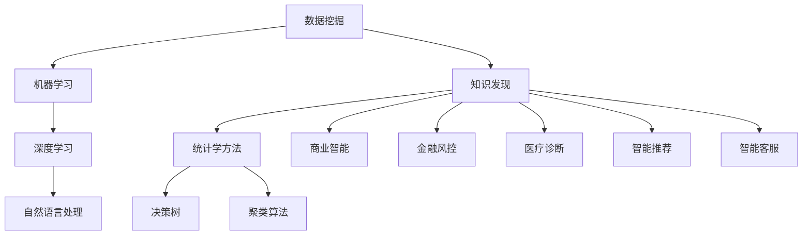

                 

# 从数据挖掘到知识发现：技术演进与应用

> 关键词：数据挖掘,知识发现,机器学习,人工智能,深度学习,大数据,自然语言处理,NLP,自然语言理解,NLU

## 1. 背景介绍

### 1.1 问题由来

数据挖掘和知识发现是人工智能(AI)和机器学习(ML)领域的核心任务之一。数据挖掘技术通过对大量数据进行分析和建模，能够揭示数据背后的规律和模式，为决策者提供科学依据。而知识发现则是指将数据挖掘技术应用于具体领域，提取有价值的信息和知识，辅助人类的学习和理解。

在过去几十年里，数据挖掘和知识发现技术经历了快速的发展和演变。从早期的统计学方法、决策树、聚类算法，到近期的深度学习、自然语言处理(NLP)、迁移学习等，技术不断进步，应用范围不断扩大。目前，这些技术已广泛应用于商业智能、金融风控、医疗诊断、智能推荐、智能客服等领域，为各行各业带来了巨大的商业价值和社会效益。

然而，随着数据量的激增和复杂度的提升，传统的基于统计学和规则的挖掘技术已无法满足实际需求。大数据和深度学习等新兴技术的应用，使得数据挖掘和知识发现变得更加高效和智能化。本文将系统介绍从数据挖掘到知识发现的演进过程，深入分析现有技术在实际应用中的表现和挑战，并展望未来的发展方向。

### 1.2 问题核心关键点

本文将从以下几个关键点来展开介绍：

- **数据挖掘**：通过统计学和算法技术，从数据中挖掘出有价值的模式和规律。
- **知识发现**：将数据挖掘技术应用于具体领域，提取有价值的信息和知识，辅助决策和理解。
- **机器学习**：基于数据和特征进行模型训练，以识别数据中的复杂模式和规律。
- **深度学习**：通过多层次神经网络结构，进行更加复杂和高精度的模式识别和表示学习。
- **自然语言处理**：利用人工智能技术对人类语言进行处理和理解，实现机器翻译、情感分析、语义分析等功能。

这些核心概念之间的逻辑关系可以通过以下Mermaid流程图来展示：



这个流程图展示了大数据挖掘和知识发现的核心概念及其之间的关系：

1. 数据挖掘通过统计学和算法技术，从数据中挖掘出模式和规律。
2. 机器学习利用数据和特征进行模型训练，识别数据中的复杂模式。
3. 深度学习采用多层次神经网络，进行高精度的模式识别和表示学习。
4. 自然语言处理利用人工智能技术对人类语言进行处理和理解。
5. 知识发现将数据挖掘技术应用于具体领域，提取有价值的信息和知识，辅助决策和理解。

这些核心概念共同构成了数据挖掘和知识发现的理论基础，使得它们能够广泛应用于各个领域，解决实际问题。

## 2. 核心概念与联系

### 2.1 核心概念概述

- **数据挖掘**：指从大量数据中自动发现有用信息和知识的过程。其目的是帮助决策者理解数据，发现数据中的模式、规律和关联。
- **知识发现**：指将数据挖掘技术应用于具体领域，提取有价值的信息和知识，辅助决策和理解。例如，在商业智能中，利用数据挖掘技术进行市场分析、客户行为分析等。
- **机器学习**：指通过数据和特征进行模型训练，使机器能够识别数据中的复杂模式和规律。机器学习算法包括监督学习、无监督学习和强化学习等。
- **深度学习**：一种特殊的机器学习方法，通过多层次神经网络结构进行更加复杂和高精度的模式识别和表示学习。深度学习在图像识别、语音识别、自然语言处理等领域取得了显著的成果。
- **自然语言处理(NLP)**：利用人工智能技术对人类语言进行处理和理解，包括文本分类、情感分析、机器翻译、语音识别、语义分析等。

### 2.2 核心概念原理和架构的 Mermaid 流程图


这个流程图展示了大数据挖掘和知识发现的核心概念及其之间的关系。

1. **数据挖掘**：通过统计学和算法技术，从数据中挖掘出模式和规律。
2. **机器学习**：利用数据和特征进行模型训练，识别数据中的复杂模式。
3. **深度学习**：采用多层次神经网络，进行高精度的模式识别和表示学习。
4. **自然语言处理(NLP)**：利用人工智能技术对人类语言进行处理和理解。
5. **知识发现**：将数据挖掘技术应用于具体领域，提取有价值的信息和知识，辅助决策和理解。

这些核心概念共同构成了数据挖掘和知识发现的理论基础，使得它们能够广泛应用于各个领域，解决实际问题。

## 3. 核心算法原理 & 具体操作步骤

### 3.1 算法原理概述

数据挖掘和知识发现技术的核心在于从数据中提取有价值的信息和知识。其基本流程包括数据预处理、特征提取、模型训练、结果评估和解释等步骤。以下是各步骤的详细描述：

#### 3.1.1 数据预处理

数据预处理是数据挖掘和知识发现的第一步，其目的是清洗、转换和整合数据，以便于后续的分析和建模。常见的数据预处理技术包括：

- 数据清洗：去除噪声、缺失值、异常值等不必要的数据。
- 数据转换：通过标准化、归一化等方法，使数据处于合适的范围。
- 数据整合：将不同来源的数据进行合并和一致性处理，以消除冗余和歧义。

#### 3.1.2 特征提取

特征提取是指从原始数据中提取有用的特征，以供模型训练和分析。常见的特征提取方法包括：

- 统计特征：通过统计学方法提取数据的基本统计量，如均值、方差、标准差等。
- 离散特征：将连续数据转换为离散数据，如二值化、桶划分等。
- 文本特征：通过NLP技术对文本数据进行分词、词性标注、命名实体识别等操作，提取特征向量。

#### 3.1.3 模型训练

模型训练是指利用数据和特征，通过机器学习算法构建模型，以识别数据中的复杂模式和规律。常见的机器学习算法包括：

- 监督学习：通过标注数据训练模型，预测新数据的标签。
- 无监督学习：从未标注数据中提取特征，发现数据中的模式和关联。
- 强化学习：通过试错和奖励机制，优化模型参数，实现最优决策。

#### 3.1.4 结果评估

结果评估是指对模型进行评估，以衡量其性能和可靠性。常见的评估指标包括：

- 准确率：预测结果与真实结果相符的比例。
- 召回率：真实结果被正确预测的比例。
- F1分数：准确率和召回率的调和平均数。
- AUC-ROC：ROC曲线下的面积，衡量分类器的性能。

#### 3.1.5 结果解释

结果解释是指对模型输出结果进行解释，以便于理解模型的工作原理和决策依据。常见的结果解释方法包括：

- 特征重要性：通过特征贡献度分析，确定哪些特征对模型的预测结果影响最大。
- 模型可视化：通过绘制模型决策边界、特征权重等，直观展示模型的工作机制。
- 解释性算法：采用专门的算法，如LIME、SHAP等，生成局部解释，解释模型的决策过程。

### 3.2 算法步骤详解

以下是一个基于监督学习的机器学习模型训练的详细步骤：

#### 3.2.1 数据准备

1. **数据获取**：从数据库、日志、传感器等数据源中获取数据。
2. **数据清洗**：去除噪声、缺失值、异常值等不必要的数据。
3. **数据转换**：通过标准化、归一化等方法，使数据处于合适的范围。
4. **数据整合**：将不同来源的数据进行合并和一致性处理，以消除冗余和歧义。

#### 3.2.2 特征提取

1. **统计特征提取**：通过统计学方法提取数据的基本统计量，如均值、方差、标准差等。
2. **离散特征提取**：将连续数据转换为离散数据，如二值化、桶划分等。
3. **文本特征提取**：通过NLP技术对文本数据进行分词、词性标注、命名实体识别等操作，提取特征向量。

#### 3.2.3 模型选择

1. **选择合适的算法**：根据任务类型和数据特点，选择适合的监督学习算法，如决策树、随机森林、支持向量机、神经网络等。
2. **设定超参数**：根据经验或实验，设定模型的超参数，如学习率、正则化系数、迭代次数等。

#### 3.2.4 模型训练

1. **模型训练**：利用数据和特征，通过监督学习算法训练模型，以识别数据中的复杂模式和规律。
2. **模型优化**：通过交叉验证、网格搜索等方法，优化模型参数，提升模型性能。

#### 3.2.5 模型评估

1. **结果评估**：对模型进行评估，以衡量其性能和可靠性。常见的评估指标包括准确率、召回率、F1分数、AUC-ROC等。
2. **结果解释**：对模型输出结果进行解释，以便于理解模型的工作原理和决策依据。

#### 3.2.6 模型部署

1. **模型保存**：将训练好的模型保存为文件或数据库，以便于后续调用。
2. **模型部署**：将模型部署到实际应用中，进行实时预测和推理。

### 3.3 算法优缺点

数据挖掘和知识发现技术具有以下优点：

- **高效性**：通过自动化的算法和技术，可以快速从大量数据中提取有价值的信息和知识。
- **可解释性**：通过结果解释，可以理解模型的决策依据和内部工作机制。
- **普适性**：可以应用于各个领域，解决实际问题。

但同时也存在一些缺点：

- **数据依赖性**：依赖于高质量和充足的数据，难以在大数据量下充分发挥其优势。
- **模型复杂性**：一些复杂的算法和技术，如深度学习、强化学习等，需要较高的技术门槛和计算资源。
- **结果局限性**：模型输出结果可能存在偏差，难以完全反映数据的真实情况。

### 3.4 算法应用领域

数据挖掘和知识发现技术已经广泛应用于各个领域，以下是几个典型的应用场景：

#### 3.4.1 商业智能

商业智能(Business Intelligence, BI)是利用数据挖掘和知识发现技术，对企业的业务数据进行分析和建模，以支持决策和管理的系统。其核心任务包括：

- **市场分析**：通过数据挖掘技术，分析市场趋势和消费者行为，制定营销策略。
- **客户行为分析**：利用数据挖掘技术，识别客户的购买偏好和行为模式，进行个性化推荐。
- **销售预测**：通过数据挖掘技术，预测销售趋势和客户需求，优化供应链管理。

#### 3.4.2 金融风控

金融风控是指利用数据挖掘和知识发现技术，对金融市场进行风险分析和控制的过程。其核心任务包括：

- **信用评估**：通过数据挖掘技术，评估客户的信用风险，进行贷款审批。
- **欺诈检测**：利用数据挖掘技术，检测和预防金融欺诈行为，保护客户资产安全。
- **市场预测**：通过数据挖掘技术，预测金融市场走势，指导投资决策。

#### 3.4.3 医疗诊断

医疗诊断是指利用数据挖掘和知识发现技术，对患者的医疗数据进行分析和建模，以辅助医生的诊断和治疗。其核心任务包括：

- **疾病预测**：通过数据挖掘技术，预测患者的疾病风险，进行早期干预。
- **诊断支持**：利用数据挖掘技术，辅助医生进行诊断，提高诊断准确率。
- **个性化治疗**：通过数据挖掘技术，制定个性化的治疗方案，提高治疗效果。

#### 3.4.4 智能推荐

智能推荐是指利用数据挖掘和知识发现技术，对用户的兴趣和行为进行分析和建模，以推荐符合用户需求的产品或内容。其核心任务包括：

- **商品推荐**：通过数据挖掘技术，推荐符合用户兴趣的商品，提高销售额。
- **内容推荐**：利用数据挖掘技术，推荐符合用户兴趣的内容，增加用户粘性。
- **广告推荐**：通过数据挖掘技术，推荐符合用户兴趣的广告，提高广告效果。

## 4. 数学模型和公式 & 详细讲解 & 举例说明

### 4.1 数学模型构建

假设有一个二分类任务，目标是从数据中学习一个分类器$f(x)$，使其能够准确预测输入$x$的类别$y$。常用的数学模型包括：

- **决策树**：通过树形结构表示分类规则，将数据分成不同的子集。
- **随机森林**：通过多个决策树的集成，提高分类准确率。
- **支持向量机(SVM)**：通过超平面将数据分成不同的类别。
- **神经网络**：通过多层神经网络结构，进行更加复杂和高精度的模式识别和表示学习。

#### 4.1.1 决策树模型

决策树模型是一种基于树形结构的分类算法，通过将数据分成不同的子集，实现分类或回归。其数学模型如下：

$$
f(x) = \sum_{k=1}^{n} w_k \mathbf{1}\{ x \in T_k \}
$$

其中，$w_k$表示子集$T_k$的权重，$\mathbf{1}\{ x \in T_k \}$表示$x$是否属于子集$T_k$的指示函数。

#### 4.1.2 随机森林模型

随机森林模型是一种基于决策树的集成学习算法，通过多个决策树的集成，提高分类准确率。其数学模型如下：

$$
f(x) = \frac{1}{N} \sum_{i=1}^{N} f_i(x)
$$

其中，$f_i(x)$表示第$i$棵决策树的预测结果，$N$表示决策树的数量。

#### 4.1.3 支持向量机(SVM)

支持向量机是一种基于超平面的分类算法，通过将数据分成不同的类别，实现分类或回归。其数学模型如下：

$$
f(x) = \sum_{i=1}^{n} w_i \mathbf{1}\{ x \in \Omega_i \}
$$

其中，$\Omega_i$表示第$i$个超平面的分割区域。

#### 4.1.4 神经网络模型

神经网络模型是一种基于多层神经网络的分类算法，通过多层线性变换和激活函数，实现更加复杂和高精度的模式识别和表示学习。其数学模型如下：

$$
f(x) = \sigma(W^{(L)} \sigma(W^{(L-1)} \ldots \sigma(W^{(1)}x) \ldots) + b)
$$

其中，$W$表示权重矩阵，$b$表示偏置项，$\sigma$表示激活函数。

### 4.2 公式推导过程

以支持向量机(SVM)为例，推导其数学模型的推导过程。

假设有一个二分类任务，目标是从数据中学习一个分类器$f(x)$，使其能够准确预测输入$x$的类别$y$。

首先，定义一个超平面$\Omega$，使得所有正样本$x$满足$f(x) \geq 1$，所有负样本$x$满足$f(x) \leq -1$。

其次，定义超平面的权值向量$\mathbf{w}$和偏置项$b$，使得超平面的方程为：

$$
f(x) = \mathbf{w}^T x + b
$$

其中，$\mathbf{w}^T$表示权值向量$\mathbf{w}$的转置。

最后，通过求解最小化目标函数：

$$
\min_{\mathbf{w},b} \frac{1}{2} \|\mathbf{w}\|^2 + C \sum_{i=1}^{N} \max(0, 1 - y_i f(x_i))
$$

得到最优的权值向量$\mathbf{w}$和偏置项$b$，从而得到分类器$f(x)$。

### 4.3 案例分析与讲解

以一个二分类任务为例，利用决策树算法对数据进行分类。

#### 4.3.1 数据准备

1. **数据获取**：从数据库中获取二分类数据集。
2. **数据清洗**：去除噪声、缺失值、异常值等不必要的数据。
3. **数据转换**：通过标准化、归一化等方法，使数据处于合适的范围。
4. **数据整合**：将不同来源的数据进行合并和一致性处理，以消除冗余和歧义。

#### 4.3.2 特征提取

1. **统计特征提取**：通过统计学方法提取数据的基本统计量，如均值、方差、标准差等。
2. **离散特征提取**：将连续数据转换为离散数据，如二值化、桶划分等。
3. **文本特征提取**：通过NLP技术对文本数据进行分词、词性标注、命名实体识别等操作，提取特征向量。

#### 4.3.3 模型训练

1. **模型选择**：选择决策树算法进行分类。
2. **设定超参数**：设定决策树的深度、分裂方式等超参数。
3. **模型训练**：利用数据和特征，通过决策树算法训练模型，以识别数据中的复杂模式和规律。

#### 4.3.4 模型评估

1. **结果评估**：对模型进行评估，以衡量其性能和可靠性。常见的评估指标包括准确率、召回率、F1分数、AUC-ROC等。
2. **结果解释**：对模型输出结果进行解释，以便于理解模型的工作原理和决策依据。

#### 4.3.5 模型部署

1. **模型保存**：将训练好的模型保存为文件或数据库，以便于后续调用。
2. **模型部署**：将模型部署到实际应用中，进行实时预测和推理。

## 5. 项目实践：代码实例和详细解释说明

### 5.1 开发环境搭建

在进行数据挖掘和知识发现实践前，我们需要准备好开发环境。以下是使用Python进行Scikit-Learn开发的环境配置流程：

1. 安装Anaconda：从官网下载并安装Anaconda，用于创建独立的Python环境。

2. 创建并激活虚拟环境：
```bash
conda create -n scikit-learn-env python=3.8 
conda activate scikit-learn-env
```

3. 安装Scikit-Learn：
```bash
pip install scikit-learn
```

4. 安装其他必要的工具包：
```bash
pip install numpy pandas matplotlib scikit-learn
```

完成上述步骤后，即可在`scikit-learn-env`环境中开始数据挖掘和知识发现实践。

### 5.2 源代码详细实现

以下是一个基于Scikit-Learn的决策树模型训练的代码实现。

```python
from sklearn.datasets import load_iris
from sklearn.model_selection import train_test_split
from sklearn.tree import DecisionTreeClassifier
from sklearn.metrics import accuracy_score

# 加载数据集
iris = load_iris()
X = iris.data
y = iris.target

# 数据划分
X_train, X_test, y_train, y_test = train_test_split(X, y, test_size=0.3, random_state=42)

# 模型训练
clf = DecisionTreeClassifier(max_depth=3)
clf.fit(X_train, y_train)

# 模型评估
y_pred = clf.predict(X_test)
accuracy = accuracy_score(y_test, y_pred)
print("Accuracy:", accuracy)
```

### 5.3 代码解读与分析

让我们再详细解读一下关键代码的实现细节：

**决策树模型训练代码**：
1. **数据准备**：加载数据集、划分数据集、准备训练集和测试集。
2. **模型训练**：选择决策树算法，设定超参数，训练模型。
3. **模型评估**：在测试集上评估模型性能，计算准确率。

**数据集加载代码**：
- `load_iris()`函数：加载鸢尾花数据集，包含三个品种的鸢尾花特征和标签。
- `X`和`y`变量：分别表示特征和标签。

**数据划分代码**：
- `train_test_split()`函数：将数据集划分为训练集和测试集。
- `test_size=0.3`：表示测试集占总数据的30%。
- `random_state=42`：表示随机种子，用于数据划分的一致性。

**模型训练代码**：
- `DecisionTreeClassifier()`函数：创建决策树分类器。
- `max_depth=3`：表示决策树的深度为3。

**模型评估代码**：
- `predict()`函数：对测试集进行预测。
- `accuracy_score()`函数：计算准确率。

**模型部署代码**：
- 训练好的模型可以通过`save()`函数保存为文件或数据库。

通过上述代码，我们可以快速训练一个决策树模型，并评估其性能。

## 6. 实际应用场景

### 6.1 商业智能

商业智能(BI)是利用数据挖掘和知识发现技术，对企业的业务数据进行分析和建模，以支持决策和管理的系统。

**案例1：市场分析**

某电商平台希望分析其用户的消费行为，预测未来的市场趋势。他们收集了用户的浏览记录、购买记录、评价记录等数据，并利用数据挖掘技术，提取了用户的兴趣偏好和行为模式。通过构建用户画像，分析不同时间段、不同地域、不同人群的消费行为，制定了更加精准的营销策略，实现了销售额的显著增长。

**案例2：客户行为分析**

某银行希望提升其信用卡的持有量，利用数据挖掘技术，分析了客户的信用记录、消费行为、还款情况等数据，构建了客户画像。通过识别高价值客户，制定个性化的营销方案，提升了客户的满意度和忠诚度，增加了信用卡的发行量。

### 6.2 金融风控

金融风控是指利用数据挖掘和知识发现技术，对金融市场进行风险分析和控制的过程。

**案例1：信用评估**

某贷款公司希望评估客户的信用风险，利用数据挖掘技术，分析了客户的收入、资产、负债等数据，构建了信用评分模型。通过评估客户的信用风险，进行贷款审批，降低了坏账率，提高了资金使用效率。

**案例2：欺诈检测**

某在线支付平台希望检测和预防金融欺诈行为，利用数据挖掘技术，分析了交易记录、用户行为、设备信息等数据，构建了欺诈检测模型。通过实时监控交易行为，及时发现异常交易，减少了欺诈行为的发生，保护了用户资产安全。

### 6.3 医疗诊断

医疗诊断是指利用数据挖掘和知识发现技术，对患者的医疗数据进行分析和建模，以辅助医生的诊断和治疗。

**案例1：疾病预测**

某医院希望预测患者的疾病风险，利用数据挖掘技术，分析了患者的生理指标、生活习惯、家族病史等数据，构建了疾病预测模型。通过预测患者的疾病风险，进行早期干预，提高了治疗效果，减少了医疗成本。

**案例2：诊断支持**

某医生希望提高诊断准确率，利用数据挖掘技术，分析了患者的症状、检查结果、病历等数据，构建了诊断支持模型。通过辅助医生进行诊断，提高了诊断准确率，减少了误诊率，提高了医疗服务质量。

### 6.4 智能推荐

智能推荐是指利用数据挖掘和知识发现技术，对用户的兴趣和行为进行分析和建模，以推荐符合用户需求的产品或内容。

**案例1：商品推荐**

某电商公司希望提高商品的推荐效果，利用数据挖掘技术，分析了用户的浏览记录、购买记录、评价记录等数据，构建了商品推荐模型。通过推荐符合用户兴趣的商品，提高了销售额，增加了用户粘性。

**案例2：内容推荐**

某视频平台希望提高内容推荐的准确率，利用数据挖掘技术，分析了用户的观看记录、评价记录、搜索记录等数据，构建了内容推荐模型。通过推荐符合用户兴趣的内容，提高了用户的观看时间和平台的用户留存率。

## 7. 工具和资源推荐

### 7.1 学习资源推荐

为了帮助开发者系统掌握数据挖掘和知识发现的技术基础和实践技巧，这里推荐一些优质的学习资源：

1. 《Python数据科学手册》：详细介绍Python在数据挖掘和知识发现中的应用。

2. 《统计学习方法》：系统介绍各种统计学习方法，包括决策树、随机森林、支持向量机等。

3. 《深度学习》：深入讲解深度学习的基本原理和应用，包括卷积神经网络、循环神经网络等。

4. 《自然语言处理综论》：全面介绍自然语言处理的基本概念和算法，包括文本分类、情感分析、机器翻译等。

5. 《Kaggle竞赛》：Kaggle平台上有大量的数据挖掘和知识发现竞赛，提供丰富的数据集和解决方案。

通过对这些资源的学习实践，相信你一定能够快速掌握数据挖掘和知识发现的精髓，并用于解决实际的NLP问题。

### 7.2 开发工具推荐

高效的开发离不开优秀的工具支持。以下是几款用于数据挖掘和知识发现开发的常用工具：

1. Python：Python是数据挖掘和知识发现领域的主流编程语言，具有丰富的数据处理和机器学习库。

2. Scikit-Learn：Scikit-Learn是Python中常用的机器学习库，提供了多种经典的机器学习算法和工具。

3. TensorFlow：TensorFlow是Google开发的深度学习框架，适用于大规模的深度学习模型训练和部署。

4. PyTorch：PyTorch是Facebook开发的深度学习框架，支持动态计算图和自动微分，适用于快速迭代研究。

5. Jupyter Notebook：Jupyter Notebook是一个交互式的编程环境，支持Python、R等语言的代码编写和数据可视化。

合理利用这些工具，可以显著提升数据挖掘和知识发现任务的开发效率，加快创新迭代的步伐。

### 7.3 相关论文推荐

数据挖掘和知识发现技术的发展源于学界的持续研究。以下是几篇奠基性的相关论文，推荐阅读：

1. ID3算法：Quinlan提出的决策树算法，是数据挖掘领域经典算法之一。

2. C4.5算法：Quinlan对ID3算法的改进，支持离散型和连续型特征，适用于各种分类和回归任务。

3. SVM算法：Cortes和Vapnik提出的支持向量机算法，利用核函数实现高维空间分类。

4. Random Forest算法：Breiman提出的随机森林算法，通过集成多个决策树提高分类准确率。

5. K-means算法：MacQueen提出的聚类算法，通过K个质心实现数据聚类。

6. Principal Component Analysis(PCA)：Hotelling提出的主成分分析算法，通过降维技术优化数据处理效率。

这些论文代表了大数据挖掘和知识发现技术的发展脉络。通过学习这些前沿成果，可以帮助研究者把握学科前进方向，激发更多的创新灵感。

## 8. 总结：未来发展趋势与挑战

### 8.1 总结

本文对数据挖掘和知识发现技术进行了全面系统的介绍。首先阐述了数据挖掘和知识发现技术的研究背景和意义，明确了其在商业智能、金融风控、医疗诊断等领域的独特价值。其次，从原理到实践，详细讲解了数据挖掘和知识发现的数学模型和关键步骤，给出了数据挖掘任务的代码实现。同时，本文还广泛探讨了数据挖掘技术在实际应用中的表现和挑战，并展望了未来的发展方向。

通过本文的系统梳理，可以看到，数据挖掘和知识发现技术正在成为商业智能、金融风控、医疗诊断等领域的重要范式，极大地拓展了数据处理和分析的应用边界，为各行各业带来了巨大的商业价值和社会效益。未来，伴随数据量的激增和深度学习等新兴技术的应用，数据挖掘和知识发现技术必将进一步发展和提升，带来更加智能化和高效化的应用场景。

### 8.2 未来发展趋势

展望未来，数据挖掘和知识发现技术将呈现以下几个发展趋势：

1. **自动化和智能化**：随着深度学习和大数据技术的发展，数据挖掘和知识发现将变得更加自动化和智能化，能够从数据中自动发现复杂模式和规律，并生成更加精准的预测结果。

2. **多模态融合**：未来的数据挖掘和知识发现将不再局限于单模态数据，而是融合图像、文本、语音等多种模态的数据，实现更加全面和深入的分析。

3. **实时化和动态化**：未来的数据挖掘和知识发现将更加注重实时性和动态性，能够实时监控和分析数据，及时发现异常和变化，辅助决策和控制。

4. **解释性和透明性**：未来的数据挖掘和知识发现将更加注重解释性和透明性，能够提供模型决策的详细解释，帮助用户理解和信任结果。

5. **隐私保护和安全**：未来的数据挖掘和知识发现将更加注重隐私保护和安全，通过匿名化和加密技术，保护数据隐私和安全。

这些趋势凸显了数据挖掘和知识发现的广阔前景，预示着其在各个领域的更大应用潜力。

### 8.3 面临的挑战

尽管数据挖掘和知识发现技术已经取得了瞩目成就，但在迈向更加智能化、普适化应用的过程中，它仍面临着诸多挑战：

1. **数据质量和多样性**：高质量和多样化的数据是数据挖掘和知识发现的基石，但在大数据背景下，数据的质量和多样性难以得到保障。

2. **模型复杂性**：一些复杂的算法和技术，如深度学习、强化学习等，需要较高的技术门槛和计算资源，难以在大规模数据上高效运行。

3. **结果解释性**：模型输出结果可能存在偏差，难以完全反映数据的真实情况，缺乏解释性。

4. **隐私和安全**：在数据挖掘和知识发现过程中，数据隐私和安全问题难以得到充分保障，存在数据泄露和滥用的风险。

5. **可解释性和透明性**：模型决策的详细解释和透明性问题难以得到充分解决，用户难以理解和信任结果。

这些挑战凸显了数据挖掘和知识发现的局限性，需要进一步探索和改进。

### 8.4 研究展望

面对数据挖掘和知识发现所面临的挑战，未来的研究需要在以下几个方面寻求新的突破：

1. **数据预处理和清洗技术**：开发更加高效和智能的数据预处理和清洗技术，确保数据质量和多样性，提升数据挖掘和知识发现的准确性和可靠性。

2. **高效和轻量级算法**：开发更加高效和轻量级的算法，支持在大规模数据上高效运行，提升数据挖掘和知识发现的实时性和动态性。

3. **模型解释和透明性**：开发更加可解释和透明的模型，提供详细的决策解释和透明性，提升数据挖掘和知识发现的可信度和用户信任。

4. **隐私保护和安全技术**：开发更加隐私保护和安全的技术，保护数据隐私和安全，防止数据泄露和滥用。

5. **多模态数据融合技术**：开发更加多模态融合的技术，融合图像、文本、语音等多种模态的数据，实现更加全面和深入的分析。

这些研究方向将推动数据挖掘和知识发现技术迈向新的高度，带来更加智能化和高效化的应用场景，为各行各业带来更大的商业价值和社会效益。

## 9. 附录：常见问题与解答

**Q1：数据挖掘和知识发现有哪些常见的应用场景？**

A: 数据挖掘和知识发现技术已经被广泛应用于各个领域，以下是几个典型的应用场景：

1. **商业智能**：通过数据挖掘和知识发现技术，对企业的业务数据进行分析和建模，以支持决策和管理。例如，市场分析、客户行为分析、销售预测等。

2. **金融风控**：利用数据挖掘和知识发现技术，对金融市场进行风险分析和控制。例如，信用评估、欺诈检测、市场预测等。

3. **医疗诊断**：通过数据挖掘和知识发现技术，对患者的医疗数据进行分析和建模，以辅助医生的诊断和治疗。例如，疾病预测、诊断支持、个性化治疗等。

4. **智能推荐**：利用数据挖掘和知识发现技术，对用户的兴趣和行为进行分析和建模，以推荐符合用户需求的产品或内容。例如，商品推荐、内容推荐、广告推荐等。

**Q2：数据挖掘和知识发现与机器学习和人工智能有什么区别？**

A: 数据挖掘和知识发现与机器学习和人工智能有着密切的联系，但它们之间存在一些区别：

1. **目标不同**：数据挖掘和知识发现的目标是从数据中提取有价值的信息和知识，而机器学习和人工智能的目标是通过数据和特征训练模型，进行分类、回归、预测等任务。

2. **方法不同**：数据挖掘和知识发现主要依靠统计学和算法技术，而机器学习和人工智能主要依靠数据和特征训练模型，采用深度学习、强化学习等技术。

3. **应用场景不同**：数据挖掘和知识发现适用于数据处理和分析，而机器学习和人工智能适用于数据建模和预测。

**Q3：如何选择合适的数据挖掘和知识发现算法？**

A: 选择数据挖掘和知识发现算法时，需要考虑以下几个因素：

1. **任务类型**：根据任务类型选择适合的算法，如分类、回归、聚类等。

2. **数据特点**：根据数据的特点选择适合的算法，如离散型数据、连续型数据、高维数据等。

3. **算法性能**：根据算法的性能选择适合的算法，如准确率、召回率、F1分数等。

4. **计算资源**：根据计算资源选择适合的算法，如内存、CPU、GPU等。

**Q4：数据挖掘和知识发现需要注意哪些数据预处理步骤？**

A: 数据预处理是数据挖掘和知识发现的重要环节，需要注意以下几个步骤：

1. **数据清洗**：去除噪声、缺失值、异常值等不必要的数据。

2. **数据转换**：通过标准化、归一化等方法，使数据处于合适的范围。

3. **数据整合**：将不同来源的数据进行合并和一致性处理，以消除冗余和歧义。

**Q5：数据挖掘和知识发现与自然语言处理(NLP)有哪些联系和区别？**

A: 数据挖掘和知识发现与自然语言处理(NLP)有着密切的联系，但它们之间存在一些区别：

1. **数据类型不同**：数据挖掘和知识发现主要处理结构化数据，而自然语言处理主要处理文本数据。

2. **处理方式不同**：数据挖掘和知识发现主要依赖统计学和算法技术，而自然语言处理主要依赖语言学和机器学习技术。

3. **应用场景不同**：数据挖掘和知识发现适用于各种数据处理和分析任务，而自然语言处理适用于文本分类、情感分析、机器翻译等任务。

**Q6：如何提高数据挖掘和知识发现的模型解释性？**

A: 提高数据挖掘和知识发现的模型解释性，可以从以下几个方面入手：

1. **特征重要性分析**：通过特征贡献度分析，确定哪些特征对模型的预测结果影响最大。

2. **模型可视化**：通过绘制模型决策边界、特征权重等，直观展示模型的工作机制。

3. **解释性算法**：采用专门的算法，如LIME、SHAP等，生成局部解释，解释模型的决策过程。

**Q7：如何保护数据挖掘和知识发现中的数据隐私？**

A: 保护数据挖掘和知识发现中的数据隐私，可以从以下几个方面入手：

1. **数据匿名化**：通过数据匿名化技术，保护用户隐私，防止数据泄露。

2. **数据加密**：通过数据加密技术，保护数据安全，防止数据篡改和滥用。

3. **访问控制**：通过访问控制技术，限制数据访问权限，防止数据泄露和滥用。

4. **隐私政策**：制定隐私政策，明确数据使用范围和权限，保护用户隐私。

通过对这些问题的详细解答，相信你能够更好地理解数据挖掘和知识发现技术的核心原理和应用实践。

---

作者：禅与计算机程序设计艺术 / Zen and the Art of Computer Programming

