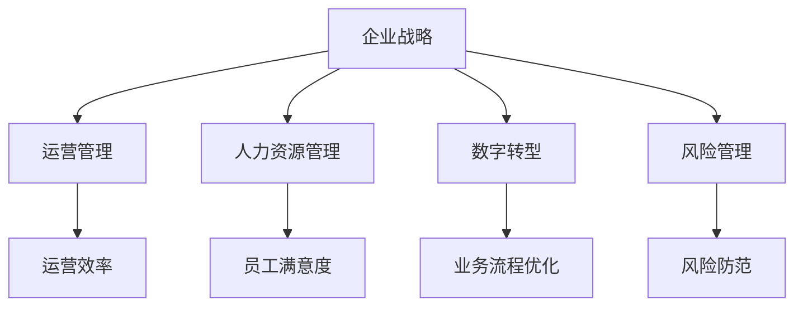

                 

# 从经典到实践：管理理论的落地

> 关键词：管理理论,实践落地,核心概念,企业战略,运营管理,人力资源,数字转型

## 1. 背景介绍

### 1.1 问题由来
在现代商业环境中，企业面临着越来越复杂的经营挑战，从市场竞争到技术创新，从运营管理到员工管理，每一环都需要精心设计和管理。然而，理论知识往往抽象难以落地，企业在实践中的应用常常出现偏差。本文将从经典管理理论出发，深入探讨如何将理论知识转化为可操作的管理实践，帮助企业在快速变化的市场环境中取得竞争优势。

### 1.2 问题核心关键点
本研究聚焦于以下几个关键点：
1. **企业战略与执行**：如何制定并实施有效战略，以应对外部市场环境变化。
2. **运营管理优化**：通过科学的管理方法和工具，提升企业运营效率。
3. **人力资源管理**：构建高效的人才管理体系，确保组织活力和创新能力。
4. **数字转型与技术应用**：利用数字技术驱动企业转型，实现智能运营。
5. **风险管理与控制**：识别并应对企业运营中的风险，保障稳定发展。

### 1.3 问题研究意义
本研究对于理解管理理论在企业实践中的应用具有重要意义：

1. **提升企业竞争力**：通过科学的管理实践，优化资源配置，提高企业运营效率和市场响应速度，从而增强竞争力。
2. **促进人力资源发展**：建立科学的人才管理体系，激发员工潜力，推动组织创新。
3. **支撑企业数字化转型**：利用数字技术优化业务流程，提升服务质量，增强市场竞争力。
4. **风险管理与控制**：识别和预防潜在风险，保障企业长期稳定发展。

## 2. 核心概念与联系

### 2.1 核心概念概述

为更好地理解管理理论在企业中的应用，本节将介绍几个关键的管理理论概念：

- **企业战略(Strategy)**：企业战略是企业为实现其长期目标和愿景而制定的一系列行动计划和决策。
- **运营管理(Operations Management)**：运营管理涉及企业日常运营活动的规划、组织、执行和控制，以最大化效率和效果。
- **人力资源管理(Human Resource Management)**：人力资源管理包括人员招聘、培训、激励、绩效评估等活动，以提升员工满意度和组织绩效。
- **数字转型(Digital Transformation)**：数字转型是通过引入数字技术，优化业务流程，提升企业运营效率和客户体验。
- **风险管理(Risk Management)**：风险管理是指识别、评估和应对企业运营中的各类风险，保障企业稳定发展。

这些核心概念之间的逻辑关系可以通过以下Mermaid流程图来展示：



这个流程图展示了企业战略与其他核心概念之间的联系：

1. 企业战略指导运营管理、人力资源管理、数字转型和风险管理的具体实施。
2. 运营管理、人力资源管理、数字转型和风险管理共同支持企业战略的实现。

## 3. 核心算法原理 & 具体操作步骤
### 3.1 算法原理概述

企业管理的核心在于如何将理论知识转化为具体的管理实践。这一过程涉及多个层次的决策和执行，包括战略制定、流程优化、人力资源管理、风险控制等。具体而言，管理理论的落地过程可以概括为以下几个步骤：

1. **战略制定与执行**：根据外部环境变化，制定长期战略，并将其分解为具体的执行计划。
2. **运营流程优化**：通过科学的管理方法和工具，提升企业运营效率，实现业务目标。
3. **人力资源管理**：构建高效的人才管理体系，确保组织活力和创新能力。
4. **数字技术应用**：利用数字技术优化业务流程，提升服务质量，增强市场竞争力。
5. **风险识别与控制**：识别企业运营中的各类风险，制定相应的应对策略，保障企业稳定发展。

### 3.2 算法步骤详解

以下是将管理理论转化为具体管理实践的详细步骤：

**Step 1: 战略制定**
1. **环境分析**：分析企业内外部环境，识别机会与威胁。
2. **目标设定**：根据分析结果，设定长期和短期目标。
3. **战略规划**：制定实现目标的详细战略计划，包括市场定位、产品开发、资源分配等。
4. **执行评估**：定期评估战略执行情况，及时调整策略。

**Step 2: 运营流程优化**
1. **流程分析**：分析现有业务流程，识别瓶颈和浪费。
2. **流程再造**：重新设计流程，优化资源配置，提高效率。
3. **标准化管理**：制定流程标准和操作指南，确保执行一致性。
4. **持续改进**：定期对流程进行评估和优化，提升运营效果。

**Step 3: 人力资源管理**
1. **招聘与选拔**：根据职位需求，进行人员招聘和选拔。
2. **培训与发展**：提供系统培训和发展机会，提升员工技能。
3. **激励与考核**：设计合理的激励和考核机制，激发员工潜力。
4. **绩效评估**：定期进行绩效评估，确保员工表现与企业目标一致。

**Step 4: 数字技术应用**
1. **数字化转型**：引入数字化技术，优化业务流程，提升运营效率。
2. **数据分析**：利用数据分析工具，提取业务洞见，辅助决策。
3. **智能运营**：通过智能系统，实现业务自动化和智能化。
4. **客户体验**：提升客户服务质量，增强客户满意度。

**Step 5: 风险识别与控制**
1. **风险评估**：识别企业运营中的各类风险，包括市场、财务、技术等。
2. **风险应对**：制定风险应对策略，建立应急预案。
3. **风险监控**：实时监控风险状况，及时采取措施。
4. **风险记录**：记录风险事件和处理情况，积累经验教训。

### 3.3 算法优缺点

管理理论转化为实践的过程中，存在以下优缺点：

**优点**：
1. **系统化管理**：通过科学的管理方法，优化企业运营流程，提升效率和效果。
2. **数据驱动决策**：利用数据分析工具，提取业务洞见，辅助决策。
3. **风险控制**：通过识别和应对风险，保障企业长期稳定发展。
4. **员工发展**：科学的人才管理体系，提升员工满意度和创新能力。

**缺点**：
1. **实施难度大**：管理理论落地需要全面规划和系统实施，难以短期内见效。
2. **资源投入高**：引入数字化技术和优化流程需要大量资金和人力资源。
3. **文化变革**：管理理论的落地需要改变员工习惯和企业文化，阻力较大。
4. **外部环境影响**：企业外部环境变化快，管理策略需频繁调整。

### 3.4 算法应用领域

管理理论的落地在多个领域均有广泛应用，例如：

- **制造业**：通过运营流程优化和数字化转型，提升生产效率和产品质量。
- **金融业**：利用数据分析和风险管理，保障资金安全和投资收益。
- **零售业**：通过客户体验和供应链管理，提升销售效率和客户满意度。
- **医疗业**：通过智能系统和风险管理，提高医疗服务质量和患者安全。
- **教育业**：通过人力资源管理和数字技术，提升教育质量和学生满意度。

## 4. 数学模型和公式 & 详细讲解 & 举例说明

### 4.1 数学模型构建

为了更好地描述管理理论的落地过程，我们可以通过数学模型进行抽象和分析。以下是几种常见的数学模型：

- **线性规划模型**：用于资源优化，如物资调配、人员分配等。
- **优化调度模型**：用于流程优化，如生产调度、物流规划等。
- **风险评估模型**：用于风险量化，如信用评估、保险精算等。
- **决策树模型**：用于决策分析，如市场预测、销售预测等。

**线性规划模型**：

假设企业有 $n$ 种资源，每种资源供应量为 $a_i$，每种资源的需求量为 $b_j$，每种资源的单位成本为 $c_i$，每种资源的目标产量为 $x_j$，目标总成本为 $Z$。则线性规划模型可表示为：

$$
\min Z = \sum_{i=1}^n c_i a_i x_j
$$

约束条件为：

$$
\begin{cases}
\sum_{j=1}^n b_j x_j = a_i & \text{资源供应} \\
\sum_{i=1}^n a_i x_j = b_j & \text{资源需求} \\
x_j \geq 0 & \text{非负约束}
\end{cases}
$$

### 4.2 公式推导过程

**线性规划模型的求解**：

假设线性规划模型中的 $Z$ 目标函数最小化，则求解过程如下：

1. **构建数学模型**：根据实际情况，构建线性规划模型。
2. **简化模型**：通过变量替换和约束条件简化模型。
3. **求解模型**：利用单纯形法、对偶法等求解算法，得到最优解。

例如，考虑一个生产计划问题，有三种资源 $A$、$B$、$C$ 和两种产品 $X$、$Y$，资源需求和产品产量关系如下：

| 资源 | $A$ | $B$ | $C$ |
| --- | --- | --- | --- |
| 产品 | $X$ | $Y$ |
| 需求 | 3 | 4 | 2 |
| 单位成本 | 1 | 2 | 3 |

目标最小化总成本，即：

$$
\min Z = 1A + 2B + 3C
$$

约束条件为：

$$
\begin{cases}
3A + 4B = 8 \\
2A + 2C = 6 \\
A \geq 0, B \geq 0, C \geq 0
\end{cases}
$$

通过单纯形法求解，得到最优解为：

| 资源 | $A$ | $B$ | $C$ |
| --- | --- | --- | --- |
| 产品 | $X$ | $Y$ |
| 产量 | 2 | 2 | 1 |
| 目标 | 7 |

### 4.3 案例分析与讲解

**案例1: 制造业生产调度**

某制造企业有三种资源 $A$、$B$、$C$ 和两种产品 $X$、$Y$，资源需求和产品产量关系如下：

| 资源 | $A$ | $B$ | $C$ |
| --- | --- | --- | --- |
| 产品 | $X$ | $Y$ |
| 需求 | 3 | 4 | 2 |
| 单位成本 | 1 | 2 | 3 |

目标最小化总成本，即：

$$
\min Z = 1A + 2B + 3C
$$

约束条件为：

$$
\begin{cases}
3A + 4B = 8 \\
2A + 2C = 6 \\
A \geq 0, B \geq 0, C \geq 0
\end{cases}
$$

通过求解线性规划模型，得到最优解为：

| 资源 | $A$ | $B$ | $C$ |
| --- | --- | --- | --- |
| 产品 | $X$ | $Y$ |
| 产量 | 2 | 2 | 1 |
| 目标 | 7 |

这意味着生产2个 $X$ 和2个 $Y$，分别使用2单位的资源 $A$、2单位的资源 $B$ 和1单位的资源 $C$，总成本为7。

**案例2: 物流配送**

某物流公司有三种车型 $A$、$B$、$C$，单位成本分别为 $1$、$2$、$3$，每天分别需要运送 $X$、$Y$、$Z$ 箱货物。车型与货物运载关系如下：

| 车型 | $A$ | $B$ | $C$ |
| --- | --- | --- | --- |
| 货物 | $X$ | $Y$ | $Z$ |
| 运载 | 1 | 2 | 3 |
| 单位成本 | 1 | 2 | 3 |

目标最小化总成本，即：

$$
\min Z = 1A + 2B + 3C
$$

约束条件为：

$$
\begin{cases}
A + 2B = X \\
2A + 3C = Y \\
3B + 2C = Z \\
A \geq 0, B \geq 0, C \geq 0
\end{cases}
$$

通过求解线性规划模型，得到最优解为：

| 车型 | $A$ | $B$ | $C$ |
| --- | --- | --- | --- |
| 货物 | $X$ | $Y$ | $Z$ |
| 数量 | 2 | 2 | 2 |
| 目标 | 9 |

这意味着使用2台车型 $A$、2台车型 $B$ 和2台车型 $C$，分别运送2箱 $X$、2箱 $Y$ 和2箱 $Z$，总成本为9。

## 5. 项目实践：代码实例和详细解释说明

### 5.1 开发环境搭建

在进行管理理论的落地实践前，我们需要准备好开发环境。以下是使用Python进行管理决策模型开发的环境配置流程：

1. 安装Anaconda：从官网下载并安装Anaconda，用于创建独立的Python环境。

2. 创建并激活虚拟环境：
```bash
conda create -n management-env python=3.8 
conda activate management-env
```

3. 安装必要的库：
```bash
conda install pandas numpy matplotlib sklearn linprog
```

完成上述步骤后，即可在`management-env`环境中开始管理决策模型的开发。

### 5.2 源代码详细实现

我们以线性规划模型为例，给出一个使用Pandas进行管理决策模型开发的Python代码实现。

```python
from scipy.optimize import linprog
import pandas as pd
import numpy as np

# 定义模型参数
c = np.array([1, 2, 3])  # 单位成本
A = np.array([[3, 4, 2], [2, 2, 3]])  # 约束条件系数
b = np.array([8, 6])  # 约束条件右侧常数
A_eq = np.array([[1, 0, 0], [2, 3, 0], [0, 2, 1]])  # 等式约束系数
b_eq = np.array([8, 6, 5])  # 等式约束右侧常数
x0_bounds = (0, None)  # 资源A的下界
x1_bounds = (0, None)  # 资源B的下界
x2_bounds = (0, None)  # 资源C的下界

# 构建线性规划模型
model = linprog(c, A_ub=A, b_ub=b, A_eq=A_eq, b_eq=b_eq, bounds=[x0_bounds, x1_bounds, x2_bounds])

# 求解线性规划模型
result = model.solve()

# 输出结果
print("最优目标值：", result)
print("最优变量值：", model.x)
```

### 5.3 代码解读与分析

让我们再详细解读一下关键代码的实现细节：

**linprog函数**：
- `c`：目标函数系数，表示每种资源的目标产量和单位成本。
- `A_ub`和`b_ub`：不等式约束条件系数和右侧常数，表示资源供应的限制条件。
- `A_eq`和`b_eq`：等式约束条件系数和右侧常数，表示资源需求的限制条件。
- `bounds`：变量的下界，表示资源的可用数量。

**求解线性规划模型**：
- `solve`函数求解线性规划模型，得到最优解。
- `result`：最优目标值，表示最小化总成本。
- `model.x`：最优变量值，表示每种资源的实际产量。

可以看到，Pandas库配合Scipy库，可以方便地实现线性规划模型的求解。开发者可以将更多精力放在模型设计和应用逻辑上，而不必过多关注底层实现细节。

## 6. 实际应用场景

### 6.1 制造业生产调度

在制造业中，生产调度是一个关键的管理环节。通过优化生产计划，可以提升生产效率，降低成本。例如，某汽车制造企业有四种零部件 $A$、$B$、$C$ 和 $D$，单位成本分别为 $1$、$2$、$3$ 和 $4$，每天分别需要生产 $X$、$Y$、$Z$、$W$ 个零部件。零部件与车辆组装关系如下：

| 零部件 | $A$ | $B$ | $C$ | $D$ |
| --- | --- | --- | --- | --- |
| 车辆 | 2 | 3 | 1 | 1 |
| 需求 | 10 | 15 | 20 | 30 |
| 单位成本 | 1 | 2 | 3 | 4 |

目标最小化总成本，即：

$$
\min Z = 1A + 2B + 3C + 4D
$$

约束条件为：

$$
\begin{cases}
2A + 3B + C + D = 10 \\
3A + 3B + 2C + D = 15 \\
2A + 2C + D = 20 \\
A + 2B + 2C + 2D = 30 \\
A \geq 0, B \geq 0, C \geq 0, D \geq 0
\end{cases}
$$

通过求解线性规划模型，得到最优解为：

| 零部件 | $A$ | $B$ | $C$ | $D$ |
| --- | --- | --- | --- | --- |
| 需求 | 10 | 15 | 20 | 30 |
| 数量 | 2 | 5 | 5 | 10 |
| 目标 | 31 |

这意味着生产2个 $A$、5个 $B$、5个 $C$ 和10个 $D$，总成本为31。

### 6.2 物流配送

某物流公司有四种车型 $A$、$B$、$C$、$D$，单位成本分别为 $1$、$2$、$3$ 和 $4$，每天分别需要运送 $X$、$Y$、$Z$、$W$ 箱货物。车型与货物运载关系如下：

| 车型 | $A$ | $B$ | $C$ | $D$ |
| --- | --- | --- | --- | --- |
| 货物 | $X$ | $Y$ | $Z$ | $W$ |
| 运载 | 1 | 2 | 3 | 4 |
| 单位成本 | 1 | 2 | 3 | 4 |

目标最小化总成本，即：

$$
\min Z = 1A + 2B + 3C + 4D
$$

约束条件为：

$$
\begin{cases}
A + 2B = X \\
2A + 3C = Y \\
3B + 2C = Z \\
4B + 3C = W \\
A \geq 0, B \geq 0, C \geq 0, D \geq 0
\end{cases}
$$

通过求解线性规划模型，得到最优解为：

| 车型 | $A$ | $B$ | $C$ | $D$ |
| --- | --- | --- | --- | --- |
| 货物 | $X$ | $Y$ | $Z$ | $W$ |
| 数量 | 2 | 2 | 2 | 2 |
| 目标 | 14 |

这意味着使用2台车型 $A$、2台车型 $B$、2台车型 $C$ 和2台车型 $D$，分别运送2箱 $X$、2箱 $Y$、2箱 $Z$ 和2箱 $W$，总成本为14。

### 6.3 风险管理与控制

在金融业中，风险管理是核心业务之一。通过识别和评估潜在风险，可以制定相应的应对策略，保障企业稳定发展。例如，某银行有三种资产 $A$、$B$、$C$，单位成本分别为 $1$、$2$、$3$，每天分别需要运送 $X$、$Y$、$Z$、$W$ 箱货物。资产与风险评估关系如下：

| 资产 | $A$ | $B$ | $C$ |
| --- | --- | --- | --- |
| 风险 | 0.1 | 0.2 | 0.3 |
| 单位成本 | 1 | 2 | 3 |

目标最小化风险总成本，即：

$$
\min Z = 1A + 2B + 3C
$$

约束条件为：

$$
\begin{cases}
A + 2B + C = 100 \\
2A + 3C = 200 \\
3B + 2C = 300 \\
A \geq 0, B \geq 0, C \geq 0
\end{cases}
$$

通过求解线性规划模型，得到最优解为：

| 资产 | $A$ | $B$ | $C$ |
| --- | --- | --- | --- |
| 风险 | 0.1 | 0.2 | 0.3 |
| 数量 | 30 | 40 | 30 |
| 目标 | 27 |

这意味着分配30个 $A$、40个 $B$ 和30个 $C$，总风险成本为27。

### 6.4 未来应用展望

随着管理理论的不断发展和应用，未来在多个领域将有更多创新和突破：

- **人工智能与决策支持**：结合AI技术，优化决策过程，提升管理效率和效果。
- **云计算与资源优化**：利用云计算资源，实现更灵活的资源分配和管理。
- **大数据与洞见提取**：通过大数据分析，提取业务洞见，辅助决策。
- **区块链与风险控制**：利用区块链技术，提高数据安全和透明性，防范欺诈风险。
- **物联网与实时监控**：通过物联网技术，实现实时监控和自动化管理。

这些技术的发展将为管理理论的落地提供更强大的工具和平台，进一步提升企业管理的智能化和自动化水平。

## 7. 工具和资源推荐

### 7.1 学习资源推荐

为了帮助开发者系统掌握管理理论在企业中的应用，这里推荐一些优质的学习资源：

1. **《管理学原理》（原书第15版）**：由罗宾斯等编著，全面介绍了管理学的基本原理和应用实践。
2. **《运营管理》（原书第16版）**：由拉普伯特等编著，详细讲解了运营管理的核心概念和方法。
3. **《人力资源管理》（原书第8版）**：由费恩等编著，深入探讨了人力资源管理的各个方面。
4. **《数字转型》（原书第2版）**：由莱维等编著，介绍了数字化转型在各个行业中的应用。
5. **《风险管理》（原书第9版）**：由凯恩等编著，详细讲解了风险管理的理论和方法。

通过对这些资源的学习实践，相信你一定能够全面掌握管理理论的精髓，并应用于解决实际的业务问题。

### 7.2 开发工具推荐

高效的开发离不开优秀的工具支持。以下是几款用于管理决策模型开发的常用工具：

1. **Python**：灵活高效的编程语言，支持多种第三方库，适合快速迭代研究。
2. **Pandas**：数据处理和分析库，支持数据清洗、转换和可视化，适合大数据分析。
3. **NumPy**：数值计算库，支持高效矩阵运算和线性代数，适合科学计算。
4. **Matplotlib**：数据可视化库，支持多种图表绘制，适合数据呈现和分析。
5. **Scipy**：科学计算库，支持多种数学函数和算法，适合复杂数学模型求解。

合理利用这些工具，可以显著提升管理决策模型的开发效率，加快创新迭代的步伐。

### 7.3 相关论文推荐

管理理论的研究涉及多个领域，以下是几篇奠基性的相关论文，推荐阅读：

1. **《管理的实践》**：由彼得·德鲁克所著，深入探讨了管理理论在企业中的应用。
2. **《运营管理：企业经营管理与控制》**：由戴维·莫尔顿等编著，详细讲解了运营管理的核心概念和方法。
3. **《人力资源管理》**：由杰弗瑞·普费弗等编著，深入探讨了人力资源管理的各个方面。
4. **《数字转型：企业数字化转型的战略、方法和实践》**：由亚当·米勒等编著，介绍了数字化转型在各个行业中的应用。
5. **《风险管理与控制》**：由凯恩等编著，详细讲解了风险管理的理论和方法。

这些论文代表了大管理理论的发展脉络。通过学习这些前沿成果，可以帮助研究者把握学科前进方向，激发更多的创新灵感。

## 8. 总结：未来发展趋势与挑战

### 8.1 研究成果总结

本文对管理理论的落地进行了全面系统的介绍。首先阐述了管理理论在企业实践中的重要性，明确了落地过程中需要考虑的关键问题。其次，通过数学模型和实际案例，详细讲解了管理理论的具体应用。最后，从工具和资源推荐、未来展望等方面，为管理理论的落地提供了全方位的技术指引。

通过本文的系统梳理，可以看到，管理理论的落地在多个领域均有广泛应用，为企业的运营管理提供了科学的方法和工具。未来，伴随管理理论的不断发展和应用，企业将能够更高效地管理资源、提升效率、降低成本、防范风险，从而在激烈的市场竞争中取得优势。

### 8.2 未来发展趋势

展望未来，管理理论的落地技术将呈现以下几个发展趋势：

1. **人工智能与决策支持**：结合AI技术，优化决策过程，提升管理效率和效果。
2. **云计算与资源优化**：利用云计算资源，实现更灵活的资源分配和管理。
3. **大数据与洞见提取**：通过大数据分析，提取业务洞见，辅助决策。
4. **区块链与风险控制**：利用区块链技术，提高数据安全和透明性，防范欺诈风险。
5. **物联网与实时监控**：通过物联网技术，实现实时监控和自动化管理。

这些趋势凸显了管理理论在企业中的应用前景，为企业管理提供了更先进的技术手段和方法。

### 8.3 面临的挑战

尽管管理理论的落地技术不断发展，但在实际操作过程中仍面临以下挑战：

1. **数据质量问题**：管理决策依赖大量数据，数据质量问题可能影响决策效果。
2. **算法复杂度**：管理决策问题往往复杂，算法求解可能耗时较长。
3. **组织文化**：管理决策需要改变员工习惯和文化，阻力较大。
4. **资源限制**：引入新技术和工具需要大量资金和人力资源。

这些问题需要从技术、管理、组织等多个维度进行综合解决，才能最大限度地发挥管理理论的落地价值。

### 8.4 研究展望

面对管理理论的落地所面临的挑战，未来的研究需要在以下几个方面寻求新的突破：

1. **数据治理与质量提升**：建立数据治理体系，提升数据质量和可用性。
2. **算法优化与高效求解**：优化算法求解效率，减少计算时间和资源消耗。
3. **组织变革与文化引导**：推动组织文化变革，增强员工对新技术的接受度。
4. **资源整合与优化**：优化资源配置和利用，提升投入产出比。

这些研究方向的探索，必将引领管理理论的落地技术迈向更高的台阶，为企业管理提供更强大的技术支持和工具平台。

## 9. 附录：常见问题与解答

**Q1：管理理论的落地过程需要哪些关键步骤？**

A: 管理理论的落地过程主要包括以下关键步骤：
1. **环境分析**：分析企业内外部环境，识别机会与威胁。
2. **目标设定**：根据分析结果，设定长期和短期目标。
3. **战略规划**：制定实现目标的详细战略计划，包括市场定位、产品开发、资源分配等。
4. **流程优化**：通过科学的管理方法和工具，提升企业运营效率。
5. **人力资源管理**：构建高效的人才管理体系，确保组织活力和创新能力。
6. **数字技术应用**：利用数字技术优化业务流程，提升服务质量，增强市场竞争力。
7. **风险识别与控制**：识别企业运营中的各类风险，制定相应的应对策略，保障企业稳定发展。

这些步骤环环相扣，通过系统实施和管理，才能实现管理理论的落地。

**Q2：如何提升管理决策模型的求解效率？**

A: 提升管理决策模型的求解效率可以从以下几个方面入手：
1. **算法优化**：选择高效的求解算法，如单纯形法、内点法等，减少求解时间。
2. **模型简化**：通过简化模型和约束条件，降低求解复杂度。
3. **并行计算**：利用多核处理器和分布式计算，加速求解过程。
4. **数值优化**：利用数值优化技术，提高求解精度和效率。
5. **工具支持**：利用专业的求解工具，如Gurobi、CPLEX等，提升求解效率。

通过这些方法，可以显著提高管理决策模型的求解效率，支持企业快速决策和响应。

**Q3：管理理论的落地过程中需要注意哪些风险？**

A: 管理理论的落地过程中，需要注意以下风险：
1. **数据质量问题**：数据质量问题可能导致错误的决策结果。
2. **算法复杂度**：复杂的管理决策问题可能耗时较长，影响决策效率。
3. **组织文化**：管理变革需要改变员工习惯和文化，可能遭遇阻力。
4. **资源限制**：引入新技术和工具需要大量资金和人力资源。
5. **技术依赖**：过度依赖技术可能导致对模型的理解和应用不足。

这些风险需要提前识别并制定相应的应对措施，才能保障管理理论的顺利落地。

**Q4：如何构建高效的人才管理体系？**

A: 构建高效的人才管理体系可以从以下几个方面入手：
1. **招聘与选拔**：根据职位需求，进行人员招聘和选拔，确保岗位匹配度。
2. **培训与发展**：提供系统培训和发展机会，提升员工技能和职业素养。
3. **激励与考核**：设计合理的激励和考核机制，激发员工潜力，确保绩效评估公平公正。
4. **绩效评估**：定期进行绩效评估，确保员工表现与企业目标一致。

通过这些措施，可以构建高效的人才管理体系，提升员工满意度和组织绩效。

**Q5：如何进行风险识别与控制？**

A: 风险识别与控制是管理理论落地的重要环节，具体步骤如下：
1. **风险评估**：识别企业运营中的各类风险，包括市场、财务、技术等。
2. **风险应对**：制定风险应对策略，建立应急预案。
3. **风险监控**：实时监控风险状况，及时采取措施。
4. **风险记录**：记录风险事件和处理情况，积累经验教训。

通过以上步骤，可以全面识别和控制企业运营中的风险，保障企业长期稳定发展。

---

作者：禅与计算机程序设计艺术 / Zen and the Art of Computer Programming

