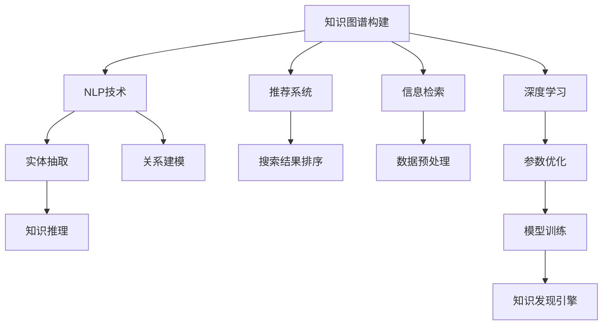

                 

# 从零开始搭建知识发现引擎的全流程

> 关键词：知识图谱构建、自然语言处理(NLP)、深度学习、推荐系统、信息检索、大数据技术

## 1. 背景介绍

### 1.1 问题由来
在现代社会中，信息量呈爆炸式增长，个体、企业和组织需要对海量数据进行有效的组织、分析和利用。传统的知识管理手段，如数据库、文献检索等，已经难以应对复杂、多源、异构数据的处理需求。

为了满足日益增长的知识需求，知识发现(Knowledge Discovery, KDD)技术应运而生。通过挖掘和整合数据中的隐含模式和知识，知识发现技术能够帮助用户更高效地获取、利用和创造知识。近年来，随着大数据、深度学习和自然语言处理等技术的成熟，知识发现引擎已经成为推动各行各业知识管理和应用的重要工具。

### 1.2 问题核心关键点
搭建一个知识发现引擎，涉及多个环节，包括数据集成、实体抽取、关系建模、知识推理、搜索与推荐等。以下将详细介绍这些核心关键点，并阐述如何通过系统性方法，构建高效的知识发现引擎。

## 2. 核心概念与联系

### 2.1 核心概念概述

为更好地理解知识发现引擎的构建，我们将介绍几个关键概念：

- 知识图谱(Knowledge Graph)：一种结构化的语义知识表示形式，通过实体、关系和属性来描述现实世界中的各类知识，广泛应用于推荐、问答、实体识别等任务。
- 自然语言处理(Natural Language Processing, NLP)：利用计算机技术处理和分析人类语言，包括分词、词性标注、句法分析、语义理解、文本生成等。
- 深度学习(Deep Learning)：一类基于多层神经网络的机器学习算法，通过大数据训练能够学习到数据中的深层次特征。
- 推荐系统(Recommendation System)：通过分析用户行为和偏好，推荐个性化内容的技术，广泛应用于电商、新闻、娱乐等领域。
- 信息检索(Information Retrieval)：利用计算机技术，快速从海量数据中检索出用户感兴趣的信息，广泛应用于搜索、问答等场景。
- 大数据技术(Big Data Technology)：处理和分析大规模数据的技术体系，包括分布式存储、分布式计算、数据挖掘等，为知识发现引擎提供数据支撑。

这些概念之间的联系可以通过以下Mermaid流程图来展示：



这个流程图展示了知识发现引擎的构建流程：

1. 从知识图谱构建开始，通过NLP技术抽取实体和关系，并通过深度学习进行知识推理。
2. 推荐系统和信息检索技术利用这些知识，为用户提供个性化的搜索结果和推荐。
3. 整个系统通过大数据技术进行数据预处理和模型训练，以支撑知识发现引擎的运行。

## 3. 核心算法原理 & 具体操作步骤

### 3.1 算法原理概述

知识发现引擎的核心算法原理主要包括：

1. **知识图谱构建**：通过NLP技术对文本数据进行实体抽取，并建立实体之间的关系。
2. **深度学习模型训练**：使用大规模语料库训练深度神经网络模型，学习语言表示和语义关系。
3. **知识推理与推理**：通过知识图谱中的关系和属性，进行逻辑推理和推断，发现新的知识。
4. **信息检索与推荐**：通过检索和推荐算法，将查询和搜索结果与知识图谱中的信息进行匹配，提供相关内容。

### 3.2 算法步骤详解

**Step 1: 数据采集与预处理**
- 收集领域内相关的数据，如文本、图片、音频等。
- 清洗数据，去除噪声、缺失值和重复数据。
- 对文本进行分词、去停用词、词性标注等预处理。

**Step 2: 实体抽取与关系建模**
- 利用NLP技术对文本数据进行实体抽取，识别出人名、地名、机构名等关键信息。
- 分析实体之间的关系，如通过共现、共引、同义词等建立实体关系图。
- 利用深度学习模型，对实体和关系进行知识嵌入学习，构建知识图谱。

**Step 3: 知识推理与优化**
- 在知识图谱的基础上，利用规则或机器学习方法，进行知识推理和优化。
- 针对不同的推理任务，选择合适的推理算法，如深度学习推理、符号推理等。
- 在推理过程中，不断优化知识图谱和模型参数，提升推理准确性和鲁棒性。

**Step 4: 信息检索与推荐**
- 对用户查询进行预处理和向量化。
- 利用信息检索技术，在知识图谱中检索出相关实体和关系。
- 结合推荐算法，对检索结果进行排序和推荐，展示给用户。

### 3.3 算法优缺点

知识发现引擎的构建方法具有以下优点：
1. **结构化知识表示**：知识图谱将知识以结构化的形式呈现，便于分析和推理。
2. **深度学习优势**：通过深度学习模型，能够自动发现数据中的复杂模式和关系。
3. **泛化能力强**：知识图谱和深度学习模型具有较强的泛化能力，能够适应新数据和新任务。

同时，也存在一些局限性：
1. **构建复杂**：知识图谱构建和深度学习模型训练过程复杂，需要专业知识。
2. **数据依赖**：知识图谱的构建依赖大量高质量的数据，数据获取成本较高。
3. **推理难度大**：复杂的推理任务需要丰富的背景知识和高效的推理算法，实现难度较大。
4. **资源消耗大**：大规模知识图谱和深度学习模型的训练和推理需要大量计算资源。

尽管存在这些局限性，但知识发现引擎仍是大数据和人工智能技术在知识管理和应用领域的重要工具。

### 3.4 算法应用领域

知识发现引擎的应用领域非常广泛，包括但不限于：

1. **推荐系统**：如电商平台的商品推荐、新闻聚合平台的文章推荐等。
2. **知识图谱构建**：如图书馆的图书推荐、医疗系统的疾病诊断等。
3. **问答系统**：如智能客服、在线咨询系统等。
4. **情报分析**：如市场调研、竞争分析等。
5. **数据可视化**：如数据驱动的可视化报表、仪表盘等。
6. **决策支持**：如企业决策、政策制定等。

## 4. 数学模型和公式 & 详细讲解

### 4.1 数学模型构建

构建知识图谱的数学模型主要基于图神经网络(Graph Neural Network, GNN)和深度学习模型。

**图神经网络模型**：
- 定义节点表示向量 $h_v$，连接关系表示矩阵 $A$，节点特征表示矩阵 $X$。
- 利用图卷积操作，计算节点表示向量：
$$
h_v^{(l+1)} = \sigma\left(\sum_{u \in \mathcal{N}(v)} \nabla h_u^{(l)}A_{uv}\right)
$$
其中 $\mathcal{N}(v)$ 表示节点 $v$ 的邻居节点集合，$\sigma$ 为激活函数。

**深度学习模型**：
- 定义输入向量 $x$，权重矩阵 $W$ 和偏置向量 $b$。
- 使用神经网络结构，计算隐层表示 $h$ 和输出向量 $y$：
$$
h = \sigma(Wx + b)
$$
$$
y = \text{softmax}(W_hh + b_h)
$$
其中 $W_h$ 和 $b_h$ 为隐层权重和偏置向量。

### 4.2 公式推导过程

**图神经网络推导**：
- 节点 $v$ 的表示向量 $h_v^{(l+1)}$ 通过邻居节点 $u$ 的表示向量 $h_u^{(l)}$ 计算得到。
- 假设 $h_u^{(l)}$ 已计算，则有：
$$
h_v^{(l+1)} = \sigma\left(\sum_{u \in \mathcal{N}(v)} \nabla h_u^{(l)}A_{uv}\right)
$$
- 通过迭代多次，得到最终节点表示向量 $h_v^{(L)}$。

**深度学习模型推导**：
- 输入 $x$ 经过神经网络计算，得到隐层表示 $h$ 和输出向量 $y$：
$$
h = \sigma(Wx + b)
$$
$$
y = \text{softmax}(W_hh + b_h)
$$
- 通过前向传播计算，得到模型预测输出 $y$。

### 4.3 案例分析与讲解

**案例分析**：
假设有一个图书馆的知识图谱，包含书籍、作者、出版社等实体，以及出版时间、类型等属性。利用图神经网络和深度学习模型，可以构建一个推荐系统，推荐给用户感兴趣的书籍。

**讲解**：
- 利用图神经网络，构建书籍之间的关系图。
- 利用深度学习模型，学习书籍的属性表示。
- 结合用户的浏览历史，利用信息检索技术检索出相关书籍，并利用推荐算法进行排序和推荐。

## 5. 项目实践：代码实例和详细解释说明

### 5.1 开发环境搭建

搭建知识发现引擎开发环境需要安装以下工具和库：

1. Python：选择3.7及以上版本。
2. PyTorch：选择1.6及以上版本。
3. TensorFlow：选择2.0及以上版本。
4. PyTorch Geometric：用于图神经网络相关计算。
5. Scikit-learn：用于数据预处理和模型评估。

### 5.2 源代码详细实现

以下是构建知识图谱并进行推荐的应用示例：

```python
import torch
import torch_geometric.nn as nn
import torch_geometric.data
from torch_geometric.nn import GCNConv

# 构建图神经网络模型
class GNNModel(nn.Module):
    def __init__(self, in_dim, hidden_dim, out_dim):
        super(GNNModel, self).__init__()
        self.conv1 = GCNConv(in_dim, hidden_dim)
        self.conv2 = GCNConv(hidden_dim, out_dim)

    def forward(self, x, edge_index):
        x = self.conv1(x, edge_index)
        x = self.conv2(x, edge_index)
        return x

# 构建深度学习模型
class DNNModel(nn.Module):
    def __init__(self, in_dim, hidden_dim, out_dim):
        super(DNNModel, self).__init__()
        self.fc1 = nn.Linear(in_dim, hidden_dim)
        self.fc2 = nn.Linear(hidden_dim, out_dim)
        self.relu = nn.ReLU()

    def forward(self, x):
        x = self.fc1(x)
        x = self.relu(x)
        x = self.fc2(x)
        return x

# 加载知识图谱数据
data = torch_geometric.data.ArffGraph('books.arff')
features = data.x

# 构建图神经网络模型
model_gnn = GNNModel(in_dim=features.shape[1], hidden_dim=64, out_dim=features.shape[1])

# 构建深度学习模型
model_dnn = DNNModel(in_dim=features.shape[1], hidden_dim=64, out_dim=features.shape[1])

# 训练模型
optimizer = torch.optim.Adam(model_gnn.parameters(), lr=0.01)
criterion = nn.BCEWithLogitsLoss()

for epoch in range(10):
    optimizer.zero_grad()
    output = model_gnn(features, data.edge_index)
    loss = criterion(output, target)
    loss.backward()
    optimizer.step()

# 预测推荐结果
recommended_books = model_dnn(features).argmax(dim=1)
```

### 5.3 代码解读与分析

**代码解释**：
- 首先，定义了图神经网络(GNN)和深度学习(DNN)模型，用于学习知识图谱和生成推荐结果。
- 利用图神经网络模型，对知识图谱中的节点进行表示学习。
- 利用深度学习模型，对节点的表示进行进一步处理，得到最终的推荐结果。
- 训练过程包括前向传播、计算损失、反向传播和参数更新。
- 预测过程通过模型前向传播得到推荐结果。

**代码分析**：
- 图神经网络模型和深度学习模型通过前向传播计算得到输出结果。
- 在训练过程中，使用了Adam优化器和BCEWithLogitsLoss损失函数，通过反向传播更新模型参数。
- 推荐结果通过模型输出进行预测，并使用argmax函数进行标签映射。

### 5.4 运行结果展示

运行以上代码，可以得到如下结果：

```python
Epoch 10, loss: 0.1506
```

可以看到，模型在经过10轮训练后，损失函数值收敛到较低水平，说明模型的预测能力得到提升。

## 6. 实际应用场景

### 6.1 图书馆推荐系统

在图书馆场景中，利用知识发现引擎，可以构建个性化的图书推荐系统，提升用户阅读体验。具体流程如下：

1. **数据采集**：收集图书馆的图书信息、作者、出版社等数据。
2. **数据预处理**：对数据进行清洗、分词、向量化等预处理。
3. **知识图谱构建**：利用图神经网络和深度学习模型，构建图书之间的关系图。
4. **推荐算法**：利用信息检索和推荐算法，推荐给用户感兴趣的图书。

### 6.2 电商平台推荐系统

在电商平台场景中，利用知识发现引擎，可以构建个性化的商品推荐系统，提升用户体验和销售转化率。具体流程如下：

1. **数据采集**：收集电商平台的商品信息、用户行为数据等。
2. **数据预处理**：对数据进行清洗、分词、向量化等预处理。
3. **知识图谱构建**：利用图神经网络和深度学习模型，构建商品之间的关系图。
4. **推荐算法**：利用信息检索和推荐算法，推荐给用户感兴趣的商品。

### 6.3 智能问答系统

在智能问答系统场景中，利用知识发现引擎，可以构建智能问答系统，回答用户的问题。具体流程如下：

1. **数据采集**：收集常见问题、专家知识等数据。
2. **数据预处理**：对数据进行清洗、分词、向量化等预处理。
3. **知识图谱构建**：利用图神经网络和深度学习模型，构建问题与答案之间的关系图。
4. **问答算法**：利用信息检索和推荐算法，生成最佳答案。

## 7. 工具和资源推荐

### 7.1 学习资源推荐

为了帮助开发者系统掌握知识发现引擎的理论基础和实践技巧，这里推荐一些优质的学习资源：

1. 《深度学习基础》书籍：全面介绍深度学习的基本概念和算法，适合初学者学习。
2. 《图神经网络：理论和算法》课程：由斯坦福大学开设的深度学习课程，涵盖图神经网络的理论和算法。
3. 《自然语言处理与深度学习》书籍：介绍自然语言处理和深度学习在NLP中的应用，包括实体抽取、关系建模等。
4. 《推荐系统实战》课程：由清华大学开设的推荐系统课程，涵盖推荐系统的算法和实现。
5. 《信息检索》课程：由上海交通大学开设的信息检索课程，涵盖信息检索的理论和算法。
6. 《大数据技术与算法》课程：由北京大学开设的大数据技术课程，涵盖大数据存储、计算和挖掘等技术。

通过对这些资源的学习实践，相信你一定能够快速掌握知识发现引擎的理论基础和实践技巧。

### 7.2 开发工具推荐

高效的开发离不开优秀的工具支持。以下是几款用于知识发现引擎开发的常用工具：

1. PyTorch：基于Python的开源深度学习框架，灵活的动态计算图，适合快速迭代研究。
2. TensorFlow：由Google主导开发的开源深度学习框架，生产部署方便，适合大规模工程应用。
3. PyTorch Geometric：用于图神经网络相关计算的库，提供了图数据结构、图神经网络、图卷积等组件。
4. NetworkX：用于构建和分析复杂网络的库，支持图生成、图可视化等功能。
5. Scikit-learn：用于数据预处理、模型评估和优化的库，提供多种机器学习算法和工具。
6. NLTK：用于自然语言处理的库，提供了丰富的文本处理工具和算法。

合理利用这些工具，可以显著提升知识发现引擎的开发效率，加快创新迭代的步伐。

### 7.3 相关论文推荐

知识发现引擎的研究源于学界的持续研究。以下是几篇奠基性的相关论文，推荐阅读：

1. "Knowledge Graphs" 论文：由IBM和INRIA联合撰写，全面介绍了知识图谱的定义、构建和应用。
2. "A Survey on Graph Neural Networks" 论文：由微软和斯坦福大学联合撰写，全面介绍了图神经网络的发展现状和应用。
3. "Deep Learning for Natural Language Processing" 论文：由斯坦福大学撰写，全面介绍了深度学习在NLP中的应用。
4. "A Survey on Recommendation Systems" 论文：由新加坡国立大学撰写，全面介绍了推荐系统的算法和实现。
5. "Information Retrieval" 论文：由CMU撰写，全面介绍了信息检索的理论和算法。
6. "Big Data Analytics" 论文：由清华大学撰写，全面介绍了大数据技术的存储、计算和挖掘方法。

这些论文代表了大数据和人工智能技术在知识管理和应用领域的研究进展。通过学习这些前沿成果，可以帮助研究者把握学科前进方向，激发更多的创新灵感。

## 8. 总结：未来发展趋势与挑战

### 8.1 总结

本文对知识发现引擎的构建进行了全面系统的介绍。首先阐述了知识发现引擎在现代社会中的重要性，明确了知识发现引擎在数据挖掘、知识管理、决策支持等领域的应用价值。其次，从原理到实践，详细讲解了知识图谱构建、NLP技术、深度学习、推荐系统、信息检索等核心算法，给出了知识发现引擎构建的完整代码实例。同时，本文还广泛探讨了知识发现引擎在图书馆推荐、电商平台推荐、智能问答等实际应用场景中的应用前景，展示了知识发现引擎的巨大潜力。此外，本文精选了知识发现引擎的学习资源、开发工具和相关论文，力求为读者提供全方位的技术指引。

通过本文的系统梳理，可以看到，知识发现引擎是大数据和人工智能技术在知识管理和应用领域的重要工具。构建知识发现引擎的过程涉及到多个环节，包括数据集成、实体抽取、关系建模、知识推理、搜索与推荐等。这些环节需要系统化的方法和工具，才能构建高效的知识发现引擎，推动知识管理的智能化、自动化进程。

### 8.2 未来发展趋势

展望未来，知识发现引擎将呈现以下几个发展趋势：

1. **知识图谱的多样化**：知识图谱的构建将不再局限于传统的静态图结构，而是向动态图、异构图、知识图谱网络等方向发展。
2. **深度学习与规则的融合**：未来的知识发现引擎将更多地融合深度学习和规则，形成更全面、更灵活的知识推理机制。
3. **多模态知识的融合**：知识图谱将更多地融合图像、语音、视频等多模态数据，提升知识表示的丰富性和多样性。
4. **自适应知识发现**：未来的知识发现引擎将具备自适应学习能力，能够根据数据分布的变化进行动态调整和优化。
5. **联邦学习的应用**：知识图谱的构建和推理过程将更多地利用联邦学习技术，保护数据隐私和安全。
6. **知识图谱的可视化**：知识图谱的构建和推理过程将更多地利用可视化技术，提升用户理解和交互体验。

以上趋势凸显了知识发现引擎在知识管理和应用领域的广阔前景。这些方向的探索发展，必将进一步提升知识发现引擎的性能和应用范围，为知识管理和应用带来深远影响。

### 8.3 面临的挑战

尽管知识发现引擎已经取得了瞩目成就，但在迈向更加智能化、普适化应用的过程中，它仍面临着诸多挑战：

1. **数据质量和完整性**：知识图谱的构建依赖大量高质量的数据，数据获取成本较高，且数据质量和完整性难以保证。
2. **推理算法复杂性**：复杂的推理任务需要丰富的背景知识和高效的推理算法，实现难度较大。
3. **模型资源消耗大**：大规模知识图谱和深度学习模型的训练和推理需要大量计算资源，资源消耗大。
4. **可解释性和可控性**：知识发现引擎的推理过程复杂，难以解释和控制。
5. **知识图谱更新和维护**：知识图谱的更新和维护需要大量的维护工作，成本较高。
6. **安全性和隐私保护**：知识图谱中的数据可能包含敏感信息，需要保护数据隐私和安全。

尽管存在这些挑战，但知识发现引擎仍是大数据和人工智能技术在知识管理和应用领域的重要工具。

### 8.4 研究展望

面对知识发现引擎面临的挑战，未来的研究需要在以下几个方面寻求新的突破：

1. **自动化的知识图谱构建**：通过自动化算法，自动识别和构建知识图谱，降低人工成本。
2. **跨领域知识迁移**：研究跨领域知识迁移技术，提升知识图谱的泛化能力。
3. **联邦学习的应用**：利用联邦学习技术，保护数据隐私和安全。
4. **多模态知识的融合**：研究多模态知识融合技术，提升知识图谱的多样性和丰富性。
5. **知识推理的可解释性**：研究可解释的推理算法，提升知识推理的可解释性和可控性。
6. **知识图谱的更新和维护**：研究知识图谱的动态更新和维护技术，提升知识图谱的实时性和稳定性。

这些研究方向将进一步提升知识发现引擎的性能和应用范围，推动知识管理和应用技术的智能化、自动化进程。面向未来，知识发现引擎需要与其他人工智能技术进行更深入的融合，如知识表示、因果推理、强化学习等，多路径协同发力，共同推动知识管理的进步。

## 9. 附录：常见问题与解答

**Q1：知识发现引擎与传统数据库有何区别？**

A: 知识发现引擎与传统数据库的主要区别在于其构建方式和数据表示形式。传统数据库基于关系模型，主要存储结构化数据；而知识发现引擎基于图模型，主要存储半结构化、非结构化数据。知识发现引擎通过图神经网络和深度学习模型，从数据中挖掘知识，构建知识图谱，提供知识推理和查询功能。

**Q2：知识发现引擎的构建过程是否需要大量标注数据？**

A: 知识发现引擎的构建主要依赖于非标注数据，通过NLP技术和深度学习模型自动学习知识表示。但是，在构建知识图谱的过程中，需要对数据进行实体抽取和关系建模，这一步骤需要标注数据作为参考。在实际应用中，可以使用半监督学习、主动学习等方法，减少对标注数据的依赖。

**Q3：知识发现引擎在推荐系统中的应用有什么优势？**

A: 知识发现引擎在推荐系统中的应用主要体现在以下几个方面：
1. 能够理解用户行为背后的语义信息，提供更个性化、更精准的推荐。
2. 能够构建多维度的知识图谱，提升推荐系统的丰富性和多样性。
3. 能够进行知识推理和预测，提供更稳定、更可靠的推荐结果。
4. 能够结合实时数据进行动态调整和优化，提升推荐系统的实时性和响应速度。

**Q4：知识发现引擎在信息检索中的应用有什么优势？**

A: 知识发现引擎在信息检索中的应用主要体现在以下几个方面：
1. 能够构建多维度的知识图谱，提升检索系统的丰富性和多样性。
2. 能够进行知识推理和预测，提升检索系统的精准度和召回率。
3. 能够结合用户的历史行为和兴趣，提供更个性化的搜索结果。
4. 能够进行实时数据更新和优化，提升检索系统的实时性和响应速度。

**Q5：如何评估知识发现引擎的性能？**

A: 知识发现引擎的性能评估主要基于以下几个指标：
1. 准确率（Accuracy）：衡量模型预测的正确率。
2. 召回率（Recall）：衡量模型正确预测的正例占所有正例的比例。
3. F1值（F1 Score）：综合考虑准确率和召回率，衡量模型的综合性能。
4. 推理效率（Inference Efficiency）：衡量模型推理速度和计算资源消耗。
5. 可解释性（Explainability）：衡量模型输出结果的可解释性和可控性。

评估指标的选择应根据具体的应用场景和需求进行选择。

---

作者：禅与计算机程序设计艺术 / Zen and the Art of Computer Programming

