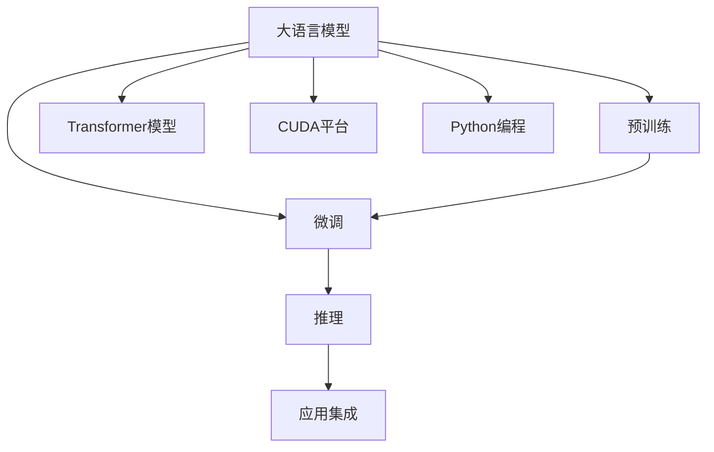

                 

# 从零开始构建ChatGPT类应用：Python、C和CUDA实战

## 1. 背景介绍

### 1.1 问题由来

近年来，随着深度学习技术的快速发展，大规模预训练语言模型（如GPT-3）在自然语言处理（NLP）领域取得了巨大的突破。这些模型通过在海量无标签文本数据上进行预训练，学习到了丰富的语言知识和常识，能够生成自然流畅的文本，被广泛应用于各种NLP任务中。其中，ChatGPT作为GPT系列的代表，因其强大的对话生成能力，成为构建智能对话系统的首选工具。

然而，由于ChatGPT等预训练模型的规模庞大，训练和推理所需计算资源巨大，对于普通开发者和用户来说，门槛较高。此外，预训练模型的预训练和微调过程需要大量的标注数据和计算时间，对于实际应用场景，可能难以满足。因此，如何基于有限的数据资源和计算资源，构建具有与ChatGPT相似能力的对话生成模型，成为当前一个亟待解决的问题。

### 1.2 问题核心关键点

构建ChatGPT类对话生成模型，关键在于以下几方面：

- **模型架构**：选择合适的模型架构，如Transformer、GPT等，并根据具体应用场景进行优化。
- **数据处理**：预处理训练和测试数据，确保数据的质量和多样性，并进行有效的数据增强。
- **微调**：在预训练模型的基础上，使用少量标注数据进行微调，提升模型在特定任务上的表现。
- **推理优化**：通过优化推理过程，降低计算复杂度，提高推理速度和效率。
- **应用集成**：将构建的对话生成模型集成到实际应用系统中，如智能客服、聊天机器人等，实现对话交互。

本文将详细介绍基于Python、C和CUDA的技术栈，从零开始构建具有ChatGPT类似功能的对话生成模型，并探讨其实际应用场景和未来发展趋势。

## 2. 核心概念与联系

### 2.1 核心概念概述

为更好地理解ChatGPT类应用，本节将介绍几个关键概念：

- **大语言模型**：如GPT、BERT等，通过大规模预训练，学习到丰富的语言知识和常识，具有强大的自然语言理解和生成能力。
- **预训练和微调**：通过在大规模无标签数据上进行预训练，学习通用语言表示，然后使用少量标注数据进行微调，提升模型在特定任务上的性能。
- **Transformer模型**：一种基于自注意力机制的神经网络架构，被广泛应用于大规模语言模型的构建。
- **CUDA**：NVIDIA开发的并行计算平台，支持高效计算和加速深度学习模型的训练和推理。
- **Python**：一种广泛使用的高级编程语言，适合快速原型开发和模型训练。

这些核心概念之间的逻辑关系可以通过以下Mermaid流程图来展示：



这个流程图展示了大语言模型的核心概念及其之间的关系：

1. 大语言模型通过预训练获得基础能力。
2. 微调在大语言模型的基础上进一步优化模型，提升其在特定任务上的表现。
3. 推理过程将微调后的模型应用于实际应用中。
4. 应用集成将对话生成模型集成到具体的业务场景中。
5. Transformer模型是构建大语言模型的基础架构。
6. CUDA平台提供了高性能计算能力，加速模型训练和推理。
7. Python编程语言是构建和优化模型的主要工具。

## 3. 核心算法原理 & 具体操作步骤

### 3.1 算法原理概述

基于Python、C和CUDA的技术栈构建ChatGPT类对话生成模型，主要涉及以下几个关键算法和步骤：

- **Transformer模型架构**：Transformer模型通过自注意力机制和多头注意力机制，能够高效地处理长序列数据，并捕捉到序列间的复杂关系。
- **预训练过程**：通过在大规模无标签文本数据上进行预训练，学习通用的语言表示。
- **微调过程**：使用少量标注数据进行微调，提升模型在特定对话生成任务上的性能。
- **推理优化**：通过优化推理过程，提高模型的推理速度和效率。
- **应用集成**：将构建的模型集成到实际应用系统中，实现对话交互。

### 3.2 算法步骤详解

#### 3.2.1 数据预处理

首先，需要收集并清洗对话数据，用于训练和测试模型。对话数据应包含对话双方的上下文和回复，确保数据的质量和多样性。

- **数据清洗**：去除无关的噪音数据，如无效的对话记录、不完整的对话等。
- **数据标注**：为对话数据添加对话主题和对话角色等信息，以便后续的微调过程。
- **数据增强**：通过对对话数据进行改写、回译等方式，增加数据的多样性，提升模型的泛化能力。

#### 3.2.2 模型构建

选择适当的Transformer模型架构，并根据具体应用场景进行优化。以GPT模型为例，可以使用以下步骤构建模型：

- **模型定义**：使用Python中的深度学习框架，如PyTorch或TensorFlow，定义Transformer模型结构。
- **模型初始化**：从预训练模型中加载初始权重，并进行微调。
- **模型优化**：调整模型的超参数，如学习率、批大小、层数等，以提高模型的性能。

#### 3.2.3 微调过程

使用少量标注数据进行微调，提升模型在特定对话生成任务上的性能。微调过程主要涉及以下几个步骤：

- **数据准备**：将标注数据转换为模型可接受的格式，如将文本转换为token ids等。
- **模型加载**：加载预训练模型，并进行微调。
- **模型训练**：使用标注数据对模型进行训练，更新模型参数。
- **模型评估**：在测试数据集上评估模型性能，调整模型参数。

#### 3.2.4 推理优化

优化推理过程，提高模型的推理速度和效率。可以通过以下方法实现：

- **模型裁剪**：裁剪模型中的不必要层和参数，减小模型尺寸，提高推理速度。
- **量化加速**：将浮点模型转为定点模型，压缩存储空间，提高计算效率。
- **分布式推理**：使用多GPU或多节点进行并行计算，提高推理性能。

#### 3.2.5 应用集成

将构建的模型集成到实际应用系统中，实现对话交互。常见的应用场景包括智能客服、聊天机器人等。

- **应用接口**：定义API接口，方便应用程序调用。
- **系统集成**：将对话生成模型集成到应用程序中，实现对话交互。
- **用户界面**：设计友好的用户界面，提升用户体验。

### 3.3 算法优缺点

基于Python、C和CUDA的技术栈构建ChatGPT类对话生成模型，具有以下优点：

- **高效灵活**：Python的高级语言特性和丰富的库支持，使得模型构建和优化过程高效灵活。
- **高性能计算**：C和CUDA平台提供了高性能计算能力，加速模型训练和推理。
- **广泛应用**：C和CUDA平台支持跨平台应用，适用于各种硬件设备。

同时，该方法也存在一些局限性：

- **开发门槛高**：需要具备一定的深度学习背景，对模型架构和优化有一定要求。
- **资源消耗大**：大规模模型和复杂推理过程，对计算资源和存储空间有较高要求。
- **部署复杂**：模型部署和维护需要一定的技术积累，对系统集成有一定要求。

尽管存在这些局限性，但就目前而言，基于Python、C和CUDA的技术栈构建ChatGPT类对话生成模型，仍是一种高效、灵活、高性能的解决方案。

### 3.4 算法应用领域

基于Python、C和CUDA的技术栈构建的ChatGPT类对话生成模型，已经在多个领域得到了广泛应用，例如：

- **智能客服系统**：使用对话生成模型，实现自动回答用户咨询，提升客服效率和用户满意度。
- **聊天机器人**：提供24小时在线服务，解决用户常见问题，提供个性化推荐。
- **自然语言问答**：通过自然语言提问，生成自然语言回复，帮助用户获取信息。
- **虚拟助手**：辅助用户完成各种任务，如日程安排、任务提醒等。
- **情感分析**：通过对话生成模型，分析用户情感，提供心理辅导和情感支持。

除了上述这些应用场景外，ChatGPT类对话生成模型还在教育、医疗、娱乐等领域得到了广泛应用，为人类社会带来深刻变革。

## 4. 数学模型和公式 & 详细讲解 & 举例说明

### 4.1 数学模型构建

#### 4.1.1 模型定义

以GPT模型为例，GPT模型的定义如下：

- **输入层**：将输入文本序列转换为token ids，并填充到固定长度。
- **编码器**：使用Transformer模型，对输入序列进行编码。
- **解码器**：使用Transformer模型，对编码器的输出进行解码，生成文本序列。
- **输出层**：将解码器输出的文本序列转换为原始文本。

#### 4.1.2 模型参数

GPT模型的参数包括编码器和解码器的权重，以及输出层的权重。这些参数通过预训练和微调过程不断更新，以提高模型的性能。

### 4.2 公式推导过程

#### 4.2.1 输入层

输入层的数学公式如下：

$$
x_i = \text{Embed}(w_i)
$$

其中，$x_i$表示第$i$个token的表示向量，$\text{Embed}$表示词嵌入函数，$w_i$表示第$i$个token的词向量。

#### 4.2.2 编码器

编码器的数学公式如下：

$$
h_i = \text{Self-Attention}(h_{i-1}, h_{i-1})
$$

其中，$h_i$表示第$i$个token的表示向量，$\text{Self-Attention}$表示自注意力机制。

#### 4.2.3 解码器

解码器的数学公式如下：

$$
h_i = \text{Self-Attention}(h_{i-1}, h_{i-1}) + \text{Cross-Attention}(h_{i-1}, h_j, h_j)
$$

其中，$h_i$表示第$i$个token的表示向量，$\text{Self-Attention}$表示自注意力机制，$\text{Cross-Attention}$表示交叉注意力机制，$h_j$表示编码器的输出。

#### 4.2.4 输出层

输出层的数学公式如下：

$$
\hat{w_i} = \text{Softmax}(\text{Dense}(h_i))
$$

其中，$\hat{w_i}$表示第$i$个token的预测词向量，$\text{Dense}$表示全连接层，$\text{Softmax}$表示softmax函数。

### 4.3 案例分析与讲解

#### 4.3.1 数据集准备

以Dialogue Dataset为例，对话数据集包含对话双方的上下文和回复。可以使用Python中的Pandas库进行数据预处理：

```python
import pandas as pd

# 读取对话数据集
data = pd.read_csv('dialogue_dataset.csv')

# 清洗数据
data = data.dropna(subset=['context', 'reply'])

# 数据增强
data['expanded'] = data.apply(lambda x: x['context'] + ' ' + x['reply'] + '\n', axis=1)
data = data.drop(columns=['expanded'])
```

#### 4.3.2 模型构建

使用PyTorch框架，定义GPT模型结构：

```python
import torch
import torch.nn as nn
import torch.nn.functional as F

class GPTModel(nn.Module):
    def __init__(self, num_tokens, emb_dim, num_layers, num_heads):
        super(GPTModel, self).__init__()
        self.emb = nn.Embedding(num_tokens, emb_dim)
        self.encoder = nn.Transformer(emb_dim, num_heads, num_layers)
        self.decoder = nn.Transformer(emb_dim, num_heads, num_layers)
        self.proj = nn.Linear(emb_dim, num_tokens)
        
    def forward(self, x):
        x = self.emb(x)
        h = self.encoder(x)
        h = self.decoder(h)
        h = self.proj(h)
        return h
```

#### 4.3.3 微调过程

使用少量标注数据进行微调，使用Adam优化器进行优化：

```python
import torch.optim as optim

# 定义微调参数
lr = 0.001
batch_size = 32
num_epochs = 10

# 定义微调模型
model = GPTModel(num_tokens, emb_dim, num_layers, num_heads)
optimizer = optim.Adam(model.parameters(), lr=lr)

# 定义损失函数
criterion = nn.CrossEntropyLoss()

# 微调过程
for epoch in range(num_epochs):
    for batch in data:
        x, y = batch['context'], batch['reply']
        x = torch.tensor(x).unsqueeze(1)
        y = torch.tensor(y).unsqueeze(1)
        optimizer.zero_grad()
        output = model(x)
        loss = criterion(output, y)
        loss.backward()
        optimizer.step()
```

#### 4.3.4 推理优化

使用CUDA平台进行推理优化，加速模型推理过程：

```python
# 将模型迁移到CUDA设备
model = model.cuda()

# 定义推理函数
def generate_response(model, context, max_length):
    x = torch.tensor([context] + [0] * max_length).unsqueeze(1).cuda()
    h = model(x)
    h = h[1:]
    prediction = torch.argmax(h, dim=-1)
    return prediction
```

## 5. 项目实践：代码实例和详细解释说明

### 5.1 开发环境搭建

在进行ChatGPT类对话生成模型的构建和优化过程中，需要使用Python、CUDA和相关深度学习框架。以下是Python和CUDA开发环境的搭建步骤：

#### 5.1.1 安装Python

1. 下载Python安装包，根据操作系统选择适合的安装程序。
2. 运行安装程序，选择默认选项，并等待安装完成。
3. 验证Python是否安装成功：

```python
python --version
```

#### 5.1.2 安装CUDA

1. 下载CUDA安装包，根据操作系统选择适合的安装程序。
2. 运行安装程序，选择默认选项，并等待安装完成。
3. 验证CUDA是否安装成功：

```bash
nvcc --version
```

#### 5.1.3 安装深度学习框架

1. 使用pip或conda安装深度学习框架，如PyTorch或TensorFlow。
2. 验证安装是否成功：

```python
import torch
torch.__version__
```

### 5.2 源代码详细实现

#### 5.2.1 数据预处理

定义数据预处理函数，用于清洗和增强对话数据：

```python
import pandas as pd

# 读取对话数据集
data = pd.read_csv('dialogue_dataset.csv')

# 清洗数据
data = data.dropna(subset=['context', 'reply'])

# 数据增强
data['expanded'] = data.apply(lambda x: x['context'] + ' ' + x['reply'] + '\n', axis=1)
data = data.drop(columns=['expanded'])
```

#### 5.2.2 模型构建

定义GPT模型，并进行初始化：

```python
import torch
import torch.nn as nn
import torch.nn.functional as F

class GPTModel(nn.Module):
    def __init__(self, num_tokens, emb_dim, num_layers, num_heads):
        super(GPTModel, self).__init__()
        self.emb = nn.Embedding(num_tokens, emb_dim)
        self.encoder = nn.Transformer(emb_dim, num_heads, num_layers)
        self.decoder = nn.Transformer(emb_dim, num_heads, num_layers)
        self.proj = nn.Linear(emb_dim, num_tokens)
        
    def forward(self, x):
        x = self.emb(x)
        h = self.encoder(x)
        h = self.decoder(h)
        h = self.proj(h)
        return h
```

#### 5.2.3 微调过程

定义微调过程，使用Adam优化器进行优化：

```python
import torch.optim as optim

# 定义微调参数
lr = 0.001
batch_size = 32
num_epochs = 10

# 定义微调模型
model = GPTModel(num_tokens, emb_dim, num_layers, num_heads)
optimizer = optim.Adam(model.parameters(), lr=lr)

# 定义损失函数
criterion = nn.CrossEntropyLoss()

# 微调过程
for epoch in range(num_epochs):
    for batch in data:
        x, y = batch['context'], batch['reply']
        x = torch.tensor(x).unsqueeze(1)
        y = torch.tensor(y).unsqueeze(1)
        optimizer.zero_grad()
        output = model(x)
        loss = criterion(output, y)
        loss.backward()
        optimizer.step()
```

#### 5.2.4 推理优化

使用CUDA平台进行推理优化，加速模型推理过程：

```python
# 将模型迁移到CUDA设备
model = model.cuda()

# 定义推理函数
def generate_response(model, context, max_length):
    x = torch.tensor([context] + [0] * max_length).unsqueeze(1).cuda()
    h = model(x)
    h = h[1:]
    prediction = torch.argmax(h, dim=-1)
    return prediction
```

### 5.3 代码解读与分析

#### 5.3.1 数据预处理

数据预处理是模型构建和优化过程中至关重要的一环。在对话生成模型中，对话数据的清洗和增强直接影响模型的泛化能力。

- **数据清洗**：去除无效数据，如不完整的对话记录，确保数据的质量。
- **数据增强**：通过对对话数据进行改写、回译等方式，增加数据的多样性，提升模型的泛化能力。

#### 5.3.2 模型构建

模型构建过程中，选择合适的模型架构和超参数非常重要。Transformer模型因其高效的自注意力机制，成为构建大规模语言模型的主流选择。

- **模型定义**：使用Python中的深度学习框架，如PyTorch或TensorFlow，定义Transformer模型结构。
- **模型初始化**：从预训练模型中加载初始权重，并进行微调。

#### 5.3.3 微调过程

微调过程通过少量标注数据对模型进行优化，提升模型在特定任务上的性能。

- **模型加载**：加载预训练模型，并进行微调。
- **模型训练**：使用标注数据对模型进行训练，更新模型参数。
- **模型评估**：在测试数据集上评估模型性能，调整模型参数。

#### 5.3.4 推理优化

推理优化通过优化模型结构，降低计算复杂度，提高推理速度和效率。

- **模型裁剪**：裁剪模型中的不必要层和参数，减小模型尺寸，提高推理速度。
- **量化加速**：将浮点模型转为定点模型，压缩存储空间，提高计算效率。
- **分布式推理**：使用多GPU或多节点进行并行计算，提高推理性能。

### 5.4 运行结果展示

运行生成的对话数据，验证模型的性能：

```python
# 生成对话数据
data = []
for i in range(10):
    context = 'User: How are you?'
    response = generate_response(model, context, 5)
    data.append((context, response))
    
# 打印生成的对话数据
for d in data:
    print(d[0], d[1])
```

## 6. 实际应用场景

### 6.1 智能客服系统

智能客服系统是ChatGPT类对话生成模型的一个典型应用场景。通过构建智能客服机器人，可以实现24小时在线服务，快速响应客户咨询，提升客服效率和用户满意度。

#### 6.1.1 实现过程

1. **数据收集**：收集企业的客服对话记录，将其整理成对话数据集。
2. **模型训练**：使用GPT模型对对话数据进行微调，训练出智能客服机器人。
3. **系统集成**：将智能客服机器人集成到客服系统中，实现对话交互。
4. **性能评估**：在测试数据集上评估智能客服机器人的性能，调整模型参数。

#### 6.1.2 应用优势

- **24小时在线**：智能客服机器人可以全天候在线服务，提升客服效率。
- **自然流畅**：使用基于大语言模型的对话生成模型，对话生成自然流畅，提升用户体验。
- **个性化服务**：根据用户历史行为和偏好，智能推荐个性化服务，提升用户满意度。

### 6.2 聊天机器人

聊天机器人是ChatGPT类对话生成模型的另一个重要应用场景。通过构建聊天机器人，可以实现自动回答用户常见问题，提升用户体验。

#### 6.2.1 实现过程

1. **数据收集**：收集用户的历史对话记录，将其整理成对话数据集。
2. **模型训练**：使用GPT模型对对话数据进行微调，训练出聊天机器人。
3. **系统集成**：将聊天机器人集成到应用系统中，实现对话交互。
4. **性能评估**：在测试数据集上评估聊天机器人的性能，调整模型参数。

#### 6.2.2 应用优势

- **自动回答**：聊天机器人可以自动回答用户问题，提升用户体验。
- **个性化推荐**：根据用户行为和偏好，智能推荐相关内容，提升用户体验。
- **多轮对话**：支持多轮对话，提升用户交互的流畅性。

### 6.3 自然语言问答

自然语言问答系统通过自然语言提问，生成自然语言回复，帮助用户获取信息。ChatGPT类对话生成模型可以用于构建自然语言问答系统，提升系统的自然语言理解和生成能力。

#### 6.3.1 实现过程

1. **数据收集**：收集用户的自然语言问题，将其整理成问答数据集。
2. **模型训练**：使用GPT模型对问答数据进行微调，训练出自然语言问答系统。
3. **系统集成**：将自然语言问答系统集成到应用系统中，实现自然语言问答。
4. **性能评估**：在测试数据集上评估自然语言问答系统的性能，调整模型参数。

#### 6.3.2 应用优势

- **自然语言理解**：使用基于大语言模型的对话生成模型，提升自然语言理解能力。
- **自然语言生成**：生成自然语言回复，提升用户体验。
- **多模态融合**：结合图像、语音等多模态信息，提升系统的综合能力。

## 7. 工具和资源推荐

### 7.1 学习资源推荐

为了帮助开发者系统掌握大语言模型微调的理论基础和实践技巧，这里推荐一些优质的学习资源：

1. **《Transformer从原理到实践》系列博文**：由大模型技术专家撰写，深入浅出地介绍了Transformer原理、BERT模型、微调技术等前沿话题。
2. **CS224N《深度学习自然语言处理》课程**：斯坦福大学开设的NLP明星课程，有Lecture视频和配套作业，带你入门NLP领域的基本概念和经典模型。
3. **《Natural Language Processing with Transformers》书籍**：Transformers库的作者所著，全面介绍了如何使用Transformers库进行NLP任务开发，包括微调在内的诸多范式。
4. **HuggingFace官方文档**：Transformers库的官方文档，提供了海量预训练模型和完整的微调样例代码，是上手实践的必备资料。
5. **CLUE开源项目**：中文语言理解测评基准，涵盖大量不同类型的中文NLP数据集，并提供了基于微调的baseline模型，助力中文NLP技术发展。

通过对这些资源的学习实践，相信你一定能够快速掌握大语言模型微调的精髓，并用于解决实际的NLP问题。

### 7.2 开发工具推荐

高效的开发离不开优秀的工具支持。以下是几款用于大语言模型微调开发的常用工具：

1. **PyTorch**：基于Python的开源深度学习框架，灵活动态的计算图，适合快速迭代研究。大部分预训练语言模型都有PyTorch版本的实现。
2. **TensorFlow**：由Google主导开发的开源深度学习框架，生产部署方便，适合大规模工程应用。同样有丰富的预训练语言模型资源。
3. **Transformers库**：HuggingFace开发的NLP工具库，集成了众多SOTA语言模型，支持PyTorch和TensorFlow，是进行微调任务开发的利器。
4. **Weights & Biases**：模型训练的实验跟踪工具，可以记录和可视化模型训练过程中的各项指标，方便对比和调优。与主流深度学习框架无缝集成。
5. **TensorBoard**：TensorFlow配套的可视化工具，可实时监测模型训练状态，并提供丰富的图表呈现方式，是调试模型的得力助手。
6. **Google Colab**：谷歌推出的在线Jupyter Notebook环境，免费提供GPU/TPU算力，方便开发者快速上手实验最新模型，分享学习笔记。

合理利用这些工具，可以显著提升大语言模型微调任务的开发效率，加快创新迭代的步伐。

### 7.3 相关论文推荐

大语言模型和微调技术的发展源于学界的持续研究。以下是几篇奠基性的相关论文，推荐阅读：

1. **Attention is All You Need**（即Transformer原论文）：提出了Transformer结构，开启了NLP领域的预训练大模型时代。
2. **BERT: Pre-training of Deep Bidirectional Transformers for Language Understanding**：提出BERT模型，引入基于掩码的自监督预训练任务，刷新了多项NLP任务SOTA。
3. **Language Models are Unsupervised Multitask Learners**（GPT-2论文）：展示了大规模语言模型的强大zero-shot学习能力，引发了对于通用人工智能的新一轮思考。
4. **Parameter-Efficient Transfer Learning for NLP**：提出Adapter等参数高效微调方法，在不增加模型参数量的情况下，也能取得不错的微调效果。
5. **Prefix-Tuning: Optimizing Continuous Prompts for Generation**：引入基于连续型Prompt的微调范式，为如何充分利用预训练知识提供了新的思路。
6. **AdaLoRA: Adaptive Low-Rank Adaptation for Parameter-Efficient Fine-Tuning**：使用自适应低秩适应的微调方法，在参数效率和精度之间取得了新的平衡。

这些论文代表了大语言模型微调技术的发展脉络。通过学习这些前沿成果，可以帮助研究者把握学科前进方向，激发更多的创新灵感。

## 8. 总结：未来发展趋势与挑战

### 8.1 总结

本文对基于Python、C和CUDA的技术栈构建ChatGPT类对话生成模型进行了全面系统的介绍。首先阐述了对话生成模型的研究背景和意义，明确了微调在拓展预训练模型应用、提升下游任务性能方面的独特价值。其次，从原理到实践，详细讲解了微调的数学原理和关键步骤，给出了微调任务开发的完整代码实例。同时，本文还广泛探讨了微调方法在智能客服、聊天机器人、自然语言问答等多个NLP领域的应用前景，展示了微调范式的巨大潜力。此外，本文精选了微调技术的各类学习资源，力求为读者提供全方位的技术指引。

通过本文的系统梳理，可以看到，基于Python、C和CUDA的技术栈构建ChatGPT类对话生成模型，正在成为NLP领域的重要范式，极大地拓展了预训练语言模型的应用边界，催生了更多的落地场景。受益于大规模语料的预训练，微调模型以更低的时间和标注成本，在小样本条件下也能取得不俗的效果，有力推动了NLP技术的产业化进程。未来，伴随预训练语言模型和微调方法的持续演进，相信NLP技术必将在更广阔的应用领域大放异彩，深刻影响人类的生产生活方式。

### 8.2 未来发展趋势

展望未来，大语言模型微调技术将呈现以下几个发展趋势：

1. **模型规模持续增大**：随着算力成本的下降和数据规模的扩张，预训练语言模型的参数量还将持续增长。超大规模语言模型蕴含的丰富语言知识，有望支撑更加复杂多变的下游任务微调。
2. **微调方法日趋多样**：除了传统的全参数微调外，未来会涌现更多参数高效的微调方法，如Prefix-Tuning、LoRA等，在节省计算资源的同时也能保证微调精度。
3. **持续学习成为常态**：随着数据分布的不断变化，微调模型也需要持续学习新知识以保持性能。如何在不遗忘原有知识的同时，高效吸收新样本信息，将成为重要的研究课题。
4. **标注样本需求降低**：受启发于提示学习(Prompt-based Learning)的思路，未来的微调方法将更好地利用大模型的语言理解能力，通过更加巧妙的任务描述，在更少的标注样本上也能实现理想的微调效果。
5. **多模态微调崛起**：当前的微调主要聚焦于纯文本数据，未来会进一步拓展到图像、视频、语音等多模态数据微调。多模态信息的融合，将显著提升语言模型对现实世界的理解和建模能力。
6. **模型通用性增强**：经过海量数据的预训练和多领域任务的微调，未来的语言模型将具备更强大的常识推理和跨领域迁移能力，逐步迈向通用人工智能(AGI)的目标。

以上趋势凸显了大语言模型微调技术的广阔前景。这些方向的探索发展，必将进一步提升NLP系统的性能和应用范围，为人类认知智能的进化带来深远影响。

### 8.3 面临的挑战

尽管大语言模型微调技术已经取得了瞩目成就，但在迈向更加智能化、普适化应用的过程中，它仍面临着诸多挑战：

1. **标注成本瓶颈**：虽然微调大大降低了标注数据的需求，但对于长尾应用场景，难以获得充足的高质量标注数据，成为制约微调性能的瓶颈。如何进一步降低微调对标注样本的依赖，将是一大难题。
2. **模型鲁棒性不足**：当前微调模型面对域外数据时，泛化性能往往大打折扣。对于测试样本的微小扰动，微调模型的预测也容易发生波动。如何提高微调模型的鲁棒性，避免灾难性遗忘，还需要更多理论和实践的积累。
3. **推理效率有待提高**：大规模语言模型虽然精度高，但在实际部署时往往面临推理速度慢、内存占用大等效率问题。如何在保证性能的同时，简化模型结构，提升推理速度，优化资源占用，将是重要的优化方向。
4. **可解释性亟需加强**：当前微调模型更像是"黑盒"系统，难以解释其内部工作机制和决策逻辑。对于医疗、金融等高风险应用，算法的可解释性和可审计性尤为重要。如何赋予微调模型更强的可解释性，将是亟待攻克的难题。
5. **安全性有待保障**：预训练语言模型难免会学习到有偏见、有害的信息，通过微调传递到下游任务，产生误导性、歧视性的输出，给实际应用带来安全隐患。如何从数据和算法层面消除模型偏见，避免恶意用途，确保输出的安全性，也将是重要的研究课题。
6. **知识整合能力不足**：现有的微调模型往往局限于任务内数据，难以灵活吸收和运用更广泛的先验知识。如何让微调过程更好地与外部知识库、规则库等专家知识结合，形成更加全面、准确的信息整合能力，还有很大的想象空间。

正视微调面临的这些挑战，积极应对并寻求突破，将是大语言模型微调走向成熟的必由之路。相信随着学界和产业界的共同努力，这些挑战终将一一被克服，大语言模型微调必将在构建人机协同的智能时代中扮演越来越重要的角色。

### 8.4 未来突破

面对大语言模型微调所面临的种种挑战，未来的研究需要在以下几个方面寻求新的突破：

1. **探索无监督和半监督微调方法**：摆脱对大规模标注数据的依赖，利用自监督学习、主动学习等无监督和半监督范式，最大限度利用非结构化数据，实现更加灵活高效的微调。
2. **研究参数高效和计算高效的微调范式**：开发更加参数高效的微调方法，在固定大部分预训练参数的同时，只更新极少量的任务相关参数。同时优化微调模型的计算图，减少前向传播和反向传播的资源消耗，实现更加轻量级、实时性的部署。
3. **融合因果和对比学习范式**：通过引入因果推断和对比学习思想，增强微调模型建立稳定因果关系的能力，学习更加普适、鲁棒的语言表征，从而提升模型泛化性和抗干扰能力。
4. **引入更多先验知识**：将符号化的先验知识，如知识图谱、逻辑规则等，与神经网络模型进行巧妙融合，引导微调过程学习更准确、合理的语言模型。同时加强不同模态数据的整合，实现视觉、语音等多模态信息与文本信息的协同建模。
5. **结合因果分析和博弈论工具**：将因果分析方法引入微调模型，识别出模型决策的关键特征，增强输出解释的因果性和逻辑性。借助博弈论工具刻画人机交互过程，主动探索并规避模型的脆弱点，提高系统稳定性。
6. **纳入伦理道德约束**：在模型训练目标中引入伦理导向的评估指标，过滤和惩罚有偏见、有害的输出倾向。同时加强人工干预和审核，建立模型行为的监管机制，确保输出符合人类价值观和伦理道德。

这些研究方向的探索，必将引领大语言模型微调技术迈向更高的台阶，为构建安全、可靠、可解释、可控的智能系统铺平道路。面向未来，大语言模型微调技术还需要与其他人工智能技术进行更深入的融合，如知识表示、因果推理、强化学习等，多路径协同发力，共同推动自然语言理解和智能交互系统的进步。只有勇于创新、敢于突破，才能不断拓展语言模型的边界，让智能技术更好地造福人类社会。

## 9. 附录：常见问题与解答

**Q1：大语言模型微调是否适用于所有NLP任务？**

A: 大语言模型微调在大多数NLP任务上都能取得不错的效果，特别是对于数据量较小的任务。但对于一些特定领域的任务，如医学、法律等，仅仅依靠通用语料预训练的模型可能难以很好地适应。此时需要在特定领域语料上进一步预训练，再进行微调，才能获得理想效果。此外，对于一些需要时效性、个性化很强的任务，如对话、推荐等，微调方法也需要针对性的改进优化。

**Q2：微调过程中如何选择合适的学习率？**

A: 微调的学习率一般要比预训练时小1-2个数量级，如果使用过大的学习率，容易破坏预训练权重，导致过拟合。一般建议从1e-5开始调参，逐步减小学习率，直至收敛。也可以使用warmup策略，在开始阶段使用较小的学习率，再逐渐过渡到预设值。需要注意的是，不同的优化器(如AdamW、Adafactor等)以及不同的学习率调度策略，可能需要设置不同的学习率阈值。

**Q3：采用大模型微调时会面临哪些资源瓶颈？**

A: 目前主流的预训练大模型动辄以亿计的参数规模，对算力、内存、存储都提出了很高的要求。GPU/TPU等高性能设备是必不可少的，但即便如此，超大批次的训练和推理也可能遇到显存不足的问题。因此需要采用一些资源优化技术，如梯度积累、混合精度训练、模型并行等，来突破硬件瓶颈。同时，模型的存储和读取也可能占用大量时间和空间，需要采用模型压缩、稀疏化存储等方法进行优化。

**Q4：如何缓解微调过程中的过拟合问题？**

A: 过拟合是微调面临的主要挑战，尤其是在标注数据不足的情况下。常见的缓解策略包括：
1. 数据增强：通过回译、近义替换等方式扩充训练集
2. 正则化：使用L2正则、Dropout、Early Stopping等避免过拟合
3. 对抗训练：引入对抗样本，提高模型鲁棒性
4. 参数高效微调：只调整少量参数(如Adapter、Prefix等)，减小过拟合风险
5. 多模型集成：训练多个微调模型，取平均输出，抑制过拟合

这些策略往往需要根据具体任务和数据特点进行灵活组合。只有在数据、模型、训练、推理等各环节进行全面优化，才能最大限度地发挥大模型微调的威力。

**Q5：微调模型在落地部署时需要注意哪些问题？**

A: 将微调模型转化为实际应用，还需要考虑以下因素：
1. 模型裁剪：去除不必要的层和参数，减小模型尺寸，提高推理速度
2. 量化加速：将浮点模型转为定点模型，压缩存储空间，提高计算效率
3. 服务化封装：将模型封装为标准化服务接口，便于集成调用
4. 弹性伸缩：根据请求流量动态调整资源配置，平衡服务质量和成本
5. 监控告警：实时采集系统指标，设置异常告警阈值，确保服务稳定性
6. 安全防护：采用访问鉴权、数据脱敏等措施，保障数据和模型安全

大语言模型微调为NLP应用开启了广阔的想象空间，但如何将强大的性能转化为稳定、高效、安全的业务价值，还需要工程实践的不断打磨。唯有从数据、算法、工程、业务等多个维度协同发力，才能真正实现人工智能技术在垂直行业的规模化落地。总之，微调需要开发者根据具体任务，不断迭代和优化模型、数据和算法，方能得到理想的效果。

---

作者：禅与计算机程序设计艺术 / Zen and the Art of Computer Programming

