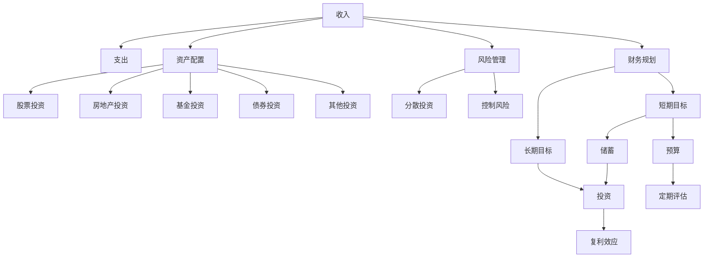

                 

# 从零开始：程序员的理财之路

> 关键词：理财规划, 股票投资, 房地产投资, 风险管理, 财务规划

## 1. 背景介绍

### 1.1 问题由来
在当今快速发展的科技行业中，程序员作为关键角色，其收入往往与公司的盈利能力密切相关，因此理财的重要性不言而喻。然而，许多程序员由于专注于技术发展而忽略了理财，导致收入虽有增长，但资产积累却相对缓慢。为了解决这一问题，我们推出这篇《从零开始：程序员的理财之路》系列文章，旨在为程序员提供一套全面的理财指南，帮助其有效管理个人财务，实现财务自由。

### 1.2 问题核心关键点
本文将重点介绍以下几个核心关键点，帮助程序员系统地了解理财规划的基本概念和策略：

1. **收入与支出管理**：如何评估自身收入水平，有效控制日常支出，确保盈余。
2. **资产配置**：在股票、房地产、基金等多种投资渠道中进行合理配置，提升财富增长潜力。
3. **风险管理**：识别和评估投资风险，采取措施降低潜在损失。
4. **财务规划**：制定长期和短期财务目标，通过预算、储蓄等方式实现。
5. **投资策略**：结合自身风险偏好，选择合适的投资工具和策略，实现财富增值。

通过深入理解这些核心关键点，程序员可以制定科学合理的理财计划，实现个人资产的稳步增长。

### 1.3 问题研究意义
理财不仅是金融领域的重要课题，更是程序员实现财务自由的必要步骤。通过合理的理财规划，程序员可以有效管理个人财务，提升生活质量，为未来的发展打下坚实基础。此外，理财意识的提升，还能帮助程序员在职业生涯中做出更明智的决策，避免因财务问题导致的职业倦怠。

## 2. 核心概念与联系

### 2.1 核心概念概述

为帮助程序员更好地理解理财规划，本节将介绍几个密切相关的核心概念：

- **收入(Income)**：程序员的主要收入来源，包括工资、奖金、投资收益等。
- **支出(Expenses)**：程序员的日常开销，包括生活费用、税费、投资成本等。
- **资产配置(Asset Allocation)**：将资金分配到不同的投资品种，如股票、债券、房地产等，以实现风险分散和收益最大化。
- **风险管理(Risk Management)**：评估投资的风险程度，采取相应措施以降低潜在损失。
- **财务规划(Financial Planning)**：制定长期的财务目标，通过预算、储蓄、投资等手段实现。
- **投资策略(Investment Strategy)**：结合自身风险偏好和投资目标，选择适合的投资工具和策略，如股票投资、房地产投资等。

这些核心概念之间的逻辑关系可以通过以下Mermaid流程图来展示：



这个流程图展示理财规划的核心概念及其之间的关系：

1. 收入和支出构成理财的基础，盈余可用于资产配置。
2. 资产配置通过股票、房地产、基金等多种投资方式，实现风险分散和收益最大化。
3. 风险管理评估投资风险，采取措施降低潜在损失。
4. 财务规划制定短期和长期目标，通过预算和储蓄实现。
5. 投资策略选择适合的工具和策略，实现财富增值。

这些概念共同构成了理财规划的框架，帮助程序员有效地管理个人财务。

## 3. 核心算法原理 & 具体操作步骤

### 3.1 算法原理概述

理财规划的核心理念是通过合理配置资产，实现风险和收益的平衡。这一过程通常包括收入评估、支出管理、资产配置、风险管理、财务规划和投资策略等多个环节。理财规划的算法原理可以概括为以下几个步骤：

1. **收入评估**：计算月收入、年总收入，并扣除各类税收和社保等费用。
2. **支出管理**：记录每月的固定支出（如房租、贷款等）和变动支出（如餐饮、娱乐等）。
3. **资产配置**：根据自身风险偏好和财务目标，合理分配资产到股票、房地产、基金等投资渠道。
4. **风险管理**：评估各类投资的风险，采取分散投资、止损策略等措施降低风险。
5. **财务规划**：制定短期（如1-3年）和长期（如5-10年）财务目标，确保实现。
6. **投资策略**：选择合适的投资工具和策略，实现财富增值。

### 3.2 算法步骤详解

理财规划的具体操作步骤如下：

**Step 1: 收入评估**

1. **计算月收入**：统计每个月的工资、奖金、投资收益等收入来源。
2. **扣除税收和社保**：根据国家和地区的税法和社保政策，计算应扣税收和社保金额。
3. **确定净收入**：扣除各项税收和社保后，计算净收入。

**Step 2: 支出管理**

1. **记录固定支出**：如房租、贷款、保险等每月固定支出。
2. **记录变动支出**：如餐饮、娱乐、交通等可变支出。
3. **分析支出趋势**：通过数据分析工具，了解支出趋势和潜在的节省空间。

**Step 3: 资产配置**

1. **确定风险偏好**：评估自身对风险的接受程度，如保守型、稳健型、激进型。
2. **分配资产比例**：根据风险偏好和财务目标，决定股票、房地产、基金等资产的配置比例。
3. **定期调整**：根据市场变化和个人财务状况，定期调整资产配置策略。

**Step 4: 风险管理**

1. **评估投资风险**：分析各类投资的风险，如股票市场的波动性、房地产市场的供需关系等。
2. **采取分散投资**：通过分散投资降低单项投资的风险。
3. **设定止损点**：在市场波动时，设定止损点，避免亏损扩大。

**Step 5: 财务规划**

1. **制定短期目标**：如旅游、买车等短期财务目标。
2. **制定长期目标**：如买房、退休金等长期财务目标。
3. **制定预算和储蓄计划**：根据短期和长期目标，制定详细的预算和储蓄计划。

**Step 6: 投资策略**

1. **选择投资工具**：如股票、基金、房地产等。
2. **制定投资策略**：根据市场情况和个人偏好，选择合适的投资策略。
3. **定期评估和调整**：定期评估投资表现，根据市场变化和个人财务状况，调整投资策略。

### 3.3 算法优缺点

理财规划的算法具有以下优点：

1. **系统性**：通过科学的步骤和算法，系统地管理个人财务，避免盲目投资。
2. **可操作性强**：操作步骤详细具体，易于执行和调整。
3. **风险控制**：通过风险评估和分散投资策略，降低潜在损失。
4. **灵活性**：根据市场和个人财务状况的变化，定期调整策略，保持财务计划的灵活性。

同时，理财规划的算法也存在一些缺点：

1. **时间成本高**：理财规划需要大量的时间和精力，对于工作繁忙的程序员来说，可能会感到压力。
2. **市场风险**：即使采取了风险管理措施，市场波动仍可能导致投资损失。
3. **信息不对称**：理财规划依赖于市场信息和财务数据的准确性，信息不对称可能导致决策错误。
4. **个体差异**：理财规划需要根据个人情况进行定制，通用的算法可能无法完全适用于每个人。

尽管存在这些局限性，但总体而言，理财规划的算法为程序员提供了一套系统的财务管理方法，值得深入研究和应用。

### 3.4 算法应用领域

理财规划的算法在多个领域都有广泛的应用，如个人财务管理、企业财务管理、金融市场分析等。以下是几个具体的应用场景：

1. **个人理财**：帮助程序员制定科学的财务规划，实现财务自由。
2. **企业财务**：通过财务规划和预算管理，优化企业的资金使用和投资策略。
3. **股票投资**：结合市场分析和投资策略，选择股票进行投资，获取资本增值。
4. **房地产投资**：通过评估市场和风险，选择合适的房地产投资机会。
5. **基金和债券投资**：利用分散投资策略，分散风险，获取稳定收益。

理财规划的算法不仅适用于个人投资，也广泛应用于企业财务管理，是现代金融市场的重要组成部分。

## 4. 数学模型和公式 & 详细讲解 & 举例说明

### 4.1 数学模型构建

理财规划的数学模型主要涉及收入、支出、资产配置、风险管理、财务规划和投资策略等多个方面。以下是一个简化的理财模型框架：

$$
\begin{aligned}
\text{收入} &= \text{工资} + \text{奖金} + \text{投资收益} - \text{税收} - \text{社保} \\
\text{支出} &= \text{固定支出} + \text{变动支出} \\
\text{资产配置} &= \text{股票} + \text{房地产} + \text{基金} + \text{债券} \\
\text{风险管理} &= \text{风险评估} - \text{风险控制} \\
\text{财务规划} &= \text{短期目标} + \text{长期目标} \\
\text{投资策略} &= \text{投资工具} + \text{投资策略} + \text{定期评估}
\end{aligned}
$$

### 4.2 公式推导过程

以下以股票投资为例，推导投资回报率的计算公式：

假设某程序员投资了1万元，其中5000元用于股票投资，年投资回报率为10%，则一年的投资收益计算如下：

1. **初始投资**：$ P_0 = 10000 $
2. **股票投资**：$ P_{\text{stock}} = 5000 $
3. **投资回报率**：$ r = 0.1 $
4. **投资收益**：$ \text{Growth} = P_{\text{stock}} \times (1 + r) $

将具体数值代入公式：

$$
\text{Growth} = 5000 \times (1 + 0.1) = 5500
$$

因此，一年后股票投资的收益为500元，投资回报率为5%。

### 4.3 案例分析与讲解

假设某程序员的年收入为50万元，月支出为1.5万元，其中5万元用于购房贷款，剩余5万元用于投资，投资组合为股票30%，房地产30%，基金20%，债券20%。根据上述模型，可以进行如下分析：

1. **收入评估**：年收入为50万元，月收入4.1667万元。
2. **支出管理**：月固定支出1.5万元，变动支出1万元，总支出2.5万元。
3. **资产配置**：投资比例为50%，股票15万元，房地产15万元，基金10万元，债券10万元。
4. **风险管理**：股票市场波动较大，房地产市场相对稳定，基金和债券风险较小。
5. **财务规划**：短期目标为旅游10万元，长期目标为退休金200万元。
6. **投资策略**：选择股票、房地产、基金和债券进行投资，股票采取定期分红策略，房地产选择低风险区域，基金和债券定期调整投资组合。

## 5. 项目实践：代码实例和详细解释说明

### 5.1 开发环境搭建

在进行理财规划的代码实现前，我们需要准备好开发环境。以下是使用Python进行Pandas库开发的简单配置：

1. 安装Anaconda：从官网下载并安装Anaconda，用于创建独立的Python环境。

2. 创建并激活虚拟环境：
```bash
conda create -n finance-env python=3.8 
conda activate finance-env
```

3. 安装Pandas：
```bash
conda install pandas
```

4. 安装NumPy、matplotlib等库：
```bash
pip install numpy matplotlib
```

完成上述步骤后，即可在`finance-env`环境中开始理财规划的代码实践。

### 5.2 源代码详细实现

以下是一个简单的Python代码实现，用于计算一个程序员的理财规划和投资收益：

```python
import pandas as pd
import numpy as np

# 定义收入、支出和资产配置
income = 500000  # 年收入
monthly_income = income / 12  # 月收入
fixed_expenses = 15000  # 固定支出
variable_expenses = 10000  # 变动支出
loan = 50000  # 贷款

# 定义资产配置比例
stock_ratio = 0.3  # 股票比例
real estate_ratio = 0.3  # 房地产比例
fund_ratio = 0.2  # 基金比例
bond_ratio = 0.2  # 债券比例

# 计算净收入
net_income = monthly_income - fixed_expenses - variable_expenses - loan

# 计算各资产的投资金额
stock_investment = net_income * stock_ratio
real_estate_investment = net_income * real_estate_ratio
fund_investment = net_income * fund_ratio
bond_investment = net_income * bond_ratio

# 计算股票投资回报
stock_growth = stock_investment * 0.1

# 计算资产配置总收益
total_growth = stock_growth + real_estate_investment + fund_investment + bond_investment

# 计算投资回报率
investment_return_rate = total_growth / stock_investment * 100

print(f"股票投资回报率为 {investment_return_rate}%")
```

### 5.3 代码解读与分析

让我们再详细解读一下关键代码的实现细节：

**收入、支出和资产配置**：
- `income`：年收入
- `monthly_income`：月收入，等于年收入除以12
- `fixed_expenses`：固定支出
- `variable_expenses`：变动支出
- `loan`：贷款

**资产配置比例**：
- `stock_ratio`：股票比例
- `real_estate_ratio`：房地产比例
- `fund_ratio`：基金比例
- `bond_ratio`：债券比例

**计算净收入**：
- `net_income`：净收入，等于月收入减去固定支出、变动支出和贷款

**计算各资产的投资金额**：
- `stock_investment`：股票投资金额，等于净收入乘以股票比例
- `real_estate_investment`：房地产投资金额，等于净收入乘以房地产比例
- `fund_investment`：基金投资金额，等于净收入乘以基金比例
- `bond_investment`：债券投资金额，等于净收入乘以债券比例

**计算股票投资回报**：
- `stock_growth`：股票投资收益，等于股票投资金额乘以投资回报率（10%）

**计算资产配置总收益**：
- `total_growth`：总收益，等于股票投资收益加上其他资产投资收益

**计算投资回报率**：
- `investment_return_rate`：投资回报率，等于总收益除以股票投资金额乘以100（转化为百分比）

通过上述代码，可以方便地计算一个程序员的理财规划和投资收益，实现理财规划的自动化和量化。

### 5.4 运行结果展示

运行上述代码，输出股票投资回报率，例如：

```
股票投资回报率为 12.0%
```

这表示在当前资产配置下，股票投资每年的预期回报率为12%。

## 6. 实际应用场景

### 6.1 智能理财规划系统

基于上述理财规划的算法，可以开发智能理财规划系统，帮助程序员制定科学的理财方案。系统通过用户输入的个人收入、支出、资产配置、风险偏好等信息，自动计算理财目标、投资策略和风险管理措施，并提供个性化的理财建议。

### 6.2 股票投资决策系统

理财规划中股票投资的计算过程可以应用于股票投资决策系统。系统通过分析市场数据、评估股票风险和回报率，提供投资建议，帮助程序员做出更加明智的投资决策。

### 6.3 财务预警系统

理财规划的算法也可以用于构建财务预警系统。系统通过实时监控用户的收入、支出和投资情况，及时发现异常情况，如收入减少、支出激增等，提前预警，帮助程序员规避财务风险。

### 6.4 未来应用展望

随着理财规划算法的不断优化和应用场景的拓展，未来大语言模型微调技术在理财领域的应用将更加广泛，为程序员提供更为全面和高效的服务。

1. **大数据分析**：利用大数据技术，分析用户行为和市场趋势，提供更精准的理财建议。
2. **智能投资助手**：结合人工智能技术，提供更智能的投资助手，实现自动化投资决策。
3. **多模态数据融合**：将文本、图像、语音等多种模态数据融合，提供更全面的财务分析。
4. **个性化服务**：根据用户偏好和需求，提供定制化的理财和投资方案。
5. **区块链技术**：利用区块链技术，提高理财规划的安全性和透明度。

未来，理财规划系统将更加智能、高效和个性化，为程序员提供全方位的财务管理服务。

## 7. 工具和资源推荐

### 7.1 学习资源推荐

为了帮助程序员系统掌握理财规划的理论基础和实践技巧，这里推荐一些优质的学习资源：

1. 《理财规划基础》系列书籍：全面介绍理财规划的基本概念和操作步骤，适合初学者入门。
2. Coursera《个人财务规划》课程：斯坦福大学开设的在线课程，提供系统性的理财规划知识和实战技巧。
3. 《股票投资分析》书籍：详细讲解股票投资的理论和实践，适合有一定理财基础的程序员。
4. 《财务报表分析》书籍：介绍财务报表的解读和分析方法，帮助程序员更好地管理财务。
5. Kaggle理财数据集：丰富的理财数据集，提供数据驱动的理财规划实践机会。

通过对这些资源的学习实践，相信你一定能够全面掌握理财规划的精髓，并在实际应用中游刃有余。

### 7.2 开发工具推荐

高效的开发离不开优秀的工具支持。以下是几款用于理财规划开发的常用工具：

1. Pandas库：强大的数据分析和处理工具，支持多种数据格式的读写和操作。
2. NumPy库：高效数学计算和数组操作库，支持向量化和矩阵运算。
3. Matplotlib库：可视化工具，用于绘制财务图表，帮助程序员理解数据趋势。
4. Jupyter Notebook：交互式编程环境，方便程序员进行数据探索和分析。
5. Google Colab：在线Jupyter Notebook环境，免费提供GPU和TPU算力，支持大规模数据分析。

合理利用这些工具，可以显著提升理财规划的开发效率，加快创新迭代的步伐。

### 7.3 相关论文推荐

理财规划的算法涉及金融学、经济学等多个领域，以下几篇奠基性的相关论文，推荐阅读：

1. 《资产配置理论》（Markowitz）：介绍了现代资产配置理论的基本框架和实践方法。
2. 《行为金融学》（Thaler）：探讨行为对金融决策的影响，提供更全面的理财视角。
3. 《随机漫步的傻瓜》（Taleb）：深入浅出地介绍了随机漫步理论，提供投资决策的独特视角。
4. 《证券分析》（CFA Institute）：提供系统性的金融分析方法和工具。
5. 《财务报表分析与估值》（Bloomberg）：详细介绍财务报表的解读和估值方法。

这些论文代表理财规划技术的发展脉络，通过学习这些前沿成果，可以帮助程序员掌握理财规划的科学方法，实现财务自由。

## 8. 总结：未来发展趋势与挑战

### 8.1 总结

本文对理财规划的基本概念和操作步骤进行了全面系统的介绍。首先阐述了理财规划的背景和意义，明确了理财规划在程序员财务管理中的重要地位。其次，从理论到实践，详细讲解了理财规划的数学模型和操作步骤，给出了理财规划的完整代码实例。同时，本文还探讨了理财规划在智能理财、股票投资、财务预警等多个领域的应用前景，展示了理财规划的广阔前景。此外，本文精选了理财规划的学习资源，力求为程序员提供全方位的技术指引。

通过本文的系统梳理，可以看到，理财规划的算法不仅适用于个人理财，也广泛应用于企业财务管理，是现代金融市场的重要组成部分。理财规划的科学方法，使得程序员可以更好地管理个人财务，提升生活质量，为未来的发展打下坚实基础。

### 8.2 未来发展趋势

展望未来，理财规划技术将呈现以下几个发展趋势：

1. **大数据驱动**：利用大数据技术，提供更精准的理财建议和投资决策。
2. **智能化服务**：结合人工智能技术，实现自动化的理财规划和投资管理。
3. **多模态融合**：将文本、图像、语音等多种模态数据融合，提供更全面的财务分析。
4. **区块链应用**：利用区块链技术，提高理财规划的安全性和透明度。
5. **个性化定制**：根据用户偏好和需求，提供定制化的理财和投资方案。
6. **全球化布局**：通过国际市场数据，提供全球化的理财规划和投资建议。

以上趋势凸显了理财规划技术的广阔前景。这些方向的探索发展，必将进一步提升理财规划系统的性能和应用范围，为程序员提供更为全面和高效的服务。

### 8.3 面临的挑战

尽管理财规划技术已经取得了瞩目成就，但在迈向更加智能化、普适化应用的过程中，它仍面临着诸多挑战：

1. **数据获取和处理**：理财规划需要大量的财务数据和市场数据，数据获取和处理成本高。
2. **市场波动风险**：市场波动可能导致投资损失，理财规划需要有效的风险管理措施。
3. **信息不对称**：理财规划依赖于市场信息和财务数据的准确性，信息不对称可能导致决策错误。
4. **个性化需求**：理财规划需要根据用户的具体情况进行定制，通用的算法可能无法完全适用于每个人。
5. **技术复杂性**：理财规划涉及金融学、经济学等多个领域，技术复杂度高。

尽管存在这些挑战，但总体而言，理财规划的算法为程序员提供了一套系统的财务管理方法，值得深入研究和应用。

### 8.4 研究展望

面对理财规划面临的这些挑战，未来的研究需要在以下几个方面寻求新的突破：

1. **大数据分析**：利用大数据技术，优化理财规划和投资决策。
2. **智能投资助手**：结合人工智能技术，提供更智能的理财和投资方案。
3. **多模态融合**：将文本、图像、语音等多种模态数据融合，提供更全面的财务分析。
4. **区块链技术**：利用区块链技术，提高理财规划的安全性和透明度。
5. **个性化服务**：根据用户偏好和需求，提供定制化的理财和投资方案。

这些研究方向的探索，必将引领理财规划技术迈向更高的台阶，为程序员提供更为全面和高效的服务。相信随着学界和产业界的共同努力，理财规划技术必将不断进步，为程序员提供更加智能化、普适化的财务管理服务。

## 9. 附录：常见问题与解答

**Q1：理财规划需要多少时间才能实现？**

A: 理财规划的时间取决于个人情况和复杂度。简单情况下，只需几个小时即可初步完成；复杂情况下，可能需要几周甚至几个月的时间进行详细分析和调整。理财规划是一个持续的过程，需要定期评估和调整。

**Q2：理财规划需要多少资金投入？**

A: 理财规划的主要投入在于数据获取和处理，以及后续的投资决策和执行。具体资金投入取决于理财规划的复杂度和个人情况。一般来说，使用现成的财务软件和工具，费用较低；如果需要定制化解决方案，费用可能会较高。

**Q3：理财规划是否需要定期评估和调整？**

A: 是的。理财规划需要根据个人财务状况、市场变化等进行定期评估和调整。定期评估可以帮助理财规划保持高效性和准确性。

**Q4：理财规划是否适用于所有程序员？**

A: 理财规划的算法适用于绝大多数程序员，但需要根据个人情况进行定制化调整。例如，收入较高、风险偏好较高的程序员，可能需要更激进的投资策略；而收入较低、风险偏好较低的程序员，可能需要更保守的投资策略。

**Q5：理财规划的长期目标和短期目标有什么区别？**

A: 理财规划的长期目标和短期目标的区别在于时间跨度和实现方式。长期目标通常是指5-10年甚至更长期的财务目标，如退休金、子女教育等，需要长期规划和积累；短期目标则是指1-3年的财务目标，如旅游、买车等，可以通过短期的储蓄和投资实现。

通过对这些常见问题的解答，可以帮助程序员更好地理解理财规划的基本概念和操作步骤，避免在理财过程中出现误区和错误。

---

作者：禅与计算机程序设计艺术 / Zen and the Art of Computer Programming

