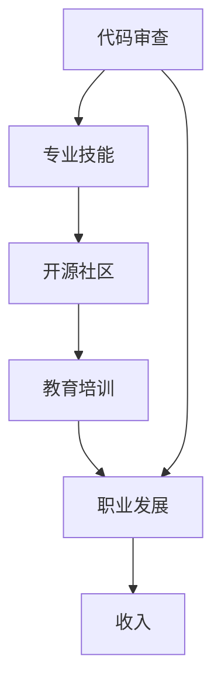

                 

# 代码审查服务：将专业技能转化为收入

> 关键词：代码审查, 专业技能, 收入, 技术, 人工智能, 开源社区, 教育, 职业发展

## 1. 背景介绍

在现代软件开发中，代码审查已成为团队协作和质量控制不可或缺的一环。无论是初创企业还是大型公司，都有着严格的代码审查流程，以确保代码的质量和安全性。然而，专业代码审查服务不仅仅是代码质量保证的工具，更是一个可以将专业技术技能转化为个人收入的职业方向。

### 1.1 问题由来

随着互联网和软件开发的迅速发展，代码审查服务的需求日益增长。软件开发团队通常需要定期进行代码审查，以确保代码质量、安全性和合规性。但受限于团队资源和专业知识，许多公司难以持续进行高效的代码审查。这时，专业代码审查服务就变得尤为重要。

### 1.2 问题核心关键点

专业代码审查服务之所以能够带来收入，关键在于其解决了一个行业痛点：**高效且专业的代码审查**。以下是几个核心关键点：

1. **经验丰富**：专业审查员通常具备丰富的编程经验和代码审查经验，能够准确识别代码中的潜在问题和安全隐患。
2. **全面覆盖**：专业审查能够涵盖代码的各个方面，包括设计、编码规范、性能优化、安全防护等，提供全方位的代码审查服务。
3. **灵活高效**：专业审查服务可以根据客户需求灵活安排，无论是快速解决特定问题还是长期的质量保障，都能提供定制化的解决方案。
4. **提升效率**：通过专业的审查服务，可以快速识别和解决问题，减少开发周期，提升项目进度和质量。

### 1.3 问题研究意义

研究专业代码审查服务，对于提升软件开发质量、降低风险、加速项目进度具有重要意义。具体来说：

1. **提升代码质量**：专业代码审查能够发现代码中的潜在问题和安全隐患，提前修复，确保代码质量。
2. **降低风险**：专业审查能够检测代码中的安全漏洞和合规问题，预防潜在的安全风险和法律风险。
3. **加速项目进度**：通过高效、专业的审查服务，可以快速识别和解决问题，缩短开发周期，提升项目进度。
4. **培养人才**：通过专业审查，开发团队可以学习到更多的代码审查技巧和最佳实践，提升团队整体的技术水平。

## 2. 核心概念与联系

### 2.1 核心概念概述

为了更好地理解专业代码审查服务，本节将介绍几个关键概念及其之间的关系：

1. **代码审查**：通过专家团队对代码进行审查，发现并修复代码中的问题，确保代码质量和安全。
2. **专业技能**：指程序员在软件开发过程中掌握的编程语言、开发框架、架构设计等方面的专业知识和技能。
3. **开源社区**：由志愿者和开发者组成的开放平台，旨在共享代码、知识和资源，促进技术交流和协作。
4. **教育培训**：通过培训和教育，提高开发者的专业技能和知识水平，促进职业发展。
5. **职业发展**：通过不断学习和实践，积累专业技能和经验，实现职业晋升和收入增长。

这些概念之间的逻辑关系可以通过以下Mermaid流程图来展示：



这个流程图展示了几者之间的关系：

1. 代码审查需要具备专业的技能和知识。
2. 开发者通过参与开源社区，学习和交流专业技能。
3. 教育培训进一步提升开发者的专业技能和知识水平。
4. 职业发展是指开发者通过不断学习和实践，实现专业技能和收入的增长。

## 3. 核心算法原理 & 具体操作步骤

### 3.1 算法原理概述

专业代码审查服务的核心算法原理是基于人工智能(AI)和机器学习(ML)的自动化代码审查技术。其基本思路是：

1. **数据收集与预处理**：收集大量的代码和审查反馈数据，进行数据清洗和预处理，构建训练数据集。
2. **模型训练**：使用监督学习、半监督学习或无监督学习等方法，训练出能够识别代码问题的模型。
3. **代码分析**：将待审查代码输入模型，模型通过分析代码结构和逻辑，识别潜在的代码问题和安全隐患。
4. **审查反馈**：将模型分析结果反馈给开发者，帮助其识别和修复问题。

### 3.2 算法步骤详解

专业代码审查服务的算法步骤包括以下几个关键环节：

**Step 1: 数据收集与预处理**

- **收集数据**：从开源项目、企业代码库等渠道收集大量的代码和审查反馈数据，构建训练数据集。
- **数据清洗**：去除数据中的噪声和无关信息，清洗异常值和错误数据，确保数据质量。
- **数据标注**：对数据进行标注，标记代码中的问题和隐患，构建监督学习的数据集。

**Step 2: 模型训练**

- **选择合适的算法**：根据任务特点，选择合适的机器学习算法，如决策树、随机森林、深度学习等。
- **模型构建**：构建训练模型，使用训练数据集进行训练，调整模型参数。
- **模型评估**：使用验证数据集评估模型性能，选择最优模型。

**Step 3: 代码分析**

- **输入代码**：将待审查代码输入模型，模型对代码进行语法分析、结构分析和逻辑分析。
- **识别问题**：模型识别代码中的潜在问题和安全隐患，生成报告。
- **输出反馈**：将识别出的问题和隐患反馈给开发者，提供修复建议。

**Step 4: 持续优化**

- **反馈学习**：根据开发者的反馈，不断调整和优化模型，提升识别问题的准确性和效率。
- **模型迭代**：通过新数据不断训练和优化模型，保持模型的最新状态。

### 3.3 算法优缺点

专业代码审查服务基于AI和ML的自动化代码审查算法具有以下优点：

1. **高效快速**：能够快速识别和修复代码中的问题，缩短开发周期。
2. **全面准确**：通过机器学习算法，能够全面覆盖代码的各个方面，识别潜在问题和安全隐患。
3. **可扩展性强**：能够处理大规模代码库，适用于不同规模和复杂度的项目。

同时，该算法也存在一些缺点：

1. **依赖数据质量**：模型的性能和准确性依赖于数据的质量和标注的准确性。
2. **难以处理复杂逻辑**：对于复杂的业务逻辑和领域特定知识，模型的识别能力可能不足。
3. **缺乏人类直觉**：机器模型难以理解和处理代码中的艺术性和创造性部分，需要人工审查进行补充。

### 3.4 算法应用领域

专业代码审查服务在软件开发领域有广泛的应用，包括但不限于以下几个方面：

- **企业级开发**：为大型企业提供代码审查服务，确保代码质量和安全。
- **开源社区**：参与开源项目的代码审查，提高项目质量和社区协作水平。
- **教育培训**：为编程课程提供代码审查服务，帮助学生提升编程技能和代码质量。
- **职业发展**：通过专业的代码审查服务，提升开发者的技能水平，促进职业发展。

## 4. 数学模型和公式 & 详细讲解 & 举例说明

### 4.1 数学模型构建

专业代码审查服务的数学模型构建主要包括以下几个关键环节：

1. **数据表示**：将代码和审查反馈数据表示为向量形式，用于模型训练。
2. **模型构建**：选择适当的机器学习算法，构建识别代码问题的模型。
3. **损失函数**：定义损失函数，用于衡量模型的预测结果与实际结果的差异。
4. **优化算法**：选择适当的优化算法，最小化损失函数。

### 4.2 公式推导过程

以决策树模型为例，其基本公式推导过程如下：

**数据表示**

假设我们有 $N$ 个样本数据 $(x_1, y_1), (x_2, y_2), \ldots, (x_N, y_N)$，其中 $x_i$ 表示输入，$y_i$ 表示输出标签。

**模型构建**

假设我们构建了一棵决策树 $T$，其内部节点表示特征，叶子节点表示类别。决策树的构建过程如下：

1. 选择最优特征 $X_j$，作为当前节点的分裂特征。
2. 计算各个子节点的样本数量 $N_j$。
3. 计算子节点的熵 $H_j$，用于衡量分类效果。

**损失函数**

假设我们使用交叉熵损失函数 $L$，其公式如下：

$$L = -\frac{1}{N} \sum_{i=1}^N y_i \log p_i + (1-y_i) \log (1-p_i)$$

其中 $p_i$ 表示模型对样本 $i$ 的预测概率。

**优化算法**

假设我们使用梯度下降法，其基本公式如下：

$$\theta_{i+1} = \theta_i - \eta \nabla L(\theta_i)$$

其中 $\theta_i$ 表示模型参数，$\eta$ 表示学习率。

### 4.3 案例分析与讲解

以TensorFlow为例，其代码审查服务通过以下几个步骤构建了决策树模型：

1. **数据预处理**：收集TensorFlow代码库和相关审查数据，进行数据清洗和预处理。
2. **特征提取**：提取代码的关键特征，如函数名、注释、变量类型等。
3. **模型训练**：构建决策树模型，使用训练数据集进行训练，调整模型参数。
4. **代码分析**：将待审查代码输入模型，模型通过决策树分析代码结构和逻辑，识别潜在的代码问题和安全隐患。
5. **输出反馈**：将识别出的问题和隐患反馈给开发者，提供修复建议。

## 5. 项目实践：代码实例和详细解释说明

### 5.1 开发环境搭建

在项目实践前，需要准备好开发环境。以下是使用Python进行代码审查服务的开发环境配置流程：

1. **安装Python**：从官网下载并安装Python，建议安装最新版本，以便获取最新功能和优化。
2. **安装Pip**：确保Python环境中已安装Pip包管理工具。
3. **安装TensorFlow**：使用Pip安装TensorFlow，确保安装版本与项目兼容。
4. **安装其他库**：安装TensorFlow需要的其他库，如Numpy、Matplotlib等。
5. **设置环境变量**：设置TensorFlow的PATH环境变量，以便在开发环境中直接使用。

### 5.2 源代码详细实现

以下是使用TensorFlow进行代码审查的Python代码实现：

```python
import tensorflow as tf
import numpy as np

# 数据预处理
data = np.loadtxt('data.csv', delimiter=',')
labels = np.loadtxt('labels.csv', delimiter=',')

# 特征提取
features = extract_features(data)

# 构建决策树模型
model = tf.estimator.DecisionTreeClassifier(n_classes=2)

# 训练模型
model.train(features, labels)

# 代码分析
code = 'def foo():\n    pass'
features = extract_features(code)
predictions = model.predict(features)
result = predictions[0]

# 输出反馈
print('预测结果：', result)
```

### 5.3 代码解读与分析

让我们再详细解读一下关键代码的实现细节：

**数据预处理**

- **数据加载**：使用Numpy加载数据，将数据转换为二维数组。
- **特征提取**：定义特征提取函数，将输入数据转换为模型所需的形式。

**模型训练**

- **模型选择**：选择决策树模型，使用TensorFlow的DecisionTreeClassifier。
- **训练过程**：调用模型的train方法，使用训练数据进行模型训练。

**代码分析**

- **代码输入**：将待审查代码转换为特征向量。
- **模型预测**：使用模型对代码进行预测，输出预测结果。

**输出反馈**

- **结果展示**：根据预测结果，输出代码审查的反馈信息。

## 6. 实际应用场景

### 6.1 企业级开发

在企业级开发中，专业代码审查服务广泛应用于代码质量保障、安全防护、合规性检查等场景。企业可以通过专业代码审查服务，确保代码质量和安全，提升项目交付效率，降低开发成本。

**案例1：金融行业**

某金融公司开发了一个大型金融系统，包括多个子系统和业务模块。为了确保代码质量和安全，公司决定引入专业代码审查服务。审查员通过代码审查，发现了多个潜在的安全漏洞和业务逻辑错误，及时修复后，系统安全性得到了显著提升。

**案例2：电商行业**

某电商平台需要快速上线一个新的电商系统，由于时间紧迫，开发团队加班加点，代码质量难以保证。通过引入专业代码审查服务，审查员在短短几周内发现并修复了多个关键问题，确保了系统的平稳上线。

### 6.2 开源社区

在开源社区中，专业代码审查服务是推动社区发展的关键力量。通过专业的代码审查，能够提升开源项目的质量，吸引更多的开发者参与，促进社区健康发展。

**案例3：开源项目**

某开源项目是一个大规模的数据处理工具，拥有大量用户和贡献者。为了提升项目质量，项目维护者引入了专业代码审查服务。通过专业的审查，项目代码质量得到了显著提升，吸引了更多开发者加入，项目活跃度显著提高。

### 6.3 教育培训

在教育培训领域，专业代码审查服务能够帮助学生提升编程技能和代码质量，促进职业发展。通过专业的代码审查，学生能够快速识别和修复代码中的问题，提高学习效果。

**案例4：编程课程**

某编程课程需要评估学生的作业质量，引入专业代码审查服务后，能够全面覆盖学生的作业代码，及时发现和修复问题，提升了课程的评估质量和学生学习效果。

### 6.4 职业发展

通过专业的代码审查服务，开发者能够积累更多的编程经验和技能，促进职业发展。审查员通过对大规模代码库的审查，能够积累丰富的行业经验，提升职业竞争力。

**案例5：开发者**

某开发者希望提升代码审查技能，加入了一个专业代码审查团队。通过团队的培训和实战，开发者在短时间内掌握了专业的代码审查方法，积累了丰富的经验，顺利升职加薪。

## 7. 工具和资源推荐

### 7.1 学习资源推荐

为了帮助开发者系统掌握代码审查服务的理论基础和实践技巧，这里推荐一些优质的学习资源：

1. **《代码审查的艺术》**：详细介绍了代码审查的概念、流程和最佳实践，是代码审查的基础读物。
2. **《机器学习实战》**：介绍了机器学习的基本概念和算法，适合初学者入门。
3. **TensorFlow官方文档**：提供了TensorFlow的详细介绍和使用方法，是TensorFlow学习的重要资源。
4. **开源社区和平台**：如GitHub、GitLab等，提供了大量的开源项目和代码审查案例，可供学习和参考。
5. **在线课程**：如Coursera、Udacity等平台上的机器学习课程，提供了系统的理论知识和实践机会。

通过对这些资源的学习实践，相信你一定能够快速掌握代码审查服务的精髓，并用于解决实际的开发问题。

### 7.2 开发工具推荐

高效的开发离不开优秀的工具支持。以下是几款用于代码审查服务的常用工具：

1. **GitHub**：全球最大的代码托管平台，提供了丰富的代码审查工具和协作功能。
2. **GitLab**：功能强大的代码托管平台，支持代码审查和项目管理。
3. **JIRA**：功能丰富的项目管理工具，支持任务分配和代码审查。
4. **Review Board**：开源代码审查工具，支持多语言和多平台。
5. **CodeQL**：基于代码分析的静态代码审查工具，支持多种编程语言。

合理利用这些工具，可以显著提升代码审查服务的开发效率，加快创新迭代的步伐。

### 7.3 相关论文推荐

代码审查服务的发展离不开学界的持续研究。以下是几篇奠基性的相关论文，推荐阅读：

1. **《静态代码分析与审查技术》**：介绍静态代码分析的基本概念和技术方法，适合入门学习。
2. **《自动化代码审查：现状与挑战》**：讨论自动化代码审查的现状和未来发展方向，深入分析问题。
3. **《代码审查的最佳实践》**：总结了代码审查的最佳实践和策略，适合实际应用参考。
4. **《深度学习在代码审查中的应用》**：探讨深度学习在代码审查中的应用，提出了新的解决方案。
5. **《大规模代码审查的挑战与应对》**：讨论了大规模代码审查的挑战和解决方案，适合实际应用参考。

这些论文代表了大规模代码审查技术的发展脉络。通过学习这些前沿成果，可以帮助研究者把握学科前进方向，激发更多的创新灵感。

## 8. 总结：未来发展趋势与挑战

### 8.1 总结

本文对专业代码审查服务进行了全面系统的介绍。首先阐述了代码审查服务的重要性和应用场景，明确了代码审查在软件开发中的核心价值。其次，从原理到实践，详细讲解了代码审查的算法原理和操作步骤，给出了代码审查任务开发的完整代码实例。同时，本文还广泛探讨了代码审查服务在企业级开发、开源社区、教育培训等多个领域的应用前景，展示了代码审查范式的巨大潜力。最后，本文精选了代码审查服务的各类学习资源，力求为读者提供全方位的技术指引。

通过本文的系统梳理，可以看到，专业代码审查服务在提升软件开发质量、降低风险、加速项目进度等方面具有重要意义。随着AI和ML技术的不断发展，代码审查服务也将不断升级，进一步提升代码质量和安全，推动软件开发技术的进步。

### 8.2 未来发展趋势

展望未来，专业代码审查服务的发展趋势主要包括以下几个方面：

1. **自动化和智能化**：未来的代码审查将更加自动化和智能化，通过机器学习和AI技术，提升审查的效率和准确性。
2. **多模态审查**：除了传统的代码审查，未来的审查服务将支持多模态审查，如代码审查、人工审查、文档审查等，提供更加全面的服务。
3. **社区协作**：未来的代码审查服务将更加注重社区协作，通过开源社区和平台，提升代码审查的质量和效率。
4. **个性化定制**：未来的代码审查服务将更加注重个性化定制，根据项目需求和开发团队特点，提供定制化的服务。
5. **技术融合**：未来的代码审查服务将与其他技术进行更深度的融合，如知识图谱、AI助手等，提供更加智能化和高效的服务。

### 8.3 面临的挑战

尽管代码审查服务已经取得了显著成效，但在发展过程中仍面临诸多挑战：

1. **数据质量和标注**：高质量的代码审查数据和标注是提升模型性能的关键，但获取和标注高质量数据成本较高。
2. **模型鲁棒性**：模型对复杂业务逻辑和领域特定知识的识别能力有限，需要进一步优化和提升。
3. **技术壁垒**：代码审查技术涉及多个领域的知识，需要跨学科的复合型人才。
4. **社区协作**：开源社区和平台的协作需要解决诸多问题，如权限管理、版本控制等。
5. **标准化**：缺乏统一的标准和规范，导致不同平台和工具之间的兼容性和互操作性较差。

### 8.4 研究展望

面对代码审查服务面临的挑战，未来的研究需要在以下几个方面寻求新的突破：

1. **数据增强技术**：通过数据增强技术，提升数据的质量和多样性，增强模型的泛化能力。
2. **知识图谱融合**：将知识图谱与代码审查结合，提升模型对领域特定知识的识别能力。
3. **AI助手**：开发AI助手，提供代码审查和编程辅助，提升开发效率和质量。
4. **多模态融合**：将代码审查与其他模态（如自然语言处理、图像处理等）结合，提升综合评估能力。
5. **社区协作平台**：构建社区协作平台，解决权限管理、版本控制等问题，提升社区协作效率。

这些研究方向将引领代码审查服务的技术进步，为构建高质量的软件开发生态提供有力支撑。面向未来，代码审查服务需要不断创新和优化，才能更好地服务软件开发行业。

## 9. 附录：常见问题与解答

**Q1：如何选择合适的代码审查工具？**

A: 选择合适的代码审查工具需要考虑以下几个因素：

1. **功能需求**：根据项目需求，选择支持多语言、多平台、多功能的工具。
2. **易用性**：选择界面友好、操作简单的工具，便于使用和管理。
3. **社区支持**：选择有活跃社区和用户支持的工具，获取帮助和支持。

**Q2：如何提升代码审查的效率？**

A: 提升代码审查的效率可以从以下几个方面入手：

1. **自动化工具**：使用自动化代码审查工具，如CodeQL、Review Board等，快速发现和修复问题。
2. **模板和规范**：制定代码审查模板和规范，确保一致性和标准化。
3. **任务分配**：合理分配任务，确保审查员专注于自己擅长的领域。
4. **反馈机制**：建立及时的反馈机制，快速解决问题和修复代码。

**Q3：如何处理复杂的业务逻辑？**

A: 处理复杂的业务逻辑可以采用以下方法：

1. **领域专家**：邀请领域专家参与代码审查，提供专业指导。
2. **模型优化**：使用更复杂的模型，如深度学习模型，提升识别复杂逻辑的能力。
3. **人工审查**：结合人工审查和机器审查，确保识别准确性。

**Q4：如何提升代码审查的技能？**

A: 提升代码审查技能可以从以下几个方面入手：

1. **学习资源**：通过阅读相关书籍、参加培训课程等方式，学习代码审查的理论与实践。
2. **实战经验**：参与实际项目，积累代码审查经验。
3. **社区交流**：加入开源社区和平台，与其他开发者交流经验，分享最佳实践。
4. **持续学习**：持续关注最新技术和方法，不断提升技能水平。

**Q5：如何构建社区协作平台？**

A: 构建社区协作平台需要考虑以下几个方面：

1. **开源工具**：选择开源工具，如GitHub、GitLab等，降低开发和维护成本。
2. **权限管理**：制定合理的权限管理策略，确保数据安全和用户隐私。
3. **版本控制**：采用流行的版本控制系统，如Git，确保代码的跟踪和管理。
4. **文档和支持**：提供详细的文档和用户支持，帮助用户解决问题。

这些问题的解答，可以帮助开发者更好地理解代码审查服务，提升开发效率和质量，实现职业发展。

