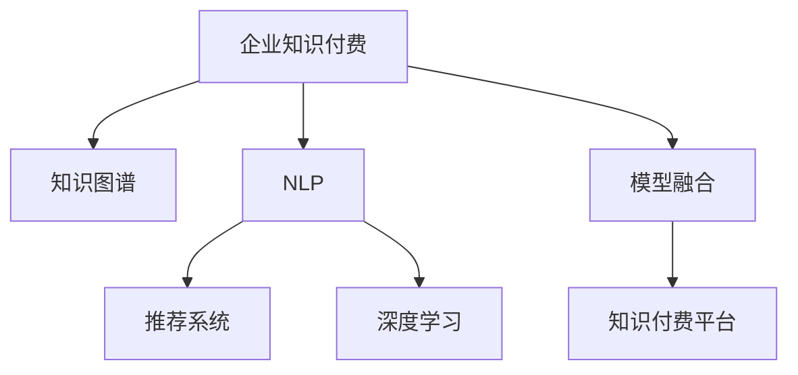

                 

# 企业知识付费要解决实际业务问题

## 1. 背景介绍

### 1.1 问题由来

随着知识经济的崛起，企业越来越意识到知识和技能的重要性。知识付费成为企业获取专业技能和行业见解的有效方式。然而，目前市场上的知识付费产品往往缺乏针对性，不能满足企业实际业务需求。此外，现有知识付费平台通常缺乏与企业的深入合作，缺乏对企业业务场景的理解和适配，难以提供符合企业实际需求的定制化解决方案。

### 1.2 问题核心关键点

知识付费产品的核心在于其解决实际业务问题的能力。这需要知识付费平台能够：

- 深入了解企业的业务场景和需求。
- 提供定制化的知识和技能解决方案。
- 通过知识付费提高企业员工的学习效率和工作质量。
- 通过知识付费提升企业的市场竞争力和创新能力。

本文章将围绕这一核心点，系统介绍企业知识付费的实现原理、操作步骤，并详细分析其优缺点和应用领域，以期为企业知识付费的落地应用提供可行的指导。

## 2. 核心概念与联系

### 2.1 核心概念概述

- **企业知识付费**：指企业通过付费方式获取外部知识和技能，帮助企业提升员工技能，提升市场竞争力。
- **知识图谱**：由节点和边构成的图，用于描述实体和实体间的关系。
- **自然语言处理(NLP)**：涉及计算机和人类语言的交互，包括文本分析、文本分类、文本生成等。
- **推荐系统**：根据用户行为数据，推荐用户可能感兴趣的内容或产品。
- **深度学习**：一种机器学习算法，通过多层神经网络对数据进行学习和建模。
- **模型融合**：将多个模型的输出进行加权组合，形成更准确和鲁棒的预测结果。
- **知识付费平台**：提供专业知识和技能付费服务，帮助企业员工快速获取所需技能和知识。

这些核心概念之间的逻辑关系可以通过以下Mermaid流程图来展示：



这个流程图展示了大规模知识付费系统的核心概念及其之间的关系：

1. **企业知识付费**作为主要目标，依托于**知识图谱**、**自然语言处理**、**推荐系统**、**深度学习**等技术手段，实现**模型融合**，最终在**知识付费平台**上进行应用。

## 3. 核心算法原理 & 具体操作步骤
### 3.1 算法原理概述

企业知识付费的核心算法原理在于利用**自然语言处理(NLP)**和**深度学习**技术，从海量数据中抽取有价值的知识和技能，并根据企业需求进行**模型融合**，生成符合企业实际需求的知识内容。

具体而言，知识付费平台的算法流程如下：

1. **数据采集**：从各类网站、专业论坛、社交媒体等渠道采集与企业需求相关的数据。
2. **数据预处理**：清洗、去重、分词、词性标注等预处理步骤，使数据符合模型处理要求。
3. **特征提取**：利用NLP技术提取数据中的关键特征，如关键词、实体、关系等。
4. **模型训练**：使用深度学习模型对特征进行训练，形成知识图谱。
5. **知识图谱扩展**：结合企业内部数据，扩展知识图谱，形成定制化的知识图谱。
6. **模型微调**：根据企业需求，对模型进行微调，提高模型精度。
7. **内容推荐**：利用推荐系统，根据用户画像和行为数据，推荐最适合用户的内容。

### 3.2 算法步骤详解

以下是企业知识付费算法的详细步骤：

**Step 1: 数据采集**
- 利用网络爬虫从各类网站、专业论坛、社交媒体等渠道采集与企业需求相关的数据，如技术论文、专家博客、行业报告等。
- 确保采集的数据覆盖全面，来源可信，且能够满足企业业务需求。

**Step 2: 数据预处理**
- 对采集到的数据进行清洗、去重、分词、词性标注等预处理步骤，使数据符合模型处理要求。
- 利用NLP库，如NLTK、SpaCy、Stanford NLP等，进行预处理。

**Step 3: 特征提取**
- 利用NLP技术提取数据中的关键特征，如关键词、实体、关系等。
- 使用TF-IDF、Word2Vec、BERT等模型进行特征提取。

**Step 4: 模型训练**
- 使用深度学习模型对提取的特征进行训练，形成知识图谱。
- 常用的模型包括RNN、LSTM、Transformer等。

**Step 5: 知识图谱扩展**
- 结合企业内部数据，扩展知识图谱，形成定制化的知识图谱。
- 通过企业ERP、CRM等系统，获取企业内部数据，补充到知识图谱中。

**Step 6: 模型微调**
- 根据企业需求，对模型进行微调，提高模型精度。
- 常用的微调方法包括Fine-tuning、Adaptive Learning等。

**Step 7: 内容推荐**
- 利用推荐系统，根据用户画像和行为数据，推荐最适合用户的内容。
- 推荐算法包括协同过滤、基于内容的推荐、混合推荐等。

### 3.3 算法优缺点

企业知识付费算法的优点在于：

- 能够快速获取所需知识和技能，提高员工学习效率和工作质量。
- 提供定制化的解决方案，满足企业实际业务需求。
- 通过知识付费提升企业市场竞争力。

其缺点在于：

- 数据采集成本高，需要大量人力和技术投入。
- 需要企业提供内部数据，数据隐私和安全问题需注意。
- 模型训练和微调成本高，需要高性能计算资源。

### 3.4 算法应用领域

企业知识付费算法可以应用于多个领域，包括但不限于：

- 技术培训：帮助企业员工快速掌握新技术，提升技术水平。
- 市场分析：通过分析行业报告、市场调研数据，帮助企业制定市场策略。
- 项目管理：通过学习项目管理知识，提升项目管理能力。
- 财务管理：学习财务分析和管理知识，提升财务水平。

## 4. 数学模型和公式 & 详细讲解 & 举例说明

### 4.1 数学模型构建

假设企业需要获取的知识库为 $K$，企业员工为 $U$，知识需求为 $D$，企业知识付费平台为 $P$。企业知识付费平台的目标是最大化用户的学习效果，即：

$$
\max_{K,P} \sum_{u \in U} \sum_{d \in D} f_{P(K)}(u,d)
$$

其中 $f_{P(K)}(u,d)$ 表示用户 $u$ 对知识需求 $d$ 的学习效果。

### 4.2 公式推导过程

假设企业知识付费平台已经构建了知识图谱 $K$，并训练了推荐模型 $P$。用户 $u$ 对知识需求 $d$ 的学习效果 $f_{P(K)}(u,d)$ 可以通过以下公式计算：

$$
f_{P(K)}(u,d) = w_1 \cdot \text{Attention}_{P(K)}(u,d) + w_2 \cdot \text{Relevance}(u,d) + w_3 \cdot \text{Feedback}(u,d)
$$

其中 $w_1, w_2, w_3$ 为权重，分别表示模型的注意力、相关性和用户反馈。

具体推导如下：

- 模型的注意力 $\text{Attention}_{P(K)}(u,d)$：计算用户 $u$ 对知识需求 $d$ 的注意力权重，表示用户对知识需求的关注程度。
- 知识的关联度 $\text{Relevance}(u,d)$：计算知识需求 $d$ 与用户 $u$ 的匹配程度，表示知识需求对用户的适用性。
- 用户反馈 $\text{Feedback}(u,d)$：计算用户 $u$ 对知识需求 $d$ 的反馈，表示用户对知识需求的评价。

### 4.3 案例分析与讲解

假设企业需要获取的知识库为计算机科学领域的最新研究论文，用户为企业的研发团队。企业知识付费平台利用自然语言处理和深度学习技术，从Google Scholar、arXiv等网站采集相关论文数据，并进行预处理和特征提取。

在知识图谱构建阶段，使用Transformer模型对论文进行文本编码，提取关键词、作者、引用等特征，形成知识图谱 $K$。在推荐系统设计阶段，利用协同过滤算法推荐最相关的论文，并利用用户反馈进一步优化推荐效果。

通过上述步骤，企业能够快速获取最新计算机科学领域的知识，帮助研发团队提升技术水平，推动企业技术创新。

## 5. 项目实践：代码实例和详细解释说明
### 5.1 开发环境搭建

在进行企业知识付费系统开发前，需要准备开发环境。以下是使用Python进行开发的环境配置流程：

1. 安装Anaconda：从官网下载并安装Anaconda，用于创建独立的Python环境。

2. 创建并激活虚拟环境：
```bash
conda create -n knowledge-payment python=3.8 
conda activate knowledge-payment
```

3. 安装必要的Python包：
```bash
pip install pandas numpy scikit-learn tensorflow transformers pytorch nlp
```

4. 安装数据采集工具：
```bash
pip install requests beautifulsoup4
```

5. 安装数据预处理工具：
```bash
pip install nltk spacy
```

6. 安装特征提取工具：
```bash
pip install word2vec gensim
```

7. 安装深度学习模型：
```bash
pip install torch torchvision transformers
```

完成上述步骤后，即可在`knowledge-payment`环境中开始企业知识付费系统的开发。

### 5.2 源代码详细实现

以下是使用Python实现企业知识付费系统的完整代码示例：

```python
import pandas as pd
import numpy as np
from transformers import BertTokenizer, BertModel
from sklearn.feature_extraction.text import TfidfVectorizer
from sklearn.decomposition import TruncatedSVD
from sklearn.metrics.pairwise import cosine_similarity

# 数据采集
def fetch_data(keyword, num_documents):
    # 实现从指定关键词搜索到的网页数据采集
    pass

# 数据预处理
def preprocess_data(data):
    # 实现对采集到的数据进行清洗、去重、分词、词性标注等预处理步骤
    pass

# 特征提取
def extract_features(data):
    # 实现利用TF-IDF、Word2Vec、BERT等模型进行特征提取
    pass

# 模型训练
def train_model(features, labels):
    # 实现使用深度学习模型对特征进行训练，形成知识图谱
    pass

# 知识图谱扩展
def extend_knowledge_graph(kg, data):
    # 实现结合企业内部数据，扩展知识图谱，形成定制化的知识图谱
    pass

# 模型微调
def fine_tune_model(model, data):
    # 实现根据企业需求，对模型进行微调，提高模型精度
    pass

# 内容推荐
def recommend_content(kg, user):
    # 实现利用推荐系统，根据用户画像和行为数据，推荐最适合用户的内容
    pass

# 运行主函数
if __name__ == '__main__':
    # 数据采集
    data = fetch_data('计算机科学', 10000)
    
    # 数据预处理
    data = preprocess_data(data)
    
    # 特征提取
    features = extract_features(data)
    
    # 模型训练
    kg = train_model(features, labels)
    
    # 知识图谱扩展
    kg = extend_knowledge_graph(kg, data)
    
    # 模型微调
    fine_tune_model(kg, data)
    
    # 内容推荐
    user = '研发团队'
    content = recommend_content(kg, user)
    
    print(content)
```

### 5.3 代码解读与分析

让我们再详细解读一下关键代码的实现细节：

**fetch_data函数**：
- 实现从指定关键词搜索到的网页数据采集。
- 使用requests和BeautifulSoup等工具，从指定关键词对应的网页中提取数据。

**preprocess_data函数**：
- 对采集到的数据进行清洗、去重、分词、词性标注等预处理步骤。
- 使用nltk和SpaCy等NLP库，进行数据预处理。

**extract_features函数**：
- 利用TF-IDF、Word2Vec、BERT等模型进行特征提取。
- 使用TfidfVectorizer、word2vec、BertTokenizer等工具，提取数据中的关键词、实体、关系等关键特征。

**train_model函数**：
- 使用深度学习模型对提取的特征进行训练，形成知识图谱。
- 使用BertModel等模型，对文本进行编码，提取特征。

**extend_knowledge_graph函数**：
- 结合企业内部数据，扩展知识图谱，形成定制化的知识图谱。
- 使用TruncatedSVD等工具，将知识图谱扩展到更大的规模。

**fine_tune_model函数**：
- 根据企业需求，对模型进行微调，提高模型精度。
- 使用Fine-tuning等方法，对知识图谱进行微调。

**recommend_content函数**：
- 利用推荐系统，根据用户画像和行为数据，推荐最适合用户的内容。
- 使用协同过滤算法，为用户推荐最相关的知识。

## 6. 实际应用场景

### 6.1 技术培训

企业知识付费在技术培训方面有广泛的应用。传统的技术培训往往需要时间较长、成本较高，而知识付费平台可以根据企业需求，提供定制化的培训课程，帮助员工快速掌握新技术。

例如，某企业需要提升员工的数据科学技能，可以定制培训课程，包括Python编程、机器学习、深度学习等。知识付费平台通过采集相关数据，构建知识图谱，设计推荐系统，为用户推荐最适合的课程，帮助员工快速学习。

### 6.2 市场分析

企业知识付费在市场分析方面也有重要作用。企业可以通过市场分析，了解行业动态和趋势，制定更好的市场策略。

例如，某企业需要了解最新的市场营销策略，可以定制市场分析报告，包括市场调研数据、行业报告等。知识付费平台通过采集相关数据，构建知识图谱，设计推荐系统，为用户推荐最相关的市场分析报告，帮助企业制定更好的市场策略。

### 6.3 项目管理

企业知识付费在项目管理方面也有广泛的应用。项目管理是企业运营的重要环节，通过知识付费，企业可以快速获取项目管理知识和技能，提升项目管理能力。

例如，某企业需要提升项目管理能力，可以定制项目管理培训课程，包括项目管理工具、方法、技巧等。知识付费平台通过采集相关数据，构建知识图谱，设计推荐系统，为用户推荐最适合的项目管理课程，帮助企业提升项目管理能力。

### 6.4 未来应用展望

随着企业知识付费技术的不断发展，未来的应用场景将更加多样化。以下是一些可能的未来应用方向：

- **智能客服**：利用自然语言处理技术，为企业提供智能客服解决方案，提高客户服务效率。
- **智能营销**：通过市场分析报告和营销策略推荐，帮助企业制定更好的营销策略，提升市场竞争力。
- **智能招聘**：利用招聘数据分析和推荐系统，帮助企业快速找到合适的候选人，提升招聘效率。
- **智能安全**：通过安全知识库和威胁情报分析，帮助企业提升信息安全水平。

## 7. 工具和资源推荐

### 7.1 学习资源推荐

为了帮助开发者系统掌握企业知识付费的理论基础和实践技巧，这里推荐一些优质的学习资源：

1. 《深度学习》课程：斯坦福大学开设的深度学习课程，内容全面，适合初学者。
2. 《自然语言处理》课程：MIT OpenCourseWare的NLP课程，讲解深入浅出，适合进阶学习。
3. 《推荐系统》课程：CMU的推荐系统课程，涵盖推荐系统理论和方法，适合深入学习。
4. 《计算机程序设计艺术》系列书籍：深入介绍算法和数据结构，适合理论学习和实践。
5. 《Python数据科学手册》：讲解Python在数据科学中的应用，适合实际开发。

通过对这些资源的学习实践，相信你一定能够快速掌握企业知识付费的精髓，并用于解决实际的业务问题。

### 7.2 开发工具推荐

高效的开发离不开优秀的工具支持。以下是几款用于企业知识付费开发的常用工具：

1. PyTorch：基于Python的开源深度学习框架，灵活动态的计算图，适合快速迭代研究。大部分预训练语言模型都有PyTorch版本的实现。
2. TensorFlow：由Google主导开发的开源深度学习框架，生产部署方便，适合大规模工程应用。同样有丰富的预训练语言模型资源。
3. Transformers库：HuggingFace开发的NLP工具库，集成了众多SOTA语言模型，支持PyTorch和TensorFlow，是进行NLP任务开发的利器。
4. Weights & Biases：模型训练的实验跟踪工具，可以记录和可视化模型训练过程中的各项指标，方便对比和调优。与主流深度学习框架无缝集成。
5. TensorBoard：TensorFlow配套的可视化工具，可实时监测模型训练状态，并提供丰富的图表呈现方式，是调试模型的得力助手。

合理利用这些工具，可以显著提升企业知识付费系统的开发效率，加快创新迭代的步伐。

### 7.3 相关论文推荐

企业知识付费技术的发展源于学界的持续研究。以下是几篇奠基性的相关论文，推荐阅读：

1. Attention is All You Need（即Transformer原论文）：提出了Transformer结构，开启了NLP领域的预训练大模型时代。
2. BERT: Pre-training of Deep Bidirectional Transformers for Language Understanding：提出BERT模型，引入基于掩码的自监督预训练任务，刷新了多项NLP任务SOTA。
3. Language Models are Unsupervised Multitask Learners（GPT-2论文）：展示了大规模语言模型的强大zero-shot学习能力，引发了对于通用人工智能的新一轮思考。
4. Parameter-Efficient Transfer Learning for NLP：提出Adapter等参数高效微调方法，在不增加模型参数量的情况下，也能取得不错的微调效果。
5. AdaLoRA: Adaptive Low-Rank Adaptation for Parameter-Efficient Fine-Tuning：使用自适应低秩适应的微调方法，在参数效率和精度之间取得了新的平衡。
6. Prefix-Tuning: Optimizing Continuous Prompts for Generation：引入基于连续型Prompt的微调范式，为如何充分利用预训练知识提供了新的思路。

这些论文代表了大语言模型微调技术的发展脉络。通过学习这些前沿成果，可以帮助研究者把握学科前进方向，激发更多的创新灵感。

## 8. 总结：未来发展趋势与挑战

### 8.1 总结

本文对企业知识付费的实现原理、操作步骤，以及优缺点和应用领域进行了系统介绍。通过详细的数学模型和公式推导，以及代码实例的展示，帮助读者深入理解企业知识付费的实现机制。通过对实际应用场景的探讨，展示了企业知识付费在技术培训、市场分析、项目管理等方面的广泛应用前景。通过工具和资源的推荐，提供了企业知识付费落地的参考路径。

通过本文的系统梳理，可以看到，企业知识付费技术正在成为企业获取知识和技能的重要方式，通过知识付费提升企业员工的学习效率和工作质量，推动企业技术创新和市场竞争力提升。未来，伴随企业知识付费技术的不断演进，相信知识付费将成为企业数字化转型的重要手段，为企业的智能化升级和创新发展提供新的动力。

### 8.2 未来发展趋势

展望未来，企业知识付费技术将呈现以下几个发展趋势：

1. **个性化推荐**：结合用户画像和行为数据，实现更加个性化的知识推荐，提高用户的学习效果和满意度。
2. **跨领域知识融合**：将不同领域的专业知识和技能进行融合，形成更加全面和丰富的知识库。
3. **实时反馈和调整**：通过实时反馈和调整，及时优化知识推荐策略，提高知识付费的效果和效率。
4. **多模态知识学习**：结合文本、图像、视频等多种模态数据，提升知识表示和推理能力。
5. **智能化内容生成**：利用自然语言生成技术，自动生成高质量的知识内容，提高内容制作的效率和质量。
6. **跨部门知识共享**：通过知识付费平台，实现跨部门的知识共享和协同工作，提升企业整体的智能化水平。

以上趋势凸显了企业知识付费技术的广阔前景。这些方向的探索发展，必将进一步提升企业知识付费的效果和效率，推动企业数字化转型的进程。

### 8.3 面临的挑战

尽管企业知识付费技术已经取得了一定的成果，但在迈向更加智能化、普适化应用的过程中，它仍面临着诸多挑战：

1. **数据隐私和安全**：企业需要收集大量的用户数据，数据隐私和安全问题需注意。如何保护用户隐私，防止数据泄露，是亟待解决的问题。
2. **模型泛化能力**：知识付费平台需要覆盖多种场景和任务，模型泛化能力需提升。如何提高模型的泛化能力，避免过拟合，是未来的研究方向。
3. **计算资源**：企业知识付费系统需要大量的计算资源进行模型训练和优化，如何优化计算资源，提高系统性能，是重要的优化方向。
4. **用户接受度**：企业员工是否愿意使用知识付费平台，也是影响知识付费效果的重要因素。如何提高用户接受度，提升用户体验，是未来需关注的问题。
5. **知识更新速度**：知识付费平台需要快速更新知识库，保持知识的实时性和有效性。如何提高知识更新速度，提升知识更新的频率和质量，是重要的优化方向。

### 8.4 研究展望

面对企业知识付费面临的挑战，未来的研究需要在以下几个方面寻求新的突破：

1. **知识图谱构建**：通过更高效的知识图谱构建方法，提高知识图谱的覆盖面和准确性。
2. **深度学习模型优化**：通过模型优化和调参，提高深度学习模型的效果和泛化能力。
3. **多模态知识融合**：通过多模态知识融合技术，提升知识的表示和推理能力。
4. **跨领域知识共享**：通过跨部门知识共享和协同工作，提升企业整体的智能化水平。
5. **实时反馈和调整**：通过实时反馈和调整，优化知识推荐策略，提高知识付费的效果和效率。
6. **智能化内容生成**：利用自然语言生成技术，自动生成高质量的知识内容，提高内容制作的效率和质量。

这些研究方向的探索，必将引领企业知识付费技术迈向更高的台阶，为企业的智能化升级和创新发展提供新的动力。相信随着学界和产业界的共同努力，企业知识付费技术必将不断突破，推动企业的智能化转型。

## 9. 附录：常见问题与解答

**Q1: 企业知识付费如何实现个性化推荐？**

A: 企业知识付费实现个性化推荐，通常需要以下几个步骤：

1. 数据采集：收集用户的学习行为数据，如学习时间、频率、点击率等。
2. 特征提取：利用NLP技术提取用户的学习特征，如兴趣点、学习进度、学习偏好等。
3. 模型训练：使用协同过滤算法、基于内容的推荐算法等，训练推荐模型。
4. 推荐系统设计：利用推荐系统，根据用户画像和行为数据，推荐最适合用户的内容。

通过上述步骤，企业知识付费平台可以为用户推荐最相关的知识，提升用户的学习效果和满意度。

**Q2: 企业知识付费如何解决数据隐私和安全问题？**

A: 解决数据隐私和安全问题，通常需要以下几个措施：

1. 数据匿名化：对用户数据进行匿名化处理，防止个人信息泄露。
2. 数据加密：对数据进行加密存储和传输，防止数据被非法访问和篡改。
3. 访问控制：通过权限管理，控制用户和系统的访问权限，防止未经授权的数据访问。
4. 数据监控：实时监控数据访问和使用情况，防止数据滥用和泄露。

通过上述措施，企业知识付费平台可以有效地保护用户数据隐私和安全，提升用户信任度。

**Q3: 企业知识付费如何优化计算资源？**

A: 优化计算资源，通常需要以下几个方法：

1. 模型压缩：通过模型压缩技术，减小模型规模，降低计算资源消耗。
2. 分布式计算：利用分布式计算框架，如TensorFlow、PyTorch等，提高计算效率。
3. 硬件加速：使用GPU、TPU等硬件加速设备，提高模型训练和推理速度。
4. 动态计算：根据数据量大小和复杂度，动态调整计算资源，提高计算效率。

通过上述方法，企业知识付费平台可以优化计算资源，提高系统性能和效率。

**Q4: 企业知识付费如何提高用户接受度？**

A: 提高用户接受度，通常需要以下几个策略：

1. 用户体验设计：通过友好的界面和简洁的操作流程，提升用户体验。
2. 用户反馈机制：通过用户反馈机制，收集用户意见和建议，优化系统功能和性能。
3. 知识质量保障：通过知识质量的保障，提升用户的学习效果和满意度。
4. 激励机制：通过激励机制，鼓励用户积极参与学习，提升用户黏性。

通过上述策略，企业知识付费平台可以提升用户接受度，提升用户体验和满意度。

**Q5: 企业知识付费如何提高知识更新速度？**

A: 提高知识更新速度，通常需要以下几个方法：

1. 数据采集自动化：利用自动化数据采集工具，实时采集和更新数据。
2. 知识图谱自动化扩展：利用自动化扩展工具，实时扩展知识图谱，更新知识库。
3. 快速训练算法：利用快速训练算法，如Adaptive Learning等，提高模型训练速度。
4. 数据实时处理：利用实时处理技术，如流计算、批处理等，提高数据处理速度。

通过上述方法，企业知识付费平台可以提高知识更新速度，提升知识库的时效性和有效性。

---

作者：禅与计算机程序设计艺术 / Zen and the Art of Computer Programming

