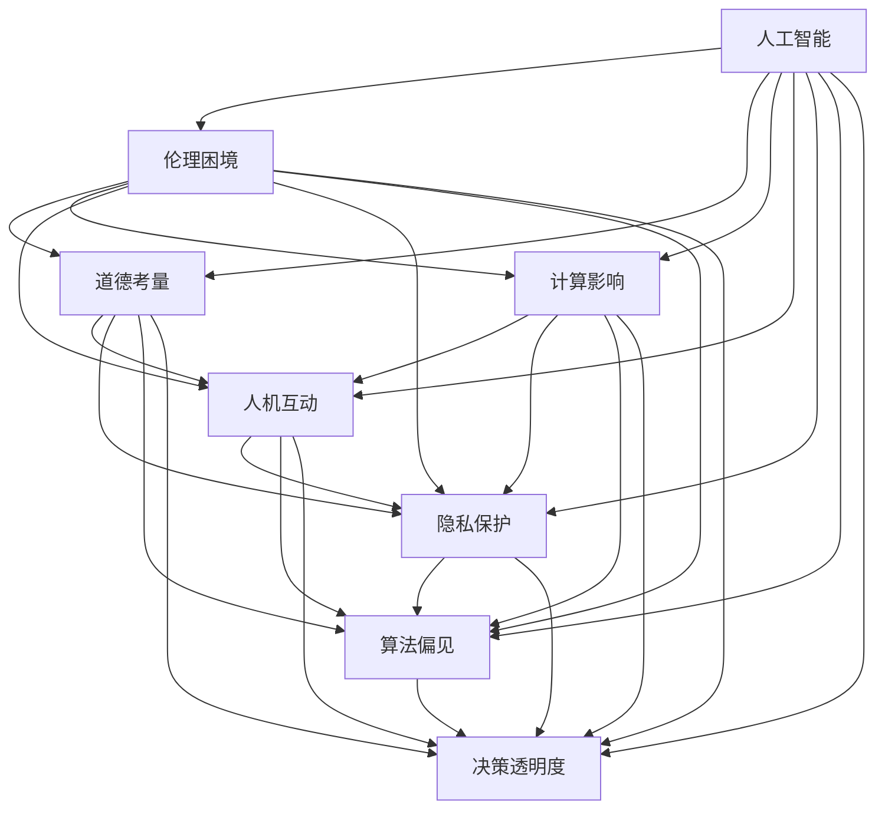

                 

# 伦理挑战：探讨人类计算带来的道德困境

> 关键词：人工智能, 伦理困境, 道德考量, 计算影响, 人机互动, 隐私保护, 算法偏见, 决策透明度

## 1. 背景介绍

随着人工智能(AI)技术的迅猛发展，人类计算在各个领域的影响愈发显著。从医疗诊断到金融风控，从自动驾驶到智能家居，AI算法在提供便利的同时，也引发了一系列复杂的伦理道德问题。本文将探讨这些道德困境的来源，并提出相应的解决策略，以期促进AI技术的健康、可持续发展。

### 1.1 背景概述

人工智能的进步使得机器可以模拟人类的认知和决策过程，从而在医疗、金融、交通、教育等多个领域大放异彩。然而，随着算法的不断深入应用，一些负面效应也逐渐显现，如算法偏见、数据隐私、决策透明度等问题，引发了广泛的社会关注和学术讨论。如何在享受AI带来的便利的同时，确保其符合伦理道德规范，成为当下亟需解决的关键问题。

### 1.2 伦理困境的典型案例

1. **医疗诊断**：AI算法在癌症筛查、病历分析等方面展现了强大的能力，但同时也被发现存在对不同种族、性别的诊断偏差。例如，2019年的一项研究发现，AI在皮肤癌筛查中对女性患者存在较高的误诊率，其表现远不如在男性患者上的表现。
2. **金融风控**：AI在金融行业被广泛应用于信用评估、贷款审批等环节，但算法偏见问题也凸显了出来。有研究表明，AI信贷评估模型对黑人和女性客户的拒绝率较高，引发了公众对于算法公平性的担忧。
3. **自动驾驶**：自动驾驶技术在提高道路安全、减少交通拥堵等方面具有巨大潜力，但同样涉及诸多伦理道德问题。例如，在自动驾驶车辆面对不可避免的交通事故时，如何选择最优的紧急避险策略，是伦理学家和工程师共同关心的焦点。

这些案例揭示了AI技术在应用过程中可能带来的伦理道德困境，需要在技术开发、部署和监管等方面进行全方位的考量。

## 2. 核心概念与联系

### 2.1 核心概念概述

要深入探讨人工智能带来的道德困境，首先需要理解以下核心概念：

1. **人工智能**：利用算法和数据，使机器能够模拟人类认知和决策过程的技术。包括机器学习、深度学习、自然语言处理等子领域。
2. **伦理困境**：在AI应用过程中，算法决策带来的道德选择难题，如算法偏见、隐私泄露、决策透明性等。
3. **道德考量**：在AI应用中，必须考虑的伦理原则，如公正、透明、尊重、责任等。
4. **计算影响**：AI技术对社会、经济、文化等方面的广泛影响。
5. **人机互动**：AI算法与人类之间的互动方式和关系。
6. **隐私保护**：保护个人数据不被滥用，确保数据安全。
7. **算法偏见**：算法在数据训练过程中吸收了数据中的偏见，导致决策的不公。
8. **决策透明度**：AI系统决策过程的清晰度和可解释性。

这些概念相互交织，构成了AI伦理挑战的复杂网络。通过理解这些概念的内涵和关系，我们可以更好地把握AI技术的伦理边界。

### 2.2 核心概念的联系

这些核心概念通过以下关系网联系起来：



这个图表展示了人工智能与伦理道德之间的相互关系。人工智能的发展不仅带来了技术进步，还带来了诸多伦理道德挑战，需要通过多方协同来共同应对。

## 3. 核心算法原理 & 具体操作步骤

### 3.1 算法原理概述

人工智能的伦理挑战主要源于算法的决策机制。在机器学习中，决策通常基于训练数据的分布特征，但数据中可能蕴含的偏见、噪声、信息不平衡等问题，会导致算法输出不公平、不透明的决策。

### 3.2 算法步骤详解

1. **数据采集与预处理**：收集与任务相关的数据，并对数据进行清洗、标准化、归一化等预处理，确保数据质量。
2. **模型训练**：使用机器学习算法，如决策树、随机森林、神经网络等，在预处理后的数据上进行模型训练。
3. **模型评估与优化**：通过交叉验证、网格搜索等方法，评估模型性能，并根据评估结果优化模型参数。
4. **部署与监控**：将训练好的模型部署到实际应用中，并持续监控其运行状态，确保模型的稳定性和正确性。

### 3.3 算法优缺点

**优点**：
1. **高效性**：机器学习算法能够快速处理大量数据，提供准确的决策支持。
2. **自动化**：自动化的模型训练和部署流程，减少了人工干预。
3. **适应性**：可以根据新数据不断更新模型，提高决策的及时性。

**缺点**：
1. **算法偏见**：数据中的偏见可能导致算法输出不公平的结果。
2. **数据隐私**：数据采集和处理过程中可能泄露用户隐私。
3. **决策不透明**：黑盒模型难以解释其决策过程，缺乏透明度。
4. **模型泛化性**：模型在训练数据和实际应用场景中的表现可能不一致。

### 3.4 算法应用领域

人工智能在医疗、金融、教育、司法等多个领域都有广泛应用，但也面临着特定的伦理道德挑战。

1. **医疗领域**：AI在疾病诊断、治疗方案推荐等方面表现出色，但也需关注算法偏见、决策透明度等问题。
2. **金融领域**：AI在信用评估、风险控制等方面有较大潜力，但也需确保算法的公平性和透明度。
3. **教育领域**：AI在个性化教学、学习推荐等方面有较大潜力，但也需注意数据隐私和算法偏见。
4. **司法领域**：AI在案件分析、法律文书生成等方面有较大潜力，但也需确保算法的公正性和责任性。

## 4. 数学模型和公式 & 详细讲解 & 举例说明

### 4.1 数学模型构建

在机器学习中，决策过程通常由以下公式描述：

$$
\hat{y} = f(x; \theta)
$$

其中，$\hat{y}$ 表示模型的预测结果，$x$ 表示输入特征，$\theta$ 表示模型参数，$f$ 表示预测函数。

### 4.2 公式推导过程

以线性回归为例，其预测公式为：

$$
\hat{y} = \theta_0 + \theta_1 x_1 + \theta_2 x_2 + \ldots + \theta_n x_n
$$

其中，$\theta_0$ 为截距，$\theta_1, \theta_2, \ldots, \theta_n$ 为各个特征的权重。

在实际应用中，我们需要通过训练数据来估计模型参数 $\theta$，使其最大化预测结果与实际结果的拟合度，即最小化均方误差（Mean Squared Error, MSE）：

$$
\min_{\theta} \frac{1}{N} \sum_{i=1}^N (y_i - \hat{y}_i)^2
$$

其中，$y_i$ 为实际结果，$\hat{y}_i$ 为模型预测结果。

### 4.3 案例分析与讲解

假设有一组数据集，包含患者的年龄、性别、血压、胆固醇等特征，以及其是否患有心脏病的真实结果。我们可以通过机器学习算法构建一个预测模型，预测新患者是否患有心脏病。在训练过程中，如果发现模型对某一性别或年龄段的预测准确率较低，可能需要重新调整特征选择或模型结构，以提高模型公平性和泛化性。

## 5. 项目实践：代码实例和详细解释说明

### 5.1 开发环境搭建

1. 安装Python 3.8及以上版本，并配置好相应的环境。
2. 安装必要的依赖包，如Scikit-learn、TensorFlow、PyTorch等。
3. 准备训练数据集和测试数据集，并进行预处理。

### 5.2 源代码详细实现

以下是一个简单的线性回归模型实现：

```python
import numpy as np
from sklearn.linear_model import LinearRegression
from sklearn.model_selection import train_test_split
from sklearn.metrics import mean_squared_error

# 准备数据
X = np.array([[0, 0], [1, 1], [2, 2], [3, 3], [4, 4], [5, 5]])
y = np.array([0, 1, 0, 1, 0, 1])

# 分割数据集
X_train, X_test, y_train, y_test = train_test_split(X, y, test_size=0.2, random_state=42)

# 构建模型
model = LinearRegression()

# 训练模型
model.fit(X_train, y_train)

# 预测结果
y_pred = model.predict(X_test)

# 评估模型
mse = mean_squared_error(y_test, y_pred)
print(f"Mean Squared Error: {mse}")
```

### 5.3 代码解读与分析

在上述代码中，我们首先准备了数据集，并使用Scikit-learn库的`train_test_split`方法将其分割为训练集和测试集。然后，我们使用`LinearRegression`类构建线性回归模型，并使用训练集数据进行模型训练。最后，我们使用测试集数据进行预测，并使用均方误差评估模型性能。

## 6. 实际应用场景

### 6.1 医疗领域

在医疗领域，AI算法被广泛应用于疾病诊断、治疗方案推荐等方面。但同时也存在算法偏见、决策不透明等问题。例如，AI在癌症筛查中对女性患者存在较高的误诊率，其表现远不如在男性患者上的表现，这可能是由于训练数据中性别不均衡导致的。

为解决这一问题，可以采用以下策略：

1. **数据平衡**：确保训练数据中不同性别的样本数量均衡，避免数据不平衡导致的偏见。
2. **算法优化**：使用更复杂模型结构，如梯度提升树、神经网络等，提高模型的泛化能力。
3. **解释性增强**：通过LIME、SHAP等工具，提高模型的解释性，确保决策透明。

### 6.2 金融领域

在金融领域，AI算法被广泛应用于信用评估、贷款审批等环节，但算法偏见问题也凸显了出来。例如，AI信贷评估模型对黑人和女性客户的拒绝率较高，引发了公众对于算法公平性的担忧。

为解决这一问题，可以采用以下策略：

1. **数据清洗**：删除含有种族、性别偏见的训练数据，确保数据质量。
2. **公平性约束**：在模型训练过程中，加入公平性约束，确保不同群体的决策结果接近。
3. **算法透明**：使用可解释性较强的模型，如决策树、规则引擎等，提高决策透明度。

### 6.3 教育领域

在教育领域，AI算法被广泛应用于个性化教学、学习推荐等方面。但同时也需注意数据隐私和算法偏见问题。例如，AI系统对低收入家庭学生的推荐资源较少，可能加剧教育不平等。

为解决这一问题，可以采用以下策略：

1. **隐私保护**：采用差分隐私、联邦学习等技术，保护学生隐私。
2. **公平性调整**：在模型训练过程中，加入公平性调整，确保不同背景学生获得同等机会。
3. **模型透明**：使用可解释性较强的模型，如基于规则的推荐系统，提高推荐过程的透明度。

### 6.4 司法领域

在司法领域，AI算法被广泛应用于案件分析、法律文书生成等方面，但也需确保算法的公正性和责任性。例如，AI在判决过程中可能存在歧视性，对少数族裔的判决结果不公正。

为解决这一问题，可以采用以下策略：

1. **算法审查**：引入独立第三方进行算法审查，确保算法的公正性。
2. **透明度提高**：使用可解释性较强的模型，如基于规则的决策系统，提高判决过程的透明度。
3. **责任明确**：在算法设计中，明确责任分配，确保决策过程的公正性和可追溯性。

## 7. 工具和资源推荐

### 7.1 学习资源推荐

1. **《人工智能伦理》课程**：斯坦福大学开设的伦理课程，涵盖人工智能伦理的核心问题，如算法偏见、隐私保护等。
2. **《机器学习实战》书籍**：讲解机器学习算法及其应用，包含数据预处理、模型评估、伦理考量等章节。
3. **《人工智能伦理标准》报告**：IEEE等机构发布的伦理标准，为人工智能应用提供指导和参考。
4. **《机器学习》书籍**：讲解机器学习算法及其应用，包含数据处理、模型训练、决策透明性等章节。

### 7.2 开发工具推荐

1. **Scikit-learn**：Python机器学习库，包含多种机器学习算法及其实现。
2. **TensorFlow**：Google开发的深度学习框架，支持多种深度学习算法及其优化。
3. **PyTorch**：Facebook开发的深度学习框架，支持动态计算图和深度学习算法。
4. **DataRobot**：自动机器学习平台，自动进行数据准备、模型训练和模型部署。

### 7.3 相关论文推荐

1. **《公平机器学习：挑战与对策》**：探讨公平机器学习的方法和挑战，提出多角度解决方案。
2. **《可解释性机器学习：理论与实践》**：讲解机器学习模型及其可解释性，提出多种可解释性方法。
3. **《隐私保护在人工智能中的挑战与对策》**：探讨隐私保护在人工智能中的应用，提出多种隐私保护技术。
4. **《深度学习伦理与可解释性》**：讨论深度学习算法的伦理问题和可解释性，提出多种解决方案。

## 8. 总结：未来发展趋势与挑战

### 8.1 总结

本文系统探讨了人工智能在应用过程中面临的伦理道德挑战，从算法偏见、数据隐私、决策透明度等方面进行了详细分析。通过理解这些伦理困境的来源和解决方法，可以更好地指导AI技术的开发和应用，确保其符合伦理道德规范。

### 8.2 未来发展趋势

未来，人工智能伦理将更加受到重视，其发展趋势如下：

1. **伦理标准的制定**：全球范围内将制定更加严格的人工智能伦理标准，确保技术的公平、透明和责任性。
2. **算法透明化**：使用可解释性较强的模型，确保决策过程的透明和可追溯。
3. **隐私保护技术**：隐私保护技术将不断进步，确保个人数据的保护。
4. **伦理审查机制**：建立独立的伦理审查机制，对AI系统进行监督和评估。
5. **跨学科合作**：伦理学家、数据科学家、政策制定者等多方协同，共同推动AI技术的健康发展。

### 8.3 面临的挑战

尽管人工智能伦理问题已经得到了一定的关注，但仍面临诸多挑战：

1. **伦理标准缺乏统一**：不同国家和组织对AI伦理的定义和标准存在差异，缺乏统一的标准。
2. **技术复杂性**：AI算法复杂，难以在短时间内找到完美的解决方案。
3. **数据质量问题**：数据质量问题可能导致算法偏见，进而影响决策的公正性。
4. **监管难度**：AI系统的自动化程度高，监管难度大，容易出现漏洞。
5. **公众认知不足**：公众对AI技术的认知不足，可能引发误解和恐慌。

### 8.4 研究展望

未来，需要从以下几个方面进一步研究人工智能伦理：

1. **伦理标准制定**：制定更加全面和统一的AI伦理标准，推动全球协同。
2. **技术创新**：开发更公平、透明、可解释的AI算法，提高算法的伦理水平。
3. **数据治理**：加强数据质量控制，确保数据来源的多样性和公平性。
4. **监管机制**：建立健全的AI监管机制，确保AI系统的公平和透明。
5. **公众教育**：加强公众对AI技术的认知，提升社会对AI伦理问题的关注度。

## 9. 附录：常见问题与解答

### 附录

1. **问：人工智能是否存在伦理困境？**
   答：是的，人工智能在应用过程中面临诸多伦理道德问题，如算法偏见、数据隐私、决策透明度等。

2. **问：如何解决算法偏见问题？**
   答：可以通过数据清洗、公平性约束、算法优化等方法来解决算法偏见问题。

3. **问：如何保护用户隐私？**
   答：可以采用差分隐私、联邦学习等技术来保护用户隐私。

4. **问：如何提高决策透明度？**
   答：可以通过LIME、SHAP等工具来提高决策透明度，确保模型输出具有可解释性。

5. **问：未来人工智能伦理将如何发展？**
   答：未来人工智能伦理将更加受到重视，伦理标准的制定、算法透明化、隐私保护技术、伦理审查机制、跨学科合作等都将成为重要发展方向。

---

作者：禅与计算机程序设计艺术 / Zen and the Art of Computer Programming

