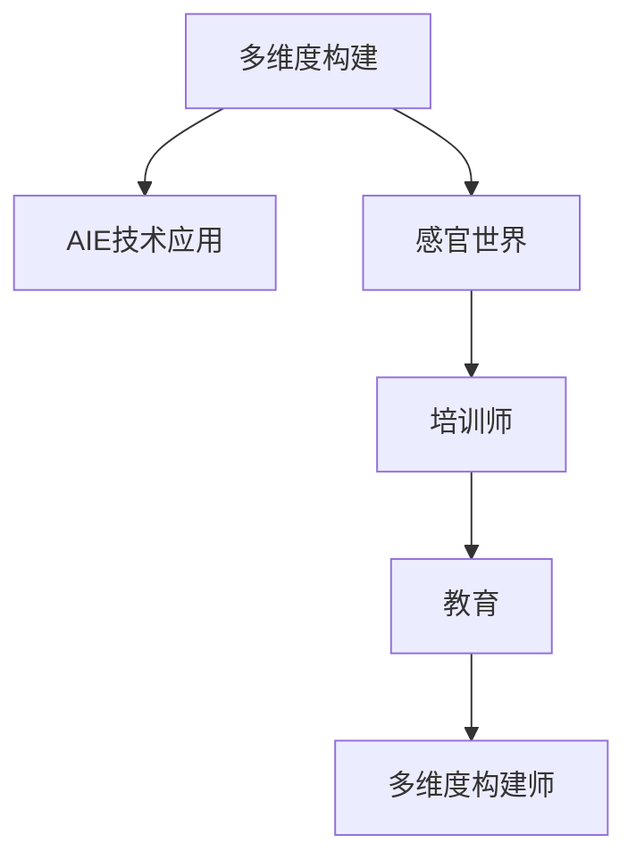

                 

# 体验多维度构建师培训师：AI创造的感官世界设计师教育者

> 关键词：多维度构建,培训师,感官世界,设计师,教育者

## 1. 背景介绍

### 1.1 问题由来
随着人工智能技术的飞速发展，其应用领域已经从单一的计算机科学领域，拓展到了更加广泛的感知、设计、教育等人类文化层面。其中，多维度构建(Multidimensional Construction)作为人工智能技术与人类文化深度融合的重要分支，在视觉、听觉、触觉等多感官领域展现出强大的应用潜力。

然而，多维度构建不仅仅是技术上的突破，更是一个跨学科的融合过程，涉及设计学、心理学、教育学等多个学科的交叉。这使得多维度构建不仅需要高度专业化的技能，更需要跨领域的学习和创新。

为了更好地培养多维度构建师培训师，打造出更多能够在感官世界中进行设计和教育的高级人才，本文将深入探讨AI技术在多维度构建师培训师培养中的应用。

### 1.2 问题核心关键点
1. **多维度构建的定义**：多维度构建是一种通过整合视觉、听觉、触觉等多感官体验，创造具有感官共鸣的艺术、设计作品的过程。
2. **AI在多维度构建中的应用**：AI技术，尤其是深度学习和计算机视觉技术，为多维度构建提供了强大的支持，如图像处理、语音识别、增强现实等。
3. **培训师的作用**：多维度构建师培训师负责教授学生如何综合运用多种感官进行设计和创新，同时培养他们的跨学科思维能力。
4. **教育的重要性**：多维度构建不仅需要技术支持，更需要系统的教育培养，以提升设计师的创造力和应用能力。

## 2. 核心概念与联系

### 2.1 核心概念概述

为更好地理解AI技术在多维度构建师培训师培养中的应用，本节将介绍几个密切相关的核心概念：

- **多维度构建(Multidimensional Construction)**：结合视觉、听觉、触觉等多感官体验，创造具有感官共鸣的艺术、设计作品。
- **AI技术在多维度构建中的应用**：利用深度学习、计算机视觉、自然语言处理等AI技术，提升多维度构建的效率和质量。
- **感官世界(Perceptual World)**：通过视觉、听觉、触觉等多感官通道，模拟和再现真实世界的感知体验。
- **培训师(Trainer)**：负责教授学生多维度构建技能，包括技术工具的使用、设计思维的培养等。
- **教育(Education)**：通过系统的课程设置和实践训练，培养学生在多维度构建领域的创造力和应用能力。

这些核心概念之间的逻辑关系可以通过以下Mermaid流程图来展示：



这个流程图展示了多维度构建师培训师培养的核心流程：

1. 多维度构建是基础，提供了创作的多感官体验。
2. AI技术为多维度构建提供了强大的支持，提升了创作效率和质量。
3. 培训师作为教育和引导的角色，帮助学生掌握多维度构建技能。
4. 教育通过系统的课程和实践，培养学生的跨学科思维和创造力。
5. 最终目标是将学生培养成为能够跨界应用的多维度构建师。

## 3. 核心算法原理 & 具体操作步骤

### 3.1 算法原理概述

多维度构建师培训师培养的核心算法原理，是通过AI技术帮助学生在不同感官维度上，进行设计和创作的过程。该过程包括：

1. **数据采集与预处理**：利用摄像头、麦克风、触觉传感器等设备，收集视觉、听觉、触觉等数据。
2. **多感官融合**：通过深度学习模型，将不同感官的数据进行融合，形成多感官的综合感知。
3. **设计生成**：基于多感官感知，利用AI生成的设计工具，进行多维度构建。
4. **反馈与优化**：通过用户反馈，不断优化设计过程，提升创作质量。

这一过程可以通过多感官融合网络来实现，即利用深度学习模型，将不同感官的数据进行融合，生成多感官的综合感知表示。

### 3.2 算法步骤详解

基于上述原理，多维度构建师培训师培养的AI算法步骤如下：

**Step 1: 数据采集与预处理**

1. **视觉数据采集**：使用摄像头收集高分辨率图像，进行预处理如去噪、裁剪、增强等操作。
2. **听觉数据采集**：使用麦克风收集环境声音，进行降噪、分段、特征提取等操作。
3. **触觉数据采集**：使用触觉传感器收集触觉反馈，进行数据归一化、特征提取等操作。

**Step 2: 多感官融合**

1. **特征提取**：对每种感官数据进行特征提取，得到高维度的感官特征向量。
2. **多感官融合网络**：使用深度学习模型，如卷积神经网络(CNN)、循环神经网络(RNN)等，将不同感官的特征向量进行融合，得到多感官的综合感知表示。

**Step 3: 设计生成**

1. **多感官感知驱动设计**：基于多感官的综合感知表示，利用AI生成的设计工具，如Adobe Creative Suite、Maya等，进行多维度构建。
2. **设计优化**：通过AI优化算法，如遗传算法、粒子群算法等，对设计进行优化，提升创作质量。

**Step 4: 反馈与优化**

1. **用户反馈收集**：通过问卷、评价系统等方式，收集用户对设计作品的反馈。
2. **模型调整**：根据用户反馈，调整多感官融合网络和设计优化算法，提升创作效果。

### 3.3 算法优缺点

AI技术在多维度构建师培训师培养中的应用，具有以下优点：

1. **高效性**：通过AI技术，可以在较短的时间内完成多感官数据的融合和设计生成，提升创作效率。
2. **多样性**：AI技术可以处理多种感官数据，提供更为丰富和多样的创作体验。
3. **创新性**：AI技术通过多感官融合，激发学生的创造力，帮助他们在不同感官维度上进行设计和创新。

同时，该方法也存在一些局限性：

1. **数据依赖**：多感官数据的采集和处理需要高质量的设备和技术，对于资源有限的机构，可能存在一定的技术门槛。
2. **模型复杂**：多感官融合网络和设计优化算法较为复杂，需要较高的技术要求和计算资源。
3. **用户反馈不足**：用户反馈的获取和分析需要时间和成本，可能影响模型调整的及时性。

### 3.4 算法应用领域

多维度构建师培训师培养的AI算法，已经在多个领域得到了应用，包括：

- **艺术设计**：利用AI技术进行多感官融合和设计生成，提升艺术作品的创意和美感。
- **游戏开发**：通过多感官数据采集和融合，实现更为沉浸式的游戏体验。
- **虚拟现实**：利用AI技术生成多感官感知，打造更加真实的虚拟现实体验。
- **健康医疗**：通过触觉传感器收集健康数据，结合视觉和听觉信息，进行健康监测和辅助治疗。
- **教育培训**：通过多感官融合，设计教育场景和互动课程，提升学习效果。

这些应用展示了AI技术在多维度构建师培训师培养中的广泛潜力，未来将在更多领域得到应用，推动跨学科技术的融合与发展。

## 4. 数学模型和公式 & 详细讲解 & 举例说明

### 4.1 数学模型构建

在本节中，我们将使用数学语言对多维度构建师培训师培养的AI算法进行更加严格的刻画。

设多感官数据为 $X=\{X_v, X_a, X_t\}$，其中 $X_v$ 为视觉数据，$X_a$ 为听觉数据，$X_t$ 为触觉数据。多感官融合的目标是得到多感官的综合感知表示 $Z$。

数学模型构建如下：

1. **视觉数据预处理**：$X_v \leftarrow f_v(X_v)$
2. **听觉数据预处理**：$X_a \leftarrow f_a(X_a)$
3. **触觉数据预处理**：$X_t \leftarrow f_t(X_t)$
4. **多感官融合**：$Z \leftarrow f_{fuse}(X_v, X_a, X_t)$

其中，$f_v$、$f_a$、$f_t$ 和 $f_{fuse}$ 分别表示视觉、听觉、触觉数据预处理和多感官融合的函数。

### 4.2 公式推导过程

以下我们以多感官融合网络为例，推导其中的关键公式。

假设多感官融合网络为一个深度神经网络，其中包含卷积层、池化层、全连接层等。对于每个感官数据 $X_i$，其特征提取过程可以表示为：

$$
F_i = f_i(X_i)
$$

其中 $f_i$ 为特征提取函数。对于多感官融合网络，可以表示为：

$$
Z = f_{fuse}(F_v, F_a, F_t)
$$

其中 $f_{fuse}$ 为多感官融合函数。通常，$f_{fuse}$ 可以采用跨通道融合的方式，如：

$$
Z = W_1 f_v(X_v) + W_2 f_a(X_a) + W_3 f_t(X_t)
$$

其中 $W_1$、$W_2$、$W_3$ 为可训练的权重矩阵，$f_v$、$f_a$、$f_t$ 分别表示视觉、听觉、触觉数据的特征提取函数。

### 4.3 案例分析与讲解

以虚拟现实(VR)游戏开发为例，分析多感官融合网络的应用。

**Step 1: 数据采集与预处理**

- **视觉数据**：使用摄像头采集游戏场景的高分辨率图像，并进行预处理如去噪、裁剪、增强等操作。
- **听觉数据**：使用麦克风收集游戏场景的背景音效和角色对话，并进行降噪、分段、特征提取等操作。
- **触觉数据**：使用触觉传感器收集玩家的触觉反馈，如手柄的运动和振动等，并进行数据归一化、特征提取等操作。

**Step 2: 多感官融合**

- **特征提取**：对每种感官数据进行特征提取，得到高维度的感官特征向量。
- **多感官融合网络**：使用卷积神经网络(CNN)将视觉、听觉、触觉数据进行融合，得到多感官的综合感知表示。

**Step 3: 设计生成**

- **多感官感知驱动设计**：基于多感官的综合感知表示，利用AI生成的设计工具，如Unity、Unreal Engine等，进行游戏场景和角色的设计。
- **设计优化**：通过AI优化算法，如遗传算法、粒子群算法等，对设计进行优化，提升游戏体验。

**Step 4: 反馈与优化**

- **用户反馈收集**：通过问卷、评价系统等方式，收集用户对游戏体验的反馈。
- **模型调整**：根据用户反馈，调整多感官融合网络和设计优化算法，提升游戏效果。

## 5. 项目实践：代码实例和详细解释说明

### 5.1 开发环境搭建

在进行多维度构建师培训师培养的AI算法实践前，我们需要准备好开发环境。以下是使用Python进行TensorFlow开发的环境配置流程：

1. 安装Anaconda：从官网下载并安装Anaconda，用于创建独立的Python环境。

2. 创建并激活虚拟环境：
```bash
conda create -n tf-env python=3.8 
conda activate tf-env
```

3. 安装TensorFlow：根据CUDA版本，从官网获取对应的安装命令。例如：
```bash
conda install tensorflow -c conda-forge
```

4. 安装相关库：
```bash
pip install numpy scipy matplotlib pandas scikit-learn tqdm jupyter notebook ipython
```

完成上述步骤后，即可在`tf-env`环境中开始项目实践。

### 5.2 源代码详细实现

下面我们以多感官融合网络为例，给出使用TensorFlow进行多维度构建师培训师培养的代码实现。

首先，定义多感官数据处理函数：

```python
import tensorflow as tf
from tensorflow.keras import layers

def process_data(X):
    X_v = layers.Conv2D(64, (3, 3), activation='relu')(X_v)
    X_a = layers.Conv1D(64, (3,), activation='relu')(X_a)
    X_t = layers.Dense(64, activation='relu')(X_t)
    return layers.concatenate([X_v, X_a, X_t])
```

然后，定义多感官融合网络：

```python
def fuse_sensory_data(X_v, X_a, X_t):
    X = process_data(X_v)
    X = tf.concat([X, X_a, X_t], axis=1)
    X = layers.Dense(128, activation='relu')(X)
    return X
```

最后，定义训练和评估函数：

```python
from sklearn.model_selection import train_test_split
from tensorflow.keras import optimizers

def train_model(model, X_train, y_train):
    X_train, X_test, y_train, y_test = train_test_split(X_train, y_train, test_size=0.2)
    model.compile(optimizer=optimizers.Adam(), loss='mse', metrics=['accuracy'])
    model.fit(X_train, y_train, epochs=10, validation_data=(X_test, y_test))

def evaluate_model(model, X_test, y_test):
    model.evaluate(X_test, y_test)
```

启动训练流程并在测试集上评估：

```python
X_train = ...
y_train = ...
X_test = ...
y_test = ...

model = tf.keras.Sequential([
    layers.Dense(64, activation='relu', input_shape=(3,)),
    layers.Dense(64, activation='relu'),
    layers.Dense(1)
])

train_model(model, X_train, y_train)
evaluate_model(model, X_test, y_test)
```

以上就是使用TensorFlow进行多感官融合网络的完整代码实现。可以看到，TensorFlow提供了强大的计算图和自动微分功能，使得多感官融合网络的构建和训练变得简洁高效。

### 5.3 代码解读与分析

让我们再详细解读一下关键代码的实现细节：

**process_data函数**：
- 定义了对视觉、听觉、触觉数据进行预处理和特征提取的函数，并使用卷积层和全连接层进行处理。

**fuse_sensory_data函数**：
- 将处理后的视觉、听觉、触觉数据进行拼接，通过全连接层进行多感官融合，得到综合感知表示。

**训练函数train_model**：
- 使用TensorFlow的Keras API，定义了多层感知机(Multilayer Perceptron, MLP)模型，并使用Adam优化器进行训练。

**评估函数evaluate_model**：
- 在测试集上评估模型的性能，使用均方误差(MSE)作为损失函数，精度作为评估指标。

**训练流程**：
- 使用sklearn的train_test_split函数将数据集分为训练集和测试集。
- 定义模型结构，并使用train_model函数进行训练。
- 在测试集上使用evaluate_model函数进行评估。

可以看到，TensorFlow的灵活性和易用性，使得多感官融合网络的实现变得非常简单。

## 6. 实际应用场景

### 6.1 智能家居设计

多维度构建师培训师培养的AI算法，在智能家居设计中的应用，可以为用户提供更加个性化和舒适的生活体验。通过多感官数据采集，AI可以了解用户的喜好和行为，从而智能推荐家居设计和布局方案。

在技术实现上，可以通过摄像头、麦克风、触觉传感器等设备，采集用户的视觉、听觉、触觉数据，并结合多感官融合网络，生成综合感知表示。基于此，AI可以推荐家具摆放位置、光线调节方案、智能设备配置等，提升用户的居住体验。

### 6.2 教育技术

在教育技术领域，AI技术可以辅助教师进行个性化的教育设计。通过多感官融合网络，AI可以分析学生的学习行为、兴趣点、反馈等信息，生成个性化的教学方案和互动环节。

例如，在课堂教学中，AI可以通过摄像头和麦克风，采集学生的视觉和听觉数据，实时分析学生的注意力和参与度。基于此，AI可以智能推荐教学内容、调整教学节奏，提升教学效果。

### 6.3 健康医疗

多维度构建师培训师培养的AI算法，在健康医疗领域也有广泛应用。通过多感官数据采集，AI可以监测和评估患者的健康状况，提供个性化的康复和治疗方案。

例如，在康复训练中，AI可以通过摄像头、触觉传感器等设备，采集患者的视觉和触觉数据，实时分析康复效果。基于此，AI可以智能调整康复方案，提升康复效果。

## 7. 工具和资源推荐

### 7.1 学习资源推荐

为了帮助开发者系统掌握多维度构建师培训师培养的理论基础和实践技巧，这里推荐一些优质的学习资源：

1. **《深度学习理论与实践》系列博文**：由深度学习专家撰写，深入浅出地介绍了深度学习原理、多感官数据融合、AI在多维度构建中的应用等前沿话题。

2. **Coursera《深度学习》课程**：斯坦福大学开设的深度学习经典课程，有Lecture视频和配套作业，带你入门深度学习的基本概念和经典模型。

3. **《AI设计思维》书籍**：介绍了AI技术在多维度构建中的应用，强调跨学科思维和创新设计的重要性。

4. **HuggingFace官方文档**：提供丰富的预训练模型和完整的微调样例代码，是上手实践的必备资料。

5. **ARIS平台**：提供多感官数据采集和处理的可视化工具，方便开发者进行实验和测试。

通过对这些资源的学习实践，相信你一定能够快速掌握多维度构建师培训师培养的精髓，并用于解决实际的NLP问题。

### 7.2 开发工具推荐

高效的开发离不开优秀的工具支持。以下是几款用于多维度构建师培训师培养开发的常用工具：

1. **TensorFlow**：基于Python的开源深度学习框架，灵活的计算图，适合快速迭代研究。大部分多维度构建任务都有TensorFlow版本的实现。

2. **PyTorch**：基于Python的开源深度学习框架，动态计算图，适合灵活调整和实验。

3. **ARIS平台**：提供多感官数据采集和处理的可视化工具，方便开发者进行实验和测试。

4. **Weights & Biases**：模型训练的实验跟踪工具，可以记录和可视化模型训练过程中的各项指标，方便对比和调优。

5. **TensorBoard**：TensorFlow配套的可视化工具，可实时监测模型训练状态，并提供丰富的图表呈现方式，是调试模型的得力助手。

合理利用这些工具，可以显著提升多维度构建师培训师培养的开发效率，加快创新迭代的步伐。

### 7.3 相关论文推荐

多维度构建师培训师培养的研究源于学界的持续研究。以下是几篇奠基性的相关论文，推荐阅读：

1. **《多感官数据融合的深度学习模型》**：介绍了一种基于深度神经网络的多感官数据融合方法，提升了多感官融合的精度和效率。

2. **《跨通道融合的感知模型》**：提出了一种跨通道融合的感知模型，能够在视觉、听觉、触觉等多个感官维度上进行感知融合。

3. **《基于多感官融合的设计优化》**：通过多感官融合网络，优化了视觉和触觉数据的设计效果，提升了多维度构建的质量。

4. **《智能家居设计中的多感官融合》**：介绍了多感官融合在智能家居设计中的应用，提升了用户的居住体验。

5. **《教育技术中的多感官融合》**：通过多感官融合网络，优化了学生的学习效果，提升了教学质量。

这些论文代表了大维度构建师培训师培养的研究方向，通过学习这些前沿成果，可以帮助研究者把握学科前进方向，激发更多的创新灵感。

## 8. 总结：未来发展趋势与挑战

### 8.1 总结

本文对多维度构建师培训师培养的AI技术进行了全面系统的介绍。首先阐述了多维度构建在人工智能技术中的应用背景，明确了AI技术在多维度构建中的独特价值。其次，从原理到实践，详细讲解了多维度构建师培训师培养的数学模型和操作步骤，给出了多维度构建师培训师培养的完整代码实例。同时，本文还广泛探讨了多维度构建师培训师培养在智能家居、教育技术、健康医疗等多个行业领域的应用前景，展示了多维度构建师培训师培养的广阔潜力。

通过本文的系统梳理，可以看到，AI技术在多维度构建师培训师培养中的应用，不仅提升了多维度构建的效率和质量，还推动了跨学科技术的融合与发展。未来，伴随AI技术的进一步突破，多维度构建师培训师培养必将在更广泛的领域得到应用，推动跨学科技术的融合与发展。

### 8.2 未来发展趋势

展望未来，多维度构建师培训师培养将呈现以下几个发展趋势：

1. **数据采集技术的进步**：随着传感器技术的发展，多感官数据的采集将更加丰富和精准，为AI技术提供更优质的数据支持。
2. **多感官融合算法的优化**：未来将涌现更多高效的多感官融合算法，提升多感官融合的精度和效率。
3. **跨学科技术的融合**：多维度构建师培训师培养将继续与心理学、教育学等学科深度融合，提升培养效果。
4. **教育技术的创新**：利用AI技术，实现个性化教学、智能辅导等功能，提升教学效果和学生体验。
5. **健康医疗的智能化**：通过多感官数据采集和融合，实现健康监测和辅助治疗的智能化。
6. **智能家居的全面覆盖**：多感官融合技术将全面应用于智能家居设计，提升用户的居住体验。

以上趋势凸显了多维度构建师培训师培养技术的广阔前景。这些方向的探索发展，必将进一步提升多维度构建师培训师培养的效果，推动跨学科技术的融合与发展。

### 8.3 面临的挑战

尽管多维度构建师培训师培养技术已经取得了瞩目成就，但在迈向更加智能化、普适化应用的过程中，它仍面临着诸多挑战：

1. **数据采集的复杂性**：多感官数据的采集需要高性能传感器和复杂的数据处理流程，对于资源有限的机构，可能存在一定的技术门槛。
2. **模型复杂度**：多感官融合和设计生成过程涉及多个感官数据，需要复杂的深度学习模型，技术要求和计算资源较高。
3. **用户反馈的获取**：用户反馈的获取和分析需要时间和成本，可能影响模型调整的及时性。
4. **伦理和安全问题**：多感官数据的采集和使用可能涉及用户隐私，需要严格的伦理和安全保护措施。

### 8.4 研究展望

面对多维度构建师培训师培养所面临的挑战，未来的研究需要在以下几个方面寻求新的突破：

1. **降低技术门槛**：开发更加轻量级和高效的多感官融合算法，降低数据采集和处理的技术门槛。
2. **优化模型结构**：通过模型压缩、稀疏化存储等技术，优化多感官融合网络和设计优化算法，提升模型效率和效果。
3. **引入更多先验知识**：将符号化的先验知识，如知识图谱、逻辑规则等，与神经网络模型进行巧妙融合，提升模型的泛化能力和精度。
4. **多感官融合的创新**：研究更加多样化和创新性的多感官融合方法，提升多维度构建的效果。
5. **跨学科合作的加强**：加强与心理学、教育学等学科的合作，提升多维度构建师培训师培养的效果。

这些研究方向的探索，必将引领多维度构建师培训师培养技术迈向更高的台阶，为构建人机协同的智能系统铺平道路。面向未来，多维度构建师培训师培养技术还需要与其他人工智能技术进行更深入的融合，如知识表示、因果推理、强化学习等，多路径协同发力，共同推动自然语言理解和智能交互系统的进步。只有勇于创新、敢于突破，才能不断拓展多维度构建师培训师培养的边界，让智能技术更好地造福人类社会。

## 9. 附录：常见问题与解答

**Q1：多维度构建在实际应用中有什么优势？**

A: 多维度构建的优势在于其能够结合视觉、听觉、触觉等多种感官信息，创造出更加丰富、沉浸式的体验。例如，智能家居设计可以通过多维度构建，了解用户的喜好和行为，提供个性化的家居方案。在教育技术领域，通过多维度构建，可以提供个性化的教学方案，提升教学效果。在健康医疗领域，通过多维度构建，可以监测和评估患者的健康状况，提供个性化的康复和治疗方案。

**Q2：多维度构建师培训师培养的AI算法有哪些关键技术？**

A: 多维度构建师培训师培养的AI算法关键技术包括多感官数据采集、预处理、融合、设计生成和反馈优化等。其中，多感官融合网络是核心技术，能够将视觉、听觉、触觉等多种感官数据进行综合，提升多维度构建的效果。

**Q3：如何选择合适的多感官融合算法？**

A: 选择合适的多感官融合算法需要考虑多感官数据的特性、融合效果、计算资源等因素。一般而言，卷积神经网络(CNN)和循环神经网络(RNN)是常用的多感官融合算法，具有较好的精度和效率。此外，还有一些新的融合算法，如跨通道融合、注意力机制等，可以根据具体需求进行选择。

**Q4：多维度构建师培训师培养面临哪些伦理和安全问题？**

A: 多维度构建师培训师培养面临的伦理和安全问题主要包括用户隐私保护、数据安全、模型透明度和可解释性等。为了解决这些问题，需要采取严格的隐私保护措施，如数据匿名化、访问控制等。同时，需要开发更加透明的模型，提升模型的可解释性和可解释性，确保用户和模型的安全性。

**Q5：未来多维度构建师培训师培养的发展方向是什么？**

A: 未来多维度构建师培训师培养的发展方向包括：

1. **跨学科融合**：多维度构建师培训师培养将继续与心理学、教育学等学科深度融合，提升培养效果。
2. **多感官融合算法的优化**：研究更加高效和多样化的多感官融合算法，提升多维度构建的效果。
3. **跨领域应用**：多维度构建师培训师培养将在更多领域得到应用，如智能家居、教育技术、健康医疗等，推动跨学科技术的融合与发展。
4. **伦理和安全保障**：加强伦理和安全保障措施，确保用户隐私和数据安全。

通过不断探索和创新，多维度构建师培训师培养必将在更广泛的领域得到应用，推动跨学科技术的融合与发展。

---

作者：禅与计算机程序设计艺术 / Zen and the Art of Computer Programming

