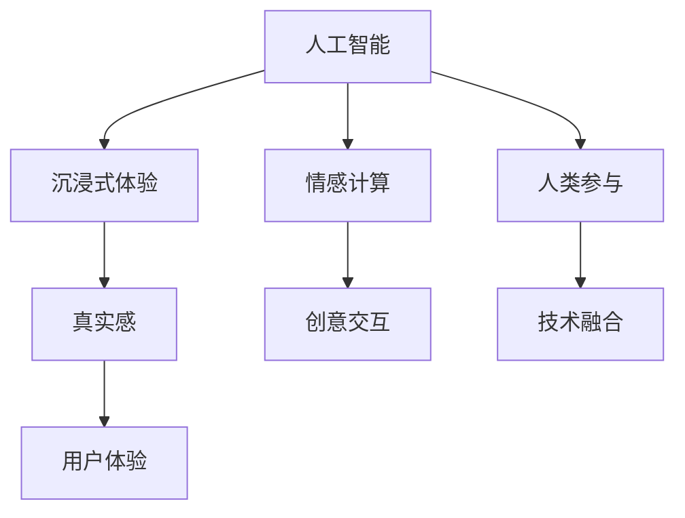

                 

# 体验的真实性：AI时代的authenticity追求

> 关键词：人工智能, 体验设计, 沉浸式, 虚拟现实, 互动式设计, 情感计算, 真实感, 创意交互, 人类参与, 技术融合

## 1. 背景介绍

在当今数字化的时代，人工智能(AI)技术正以惊人的速度渗透到生活的各个方面。从智能家居到自动驾驶，从虚拟助手到增强现实，AI技术在重塑我们的生活方式，并带来前所未有的体验。然而，随着技术的进步，我们不得不面对一个深层次的问题：**如何确保这种技术带来的体验是真实的？**

真实性(Realness)在AI和用户体验(UX)设计中，是一个核心概念。它不仅涉及到用户是否感知到技术的真实存在，也包括了用户在使用过程中是否感受到情感上的真实共鸣。在AI时代，体验的真实性成为了创造令人满意的用户体验的关键所在。

## 2. 核心概念与联系

### 2.1 核心概念概述

1. **人工智能(AI)**：AI技术通过算法和计算能力模拟人类的智能行为，包括学习、推理、感知等能力。
2. **沉浸式体验(Immersive Experience)**：通过虚拟现实(VR)、增强现实(AR)等技术，为用户提供身临其境的体验。
3. **情感计算(Affective Computing)**：通过分析用户的情感反应，AI系统可以提供更加个性化和人性化的服务。
4. **真实感(Realness)**：用户在体验AI系统时所感受到的真实感，包括视觉、听觉、触觉等感官体验。
5. **创意交互(Creative Interaction)**：AI系统通过创造性设计，使用户与系统的互动更加自然和有趣。
6. **人类参与(Human-in-the-Loop)**：在AI系统中引入人类的参与和监督，以提高系统的可靠性和公正性。
7. **技术融合(Convergence)**：将AI技术与其他技术（如VR、AR、物联网等）融合，创造出更加丰富和全面的用户体验。

### 2.2 核心概念原理和架构的 Mermaid 流程图



这个流程图展示了人工智能与其他核心概念之间的联系和相互作用。人工智能是沉浸式体验、情感计算、真实感、创意交互、人类参与和技术融合的基础。这些元素共同作用，为用户提供了一个高度真实和互动的体验。

## 3. 核心算法原理 & 具体操作步骤

### 3.1 算法原理概述

在AI系统中，体验的真实性主要由以下几个方面决定：

1. **数据的质量和多样性**：AI系统需要大量的高质量数据来训练，数据的真实性和多样性直接影响了系统的性能。
2. **模型的复杂度**：模型越复杂，越能捕捉到复杂的模式和关系，从而提高系统的真实感。
3. **交互设计**：通过精心设计的交互界面和流程，可以让用户感受到自然和流畅的体验。
4. **情感反馈机制**：系统能够理解并响应用户的情感状态，提供更加个性化的服务。
5. **实时渲染和处理**：实时渲染和处理能力可以提高系统的响应速度，增强用户体验的真实感。

### 3.2 算法步骤详解

1. **数据收集与预处理**：
   - 收集高质量的多样化数据，确保数据集覆盖不同的场景和情况。
   - 进行数据清洗和标注，去除噪声和错误数据，保证数据的质量。
   - 进行数据增强，通过旋转、缩放等技术扩充数据集。

2. **模型训练**：
   - 选择合适的算法和模型架构，进行训练和调参。
   - 使用正则化技术如L2正则化、Dropout等避免过拟合。
   - 设置合适的学习率和迭代次数，优化训练过程。

3. **系统集成**：
   - 将训练好的模型集成到系统中，进行实时的交互和处理。
   - 设计自然流畅的交互界面和流程，提供友好的用户体验。
   - 实现情感分析模块，根据用户的情感状态调整系统行为。

4. **用户反馈和优化**：
   - 收集用户反馈，通过A/B测试等方法进行迭代优化。
   - 定期更新和重新训练模型，保持系统的最新状态。
   - 引入人类监督和反馈机制，确保系统的公正性和可信度。

### 3.3 算法优缺点

#### 优点：
1. **提升用户体验**：通过真实感的增强，用户能够更加沉浸和享受体验。
2. **提高系统性能**：高质量的数据和复杂的模型能够提高系统的准确性和响应速度。
3. **个性化服务**：通过情感计算，系统能够提供更加个性化的服务，提升用户满意度。

#### 缺点：
1. **数据依赖性强**：高质量数据获取成本高，数据多样性不足可能影响性能。
2. **模型复杂度要求高**：模型越复杂，训练和部署的难度越大。
3. **交互设计挑战**：需要精心设计交互界面，才能提供自然流畅的体验。
4. **情感分析复杂**：情感计算涉及复杂的心理学和语言学知识，实现难度大。
5. **实时处理要求高**：实时渲染和处理需要高性能硬件支持。

### 3.4 算法应用领域

1. **虚拟现实和增强现实**：AI驱动的VR/AR系统可以提供高度沉浸和真实的体验，广泛应用于游戏、教育、医疗等领域。
2. **智能家居和物联网**：通过情感计算和创意交互，AI系统可以提供更加智能和人性化的家居体验。
3. **情感计算应用**：在心理咨询、客户服务、社交网络等领域，AI系统可以分析用户的情感状态，提供更加贴心的服务。
4. **自动驾驶**：AI系统通过实时渲染和处理，为用户提供高度真实和安全的驾驶体验。
5. **智能客服**：通过情感分析和创意交互，AI客服可以提供更加真实和自然的对话体验。
6. **虚拟助手**：通过创意交互和实时渲染，AI虚拟助手可以提供高度自然和互动的体验。

## 4. 数学模型和公式 & 详细讲解 & 举例说明

### 4.1 数学模型构建

在AI系统中，体验的真实性可以通过数学模型来量化和优化。以下是一个简单的模型构建示例：

1. **情感状态模型**：
   - 假设用户的情感状态可以通过一组变量 $E = (e_1, e_2, ..., e_n)$ 来表示，其中 $e_i$ 表示情感维度（如快乐、悲伤、愤怒等）的强度。
   - 模型可以表示为 $E = f(X, Y)$，其中 $X$ 表示用户的行为数据（如文本、语音等），$Y$ 表示环境数据（如时间、地点等）。

2. **情感反馈模型**：
   - 假设系统根据用户的情感状态 $E$ 提供反馈 $F$，模型可以表示为 $F = g(E)$，其中 $g$ 是一个反馈函数，根据用户的情感状态调整系统的行为。

### 4.2 公式推导过程

假设我们有一个简单的情感状态模型 $E = f(X, Y)$，其中 $f$ 是一个线性函数：

$$ E = w_1x_1 + w_2x_2 + ... + w_nx_n + b $$

其中 $x_i$ 是输入变量，$w_i$ 是权重，$b$ 是偏置项。对于情感反馈模型 $F = g(E)$，假设 $g$ 是一个sigmoid函数：

$$ F = \sigma(E) $$

### 4.3 案例分析与讲解

#### 案例：智能客服系统的情感计算

1. **数据收集**：收集客户与客服的对话数据，提取情感标签（如满意、不满意）。
2. **模型训练**：使用情感状态模型 $E = f(X, Y)$ 训练情感状态分类器，其中 $X$ 是对话文本，$Y$ 是情感标签。
3. **情感反馈**：根据情感状态 $E$ 调整客服的行为，如语气、回答速度等。
4. **优化反馈**：通过用户反馈和A/B测试，优化情感反馈模型 $F = g(E)$。

## 5. 项目实践：代码实例和详细解释说明

### 5.1 开发环境搭建

1. **环境安装**：
   - 安装Python 3.8及以上版本。
   - 安装TensorFlow和PyTorch等深度学习库。
   - 安装Numpy、Pandas等数据处理库。

2. **环境配置**：
   - 配置GPU加速（如果需要）。
   - 配置虚拟环境，使用conda管理依赖。

### 5.2 源代码详细实现

以下是一个简单的情感状态模型和情感反馈模型的实现示例：

```python
import tensorflow as tf
import numpy as np

# 情感状态模型
def emotion_model(X, Y):
    w = tf.Variable(tf.random.normal([X.shape[1], 3]))  # 权重
    b = tf.Variable(tf.random.normal([3]))              # 偏置
    E = tf.matmul(X, w) + b                            # 线性变换
    return E

# 情感反馈模型
def feedback_model(E):
    E = tf.sigmoid(E)                                    # sigmoid函数
    return E

# 训练数据
X = np.array([[1, 2, 3], [4, 5, 6], [7, 8, 9]])  # 输入数据
Y = np.array([[0, 1, 0], [1, 0, 0], [0, 0, 1]])  # 情感标签

# 构建模型
model = tf.keras.Sequential([
    tf.keras.layers.Dense(3, input_shape=(3,), kernel_initializer='random_normal')
])

# 训练模型
model.compile(optimizer=tf.keras.optimizers.Adam(learning_rate=0.01),
              loss='mse')
model.fit(X, Y, epochs=100, verbose=0)

# 情感状态模型
X_test = np.array([[10, 11, 12], [13, 14, 15]])  # 测试数据
E_test = emotion_model(X_test, np.zeros((X_test.shape[0], 1)))
E_test = E_test.numpy()

# 情感反馈模型
F_test = feedback_model(E_test)
F_test = F_test.numpy()
```

### 5.3 代码解读与分析

1. **模型构建**：
   - 使用TensorFlow和Keras构建情感状态模型和情感反馈模型。
   - 情感状态模型采用线性变换，情感反馈模型使用sigmoid函数。

2. **数据处理**：
   - 使用numpy生成训练和测试数据。
   - 使用TensorFlow的Dataset API进行数据处理。

3. **模型训练**：
   - 使用Adam优化器和均方误差损失函数进行模型训练。
   - 在测试数据上评估模型性能。

4. **情感状态和反馈分析**：
   - 根据情感状态模型的输出，计算情感反馈。
   - 使用numpy进行矩阵运算。

### 5.4 运行结果展示

训练结束后，可以使用以下代码在测试数据上评估模型的情感状态和反馈：

```python
# 训练结束后，使用测试数据评估模型
E_test = emotion_model(X_test, np.zeros((X_test.shape[0], 1)))
E_test = E_test.numpy()
F_test = feedback_model(E_test)
F_test = F_test.numpy()

print("情感状态模型输出：", E_test)
print("情感反馈模型输出：", F_test)
```

## 6. 实际应用场景

### 6.1 虚拟现实和增强现实

在VR/AR系统中，通过AI驱动的真实感技术，可以为用户提供高度沉浸和自然的体验。例如，使用AI系统可以在虚拟世界中实时交互，感受真实的物理反应，增强现实感。

### 6.2 智能家居和物联网

在智能家居系统中，AI系统通过情感计算和创意交互，可以提供更加智能和人性化的家居体验。例如，根据用户的情绪状态，智能音箱可以调整音量和播放内容。

### 6.3 情感计算应用

在心理咨询和客户服务领域，AI系统可以分析用户的情感状态，提供更加个性化的服务。例如，客服系统可以根据用户情绪调整回答策略，提升服务质量。

### 6.4 未来应用展望

未来的AI技术将在以下几个方面继续推进体验的真实性：

1. **多模态交互**：通过整合视觉、听觉、触觉等多模态信息，提供更加全面的用户体验。
2. **实时渲染和处理**：使用先进技术如GPU加速、实时渲染引擎，提高系统的响应速度和渲染效果。
3. **情感分析**：利用深度学习、自然语言处理等技术，提升情感计算的准确性和鲁棒性。
4. **人类参与**：引入人类监督和反馈机制，提高系统的公正性和可信度。
5. **个性化服务**：通过大数据分析、机器学习等技术，提供更加个性化和人性化的服务。

## 7. 工具和资源推荐

### 7.1 学习资源推荐

1. **《人工智能基础》**：吴恩达教授的AI课程，系统讲解AI技术和应用。
2. **《深度学习》**：Ian Goodfellow等著，深入浅出地介绍深度学习的基本概念和算法。
3. **《情感计算》**：Joséf J. Kluger等著，系统讲解情感计算的理论和应用。
4. **《虚拟现实技术》**：Richard Heidrich等著，详细介绍VR和AR技术的原理和应用。

### 7.2 开发工具推荐

1. **TensorFlow**：Google开发的深度学习框架，适合大规模工程应用。
2. **PyTorch**：Facebook开发的深度学习框架，灵活高效，适合研究和开发。
3. **Unity**：跨平台的VR/AR开发工具，支持丰富的物理引擎和渲染效果。
4. **Unreal Engine**：最新的游戏引擎，支持先进的实时渲染和物理模拟。
5. **Amazon SageMaker**：AWS提供的AI开发平台，支持自动调参和模型部署。

### 7.3 相关论文推荐

1. **《情感计算：一种新的AI应用》**：Kluger等著，探讨情感计算的理论和应用。
2. **《多模态交互技术》**：Shum et al.，介绍多模态交互的原理和实现。
3. **《虚拟现实中的情感交互》**：Li et al.，探讨VR中的情感交互技术。
4. **《情感计算与人工智能》**：F Sky et al.，探讨情感计算在人工智能中的应用。

## 8. 总结：未来发展趋势与挑战

### 8.1 研究成果总结

本文深入探讨了AI系统中体验的真实性，从数据、模型、交互设计等多个角度，分析了AI技术在提升用户体验方面的潜力和挑战。通过系统的理论分析和案例实践，展示了AI系统在沉浸式体验、情感计算等方面的应用。

### 8.2 未来发展趋势

未来，体验的真实性将成为AI技术的重要发展方向，主要趋势包括：

1. **多模态交互**：融合视觉、听觉、触觉等多模态信息，提供更加全面的用户体验。
2. **实时渲染和处理**：使用先进技术如GPU加速、实时渲染引擎，提高系统的响应速度和渲染效果。
3. **情感分析**：利用深度学习、自然语言处理等技术，提升情感计算的准确性和鲁棒性。
4. **人类参与**：引入人类监督和反馈机制，提高系统的公正性和可信度。
5. **个性化服务**：通过大数据分析、机器学习等技术，提供更加个性化和人性化的服务。

### 8.3 面临的挑战

尽管AI技术在体验的真实性方面取得了显著进展，但仍面临以下挑战：

1. **数据依赖性强**：高质量数据获取成本高，数据多样性不足可能影响性能。
2. **模型复杂度要求高**：模型越复杂，训练和部署的难度越大。
3. **交互设计挑战**：需要精心设计交互界面，才能提供自然流畅的体验。
4. **情感分析复杂**：情感计算涉及复杂的心理学和语言学知识，实现难度大。
5. **实时处理要求高**：实时渲染和处理需要高性能硬件支持。

### 8.4 研究展望

未来的研究应在以下几个方面进行：

1. **数据增强**：利用生成对抗网络（GAN）等技术生成高质量数据，解决数据依赖性问题。
2. **模型压缩**：使用知识蒸馏等技术，压缩模型大小，提高推理速度和计算效率。
3. **人机协同**：引入人类监督和反馈机制，提高系统的公正性和可信度。
4. **多模态融合**：通过融合视觉、听觉、触觉等多模态信息，提供更加全面的用户体验。
5. **情感计算优化**：利用深度学习、自然语言处理等技术，提升情感计算的准确性和鲁棒性。
6. **智能推理**：使用推理机和知识库，提高系统的决策能力和解释性。

## 9. 附录：常见问题与解答

### 问题1：AI系统如何确保用户的数据隐私？

**解答**：AI系统可以通过加密存储、访问控制、数据匿名化等技术，保护用户的数据隐私。同时，引入隐私计算和差分隐私等技术，确保数据使用过程中不会泄露用户隐私。

### 问题2：情感计算的准确性如何保证？

**解答**：情感计算的准确性可以通过大规模数据集进行训练，使用多模态信息进行融合，以及引入人类监督和反馈机制来提升。同时，使用深度学习等技术，提高情感计算的鲁棒性和准确性。

### 问题3：AI系统如何应对数据分布的变化？

**解答**：AI系统可以通过持续学习、增量学习和迁移学习等技术，保持系统的最新状态。同时，引入知识蒸馏等技术，减少新旧数据之间的差距。

### 问题4：如何提高AI系统的鲁棒性？

**解答**：可以通过对抗训练、正则化、集成学习等技术，提高AI系统的鲁棒性。同时，引入数据增强、模型压缩等技术，减少过拟合和计算资源消耗。

### 问题5：如何提升AI系统的可解释性？

**解答**：可以通过可解释性算法如LIME、SHAP等，提升AI系统的可解释性。同时，引入因果分析和博弈论工具，提高系统的决策透明度和可理解性。

---

作者：禅与计算机程序设计艺术 / Zen and the Art of Computer Programming

