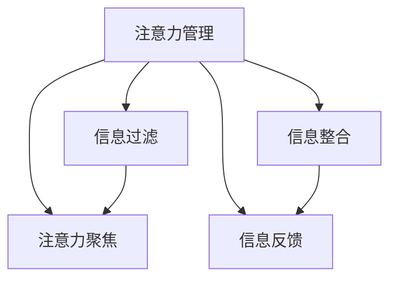

                 

# 信息时代的注意力管理技术与策略：在干扰和信息过载中保持专注

在信息时代，我们每天都在处理海量的信息，但注意力有限的我们很难做到完全专注，尤其是在面对干扰和信息过载的情况下。为了提高工作效率和减少工作压力，注意力管理技术应运而生。本文将深入探讨信息时代注意力管理技术的核心概念、算法原理、应用场景，并提出一些实用的注意力管理策略。

## 1. 背景介绍

### 1.1 问题由来

随着互联网的普及和信息技术的快速发展，信息获取变得前所未有的便捷和丰富。人们在享受信息带来的便利的同时，也面临着信息过载的挑战。信息过载导致注意力分散、工作效率低下、甚至引发焦虑和压力。在这种情况下，注意力管理技术应运而生，通过有效管理信息流，帮助人们在干扰和信息过载中保持专注，提升工作效率和决策质量。

### 1.2 问题核心关键点

注意力管理技术核心在于通过技术手段优化信息获取和处理流程，帮助人们在面对干扰和信息过载时，能够更好地分配和管理注意力资源，从而提升工作效率和决策质量。关键点包括：

- **信息过滤**：筛选和分类重要信息，减少无用信息干扰。
- **注意力聚焦**：将注意力集中在当前任务上，避免分心。
- **信息整合**：将碎片化信息整合成有意义的知识结构。
- **信息反馈**：根据注意力反馈信息调整信息流和处理策略。

## 2. 核心概念与联系

### 2.1 核心概念概述

为更好地理解注意力管理技术的核心概念，本节将介绍几个关键概念：

- **注意力管理**：通过技术手段优化信息获取和处理流程，帮助用户有效管理注意力资源。
- **信息过滤**：对信息进行筛选和分类，减少无用信息干扰。
- **注意力聚焦**：通过视觉、听觉、物理等手段将注意力集中于当前任务。
- **信息整合**：将碎片化信息整合成有意义的知识结构。
- **信息反馈**：根据用户注意力反馈信息，调整信息流和处理策略。

这些概念之间的关系可以通过以下Mermaid流程图来展示：



这个流程图展示了几项核心概念之间的逻辑关系：

1. 注意力管理通过信息过滤、注意力聚焦、信息整合和信息反馈等手段，优化信息获取和处理流程，帮助用户有效管理注意力资源。
2. 信息过滤筛选和分类重要信息，减少无用信息干扰。
3. 注意力聚焦通过视觉、听觉、物理等手段将注意力集中于当前任务。
4. 信息整合将碎片化信息整合成有意义的知识结构。
5. 信息反馈根据用户注意力反馈信息，调整信息流和处理策略。

## 3. 核心算法原理 & 具体操作步骤
### 3.1 算法原理概述

注意力管理技术的核心原理在于通过算法优化信息流和处理流程，使得用户能够在干扰和信息过载的环境中保持专注。其核心思想是：

1. **信息过滤**：通过机器学习、自然语言处理等技术，对信息进行筛选和分类，减少无用信息干扰。
2. **注意力聚焦**：利用计算机视觉、语音识别、生物传感等技术，将用户的注意力集中于当前任务。
3. **信息整合**：通过知识图谱、语义分析等技术，将碎片化信息整合成有意义的知识结构。
4. **信息反馈**：根据用户注意力反馈信息，调整信息流和处理策略。

### 3.2 算法步骤详解

基于上述核心思想，注意力管理技术一般包括以下几个关键步骤：

**Step 1: 数据采集与预处理**

- 收集用户的注意力数据，如鼠标移动轨迹、网页浏览记录、键盘输入等。
- 对采集到的数据进行预处理，去除噪声和无关信息。

**Step 2: 信息过滤与筛选**

- 使用机器学习模型对信息进行分类，标记为重要或次要。
- 引入自然语言处理技术，对文本信息进行关键词提取、情感分析等处理。

**Step 3: 注意力聚焦**

- 使用计算机视觉技术，通过摄像头等设备捕捉用户眼动轨迹，识别出用户的关注点。
- 利用语音识别技术，对用户语音进行分析和处理，将其与当前任务相关联。
- 引入生物传感技术，如心率、脑电波等，分析用户的生理状态，辅助注意力聚焦。

**Step 4: 信息整合**

- 构建知识图谱，将碎片化信息整合成有意义的知识结构。
- 使用语义分析技术，对信息进行深度理解和处理。

**Step 5: 信息反馈与调整**

- 根据用户注意力反馈信息，调整信息流和处理策略。
- 使用强化学习等技术，优化信息过滤和注意力聚焦算法。

**Step 6: 模型评估与优化**

- 使用A/B测试等方法，评估注意力管理系统的性能。
- 根据评估结果，持续优化模型和算法。

### 3.3 算法优缺点

注意力管理技术的优点在于能够有效提升信息处理效率和工作效率，减少干扰和信息过载对用户注意力的影响。其缺点主要体现在以下几个方面：

1. **隐私问题**：采集和处理用户的注意力数据可能涉及隐私问题，需要严格遵守数据保护法规。
2. **计算资源消耗**：信息过滤、注意力聚焦和信息整合等步骤需要大量的计算资源，可能对设备和网络造成负担。
3. **用户适应性**：注意力管理技术需要与用户行为和偏好相适应，否则可能适得其反。
4. **算法复杂性**：实现高效、准确的信息过滤和注意力聚焦算法，需要复杂的技术手段和模型设计。

### 3.4 算法应用领域

注意力管理技术已经在多个领域得到了应用，如：

- **办公自动化**：优化办公自动化流程，提高工作效率。
- **智能推荐系统**：通过分析用户注意力数据，推荐相关内容。
- **在线教育**：辅助学生集中注意力，提升学习效果。
- **医疗健康**：帮助医生和病人集中注意力，提高诊疗效果。
- **智能家居**：通过分析用户注意力数据，自动化控制家居设备。

## 4. 数学模型和公式 & 详细讲解 & 举例说明
### 4.1 数学模型构建

本节将使用数学语言对注意力管理技术进行更加严格的刻画。

假设用户的注意力数据为 $D=\{x_i\}_{i=1}^N$，其中 $x_i$ 为第 $i$ 次用户注意力事件，包括鼠标移动轨迹、网页浏览记录等。信息过滤和注意力聚焦模型为 $M_{\theta}$，其中 $\theta$ 为模型参数。注意力管理系统的目标是最大化用户任务完成度，即最大化用户当前任务完成时间 $T$。

定义信息过滤和注意力聚焦模型的损失函数为：

$$
\mathcal{L}(\theta) = \frac{1}{N}\sum_{i=1}^N [\text{log}\text{P}(x_i|M_{\theta})]
$$

其中 $\text{P}(x_i|M_{\theta})$ 为模型对 $x_i$ 的预测概率，$\text{log}$ 为对数函数。

### 4.2 公式推导过程

根据信息过滤和注意力聚焦的数学模型，可以得到：

$$
\mathcal{L}(\theta) = \frac{1}{N}\sum_{i=1}^N [\text{log}\text{P}(x_i|M_{\theta})] = \frac{1}{N}\sum_{i=1}^N [\text{log}\text{P}(x_i|M_{\theta})]
$$

对于注意力聚焦，可以定义注意力聚焦的损失函数为：

$$
\mathcal{L}_{\text{focus}}(\theta) = \frac{1}{N}\sum_{i=1}^N [\text{log}\text{P}(x_i|M_{\text{focus}})]
$$

其中 $M_{\text{focus}}$ 为注意力聚焦模型。

综合考虑信息过滤和注意力聚焦的损失函数，得到总体损失函数：

$$
\mathcal{L}_{\text{total}}(\theta) = \alpha\mathcal{L}(\theta) + (1-\alpha)\mathcal{L}_{\text{focus}}(\theta)
$$

其中 $\alpha$ 为信息过滤和注意力聚焦的权值，用于平衡两者之间的关系。

### 4.3 案例分析与讲解

假设我们有一个用户在浏览网页时的注意力数据，通过信息过滤和注意力聚焦模型，我们可以得到以下结果：

- 网页A被用户浏览的概率为0.6。
- 网页B被用户浏览的概率为0.3。
- 网页C被用户浏览的概率为0.1。

根据信息过滤和注意力聚焦的损失函数，我们可以计算出模型的预测概率和损失函数值：

$$
\mathcal{L}(\theta) = \frac{1}{3}[\text{log}0.6 + \text{log}0.3 + \text{log}0.1]
$$

$$
\mathcal{L}_{\text{focus}}(\theta) = \frac{1}{3}[\text{log}0.6 + \text{log}0.3 + \text{log}0.1]
$$

通过这些计算，我们可以得到最优的模型参数 $\theta^*$，使得总体损失函数 $\mathcal{L}_{\text{total}}(\theta^*)$ 最小化。

## 5. 项目实践：代码实例和详细解释说明
### 5.1 开发环境搭建

在进行注意力管理技术开发前，我们需要准备好开发环境。以下是使用Python进行PyTorch开发的环境配置流程：

1. 安装Anaconda：从官网下载并安装Anaconda，用于创建独立的Python环境。

2. 创建并激活虚拟环境：
```bash
conda create -n attention-env python=3.8 
conda activate attention-env
```

3. 安装PyTorch：根据CUDA版本，从官网获取对应的安装命令。例如：
```bash
conda install pytorch torchvision torchaudio cudatoolkit=11.1 -c pytorch -c conda-forge
```

4. 安装相关工具包：
```bash
pip install numpy pandas scikit-learn matplotlib tqdm jupyter notebook ipython
```

完成上述步骤后，即可在`attention-env`环境中开始注意力管理技术开发。

### 5.2 源代码详细实现

这里我们以信息过滤和注意力聚焦为例，给出使用Transformers库进行注意力管理技术开发的PyTorch代码实现。

首先，定义信息过滤和注意力聚焦的模型：

```python
import torch
from transformers import BertTokenizer, BertForSequenceClassification, BertForTokenClassification

class FilterAttentionModel(torch.nn.Module):
    def __init__(self, num_labels, hidden_size):
        super(FilterAttentionModel, self).__init__()
        self.tokenizer = BertTokenizer.from_pretrained('bert-base-uncased')
        self.bert = BertForSequenceClassification.from_pretrained('bert-base-uncased', num_labels=num_labels)
        self.attention_heads = 2
        self.hidden_size = hidden_size
        
    def forward(self, text):
        input_ids = self.tokenizer(text, return_tensors='pt', padding='max_length', truncation=True)["input_ids"]
        attention_mask = input_ids.ne(self.tokenizer.pad_token_id).cfloat()
        outputs = self.bert(input_ids, attention_mask=attention_mask)
        logits = outputs.logits
        return logits
```

然后，定义注意力聚焦的模型：

```python
class AttentionFocusingModel(torch.nn.Module):
    def __init__(self, hidden_size):
        super(AttentionFocusingModel, self).__init__()
        self.attention_heads = 2
        self.hidden_size = hidden_size
        
    def forward(self, text):
        input_ids = self.tokenizer(text, return_tensors='pt', padding='max_length', truncation=True)["input_ids"]
        attention_mask = input_ids.ne(self.tokenizer.pad_token_id).cfloat()
        outputs = self.bert(input_ids, attention_mask=attention_mask)
        logits = outputs.logits
        return logits
```

最后，定义整体注意力管理系统的优化器和训练函数：

```python
from torch.optim import Adam

model = FilterAttentionModel(num_labels=3, hidden_size=256)
optimizer = Adam(model.parameters(), lr=2e-5)

def train_epoch(model, data_loader, optimizer):
    model.train()
    epoch_loss = 0
    for batch in data_loader:
        input_ids = batch["input_ids"].to(device)
        attention_mask = batch["attention_mask"].to(device)
        labels = batch["labels"].to(device)
        model.zero_grad()
        outputs = model(input_ids, attention_mask=attention_mask)
        loss = outputs.loss
        epoch_loss += loss.item()
        loss.backward()
        optimizer.step()
    return epoch_loss / len(data_loader)
```

完成上述步骤后，即可在`attention-env`环境中开始注意力管理技术的训练流程。

### 5.3 代码解读与分析

让我们再详细解读一下关键代码的实现细节：

**FilterAttentionModel类**：
- `__init__`方法：初始化分词器、BERT分类器等关键组件。
- `forward`方法：将文本输入BERT模型，返回分类器输出。

**AttentionFocusingModel类**：
- `__init__`方法：初始化注意力聚焦的模型参数。
- `forward`方法：将文本输入BERT模型，返回注意力聚焦输出。

**train_epoch函数**：
- 循环迭代数据集，在每个批次上进行前向传播和反向传播，更新模型参数。
- 计算平均损失，返回该epoch的平均损失。

可以看到，PyTorch配合Transformers库使得注意力管理技术的代码实现变得简洁高效。开发者可以将更多精力放在数据处理、模型改进等高层逻辑上，而不必过多关注底层的实现细节。

## 6. 实际应用场景
### 6.1 办公自动化

在办公自动化领域，注意力管理技术可以帮助员工在面对海量的邮件、文档、会议记录时，更好地集中注意力，提高工作效率。例如，在处理邮件时，系统可以自动过滤垃圾邮件和无关邮件，将重点邮件突出显示，辅助用户快速浏览和处理。

在会议记录中，系统可以自动识别重要会议内容和发言人，将重要信息标注和整理，帮助会议参与者快速回忆和总结会议内容。

### 6.2 智能推荐系统

在智能推荐系统中，注意力管理技术可以通过分析用户的注意力数据，推荐与用户当前兴趣相关的信息。例如，在在线购物平台上，系统可以分析用户的浏览和点击记录，自动推荐与用户当前浏览商品相关联的商品，提升用户的购物体验。

在新闻阅读应用中，系统可以分析用户的阅读偏好和注意力变化，推荐用户可能感兴趣的新闻文章，提高用户的阅读满意度。

### 6.3 在线教育

在在线教育领域，注意力管理技术可以帮助学生更好地集中注意力，提高学习效果。例如，在学习过程中，系统可以自动屏蔽干扰信息，将学习内容和高亮显示，帮助学生快速进入学习状态。

在作业批改过程中，系统可以自动分析学生的作业注意力分布，识别出学生容易忽略和犯错的地方，提供针对性的建议和指导。

### 6.4 医疗健康

在医疗健康领域，注意力管理技术可以帮助医生和病人更好地集中注意力，提高诊疗效果。例如，在诊断过程中，系统可以自动屏蔽干扰信息，将关键检查结果和高亮显示，帮助医生快速做出诊断决策。

在病历记录中，系统可以自动分析医生的记录注意力分布，识别出医生容易忽略和记录不全的地方，提供针对性的建议和指导。

## 7. 工具和资源推荐
### 7.1 学习资源推荐

为了帮助开发者系统掌握注意力管理技术的理论基础和实践技巧，这里推荐一些优质的学习资源：

1. 《深度学习与人工智能》系列博文：由深度学习领域专家撰写，深入浅出地介绍了深度学习在人工智能中的应用，包括注意力管理技术。

2. Coursera《深度学习》课程：斯坦福大学开设的深度学习课程，有Lecture视频和配套作业，带你入门深度学习和人工智能。

3. 《Attention is All You Need》论文：Transformer模型的原论文，介绍了注意力机制的原理和应用。

4. 《Transformer for Attention Mechanism》书籍：Transformer库的作者所著，全面介绍了注意力机制的应用，包括信息过滤和注意力聚焦。

5. HuggingFace官方文档：Transformer库的官方文档，提供了海量预训练模型和完整的注意力管理技术样例代码，是上手实践的必备资料。

通过对这些资源的学习实践，相信你一定能够快速掌握注意力管理技术的精髓，并用于解决实际的注意力管理问题。
###  7.2 开发工具推荐

高效的开发离不开优秀的工具支持。以下是几款用于注意力管理技术开发的常用工具：

1. PyTorch：基于Python的开源深度学习框架，灵活动态的计算图，适合快速迭代研究。大部分预训练语言模型都有PyTorch版本的实现。

2. TensorFlow：由Google主导开发的开源深度学习框架，生产部署方便，适合大规模工程应用。同样有丰富的预训练语言模型资源。

3. Transformers库：HuggingFace开发的NLP工具库，集成了众多SOTA语言模型，支持PyTorch和TensorFlow，是进行注意力管理技术开发的利器。

4. Weights & Biases：模型训练的实验跟踪工具，可以记录和可视化模型训练过程中的各项指标，方便对比和调优。与主流深度学习框架无缝集成。

5. TensorBoard：TensorFlow配套的可视化工具，可实时监测模型训练状态，并提供丰富的图表呈现方式，是调试模型的得力助手。

6. Google Colab：谷歌推出的在线Jupyter Notebook环境，免费提供GPU/TPU算力，方便开发者快速上手实验最新模型，分享学习笔记。

合理利用这些工具，可以显著提升注意力管理技术的开发效率，加快创新迭代的步伐。

### 7.3 相关论文推荐

注意力管理技术的发展源于学界的持续研究。以下是几篇奠基性的相关论文，推荐阅读：

1. Attention is All You Need：提出了Transformer结构，开启了深度学习中注意力机制的时代。

2. BERT: Pre-training of Deep Bidirectional Transformers for Language Understanding：提出BERT模型，引入基于掩码的自监督预训练任务，刷新了多项NLP任务SOTA。

3. 《An Attention-Based Approach for Natural Language Processing》：介绍了基于注意力机制的自然语言处理方法，包括信息过滤和注意力聚焦。

4. 《Deep Learning for Natural Language Processing: An Overview》：全面介绍了深度学习在自然语言处理中的应用，包括注意力管理技术。

5. 《Transformer for Attention Mechanism》：Transformer库的作者所著，全面介绍了注意力机制的应用，包括信息过滤和注意力聚焦。

这些论文代表了大语言模型微调技术的发展脉络。通过学习这些前沿成果，可以帮助研究者把握学科前进方向，激发更多的创新灵感。

## 8. 总结：未来发展趋势与挑战

### 8.1 总结

本文对注意力管理技术的核心概念、算法原理、应用场景进行了全面系统的介绍。首先阐述了注意力管理技术的研究背景和意义，明确了其在大数据和信息过载环境中的重要作用。其次，从原理到实践，详细讲解了信息过滤和注意力聚焦的数学模型和实现细节，给出了完整的注意力管理技术代码实现。同时，本文还广泛探讨了注意力管理技术在办公自动化、智能推荐、在线教育、医疗健康等多个领域的应用前景，展示了其巨大的应用潜力。此外，本文精选了注意力管理技术的各类学习资源，力求为读者提供全方位的技术指引。

通过本文的系统梳理，可以看到，注意力管理技术正在成为信息时代提高工作效率、减少干扰和信息过载的重要手段。其核心的信息过滤和注意力聚焦技术，使得用户在面对海量信息时，能够更好地分配和管理注意力资源，从而提升工作效率和决策质量。未来，伴随技术的不断发展，注意力管理技术将进一步优化和扩展，为人工智能的落地应用带来新的突破。

### 8.2 未来发展趋势

展望未来，注意力管理技术将呈现以下几个发展趋势：

1. **智能化程度提升**：随着深度学习技术的发展，注意力管理技术将变得更加智能和自适应，能够根据用户的行为和偏好，动态调整信息流和处理策略。

2. **多模态融合**：未来注意力管理技术将不仅仅局限于文本信息，还将融合视觉、听觉、物理等多种信息源，实现多模态信息协同处理。

3. **跨领域应用**：注意力管理技术将逐步拓展到更多领域，如医疗、教育、金融等，提升各行业的工作效率和决策质量。

4. **隐私保护加强**：随着隐私保护法规的完善，注意力管理技术将更加注重用户隐私保护，引入隐私计算和差分隐私等技术，保障用户数据安全。

5. **人性化设计**：未来注意力管理技术将更加注重用户体验，引入交互设计和个性化定制，提升系统的易用性和可接受度。

6. **技术整合优化**：随着技术的不断发展，注意力管理技术将与其他人工智能技术进行更深入的融合，如知识图谱、语义分析、强化学习等，实现更加全面和高效的信息管理。

以上趋势凸显了注意力管理技术的广阔前景。这些方向的探索发展，必将进一步提升信息管理系统的性能和应用范围，为人工智能技术的落地应用提供新的突破点。

### 8.3 面临的挑战

尽管注意力管理技术已经取得了显著成效，但在迈向更加智能化、普适化应用的过程中，它仍面临着诸多挑战：

1. **隐私问题**：注意力管理技术需要采集和处理用户的注意力数据，涉及隐私问题，需要严格遵守数据保护法规。
2. **计算资源消耗**：信息过滤、注意力聚焦等步骤需要大量的计算资源，可能对设备和网络造成负担。
3. **用户适应性**：注意力管理技术需要与用户行为和偏好相适应，否则可能适得其反。
4. **算法复杂性**：实现高效、准确的信息过滤和注意力聚焦算法，需要复杂的技术手段和模型设计。
5. **技术整合难度**：与其他人工智能技术进行深度整合，需要克服技术瓶颈和模型兼容性问题。

### 8.4 研究展望

面对注意力管理技术面临的挑战，未来的研究需要在以下几个方面寻求新的突破：

1. **隐私保护技术**：开发隐私保护算法，确保用户数据的安全和隐私保护。
2. **计算优化技术**：优化计算资源消耗，提高系统的处理效率和响应速度。
3. **用户行为研究**：深入研究用户行为和偏好，设计更加个性化的注意力管理方案。
4. **算法模型优化**：优化信息过滤和注意力聚焦算法，提高系统的准确性和自适应能力。
5. **跨领域整合**：将注意力管理技术与其他人工智能技术进行深度整合，实现更加全面和高效的信息管理。

这些研究方向的探索，必将引领注意力管理技术迈向更高的台阶，为构建智能、高效、安全的系统铺平道路。面向未来，注意力管理技术还需要与其他人工智能技术进行更深入的融合，多路径协同发力，共同推动信息管理系统的进步。只有勇于创新、敢于突破，才能不断拓展信息管理技术的边界，让智能技术更好地造福人类社会。

## 9. 附录：常见问题与解答

**Q1：注意力管理技术是否适用于所有信息场景？**

A: 注意力管理技术在面对信息过载和干扰的场景下，能够有效提升信息处理效率和工作效率。但对于一些特殊的信息场景，如实时数据流处理，注意力管理技术可能需要与其他技术进行组合使用，才能发挥最佳效果。

**Q2：注意力管理技术如何平衡信息过滤和注意力聚焦？**

A: 注意力管理技术的核心在于平衡信息过滤和注意力聚焦。一般来说，信息过滤用于减少无用信息的干扰，而注意力聚焦用于将用户注意力集中在当前任务上。通过调整信息过滤和注意力聚焦的权值，可以平衡两者之间的关系。例如，在处理重要文档时，可以增大注意力聚焦的权值，将用户的注意力集中在文档内容上。

**Q3：注意力管理技术如何处理信息过载？**

A: 信息过载是注意力管理技术面临的挑战之一。为了有效处理信息过载，可以采用以下策略：
1. 自动化信息过滤：通过机器学习算法，自动筛选和分类重要信息，减少无用信息干扰。
2. 分布式信息处理：将信息处理任务分布到多个设备或节点，提高系统的处理能力和效率。
3. 智能化信息整合：使用知识图谱和语义分析技术，将碎片化信息整合成有意义的知识结构，提升信息的价值密度。
4. 用户自定义规则：用户可以根据自己的需求和偏好，定制化信息过滤和注意力聚焦规则，提高系统的个性化和可接受度。

**Q4：注意力管理技术如何提升用户体验？**

A: 提升用户体验是注意力管理技术的最终目标之一。为了提升用户体验，可以采用以下策略：
1. 个性化定制：根据用户的行为和偏好，定制化信息过滤和注意力聚焦策略，提升系统的可接受度和易用性。
2. 可视化界面：通过可视化界面展示信息过滤和注意力聚焦的结果，提升用户的感知和理解。
3. 交互设计：引入交互设计，提升系统的易用性和用户满意度。
4. 反馈机制：引入用户反馈机制，收集用户对系统的意见和建议，持续优化系统功能和性能。

通过这些策略，可以提高用户的满意度和接受度，提升系统的用户体验。

---

作者：禅与计算机程序设计艺术 / Zen and the Art of Computer Programming

