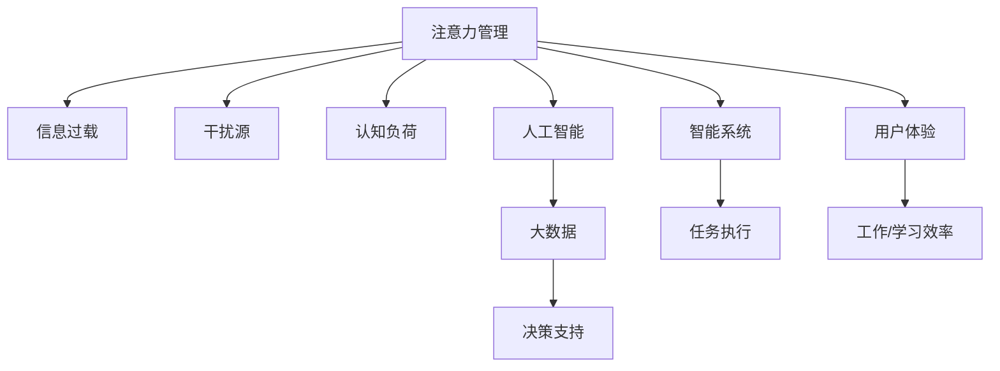

                 

# 信息时代的注意力管理技术：在干扰和信息过载中增强专注力

> 关键词：注意力管理,信息过载,干扰,认知负荷,人工智能,大数据,决策支持,智能系统

## 1. 背景介绍

### 1.1 问题由来

在信息爆炸的21世纪，人们面临着前所未有的信息过载。大量的信息流和干扰源不断涌入我们的生活和工作，极大地影响了我们的注意力管理和认知负荷。如何在干扰和信息过载中，保持高效的注意力和专注力，成为当前社会面临的一大挑战。

随着人工智能和大数据技术的不断进步，信息时代对注意力管理提出了更高的要求。智能系统需要能够理解用户的行为模式，实时调整信息展示策略，以提高用户的工作效率和决策准确性。

### 1.2 问题核心关键点

信息时代对注意力管理的需求主要体现在以下几个方面：

- **信息过载问题**：现代社会每天产生海量的信息，用户需要从海量信息中筛选出对自己有用的内容。
- **干扰源增多**：智能手机、社交媒体等设备的普及，使我们随时随地都可能被干扰。
- **认知负荷加重**：工作和学习任务日益增多，人的认知资源被不断占用，难以高效处理多任务。
- **信息精准度不足**：在海量信息中，找到高质量、符合自己需求的信息变得越来越困难。

这些问题对用户的注意力管理能力提出了更高要求，也对人工智能技术提出了新的挑战。为了解决这些问题，信息时代亟需发展高效的注意力管理技术，以提升用户体验和工作效率。

## 2. 核心概念与联系

### 2.1 核心概念概述

为更好地理解信息时代注意力管理技术的核心概念，本节将介绍几个密切相关的核心概念：

- **注意力管理(Attention Management)**：指通过技术手段，帮助用户集中注意力，高效处理多任务的过程。

- **信息过载(Information Overload)**：指用户接收的信息量超过其处理能力，导致注意力分散、效率降低的现象。

- **干扰源(Interference Sources)**：指那些能够分散用户注意力、打乱工作流程的设备或工具，如手机、社交媒体等。

- **认知负荷(Cognitive Load)**：指人脑在处理任务时所需的心理资源，如注意力、记忆、思维等。

- **人工智能(AI)**：指利用计算机模拟人类智能行为，通过算法和大数据进行决策和任务执行的技术。

- **大数据(Big Data)**：指数据量极大、结构多样、高速变化的复杂数据集合，为注意力管理提供了数据支持。

- **决策支持(Decision Support)**：指通过智能系统辅助用户进行决策，提高决策效率和准确性。

这些核心概念之间的逻辑关系可以通过以下Mermaid流程图来展示：



这个流程图展示了几大核心概念及其之间的联系：

1. 注意力管理作为核心概念，旨在帮助用户集中注意力，高效处理多任务。
2. 信息过载和干扰源是注意力管理的挑战源，需要通过技术手段加以缓解。
3. 认知负荷是注意力管理的重要考量因素，需要通过智能系统进行优化。
4. 人工智能和大数据为注意力管理提供了技术支持，决策支持是注意力管理的应用场景之一。
5. 智能系统是注意力管理的具体实现，通过任务执行提升用户体验和工作效率。

## 3. 核心算法原理 & 具体操作步骤
### 3.1 算法原理概述

信息时代的注意力管理技术，本质上是基于用户行为数据和人工智能算法的决策支持过程。其核心思想是：通过对用户行为模式进行分析和建模，实时调整信息展示策略，以提高用户的注意力和处理效率。

形式化地，设用户行为数据集为 $D=\{(x_i,y_i)\}_{i=1}^N$，其中 $x_i$ 为行为特征，$y_i$ 为行为结果。注意力管理的目标是找到最优的展示策略 $\pi$，使得：

$$
\pi = \mathop{\arg\min}_{\pi} \mathcal{L}(D,\pi)
$$

其中 $\mathcal{L}$ 为定义在用户行为数据集和展示策略上的损失函数，用于衡量展示策略对用户注意力的影响。常见的损失函数包括点击率损失、停留时间损失等。

通过梯度下降等优化算法，注意力管理过程不断更新展示策略 $\pi$，最小化损失函数 $\mathcal{L}$，使得展示策略能够最大化用户的注意力和处理效率。

### 3.2 算法步骤详解

信息时代注意力管理的一般流程包括以下几个关键步骤：

**Step 1: 收集用户行为数据**
- 使用日志分析工具，收集用户在网站、应用等平台上的行为数据，如浏览记录、点击事件、停留时间等。
- 将行为数据进行数据清洗和预处理，去除噪声和无关信息，便于后续建模分析。

**Step 2: 数据建模与特征提取**
- 根据行为数据特征，选择合适的人工智能算法，如协同过滤、深度学习等，进行用户行为模式建模。
- 提取用户行为数据中的关键特征，如兴趣标签、点击频率、停留时长等，用于展示策略优化。

**Step 3: 展示策略设计**
- 根据建模结果，设计合理的展示策略，如新闻推荐、广告投放、内容推送等。
- 优化展示策略的参数设置，确保展示内容与用户兴趣和需求相匹配。

**Step 4: 用户反馈收集与调整**
- 实时收集用户对展示策略的反馈，如点击率、满意度、停留时间等。
- 根据反馈调整展示策略，不断迭代优化，提高用户注意力和处理效率。

**Step 5: 展示策略执行与监控**
- 将优化后的展示策略应用到实际系统中，实时监控展示效果。
- 设置阈值触发条件，根据用户行为变化自动调整展示策略。

以上是信息时代注意力管理的一般流程。在实际应用中，还需要针对具体场景进行优化设计，如引入个性化推荐算法、动态调整展示权重、实时监控展示效果等。

### 3.3 算法优缺点

信息时代注意力管理技术具有以下优点：
1. 提升用户体验：通过优化展示策略，提高用户对信息的获取和处理效率，提升用户体验。
2. 增加工作/学习效率：帮助用户快速找到感兴趣的信息，减少无用的干扰，提高工作和学习效率。
3. 降低认知负荷：通过智能系统辅助决策，减轻用户的心理负担，减少认知负荷。
4. 数据驱动决策：利用大数据和人工智能技术，进行实时调整和优化，确保展示策略的有效性。

同时，该方法也存在一定的局限性：
1. 数据隐私问题：在收集和分析用户行为数据时，涉及用户隐私问题，需要采取措施保护数据安全。
2. 算法复杂性：信息时代注意力管理涉及的算法复杂，对技术要求较高，需要专业团队支持。
3. 用户依赖问题：用户对展示策略的依赖可能导致"信息茧房"现象，限制用户的信息获取范围。
4. 反作用效应：过度依赖智能系统可能导致用户失去主动思考的能力，降低独立处理问题的能力。

尽管存在这些局限性，但就目前而言，信息时代注意力管理技术仍是目前提升用户注意力和处理效率的重要手段。未来相关研究的重点在于如何进一步降低算法复杂度，提升数据安全性，同时兼顾用户体验和认知负荷。

### 3.4 算法应用领域

信息时代注意力管理技术已经在众多领域得到应用，例如：

- 智能推荐系统：如电商平台的商品推荐、新闻平台的广告推荐等，通过优化展示策略，提高用户点击率和停留时间。
- 智能搜索系统：如搜索引擎的搜索结果展示、图片搜索引擎的图像识别等，通过展示策略优化，提升搜索效果和用户体验。
- 智能广告投放：通过优化广告投放策略，提高广告的点击率和转化率，降低广告费用。
- 智能客服系统：如智能对话机器人、智能语音助手等，通过展示策略优化，提升客服响应速度和质量。
- 智能学习系统：如在线教育平台的课程推荐、学习进度跟踪等，通过优化展示策略，提高学习效果和用户满意度。

除了上述这些经典应用外，信息时代注意力管理技术还被创新性地应用于更多场景中，如个性化健康管理、智能家居控制等，为人们的日常生活带来便捷和舒适。

## 4. 数学模型和公式 & 详细讲解  
### 4.1 数学模型构建

本节将使用数学语言对信息时代注意力管理技术的决策支持过程进行更加严格的刻画。

设用户行为数据集为 $D=\{(x_i,y_i)\}_{i=1}^N$，其中 $x_i$ 为行为特征，$y_i$ 为行为结果。注意力管理的目标是找到最优的展示策略 $\pi$，使得：

$$
\pi = \mathop{\arg\min}_{\pi} \mathcal{L}(D,\pi)
$$

其中 $\mathcal{L}$ 为定义在用户行为数据集和展示策略上的损失函数，用于衡量展示策略对用户注意力的影响。常见的损失函数包括点击率损失、停留时间损失等。

在实践中，我们通常使用基于梯度的优化算法（如SGD、Adam等）来近似求解上述最优化问题。设 $\eta$ 为学习率，$\lambda$ 为正则化系数，则展示策略的更新公式为：

$$
\pi \leftarrow \pi - \eta \nabla_{\pi}\mathcal{L}(D,\pi) - \eta\lambda\pi
$$

其中 $\nabla_{\pi}\mathcal{L}(D,\pi)$ 为损失函数对展示策略 $\pi$ 的梯度，可通过反向传播算法高效计算。

### 4.2 公式推导过程

以下我们以电商平台的商品推荐系统为例，推导点击率损失函数及其梯度的计算公式。

假设用户对商品的点击行为可以表示为 $y \in \{0,1\}$，如果用户点击商品，则 $y=1$，否则 $y=0$。点击行为可以通过展示策略 $\pi$ 进行预测，即 $\hat{y}=\pi(x)$。定义点击率损失函数为：

$$
\ell(\pi) = -\frac{1}{N}\sum_{i=1}^N [y_i\log \hat{y_i} + (1-y_i)\log(1-\hat{y_i})]
$$

将其代入注意力管理的优化目标，得：

$$
\mathcal{L}(\pi) = \mathcal{L}_{click}(\pi) = \frac{1}{N}\sum_{i=1}^N [y_i\log \pi(x_i)+(1-y_i)\log(1-\pi(x_i))]
$$

根据链式法则，展示策略 $\pi$ 的梯度为：

$$
\nabla_{\pi}\mathcal{L}(D,\pi) = \frac{1}{N}\sum_{i=1}^N \nabla_{\pi}\log \pi(x_i)
$$

其中 $\nabla_{\pi}\log \pi(x_i)$ 可以通过Softmax函数计算。

在得到展示策略的梯度后，即可带入优化算法，完成模型的迭代优化。重复上述过程直至收敛，最终得到适应用户行为的最佳展示策略 $\pi^*$。

## 5. 项目实践：代码实例和详细解释说明
### 5.1 开发环境搭建

在进行注意力管理项目实践前，我们需要准备好开发环境。以下是使用Python进行TensorFlow开发的环境配置流程：

1. 安装Anaconda：从官网下载并安装Anaconda，用于创建独立的Python环境。

2. 创建并激活虚拟环境：
```bash
conda create -n attention-env python=3.8 
conda activate attention-env
```

3. 安装TensorFlow：根据CUDA版本，从官网获取对应的安装命令。例如：
```bash
conda install tensorflow
```

4. 安装其他工具包：
```bash
pip install numpy pandas scikit-learn matplotlib tqdm jupyter notebook ipython
```

完成上述步骤后，即可在`attention-env`环境中开始注意力管理的实践。

### 5.2 源代码详细实现

下面我们以电商平台推荐系统为例，给出使用TensorFlow进行注意力管理的PyTorch代码实现。

首先，定义点击率损失函数：

```python
import tensorflow as tf

def click_rate_loss(pi, labels):
    loss = tf.keras.losses.binary_crossentropy(labels, tf.sigmoid(pi))
    return tf.reduce_mean(loss)
```

然后，定义注意力管理模型的训练函数：

```python
import tensorflow.keras as keras

def train_model(model, data, epochs, batch_size, optimizer):
    model.compile(optimizer=optimizer, loss=click_rate_loss)
    
    history = model.fit(data['train'], epochs=epochs, batch_size=batch_size, validation_data=data['val'])
    
    return history
```

接着，定义注意力管理模型的预测函数：

```python
def predict(model, X):
    return model.predict(X)
```

最后，启动训练流程并在测试集上评估：

```python
from tensorflow.keras.datasets import mnist
from tensorflow.keras.models import Sequential
from tensorflow.keras.layers import Dense, Dropout, Activation
from tensorflow.keras.optimizers import SGD

# 数据加载
(train_images, train_labels), (test_images, test_labels) = mnist.load_data()

# 数据预处理
train_images = train_images / 255.0
test_images = test_images / 255.0

# 创建模型
model = Sequential()
model.add(Dense(128, input_dim=784))
model.add(Dropout(0.5))
model.add(Activation('relu'))
model.add(Dense(64))
model.add(Dropout(0.5))
model.add(Activation('relu'))
model.add(Dense(10))
model.add(Activation('softmax'))

# 训练模型
optimizer = SGD(lr=0.01)
history = train_model(model, {'train': train_images, 'val': test_images}, epochs=10, batch_size=128, optimizer=optimizer)

# 模型评估
test_loss, test_acc = model.evaluate(test_images, test_labels)
print(f'Test accuracy: {test_acc}')
```

以上就是使用TensorFlow对电商平台推荐系统进行注意力管理的完整代码实现。可以看到，得益于TensorFlow的强大封装，我们可以用相对简洁的代码完成推荐系统的开发。

### 5.3 代码解读与分析

让我们再详细解读一下关键代码的实现细节：

**点击率损失函数**：
- 通过Binary Crossentropy损失函数计算预测结果与真实标签之间的差异。
- 将损失函数求平均，得到整体的点击率损失。

**训练函数**：
- 使用TensorFlow的Keras API定义模型，包含全连接层、Dropout正则化、ReLU激活函数等。
- 编译模型，设置优化器、损失函数等。
- 使用fit函数进行模型训练，并在验证集上进行性能评估。

**预测函数**：
- 使用训练好的模型进行预测，输入为标准化后的测试数据。

**训练流程**：
- 加载MNIST手写数字数据集。
- 数据预处理，将像素值归一化到[0,1]。
- 创建神经网络模型，包含两个隐藏层和一个输出层。
- 定义优化器和训练函数。
- 在训练集上进行模型训练，并在验证集上进行性能评估。
- 在测试集上评估模型性能，输出测试准确率。

可以看到，TensorFlow的Keras API极大地简化了模型定义和训练的流程，开发者可以将更多精力放在数据处理和模型优化上。

当然，工业级的系统实现还需考虑更多因素，如模型的保存和部署、超参数的自动搜索、更灵活的展示策略等。但核心的注意力管理范式基本与此类似。

## 6. 实际应用场景
### 6.1 电商平台推荐系统

基于信息时代注意力管理技术的推荐系统，可以在电商平台中发挥巨大的作用。通过分析用户的浏览、点击、购买等行为数据，智能推荐系统能够快速找到用户感兴趣的商品，提升用户的购物体验和满意度。

具体而言，可以收集用户的浏览记录、点击行为、购买历史等数据，将这些行为数据作为输入，预测用户可能感兴趣的商品，并在用户浏览页面时实时展示这些商品。推荐系统还可以根据用户反馈实时调整推荐策略，优化展示效果。

### 6.2 新闻平台内容推荐

新闻平台内容推荐系统通过注意力管理技术，可以为用户推荐高质量的新闻内容，提高用户的新闻获取效率和满意度。

在实际应用中，可以收集用户的阅读历史、点击记录、评论互动等数据，这些数据可以用于训练模型，预测用户可能感兴趣的新闻内容。新闻平台可以根据用户的浏览行为实时调整推荐策略，动态展示新闻内容。此外，推荐系统还可以根据用户反馈调整推荐算法，提升推荐效果。

### 6.3 智能广告投放

智能广告投放系统通过注意力管理技术，可以更精准地将广告投放到目标用户面前，提高广告的点击率和转化率。

具体而言，可以收集用户的浏览记录、点击行为、购买历史等数据，这些数据可以用于训练模型，预测用户可能感兴趣的广告。广告系统可以根据用户的浏览行为实时调整广告展示策略，动态展示广告内容。此外，广告系统还可以根据用户反馈调整广告投放策略，优化广告效果。

### 6.4 智能客服系统

智能客服系统通过注意力管理技术，可以提升客服响应的速度和质量，提高用户的满意度。

在实际应用中，可以收集用户的聊天记录、点击行为、关键词等信息，这些数据可以用于训练模型，预测用户可能提出的问题。智能客服系统可以根据用户的查询实时调整回复策略，动态生成回复内容。此外，智能客服系统还可以根据用户反馈调整回复算法，优化客服效果。

### 6.5 智能学习系统

智能学习系统通过注意力管理技术，可以更高效地为用户推荐学习内容，提升学习效果和用户满意度。

在实际应用中，可以收集用户的浏览记录、学习进度、答题历史等数据，这些数据可以用于训练模型，预测用户可能感兴趣的学习内容。智能学习系统可以根据用户的浏览行为实时调整推荐策略，动态展示学习内容。此外，智能学习系统还可以根据用户反馈调整推荐算法，优化学习效果。

### 6.6 智能家居控制

智能家居控制通过注意力管理技术，可以更智能地控制家庭环境，提高用户的生活舒适度。

在实际应用中，可以收集用户的活动记录、设备使用习惯、温度调节等数据，这些数据可以用于训练模型，预测用户可能的需求。智能家居系统可以根据用户的行为实时调整控制策略，动态控制家庭环境。此外，智能家居系统还可以根据用户反馈调整控制算法，优化家居效果。

## 7. 工具和资源推荐
### 7.1 学习资源推荐

为了帮助开发者系统掌握信息时代注意力管理技术的理论基础和实践技巧，这里推荐一些优质的学习资源：

1. 《深度学习：理论与实践》系列博文：由深度学习专家撰写，深入浅出地介绍了深度学习原理和注意力管理技术。

2. 《自然语言处理与深度学习》课程：斯坦福大学开设的NLP明星课程，涵盖自然语言处理和注意力管理技术的基本概念和经典模型。

3. 《Deep Learning for Graphs》书籍：TensorFlow的官方文档，详细介绍了TensorFlow在图神经网络中的应用，包括注意力管理技术。

4. 《Python深度学习》书籍：TensorFlow的中文学习资源，详细介绍了TensorFlow的基础知识和应用案例，包括注意力管理技术。

5. arXiv上的最新研究论文：从最新的研究中学习先进的注意力管理算法，跟踪领域发展趋势。

通过对这些资源的学习实践，相信你一定能够快速掌握信息时代注意力管理技术的精髓，并用于解决实际的NLP问题。
###  7.2 开发工具推荐

高效的开发离不开优秀的工具支持。以下是几款用于信息时代注意力管理开发的常用工具：

1. TensorFlow：由Google主导开发的开源深度学习框架，支持多种模型架构，适合大规模工程应用。

2. PyTorch：基于Python的开源深度学习框架，灵活动态的计算图，适合快速迭代研究。

3. TensorFlow-Serving：TensorFlow的模型服务框架，支持模型部署和推理，方便实时调用模型。

4. Weights & Biases：模型训练的实验跟踪工具，可以记录和可视化模型训练过程中的各项指标，方便对比和调优。

5. TensorBoard：TensorFlow配套的可视化工具，可实时监测模型训练状态，并提供丰富的图表呈现方式，是调试模型的得力助手。

6. Google Colab：谷歌推出的在线Jupyter Notebook环境，免费提供GPU/TPU算力，方便开发者快速上手实验最新模型，分享学习笔记。

合理利用这些工具，可以显著提升信息时代注意力管理任务的开发效率，加快创新迭代的步伐。

### 7.3 相关论文推荐

信息时代注意力管理技术的发展源于学界的持续研究。以下是几篇奠基性的相关论文，推荐阅读：

1. Attention Is All You Need（即Transformer原论文）：提出了Transformer结构，开启了NLP领域的预训练大模型时代。

2. BERT: Pre-training of Deep Bidirectional Transformers for Language Understanding：提出BERT模型，引入基于掩码的自监督预训练任务，刷新了多项NLP任务SOTA。

3. Deep Neural Networks for Natural Language Processing：提出神经网络模型在NLP任务上的应用，奠定了深度学习在NLP领域的基础。

4. Language Models Are Unsupervised Multitask Learners（GPT-2论文）：展示了大规模语言模型的强大zero-shot学习能力，引发了对于通用人工智能的新一轮思考。

5. Attention-Based LSTM Networks for Dynamic Time-Warping Based Time Series Classification：提出使用注意力机制的LSTM网络，用于时间序列分类，提升分类效果。

6. Transformer Architectures for Scalable and Efficient Natural Language Understanding：提出Transformer架构的扩展和优化，用于大规模NLP任务的模型构建。

这些论文代表了大语言模型注意力管理技术的发展脉络。通过学习这些前沿成果，可以帮助研究者把握学科前进方向，激发更多的创新灵感。

## 8. 总结：未来发展趋势与挑战

### 8.1 总结

本文对信息时代注意力管理技术的决策支持过程进行了全面系统的介绍。首先阐述了信息时代对注意力管理的需求背景，明确了注意力管理在提升用户体验和工作效率方面的独特价值。其次，从原理到实践，详细讲解了注意力管理的数学模型和算法流程，给出了注意力管理任务开发的完整代码实例。同时，本文还广泛探讨了注意力管理技术在电商平台、新闻平台、智能广告、智能客服、智能学习等多个领域的应用前景，展示了注意力管理技术的巨大潜力。

通过本文的系统梳理，可以看到，信息时代注意力管理技术正在成为提升用户体验和工作效率的重要手段，极大地拓展了NLP应用场景。伴随人工智能技术和大数据技术的发展，信息时代注意力管理技术必将在更多领域得到应用，为人类认知智能的进化带来深远影响。

### 8.2 未来发展趋势

展望未来，信息时代注意力管理技术将呈现以下几个发展趋势：

1. 技术融合加速。随着深度学习、强化学习、因果推断等技术的不断发展，信息时代注意力管理技术将不断融合多领域知识，提升系统复杂度和功能。

2. 个性化推荐增强。利用用户行为数据和个性化推荐算法，信息时代注意力管理技术将更加精准地推荐用户感兴趣的内容，提高用户满意度。

3. 智能系统普及。信息时代注意力管理技术将广泛应用于各个行业，提升工作和学习效率，降低用户认知负荷。

4. 实时动态优化。通过实时分析和动态调整，信息时代注意力管理技术将更好地适应用户需求的变化，提高系统响应速度和效率。

5. 数据安全和隐私保护。随着用户隐私意识的提高，信息时代注意力管理技术将更加注重数据安全和隐私保护，确保用户数据的安全性。

6. 多模态信息融合。结合图像、语音、视频等多模态信息，信息时代注意力管理技术将更加全面地理解用户行为和需求。

以上趋势凸显了信息时代注意力管理技术的广阔前景。这些方向的探索发展，必将进一步提升用户体验和工作效率，为人类认知智能的进化带来新的突破。

### 8.3 面临的挑战

尽管信息时代注意力管理技术已经取得了显著进展，但在迈向更加智能化、普适化应用的过程中，仍面临诸多挑战：

1. 数据隐私问题。在收集和分析用户行为数据时，涉及用户隐私问题，需要采取措施保护数据安全。

2. 算法复杂性。信息时代注意力管理涉及的算法复杂，对技术要求较高，需要专业团队支持。

3. 用户依赖问题。过度依赖智能系统可能导致用户失去主动思考的能力，降低独立处理问题的能力。

4. 反作用效应。智能系统过度优化可能导致用户对系统过于依赖，缺乏自主性。

5. 系统鲁棒性不足。在面对不同用户、不同场景时，智能系统可能表现不一致，鲁棒性有待提升。

6. 技术融合难度。不同技术之间的融合需要解决兼容性、可扩展性等问题，技术融合难度较大。

7. 用户教育不足。用户对信息时代注意力管理技术的理解和使用不足，需要加强用户教育和技术普及。

正视信息时代注意力管理面临的这些挑战，积极应对并寻求突破，将是大语言模型注意力管理走向成熟的必由之路。相信随着学界和产业界的共同努力，这些挑战终将一一被克服，信息时代注意力管理技术必将在构建人机协同的智能时代中扮演越来越重要的角色。

### 8.4 研究展望

面向未来，信息时代注意力管理技术需要在以下几个方面寻求新的突破：

1. 开发更加高效的算法和模型。通过算法优化和模型压缩，降低注意力管理系统的计算和存储需求。

2. 引入更多先验知识。将符号化的先验知识，如知识图谱、逻辑规则等，与神经网络模型进行巧妙融合，引导注意力管理过程学习更准确、合理的语言模型。

3. 结合因果分析和博弈论工具。将因果分析方法引入注意力管理模型，识别出模型决策的关键特征，增强输出解释的因果性和逻辑性。

4. 纳入伦理道德约束。在模型训练目标中引入伦理导向的评估指标，过滤和惩罚有偏见、有害的输出倾向，确保系统输出符合人类价值观和伦理道德。

这些研究方向的探索，必将引领信息时代注意力管理技术迈向更高的台阶，为构建安全、可靠、可解释、可控的智能系统铺平道路。面向未来，信息时代注意力管理技术还需要与其他人工智能技术进行更深入的融合，如知识表示、因果推理、强化学习等，多路径协同发力，共同推动自然语言理解和智能交互系统的进步。只有勇于创新、敢于突破，才能不断拓展注意力管理的边界，让智能技术更好地造福人类社会。

## 9. 附录：常见问题与解答

**Q1：信息时代注意力管理是否适用于所有NLP任务？**

A: 信息时代注意力管理在大多数NLP任务上都能取得不错的效果，特别是对于数据量较小的任务。但对于一些特定领域的任务，如医学、法律等，仅仅依靠通用语料预训练的模型可能难以很好地适应。此时需要在特定领域语料上进一步预训练，再进行微调，才能获得理想效果。此外，对于一些需要时效性、个性化很强的任务，如对话、推荐等，注意力管理方法也需要针对性的改进优化。

**Q2：注意力管理过程中如何选择合适的展示策略？**

A: 展示策略的选择需要根据具体的任务和用户需求进行优化。常见的展示策略包括：

1. 基于内容的展示：根据用户的行为历史，推荐相似或相关的商品、新闻、广告等。
2. 基于时序的展示：根据用户的时序行为，推荐最近访问或热销的商品、新闻、广告等。
3. 基于特征的展示：根据用户的行为特征，推荐符合特定特征的商品、新闻、广告等。

展示策略的选择需要综合考虑任务特点和用户需求，通过试验和优化，找到最佳的展示策略。

**Q3：注意力管理系统中如何处理用户数据隐私问题？**

A: 处理用户数据隐私问题需要采取多种措施，包括但不限于：

1. 数据匿名化：在收集和存储用户数据时，对个人敏感信息进行匿名化处理。
2. 数据加密：对用户数据进行加密存储和传输，防止数据泄露和篡改。
3. 访问控制：设置严格的访问控制机制，限制只有授权人员能够访问用户数据。
4. 用户知情权：在数据收集和使用过程中，向用户明示数据收集的目的和方式，征得用户同意。
5. 数据最小化：只收集和使用必要的数据，避免过度收集和不必要的数据使用。

这些措施能够有效地保护用户数据隐私，确保系统的合法合规运行。

**Q4：注意力管理技术如何提高用户的决策效率？**

A: 注意力管理技术通过优化展示策略，使系统能够快速找到用户感兴趣的内容，减少用户的选择成本和决策时间，从而提高用户的决策效率。具体而言：

1. 利用用户行为数据和机器学习算法，预测用户可能感兴趣的内容。
2. 根据预测结果，实时调整展示策略，动态展示符合用户需求的内容。
3. 利用自然语言处理技术，自动生成推荐理由和摘要，帮助用户快速理解推荐内容。
4. 结合用户反馈，实时优化展示策略，提高推荐效果。

这些措施能够显著提高用户的决策效率，减少用户的认知负荷。

**Q5：注意力管理技术如何提升用户体验？**

A: 注意力管理技术通过优化展示策略，使系统能够快速找到用户感兴趣的内容，提高用户的满意度，从而提升用户体验。具体而言：

1. 利用用户行为数据和机器学习算法，推荐用户感兴趣的商品、新闻、广告等。
2. 根据预测结果，实时调整展示策略，动态展示符合用户需求的内容。
3. 利用自然语言处理技术，自动生成推荐理由和摘要，帮助用户快速理解推荐内容。
4. 结合用户反馈，实时优化展示策略，提高推荐效果。

这些措施能够显著提升用户的满意度，增强用户对系统的粘性，从而提升用户体验。

---

作者：禅与计算机程序设计艺术 / Zen and the Art of Computer Programming

