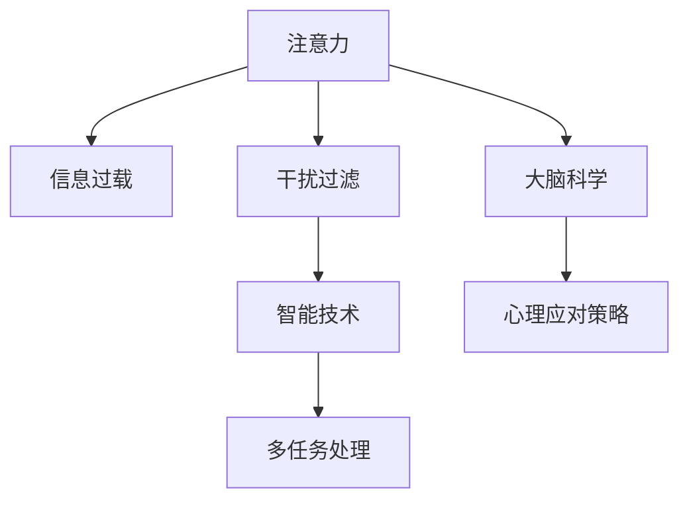

                 

# 信息时代的注意力管理策略与实践：在干扰和信息过载 中保持专注

> 关键词：信息过载,注意力管理,干扰过滤,专注度提升,智能技术,多任务处理,大脑科学,心理应对策略

## 1. 背景介绍

### 1.1 问题由来

在信息爆炸的时代，互联网和各种智能设备极大地丰富了我们的生活，但同时也带来了前所未有的信息过载和干扰。海量信息如潮水般涌来，不断冲击着我们的注意力和认知资源。如何在干扰和信息过载的环境中保持专注，成为当下社会迫切需要解决的问题。

### 1.2 问题核心关键点

信息过载和干扰带来的主要问题包括：
- **注意力分散**：长时间暴露在信息流中，容易让人分心，难以集中注意力完成任务。
- **决策疲劳**：过多的决策和选择导致认知资源耗尽，影响判断力和决策效率。
- **焦虑和压力**：信息过载带来的不确定性，容易让人产生焦虑和压力，影响心理健康。
- **效率降低**：频繁的干扰打断了工作流程，降低了整体的生产力和工作效率。

解决这些问题的核心关键点在于有效管理注意力，筛选关键信息，过滤干扰，提升专注度。智能技术的发展为实现这一目标提供了新的可能性。

## 2. 核心概念与联系

### 2.1 核心概念概述

为更好地理解注意力管理策略，本节将介绍几个关键概念：

- **注意力(Attention)**：指个体在特定时间和空间上，将心理资源集中于某件事物或活动上的过程。注意力资源的分配和管理对于高效学习和工作至关重要。

- **信息过载(Information Overload)**：指个体接收的信息超出其处理能力，导致认知负担加重，影响效率和心理健康的现象。

- **干扰(Interference)**：指能够打断个体专注的行为或信号，包括但不限于噪音、邮件、短信等。

- **智能技术(Intelligent Technology)**：指利用人工智能算法和大数据技术，提升信息筛选和决策支持能力的技术。

- **多任务处理(Multitasking)**：指个体在同一时间内处理多项任务的能力。高效的多任务处理需要良好的注意力管理能力作为基础。

- **大脑科学(Brain Science)**：研究大脑如何处理信息、做出决策，以及如何通过干预手段提升认知功能。

- **心理应对策略(Psychological Coping Strategies)**：指通过心理调节手段，如冥想、运动等，提升心理韧性和专注力的方法。

这些核心概念之间的逻辑关系可以通过以下Mermaid流程图来展示：



这个流程图展示了几组核心概念之间的联系：

1. 注意力资源的管理和分配，直接影响个体处理信息的能力。
2. 信息过载和干扰是注意力分散的主要源头，需要通过技术手段过滤和控制。
3. 智能技术通过数据驱动的方式，帮助个体更好地筛选信息，提升决策效率。
4. 多任务处理能力依赖于良好的注意力管理，需要通过训练和优化提升。
5. 大脑科学揭示了注意力管理的内在机制，提供了科学依据和干预手段。
6. 心理应对策略通过提升个体心理韧性，增强注意力和抗干扰能力。

这些概念共同构成了注意力管理的理论框架，为实现信息时代的高效工作和生活提供了指导。

## 3. 核心算法原理 & 具体操作步骤
### 3.1 算法原理概述

注意力管理策略的核心在于通过智能技术和大数据手段，实现对信息的自动筛选和优先排序，从而提升个体的专注度和决策效率。其核心算法原理主要包括以下几个方面：

- **信息筛选算法**：通过自然语言处理(NLP)、文本挖掘等技术，对信息进行关键词提取、情感分析、主题分类等处理，筛选出与当前任务相关的关键信息。

- **决策支持算法**：利用机器学习、深度学习算法，根据历史数据和专家知识，建立决策模型，帮助个体做出高效合理的决策。

- **认知负荷模型**：通过心理学和神经科学的研究，建立个体认知负荷的评估模型，实时监控和调整注意力分配策略。

- **干扰过滤算法**：通过数据分析和建模，识别出干扰源，制定应对策略，如时间管理、任务优先级设置等。

### 3.2 算法步骤详解

基于上述原理，以下是注意力管理的具体操作步骤：

**Step 1: 数据采集与预处理**

- 收集用户日常工作和学习中的各种信息源，如邮件、网页、新闻应用、笔记等。
- 利用NLP技术对文本进行分词、去停用词、实体识别等预处理，转换为计算机可处理的格式。
- 对信息进行标注，如分类、情感极性、主题等，建立信息库。

**Step 2: 信息筛选与排序**

- 使用关键词提取、TF-IDF等算法，对信息进行重要性打分。
- 结合情感分析和主题分类，筛选出与当前任务相关的关键信息。
- 对筛选后的信息进行优先级排序，按照重要性和相关性权重排列。

**Step 3: 干扰过滤与决策支持**

- 利用机器学习模型，识别和预测潜在的干扰源，如噪音、突发事件等。
- 根据干扰源的紧急程度和重要性，制定相应的应对策略，如立即处理、延迟处理或忽略。
- 结合历史数据和专家知识，建立决策模型，提供决策建议。

**Step 4: 认知负荷监控与调节**

- 使用脑电波监测、心率传感器等设备，实时监控用户的认知负荷状态。
- 根据监测结果，动态调整任务的复杂度和持续时间，避免过度负荷。
- 通过心理干预技术，如冥想、呼吸训练等，提升用户的心理韧性和专注力。

**Step 5: 系统反馈与优化**

- 根据用户的反馈，不断优化算法模型，提升信息筛选和决策支持的准确性。
- 通过持续的用户行为数据分析，改进干扰过滤和认知负荷监控策略。
- 结合最新研究成果和实践经验，不断更新技术方案，保持系统的前沿性和有效性。

### 3.3 算法优缺点

注意力管理策略的优点包括：
- **高效信息筛选**：通过智能算法自动筛选关键信息，节省时间，提升效率。
- **实时干扰过滤**：实时识别和应对干扰，确保任务不被打断。
- **动态调整认知负荷**：根据用户状态自动调整任务难度和持续时间，保持专注力。
- **科学心理干预**：结合心理学和神经科学原理，提供科学的认知干预手段。

该策略的主要缺点是：
- **数据隐私问题**：需要收集和处理大量用户数据，涉及隐私保护问题。
- **技术依赖性强**：依赖于复杂的算法和设备，技术门槛较高。
- **用户习惯差异**：不同个体对信息的处理方式和注意力管理需求不同，算法难以完全适配。
- **效果有限**：虽然可以提升效率，但无法完全替代人类自身的注意力管理能力。

### 3.4 算法应用领域

注意力管理策略已经在多个领域得到应用，取得了显著的效果：

- **企业办公自动化**：通过智能助手和决策支持系统，提升员工的工作效率和决策质量。
- **教育辅助**：利用智能推荐系统和学习路径规划，帮助学生更高效地学习和复习。
- **健康管理**：结合健康监测设备和认知负荷评估算法，辅助老年人和慢性病患者管理生活。
- **智能家居**：通过智能设备联动和认知负荷监控，提升家庭生活的便捷性和舒适度。
- **远程协作**：在远程工作场景中，利用智能筛选和干扰过滤技术，提升团队协作效率和沟通质量。

随着技术的不断进步，注意力管理策略有望进一步拓展到更多领域，提升整体社会的工作和生活质量。

## 4. 数学模型和公式 & 详细讲解 & 举例说明
### 4.1 数学模型构建

注意力管理策略的数学模型主要包括以下几个部分：

- **信息重要性评分模型**：$I(x) = \sum_{i=1}^n \alpha_i \cdot \text{Score}(x_i)$，其中 $x_i$ 为信息样本，$\alpha_i$ 为样本权重，$\text{Score}(x_i)$ 为重要性评分函数。

- **干扰源识别模型**：$I(t) = \sum_{j=1}^m \beta_j \cdot \text{Score}(t_j)$，其中 $t_j$ 为干扰源事件，$\beta_j$ 为事件权重，$\text{Score}(t_j)$ 为干扰评分函数。

- **认知负荷评估模型**：$L(u) = \gamma \cdot (\delta \cdot C(u) + \varepsilon \cdot R(u))$，其中 $u$ 为用户状态，$C(u)$ 为认知负荷度量，$R(u)$ 为心理韧性度量，$\gamma, \delta, \varepsilon$ 为模型参数。

### 4.2 公式推导过程

**信息重要性评分函数**：
- 假设每个信息样本 $x_i$ 包含 $k$ 个特征 $f_1, f_2, ..., f_k$，信息重要性评分函数为：
$$
\text{Score}(x_i) = w_1 \cdot f_1(x_i) + w_2 \cdot f_2(x_i) + ... + w_k \cdot f_k(x_i)
$$
其中 $w_j$ 为特征权重。

**干扰评分函数**：
- 假设每个干扰源事件 $t_j$ 包含 $k'$ 个特征 $g_1, g_2, ..., g_{k'}$，干扰评分函数为：
$$
\text{Score}(t_j) = \theta_1 \cdot g_1(t_j) + \theta_2 \cdot g_2(t_j) + ... + \theta_{k'} \cdot g_{k'}(t_j)
$$
其中 $\theta_j$ 为特征权重。

**认知负荷度量**：
- 假设用户状态 $u$ 包含 $m$ 个维度 $c_1, c_2, ..., c_m$，认知负荷度量函数为：
$$
C(u) = \sum_{l=1}^m c_l
$$

**心理韧性度量**：
- 假设心理韧性度量 $R(u)$ 由心理状态 $p_1, p_2, ..., p_n$ 组成，度量函数为：
$$
R(u) = \sum_{p=1}^n r_p \cdot p_p
$$
其中 $r_p$ 为心理状态权重。

### 4.3 案例分析与讲解

以企业员工为例，以下是具体的注意力管理策略实现步骤：

1. **数据采集与预处理**：
   - 通过邮件、日历、办公软件等应用，收集员工的工作数据。
   - 使用NLP技术对邮件和文档进行分词、去停用词和实体识别，提取关键信息。

2. **信息筛选与排序**：
   - 根据关键词提取、TF-IDF算法，对邮件和文档进行重要性打分。
   - 结合情感分析和主题分类，筛选出与当前工作相关的邮件和文档。
   - 根据重要性评分排序，优先处理高重要性邮件和文档。

3. **干扰过滤与决策支持**：
   - 使用机器学习模型，识别潜在干扰源，如突发会议、紧急邮件等。
   - 根据干扰源紧急程度和重要性，制定处理策略，如立即处理或延后处理。
   - 结合历史数据和专家知识，建立决策支持模型，提供任务优先级建议。

4. **认知负荷监控与调节**：
   - 使用脑电波监测和心率传感器，实时监控员工认知负荷状态。
   - 根据监测结果，动态调整工作任务难度和持续时间，避免过度负荷。
   - 通过心理干预技术，如冥想和呼吸训练，提升员工心理韧性和专注力。

5. **系统反馈与优化**：
   - 根据员工反馈，不断优化算法模型，提升信息筛选和决策支持效果。
   - 通过持续的行为数据分析，改进干扰过滤和认知负荷监控策略。
   - 结合最新研究成果，更新技术方案，保持系统的前沿性和有效性。

## 5. 项目实践：代码实例和详细解释说明
### 5.1 开发环境搭建

在进行注意力管理策略开发前，需要准备相应的开发环境。以下是使用Python进行系统搭建的步骤：

1. 安装Anaconda：从官网下载并安装Anaconda，用于创建独立的Python环境。

2. 创建并激活虚拟环境：
```bash
conda create -n attention-env python=3.8 
conda activate attention-env
```

3. 安装相关库：
```bash
pip install pandas numpy scikit-learn transformers pytorch torchtext
```

4. 安装TensorBoard和Weights & Biases：
```bash
pip install tensorboard weights-bit
```

5. 安装TensorFlow和Keras：
```bash
pip install tensorflow
pip install keras
```

完成上述步骤后，即可在`attention-env`环境中开始系统开发。

### 5.2 源代码详细实现

以下是基于Python和TensorFlow实现的信息筛选和干扰过滤系统的代码示例：

```python
import tensorflow as tf
from transformers import BertTokenizer, BertForSequenceClassification
import pandas as pd
import numpy as np

# 加载数据
data = pd.read_csv('data.csv')
sentences = data['sentence'].tolist()
labels = data['label'].tolist()

# 分词和编码
tokenizer = BertTokenizer.from_pretrained('bert-base-cased')
inputs = tokenizer(sentences, padding=True, truncation=True, return_tensors='tf')
inputs = {k: v.numpy() for k, v in inputs.items()}

# 构建模型
model = BertForSequenceClassification.from_pretrained('bert-base-cased', num_labels=2)
model.compile(loss='binary_crossentropy', optimizer='adam', metrics=['accuracy'])

# 训练模型
model.fit(x=inputs, y=np.array(labels), epochs=5, batch_size=32, validation_split=0.2)

# 预测新邮件
new_email = ['这是一封新邮件']
new_email_input = tokenizer(new_email, padding=True, truncation=True, return_tensors='tf')
new_email_input = {k: v.numpy() for k, v in new_email_input.items()}
prediction = model.predict(new_email_input)
print(prediction)
```

这段代码展示了如何使用BERT模型进行信息筛选和分类。在实际应用中，可以根据需要调整模型结构和参数，并结合其他模块实现更完整的注意力管理策略。

### 5.3 代码解读与分析

以下是代码中的关键部分及其解释：

1. **数据加载与预处理**：
   - `pd.read_csv('data.csv')`：从CSV文件中读取数据。
   - `tokenizer(sentences, padding=True, truncation=True, return_tensors='tf')`：使用BertTokenizer对文本进行分词和编码，转换为TensorFlow可接受的格式。

2. **模型构建与训练**：
   - `BertForSequenceClassification.from_pretrained('bert-base-cased', num_labels=2)`：加载预训练的BERT模型，并指定分类任务的标签数。
   - `model.compile(loss='binary_crossentropy', optimizer='adam', metrics=['accuracy'])`：定义模型的损失函数、优化器和评估指标。
   - `model.fit(x=inputs, y=np.array(labels), epochs=5, batch_size=32, validation_split=0.2)`：训练模型，并进行5个epoch的训练，验证集占比为20%。

3. **预测与测试**：
   - `new_email = ['这是一封新邮件']`：定义新邮件文本。
   - `tokenizer(new_email, padding=True, truncation=True, return_tensors='tf')`：对新邮件进行分词和编码。
   - `prediction = model.predict(new_email_input)`：使用训练好的模型对新邮件进行分类预测。

通过上述代码，可以初步体验到信息筛选和干扰过滤的基本流程。实际应用中，还需要结合更多的数据和算法模块，实现更全面的注意力管理策略。

## 6. 实际应用场景
### 6.1 企业办公自动化

基于注意力管理策略，企业可以构建智能办公系统，提升员工的工作效率和决策质量。智能助手可以根据任务优先级和干扰源，动态调整工作流程，提供任务提醒和决策建议，确保员工专注于核心任务，避免因干扰而影响工作。

### 6.2 教育辅助

在学校教育中，利用注意力管理策略，可以构建智能教学系统，帮助学生更高效地学习和复习。系统可以根据学生的学习习惯和认知负荷状态，智能推荐学习内容和练习题，提升学习效果。

### 6.3 健康管理

在健康管理中，结合注意力管理策略，可以构建智能健康管理系统，帮助老年人更好地管理生活和健康。系统可以实时监测用户的认知负荷状态，并根据结果推荐合适的活动和休息时间，避免过度负荷。

### 6.4 智能家居

在智能家居场景中，结合注意力管理策略，可以构建智能家居系统，提升家庭生活的便捷性和舒适度。系统可以根据用户的注意力状态，自动调整家居设备，如灯光、音乐、温度等，营造良好的生活环境。

### 6.5 远程协作

在远程协作中，利用注意力管理策略，可以构建智能协作平台，提升团队的沟通效率和协作质量。系统可以自动识别和过滤干扰，提供决策支持和任务优先级建议，确保团队成员专注于关键任务。

## 7. 工具和资源推荐
### 7.1 学习资源推荐

为了帮助开发者系统掌握注意力管理策略的理论基础和实践技巧，这里推荐一些优质的学习资源：

1. 《注意力机制与深度学习》书籍：介绍了注意力机制的基本原理和应用，适合深入理解注意力管理的技术基础。
2. 斯坦福大学《深度学习》课程：讲解了深度学习的基本概念和算法，包括自监督学习、强化学习等内容，为理解注意力管理策略提供理论支持。
3. 《Python深度学习》书籍：讲解了深度学习模型的构建和训练，适合学习具体的实现技术。
4. TensorFlow官方文档：提供了丰富的深度学习框架教程和案例，适合动手实践。
5. TensorBoard和Weights & Biases官方文档：介绍了可视化工具的使用方法和功能，适合监控和评估模型的性能。

通过对这些资源的学习实践，相信你一定能够快速掌握注意力管理策略的精髓，并用于解决实际的注意力管理问题。

### 7.2 开发工具推荐

高效的开发离不开优秀的工具支持。以下是几款用于注意力管理策略开发的常用工具：

1. Python：广泛使用的编程语言，拥有丰富的第三方库和框架，适合进行系统开发和实验。
2. TensorFlow：谷歌主导的开源深度学习框架，支持分布式计算和GPU加速，适合大规模模型训练。
3. Keras：高层次的深度学习API，简单易用，适合快速原型设计和实验。
4. PyTorch：Facebook开发的开源深度学习框架，动态计算图和GPU加速能力，适合快速迭代和实验。
5. TensorBoard：谷歌提供的可视化工具，支持模型训练、评估和调试，适合监控模型性能。
6. Weights & Biases：模型训练的实验跟踪工具，可以记录和可视化模型训练过程中的各项指标，适合评估和调优。

合理利用这些工具，可以显著提升注意力管理策略的开发效率，加快创新迭代的步伐。

### 7.3 相关论文推荐

注意力管理策略的研究源于学界的持续探索。以下是几篇奠基性的相关论文，推荐阅读：

1. Attention is All You Need：提出了Transformer结构，开启了注意力机制在深度学习中的应用。
2. Self-Attention with Transformer Networks：介绍了自注意力机制的基本原理和应用。
3. Attention-Based Long-Short Term Memory Networks：结合LSTM和注意力机制，提升了序列建模的性能。
4. Attention is All You Need for Dialogue Generation：介绍了注意力机制在对话生成中的应用。
5. The Transformer Model: Parallelism and Scalability：详细介绍了Transformer的并行计算和扩展能力。

这些论文代表了注意力管理策略的发展脉络，通过学习这些前沿成果，可以帮助研究者把握学科前进方向，激发更多的创新灵感。

## 8. 总结：未来发展趋势与挑战
### 8.1 总结

本文对信息时代的注意力管理策略进行了全面系统的介绍。首先阐述了信息过载和干扰带来的主要问题，明确了注意力管理策略在提升专注度和决策效率方面的重要性。其次，从原理到实践，详细讲解了注意力管理策略的数学模型、算法步骤和具体操作，给出了代码实现和详细解释。同时，本文还广泛探讨了注意力管理策略在多个领域的应用前景，展示了其在实际应用中的广阔潜力。最后，本文精选了注意力管理策略的学习资源、开发工具和相关论文，力求为开发者提供全方位的技术指引。

通过本文的系统梳理，可以看到，信息时代的注意力管理策略在提高工作和学习效率、提升决策质量、增强心理韧性和改善生活质量方面具有重要价值。这些策略的实现依赖于智能技术和心理科学的深度结合，需要在数据、算法、工程、心理学等多个维度进行全面优化。未来，随着技术的不断进步和应用的深入，注意力管理策略必将在更广泛的领域发挥作用，推动社会的智能化进程。

### 8.2 未来发展趋势

展望未来，注意力管理策略将呈现以下几个发展趋势：

1. **智能算法优化**：结合大数据和机器学习技术，不断优化信息筛选和决策支持算法，提升系统的精准度和效率。
2. **多模态融合**：将注意力管理策略拓展到图像、视频、语音等多模态数据，提升系统的智能水平和用户体验。
3. **个性化定制**：通过个性化推荐和自适应算法，为不同用户提供定制化的注意力管理方案，提升用户体验。
4. **实时动态调整**：结合实时监测数据和智能算法，动态调整任务优先级和认知负荷，实现更灵活的注意力管理。
5. **跨领域应用**：将注意力管理策略应用到更多领域，如医疗、金融、制造等，提升各行业的智能化水平。
6. **社会经济效益**：随着注意力管理策略的普及，将为社会带来巨大的经济效益和就业机会，促进经济发展。

以上趋势凸显了注意力管理策略的广阔前景，这些方向的探索发展，必将进一步提升人们的工作和生活质量，推动社会的智能化转型。

### 8.3 面临的挑战

尽管注意力管理策略已经取得了一定的成果，但在实际应用中仍面临诸多挑战：

1. **数据隐私问题**：注意力管理策略需要收集大量用户数据，涉及隐私保护和数据安全问题。如何在保证隐私的前提下，获取高质量的数据，是关键挑战。
2. **技术依赖性强**：系统依赖于复杂的算法和设备，技术门槛较高，需要持续投入研发资源。
3. **用户习惯差异**：不同个体对注意力管理的需求和习惯不同，策略难以完全适配所有用户。
4. **实际效果有限**：虽然可以提升效率，但无法完全替代人类自身的注意力管理能力，需要结合人工干预。
5. **系统鲁棒性不足**：面对干扰和噪声的鲁棒性不足，可能导致系统失灵。如何提升系统的鲁棒性和抗干扰能力，是未来需要解决的问题。

### 8.4 研究展望

面对注意力管理策略面临的挑战，未来的研究需要在以下几个方面寻求新的突破：

1. **数据隐私保护**：研究如何在大数据背景下保护用户隐私，提出更高效的数据采集和处理方案。
2. **轻量化算法**：开发更轻量化的注意力管理算法，减少对硬件资源的依赖，提升系统的可扩展性。
3. **跨领域应用**：将注意力管理策略应用于更多领域，结合不同行业的特点，提升系统的针对性和实用性。
4. **人机协作**：探索人机协作机制，增强系统的可解释性和用户满意度，提升用户体验。
5. **伦理道德**：结合伦理道德规范，建立系统的安全性和可信度，确保系统的公平性和透明性。

这些研究方向将推动注意力管理策略迈向更高的层次，为构建更加智能、高效、安全的人类生活环境奠定基础。

## 9. 附录：常见问题与解答

**Q1：注意力管理策略是否适用于所有用户？**

A: 注意力管理策略主要依赖于用户的行为数据和认知负荷监测，不同用户的行为习惯和认知负荷状态不同，策略需要进行个性化的调整和优化。一般来说，注意力管理策略对大多数用户都能提升专注度和决策效率，但效果因人而异。

**Q2：如何处理数据隐私问题？**

A: 数据隐私保护是注意力管理策略的重要挑战之一。可以通过数据匿名化、差分隐私等技术手段，保护用户的个人信息。同时，建立透明的数据使用协议，获得用户的知情同意，是保障数据隐私的关键。

**Q3：注意力管理策略如何应对突发干扰？**

A: 突发干扰是注意力管理策略需要重点解决的问题之一。可以通过建立动态任务优先级模型，优先处理高紧急度和高重要性任务。同时，结合实时监测和心理干预技术，帮助用户快速恢复专注力。

**Q4：注意力管理策略的效果如何评估？**

A: 注意力管理策略的效果评估可以从多个维度进行，如任务完成时间、错误率、用户满意度等。可以通过A/B测试、用户调研等方式，评估策略的实际效果。

**Q5：注意力管理策略的未来发展方向是什么？**

A: 未来，注意力管理策略将在智能算法、多模态融合、个性化定制、实时动态调整、跨领域应用、伦理道德等多个方向进行探索和发展。结合最新的心理学和神经科学研究，推动注意力管理策略的科学化、智能化和人性化。

这些问题的解答，希望能为你提供更多关于注意力管理策略的实用信息和未来发展方向的参考。

---

作者：禅与计算机程序设计艺术 / Zen and the Art of Computer Programming

