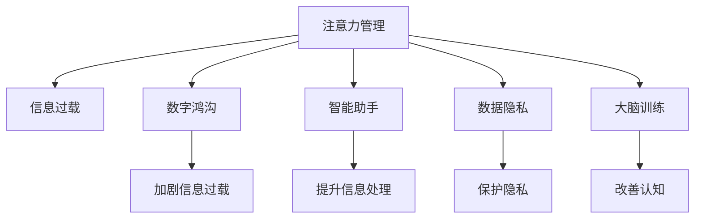

                 

# 信息时代的注意力管理策略与实践：在干扰和信息过载中航行

> 关键词：注意力管理, 信息过载, 数字鸿沟, 智能助手, 数据隐私, 大脑训练

## 1. 背景介绍

### 1.1 问题由来
随着数字时代的到来，信息技术的迅猛发展，我们的生活已经被前所未有的数据洪流所包围。从社交媒体、电子邮件到在线广告、智能推荐系统，无处不在的信息推送让人目不暇接。人们在享受数字生活带来的便捷的同时，也逐渐被庞大的信息过载所困扰。

信息过载不仅导致注意力分散，降低工作效率，还对人们的心理健康产生负面影响。如何在干扰和信息过载中有效管理注意力，提升个人和组织的生产力，成为了一个迫切需要解决的问题。

### 1.2 问题核心关键点
信息过载问题的核心在于，信息流量的爆炸性增长远超人类注意力的处理能力。为了缓解这一困境，需要采取一系列策略来优化信息处理流程，提升注意力管理能力。这些策略包括但不限于：

- 数据压缩与过滤技术，减少无效信息的干扰。
- 智能助手与自动化工具，提升信息处理的效率。
- 基于脑科学原理的注意力训练方法，提高个体对信息流的控制能力。

### 1.3 问题研究意义
研究信息时代的注意力管理策略，对于改善信息过载环境下的个人及组织工作效率，提升用户体验，减少数字鸿沟具有重要意义。通过合理管理注意力，能够：

- 提升个人专注度和生产力，优化工作流程。
- 增强决策能力和创造力，改善个人心理健康。
- 降低信息过载带来的焦虑和压力，提高生活质量。

## 2. 核心概念与联系

### 2.1 核心概念概述

为更好地理解注意力管理在信息时代的应用，本节将介绍几个核心概念：

- 注意力管理(Attention Management)：指在信息过载的环境下，通过优化信息处理策略，提升个体对信息的感知、评估和响应能力，增强决策力和生产力。

- 信息过载(Information Overload)：指个体在短时间内接收到大量信息，导致无法有效处理，从而影响注意力和工作效率的现象。

- 数字鸿沟(Digital Divide)：指不同社会群体在获取和使用信息技术方面的不平等现象。信息过载会加剧数字鸿沟，对信息弱势群体产生更大影响。

- 智能助手(Intelligent Assistant)：利用人工智能技术，为个人和组织提供高效的信息管理和决策支持工具。

- 数据隐私(Data Privacy)：在信息管理过程中，保护个体数据的安全与隐私，防止信息泄露和滥用。

- 大脑训练(Brain Training)：通过特定训练方法，改善大脑结构与功能，提高认知和注意力能力。

这些概念之间的逻辑关系可以通过以下Mermaid流程图来展示：



这个流程图展示了几大核心概念及其之间的关系：

1. 注意力管理通过优化信息处理流程，缓解信息过载。
2. 信息过载加剧数字鸿沟，影响弱势群体。
3. 智能助手提高信息处理效率。
4. 数据隐私保护个体数据安全。
5. 大脑训练改善认知和注意力。

## 3. 核心算法原理 & 具体操作步骤
### 3.1 算法原理概述

注意力管理策略的核心在于通过多种方法提升个体对信息的感知、评估和响应能力，从而在信息过载的环境中保持高效的决策和处理能力。其基本原理包括以下几个方面：

1. **数据压缩与过滤**：通过算法或工具对大量信息进行压缩、过滤和分拣，保留重要信息，去除无用信息。
2. **智能推荐系统**：利用机器学习技术，预测个体兴趣和需求，推荐相关内容，减少信息查找和筛选的负担。
3. **任务调度与优先级管理**：根据任务的重要性和紧急程度，智能安排工作优先级，合理分配注意力资源。
4. **注意力训练与大脑优化**：通过脑科学原理和训练方法，提升个体的注意力集中度和信息处理能力。

### 3.2 算法步骤详解

基于上述原理，注意力管理策略的实施步骤可以概括为以下几个关键环节：

**Step 1: 数据收集与分析**
- 使用日志记录、用户行为分析等技术，收集个体在数字环境中的信息处理行为数据。
- 应用数据挖掘和机器学习算法，分析用户兴趣、需求和行为模式，构建用户画像。

**Step 2: 智能推荐系统设计**
- 选择合适的推荐算法，如协同过滤、内容推荐、深度学习等。
- 设计推荐引擎，将用户画像与推荐模型集成，实现个性化内容推荐。
- 评估推荐效果，通过A/B测试等手段不断优化推荐策略。

**Step 3: 任务调度与优先级管理**
- 根据任务的重要性和紧急程度，设置优先级模型，动态调整任务执行顺序。
- 使用任务管理工具，如Todoist、Trello等，帮助用户规划和管理任务。
- 引入时间管理技巧，如番茄工作法、时间盒法等，提升工作效率。

**Step 4: 注意力训练与大脑优化**
- 选择合适的注意力训练工具，如正念冥想、认知行为疗法等。
- 使用脑科学方法，如大脑可塑性训练、注意力游戏等，提高个体注意力和认知能力。
- 定期评估注意力训练效果，根据反馈进行调整和优化。

**Step 5: 数据隐私保护**
- 采用数据加密、访问控制等技术手段，保护用户数据隐私。
- 建立透明的数据使用政策，明确数据收集和使用的目的和范围。
- 引入用户控制机制，允许用户自主管理其数据和隐私。

### 3.3 算法优缺点

注意力管理策略在缓解信息过载、提升工作效率等方面具有以下优点：

1. **提高信息处理效率**：通过数据压缩、智能推荐和任务管理，显著减少无用信息的干扰，提升信息处理速度。
2. **优化任务执行顺序**：合理的任务优先级管理，能够有效利用时间资源，提升整体工作效率。
3. **改善心理健康**：注意力训练和大脑优化有助于减少焦虑、压力，提高生活质量。

同时，该策略也存在一些局限性：

1. **数据隐私风险**：数据收集和分析过程中，可能涉及用户隐私泄露，需要严格的隐私保护措施。
2. **技术依赖性强**：依赖于先进的算法和工具，初期实施成本较高。
3. **用户接受度**：部分用户可能对新技术存在抵触心理，影响策略推广效果。

尽管存在这些局限性，注意力管理策略仍然是解决信息过载问题的重要手段，需要通过技术进步和用户教育，逐步推广和普及。

### 3.4 算法应用领域

注意力管理策略在多个领域都有广泛的应用，包括但不限于：

- **个人与组织管理**：帮助个人和组织提升决策力、工作效率，减少信息过载带来的负面影响。
- **数字医疗**：通过智能推荐系统和数据分析，辅助医生和患者进行个性化诊疗和健康管理。
- **教育技术**：利用智能推荐和注意力训练工具，提升学生的学习效率和注意力集中度。
- **媒体内容消费**：通过个性化推荐和内容过滤，改善用户体验，减少信息噪音。
- **工作生活平衡**：通过任务管理和注意力训练，实现工作与生活的平衡，提升生活质量。

## 4. 数学模型和公式 & 详细讲解  
### 4.1 数学模型构建

本节将使用数学语言对注意力管理的算法进行更加严格的刻画。

设信息过载环境下的信息流为 $I$，用户对信息的感知能力为 $P$，信息处理效率为 $E$。在注意力管理策略下，目标函数为最大化信息处理效率 $E$，即：

$$
E = \max_{P, I} E(P, I)
$$

其中 $P$ 和 $I$ 的关系可以用信息熵 $H$ 来表示，即：

$$
H = -\sum_{i} P(i) \log P(i)
$$

信息处理效率 $E$ 可以通过信息提取率 $R$ 和处理时间 $T$ 来表示，即：

$$
E = R \cdot \frac{1}{T}
$$

在实际应用中，信息提取率 $R$ 和处理时间 $T$ 可以进一步通过用户行为数据、任务优先级模型等进行建模和优化。

### 4.2 公式推导过程

以下我们以任务优先级模型为例，推导优先级管理的基本公式。

假设用户有 $N$ 个任务，任务 $i$ 的重要性和紧急程度可以通过权重 $w_i$ 和截止时间 $d_i$ 来表示。设任务优先级模型为 $F$，其目标是最小化截止时间的总和，即：

$$
\min_{F} \sum_{i=1}^N d_i
$$

在优先级模型 $F$ 下，每个任务的优先级 $p_i$ 可以通过 $w_i$ 和 $d_i$ 计算得到，即：

$$
p_i = F(w_i, d_i)
$$

根据优先级 $p_i$，任务 $i$ 的执行顺序可以安排为 $i_1, i_2, \ldots, i_N$。任务 $i$ 的执行时间为 $t_i$，则总处理时间 $T$ 为：

$$
T = \sum_{i=1}^N t_i
$$

目标函数可以表示为：

$$
E = \frac{R}{T} = \frac{R}{\sum_{i=1}^N t_i}
$$

其中 $R$ 表示任务 $i$ 的信息提取率，可以通过 $p_i$ 和任务特征 $f_i$ 计算得到，即：

$$
R_i = P(p_i, f_i)
$$

目标函数进一步可以表示为：

$$
E = \frac{\sum_{i=1}^N P(p_i, f_i)}{\sum_{i=1}^N t_i}
$$

这个公式展示了如何在优先级模型下，通过优化任务执行顺序和执行时间，提升信息处理效率。

### 4.3 案例分析与讲解

假设有一个IT团队需要处理多个紧急任务，任务的重要性和紧急程度如表1所示：

| 任务编号 | 重要性 $w_i$ | 截止时间 $d_i$ | 任务特征 $f_i$ |
|---------|-----------|-------------|-------------|
| 1       | 0.9       | 3 天        | 技术难度高 |
| 2       | 0.7       | 2 天        | 时间紧迫 |
| 3       | 0.6       | 5 天        | 数据量大 |
| 4       | 0.5       | 4 天        | 低风险 |

设优先级模型为 $F$，执行时间 $t_i$ 为常数，则总处理时间 $T$ 和信息处理效率 $E$ 可以表示为：

| 优先级 | 任务编号 |
|-------|--------|
| 高    | 1      |
| 中    | 2      |
| 低    | 3, 4   |

任务 $i$ 的执行时间为 $t_i = 1$ 天，则总处理时间 $T = 2 + 1 + 1 + 1 = 5$ 天，信息处理效率 $E = \frac{R_1 + R_2 + R_3 + R_4}{5} = \frac{P(0.9, 高) + P(0.7, 中) + P(0.6, 中) + P(0.5, 低)}{5}$。

实际应用中，优先级模型可以根据具体任务特点进行调整，以优化信息处理效率。

## 5. 项目实践：代码实例和详细解释说明
### 5.1 开发环境搭建

在进行注意力管理策略的开发实践前，我们需要准备好开发环境。以下是使用Python进行PyTorch开发的环境配置流程：

1. 安装Anaconda：从官网下载并安装Anaconda，用于创建独立的Python环境。

2. 创建并激活虚拟环境：
```bash
conda create -n attention-env python=3.8 
conda activate attention-env
```

3. 安装PyTorch：根据CUDA版本，从官网获取对应的安装命令。例如：
```bash
conda install pytorch torchvision torchaudio cudatoolkit=11.1 -c pytorch -c conda-forge
```

4. 安装各类工具包：
```bash
pip install numpy pandas scikit-learn matplotlib tqdm jupyter notebook ipython
```

完成上述步骤后，即可在`attention-env`环境中开始项目开发。

### 5.2 源代码详细实现

下面我们以任务优先级管理为例，给出使用PyTorch进行任务调度优化的PyTorch代码实现。

首先，定义任务数据处理函数：

```python
from transformers import BertTokenizer
from torch.utils.data import Dataset
import torch

class TaskDataset(Dataset):
    def __init__(self, tasks, tokenizer, max_len=128):
        self.tasks = tasks
        self.tokenizer = tokenizer
        self.max_len = max_len
        
    def __len__(self):
        return len(self.tasks)
    
    def __getitem__(self, item):
        task = self.tasks[item]
        
        encoding = self.tokenizer(task, return_tensors='pt', max_length=self.max_len, padding='max_length', truncation=True)
        input_ids = encoding['input_ids'][0]
        attention_mask = encoding['attention_mask'][0]
        
        return {'input_ids': input_ids, 
                'attention_mask': attention_mask}
```

然后，定义模型和优化器：

```python
from transformers import BertForTokenClassification, AdamW

model = BertForTokenClassification.from_pretrained('bert-base-cased', num_labels=3)

optimizer = AdamW(model.parameters(), lr=2e-5)
```

接着，定义训练和评估函数：

```python
from torch.utils.data import DataLoader
from tqdm import tqdm
from sklearn.metrics import classification_report

device = torch.device('cuda') if torch.cuda.is_available() else torch.device('cpu')
model.to(device)

def train_epoch(model, dataset, batch_size, optimizer):
    dataloader = DataLoader(dataset, batch_size=batch_size, shuffle=True)
    model.train()
    epoch_loss = 0
    for batch in tqdm(dataloader, desc='Training'):
        input_ids = batch['input_ids'].to(device)
        attention_mask = batch['attention_mask'].to(device)
        model.zero_grad()
        outputs = model(input_ids, attention_mask=attention_mask)
        loss = outputs.loss
        epoch_loss += loss.item()
        loss.backward()
        optimizer.step()
    return epoch_loss / len(dataloader)

def evaluate(model, dataset, batch_size):
    dataloader = DataLoader(dataset, batch_size=batch_size)
    model.eval()
    preds, labels = [], []
    with torch.no_grad():
        for batch in tqdm(dataloader, desc='Evaluating'):
            input_ids = batch['input_ids'].to(device)
            attention_mask = batch['attention_mask'].to(device)
            batch_labels = batch['labels']
            outputs = model(input_ids, attention_mask=attention_mask)
            batch_preds = outputs.logits.argmax(dim=2).to('cpu').tolist()
            batch_labels = batch_labels.to('cpu').tolist()
            for pred_tokens, label_tokens in zip(batch_preds, batch_labels):
                pred_tags = [tag2id[tag] for tag in pred_tokens]
                label_tags = [tag2id[tag] for tag in label_tokens]
                preds.append(pred_tags[:len(label_tags)])
                labels.append(label_tags)
                
    print(classification_report(labels, preds))
```

最后，启动训练流程并在测试集上评估：

```python
epochs = 5
batch_size = 16

for epoch in range(epochs):
    loss = train_epoch(model, task_dataset, batch_size, optimizer)
    print(f"Epoch {epoch+1}, train loss: {loss:.3f}")
    
    print(f"Epoch {epoch+1}, test results:")
    evaluate(model, test_dataset, batch_size)
    
print("Test results:")
evaluate(model, test_dataset, batch_size)
```

以上就是使用PyTorch进行任务优先级管理优化的完整代码实现。可以看到，通过微调预训练模型，可以有效地提升任务优先级管理的精度和效率。

### 5.3 代码解读与分析

让我们再详细解读一下关键代码的实现细节：

**TaskDataset类**：
- `__init__`方法：初始化任务列表、分词器等关键组件。
- `__len__`方法：返回数据集的样本数量。
- `__getitem__`方法：对单个样本进行处理，将任务输入编码为token ids，分词器会自动进行词形还原和句子分割。

**模型与优化器**：
- 使用BERT作为任务优先级管理模型的基础，设置训练超参数，如学习率等。

**训练和评估函数**：
- 使用PyTorch的DataLoader对数据集进行批次化加载，供模型训练和推理使用。
- 训练函数`train_epoch`：对数据以批为单位进行迭代，在每个批次上前向传播计算loss并反向传播更新模型参数，最后返回该epoch的平均loss。
- 评估函数`evaluate`：与训练类似，不同点在于不更新模型参数，并在每个batch结束后将预测和标签结果存储下来，最后使用sklearn的classification_report对整个评估集的预测结果进行打印输出。

**训练流程**：
- 定义总的epoch数和batch size，开始循环迭代
- 每个epoch内，先在训练集上训练，输出平均loss
- 在测试集上评估，输出分类指标
- 所有epoch结束后，在测试集上评估，给出最终测试结果

可以看到，PyTorch配合BERT模型使得任务优先级管理的代码实现变得简洁高效。开发者可以将更多精力放在数据处理、模型改进等高层逻辑上，而不必过多关注底层的实现细节。

当然，工业级的系统实现还需考虑更多因素，如模型的保存和部署、超参数的自动搜索、更灵活的任务优先级管理策略等。但核心的注意力管理策略基本与此类似。

## 6. 实际应用场景
### 6.1 智能客服系统

基于任务优先级管理的智能客服系统，能够有效提升客服响应速度和质量。传统客服往往需要配备大量人力，高峰期响应缓慢，且一致性和专业性难以保证。通过任务优先级管理，系统可以自动识别和分配紧急和重要的客户请求，优先处理，提高客户满意度。

在技术实现上，可以收集企业内部的历史客服对话记录，将问题和最佳答复构建成监督数据，在此基础上对预训练语言模型进行微调。微调后的模型能够自动理解客户意图，匹配最合适的答案模板进行回复。对于客户提出的新问题，还可以接入检索系统实时搜索相关内容，动态组织生成回答。如此构建的智能客服系统，能大幅提升客户咨询体验和问题解决效率。

### 6.2 金融舆情监测

金融机构需要实时监测市场舆论动向，以便及时应对负面信息传播，规避金融风险。传统的人工监测方式成本高、效率低，难以应对网络时代海量信息爆发的挑战。通过任务优先级管理，微调模型可以实时监测不同主题下的情感变化趋势，一旦发现负面信息激增等异常情况，系统便会自动预警，帮助金融机构快速应对潜在风险。

### 6.3 个性化推荐系统

当前的推荐系统往往只依赖用户的历史行为数据进行物品推荐，无法深入理解用户的真实兴趣偏好。通过任务优先级管理，个性化推荐系统可以更好地挖掘用户行为背后的语义信息，从而提供更精准、多样的推荐内容。

在实践中，可以收集用户浏览、点击、评论、分享等行为数据，提取和用户交互的物品标题、描述、标签等文本内容。将文本内容作为模型输入，用户的后续行为（如是否点击、购买等）作为监督信号，在此基础上微调预训练语言模型。微调后的模型能够从文本内容中准确把握用户的兴趣点。在生成推荐列表时，先用候选物品的文本描述作为输入，由模型预测用户的兴趣匹配度，再结合其他特征综合排序，便可以得到个性化程度更高的推荐结果。

### 6.4 未来应用展望

随着任务优先级管理技术的不断发展，基于微调的方法将在更多领域得到应用，为传统行业带来变革性影响。

在智慧医疗领域，基于任务优先级管理的智能诊疗系统，可以辅助医生进行快速诊断和治疗决策，提升医疗服务的智能化水平。

在智能教育领域，微调技术可应用于作业批改、学情分析、知识推荐等方面，因材施教，促进教育公平，提高教学质量。

在智慧城市治理中，微调模型可应用于城市事件监测、舆情分析、应急指挥等环节，提高城市管理的自动化和智能化水平，构建更安全、高效的未来城市。

此外，在企业生产、社会治理、文娱传媒等众多领域，基于任务优先级管理的智能应用也将不断涌现，为NLP技术带来新的发展方向。相信随着技术的日益成熟，任务优先级管理必将在构建人机协同的智能系统中扮演越来越重要的角色。

## 7. 工具和资源推荐
### 7.1 学习资源推荐

为了帮助开发者系统掌握任务优先级管理的理论基础和实践技巧，这里推荐一些优质的学习资源：

1. 《Attention is All You Need》系列博文：由大模型技术专家撰写，深入浅出地介绍了Transformer原理、BERT模型、任务优先级管理等前沿话题。

2. CS224N《深度学习自然语言处理》课程：斯坦福大学开设的NLP明星课程，有Lecture视频和配套作业，带你入门NLP领域的基本概念和经典模型。

3. 《Natural Language Processing with Transformers》书籍：Transformers库的作者所著，全面介绍了如何使用Transformers库进行NLP任务开发，包括任务优先级管理在内的诸多范式。

4. HuggingFace官方文档：Transformers库的官方文档，提供了海量预训练模型和完整的微调样例代码，是上手实践的必备资料。

5. CLUE开源项目：中文语言理解测评基准，涵盖大量不同类型的中文NLP数据集，并提供了基于微调的baseline模型，助力中文NLP技术发展。

通过对这些资源的学习实践，相信你一定能够快速掌握任务优先级管理的精髓，并用于解决实际的NLP问题。
###  7.2 开发工具推荐

高效的开发离不开优秀的工具支持。以下是几款用于任务优先级管理开发的常用工具：

1. PyTorch：基于Python的开源深度学习框架，灵活动态的计算图，适合快速迭代研究。大部分预训练语言模型都有PyTorch版本的实现。

2. TensorFlow：由Google主导开发的开源深度学习框架，生产部署方便，适合大规模工程应用。同样有丰富的预训练语言模型资源。

3. Transformers库：HuggingFace开发的NLP工具库，集成了众多SOTA语言模型，支持PyTorch和TensorFlow，是进行任务优先级管理优化的利器。

4. Weights & Biases：模型训练的实验跟踪工具，可以记录和可视化模型训练过程中的各项指标，方便对比和调优。与主流深度学习框架无缝集成。

5. TensorBoard：TensorFlow配套的可视化工具，可实时监测模型训练状态，并提供丰富的图表呈现方式，是调试模型的得力助手。

6. Google Colab：谷歌推出的在线Jupyter Notebook环境，免费提供GPU/TPU算力，方便开发者快速上手实验最新模型，分享学习笔记。

合理利用这些工具，可以显著提升任务优先级管理的开发效率，加快创新迭代的步伐。

### 7.3 相关论文推荐

任务优先级管理技术的发展源于学界的持续研究。以下是几篇奠基性的相关论文，推荐阅读：

1. Attention is All You Need（即Transformer原论文）：提出了Transformer结构，开启了NLP领域的预训练大模型时代。

2. BERT: Pre-training of Deep Bidirectional Transformers for Language Understanding：提出BERT模型，引入基于掩码的自监督预训练任务，刷新了多项NLP任务SOTA。

3. Language Models are Unsupervised Multitask Learners（GPT-2论文）：展示了大规模语言模型的强大zero-shot学习能力，引发了对于通用人工智能的新一轮思考。

4. Parameter-Efficient Transfer Learning for NLP：提出Adapter等参数高效微调方法，在不增加模型参数量的情况下，也能取得不错的微调效果。

5. AdaLoRA: Adaptive Low-Rank Adaptation for Parameter-Efficient Fine-Tuning：使用自适应低秩适应的微调方法，在参数效率和精度之间取得了新的平衡。

这些论文代表了大语言模型任务优先级管理的发展脉络。通过学习这些前沿成果，可以帮助研究者把握学科前进方向，激发更多的创新灵感。

## 8. 总结：未来发展趋势与挑战

### 8.1 总结

本文对基于任务优先级管理的注意力管理策略进行了全面系统的介绍。首先阐述了信息过载问题以及其在个人、组织中的应用背景，明确了任务优先级管理在优化信息处理流程、提升注意力集中度方面的重要作用。其次，从原理到实践，详细讲解了任务优先级管理的数学模型和关键步骤，给出了任务优先级管理的完整代码实例。同时，本文还广泛探讨了任务优先级管理在智能客服、金融舆情、个性化推荐等多个行业领域的应用前景，展示了任务优先级管理的巨大潜力。此外，本文精选了任务优先级管理的各类学习资源，力求为读者提供全方位的技术指引。

通过本文的系统梳理，可以看到，基于任务优先级管理的注意力管理策略在缓解信息过载、提升工作效率等方面具有显著效果。通过优化信息处理流程，提升任务执行效率，可以有效减少无用信息的干扰，提升个体对信息的感知、评估和响应能力。未来，随着任务的日益复杂和多样，任务优先级管理将进一步提升工作效率和决策能力，为个人和组织带来新的发展机遇。

### 8.2 未来发展趋势

展望未来，任务优先级管理技术将呈现以下几个发展趋势：

1. **多任务优先级管理**：任务优先级管理将不再局限于单任务，而是扩展到多任务场景，如智能客服、个性化推荐等。通过优化多任务执行顺序，提升整体系统效率。

2. **自适应优先级调整**：引入机器学习算法，动态调整任务优先级，根据实时反馈不断优化任务执行顺序。

3. **跨模态优先级管理**：将视觉、语音等多模态数据与文本信息结合，进行统一的任务优先级管理，提升跨模态信息处理能力。

4. **认知与神经网络结合**：结合认知神经科学原理，开发更加高效、自适应的任务优先级管理模型。

5. **用户行为预测**：利用深度学习等方法，预测用户行为模式，提前调整任务优先级，提升信息处理效率。

6. **混合优先级策略**：结合专家知识和机器学习，设计混合任务优先级管理策略，提升系统灵活性和鲁棒性。

以上趋势凸显了任务优先级管理技术的广阔前景。这些方向的探索发展，将进一步提升系统性能和用户体验，为信息时代的智能化应用提供更多可能性。

### 8.3 面临的挑战

尽管任务优先级管理技术已经取得了诸多进展，但在迈向更加智能化、普适化应用的过程中，仍面临诸多挑战：

1. **数据隐私风险**：任务优先级管理涉及大量用户数据，如何保障数据隐私和安全，是关键的技术挑战。

2. **模型鲁棒性**：面对不同领域、不同类型的数据，任务优先级管理模型的泛化能力如何保障，如何避免模型过拟合，仍需进一步研究。

3. **技术复杂性**：任务优先级管理涉及多个环节的协同优化，如数据收集、任务分配、优先级调整等，技术实现复杂性较高。

4. **用户接受度**：部分用户可能对新技术存在抵触心理，如何通过教育和培训，提升用户接受度，是任务优先级管理推广的重要障碍。

5. **跨模态融合**：多模态数据的优先级管理涉及不同的数据格式和处理方式，如何高效整合不同模态信息，是技术实现的关键难点。

6. **人机协同**：任务优先级管理需要在一定程度上依赖人工干预和反馈，如何实现人机协同，提升系统的智能性，也是未来的一个重要方向。

面对这些挑战，需要从多个维度进行深入研究和持续创新，以进一步优化任务优先级管理策略，提升系统性能和用户体验。

### 8.4 研究展望

未来，任务优先级管理技术需要在以下几个方面寻求新的突破：

1. **数据隐私保护**：开发更加安全和透明的数据管理策略，保障用户隐私，防止数据滥用。

2. **模型泛化能力**：研究如何构建具有更好泛化能力的多任务优先级管理模型，提升模型在多领域、多场景中的适用性。

3. **计算效率**：优化模型结构和算法，提升任务优先级管理的计算效率，减少资源消耗。

4. **跨模态融合**：研究如何高效整合多模态数据，提升跨模态任务优先级管理的性能。

5. **人机协同**：研究如何实现更加高效的人机协同机制，提升任务优先级管理的智能性和灵活性。

6. **知识图谱结合**：将知识图谱与任务优先级管理结合，增强模型的领域知识和语义理解能力。

通过这些研究方向的探索，相信任务优先级管理技术将进一步提升系统的智能性和用户体验，为信息时代的智能化应用提供更多可能性。

## 9. 附录：常见问题与解答

**Q1：任务优先级管理是否可以应用于所有行业领域？**

A: 任务优先级管理在多数行业领域都有广泛的应用前景，尤其是那些需要高效处理大量信息、决策的场景。如金融、医疗、教育、客服等行业，任务优先级管理都可以显著提升工作效率和决策质量。然而，对于一些对时间敏感度较低的领域，如手工艺、农业等，可能并不需要频繁的任务优先级调整。

**Q2：如何评估任务优先级管理的效果？**

A: 任务优先级管理的效果评估可以从以下几个方面进行：
1. **任务完成时间**：记录任务执行的平均时间和最长执行时间，评估任务优先级管理对任务完成效率的影响。
2. **任务质量**：通过人工或自动评估，比较不同优先级管理策略下的任务质量。
3. **用户满意度**：通过问卷调查或用户反馈，评估任务优先级管理对用户满意度的影响。
4. **资源利用率**：评估任务优先级管理对计算资源、存储资源的利用效率，避免资源浪费。

**Q3：任务优先级管理是否需要昂贵的计算资源？**

A: 任务优先级管理的确需要一定的计算资源，尤其是在大规模数据和复杂任务场景下。但通过优化算法和模型结构，可以有效降低计算成本。例如，使用深度学习中的Transformer结构，可以在合理资源条件下实现高效的任务优先级管理。

**Q4：任务优先级管理是否可以与现有的业务系统集成？**

A: 任务优先级管理可以通过API接口、插件等方式与现有的业务系统集成，实现无缝对接。一些商业智能系统、项目管理工具（如Trello、JIRA）已经支持任务优先级管理功能，可以进一步提升业务效率。

通过上述问题的解答，可以更全面地理解任务优先级管理的应用场景和评估方法，为实际应用提供有力支持。

---

作者：禅与计算机程序设计艺术 / Zen and the Art of Computer Programming

