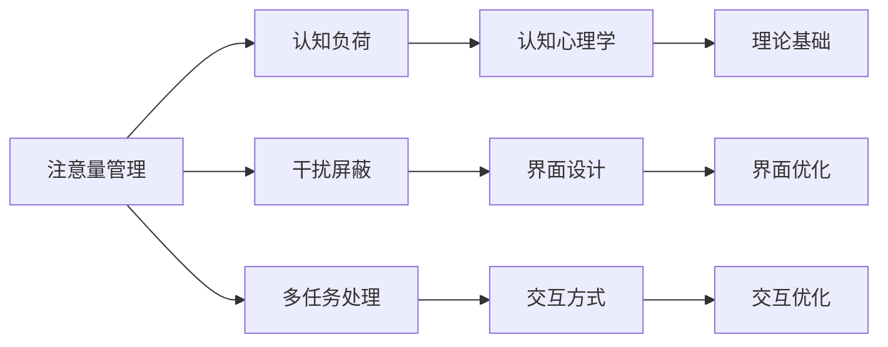

                 

# 信息时代的注意量管理挑战与策略：在干扰和信息过载中航行

> 关键词：信息过载,注意量管理,认知负荷,干扰屏蔽,多任务处理,认知心理学,人机交互,技术应用

## 1. 背景介绍

### 1.1 问题由来
随着信息技术迅猛发展，信息环境正变得越来越复杂和动态。在线工作、社交媒体、移动应用等互联网服务，不断向用户推送海量信息，导致用户面临越来越严重的注意量（Attention Load）管理挑战。用户注意力被无限分割，难以集中精力完成复杂任务，工作和生活效率均受到严重影响。认知负荷（Cognitive Load）和干扰（Distraction）问题日益突出，已经成为当下信息社会亟需解决的重要问题。

### 1.2 问题核心关键点
注意量管理问题集中在以下几方面：
- **信息过载（Information Overload）**：用户处理的信息量远超个人认知能力，导致注意量超载，难以做出明智决策。
- **认知负荷（Cognitive Load）**：在复杂的信息环境中，认知资源被占用，难以高效完成多任务。
- **干扰（Distraction）**：频繁的中断和不可控事件（如短信、通知）打乱工作节奏，降低生产效率。
- **多任务处理（Multitasking）**：用户在多任务间频繁切换，产生注意量竞争，严重影响任务完成质量。
- **人机交互设计（Human-Computer Interaction）**：界面设计、交互方式等对用户的注意量管理有重大影响。

## 2. 核心概念与联系

### 2.1 核心概念概述

为更好地理解注意量管理的核心概念及其相互关系，以下进行详细阐述：

- **注意量管理（Attention Load Management）**：指对注意资源的有效分配和管理，通过减少干扰和信息过载，优化多任务处理，降低认知负荷，提升工作效率。
- **认知负荷（Cognitive Load）**：指在认知任务中，需要投入的注意资源、记忆资源等，包括内在认知负荷和外在认知负荷。
- **干扰（Distraction）**：指打断用户当前任务的任何外部刺激，如通知、弹出窗口等。
- **多任务处理（Multitasking）**：指用户在同一时间处理多项任务，可能导致注意量分配不当，降低任务完成质量。
- **认知心理学（Cognitive Psychology）**：研究人类认知过程的心理学分支，涉及注意、记忆、学习等方面，为注意量管理提供理论基础。
- **人机交互设计（Human-Computer Interaction）**：关注人与计算机交互的界面设计和交互方式，直接影响注意量的分配和任务执行效率。

### 2.2 核心概念原理和架构的 Mermaid 流程图



该流程图展示了注意量管理的核心概念及其相互关系：

1. 注意量管理通过减少干扰、屏蔽干扰、优化多任务处理、降低认知负荷等手段，提升注意量分配效率。
2. 认知负荷是注意量管理的基础，需理解其形成机制和影响因素。
3. 干扰屏蔽通过优化界面设计和交互方式，减少外部干扰，提升用户专注度。
4. 多任务处理通过合理安排任务优先级和切换方式，避免注意量冲突，提升任务完成效率。
5. 认知心理学提供注意量管理的理论基础，理解人类认知过程，有助于优化设计。
6. 界面设计和交互方式对注意量分配有直接影响，优化设计和方式有助于提高注意量管理效果。

## 3. 核心算法原理 & 具体操作步骤

### 3.1 算法原理概述
注意量管理的目标是通过合理分配和管理注意资源，提升用户的注意效率和任务完成质量。基于认知负荷理论，我们提出以下算法原理：

1. **认知负荷分析**：分析当前任务所需的内在认知负荷和外在认知负荷，决定应分配的注意量。
2. **干扰屏蔽机制**：识别干扰源，屏蔽不必要的通知和弹出窗口，降低干扰带来的注意资源消耗。
3. **多任务优化**：使用任务优先级排序、时间分块等方法，优化多任务处理流程，减少注意量冲突。
4. **注意量调度**：根据任务复杂度和用户当前状态，动态调整注意量分配，保持最佳认知状态。

### 3.2 算法步骤详解
以下是基于上述原理的具体操作步骤：

1. **认知负荷分析**
   - **内在认知负荷（Intrinsic Cognitive Load）**：通过任务难度、复杂度等指标评估任务所需的认知资源。
   - **外在认知负荷（Extrinsic Cognitive Load）**：考虑外部干扰、任务间切换等影响，评估用户注意量分配情况。
   - **计算认知负荷（Cognitive Load）**：结合内在和外在负荷，计算任务所需的总认知负荷。
   
2. **干扰屏蔽机制**
   - **干扰源识别**：利用数据分析工具，识别用户的干扰源（如手机通知、社交媒体等）。
   - **干扰屏蔽策略**：设计用户偏好定制的干扰屏蔽策略，减少干扰对注意量的占用。
   - **实时干扰监控**：使用AI技术实时监控用户状态，主动屏蔽干扰。

3. **多任务优化**
   - **任务优先级排序**：根据任务重要性和截止时间，排序任务优先级，确保高优先级任务得到充分注意。
   - **时间分块策略**：将工作时间分块，每块时间内专注于单一任务，减少注意量冲突。
   - **多任务切换优化**：使用平滑切换策略，减少多任务间的注意量切换损耗。

4. **注意量调度**
   - **动态调整注意量**：根据任务进展和用户反馈，动态调整注意量的分配。
   - **注意量分配算法**：设计动态调整算法，确保注意量在不同任务间高效分配。
   - **最佳认知状态保持**：监控用户状态，适时调整注意量分配，保持最佳认知状态。

### 3.3 算法优缺点
注意量管理算法具有以下优点：

- **提升效率**：通过优化多任务处理和注意量分配，提升任务完成效率。
- **减少干扰**：通过屏蔽干扰和实时监控，降低干扰对认知负荷的影响。
- **增强专注度**：通过优化界面和交互设计，提升用户专注度，避免注意量分散。

同时，算法也存在以下缺点：

- **数据依赖**：算法效果依赖于准确的数据分析，数据获取和处理难度较大。
- **用户个性化**：不同用户对干扰和注意量的管理需求各异，算法需个性化调整。
- **动态性挑战**：用户状态和任务需求动态变化，算法需持续优化。
- **技术复杂度**：涉及数据分析、机器学习、人机交互等多个技术领域，实现难度较高。

### 3.4 算法应用领域
注意量管理算法具有广泛的应用场景，包括但不限于：

- **办公室和家庭办公环境**：通过优化工作环境，减少干扰，提升办公效率。
- **教育场景**：通过个性化调整，帮助学生更好地集中注意力，提高学习效率。
- **健康管理**：通过减少干扰和优化任务处理，提高用户的注意力和生产效率，辅助健康管理。
- **工业自动化**：在工厂环境中，通过注意量管理优化操作流程，提升生产效率和安全性。
- **远程协作**：通过优化多任务处理和减少干扰，提升远程团队的协作效率。

## 4. 数学模型和公式 & 详细讲解 & 举例说明

### 4.1 数学模型构建
基于认知负荷理论，我们构建了一个数学模型来评估和优化注意量管理。模型主要包括以下几个变量：

- **任务复杂度（Task Complexity）**：表示任务的难度和复杂度，用 $C$ 表示。
- **任务所需认知负荷（Cognitive Load）**：用 $L$ 表示，包括内在负荷和外在负荷。
- **干扰程度（Distraction Level）**：用 $D$ 表示，描述干扰源的频率和强度。
- **用户专注度（User Focus）**：用 $F$ 表示，反映用户当前的专注状态。

### 4.2 公式推导过程
根据上述变量，我们建立如下公式：

$$
L = f(C, D, F)
$$

其中，$f$ 表示认知负荷的计算函数，考虑任务复杂度、干扰程度和用户专注度。

具体推导如下：

1. **任务复杂度对认知负荷的影响**：
$$
L_{task} = C \times k_1
$$
其中，$k_1$ 为复杂度系数，表示任务复杂度对认知负荷的影响。

2. **干扰程度对认知负荷的影响**：
$$
L_{distraction} = D \times k_2
$$
其中，$k_2$ 为干扰系数，表示干扰程度对认知负荷的影响。

3. **用户专注度对认知负荷的影响**：
$$
L_{focus} = F \times k_3
$$
其中，$k_3$ 为专注度系数，表示用户专注度对认知负荷的影响。

4. **综合计算认知负荷**：
$$
L = L_{task} + L_{distraction} + L_{focus}
$$

### 4.3 案例分析与讲解
以开发一个基于信息过载的管理系统为例：

1. **数据采集**：通过日志、传感器等手段，实时采集用户的操作行为、注意量分配等数据。
2. **认知负荷分析**：分析当前任务的复杂度和所需认知负荷，并实时更新。
3. **干扰屏蔽**：识别干扰源，根据用户偏好，主动屏蔽通知和弹出窗口，减少干扰。
4. **多任务优化**：根据任务优先级和用户专注度，动态调整任务顺序和时间分块策略。
5. **注意量调度**：实时监控用户状态，动态调整注意量分配，保持最佳认知状态。

## 5. 项目实践：代码实例和详细解释说明

### 5.1 开发环境搭建

为了进行注意量管理系统的开发，需要搭建一个完整的开发环境。以下是具体的搭建步骤：

1. **选择编程语言和框架**：选择 Python 作为主要开发语言，使用 Flask 和 Django 构建 Web 应用程序。
2. **安装开发环境**：安装 Anaconda 或 Docker 环境，确保所需依赖库的安装。
3. **配置数据采集工具**：安装并配置日志、传感器等数据采集工具，确保实时数据获取。
4. **集成第三方库**：集成 TensorFlow、PyTorch 等机器学习库，用于认知负荷分析等计算。

### 5.2 源代码详细实现

以下是一个基于认知负荷分析的注意量管理系统的 Python 代码实现：

```python
import tensorflow as tf
import pandas as pd
import numpy as np

# 定义认知负荷计算函数
def calculate_cognitive_load(task_complexity, distraction_level, user_focus):
    k1 = 0.5  # 任务复杂度系数
    k2 = 0.3  # 干扰系数
    k3 = 0.2  # 专注度系数

    # 计算各部分认知负荷
    task_load = task_complexity * k1
    distraction_load = distraction_level * k2
    focus_load = user_focus * k3

    # 综合计算认知负荷
    cognitive_load = task_load + distraction_load + focus_load
    return cognitive_load

# 加载用户数据
user_data = pd.read_csv('user_data.csv')

# 获取当前任务信息
current_task = user_data.iloc[-1]['current_task']
task_complexity = 5  # 当前任务复杂度

# 获取干扰源信息
distraction_sources = user_data.iloc[-1]['distraction_sources']
distraction_level = 0.2  # 干扰程度

# 获取用户专注度信息
user_focus_level = user_data.iloc[-1]['user_focus_level']
user_focus = 0.6  # 用户专注度

# 计算当前任务认知负荷
cognitive_load = calculate_cognitive_load(task_complexity, distraction_level, user_focus)

# 输出计算结果
print(f"当前任务认知负荷：{cognitive_load}")
```

### 5.3 代码解读与分析

以上代码实现了基本的认知负荷计算函数，用于评估当前任务的注意量需求。具体分析如下：

- **数据采集和加载**：通过读取用户数据，获取当前任务、干扰源和专注度等信息，为计算提供基础数据。
- **认知负荷计算**：根据任务复杂度、干扰程度和专注度，使用公式计算认知负荷，得出当前任务所需的注意量。
- **结果输出**：将计算结果输出，供后续决策和优化使用。

## 6. 实际应用场景

### 6.1 企业办公环境

注意量管理在企业办公环境中具有广泛应用。企业员工在工作期间，面临的任务复杂度和干扰源多种多样，通过注意量管理工具，可以显著提升工作效率：

1. **任务分析与优先级排序**：实时分析员工当前任务，并根据复杂度和截止时间排序，确保高优先级任务得到充分注意。
2. **干扰屏蔽与实时监控**：屏蔽不必要的通知和弹出窗口，实时监控员工状态，减少干扰。
3. **时间分块与任务切换优化**：将工作时间分块，每块时间内专注于单一任务，减少注意量冲突。
4. **个性化调整**：根据员工偏好和专注度，动态调整注意量分配，提升专注度和工作效率。

### 6.2 远程教育

在远程教育场景中，注意量管理同样至关重要：

1. **学习任务分析**：分析学生的学习任务和所需认知负荷，动态调整注意量分配。
2. **干扰屏蔽**：屏蔽不必要的干扰，如社交媒体、即时通讯工具等，确保学生专注学习。
3. **学习进度监控**：实时监控学生的学习状态和任务完成情况，提供个性化的学习建议。
4. **学习环境优化**：根据学生的专注度和学习效率，优化学习环境，如调整屏幕亮度、音量等。

### 6.3 医疗健康管理

注意量管理在医疗健康管理中也具有重要应用：

1. **医疗操作管理**：在医疗操作中，减少干扰和注意量冲突，提高手术成功率和患者安全性。
2. **健康数据监控**：通过实时监控患者的健康数据，减少干扰，提升护理效果。
3. **个性化健康建议**：根据患者的健康状况和专注度，提供个性化的健康建议和饮食方案。

## 7. 工具和资源推荐

### 7.1 学习资源推荐

为了更好地掌握注意量管理的理论和实践，以下是一些推荐的学习资源：

1. **《认知心理学导论》**：介绍认知负荷理论、注意力机制等基础概念，适合初学者入门。
2. **《人机交互设计》**：讲解界面设计和交互方式，提升注意量管理效果。
3. **《多任务处理：理论与实践》**：分析多任务处理的优缺点，提供优化方法。
4. **《机器学习实战》**：介绍机器学习算法和工具，用于认知负荷分析和干扰屏蔽。
5. **《信息过载管理》**：详细介绍信息过载现象和注意量管理方法，适合深入学习。

### 7.2 开发工具推荐

以下是几款常用的开发工具，用于注意量管理系统的开发：

1. **Flask & Django**：轻量级 Web 框架，用于构建用户界面和后台管理系统。
2. **TensorFlow & PyTorch**：深度学习库，用于认知负荷分析和实时监控。
3. **Jupyter Notebook**：交互式编程环境，用于数据处理和模型验证。
4. **Prometheus & Grafana**：监控工具，用于实时监控系统状态和注意量分配情况。
5. **Azure & AWS**：云平台，提供高可用性和扩展性，支持大规模系统部署。

### 7.3 相关论文推荐

以下是几篇相关的论文，推荐阅读：

1. **《信息过载：认知负荷与多任务处理》**：介绍信息过载现象和注意量管理方法。
2. **《基于深度学习的注意量管理》**：介绍使用深度学习技术进行注意量管理的方法。
3. **《用户注意力模型：理论和应用》**：详细分析用户注意力的形成和影响因素。
4. **《多任务处理中的注意量管理》**：分析多任务处理中的注意量竞争和优化方法。

## 8. 总结：未来发展趋势与挑战

### 8.1 研究成果总结

注意量管理算法在信息时代具有重要应用价值，提升了用户的工作效率和生活质量。通过优化多任务处理和注意量分配，减少了干扰和信息过载对认知负荷的影响。

### 8.2 未来发展趋势

1. **深度学习与认知负荷分析**：利用深度学习技术，提高认知负荷分析的准确性和实时性。
2. **个性化与自适应**：开发个性化和自适应算法，根据用户状态和偏好动态调整注意量分配。
3. **多模态数据融合**：结合视觉、听觉等多模态数据，全面评估用户注意量分配情况。
4. **人机协作**：开发人机协作系统，提升用户注意量管理的效果。
5. **智能推荐**：利用推荐系统，为用户推荐最优的任务处理策略和时间分块方案。

### 8.3 面临的挑战

尽管注意量管理取得了一定进展，但仍面临诸多挑战：

1. **数据获取与处理**：注意量管理依赖大量实时数据，数据获取和处理难度较大。
2. **个性化调整**：不同用户对注意量管理的需求各异，算法需个性化调整。
3. **动态性**：用户状态和任务需求动态变化，算法需持续优化。
4. **技术复杂度**：涉及认知心理学、深度学习、人机交互等多个领域，实现难度较高。
5. **伦理与安全**：注意量管理涉及用户隐私和数据安全问题，需严格保障。

### 8.4 研究展望

未来的研究需要在以下几个方面寻求新的突破：

1. **跨领域应用**：将注意量管理技术应用于更多领域，如工业自动化、智慧城市等。
2. **实时性优化**：提升注意量管理算法的实时性，满足快速反应需求。
3. **可解释性与透明性**：提高注意量管理算法的可解释性，增强用户信任。
4. **社会影响研究**：研究注意量管理对社会生产力和生活质量的影响，提供更全面的应用策略。
5. **跨学科融合**：将注意量管理技术与认知心理学、神经科学等学科相结合，提供更全面的解决方案。

## 9. 附录：常见问题与解答

**Q1：注意量管理是否适用于所有用户？**

A: 注意量管理算法适用于大多数用户，但需根据用户类型和需求进行个性化调整。对于特殊人群，如老年人、儿童等，还需考虑其认知特点和特定需求。

**Q2：注意量管理对多任务处理有什么影响？**

A: 注意量管理通过优化多任务处理流程，提升任务完成效率。通过时间分块和任务优先级排序，减少注意量冲突，避免多任务间的干扰和切换损耗。

**Q3：注意量管理算法的计算复杂度如何？**

A: 注意量管理算法的计算复杂度较高，涉及数据采集、认知负荷分析、干扰屏蔽等多个环节。通过优化算法和引入机器学习技术，可以降低计算复杂度。

**Q4：注意量管理如何适应不同任务需求？**

A: 注意量管理算法通过任务分析、干扰屏蔽和注意量调度等手段，适应不同任务需求。根据任务的复杂度和优先级，动态调整注意量分配，确保最优认知状态。

**Q5：注意量管理如何保证数据安全？**

A: 注意量管理算法涉及大量用户数据，需采取严格的隐私保护措施，如数据匿名化、加密传输等。同时，需建立完善的用户隐私保护政策和数据使用规范。

---

作者：禅与计算机程序设计艺术 / Zen and the Art of Computer Programming

