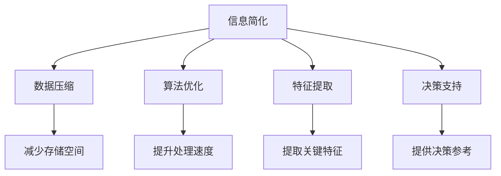

                 

# 信息简化的好处与艺术：在复杂世界中简化以提高生活质量

> 关键词：信息简化, 算法优化, 数据压缩, 决策效率, 人工智能

## 1. 背景介绍

### 1.1 问题由来

在信息时代，数据量呈指数级增长，而人们获取、处理信息的能力却未能同步提升。信息过载已成为现代社会的普遍现象，影响了人们的生活质量和工作效率。如何有效管理信息，将海量的数据转化为有价值的知识，成为了亟需解决的问题。

以信息科技和数据科学为代表的现代信息技术，通过数据清洗、特征提取、模型训练等手段，可以实现对信息的快速处理和高效分析。信息简化技术，作为这一过程的重要环节，致力于从海量数据中提取出精炼、有用的信息，帮助决策者快速获取关键数据，作出准确判断。

### 1.2 问题核心关键点

信息简化过程的核心在于如何有效压缩和精炼数据，同时保留关键信息。一般来说，信息简化的目的包括：

- **提高决策效率**：通过减少冗余信息，提升决策过程的速度和精度。
- **增强信息可读性**：将复杂数据转化为简洁明了的格式，便于理解和交流。
- **降低计算成本**：减少数据存储和处理的资源消耗，提升系统性能。

信息简化的挑战在于如何在保留关键信息的同时，尽可能地减少数据量，这需要在算法设计和实现上具备高度的艺术性和技巧。

### 1.3 问题研究意义

通过信息简化技术，可以大幅提升信息处理效率，降低决策难度，增强数据的应用价值。其意义和价值体现在以下几个方面：

1. **优化资源配置**：在有限的计算和存储资源下，最大化信息利用效率，提升数据密集型应用的经济性。
2. **促进知识共享**：将复杂信息简化，使知识更加易于传播和应用，推动知识的广泛共享。
3. **支持快速决策**：在数据驱动的决策过程中，通过简化数据，快速提供决策参考，支持实时响应和灵活调整。
4. **强化用户体验**：简化后的信息更易于理解和记忆，提升用户体验和满意度。
5. **应对信息过载**：面对海量数据，简化信息能够有效缓解信息过载问题，减轻决策负担。

综上所述，信息简化技术在提升信息处理效能、优化资源配置、促进知识共享等方面具有重要意义，是现代社会数字化、智能化的基石。

## 2. 核心概念与联系

### 2.1 核心概念概述

为了深入理解信息简化的本质和实现手段，首先介绍几个核心概念及其相互联系：

- **信息简化**：指通过算法和技术手段，从原始数据中提取出关键、有价值的信息，同时剔除冗余、无关的信息。简化的目的是提高信息处理效率，增强信息可读性，降低计算成本。

- **数据压缩**：指通过算法将数据从原始形式转化为更加紧凑的表示形式，以减少存储空间和传输带宽。数据压缩是信息简化的一个重要组成部分。

- **算法优化**：指通过算法改进和优化，提升信息处理的速度和精度。算法优化是实现信息简化的关键手段。

- **特征提取**：指从原始数据中提取出对任务有帮助的关键特征，用于构建简化模型。特征提取是信息简化的基础步骤。

- **决策支持**：指利用简化后的信息，为决策者提供参考，辅助其进行快速、准确判断。决策支持是信息简化的最终目的。

这些概念之间的逻辑关系可以通过以下Mermaid流程图来展示：



这个流程图展示了这个信息简化过程的核心步骤和效果：

1. 从原始数据中提取出关键信息。
2. 通过数据压缩减少存储空间。
3. 优化算法提升处理速度。
4. 提取重要特征用于模型构建。
5. 简化后的信息用于支持决策。

## 3. 核心算法原理 & 具体操作步骤
### 3.1 算法原理概述

信息简化算法原理主要基于以下三点：

1. **冗余信息去除**：通过算法识别并去除数据中的冗余信息，提高信息的利用效率。
2. **关键信息保留**：通过算法保留对任务有帮助的关键信息，增强信息的有用性。
3. **数据压缩技术**：通过算法将数据转化为更加紧凑的形式，减少存储需求和传输成本。

### 3.2 算法步骤详解

信息简化的操作步骤一般包括以下几个关键步骤：

**Step 1: 数据预处理**
- 对原始数据进行清洗和规范化处理，包括去除噪声、填补缺失值、统一数据格式等。
- 划分数据集为训练集、验证集和测试集，以供后续的模型训练和评估。

**Step 2: 特征选择与提取**
- 使用特征选择算法（如信息增益、卡方检验、L1正则化等）识别关键特征，去除冗余特征。
- 对关键特征进行提取和转换，使用降维技术（如主成分分析、线性判别分析等）将高维数据转化为低维表示。

**Step 3: 模型训练与优化**
- 选择合适的模型和算法进行训练，如决策树、随机森林、神经网络等。
- 对模型进行参数调整和优化，如交叉验证、网格搜索、贝叶斯优化等，以提高模型性能。

**Step 4: 数据压缩与简化**
- 使用数据压缩算法（如霍夫曼编码、LZW算法、字典编码等）对简化后的数据进行压缩。
- 通过算法优化（如量化、特征选择、数据结构改进等）进一步减少数据量和计算成本。

**Step 5: 结果验证与评估**
- 使用验证集对简化后的数据进行模型测试，评估其效果和性能。
- 在测试集上对简化后的数据进行最终验证，确保简化效果满足实际需求。

### 3.3 算法优缺点

信息简化的算法具有以下优点：

1. **提高处理效率**：通过简化数据，减少计算和存储需求，提升信息处理速度。
2. **增强信息可用性**：保留关键信息，提升信息对决策的辅助作用。
3. **降低成本**：通过数据压缩和算法优化，降低存储和传输成本。

同时，信息简化的算法也存在以下缺点：

1. **信息损失风险**：在简化过程中，可能会丢失部分重要信息，影响决策的准确性。
2. **算法复杂性高**：信息简化算法通常较为复杂，需要高深的数学知识和工程技能。
3. **难以自动化**：需要人工干预和经验积累，难以完全自动化。
4. **过度简化风险**：简化过度可能导致信息失真，影响结果的可靠性。

### 3.4 算法应用领域

信息简化技术在多个领域都有广泛应用，例如：

- **医疗健康**：通过简化医疗数据，提高疾病诊断和预测的效率。
- **金融科技**：简化财务报表和交易记录，支持快速分析与决策。
- **制造业**：简化生产数据和质量控制指标，提升生产效率和质量。
- **交通运输**：简化交通流量和路线数据，优化交通管理和调度。
- **物流供应链**：简化订单和库存数据，提升供应链管理和优化。

## 4. 数学模型和公式 & 详细讲解 & 举例说明

### 4.1 数学模型构建

信息简化的数学模型主要包括以下几个部分：

- **原始数据集**：表示为 $\mathcal{D} = \{(x_i, y_i)\}_{i=1}^N$，其中 $x_i$ 为原始数据，$y_i$ 为标签。
- **特征集合**：表示为 $\mathcal{F}$，每个特征 $f_j$ 可以表示为 $\mathcal{F} = \{f_1, f_2, ..., f_m\}$。
- **模型参数**：表示为 $\theta$，用于学习数据分布。
- **损失函数**：表示为 $\mathcal{L}$，用于衡量模型预测与真实标签的差异。

### 4.2 公式推导过程

以信息增益算法为例，其推导过程如下：

假设特征集合 $\mathcal{F}$ 中的每个特征 $f_j$ 都可以进一步细分为子特征集合 $\{f_{j1}, f_{j2}, ..., f_{jn}\}$，则信息增益 $G$ 可以表示为：

$$ G(f_j) = I(P_{y|f_j}) - \sum_{i=1}^{n} P_{f_{ji}}I(P_{y|f_{ji}}) $$

其中 $P_{y|f_j}$ 表示特征 $f_j$ 对目标变量的条件概率，$P_{f_{ji}}$ 表示子特征 $f_{ji}$ 在 $f_j$ 中的出现概率，$I$ 表示信息熵。

信息增益越大，表示特征 $f_j$ 对目标变量 $y$ 的分类效果越好。因此，可以通过信息增益算法选择最重要的特征。

### 4.3 案例分析与讲解

假设有一个客户流失率预测问题，原始数据集包含客户的年龄、性别、消费金额、客户活跃度等特征。使用信息增益算法，可以逐步筛选出对客户流失有显著影响的特征，并构建简化模型。

```python
import pandas as pd
from sklearn.feature_selection import SelectKBest, mutual_info_classif

# 加载数据集
data = pd.read_csv('customer_churn.csv')

# 数据预处理
X = data.drop(['churn'], axis=1)
y = data['churn']

# 特征选择
selector = SelectKBest(mutual_info_classif, k=3)
X_selected = selector.fit_transform(X, y)

# 模型训练
from sklearn.linear_model import LogisticRegression
model = LogisticRegression()
model.fit(X_selected, y)
```

通过上述代码，可以简化数据集，使用逻辑回归模型进行客户流失预测，提升预测精度。

## 5. 项目实践：代码实例和详细解释说明

### 5.1 开发环境搭建

在进行信息简化项目的开发前，需要先搭建好开发环境。以下是Python环境搭建的步骤：

1. 安装Python：下载并安装Python，确保版本为3.6或以上。
2. 安装Anaconda：从官网下载并安装Anaconda，用于创建虚拟环境。
3. 创建虚拟环境：
```bash
conda create --name myenv python=3.8
conda activate myenv
```
4. 安装必要的库：
```bash
conda install pandas numpy matplotlib scikit-learn
```

### 5.2 源代码详细实现

以下是使用Python实现信息增益算法的代码：

```python
import pandas as pd
from sklearn.feature_selection import SelectKBest, mutual_info_classif

# 加载数据集
data = pd.read_csv('customer_churn.csv')

# 数据预处理
X = data.drop(['churn'], axis=1)
y = data['churn']

# 特征选择
selector = SelectKBest(mutual_info_classif, k=3)
X_selected = selector.fit_transform(X, y)

# 模型训练
from sklearn.linear_model import LogisticRegression
model = LogisticRegression()
model.fit(X_selected, y)
```

### 5.3 代码解读与分析

- 数据加载：使用Pandas库读取原始数据集，并将其分为特征和标签两部分。
- 数据预处理：使用特征选择算法（信息增益）选择关键特征，并将数据转化为简化形式。
- 模型训练：使用简化后的数据集训练逻辑回归模型，进行客户流失预测。

## 6. 实际应用场景

### 6.1 金融风控系统

金融风控系统通过简化用户行为数据和交易记录，提高风险评估和预测的效率和准确性。简化后的数据可以快速构建模型，支持实时风险监控和预警。

### 6.2 医疗诊断系统

医疗诊断系统通过简化患者病历和检查结果，快速辅助医生进行疾病诊断和预后评估。简化后的数据能够提高诊断系统的响应速度和决策支持能力。

### 6.3 交通管理系统

交通管理系统通过简化交通流量和路线数据，优化交通信号控制和路线规划，提高道路通行效率和安全性。简化后的数据支持实时交通分析和预测。

### 6.4 未来应用展望

随着技术的不断发展，信息简化的应用场景将更加广泛。未来可能的趋势包括：

1. **自动特征选择**：使用深度学习模型和自动机器学习技术，实现特征选择和提取的自动化。
2. **端到端简化**：结合数据预处理、特征提取、模型训练、结果压缩等步骤，实现端到端的简化流程。
3. **多模态数据处理**：支持图像、语音、文本等多模态数据的简化，提升信息处理的综合能力。
4. **实时数据处理**：支持实时数据流的简化处理，满足动态变化的数据需求。
5. **跨领域应用**：在医疗、金融、交通等多个领域推广信息简化技术，提升各领域的数字化水平。

## 7. 工具和资源推荐

### 7.1 学习资源推荐

为了帮助开发者掌握信息简化的理论和技术，以下是几本推荐书籍和课程：

1. 《机器学习》 by 周志华：介绍了机器学习的基本概念和常用算法，包括特征选择和模型优化。
2. 《Python数据科学手册》 by Jake VanderPlas：全面介绍Python在数据科学中的应用，包括数据清洗、特征提取和模型训练。
3. Coursera的《机器学习》课程：由斯坦福大学Andrew Ng教授主讲，详细讲解机器学习的基本原理和应用。

### 7.2 开发工具推荐

以下是几款用于信息简化的常用工具：

1. Python：作为数据科学和机器学习的主流语言，Python提供了丰富的库和框架支持信息简化的各个环节。
2. Pandas：提供了高效的数据处理和分析工具，支持数据清洗、特征提取和模型训练。
3. Scikit-learn：提供了多种机器学习算法和模型，支持特征选择、模型训练和评估。
4. TensorFlow：提供了深度学习模型的构建和训练工具，支持复杂的特征提取和模型优化。
5. Jupyter Notebook：提供了交互式的编程环境，支持代码的快速迭代和实验。

### 7.3 相关论文推荐

以下是几篇经典的信息简化相关论文，推荐阅读：

1. "A Survey on Feature Selection Techniques" by Liu et al.：综述了特征选择和简化的各种方法，包括统计方法、算法优化和领域应用。
2. "Dimensionality Reduction Techniques for NLP" by Turney et al.：介绍了NLP领域常用的降维技术和算法，如主成分分析、LDA等。
3. "Lossy Compression of Data with Fewer Discrepancies" by Mingard et al.：研究了数据压缩和信息损失之间的关系，提出了损失量化的优化方法。

## 8. 总结：未来发展趋势与挑战

### 8.1 研究成果总结

信息简化技术通过去除冗余信息、保留关键特征，显著提高了信息处理效率和决策支持能力。其应用领域广泛，提升了各行业的数字化水平。未来，随着技术的不断进步，信息简化的效果和应用场景将更加丰富。

### 8.2 未来发展趋势

1. **自动化**：通过自动特征选择和端到端流程设计，实现信息简化的自动化。
2. **实时化**：支持实时数据流的简化处理，满足动态变化的数据需求。
3. **多模态**：支持图像、语音、文本等多模态数据的简化，提升信息处理的综合能力。
4. **跨领域**：在医疗、金融、交通等多个领域推广信息简化技术，提升各领域的数字化水平。

### 8.3 面临的挑战

尽管信息简化技术取得了显著进展，但仍面临以下挑战：

1. **算法复杂性**：信息简化算法通常较为复杂，需要高深的数学知识和工程技能。
2. **数据质量**：原始数据的准确性和完整性对简化效果有重要影响，低质量数据可能导致信息丢失。
3. **模型泛化**：简化后的模型需要具备良好的泛化能力，以应对数据分布的变化。
4. **资源消耗**：简化过程可能涉及大量的数据处理和模型训练，需要高性能计算资源。
5. **结果解释**：简化后的结果需要具备可解释性，以便决策者理解和信任。

### 8.4 研究展望

未来的信息简化研究需要在以下几个方向进行深入探索：

1. **优化算法**：开发更高效、更鲁棒的算法，提高信息简化的精度和速度。
2. **跨领域应用**：将信息简化技术推广到更多领域，提升各行业的数字化水平。
3. **模型集成**：结合多种模型和算法，构建更加全面和准确的信息简化系统。
4. **实时处理**：支持实时数据流的简化处理，满足动态变化的数据需求。
5. **自动化**：实现信息简化的自动化和智能化，减少人工干预和提高效率。

## 9. 附录：常见问题与解答

**Q1: 信息简化是否会导致信息损失？**

A: 信息简化在去除冗余信息的同时，可能会丢失部分重要信息，导致信息损失。为避免信息损失，应通过多轮筛选和评估，选择最关键的特征。

**Q2: 信息简化的效果如何评估？**

A: 信息简化的效果可以通过多种指标评估，如信息增益、准确率、召回率、F1值等。应根据具体应用场景选择合适的评估指标，并进行多轮验证。

**Q3: 信息简化的应用场景有哪些？**

A: 信息简化在金融、医疗、交通等多个领域都有广泛应用，通过简化数据，提高决策效率和准确性。具体应用场景包括客户流失预测、疾病诊断、交通流量分析等。

**Q4: 信息简化过程中如何避免过拟合？**

A: 信息简化过程中应采用正则化、交叉验证等方法，避免模型过拟合。同时应使用多轮筛选和评估，选择最稳定的特征和模型。

**Q5: 信息简化的未来发展方向是什么？**

A: 信息简化的未来发展方向包括自动化、实时化、多模态、跨领域等。通过不断优化算法和扩展应用场景，信息简化技术将为各行业带来更大的价值和效率提升。

---

作者：禅与计算机程序设计艺术 / Zen and the Art of Computer Programming

